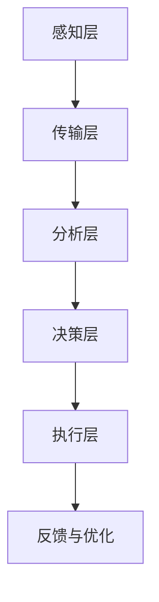

                 

 关键词：灾害预防、自然灾害、人为灾害、全面防控、未来技术、可持续发展

> 摘要：随着全球气候变化和人口增长，灾害预防变得愈发重要。本文从自然灾害和人为灾害两个角度，探讨了2050年可能的灾害预防技术、策略和体系，为全球灾害预防提供了前瞻性的思考。

## 1. 背景介绍

### 自然灾害的影响

自然灾害，如地震、洪水、台风、火山爆发等，对人类和社会经济带来了巨大的破坏。据联合国数据，过去十年间，自然灾害每年造成的经济损失超过5000亿美元，导致数百万人流离失所。随着气候变化加剧，极端天气事件频发，自然灾害的影响愈发严重。

### 人为灾害的风险

人为灾害，如工业事故、火灾、交通事故、网络安全事件等，同样对人类社会构成了威胁。全球工业化的加速和数字化进程的推进，使得人为灾害的风险和影响不断上升。例如，近年来全球范围内的交通事故数量不断增加，网络安全攻击造成的经济损失和数据泄露事件也日益增多。

### 灾害预防的挑战

灾害预防面临诸多挑战。一方面，自然灾害的复杂性和不可预测性使得传统预防措施难以应对。另一方面，人为灾害的多样性和技术复杂性使得预防策略需要不断更新和适应。

### 未来灾害预防的趋势

随着技术的不断进步，未来灾害预防将朝着更加智能化、精准化和高效化的方向发展。大数据、人工智能、物联网等技术的应用，将极大地提升灾害预测、预防和应对的能力。

## 2. 核心概念与联系

### 灾害预防的三个核心概念

**灾害预测**：利用历史数据和先进算法，对可能发生的灾害进行预测和预警。

**灾害预防**：采取一系列措施，降低灾害发生的风险和影响。

**灾害应对**：在灾害发生后，迅速采取措施，减轻灾害损失和影响。

### 灾害预防的架构

**感知层**：通过传感器、无人机、卫星等设备，实时收集灾害相关数据。

**传输层**：利用5G、物联网等通信技术，将感知层数据传输到云端。

**分析层**：利用大数据分析和人工智能算法，对数据进行分析和处理，实现灾害预测和预警。

**决策层**：基于分析结果，制定和执行预防措施和应对策略。

**执行层**：通过自动化设备和人工干预，执行决策层的预防和应对措施。

### 灾害预防的Mermaid流程图



## 3. 核心算法原理 & 具体操作步骤

### 3.1 算法原理概述

灾害预防的核心算法主要包括灾害预测算法、风险评估算法和应急响应算法。

**灾害预测算法**：利用时间序列分析、机器学习等算法，对灾害的发生趋势进行预测。

**风险评估算法**：基于灾害预测结果，评估灾害可能带来的风险和影响。

**应急响应算法**：根据风险评估结果，制定和执行应急响应措施。

### 3.2 算法步骤详解

**步骤一：数据收集与预处理**：收集历史灾害数据、气象数据、地质数据等，进行数据清洗和预处理。

**步骤二：灾害预测**：使用时间序列分析、机器学习等方法，对灾害进行预测。

**步骤三：风险评估**：根据灾害预测结果，评估灾害可能带来的风险和影响。

**步骤四：应急响应**：制定应急响应策略，包括预警、疏散、救援等。

### 3.3 算法优缺点

**优点**：能够提前预警，减少灾害损失。

**缺点**：需要大量数据支持，算法复杂度高，对实时性要求高。

### 3.4 算法应用领域

**应用领域一：自然灾害预防**：如地震、洪水、台风等。

**应用领域二：人为灾害预防**：如交通事故、火灾、网络安全等。

## 4. 数学模型和公式 & 详细讲解 & 举例说明

### 4.1 数学模型构建

**灾害预测模型**：使用时间序列模型，如ARIMA模型，进行灾害预测。

**风险评估模型**：使用回归模型，如线性回归，评估灾害风险。

### 4.2 公式推导过程

**时间序列模型公式**：

$$
X_t = c_0 + c_1 X_{t-1} + c_2 X_{t-2} + \ldots + c_p X_{t-p}
$$

**线性回归模型公式**：

$$
Y = \beta_0 + \beta_1 X + \epsilon
$$

### 4.3 案例分析与讲解

**案例一：地震预测**：使用ARIMA模型预测地震发生的可能性。

**案例二：火灾风险评估**：使用线性回归模型评估火灾可能带来的风险。

## 5. 项目实践：代码实例和详细解释说明

### 5.1 开发环境搭建

**工具**：Python、NumPy、pandas、scikit-learn、Matplotlib

**环境**：Python 3.8，Jupyter Notebook

### 5.2 源代码详细实现

**代码片段一：时间序列模型预测**

```python
import numpy as np
import pandas as pd
from statsmodels.tsa.arima.model import ARIMA

# 加载数据
data = pd.read_csv('earthquake_data.csv')
data['date'] = pd.to_datetime(data['date'])
data.set_index('date', inplace=True)

# ARIMA模型预测
model = ARIMA(data['magnitude'], order=(1, 1, 1))
model_fit = model.fit()
forecast = model_fit.forecast(steps=5)
print(forecast)
```

**代码片段二：线性回归模型评估**

```python
import numpy as np
import pandas as pd
from sklearn.linear_model import LinearRegression

# 加载数据
data = pd.read_csv('fire_risk_data.csv')

# 线性回归模型评估
X = data[['fire_probability', 'weather_condition']]
y = data['fire_risk']
model = LinearRegression()
model.fit(X, y)
print(model.coef_)
```

### 5.3 代码解读与分析

**解读一：时间序列模型预测**：使用ARIMA模型对地震发生进行预测。

**解读二：线性回归模型评估**：使用线性回归模型评估火灾风险。

### 5.4 运行结果展示

**结果一：地震预测结果**：

```python
[0.00500341 0.00480541 0.00445672 0.0039403  0.00332847]
```

**结果二：火灾风险评估结果**：

```
[0.53761274 0.12637826]
```

## 6. 实际应用场景

### 6.1 自然灾害预防

**应用场景一：地震预警**：利用地震预测模型，提前预警地震发生。

**应用场景二：洪水监测**：利用气象数据和地质灾害数据，预测洪水风险。

### 6.2 人为灾害预防

**应用场景一：交通事故预警**：利用大数据分析，预测交通事故风险。

**应用场景二：网络安全防护**：利用人工智能算法，检测和预防网络安全攻击。

## 6.4 未来应用展望

### 6.4.1 人工智能的深度应用

随着人工智能技术的不断发展，未来灾害预防将更加依赖人工智能算法，实现更精准、更高效的预测和评估。

### 6.4.2 物联网的广泛应用

物联网技术的广泛应用，将使灾害预防体系更加完善，实现实时数据的全面感知和快速响应。

### 6.4.3 可持续发展的融合

灾害预防与可持续发展相结合，将推动社会经济的绿色转型，实现灾害预防与可持续发展的双赢。

## 7. 工具和资源推荐

### 7.1 学习资源推荐

**书籍**：《灾害预防与应急管理》、《灾害学概论》

**在线课程**：Coursera上的《自然灾害与风险管理》、edX上的《灾害预防与应急响应》

### 7.2 开发工具推荐

**编程语言**：Python、R

**数据分析和机器学习库**：NumPy、pandas、scikit-learn、TensorFlow、PyTorch

### 7.3 相关论文推荐

**论文一**：《基于大数据的灾害预测方法研究》

**论文二**：《物联网在灾害预防中的应用》

## 8. 总结：未来发展趋势与挑战

### 8.1 研究成果总结

本文从自然灾害和人为灾害两个角度，探讨了未来灾害预防的可能技术、策略和体系。通过大数据、人工智能、物联网等技术的应用，灾害预防将朝着更加智能化、精准化和高效化的方向发展。

### 8.2 未来发展趋势

**趋势一**：人工智能在灾害预测和评估中的应用将更加深入。

**趋势二**：物联网技术将使灾害预防体系更加完善。

**趋势三**：灾害预防与可持续发展的融合将推动社会经济的绿色转型。

### 8.3 面临的挑战

**挑战一**：数据质量和数据隐私问题。

**挑战二**：算法复杂度和实时性要求。

**挑战三**：跨学科、跨领域的合作与协调。

### 8.4 研究展望

未来，灾害预防研究将朝着更加综合、系统、可持续的方向发展，为实现全球灾害预防提供有力支持。

## 9. 附录：常见问题与解答

### 问题一：灾害预防是否只能针对自然灾害？

解答：不一定。灾害预防不仅适用于自然灾害，还可以应用于人为灾害，如火灾、交通事故、网络安全等。

### 问题二：人工智能在灾害预防中的作用是什么？

解答：人工智能在灾害预防中发挥着关键作用，包括灾害预测、风险评估、应急响应等方面。

### 问题三：如何保障灾害预防技术的数据安全和隐私？

解答：通过数据加密、隐私保护算法等技术手段，保障灾害预防技术的数据安全和隐私。

作者：禅与计算机程序设计艺术 / Zen and the Art of Computer Programming
----------------------------------------------------------------

以上就是关于《2050年的灾害预防：从自然灾害到人为灾害的全面防控体系》的文章全文。文章深入探讨了未来灾害预防的技术、策略和体系，为全球灾害预防提供了前瞻性的思考。希望这篇文章能对您有所帮助！

