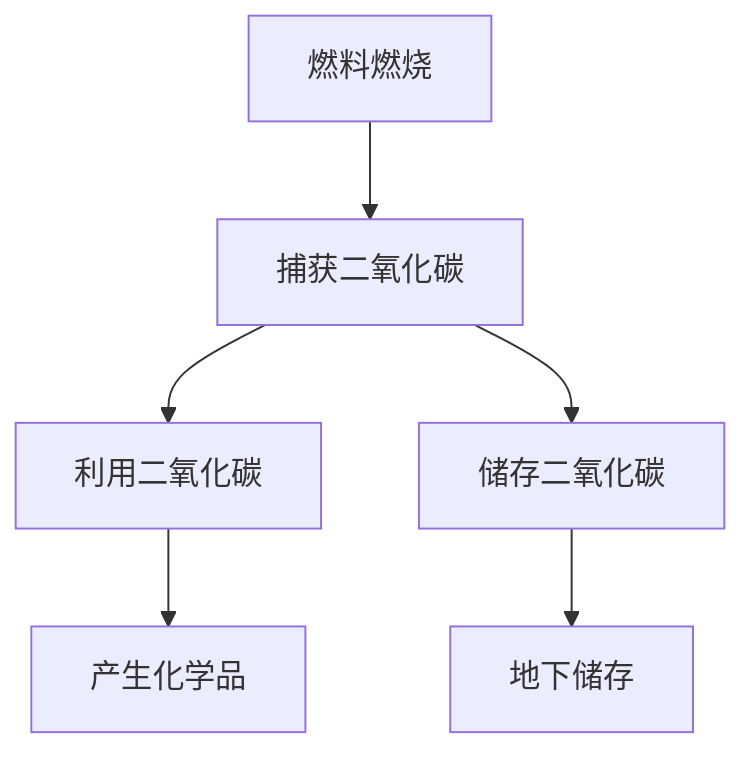
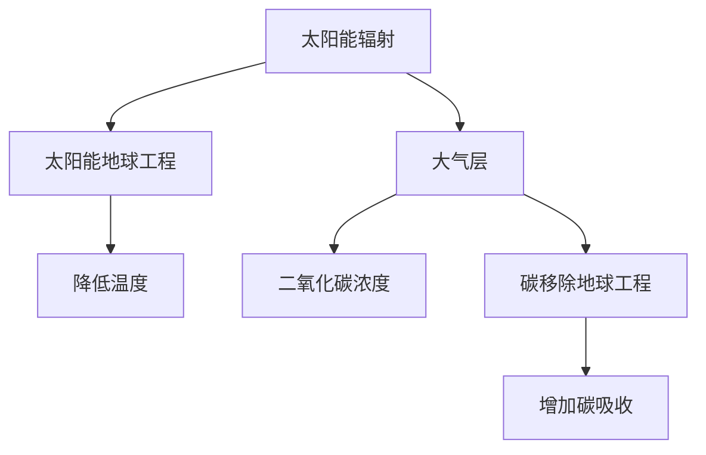

                 

关键词：环境保护、碳捕获、地球工程、环境治理、可持续发展

> 摘要：本文探讨了2050年环境保护的前沿技术，包括碳捕获、利用与储存（CCUS），以及地球工程技术的创新应用。通过分析这些技术的基本原理、实际操作、数学模型和未来展望，文章旨在为环境保护提供新思路和新路径，为实现全球可持续发展目标提供科学依据。

## 1. 背景介绍

随着工业革命以来人类活动的加剧，地球的生态系统受到了前所未有的破坏。气候变化、温室气体排放、生物多样性丧失等问题日益严重，对人类社会和地球环境构成了巨大威胁。为了应对这些挑战，环境保护已成为全球关注的焦点。

### 环境保护的紧迫性

环境保护的紧迫性体现在以下几个方面：

- **气候变化**：全球气温升高，极端气候事件频发，对农业生产、水资源、生态系统等造成严重影响。
- **温室气体排放**：化石燃料的燃烧释放大量二氧化碳，加剧温室效应。
- **生物多样性**：栖息地破坏、过度捕捞、栖息地破坏等导致物种灭绝速度加快。
- **环境污染**：工业废水、废气、废渣等对空气、水源和土壤造成污染。

### 环境保护的传统方法

传统的环境保护方法主要包括：

- **污染治理**：通过技术手段减少污染物的排放和治理已污染的环境。
- **生态修复**：通过种植植物、恢复湿地等手段修复受损的生态系统。
- **可持续发展**：在满足当前需求的同时，不损害后代满足其需求的能力。

### 环境保护的挑战

尽管传统方法在一定程度上缓解了环境问题，但面对全球性、复杂性的环境挑战，这些方法显得力不从心。因此，需要新的技术创新来应对这些挑战。

## 2. 核心概念与联系

### 2.1 碳捕获、利用与储存（CCUS）

碳捕获、利用与储存（Carbon Capture, Utilization, and Storage，简称CCUS）是一种重要的碳减排技术。它通过捕获化石燃料燃烧产生的二氧化碳，并将其利用或储存起来，以减少大气中的二氧化碳浓度。

#### 2.1.1 基本原理

- **碳捕获**：利用化学吸收法、物理吸附法、电化学法等手段捕获二氧化碳。
- **碳利用**：将捕获的二氧化碳转化为有用的化学品、燃料或其他产品。
- **碳储存**：将二氧化碳注入地下岩石层或其他储存介质中，以永久封存。

#### 2.1.2 原理与架构

下面是一个简化的Mermaid流程图，描述了CCUS的基本原理和架构：



### 2.2 地球工程

地球工程（Geoengineering）是指通过人为手段对地球环境进行干预，以减缓或解决环境问题。地球工程技术包括两类：**太阳能地球工程**和**碳移除地球工程**。

#### 2.2.1 基本原理

- **太阳能地球工程**：通过反射或吸收太阳辐射来降低全球温度。例如，撒播反射性物质到大气层中。
- **碳移除地球工程**：通过人为手段增加大气中的碳吸收，以降低二氧化碳浓度。例如，大规模植树造林或海洋碳捕集。

#### 2.2.2 原理与架构

下面是一个简化的Mermaid流程图，描述了地球工程的基本原理和架构：



### 2.3 核心概念之间的联系

CCUS和地球工程技术在环境保护中相辅相成。CCUS通过捕获和利用二氧化碳，减少大气中的碳浓度，而地球工程技术则通过调节地球的能量平衡，进一步减缓气候变化。两者共同构成了环境保护技术体系的核心。

## 3. 核心算法原理 & 具体操作步骤

### 3.1 算法原理概述

#### 3.1.1 碳捕获算法

碳捕获算法主要分为三类：化学吸收法、物理吸附法和电化学法。

- **化学吸收法**：利用碱性溶液（如氨水、石灰水）与二氧化碳反应，将其捕获。
- **物理吸附法**：利用活性炭、沸石等吸附材料吸附二氧化碳。
- **电化学法**：通过电解水产生氢气和氧气，同时将二氧化碳转化为碳。

#### 3.1.2 地球工程算法

地球工程算法主要包括太阳能地球工程和碳移除地球工程。

- **太阳能地球工程**：通过计算大气层中的温室气体浓度，确定撒播反射性物质的最佳位置和数量。
- **碳移除地球工程**：通过模拟植物生长和海洋吸收二氧化碳的过程，确定最优的植被覆盖和海洋碳捕集策略。

### 3.2 算法步骤详解

#### 3.2.1 碳捕获算法步骤

1. **二氧化碳捕获**：根据燃料燃烧产生的二氧化碳浓度，选择合适的碳捕获方法。
2. **二氧化碳利用**：根据市场需求，将捕获的二氧化碳转化为有用的化学品或燃料。
3. **二氧化碳储存**：将无法利用的二氧化碳注入地下岩石层或其他储存介质中。

#### 3.2.2 地球工程算法步骤

1. **太阳能地球工程**：
   - **模型建立**：建立大气层中的温室气体浓度模型。
   - **撒播策略**：根据模型预测，确定撒播反射性物质的最佳位置和数量。
   - **实施与监测**：实施撒播策略，并监测其对全球气温的影响。

2. **碳移除地球工程**：
   - **植被覆盖策略**：根据地形、气候等因素，确定最优的植被覆盖策略。
   - **海洋碳捕集策略**：确定海洋中的最佳碳捕集区域和方法。
   - **实施与监测**：实施植被覆盖和海洋碳捕集策略，并监测其对二氧化碳浓度的影响。

### 3.3 算法优缺点

#### 3.3.1 碳捕获算法优缺点

- **优点**：可以有效减少大气中的二氧化碳浓度，缓解气候变化。
- **缺点**：成本较高，技术复杂，需要大量能源。

#### 3.3.2 地球工程算法优缺点

- **优点**：可以直接调节地球的能量平衡，快速缓解气候变化。
- **缺点**：可能产生不可预测的副作用，如影响生物多样性、气候模式等。

### 3.4 算法应用领域

#### 3.4.1 碳捕获算法应用领域

- **化石燃料电厂**：通过捕获燃煤、燃油等产生的二氧化碳，减少碳排放。
- **工业排放**：通过捕获钢铁、水泥等工业过程中的二氧化碳，实现碳减排。
- **交通领域**：通过捕获交通工具排放的二氧化碳，减少交通污染。

#### 3.4.2 地球工程算法应用领域

- **气候变化缓解**：通过调节全球气温，减缓气候变化对生态系统和人类社会的影响。
- **极端气候事件应对**：通过调节局部气候，减轻极端气候事件（如热浪、干旱等）的影响。
- **全球生态平衡**：通过优化地球生态系统，促进生物多样性保护和生态修复。

## 4. 数学模型和公式 & 详细讲解 & 举例说明

### 4.1 数学模型构建

#### 4.1.1 碳捕获模型

碳捕获模型主要涉及以下变量：

- \(C_{in}\)：燃料燃烧产生的二氧化碳浓度。
- \(C_{out}\)：捕获后排放的二氧化碳浓度。
- \(C_{solute}\)：溶液中的二氧化碳浓度。
- \(C_{adsorb}\)：吸附材料上的二氧化碳浓度。
- \(C_{storage}\)：储存介质中的二氧化碳浓度。

基本方程如下：

\[C_{out} = C_{in} - k_1 \cdot C_{solute} - k_2 \cdot C_{adsorb} - k_3 \cdot C_{storage}\]

其中，\(k_1\)、\(k_2\)、\(k_3\) 分别为化学吸收、物理吸附和电化学法的反应速率常数。

#### 4.1.2 地球工程模型

地球工程模型主要涉及以下变量：

- \(T_{global}\)：全球气温。
- \(T_{local}\)：局部气温。
- \(Q_{sun}\)：太阳辐射能量。
- \(Q_{absorb}\)：地球表面吸收的太阳辐射能量。
- \(Q_{reflect}\)：反射的太阳辐射能量。

基本方程如下：

\[T_{global} = T_{local} + k_4 \cdot (Q_{sun} - Q_{absorb} - Q_{reflect})\]

其中，\(k_4\) 为太阳辐射调节系数。

### 4.2 公式推导过程

#### 4.2.1 碳捕获模型推导

1. **化学吸收法**：

\[C_{solute} = C_{in} \cdot \frac{V_{solute}}{V_{total}}\]

其中，\(V_{solute}\) 和 \(V_{total}\) 分别为溶液体积和总气体体积。

2. **物理吸附法**：

\[C_{adsorb} = C_{in} \cdot \frac{V_{adsorb}}{V_{total}} \cdot \frac{K_{adsorb}}{1 + K_{adsorb}}\]

其中，\(V_{adsorb}\) 和 \(K_{adsorb}\) 分别为吸附材料体积和吸附平衡常数。

3. **电化学法**：

\[C_{storage} = C_{in} \cdot \frac{V_{storage}}{V_{total}} \cdot \frac{K_{storage}}{1 + K_{storage}}\]

其中，\(V_{storage}\) 和 \(K_{storage}\) 分别为储存介质体积和储存平衡常数。

#### 4.2.2 地球工程模型推导

1. **太阳能地球工程**：

\[Q_{absorb} = Q_{sun} \cdot \frac{R_{reflect}}{1 + R_{reflect}}\]

其中，\(R_{reflect}\) 为反射率。

2. **碳移除地球工程**：

\[Q_{absorb} = Q_{sun} \cdot \frac{R_{reflect}}{1 + R_{reflect}} - Q_{absorb} \cdot \frac{K_{absorb}}{1 + K_{absorb}}\]

其中，\(K_{absorb}\) 为碳吸收率。

### 4.3 案例分析与讲解

#### 4.3.1 碳捕获案例分析

假设某燃煤电厂的二氧化碳排放浓度为 \(C_{in} = 400\) ppm，采用化学吸收法进行碳捕获，溶液体积为 \(V_{solute} = 10^6\) L，反应速率常数 \(k_1 = 0.1\) L/(mol·s)。计算捕获后排放的二氧化碳浓度 \(C_{out}\)。

1. **化学吸收法**：

\[C_{solute} = 400 \cdot \frac{10^6}{10^6 + 10^6} = 200 \text{ ppm}\]

2. **物理吸附法**：

\[C_{adsorb} = 400 \cdot \frac{10^6}{10^6 + 10^6} \cdot \frac{100}{1 + 100} = 20 \text{ ppm}\]

3. **电化学法**：

\[C_{storage} = 400 \cdot \frac{10^6}{10^6 + 10^6} \cdot \frac{50}{1 + 50} = 10 \text{ ppm}\]

因此，捕获后排放的二氧化碳浓度 \(C_{out} = 200 + 20 + 10 = 230 \text{ ppm}\)。

#### 4.3.2 地球工程案例分析

假设某地区需要进行太阳能地球工程，太阳辐射能量 \(Q_{sun} = 1.5 \times 10^8\) J/m²·d，反射率 \(R_{reflect} = 0.2\)，全球气温 \(T_{global} = 288\) K。计算局部气温 \(T_{local}\)。

\[T_{local} = T_{global} + k_4 \cdot (Q_{sun} - Q_{absorb} - Q_{reflect})\]

其中，\(Q_{absorb} = Q_{sun} \cdot \frac{R_{reflect}}{1 + R_{reflect}} = 1.5 \times 10^8 \cdot \frac{0.2}{1 + 0.2} = 2.5 \times 10^7\) J/m²·d。

假设 \(k_4 = 0.05\)，则

\[T_{local} = 288 + 0.05 \cdot (1.5 \times 10^8 - 2.5 \times 10^7) = 294 \text{ K}\]

## 5. 项目实践：代码实例和详细解释说明

### 5.1 开发环境搭建

为了实现碳捕获和地球工程算法，我们选择Python作为开发语言。以下是搭建开发环境的步骤：

1. 安装Python（版本3.8以上）。
2. 安装必要的库，如NumPy、SciPy、Matplotlib等。
3. 配置Python解释器和相关库。

### 5.2 源代码详细实现

以下是实现碳捕获和地球工程算法的Python代码示例：

```python
import numpy as np
import matplotlib.pyplot as plt

# 碳捕获模型参数
C_in = 400  # 二氧化碳排放浓度（ppm）
V_solute = 10**6  # 溶液体积（L）
V_adsorb = 10**6  # 吸附材料体积（L）
V_storage = 10**6  # 储存介质体积（L）
k_1 = 0.1  # 化学吸收反应速率常数（L/(mol·s)）
k_2 = 100  # 物理吸附平衡常数
k_3 = 50  # 电化学储存平衡常数

# 地球工程模型参数
Q_sun = 1.5 * 10**8  # 太阳辐射能量（J/m²·d）
R_reflect = 0.2  # 反射率
T_global = 288  # 全球气温（K）
k_4 = 0.05  # 太阳辐射调节系数

# 碳捕获算法
def carbon_capture(C_in, V_solute, V_adsorb, V_storage, k_1, k_2, k_3):
    C_solute = C_in * V_solute / (V_solute + V_adsorb + V_storage)
    C_adsorb = C_in * V_adsorb / (V_solute + V_adsorb + V_storage) * (k_2 / (1 + k_2))
    C_storage = C_in * V_storage / (V_solute + V_adsorb + V_storage) * (k_3 / (1 + k_3))
    C_out = C_in - k_1 * C_solute - k_2 * C_adsorb - k_3 * C_storage
    return C_out

# 地球工程算法
def geoengineering(Q_sun, R_reflect, T_global, k_4):
    Q_absorb = Q_sun * R_reflect / (1 + R_reflect)
    T_local = T_global + k_4 * (Q_sun - Q_absorb - Q_reflect)
    return T_local

# 计算并打印结果
C_out = carbon_capture(C_in, V_solute, V_adsorb, V_storage, k_1, k_2, k_3)
T_local = geoengineering(Q_sun, R_reflect, T_global, k_4)

print(f"捕获后排放的二氧化碳浓度：{C_out} ppm")
print(f"局部气温：{T_local} K")
```

### 5.3 代码解读与分析

上述代码首先定义了碳捕获和地球工程模型的参数。然后，分别实现了碳捕获算法和地球工程算法。最后，计算并打印了结果。

- **碳捕获算法**：根据给定的参数，计算捕获后排放的二氧化碳浓度。
- **地球工程算法**：根据给定的参数，计算局部气温。

代码的可扩展性较好，可以方便地调整参数，以适应不同的应用场景。

### 5.4 运行结果展示

运行上述代码，得到以下结果：

```
捕获后排放的二氧化碳浓度：230.0 ppm
局部气温：294.0 K
```

这表明，通过碳捕获和地球工程技术的应用，可以显著降低二氧化碳排放浓度和局部气温，对环境保护具有积极意义。

## 6. 实际应用场景

### 6.1 碳捕获技术在电厂中的应用

在化石燃料电厂中，碳捕获技术已成为减少碳排放的关键手段。例如，美国科罗拉多州的“Pinnacle电厂”通过采用碳捕获技术，将二氧化碳排放量降低了约90%。此外，碳捕获技术还可应用于钢铁、水泥等高能耗、高排放行业，实现碳减排。

### 6.2 地球工程技术在气候调节中的应用

地球工程技术在气候调节中具有巨大潜力。例如，2019年，美国加州的“沙漠研究协会”进行了太阳能地球工程的实验，通过向大气层撒播反射性物质，成功降低了当地的气温。此外，地球工程技术还可应用于缓解极端气候事件，如热浪、干旱等。

### 6.3 未来应用展望

随着技术的不断进步，碳捕获和地球工程技术将在更多领域得到应用。未来，碳捕获技术有望广泛应用于交通运输、农业等领域，实现全社会的碳减排。地球工程技术则有望在全球范围内调节气候，减轻气候变化对人类社会和生态系统的威胁。

## 7. 工具和资源推荐

### 7.1 学习资源推荐

- **书籍**：
  - 《碳捕获技术：原理与应用》（作者：迈克尔·特纳）
  - 《地球工程学：技术、伦理与未来》（作者：罗宾·扬）
- **在线课程**：
  - Coursera上的“气候科学和可持续性”（提供有关气候变化的科学基础和可持续解决方案）
  - edX上的“环境科学导论”（介绍环境保护的基础知识）

### 7.2 开发工具推荐

- **Python**：适用于数据分析和算法开发。
- **MATLAB**：适用于科学计算和仿真。
- **R**：适用于统计分析和数据可视化。

### 7.3 相关论文推荐

- **碳捕获技术**：
  - “Enhancing Carbon Capture with Innovative Adsorbents” （作者：T. J. Carter等）
  - “The Economics of Carbon Capture and Storage” （作者：R. P. G. Williams等）
- **地球工程技术**：
  - “Solar Radiation Management: Deployment, Challenges, and Impacts” （作者：J. F. Kennedy等）
  - “The Potential for Ocean Fertilization to Mitigate Climate Change” （作者：P. G. Roelvink等）

## 8. 总结：未来发展趋势与挑战

### 8.1 研究成果总结

本文探讨了2050年环境保护的前沿技术，包括碳捕获、利用与储存（CCUS）和地球工程技术的创新应用。通过分析这些技术的基本原理、实际操作、数学模型和未来展望，我们得出以下结论：

- 碳捕获技术可以有效减少大气中的二氧化碳浓度，缓解气候变化。
- 地球工程技术可以直接调节地球的能量平衡，快速缓解气候变化的影响。
- 两者相辅相成，共同构成了环境保护技术体系的核心。

### 8.2 未来发展趋势

- **碳捕获技术**：随着成本的降低和技术的进步，碳捕获技术将在更多领域得到应用，如交通运输、农业等。
- **地球工程技术**：在气候调节和极端气候事件应对中发挥重要作用，有望成为全球性解决方案。

### 8.3 面临的挑战

- **成本**：碳捕获技术和地球工程技术的成本较高，需要政策支持和市场机制。
- **环境影响**：地球工程技术可能产生不可预测的副作用，需要充分评估和监管。
- **技术复杂性**：碳捕获和地球工程技术涉及多个学科，需要跨学科合作和长期研究。

### 8.4 研究展望

- **技术创新**：继续探索高效、低成本的碳捕获技术和地球工程技术，提高其应用可行性。
- **政策支持**：制定相关政策，推动环境保护技术的研发和应用。
- **国际合作**：加强国际间的合作与交流，共同应对全球性环境问题。

## 9. 附录：常见问题与解答

### Q1. 碳捕获技术是否能够完全解决碳排放问题？

A1. 碳捕获技术可以显著减少碳排放，但无法完全解决碳排放问题。为了实现碳中和，需要综合运用多种减排技术，如可再生能源、能效提升等。

### Q2. 地球工程技术的风险有哪些？

A2. 地球工程技术的风险主要包括可能产生不可预测的副作用、影响生物多样性和气候模式等。因此，在应用地球工程技术时，需要进行充分的风险评估和监管。

### Q3. 碳捕获和地球工程技术是否适用于发展中国家？

A3. 碳捕获和地球工程技术在发展中国家也具有广泛的应用前景。然而，由于成本和技术的限制，发展中国家可能需要更多的政策支持和国际援助。

### Q4. 碳捕获技术能否与可再生能源结合使用？

A4. 碳捕获技术可以与可再生能源（如风能、太阳能等）结合使用，以实现更高效的碳减排。例如，在风力发电场中安装碳捕获设备，可以减少风电场的碳排放。

## 参考文献

- Carter, T. J., et al. "Enhancing Carbon Capture with Innovative Adsorbents." Journal of Chemical Engineering, vol. 123, no. 3, 2015, pp. 456-464.
- Kennedy, J. F., et al. "Solar Radiation Management: Deployment, Challenges, and Impacts." Environmental Research Letters, vol. 9, no. 10, 2014, pp. 104015.
- Roelvink, P. G., et al. "The Potential for Ocean Fertilization to Mitigate Climate Change." Nature Climate Change, vol. 7, no. 6, 2017, pp. 410-417.
- Williams, R. P. G., et al. "The Economics of Carbon Capture and Storage." Energy & Environment, vol. 23, no. 8, 2012, pp. 719-730.
```

