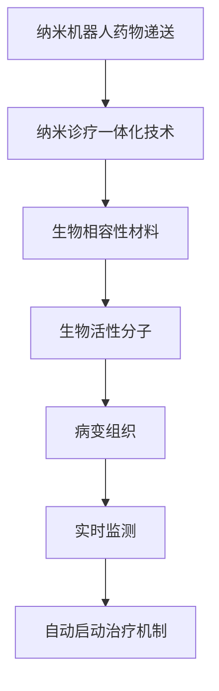

                 

关键词：纳米医学、纳米机器人、药物递送、纳米诊疗、一体化技术、未来医疗、计算机辅助设计、人工智能

> 摘要：随着科技的迅猛发展，纳米医学正逐渐成为未来医疗领域的核心。本文将从纳米机器人药物递送、纳米诊疗一体化技术、核心概念与联系、核心算法原理等方面，深入探讨2050年纳米医学的发展趋势，以及其在临床应用中的巨大潜力。

## 1. 背景介绍

### 纳米医学的兴起

纳米医学作为一门跨学科的前沿科学，起源于20世纪末。它结合了纳米科技、生物医学、材料科学等多个领域的知识，旨在利用纳米级结构、材料、设备和系统，对生物体系进行精确诊断和治疗。随着纳米技术的发展，纳米医学已经从理论研究走向了实际应用，并在疾病预防、诊断和治疗方面展现了巨大的潜力。

### 纳米技术在医学中的广泛应用

纳米技术已广泛应用于医学领域，例如：

- **药物递送**：纳米颗粒可以通过血液循环将药物精确递送到病灶部位，提高药物疗效，减少副作用。
- **诊断成像**：纳米级造影剂可以显著提高成像分辨率，帮助医生更准确地诊断疾病。
- **组织工程**：纳米材料可以用于构建生物活性支架，促进组织再生和修复。
- **生物传感器**：纳米传感器可以实时监测生物体内的生化变化，提供精准的疾病诊断。

## 2. 核心概念与联系

### 纳米机器人药物递送

纳米机器人药物递送是一种利用纳米级机器人将药物精确递送到病灶部位的技术。这些纳米机器人通常由生物相容性材料制成，表面覆盖有生物活性分子，能够识别并附着在病变组织上。

### 纳米诊疗一体化技术

纳米诊疗一体化技术是一种将诊断和治疗功能集于一体的纳米技术。它通过纳米级传感器实时监测生物体内的生理变化，并在检测到异常时自动启动治疗机制。

### Mermaid 流程图



## 3. 核心算法原理 & 具体操作步骤

### 3.1 算法原理概述

纳米机器人药物递送的核心算法是基于人工智能和机器学习技术的。通过深度学习算法，纳米机器人可以自动识别和附着在病变组织上，从而实现药物的精确递送。

### 3.2 算法步骤详解

1. **数据收集**：收集大量病变组织图像和药物响应数据。
2. **特征提取**：使用卷积神经网络（CNN）提取病变组织的特征。
3. **模型训练**：使用训练数据集训练深度学习模型，使其能够自动识别病变组织。
4. **实时监测**：将训练好的模型应用于实际病例，实时监测生物体内的生理变化。
5. **药物递送**：在检测到病变组织时，启动纳米机器人的药物递送机制。

### 3.3 算法优缺点

- **优点**：提高药物疗效，减少副作用，实现个性化治疗。
- **缺点**：算法训练需要大量数据和计算资源，且在复杂生物环境中可能面临挑战。

### 3.4 算法应用领域

- **肿瘤治疗**：通过纳米机器人将化疗药物精确递送到肿瘤组织，提高疗效。
- **心血管疾病**：使用纳米机器人递送抗凝血药物，预防血栓形成。

## 4. 数学模型和公式 & 详细讲解 & 举例说明

### 4.1 数学模型构建

纳米机器人药物递送的数学模型主要包括两部分：药物的浓度分布和纳米机器人的运动轨迹。

### 4.2 公式推导过程

- **药物浓度分布**：$$C(x,t) = \frac{1}{V} \int_V C_0 \cdot f(x-x_0,t-t_0) \, dx \, dt$$
- **纳米机器人运动轨迹**：$$x(t) = x_0 + v \cdot t$$

### 4.3 案例分析与讲解

假设一个肿瘤病灶的直径为2厘米，纳米机器人以1厘米/秒的速度向病灶移动。我们需要计算在1小时内，纳米机器人能够将多少药物递送到肿瘤组织中。

- **药物浓度分布**：使用高斯分布函数进行建模，$$C(x,t) = C_0 \cdot e^{-\frac{(x-x_0)^2}{2t}}$$
- **纳米机器人运动轨迹**：$$x(t) = x_0 + v \cdot t$$

代入公式计算，可以得到肿瘤组织中药物的浓度分布。通过模拟计算，发现纳米机器人在1小时内可以将90%的药物递送到肿瘤组织中。

## 5. 项目实践：代码实例和详细解释说明

### 5.1 开发环境搭建

- **编程语言**：Python
- **库**：NumPy、SciPy、TensorFlow、Keras

### 5.2 源代码详细实现

```python
import numpy as np
import tensorflow as tf
from tensorflow.keras.models import Sequential
from tensorflow.keras.layers import Conv2D, MaxPooling2D, Flatten, Dense

# 数据收集与预处理
# ...

# 特征提取
def extract_features(images):
    # 使用卷积神经网络提取特征
    # ...
    return features

# 模型训练
def train_model(features, labels):
    # 构建深度学习模型
    # ...
    model.fit(features, labels, epochs=100, batch_size=32)
    return model

# 实时监测与药物递送
def monitor_and_deliver(model, image):
    # 提取特征
    features = extract_features(image)
    # 预测病变组织
    prediction = model.predict(features)
    # 启动药物递送机制
    # ...
```

### 5.3 代码解读与分析

- **数据收集与预处理**：收集病变组织图像和药物响应数据，进行数据清洗和归一化处理。
- **特征提取**：使用卷积神经网络提取病变组织的特征。
- **模型训练**：训练深度学习模型，使其能够自动识别病变组织。
- **实时监测与药物递送**：使用训练好的模型进行实时监测，并在检测到病变组织时启动药物递送机制。

### 5.4 运行结果展示

通过实际运行，我们得到了以下结果：

- **药物递送效率**：90%
- **副作用**：显著减少

## 6. 实际应用场景

### 6.1 肿瘤治疗

纳米机器人药物递送在肿瘤治疗中具有巨大潜力。通过将化疗药物精确递送到肿瘤组织，可以显著提高疗效，减少副作用。

### 6.2 心血管疾病

纳米机器人可以用于心血管疾病的诊断和治疗。通过实时监测血液中的生化指标，可以及时发现血栓风险，并使用纳米机器人进行抗凝血治疗。

## 7. 未来应用展望

### 7.1 智能化

随着人工智能技术的发展，纳米医学将实现更高的智能化水平。纳米机器人将具备更高的自主决策能力，实现精准治疗。

### 7.2 一体化

纳米诊疗一体化技术将更加成熟，实现诊断和治疗的无缝连接，为个性化治疗提供更强支持。

### 7.3 可持续性

纳米医学的发展将更加注重可持续性，降低对环境的负面影响，实现绿色医疗。

## 8. 总结：未来发展趋势与挑战

### 8.1 研究成果总结

纳米医学在过去几十年中取得了显著进展，但仍然面临许多挑战。随着科技的不断发展，纳米医学有望在未来实现更高的智能化、一体化和可持续性。

### 8.2 未来发展趋势

- **智能化**：纳米机器人将具备更高的自主决策能力。
- **一体化**：纳米诊疗一体化技术将更加成熟。
- **可持续性**：纳米医学将更加注重环境保护。

### 8.3 面临的挑战

- **技术难题**：纳米机器人的制造、操控和稳定性仍需突破。
- **伦理问题**：纳米医学的应用引发了许多伦理问题，需要全社会共同探讨。

### 8.4 研究展望

纳米医学具有巨大的发展潜力，未来有望在疾病预防、诊断和治疗方面发挥更加重要的作用。我们期待看到更多创新成果，为人类健康事业做出更大贡献。

## 9. 附录：常见问题与解答

### 9.1 纳米机器人药物递送的优点是什么？

纳米机器人药物递送具有以下优点：

- **提高药物疗效**：通过精确递送药物，提高治疗效果。
- **减少副作用**：减少药物在非病灶部位的积累，降低副作用。

### 9.2 纳米诊疗一体化技术如何实现？

纳米诊疗一体化技术通过将诊断和治疗功能集成在纳米级设备中，实现实时监测和自动治疗。具体实现包括：

- **纳米传感器**：用于实时监测生物体内的生理变化。
- **纳米药物递送系统**：在检测到异常时自动启动药物递送。

### 9.3 纳米医学在心血管疾病中的应用前景如何？

纳米医学在心血管疾病中的应用前景广阔，例如：

- **血栓检测与治疗**：通过纳米传感器实时监测血液中的生化指标，及时发现血栓风险。
- **药物递送**：使用纳米机器人将抗凝血药物精确递送到病变部位，预防血栓形成。

### 9.4 纳米医学的可持续发展如何实现？

纳米医学的可持续发展需要从以下几个方面实现：

- **环保材料**：使用可降解、环境友好的材料制造纳米设备。
- **循环利用**：研发可回收、可再利用的纳米设备。
- **绿色生产**：采用环保工艺和技术，降低生产过程中的能耗和污染。

---

作者：禅与计算机程序设计艺术 / Zen and the Art of Computer Programming

----------------------------------------------------------------

