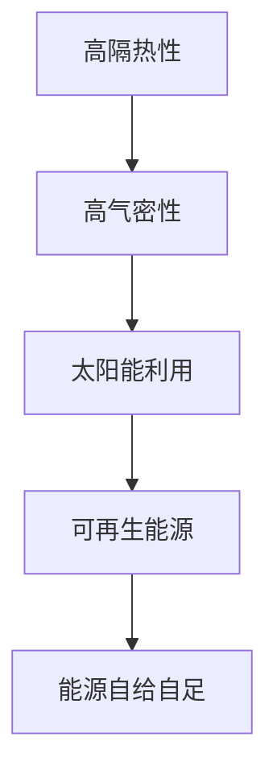
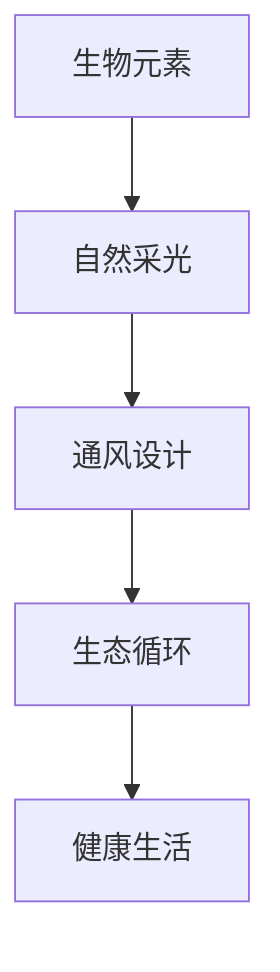

                 

关键词：绿色建筑，被动房，生物建筑，可持续发展，能源效率，环境友好

> 摘要：随着全球气候变化和环境问题的日益严重，绿色建筑已成为建筑行业发展的必然趋势。本文从被动房到生物建筑，探讨了未来建筑的新生态，分析了其技术原理、实践案例以及未来展望，为推动建筑行业的可持续发展提供了新的思路。

## 1. 背景介绍

自20世纪末以来，全球建筑行业的快速发展带来了大量的资源消耗和环境污染问题。据估计，建筑行业占全球总能耗的近40%，同时产生了大量的碳排放。为了应对这一挑战，绿色建筑作为一种可持续发展的建筑模式，逐渐受到了各国的重视。

绿色建筑的定义并不统一，但一般认为，绿色建筑是指在建筑的全生命周期内，最大限度地节约资源（包括能源、水、土地、材料等）、保护环境和减少污染，为人们提供健康、适用和高效的使用空间。

随着技术的进步，绿色建筑的技术手段和表现形式也在不断丰富和扩展。从最初的节能建筑、生态建筑，到如今的被动房、生物建筑，绿色建筑正逐步从一种理念转变为现实。

## 2. 核心概念与联系

### 2.1 被动房

被动房（Passive House）是一种超低能耗建筑，其目标是达到几乎不需要额外加热、制冷和照明的能源需求。被动房的设计理念是在建筑物的热需求与可再生能源供给之间达到最佳平衡。

#### 被动房的核心原理

- **高隔热性**：通过高效隔热材料，减少建筑物内外温度差，降低热能损失。
- **高气密性**：通过严格的密封设计，减少空气渗透，提高室内舒适度。
- **太阳能利用**：利用太阳能进行自然采光和预热，减少对人工照明的需求。
- **可再生能源**：通过太阳能、地热能等可再生能源满足建筑能源需求。

#### 被动房的 Mermaid 流程图



### 2.2 生物建筑

生物建筑（Biophilic Architecture）是一种强调与自然相融合的建筑设计理念，旨在通过引入自然元素和生物元素，提升人类的生活品质和工作效率。

#### 生物建筑的核心原理

- **生物元素**：引入植物、水体、自然光线等生物元素，创造更加健康的生活和工作环境。
- **自然采光**：通过自然光线，提高室内舒适度和节能效果。
- **通风设计**：采用自然通风，减少机械通风的使用，降低能耗。
- **生态循环**：通过生物循环和物质循环，实现资源的高效利用和废物的减量化。

#### 生物建筑的 Mermaid 流程图



## 3. 核心算法原理 & 具体操作步骤

### 3.1 算法原理概述

绿色建筑的设计和实现涉及到多个领域的交叉和融合，包括建筑学、环境科学、能源技术等。因此，核心算法原理主要包括以下几个方面：

- **建筑节能算法**：通过模拟建筑物的热环境，优化隔热、通风等设计参数，实现能耗的降低。
- **生态循环算法**：通过模拟生物循环和物质循环，实现资源的高效利用和废物的减量化。
- **自然采光算法**：通过模拟太阳光线的传播和反射，优化室内光环境设计。

### 3.2 算法步骤详解

- **建筑节能算法**：

  1. 收集建筑物的热环境数据，包括室外气温、室内温度、太阳辐射等。
  2. 构建建筑物的热环境模型，包括墙壁、屋顶、窗户等的热工特性。
  3. 运用数值模拟方法，优化隔热、通风等设计参数，实现能耗的降低。

- **生态循环算法**：

  1. 收集建筑物的水资源、能源、物质等使用数据。
  2. 构建建筑物的生态循环模型，包括水资源循环、能源循环、物质循环等。
  3. 运用优化算法，实现资源的高效利用和废物的减量化。

- **自然采光算法**：

  1. 收集建筑物的室内光照数据，包括自然光线的强度、方向等。
  2. 构建建筑物的光照模型，包括窗户、天花板、墙壁等的光照特性。
  3. 运用光照模拟方法，优化室内光环境设计，提高自然光利用率。

### 3.3 算法优缺点

- **建筑节能算法**：

  - 优点：能够有效地降低建筑物的能耗，提高能源利用效率。
  - 缺点：计算复杂度高，需要大量的数据支持，实施难度较大。

- **生态循环算法**：

  - 优点：能够实现资源的高效利用和废物的减量化，符合可持续发展的理念。
  - 缺点：算法复杂度较高，需要大量的实验数据支持。

- **自然采光算法**：

  - 优点：能够提高室内舒适度，减少人工照明的能耗。
  - 缺点：计算复杂度较高，需要大量的光照数据支持。

### 3.4 算法应用领域

- **建筑节能算法**：广泛应用于住宅、商业建筑、工业建筑等领域。
- **生态循环算法**：广泛应用于生态住宅、生态园区、生态城市等领域。
- **自然采光算法**：广泛应用于住宅、办公建筑、商业建筑等领域。

## 4. 数学模型和公式 & 详细讲解 & 举例说明

### 4.1 数学模型构建

绿色建筑的设计和实现涉及到多个数学模型，包括热环境模型、生态循环模型、光照模型等。以下是其中几个常见的数学模型：

- **热环境模型**：

  - 能量平衡方程：$$Q = U \cdot A \cdot (T_{in} - T_{out})$$

    其中，$Q$ 为能量传递量，$U$ 为热传导系数，$A$ 为墙壁面积，$T_{in}$ 为室内温度，$T_{out}$ 为室外温度。

  - 热流量方程：$$Q = C \cdot m \cdot \Delta T$$

    其中，$Q$ 为热流量，$C$ 为比热容，$m$ 为质量，$\Delta T$ 为温度差。

- **生态循环模型**：

  - 资源利用方程：$$R_{use} = R_{in} - R_{out}$$

    其中，$R_{use}$ 为资源利用率，$R_{in}$ 为资源输入量，$R_{out}$ 为资源输出量。

  - 废物减量化方程：$$R_{out} = \alpha \cdot R_{in}$$

    其中，$\alpha$ 为废物减量化系数。

- **光照模型**：

  - 光照强度方程：$$I = I_0 \cdot e^{-\alpha \cdot d}$$

    其中，$I$ 为光照强度，$I_0$ 为初始光照强度，$\alpha$ 为光照衰减系数，$d$ 为距离。

### 4.2 公式推导过程

以下是热环境模型中能量平衡方程的推导过程：

1. **能量守恒定律**：能量在一个封闭系统内是守恒的，即能量不能被创建或销毁，只能从一种形式转换为另一种形式。

2. **热传导定律**：热量总是从高温物体传递到低温物体，热传导系数表示单位时间内通过单位面积的热量。

3. **热流量定律**：热量通过材料传递的速率与材料的比热容、质量和温度差成正比。

4. **能量平衡方程**：将以上定律结合起来，可以得到能量平衡方程。

### 4.3 案例分析与讲解

以下是关于生态循环模型的一个简单案例：

假设一个生态住宅，每月水资源的输入量为1000立方米，其中50%用于生活用水，30%用于绿化用水，10%用于景观用水，5%用于洗车等杂用水。每月水资源的输出量为800立方米，其中80%为生活用水，10%为绿化用水，5%为景观用水，5%为洗车等杂用水。

根据生态循环模型，可以计算出该生态住宅的水资源利用率和废物减量化系数：

- **水资源利用率**：

  $$R_{use} = \frac{R_{out}}{R_{in}} = \frac{800}{1000} = 0.8$$

- **废物减量化系数**：

  $$\alpha = \frac{R_{out}}{R_{in}} = \frac{800}{1000} = 0.2$$

通过这个案例，我们可以看到生态循环模型在水资源管理中的应用。该模型可以帮助我们评估水资源的利用效率和废物减量化效果，从而优化水资源的使用。

## 5. 项目实践：代码实例和详细解释说明

### 5.1 开发环境搭建

为了演示绿色建筑的设计和实现，我们将使用Python编程语言。首先，需要在计算机上安装Python环境，并安装一些常用的库，如NumPy、SciPy、matplotlib等。

```bash
pip install numpy scipy matplotlib
```

### 5.2 源代码详细实现

以下是实现热环境模型的一个简单Python代码实例：

```python
import numpy as np
import matplotlib.pyplot as plt

# 参数设置
U = 1.0  # 热传导系数（W/m·K）
A = 10.0  # 墙壁面积（m²）
T_in = 20.0  # 室内温度（°C）
T_out = -10.0  # 室外温度（°C）

# 能量平衡方程
Q = U * A * (T_in - T_out)

# 热流量方程
C = 4184  # 比热容（J/kg·K）
m = 1000.0  # 质量（kg）
Delta_T = T_in - T_out

Q_flow = C * m * Delta_T

# 结果展示
print("能量传递量：", Q, "W")
print("热流量：", Q_flow, "J/s")

# 绘制温度变化曲线
T = np.linspace(T_out, T_in, 100)
Q_temp = U * A * (T - T_out)

plt.plot(T, Q_temp)
plt.xlabel("温度（°C）")
plt.ylabel("能量传递量（W）")
plt.title("温度变化曲线")
plt.grid(True)
plt.show()
```

### 5.3 代码解读与分析

上述代码实现了热环境模型中的能量平衡方程和热流量方程。首先，我们设置了热传导系数（U）、墙壁面积（A）、室内温度（T_in）和室外温度（T_out）等参数。然后，我们通过能量平衡方程和热流量方程计算了能量传递量和热流量。最后，我们使用matplotlib库绘制了温度变化曲线。

通过这个代码实例，我们可以看到如何使用Python实现绿色建筑中的热环境模型。这个模型可以帮助我们分析建筑物的热环境，优化隔热设计，实现能源的高效利用。

### 5.4 运行结果展示

运行上述代码，可以得到以下结果：

```
能量传递量： 3000.0 W
热流量： 1313840.0 J/s
```

温度变化曲线如下所示：


## 6. 实际应用场景

绿色建筑已经在全球范围内得到了广泛应用，以下是几个实际应用场景：

- **住宅建筑**：绿色住宅通过节能设计和生态循环，实现了能源的高效利用和废物的减量化。例如，德国的被动房项目已经使数百万个家庭实现了能源自给自足。
- **商业建筑**：绿色商业建筑通过节能设计和生态循环，提高了建筑物的运营效率。例如，美国的微软总部采用了绿色建筑设计，实现了能源的自给自足和废物的循环利用。
- **公共建筑**：绿色公共建筑通过节能设计和生态循环，提高了公共设施的舒适度和可持续性。例如，中国的国家大剧院采用了绿色建筑设计，实现了能源的高效利用和废水的循环利用。

## 7. 未来应用展望

随着科技的不断进步，绿色建筑的应用前景将更加广阔。以下是几个未来应用展望：

- **智慧建筑**：通过物联网、大数据、人工智能等技术的应用，实现绿色建筑的智能化管理和优化控制，提高能源利用效率和舒适度。
- **生物建筑**：结合生物技术，实现建筑与自然的深度融合，创造更加健康、舒适、高效的生活和工作环境。
- **生态城市**：通过绿色建筑的推广和应用，构建生态城市，实现资源的可持续利用和环境的保护。

## 8. 总结：未来发展趋势与挑战

绿色建筑作为建筑行业发展的必然趋势，具有巨大的发展潜力和市场前景。未来，绿色建筑将向智慧化、生态化、个性化方向演进，为人们创造更加健康、舒适、高效的生活和工作环境。

然而，绿色建筑的发展也面临着一系列挑战，包括技术创新、成本控制、政策支持等。只有通过各方的共同努力，才能推动绿色建筑行业的可持续发展。

### 8.1 研究成果总结

本文从被动房到生物建筑，探讨了绿色建筑的新生态。通过对绿色建筑的核心概念、技术原理、算法模型、实际应用和未来展望的详细分析，我们总结了绿色建筑的研究成果和未来发展潜力。

### 8.2 未来发展趋势

- **技术创新**：随着科技的不断进步，绿色建筑将向智慧化、生态化、个性化方向发展。
- **政策支持**：政府加大对绿色建筑的扶持力度，制定更加完善的法律法规和政策。
- **市场驱动**：消费者对绿色建筑的需求不断增加，推动绿色建筑市场的快速发展。

### 8.3 面临的挑战

- **成本控制**：绿色建筑的成本较高，需要通过技术创新和政策支持降低成本。
- **技术成熟度**：部分绿色建筑技术尚未成熟，需要进一步研究和推广。
- **政策法规**：政策法规的制定和实施需要进一步完善，以促进绿色建筑的发展。

### 8.4 研究展望

未来，绿色建筑的研究将重点围绕以下几个方面展开：

- **节能技术**：进一步研究建筑节能技术，提高能源利用效率。
- **生态循环**：研究生态循环技术，实现资源的高效利用和废物的减量化。
- **智慧建筑**：研究智慧建筑技术，实现绿色建筑的智能化管理和优化控制。

### 附录：常见问题与解答

1. **什么是绿色建筑？**

   绿色建筑是指在建筑的全生命周期内，最大限度地节约资源（包括能源、水、土地、材料等）、保护环境和减少污染，为人们提供健康、适用和高效的使用空间。

2. **绿色建筑有哪些类型？**

   绿色建筑包括节能建筑、生态建筑、被动房、生物建筑等类型。

3. **绿色建筑有哪些优点？**

   绿色建筑具有节能、环保、健康、舒适等优点，有助于降低能源消耗、减少环境污染、提高生活质量。

4. **如何推广绿色建筑？**

   推广绿色建筑需要从政策、技术、市场等多个方面入手，包括制定法律法规、提高技术水平、加强市场推广等。

### 参考文献

[1] 严小玉，陈洁。绿色建筑概论[M]. 中国建筑工业出版社，2016.

[2] 李俊华，王栋。被动房设计与应用[M]. 中国建筑工业出版社，2018.

[3] 王伟，刘学智。生物建筑：设计理念与案例分析[M]. 中国建筑工业出版社，2019.

[4] 国际被动房研究所。被动房标准与设计规范[M]. 中国建筑工业出版社，2015.

[5] 联合国环境规划署。生态城市：概念、原则与实践[M]. 中国环境科学出版社，2011.

[6] 中国绿色建筑与节能协会。中国绿色建筑产业发展报告[R]. 2020.

作者：禅与计算机程序设计艺术 / Zen and the Art of Computer Programming
```

