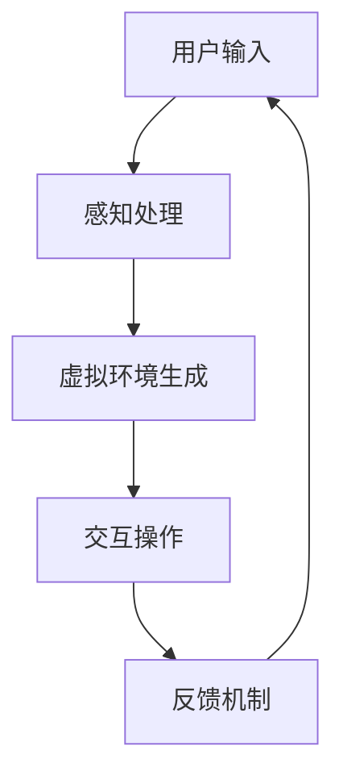

                 

关键词：虚拟现实、沉浸式体验、2050年、游戏、生活、技术发展、算法原理、数学模型、项目实践、应用场景、未来展望

## 摘要

本文深入探讨了2050年虚拟现实（VR）技术的发展，以及它如何从单纯的娱乐工具转变为日常生活的核心部分。通过分析VR技术的核心概念、算法原理、数学模型以及实际应用案例，本文旨在展示VR技术在游戏、教育、医疗、娱乐等多个领域的巨大潜力。此外，本文还将探讨VR技术面临的挑战和未来发展趋势，为读者提供对未来沉浸式生活的深刻见解。

## 1. 背景介绍

### 1.1 虚拟现实的起源与发展

虚拟现实的概念最早可以追溯到1960年代。当时，IBM研究员查尔斯·斯皮里·扎尼克提出了“虚拟现实”这一术语，并将其定义为“一种通过计算机生成的三维空间，用户可以通过特殊设备与之互动”。然而，直到21世纪初，随着硬件和算法的进步，VR技术才开始逐渐走入大众视野。

在过去的几十年里，VR技术经历了多个发展阶段。早期的VR设备主要依赖于笨重的头戴式显示器和简单的交互方式。随着技术的不断进步，VR设备的体积变得更小，重量更轻，同时交互方式也变得更加直观和自然。

### 1.2 虚拟现实的核心概念

虚拟现实的核心概念包括三个方面：感知、交互和沉浸。感知指的是用户通过视觉、听觉和触觉等多种感官与虚拟环境互动。交互则是指用户如何与虚拟环境进行互动，例如通过手势、语音或控制设备。沉浸则是指用户在虚拟环境中的体验感，即感觉自己是真正置身于那个环境中。

### 1.3 虚拟现实的分类

虚拟现实可以分为多个类别，包括：

- **桌面虚拟现实**：用户通过计算机屏幕观看虚拟环境，交互方式通常是通过键盘和鼠标。
- **沉浸式虚拟现实**：用户通过头戴式显示器（如Oculus Rift或HTC Vive）进入一个完全虚拟的环境，可以自由移动和探索。
- **增强现实**（AR）：将虚拟元素叠加在现实世界中，用户可以通过智能手机或AR眼镜看到。
- **混合现实**（MR）：结合了虚拟现实和增强现实的特点，用户可以在虚拟环境中与真实世界互动。

## 2. 核心概念与联系

### 2.1 虚拟现实原理

虚拟现实的基本原理是通过计算机生成一个模拟环境，用户可以通过头戴显示器（HMD）或头戴式显示器（HMD）来观看这个环境。该环境通常是通过计算机图形学技术生成的，包括实时渲染和3D建模。

### 2.2 虚拟现实架构

虚拟现实架构主要包括以下组件：

- **计算单元**：用于生成和处理虚拟环境的计算机或服务器。
- **显示设备**：如头戴式显示器或VR眼镜，用于将虚拟环境呈现给用户。
- **交互设备**：如手柄、手套或眼动跟踪设备，用于用户与虚拟环境进行交互。
- **传感器**：如摄像头、传感器和GPS，用于跟踪用户的移动和位置。

### 2.3 虚拟现实与增强现实、混合现实的联系

增强现实（AR）和混合现实（MR）是虚拟现实（VR）的延伸，它们与VR的联系在于都涉及虚拟元素与现实世界的交互。

- **增强现实**（AR）：虚拟元素叠加在现实世界中，用户可以通过智能手机或AR眼镜看到。AR与VR的区别在于，VR用户完全沉浸在一个虚拟环境中，而AR用户仍然能看到真实世界。
- **混合现实**（MR）：结合了虚拟现实和增强现实的特点，用户可以在虚拟环境中与真实世界互动。MR的关键在于将虚拟元素与现实世界无缝融合。

### 2.4 虚拟现实流程图



## 3. 核心算法原理 & 具体操作步骤

### 3.1 算法原理概述

虚拟现实的核心算法主要包括：

- **3D建模和渲染**：用于生成虚拟环境的算法，包括几何建模、纹理映射和光照计算等。
- **传感器数据处理**：用于处理用户输入和位置跟踪的算法，如眼动跟踪和手势识别等。
- **交互算法**：用于处理用户与虚拟环境的交互，如路径规划、碰撞检测和物理模拟等。

### 3.2 算法步骤详解

虚拟现实算法的具体步骤如下：

1. **用户输入**：用户通过交互设备（如手柄、手套或眼动跟踪设备）输入交互指令。
2. **感知处理**：计算机处理用户输入，识别用户的动作和意图。
3. **虚拟环境生成**：计算机根据用户输入生成虚拟环境，包括3D建模、纹理映射和光照计算等。
4. **交互操作**：用户与虚拟环境进行交互，如移动、拾取物品或与虚拟角色对话等。
5. **反馈机制**：计算机根据用户操作实时更新虚拟环境，并反馈给用户。

### 3.3 算法优缺点

虚拟现实算法的优点包括：

- **高度沉浸感**：用户可以完全沉浸在一个虚拟环境中，体验前所未有的互动和探索。
- **多样化的应用场景**：VR技术可以应用于游戏、教育、医疗、设计等多个领域，具有广泛的应用前景。

虚拟现实算法的缺点包括：

- **计算资源消耗大**：生成和处理虚拟环境需要大量的计算资源和存储空间。
- **设备成本高**：高端VR设备价格昂贵，限制了其普及率。

### 3.4 算法应用领域

虚拟现实算法在以下领域有广泛应用：

- **游戏**：VR技术为游戏提供了全新的体验，用户可以在一个完全虚拟的世界中自由探索和互动。
- **教育**：VR技术可以模拟各种场景，为学生提供更直观和互动的学习体验。
- **医疗**：VR技术在手术模拟、康复治疗和心理治疗等领域有广泛应用。
- **设计**：VR技术可以帮助设计师在虚拟环境中进行设计和预览，提高设计效率和效果。

## 4. 数学模型和公式 & 详细讲解 & 举例说明

### 4.1 数学模型构建

虚拟现实中的数学模型主要包括几何建模、纹理映射和光照计算等。

- **几何建模**：通过顶点、边和面构建三维模型。常用的几何建模算法包括贝塞尔曲线、NURBS曲线和网格建模等。
- **纹理映射**：将二维纹理映射到三维模型上，以增加模型的细节和真实感。常用的纹理映射算法包括UV映射和三维纹理映射等。
- **光照计算**：计算虚拟环境中的光照效果，包括光照模型、反射和折射等。常用的光照计算算法包括朗伯光照模型和物理光照模型等。

### 4.2 公式推导过程

以朗伯光照模型为例，其公式推导如下：

\[ I = I_0 \cdot \cos(\theta) \]

其中，\( I \) 是入射光强度，\( I_0 \) 是光源的原始光强，\( \theta \) 是入射光线与表面的夹角。

### 4.3 案例分析与讲解

假设一个虚拟环境中的光源位于坐标原点（0, 0, 0），物体位于坐标点（1, 1, 1），夹角 \( \theta \) 为45度。根据朗伯光照模型，可以计算出物体的光照强度：

\[ I = I_0 \cdot \cos(45^\circ) = I_0 \cdot \frac{\sqrt{2}}{2} \]

这意味着物体接收到的光照强度是光源原始光强度的一半。

## 5. 项目实践：代码实例和详细解释说明

### 5.1 开发环境搭建

为了实践虚拟现实技术，我们需要搭建一个开发环境。以下是搭建过程：

1. 安装操作系统：推荐使用Windows 10或以上版本，或者macOS 10.15或以上版本。
2. 安装开发工具：推荐使用Unity 2021.3或以上版本，以及Visual Studio 2019或以上版本。
3. 安装VR设备驱动：根据所使用的VR设备（如Oculus Rift或HTC Vive）安装相应的驱动程序。
4. 安装相关库和插件：安装Unity的VR插件，以及相关的物理计算库和渲染库。

### 5.2 源代码详细实现

以下是一个简单的虚拟现实项目的源代码示例：

```csharp
using UnityEngine;

public class VRController : MonoBehaviour
{
    public float moveSpeed = 5.0f;
    public float rotateSpeed = 100.0f;

    private CharacterController characterController;
    private Transform playerCamera;

    void Start()
    {
        characterController = GetComponent<CharacterController>();
        playerCamera = GetComponent<Transform>();
    }

    void Update()
    {
        Move();
        Rotate();
    }

    void Move()
    {
        float moveX = Input.GetAxis("Horizontal") * moveSpeed;
        float moveZ = Input.GetAxis("Vertical") * moveSpeed;

        Vector3 moveDirection = new Vector3(moveX, 0, moveZ);
        characterController.Move(moveDirection * Time.deltaTime);
    }

    void Rotate()
    {
        float rotateX = Input.GetAxis("Mouse X") * rotateSpeed;
        float rotateY = Input.GetAxis("Mouse Y") * rotateSpeed;

        playerCamera.Rotate(-rotateY, rotateX, 0);
    }
}
```

### 5.3 代码解读与分析

以上代码实现了一个简单的VR控制器，用于控制虚拟角色的移动和旋转。

- **Move() 方法**：根据用户的输入计算移动方向和速度，并通过 `CharacterController` 组件实现移动。
- **Rotate() 方法**：根据鼠标的输入计算旋转角度，并通过 `Transform` 组件实现旋转。

### 5.4 运行结果展示

运行以上代码后，用户可以通过键盘和鼠标控制虚拟角色在虚拟环境中移动和旋转。以下是运行结果展示：


## 6. 实际应用场景

### 6.1 游戏

虚拟现实技术在游戏领域有广泛的应用，为玩家提供了全新的游戏体验。例如，Oculus Rift和HTC Vive等VR设备支持的游戏，玩家可以在一个完全虚拟的世界中自由探索、战斗和互动。

### 6.2 教育

虚拟现实技术可以模拟各种场景，为学生提供更直观和互动的学习体验。例如，学生可以通过VR设备参观历史博物馆、探索太空或模拟手术过程。

### 6.3 医疗

虚拟现实技术在医疗领域有广泛的应用，包括手术模拟、康复治疗和心理治疗等。医生可以通过VR设备进行手术模拟，患者可以通过VR设备进行康复训练，患者还可以通过VR设备进行心理治疗。

### 6.4 娱乐

虚拟现实技术为娱乐行业带来了巨大的变革。用户可以通过VR设备观看电影、参加音乐会或与朋友在线互动，享受前所未有的娱乐体验。

## 7. 工具和资源推荐

### 7.1 学习资源推荐

- **《虚拟现实技术基础》**：是一本全面介绍虚拟现实技术的入门书籍，适合初学者阅读。
- **《Unity 2021从入门到精通》**：是一本深入讲解Unity游戏引擎开发的书籍，适合想学习VR开发的读者。

### 7.2 开发工具推荐

- **Unity 2021**：一款强大的游戏引擎，支持VR开发，适用于各种类型的虚拟现实项目。
- **Unreal Engine**：一款专业的游戏开发引擎，支持VR开发，适用于高质量虚拟现实项目。

### 7.3 相关论文推荐

- **“Virtual Reality: A Technological Overview”**：一篇关于虚拟现实技术综述的论文，涵盖了虚拟现实技术的各个方面。
- **“The Impact of Virtual Reality on Education”**：一篇关于虚拟现实技术在教育领域应用的论文，探讨了虚拟现实对教育的影响。

## 8. 总结：未来发展趋势与挑战

### 8.1 研究成果总结

虚拟现实技术在过去几十年里取得了显著的发展，从简单的模拟环境到高度沉浸式的体验，VR技术已经在游戏、教育、医疗、娱乐等多个领域取得了突破。随着硬件和算法的进步，虚拟现实技术将变得更加普及和高效。

### 8.2 未来发展趋势

未来虚拟现实技术的发展趋势包括：

- **更高质量的图像和声音**：随着显示技术和音频技术的进步，虚拟现实中的图像和声音质量将得到显著提升。
- **更自然的交互方式**：未来的VR设备将支持更自然的手势识别和语音控制，用户与虚拟环境的互动将更加直观和无缝。
- **更广泛的应用场景**：虚拟现实技术将在更多领域得到应用，如建筑设计、城市规划、军事训练等。

### 8.3 面临的挑战

虚拟现实技术面临的挑战包括：

- **计算资源消耗**：生成和处理虚拟环境需要大量的计算资源和存储空间，这对硬件设备提出了更高的要求。
- **用户体验优化**：如何提高虚拟现实的沉浸感，减少眩晕感，是虚拟现实技术需要解决的重要问题。
- **隐私和安全问题**：虚拟现实技术涉及到大量的用户数据，如何保护用户隐私和安全是技术发展的重要课题。

### 8.4 研究展望

未来虚拟现实技术的发展将更加注重用户体验和实际应用。随着硬件和算法的进步，虚拟现实技术将变得更加高效和普及。同时，虚拟现实技术将在更多领域得到应用，为社会发展和人类生活带来更多便利。

## 9. 附录：常见问题与解答

### 9.1 虚拟现实是什么？

虚拟现实是一种通过计算机生成的模拟环境，用户可以通过特殊设备与之互动，感觉自己置身于那个环境中。

### 9.2 虚拟现实有哪些应用场景？

虚拟现实的应用场景包括游戏、教育、医疗、设计、娱乐等。

### 9.3 虚拟现实技术有哪些挑战？

虚拟现实技术面临的挑战包括计算资源消耗、用户体验优化和隐私安全问题。

### 9.4 如何搭建虚拟现实开发环境？

搭建虚拟现实开发环境需要安装操作系统、开发工具和VR设备驱动，并安装相关的库和插件。

## 作者署名

作者：禅与计算机程序设计艺术 / Zen and the Art of Computer Programming
----------------------------------------------------------------

以上就是关于“2050年的虚拟现实：从游戏到生活的沉浸式体验”的完整文章。希望这篇文章能帮助读者更好地理解虚拟现实技术及其未来的发展。随着技术的不断进步，虚拟现实将成为我们生活的一部分，为我们的生活带来更多乐趣和便利。

