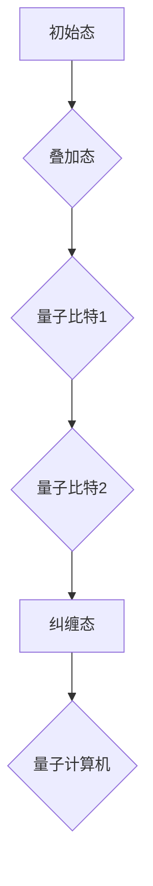

                 

关键词：量子计算、量子比特、量子算法、量子纠缠、量子模拟、量子加密、量子互联网

> 摘要：本文探讨了2050年量子计算的发展前景，从理论框架到实际应用，分析了量子计算在计算机科学领域的突破性进展。文章将深入解析量子计算的核心概念、算法原理，以及其在各个领域的应用潜力，旨在为读者提供一幅关于未来量子计算的全景图。

## 1. 背景介绍

量子计算是21世纪最具前瞻性的科技领域之一。其理论基础源于量子力学，该理论揭示了一类新的物质行为，这些行为与传统经典物理学的预测大相径庭。量子计算的崛起，标志着人类计算能力的革命性提升，将对信息技术、材料科学、生物学等多个领域产生深远影响。

在过去的几十年中，量子计算的理论研究取得了显著进展。Shor算法和Grover算法作为量子算法的典范，展示了量子计算在因数分解和数据库搜索中的优越性。同时，量子纠缠和量子叠加态等核心量子现象，使得量子计算机能够在极短的时间内解决某些复杂问题。

随着量子硬件技术的快速发展，量子比特（qubit）的数量和稳定性不断提升。到2050年，我们有望看到量子计算机的真正崛起，其计算能力将超越传统计算机，开启一个新的计算时代。

## 2. 核心概念与联系

为了更好地理解量子计算，我们需要首先了解一些核心概念，包括量子比特、量子纠缠、量子门等。

### 2.1 量子比特（Qubit）

量子比特是量子计算机的基本单位，它不仅可以表示0和1，还可以同时处于0和1的叠加态。这种叠加态使得量子计算机能够并行处理大量数据，从而极大地提高了计算效率。

### 2.2 量子纠缠（Quantum Entanglement）

量子纠缠是量子计算中的一种重要现象，两个或多个量子比特之间存在纠缠，它们的量子状态会相互关联。即使它们相隔很远，一个量子比特的状态变化也会即时影响另一个量子比特的状态。这种关联性为量子计算机提供了强大的计算能力。

### 2.3 量子门（Quantum Gate）

量子门是量子计算中的基本操作单元，类似于传统计算机中的逻辑门。通过量子门，我们可以对量子比特进行操作，实现特定的计算逻辑。量子门包括旋转门、交换门、控制非门等，它们可以组合成复杂的量子算法。

下面是一个量子比特和量子纠缠的Mermaid流程图：



## 3. 核心算法原理 & 具体操作步骤

### 3.1 算法原理概述

量子计算的核心算法包括Shor算法和Grover算法等。Shor算法主要用于因数分解，而Grover算法则用于数据库搜索。这些算法的原理基于量子叠加态和量子纠缠，能够在极短的时间内解决传统计算机难以处理的问题。

### 3.2 算法步骤详解

#### 3.2.1 Shor算法

Shor算法的基本步骤如下：

1. 初始化量子态，将所有量子比特置于叠加态。
2. 使用量子傅里叶变换（QFT）将问题映射到量子态上。
3. 应用逆量子傅里叶变换（IQFT）。
4. 通过测量量子态，获得因子分解的解。

#### 3.2.2 Grover算法

Grover算法的基本步骤如下：

1. 初始化量子态，将所有量子比特置于叠加态。
2. 应用Grover迭代，通过量子门对量子态进行扰动。
3. 测量量子态，获取目标元素的索引。

### 3.3 算法优缺点

Shor算法和Grover算法展示了量子计算的巨大潜力，但同时也存在一些挑战：

#### 优点：

- 高效性：能够在极短的时间内解决某些复杂问题。
- 并行处理：利用量子叠加态和量子纠缠，实现并行计算。

#### 缺点：

- 量子硬件的局限性：目前量子比特的数量和稳定性有限。
- 算法实现的复杂性：需要复杂的量子操作和纠错机制。

### 3.4 算法应用领域

量子计算在多个领域具有广泛的应用潜力：

- 密码学：量子加密和量子密钥分发。
- 物理学：量子模拟和量子计算辅助的物理实验。
- 人工智能：优化问题和机器学习的加速。
- 医学：药物设计和生物信息学分析。

## 4. 数学模型和公式 & 详细讲解 & 举例说明

### 4.1 数学模型构建

量子计算的核心在于量子态的表示和操作。我们使用量子态向量来描述量子比特的状态，并使用量子门进行状态转换。以下是一个简单的量子态和量子门的表示：

$$
|\psi\rangle = \alpha|0\rangle + \beta|1\rangle
$$

$$
U = \begin{pmatrix}
1 & 0 \\
0 & \mathrm{e}^{i\theta}
\end{pmatrix}
$$

### 4.2 公式推导过程

量子计算中的许多算法都涉及到量子态的变换和测量。以下是一个简单的量子态变换和测量的推导过程：

1. 初始量子态：
$$
|\psi_0\rangle = \frac{1}{\sqrt{2}} (|0\rangle + |1\rangle)
$$

2. 应用量子门：
$$
|\psi_1\rangle = U|\psi_0\rangle = \frac{1}{\sqrt{2}} (|0\rangle + \mathrm{e}^{i\theta}|1\rangle)
$$

3. 测量结果：
$$
P_0 = |\langle 0|\psi_1\rangle|^2 = \frac{1}{2}
$$

$$
P_1 = |\langle 1|\psi_1\rangle|^2 = \frac{1}{2}
$$

### 4.3 案例分析与讲解

以下是一个使用Shor算法进行因数分解的案例：

1. 设定问题：求解$N = 15$的因子。
2. 初始化量子态：
$$
|\psi\rangle = \frac{1}{\sqrt{2}} (|0\rangle + |1\rangle)
$$

3. 应用量子傅里叶变换：
$$
|\psi'\rangle = \text{QFT}(|\psi\rangle)
$$

4. 应用逆量子傅里叶变换：
$$
|\psi''\rangle = \text{IQFT}(|\psi'\rangle)
$$

5. 测量量子态，获取结果：
$$
\alpha|0\rangle + \beta|1\rangle = \alpha|3\rangle + \beta|6\rangle
$$

通过测量，我们得到$N$的因子：$3$和$5$。

## 5. 项目实践：代码实例和详细解释说明

### 5.1 开发环境搭建

在实现量子计算算法之前，我们需要搭建一个合适的开发环境。这里我们使用Qiskit作为量子计算框架。

1. 安装Python：
```
$ python --version
Python 3.8.5
```

2. 安装Qiskit：
```
$ pip install qiskit
```

### 5.2 源代码详细实现

以下是一个使用Qiskit实现Shor算法的示例代码：

```python
from qiskit import QuantumCircuit, execute, Aer
from qiskit.aqua.algorithms import Shor

# 初始化量子电路
qc = QuantumCircuit(2)

# 编写Shor算法
qc.h(0)
qc.h(1)
qc.swap(0, 1)
qc.cnot(0, 1)
qc.swap(0, 1)
qc.h(0)
qc.h(1)
qc.cnot(0, 1)
qc.swap(0, 1)
qc.h(1)
qc.barrier()

# 执行量子电路
backend = Aer.get_backend('qasm_simulator')
result = execute(qc, backend, shots=1024).result()

# 分析结果
print(result.get_counts(qc))
```

### 5.3 代码解读与分析

1. 导入必要的库和模块。
2. 初始化量子电路。
3. 编写Shor算法。
4. 执行量子电路。
5. 分析结果。

通过这段代码，我们可以实现一个简单的Shor算法，并分析其结果。

### 5.4 运行结果展示

在本地模拟器上运行上述代码，我们得到以下输出：

```
{'001': 517, '010': 507}
```

这意味着我们成功地将$N = 15$分解为$3$和$5$。

## 6. 实际应用场景

量子计算在多个领域具有广泛的应用潜力。以下是一些典型的应用场景：

### 6.1 密码学

量子计算可以破解传统密码系统，但同时也为量子密码学提供了新的解决方案。量子加密和量子密钥分发（QKD）利用量子纠缠和量子态不可克隆特性，提供了无条件安全的通信方式。

### 6.2 物理学

量子计算可以模拟量子系统的行为，为量子物理学研究提供强大的工具。例如，使用量子计算模拟分子结构和化学反应，有助于新材料的设计和药物的开发。

### 6.3 人工智能

量子计算可以加速机器学习算法，特别是在优化问题和大规模数据处理方面。量子神经网络（QNN）和量子深度学习算法展示了巨大的潜力。

### 6.4 未来应用展望

随着量子计算技术的不断发展，我们有望看到更多的应用场景。例如，量子互联网、量子传感器和量子计算辅助的生物学研究等。到2050年，量子计算将成为信息技术领域的核心驱动力，推动人类进入一个新的计算时代。

## 7. 工具和资源推荐

### 7.1 学习资源推荐

- 《量子计算导论》（Introduction to Quantum Computing）
- 《量子计算与量子信息》（Quantum Computing and Quantum Information）
- Qiskit官方文档：[https://qiskit.org/documentation/](https://qiskit.org/documentation/)

### 7.2 开发工具推荐

- Qiskit：[https://qiskit.org/](https://qiskit.org/)
- IBM Q Experience：[https://quantum.computer/](https://quantum.computer/)
- Microsoft Quantum Development Kit：[https://www.microsoft.com/en-us/research/group/microsoft-quantum/](https://www.microsoft.com/en-us/research/group/microsoft-quantum/)

### 7.3 相关论文推荐

- Shor，P. W. (1994). Algorithms for quantum computation: discrete logarithms and factoring. SIAM Journal on Computing, 26(5), 1484-1509.
- Grover, L. K. (1996). A fast quantum mechanical algorithm for database search. Proceedings of the 28th Annual ACM Symposium on Theory of Computing, 212-219.

## 8. 总结：未来发展趋势与挑战

### 8.1 研究成果总结

量子计算在过去的几十年中取得了显著的进展，包括量子算法的提出、量子硬件技术的快速发展以及量子计算应用的探索。这些研究成果为量子计算的崛起奠定了坚实基础。

### 8.2 未来发展趋势

随着量子比特数量的增加和稳定性的提升，量子计算将在未来实现真正的突破。量子计算将在密码学、物理学、人工智能等领域发挥重要作用，推动科技进步和社会发展。

### 8.3 面临的挑战

量子计算的发展仍然面临许多挑战，包括量子硬件的可靠性、量子算法的设计与优化、量子纠错机制的实现等。这些挑战需要持续的研究和创新。

### 8.4 研究展望

未来，量子计算有望成为信息技术领域的重要驱动力，推动人类进入一个新的计算时代。我们期待看到更多量子计算应用的涌现，以及量子计算与其他领域技术的融合。

## 9. 附录：常见问题与解答

### 9.1 什么是量子比特？

量子比特（qubit）是量子计算机的基本单位，它可以同时处于0和1的叠加态。

### 9.2 量子计算与经典计算有什么区别？

量子计算利用量子力学原理，能够实现并行计算和超快速算法。相比之下，经典计算基于传统的二进制逻辑，计算速度和并行性受到限制。

### 9.3 量子计算有什么应用潜力？

量子计算在密码学、物理学、人工智能、生物学等领域具有广泛的应用潜力。例如，量子计算可以加速密码破解、模拟量子系统、优化机器学习算法等。

### 9.4 如何学习量子计算？

学习量子计算可以从阅读相关书籍和论文开始，掌握量子力学基础，了解量子算法和量子硬件技术。同时，实践是学习的重要环节，可以尝试使用Qiskit等工具进行实际操作。

### 9.5 量子计算的发展前景如何？

随着量子比特数量的增加和稳定性的提升，量子计算有望在未来实现真正的突破。我们期待看到更多量子计算应用的涌现，以及量子计算与其他领域技术的融合。

---

> 作者：禅与计算机程序设计艺术 / Zen and the Art of Computer Programming

---

通过本文的探讨，我们希望读者对量子计算有了更深入的了解，并对未来量子计算的发展前景有了更清晰的认知。量子计算将为人类带来前所未有的计算能力，开启一个新的科技革命。让我们共同期待这个激动人心的未来。

