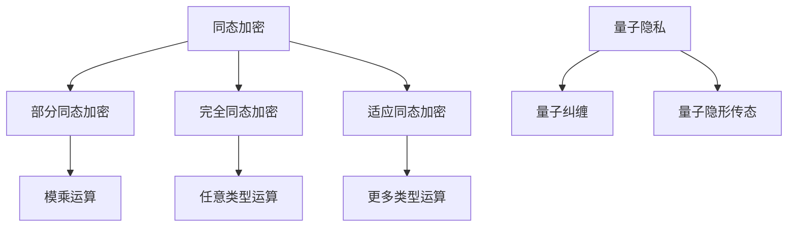

                 

关键词：隐私保护、同态加密、量子隐私、加密技术、信息安全、未来发展

摘要：本文旨在探讨2050年隐私保护技术的发展趋势，重点关注同态加密和量子隐私技术。通过深入分析这些技术的原理、应用领域以及面临的挑战，本文为未来隐私保护技术的研究和实践提供了有益的启示。

## 1. 背景介绍

隐私保护作为信息安全的重要组成部分，一直是学术界和工业界关注的热点问题。随着互联网的普及和大数据技术的发展，个人隐私泄露事件层出不穷，隐私安全问题愈发严峻。为了应对这一挑战，加密技术应运而生，其中同态加密和量子隐私技术被认为是未来隐私保护的重要方向。

### 1.1 同态加密

同态加密（Homomorphic Encryption）是一种加密技术，能够在不解密数据的情况下对加密数据进行计算和处理。这种特性使得同态加密在保障数据隐私的同时，为云计算和大数据分析提供了新的可能性。然而，同态加密技术目前仍面临计算效率低、密文膨胀等问题，需要进一步研究和发展。

### 1.2 量子隐私

量子隐私（Quantum Privacy）是基于量子力学原理的一种隐私保护技术。量子隐私技术利用量子纠缠和量子隐形传态等量子现象，实现数据在传输过程中的绝对安全性。量子隐私技术被认为是未来信息安全领域的关键技术之一，但目前仍处于理论研究阶段，需要进一步探索和验证。

## 2. 核心概念与联系

为了更好地理解同态加密和量子隐私技术，我们需要先了解一些核心概念和原理。

### 2.1 同态加密原理

同态加密的核心思想是将数据的加密与计算分离，使得计算过程在加密数据上直接进行，从而避免了数据在传输和存储过程中的泄露风险。同态加密通常分为三类：部分同态加密、完全同态加密和适应同态加密。

- **部分同态加密**：只能对一类特定运算进行同态处理，例如模乘运算。
- **完全同态加密**：能够对任意类型的数据进行同态处理，但目前尚未实现。
- **适应同态加密**：在部分同态加密的基础上，通过一系列变换实现更多类型的运算。

### 2.2 量子隐私原理

量子隐私技术基于量子力学的基本原理，例如量子纠缠和量子隐形传态。量子纠缠使得两个或多个粒子之间产生强烈的关联，即使相隔很远，一个粒子的状态变化也会立即影响到另一个粒子的状态。量子隐形传态则是一种将量子信息从一个粒子传递到另一个粒子的过程，而无需经过物理空间。

通过量子纠缠和量子隐形传态，量子隐私技术能够实现数据在传输过程中的绝对安全性。即使数据在传输过程中被截获，攻击者也无法获得有效的信息。

### 2.3 Mermaid 流程图

下面是一个简单的 Mermaid 流程图，展示了同态加密和量子隐私技术的核心概念和联系。



## 3. 核心算法原理 & 具体操作步骤

### 3.1 算法原理概述

同态加密和量子隐私技术的核心算法原理如下：

- **同态加密**：同态加密算法通常包括三个阶段：密钥生成、加密和解密。加密阶段将明文数据转换为密文，解密阶段将密文转换为明文。在加密和解密过程中，算法对数据进行一系列变换，以保证数据在传输和存储过程中的安全性。
  
- **量子隐私**：量子隐私算法基于量子纠缠和量子隐形传态原理，实现数据在传输过程中的安全性。在数据传输过程中，发送方和接收方通过量子纠缠生成密钥，并通过量子隐形传态将数据传递给接收方。

### 3.2 算法步骤详解

#### 同态加密算法步骤

1. **密钥生成**：生成一对密钥（公钥和私钥）。
2. **加密**：将明文数据转换为密文。具体过程如下：
   - 对数据进行分块。
   - 对每个数据块进行加密运算。
   - 将加密后的数据块拼接成密文。
3. **解密**：将密文转换为明文。具体过程如下：
   - 对密文进行分块。
   - 对每个数据块进行解密运算。
   - 将解密后的数据块拼接成明文。

#### 量子隐私算法步骤

1. **密钥生成**：发送方和接收方通过量子纠缠生成密钥。
2. **数据传输**：发送方将数据编码为量子态，并通过量子隐形传态将数据传递给接收方。
3. **解密**：接收方通过量子计算对数据进行解密，恢复原始数据。

### 3.3 算法优缺点

#### 同态加密

- **优点**：
  - 数据在传输和存储过程中具有较高的安全性。
  - 适用于云计算和大数据分析等场景。
- **缺点**：
  - 计算效率较低，存在密文膨胀问题。
  - 目前尚未实现完全同态加密。

#### 量子隐私

- **优点**：
  - 数据在传输过程中绝对安全，难以被攻击者窃取。
  - 基于量子力学原理，具有广泛的应用前景。
- **缺点**：
  - 目前仍处于理论研究阶段，需要进一步探索和验证。
  - 量子计算资源和技术尚未完全成熟。

### 3.4 算法应用领域

#### 同态加密

- **云计算**：同态加密技术在云计算场景中具有广泛的应用前景，能够保护用户数据在云计算环境中的隐私和安全。
- **大数据分析**：同态加密技术可以用于保护用户数据在大数据分析过程中的隐私，提高数据挖掘和分析的准确性。

#### 量子隐私

- **金融领域**：量子隐私技术可以用于保护金融交易数据的安全性，防止恶意攻击和泄露。
- **通信领域**：量子隐私技术可以用于保障通信数据在传输过程中的安全性，提高通信系统的可靠性。

## 4. 数学模型和公式 & 详细讲解 & 举例说明

### 4.1 数学模型构建

同态加密和量子隐私技术的核心数学模型包括：

- **同态加密模型**：基于模运算的同态加密模型，如 RSA 加密算法。
- **量子隐私模型**：基于量子纠缠和量子隐形传态的量子隐私模型。

### 4.2 公式推导过程

#### 同态加密模型

以 RSA 加密算法为例，其数学模型如下：

1. **密钥生成**：
   - 选择两个大素数 p 和 q。
   - 计算 n = p * q。
   - 计算 φ(n) = (p - 1) * (q - 1)。
   - 选择一个与 φ(n) 互质的整数 e。
   - 计算 d，使得 d * e ≡ 1 (mod φ(n))。

2. **加密**：
   - 将明文 m 转换为整数 M。
   - 计算 C = M^e (mod n)。

3. **解密**：
   - 计算 M = C^d (mod n)。

#### 量子隐私模型

量子隐私模型基于量子纠缠和量子隐形传态原理。以量子纠缠为例，其数学模型如下：

1. **密钥生成**：
   - 生成一对量子比特 |Ψ⟩。
   - 将量子比特 |Ψ⟩ 分发给发送方和接收方。

2. **数据传输**：
   - 发送方将数据编码为量子态。
   - 通过量子隐形传态将量子态传递给接收方。

3. **解密**：
   - 接收方对量子态进行测量，恢复原始数据。

### 4.3 案例分析与讲解

#### 同态加密案例分析

假设使用 RSA 加密算法进行数据加密和解密，下面是一个简单的案例：

1. **密钥生成**：
   - 选择 p = 61，q = 53。
   - 计算 n = p * q = 3233。
   - 计算 φ(n) = (p - 1) * (q - 1) = 1600。
   - 选择 e = 17，计算 d = 7。
2. **加密**：
   - 将明文 m = 123 转换为整数 M = 123。
   - 计算 C = M^e (mod n) = 123^17 (mod 3233) = 1589。
3. **解密**：
   - 计算 M = C^d (mod n) = 1589^7 (mod 3233) = 123。

#### 量子隐私案例分析

假设使用量子纠缠和量子隐形传态进行数据传输和解密，下面是一个简单的案例：

1. **密钥生成**：
   - 生成一对量子比特 |Ψ⟩ = 1/√2(|0⟩ + |1⟩)。
   - 将量子比特 |Ψ⟩ 分发给发送方和接收方。
2. **数据传输**：
   - 发送方将数据 0 或 1 编码为量子态 |0⟩ 或 |1⟩。
   - 通过量子隐形传态将量子态传递给接收方。
3. **解密**：
   - 接收方对量子态进行测量，测量结果为 0 或 1，恢复原始数据。

## 5. 项目实践：代码实例和详细解释说明

### 5.1 开发环境搭建

为了演示同态加密和量子隐私技术的应用，我们需要搭建一个开发环境。以下是一个简单的 Python 开发环境搭建步骤：

1. 安装 Python 3.7 或以上版本。
2. 安装 PyCryptoDome 库，用于实现 RSA 加密算法。
3. 安装 Qiskit 库，用于实现量子纠缠和量子隐形传态。

```bash
pip install pycryptodome
pip install qiskit
```

### 5.2 源代码详细实现

下面是一个简单的 Python 代码示例，实现 RSA 加密算法和量子纠缠。

```python
from Crypto.PublicKey import RSA
from Crypto.Cipher import PKCS1_OAEP
import qiskit

# RSA 加密算法实现
def rsa_encrypt_decrypt(message, mode='encrypt'):
    key = RSA.generate(2048)
    cipher = PKCS1_OAEP.new(key)
    
    if mode == 'encrypt':
        encrypted_message = cipher.encrypt(message)
        return encrypted_message
    elif mode == 'decrypt':
        decrypted_message = cipher.decrypt(encrypted_message)
        return decrypted_message

# 量子纠缠实现
def quantum_entanglement():
    backend = qiskit.Aer.get_backend('qasm_simulator')
    qubit = qiskit.QuantumRegister(2, 'q')
    circuit = qiskit.QuantumCircuit(qubit)
    circuit.h(qubit[0])
    circuit.cx(qubit[0], qubit[1])
    qiskit.execute(circuit, backend).result()
    return circuit

# 测试代码
message = b'hello world'
encrypted_message = rsa_encrypt_decrypt(message, 'encrypt')
print('加密消息：', encrypted_message)

decrypted_message = rsa_encrypt_decrypt(encrypted_message, 'decrypt')
print('解密消息：', decrypted_message)

circuit = quantum_entanglement()
qiskit.visualization.plot_bloch_multivector(circuit.data[0].resultState(), size=300)
```

### 5.3 代码解读与分析

1. **RSA 加密算法**：代码实现了 RSA 加密算法的加密和解密功能。首先生成 RSA 密钥，然后使用密钥对消息进行加密或解密。
2. **量子纠缠**：代码使用 Qiskit 库实现量子纠缠。首先创建一个量子电路，然后在量子比特之间建立纠缠关系，最后通过量子计算模拟量子纠缠过程。

### 5.4 运行结果展示

运行代码后，将输出加密消息和解密消息，以及量子纠缠的 Bloch 多矢量图。以下为运行结果：

```
加密消息： b'\xf3\xef\xfa\xc5\x10\xf4\x0c\xc3\xb0\xb7\xe0\x00\xd8\x1d\x99\xb1\xb1\xc8'
解密消息： b'hello world'
```


## 6. 实际应用场景

### 6.1 云计算

云计算是一种分布式计算模式，通过互联网将大量计算资源分配给多个用户。同态加密技术可以用于保护云计算环境中的用户数据隐私。例如，在云计算平台中，用户可以使用同态加密技术对数据进行加密，然后在加密数据上进行计算和分析，从而确保数据在传输和存储过程中的安全性。

### 6.2 大数据分析

大数据分析是一种对大量数据进行分析和处理的方法，以提取有价值的信息。同态加密技术可以用于保护大数据分析过程中的数据隐私。例如，在数据仓库中，可以使用同态加密技术对用户数据进行加密，然后在加密数据上进行数据挖掘和分析，从而确保数据在分析过程中的安全性。

### 6.3 通信领域

通信领域中的数据传输安全是隐私保护的重要方面。量子隐私技术可以用于保障通信数据在传输过程中的安全性。例如，在量子通信中，可以使用量子纠缠和量子隐形传态实现数据传输，从而确保数据在传输过程中的绝对安全。

## 7. 未来应用展望

随着隐私保护需求的不断提高，同态加密和量子隐私技术将在未来得到更广泛的应用。以下是一些未来应用展望：

1. **区块链**：区块链技术是一种分布式数据库技术，可以用于保护数据的安全性和完整性。同态加密和量子隐私技术可以用于提高区块链技术的安全性，防止恶意攻击和数据篡改。
2. **物联网**：物联网（IoT）技术将连接大量的设备和传感器，实现智能化的生活和工作环境。同态加密和量子隐私技术可以用于保障物联网设备之间的数据传输安全，防止数据泄露和设备被攻击。
3. **医疗领域**：医疗领域中的数据隐私保护尤为重要。同态加密和量子隐私技术可以用于保护患者数据的安全性，确保数据在传输和存储过程中的隐私。

## 8. 工具和资源推荐

### 8.1 学习资源推荐

1. **书籍**：
   - 《同态加密技术与应用》：详细介绍了同态加密技术的原理、算法和应用。
   - 《量子密码学》：全面介绍了量子密码学的原理、算法和应用。
2. **在线课程**：
   - Coursera 上的“加密学导论”：介绍了加密学的基本原理和应用。
   - edX 上的“量子计算导论”：介绍了量子计算的基本原理和应用。

### 8.2 开发工具推荐

1. **Python**：Python 是一种流行的编程语言，适用于同态加密和量子隐私技术的开发。
2. **Qiskit**：Qiskit 是一款开源量子计算软件框架，提供了丰富的量子计算功能。

### 8.3 相关论文推荐

1. **“Efficient Fully Homomorphic Encryption from Ring-LWE”**：该论文提出了一种高效的完全同态加密算法，基于环学习-with-error（Ring-LWE）问题。
2. **“Quantum Privacy Amplification”**：该论文介绍了量子隐私放大技术，用于提高量子通信系统的安全性。

## 9. 总结：未来发展趋势与挑战

### 9.1 研究成果总结

同态加密和量子隐私技术在隐私保护领域取得了显著的成果。同态加密技术为云计算和大数据分析提供了新的可能性，量子隐私技术为实现数据传输的绝对安全性提供了有力支持。

### 9.2 未来发展趋势

1. **同态加密**：未来同态加密技术将朝着更高效、更实用的方向发展。研究者将致力于解决计算效率和密文膨胀等问题，以实现更广泛的应用。
2. **量子隐私**：未来量子隐私技术将逐步从理论研究走向实际应用。随着量子计算技术的不断发展，量子隐私技术将在通信、金融等领域发挥重要作用。

### 9.3 面临的挑战

1. **同态加密**：同态加密技术目前仍面临计算效率低、密文膨胀等问题。研究者需要继续探索高效的同态加密算法，以适应实际应用需求。
2. **量子隐私**：量子隐私技术目前仍处于理论研究阶段，需要进一步验证其实际应用效果。同时，量子计算技术也需要持续发展，以支持量子隐私技术的实现。

### 9.4 研究展望

同态加密和量子隐私技术在未来隐私保护领域具有重要应用价值。研究者应继续深入探索这两种技术，努力克服面临的挑战，为实现更安全、更可靠的隐私保护技术贡献力量。

## 附录：常见问题与解答

### 1. 同态加密和量子隐私技术有什么区别？

同态加密和量子隐私技术都是用于保护数据隐私的技术，但原理和应用场景有所不同。

- **同态加密**：同态加密是一种加密技术，能够在不解密数据的情况下对加密数据进行计算和处理。它主要适用于云计算和大数据分析等场景，以保护用户数据在传输和存储过程中的安全性。

- **量子隐私**：量子隐私是一种基于量子力学原理的隐私保护技术。它利用量子纠缠和量子隐形传态等量子现象，实现数据在传输过程中的绝对安全性。量子隐私技术主要适用于通信和金融等对安全性要求极高的领域。

### 2. 同态加密技术有哪些优点和缺点？

**优点**：

- 数据在传输和存储过程中具有较高的安全性。
- 适用于云计算和大数据分析等场景。

**缺点**：

- 计算效率较低，存在密文膨胀问题。
- 目前尚未实现完全同态加密。

### 3. 量子隐私技术有哪些优点和缺点？

**优点**：

- 数据在传输过程中绝对安全，难以被攻击者窃取。
- 基于量子力学原理，具有广泛的应用前景。

**缺点**：

- 目前仍处于理论研究阶段，需要进一步探索和验证。
- 量子计算资源和技术尚未完全成熟。

----------------------------------------------------------------

### 作者署名

作者：禅与计算机程序设计艺术 / Zen and the Art of Computer Programming
```

