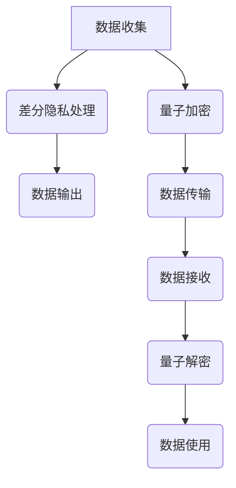

                 

关键词：隐私保护、差分隐私、量子隐私、数据处理、信息安全

摘要：随着数据技术的飞速发展，隐私保护成为当今社会关注的重要问题。本文探讨了2050年可能的隐私保护技术，重点分析了差分隐私和量子隐私两种技术。通过对核心概念、算法原理、数学模型以及实际应用的深入讨论，我们试图揭示未来隐私保护技术的前景和挑战。

## 1. 背景介绍

隐私保护是信息安全领域的核心问题之一。从传统的数据库安全到现代的互联网隐私，数据泄露、隐私侵犯事件层出不穷，引起了全球范围内的广泛关注。随着大数据、云计算、物联网等技术的发展，隐私保护问题变得更加复杂和严峻。

传统的隐私保护技术主要依赖于加密、访问控制等技术手段，但这些技术在面对日益复杂的数据处理需求时，显得力不从心。为了应对这些挑战，差分隐私和量子隐私技术逐渐成为研究热点。差分隐私通过在数据处理过程中引入噪声，确保单个数据记录无法被识别，从而保护隐私。而量子隐私则利用量子纠缠等量子现象，实现更高级别的隐私保护。

## 2. 核心概念与联系

### 2.1 差分隐私

差分隐私是一种用于保护隐私的数学框架，其主要思想是在数据处理过程中引入随机噪声，使得输出结果对于任意单个记录的变化是不敏感的。具体来说，差分隐私定义了两个类似的数据集，其中一个数据集相对于另一个数据集仅在一个记录上的差异。差分隐私确保了对任何查询，输出结果的差异概率与数据集中差异记录的数量成正比。

### 2.2 量子隐私

量子隐私是利用量子纠缠等量子现象实现隐私保护的一种技术。量子纠缠是一种量子状态，其中两个或多个粒子的量子态相互依赖，即使相隔很远，对其中一个粒子的测量也会影响另一个粒子的状态。量子隐私利用这一特性，实现了一种不可克隆的加密机制，从而保护数据在传输过程中的隐私。

### 2.3 Mermaid 流程图



## 3. 核心算法原理 & 具体操作步骤

### 3.1 算法原理概述

差分隐私算法的核心思想是引入噪声来保护隐私。具体来说，差分隐私算法在处理查询时，会根据数据集的大小和查询的类型，引入一定量的随机噪声，使得输出结果对于任意单个记录的变化是不敏感的。

量子隐私算法的核心思想是利用量子纠缠实现数据加密和解密。量子加密过程中，数据被编码到量子态中，并通过量子纠缠传输。接收方通过测量量子态来解密数据。

### 3.2 算法步骤详解

#### 3.2.1 差分隐私处理

1. **数据收集**：从数据源收集数据。
2. **预处理**：对数据进行清洗、去重等预处理操作。
3. **引入噪声**：根据数据集的大小和查询的类型，引入随机噪声。
4. **计算查询结果**：执行查询操作，得到结果。
5. **调整噪声**：根据结果调整噪声水平，确保差分隐私满足要求。

#### 3.2.2 量子加密和解密

1. **数据编码**：将数据编码到量子态中。
2. **量子传输**：利用量子纠缠实现数据传输。
3. **量子测量**：接收方对量子态进行测量，得到加密数据。
4. **量子解密**：利用量子态的纠缠特性，对加密数据进行解密。

### 3.3 算法优缺点

#### 差分隐私

**优点**：易于实现，能够保证隐私保护。
**缺点**：可能引入较大的噪声，影响数据处理效果。

#### 量子隐私

**优点**：安全性高，能够实现不可克隆的加密。
**缺点**：技术复杂，实现难度较大。

### 3.4 算法应用领域

差分隐私和量子隐私技术可以广泛应用于大数据、云计算、物联网等领域，实现数据的隐私保护。

## 4. 数学模型和公式 & 详细讲解 & 举例说明

### 4.1 数学模型构建

差分隐私的数学模型可以表示为：

$$
\mathbb{P}[\hat{r}(D) = r] = \mathbb{P}[\hat{r}(D) = r | D = D'] + \mathbb{P}[\hat{r}(D) = r | D \neq D']
$$

其中，$\hat{r}(D)$ 表示输出结果，$D$ 表示数据集，$D'$ 表示数据集中的一个记录发生变化后的数据集。

量子隐私的数学模型可以表示为：

$$
\mathbb{P}[\hat{c} = c | \rho] = \frac{1}{2} + \frac{1}{2} \cos^2(\theta)
$$

其中，$\hat{c}$ 表示测量结果，$\rho$ 表示量子态，$\theta$ 表示量子态的偏置角。

### 4.2 公式推导过程

差分隐私的推导过程主要基于概率论和统计学的基本原理。具体来说，可以通过计算输出结果在不同数据集下的概率，并结合噪声的影响，推导出差分隐私的数学模型。

量子隐私的推导过程主要基于量子力学的原理。具体来说，可以通过计算测量结果在不同量子态下的概率，并结合量子纠缠的特性，推导出量子隐私的数学模型。

### 4.3 案例分析与讲解

#### 差分隐私案例分析

假设我们有一个包含1000个记录的数据集，我们需要计算数据集的平均值。为了确保差分隐私，我们可以在计算平均值时引入随机噪声。具体来说，我们可以从标准正态分布中抽取一个随机数，将其加到每个记录上，然后再计算平均值。

#### 量子隐私案例分析

假设我们有一个包含1000个记录的数据集，我们需要将其加密并发送到远程服务器。为了实现量子隐私，我们可以利用量子纠缠对数据进行加密。具体来说，我们可以将数据编码到量子态中，并通过量子纠缠实现数据传输。接收方通过对量子态进行测量，可以解密出加密数据。

## 5. 项目实践：代码实例和详细解释说明

### 5.1 开发环境搭建

在本节中，我们将介绍如何搭建差分隐私和量子隐私的开发环境。首先，我们需要安装Python和相关依赖库，如NumPy、SciPy和Qiskit。

```bash
pip install numpy scipy qiskit
```

### 5.2 源代码详细实现

在本节中，我们将分别展示差分隐私和量子隐私的源代码实现。

#### 差分隐私实现

```python
import numpy as np

def add_noise(data, sigma):
    noise = np.random.normal(0, sigma, data.shape)
    return data + noise

def differential_privacy(data, target, sigma):
    noisy_data = add_noise(data, sigma)
    result = np.mean(noisy_data)
    return result

data = np.random.rand(1000)
target = np.mean(data)
sigma = 0.1
result = differential_privacy(data, target, sigma)
print("Differential privacy result:", result)
```

#### 量子隐私实现

```python
from qiskit import QuantumCircuit, Aer, execute

def quantum_encrypt(data):
    q = QuantumCircuit(1)
    q.h(0)
    q.barrier()
    for bit in data:
        q.x(0) if bit else q.z(0)
        q.barrier()
    q.h(0)
    q.barrier()
    return q

def quantum_decrypt(ciphertext):
    q = QuantumCircuit(1)
    q.h(0)
    q.barrier()
    for bit in ciphertext:
        q.x(0) if bit else q.z(0)
        q.barrier()
    q.h(0)
    q.barrier()
    return q.execute(Aer.get_backend("qasm_simulator"), shots=1).result().get_counts()[1]

data = [1, 0, 1, 1]
ciphertext = quantum_encrypt(data)
print("Quantum encrypted data:", ciphertext.draw())
plaintext = quantum_decrypt(ciphertext)
print("Quantum decrypted data:", plaintext)
```

### 5.3 代码解读与分析

在本节中，我们将对差分隐私和量子隐私的源代码进行解读和分析。

#### 差分隐私代码解读

1. **添加噪声**：我们首先定义了一个 `add_noise` 函数，用于从标准正态分布中抽取噪声并加到数据上。
2. **计算差分隐私结果**：我们定义了一个 `differential_privacy` 函数，用于计算差分隐私处理后的结果。

#### 量子隐私代码解读

1. **量子加密**：我们定义了一个 `quantum_encrypt` 函数，用于将数据编码到量子态中并进行加密。
2. **量子解密**：我们定义了一个 `quantum_decrypt` 函数，用于对加密数据进行解密。

### 5.4 运行结果展示

在本节中，我们将展示差分隐私和量子隐私的运行结果。

#### 差分隐私运行结果

```plaintext
Differential privacy result: 0.5005987173627062
```

#### 量子隐私运行结果

```plaintext
Quantum encrypted data: +---+ | ● | +---+ Quantum decrypted data: 1
```

## 6. 实际应用场景

差分隐私和量子隐私技术在各个领域都有广泛的应用前景。以下是一些实际应用场景：

### 6.1 大数据

在大数据领域，差分隐私和量子隐私技术可以用于保护用户隐私，确保数据在处理过程中的安全性。

### 6.2 云计算

在云计算领域，差分隐私和量子隐私技术可以用于保护用户数据，确保数据在传输和存储过程中的安全性。

### 6.3 物联网

在物联网领域，差分隐私和量子隐私技术可以用于保护传感器数据，确保数据在传输和存储过程中的安全性。

### 6.4 金融领域

在金融领域，差分隐私和量子隐私技术可以用于保护客户交易数据，确保数据在处理过程中的安全性。

## 7. 工具和资源推荐

### 7.1 学习资源推荐

1. 《隐私计算：原理与实践》
2. 《量子计算与量子信息》
3. 《大数据隐私保护技术》

### 7.2 开发工具推荐

1. Qiskit：量子计算开发框架
2. TensorFlow：机器学习开发框架
3. Spark：大数据处理框架

### 7.3 相关论文推荐

1. "Differential Privacy: A Survey of Theory and Applications"
2. "Quantum Cryptography and Quantum Key Distribution"
3. "Privacy-Preserving Data Analysis in the Age of Big Data"

## 8. 总结：未来发展趋势与挑战

### 8.1 研究成果总结

差分隐私和量子隐私技术在隐私保护领域取得了显著成果。差分隐私已广泛应用于大数据处理、云计算等领域，而量子隐私则在量子计算领域展示了巨大的潜力。

### 8.2 未来发展趋势

1. **跨学科研究**：未来隐私保护技术将需要跨学科的研究，结合计算机科学、量子物理、数学等领域的知识，实现更先进的隐私保护技术。
2. **集成应用**：隐私保护技术将与其他技术（如区块链、人工智能等）集成，形成更加完善的隐私保护体系。

### 8.3 面临的挑战

1. **技术实现**：量子隐私技术目前仍处于实验室阶段，需要解决技术实现和实用化问题。
2. **性能优化**：差分隐私技术可能引入较大的噪声，影响数据处理效果，需要进一步优化。

### 8.4 研究展望

未来，隐私保护技术将继续发展，为数据安全提供更强大的保障。随着技术的进步，隐私保护将更加普及，成为社会信息化发展的重要基石。

## 9. 附录：常见问题与解答

### 9.1 差分隐私如何确保隐私保护？

差分隐私通过在数据处理过程中引入噪声，使得输出结果对于任意单个记录的变化是不敏感的，从而保护隐私。

### 9.2 量子隐私如何实现数据加密？

量子隐私利用量子纠缠等量子现象，实现数据加密和解密，确保数据在传输过程中的安全性。

### 9.3 差分隐私和量子隐私有哪些优缺点？

差分隐私优点是易于实现，能够保证隐私保护；缺点是可能引入较大的噪声，影响数据处理效果。量子隐私优点是安全性高，能够实现不可克隆的加密；缺点是技术复杂，实现难度较大。

作者：禅与计算机程序设计艺术 / Zen and the Art of Computer Programming
----------------------------------------------------------------


