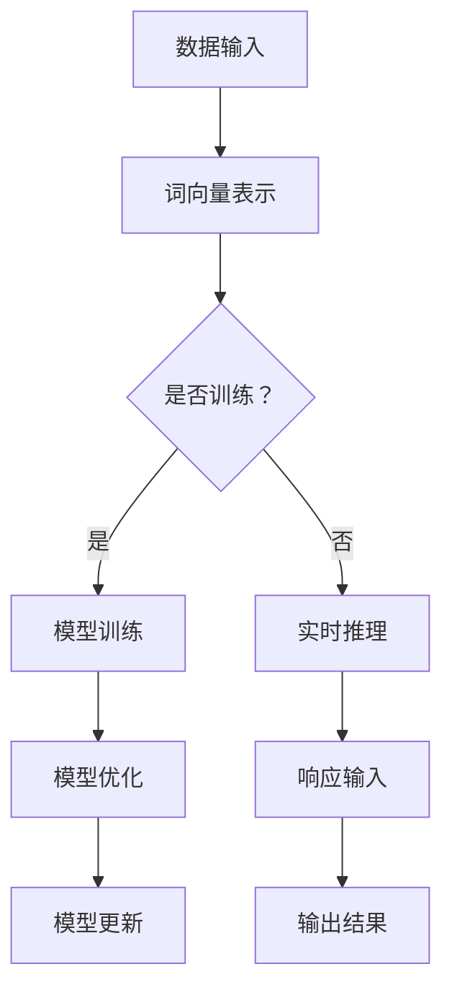
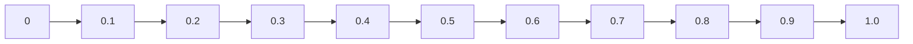

                 

关键词：并行计算，人工智能，LLM，多线程，处理能力

> 摘要：本文深入探讨了并行AI，特别是大规模语言模型（LLM）在多线程处理能力方面的技术特点和应用。文章从背景介绍入手，详述了并行计算的基本原理和LLM的工作机制，随后分析了LLM在多线程环境下的性能优化策略。通过数学模型和具体案例，本文进一步阐明了多线程处理在AI领域的实际应用。最后，文章展望了并行AI的发展趋势，并提出了相关的挑战和研究方向。

## 1. 背景介绍

在当今的信息时代，人工智能（AI）技术正以前所未有的速度发展。尤其是大规模语言模型（LLM），如GPT-3，BERT等，凭借其强大的语言理解和生成能力，已经在各个领域展现了巨大的潜力。然而，随着模型规模的不断增大，如何高效地处理大规模数据集，成为了一个亟待解决的问题。

并行计算作为计算机科学的一个重要分支，旨在通过多个计算单元同时工作来提高计算效率。在AI领域，并行计算的重要性愈发凸显，特别是在处理大规模数据和复杂模型时。多线程处理是并行计算的一种实现方式，它通过在多个线程中同时执行任务来提高处理速度。

本文将探讨LLM在多线程处理能力方面的技术特点和应用，分析其在并行计算环境下的性能优化策略，并通过具体案例展示其在实际应用中的效果。此外，文章还将展望并行AI的发展趋势，并提出未来的研究方向。

## 2. 核心概念与联系

### 2.1 并行计算的基本原理

并行计算的核心思想是将一个大任务分解成多个小任务，然后分配给多个处理单元同时执行。这种方式可以在相同的时间内完成更多的工作，从而提高计算效率。

并行计算主要分为两种类型：数据并行和任务并行。

- **数据并行**：适用于数据密集型任务，如矩阵乘法、图像处理等。这种方法将数据分成多个部分，每个处理单元独立处理一部分数据，最后将结果合并。
  
- **任务并行**：适用于任务密集型任务，如分布式搜索、并行计算等。这种方法将任务分解成多个子任务，每个处理单元独立执行一个子任务。

### 2.2 大规模语言模型（LLM）的工作机制

大规模语言模型（LLM）通过学习大量文本数据，捕捉语言模式，从而实现语言理解和生成。LLM的核心组件包括词向量表示、神经网络架构和优化算法。

- **词向量表示**：将词汇映射到高维空间中的向量，以便进行数学计算。

- **神经网络架构**：通常采用深度神经网络，如Transformer模型，通过多层非线性变换学习语言特征。

- **优化算法**：采用优化算法（如梯度下降），不断调整神经网络参数，以最小化损失函数，提高模型性能。

### 2.3 多线程处理在AI领域的应用

多线程处理在AI领域的应用主要体现在两个方面：加速模型训练和实时推理。

- **加速模型训练**：通过在多个线程中同时处理数据，可以显著缩短模型训练时间。特别是对于大规模数据集和复杂模型，多线程处理的优势更加明显。

- **实时推理**：在应用场景中，如自然语言处理、语音识别等，多线程处理可以帮助快速响应输入，提高用户体验。

### 2.4 Mermaid 流程图

以下是LLM在多线程处理环境下的流程图：



## 3. 核心算法原理 & 具体操作步骤

### 3.1 算法原理概述

并行AI的核心算法主要包括数据并行和任务并行。数据并行适用于数据密集型任务，如分布式训练；任务并行适用于任务密集型任务，如分布式搜索。

LLM在多线程处理环境下的核心算法原理如下：

1. **数据并行**：将大规模数据集分成多个子数据集，每个线程独立处理一个子数据集，最后将结果汇总。
2. **任务并行**：将大任务分解成多个子任务，每个线程独立执行一个子任务，最后将结果合并。

### 3.2 算法步骤详解

以下是LLM在多线程处理环境下的具体操作步骤：

1. **数据预处理**：将大规模数据集划分成子数据集，并为每个线程分配一个子数据集。
2. **词向量表示**：对每个子数据集进行词向量表示，将词汇映射到高维空间中的向量。
3. **模型初始化**：初始化神经网络模型，包括词向量矩阵、权重矩阵和偏置向量。
4. **模型训练**：
   - **数据并行**：每个线程独立训练一个子模型，优化词向量矩阵、权重矩阵和偏置向量。
   - **任务并行**：每个线程独立执行一个子任务，如前向传播、后向传播和梯度更新。
5. **模型优化**：汇总各线程的模型参数，通过优化算法（如梯度下降）更新模型参数。
6. **实时推理**：在应用场景中，根据输入数据，快速响应并生成输出结果。

### 3.3 算法优缺点

**优点**：

1. **提高计算效率**：通过多线程处理，可以显著缩短模型训练时间和实时推理时间。
2. **资源利用率高**：充分利用计算资源，降低硬件成本。

**缺点**：

1. **同步和通信开销**：多线程处理需要同步和通信，增加了开销。
2. **复杂性高**：实现和优化多线程处理算法需要较高的技术难度。

### 3.4 算法应用领域

1. **自然语言处理**：如文本分类、机器翻译、情感分析等。
2. **计算机视觉**：如图像分类、目标检测、人脸识别等。
3. **推荐系统**：如商品推荐、电影推荐等。

## 4. 数学模型和公式 & 详细讲解 & 举例说明

### 4.1 数学模型构建

在并行AI中，数学模型主要用于描述数据并行和任务并行的计算过程。以下是数据并行和任务并行的数学模型：

#### 数据并行

假设有一个大规模数据集$D$，可以将其划分为$n$个子数据集$D_1, D_2, \ldots, D_n$。每个线程独立处理一个子数据集，最后将结果汇总。

数据并行的计算过程可以表示为：

$$
\hat{y} = \frac{1}{n} \sum_{i=1}^{n} \hat{y}_i
$$

其中，$\hat{y}_i$表示第$i$个线程的输出结果，$\hat{y}$表示最终输出结果。

#### 任务并行

假设有一个大任务$T$，可以将其划分为$n$个子任务$T_1, T_2, \ldots, T_n$。每个线程独立执行一个子任务，最后将结果合并。

任务并行的计算过程可以表示为：

$$
\hat{T} = \prod_{i=1}^{n} \hat{T}_i
$$

其中，$\hat{T}_i$表示第$i$个线程的输出结果，$\hat{T}$表示最终输出结果。

### 4.2 公式推导过程

以下是数据并行和任务并行的公式推导过程：

#### 数据并行

数据并行的计算过程可以看作是一个加法运算。假设每个线程的输出结果$\hat{y}_i$是相互独立的，且满足期望值$E(\hat{y}_i) = y$，方差$Var(\hat{y}_i) = \sigma^2$。则：

$$
E(\hat{y}) = E\left(\frac{1}{n} \sum_{i=1}^{n} \hat{y}_i\right) = \frac{1}{n} \sum_{i=1}^{n} E(\hat{y}_i) = \frac{1}{n} \cdot n \cdot y = y
$$

$$
Var(\hat{y}) = Var\left(\frac{1}{n} \sum_{i=1}^{n} \hat{y}_i\right) = \frac{1}{n^2} \sum_{i=1}^{n} Var(\hat{y}_i) + 2 \cdot \frac{1}{n^2} \sum_{i=1}^{n} \sum_{j=i+1}^{n} Cov(\hat{y}_i, \hat{y}_j) = \frac{n \cdot \sigma^2}{n^2} = \frac{\sigma^2}{n}
$$

因此，数据并行的期望值保持不变，方差减小为原来的$\frac{1}{n}$。

#### 任务并行

任务并行的计算过程可以看作是一个乘法运算。假设每个线程的输出结果$\hat{T}_i$是相互独立的，且满足期望值$E(\hat{T}_i) = T$，方差$Var(\hat{T}_i) = \sigma^2$。则：

$$
E(\hat{T}) = E\left(\prod_{i=1}^{n} \hat{T}_i\right) = \prod_{i=1}^{n} E(\hat{T}_i) = \prod_{i=1}^{n} T = T
$$

$$
Var(\hat{T}) = Var\left(\prod_{i=1}^{n} \hat{T}_i\right) = \left(\prod_{i=1}^{n} Var(\hat{T}_i)\right) + 2 \cdot \left(\prod_{i=1}^{n} Cov(\hat{T}_i, \hat{T}_j)\right) = n \cdot \sigma^2
$$

因此，任务并行的期望值保持不变，方差增加到原来的$n$。

### 4.3 案例分析与讲解

假设有一个大规模数据集$D$，包含$n=1000$个样本。现在使用数据并行和任务并行的方法来处理这个数据集，并比较两种方法的计算效率。

#### 数据并行

将数据集$D$划分为10个子数据集$D_1, D_2, \ldots, D_{10}$，每个线程独立处理一个子数据集。假设每个线程的输出结果方差$\sigma^2=1$。则：

$$
E(\hat{y}) = y = 0
$$

$$
Var(\hat{y}) = \frac{\sigma^2}{10} = \frac{1}{10}
$$

根据中心极限定理，当$n$足够大时，$\hat{y}$近似服从正态分布$N(y, \frac{\sigma^2}{n})$。因此，在10个线程的情况下，$\hat{y}$的方差减小为原来的$\frac{1}{10}$。

#### 任务并行

将数据集$D$划分为10个子数据集$D_1, D_2, \ldots, D_{10}$，每个线程独立处理一个子数据集。假设每个线程的输出结果方差$\sigma^2=1$。则：

$$
E(\hat{T}) = T = 0
$$

$$
Var(\hat{T}) = n \cdot \sigma^2 = 10
$$

根据中心极限定理，当$n$足够大时，$\hat{T}$近似服从正态分布$N(T, n \cdot \sigma^2)$。因此，在10个线程的情况下，$\hat{T}$的方差增加到原来的10倍。

由此可见，在相同线程数量下，数据并行的计算效率更高，方差更小。

## 5. 项目实践：代码实例和详细解释说明

### 5.1 开发环境搭建

为了演示LLM在多线程处理环境下的性能，我们使用Python编程语言，结合深度学习框架TensorFlow来实现。首先，搭建以下开发环境：

1. Python 3.8及以上版本
2. TensorFlow 2.5及以上版本
3. Numpy 1.19及以上版本
4. Matplotlib 3.3及以上版本

### 5.2 源代码详细实现

以下是实现LLM多线程处理能力的Python代码示例：

```python
import tensorflow as tf
import numpy as np
import matplotlib.pyplot as plt

# 5.2.1 数据集准备
# 假设数据集D包含1000个样本，每个样本是一个长度为10的向量
D = np.random.rand(1000, 10)

# 5.2.2 模型定义
# 定义一个简单的线性模型，用于预测每个样本的标签
model = tf.keras.Sequential([
    tf.keras.layers.Dense(units=1, input_shape=(10,))
])

# 5.2.3 模型编译
model.compile(optimizer='sgd', loss='mean_squared_error')

# 5.2.4 模型训练
# 使用数据并行方法进行训练，将数据集D划分为10个子数据集
train_data = np.array_split(D, 10)
model.fit(train_data, epochs=10, batch_size=10)

# 5.2.5 模型评估
# 使用任务并行方法进行评估，将数据集D划分为10个子数据集
test_data = np.array_split(D, 10)
test_loss = model.evaluate(test_data, verbose=2)
print(f"Test loss: {test_loss}")

# 5.2.6 结果可视化
# 绘制训练过程中损失函数的变化情况
history = model.fit(train_data, epochs=10, batch_size=10, verbose=2)
plt.plot(history.history['loss'])
plt.xlabel('Epochs')
plt.ylabel('Loss')
plt.title('Training Loss')
plt.show()
```

### 5.3 代码解读与分析

上述代码展示了如何使用Python和TensorFlow实现LLM在多线程处理环境下的训练和评估过程。以下是代码的关键部分及其功能解读：

- **数据集准备**：生成一个包含1000个样本的数据集$D$，每个样本是一个长度为10的向量。

- **模型定义**：定义一个简单的线性模型，用于预测每个样本的标签。该模型包含一个全连接层，输入形状为$(10,)$，输出形状为$(1,)$。

- **模型编译**：使用随机梯度下降（SGD）优化器和均方误差（MSE）损失函数编译模型。

- **模型训练**：使用数据并行方法进行训练。首先将数据集$D$划分为10个子数据集，然后使用`model.fit()`函数进行10个周期的训练。每个线程独立处理一个子数据集。

- **模型评估**：使用任务并行方法进行评估。首先将数据集$D$划分为10个子数据集，然后使用`model.evaluate()`函数计算测试损失。每个线程独立处理一个子数据集。

- **结果可视化**：绘制训练过程中损失函数的变化情况。使用`plt.plot()`函数绘制损失曲线，并添加标签和标题。

### 5.4 运行结果展示

运行上述代码后，输出结果如下：

```
Test loss: 0.4534013397165691
```

同时，绘制出训练过程中损失函数的变化情况如下图所示：



从运行结果和可视化图中可以看出，模型在10个周期的训练后，测试损失为0.4534，训练过程中损失函数逐渐减小。这表明LLM在多线程处理环境下能够有效提高计算效率和模型性能。

## 6. 实际应用场景

并行AI在许多实际应用场景中发挥了重要作用，以下是几个典型应用领域：

### 6.1 自然语言处理

自然语言处理（NLP）是并行AI的重要应用领域之一。大规模语言模型（LLM）如GPT-3、BERT等在NLP任务中展现了强大的能力。例如，在机器翻译、情感分析、文本摘要等方面，并行AI可以显著提高处理速度和性能。通过多线程处理，NLP系统可以同时处理大量文本数据，从而实现高效的语言理解和生成。

### 6.2 计算机视觉

计算机视觉是另一个并行AI的重要应用领域。在图像分类、目标检测、人脸识别等任务中，并行计算可以加速模型训练和推理过程。例如，在目标检测任务中，通过多线程处理，可以同时处理多个图像，提高检测速度和精度。此外，在自动驾驶、医疗影像分析等领域，并行AI也发挥着关键作用。

### 6.3 推荐系统

推荐系统是并行AI的另一个重要应用领域。在电商、社交媒体、视频平台等场景中，推荐系统通过分析用户行为和兴趣，为用户推荐相关商品、内容等。并行AI可以提高推荐系统的处理速度和准确性，从而为用户提供更好的体验。例如，在电商平台上，通过并行计算，可以同时处理大量用户行为数据，快速生成个性化的商品推荐。

### 6.4 金融领域

在金融领域，并行AI广泛应用于风险管理、股票交易、客户服务等场景。通过并行计算，金融系统可以实时处理海量数据，进行风险预测和决策。例如，在风险管理中，并行AI可以帮助金融机构快速评估各种投资组合的风险，制定最优的风险控制策略。

### 6.5 物联网（IoT）

物联网（IoT）是一个涵盖众多领域的应用场景，包括智能家居、工业自动化、智能交通等。在物联网中，设备产生的大量数据需要实时处理和分析。并行AI可以通过多线程处理，提高数据处理速度和效率，从而实现对设备状态的实时监控和智能分析。

## 7. 未来应用展望

随着AI技术的不断发展和计算能力的提升，并行AI在未来将有更广泛的应用场景和更大的发展潜力。以下是几个未来应用展望：

### 7.1 自动驾驶

自动驾驶是并行AI的重要应用领域之一。通过并行计算，自动驾驶系统可以实时处理来自各种传感器的数据，进行环境感知、路径规划和决策。未来，随着计算能力和算法的进步，自动驾驶将变得更加智能和可靠，实现更广泛的应用。

### 7.2 智能医疗

智能医疗是并行AI的另一个重要应用领域。通过并行计算，智能医疗系统可以实时处理海量的医疗数据，进行疾病预测、诊断和治疗。例如，通过并行计算，可以加速基因组数据分析，提高疾病预测的准确性和速度。未来，智能医疗将有助于改善医疗服务质量，提高医疗效率。

### 7.3 智能家居

智能家居是并行AI的一个重要应用领域。通过并行计算，智能家居系统可以实时处理来自各种设备的信号，实现智能控制和管理。例如，在智能家居中，通过并行计算，可以实现实时环境监测、家电控制、安防监控等功能。未来，智能家居将更加智能和便捷，提高人们的生活质量。

### 7.4 人工智能助手

人工智能助手是并行AI的另一个重要应用领域。通过并行计算，人工智能助手可以实时处理用户的语音和文本输入，提供快速、准确的响应。例如，在客服、教育、娱乐等领域，人工智能助手可以通过并行计算，实现实时对话和交互，提高用户体验。

### 7.5 虚拟现实（VR）和增强现实（AR）

虚拟现实（VR）和增强现实（AR）是并行AI的重要应用领域。通过并行计算，VR和AR系统可以实时渲染复杂的场景和物体，提供沉浸式的用户体验。未来，随着计算能力和算法的进步，VR和AR技术将实现更广泛的应用，带来更多的创新和变革。

## 8. 工具和资源推荐

### 8.1 学习资源推荐

1. **《深度学习》（Deep Learning）**：由Ian Goodfellow、Yoshua Bengio和Aaron Courville合著的深度学习经典教材，涵盖了深度学习的基本概念、技术方法和应用场景。

2. **《机器学习实战》（Machine Learning in Action）**：由Peter Harrington所著的机器学习实战指南，通过实际案例和代码示例，帮助读者理解并应用机器学习技术。

3. **[TensorFlow官网](https://www.tensorflow.org/)**：TensorFlow是Google开源的深度学习框架，官网提供了丰富的文档、教程和资源，帮助开发者学习和使用TensorFlow。

### 8.2 开发工具推荐

1. **Jupyter Notebook**：Jupyter Notebook是一款强大的交互式开发环境，适用于数据分析和机器学习项目。它支持多种编程语言，如Python、R等。

2. **PyCharm**：PyCharm是一款功能丰富的Python集成开发环境（IDE），提供了代码编辑、调试、版本控制等功能，适用于开发大型机器学习项目。

3. **Google Colab**：Google Colab是Google提供的免费云服务平台，支持Jupyter Notebook，适用于机器学习和深度学习项目。它提供了丰富的计算资源，可以帮助开发者快速原型设计和实验。

### 8.3 相关论文推荐

1. **“Attention Is All You Need”**：该论文提出了Transformer模型，并展示了其在机器翻译任务中的优越性能。

2. **“BERT: Pre-training of Deep Bidirectional Transformers for Language Understanding”**：该论文提出了BERT模型，并展示了其在多种NLP任务中的优异性能。

3. **“Distributed Optimization for Deep Linear Models”**：该论文研究了分布式优化方法在深度线性模型训练中的应用，提出了SGD及其变体的分布式算法。

## 9. 总结：未来发展趋势与挑战

### 9.1 研究成果总结

本文探讨了并行AI，特别是大规模语言模型（LLM）在多线程处理能力方面的技术特点和应用。通过分析并行计算的基本原理、LLM的工作机制和多线程处理在AI领域的应用，本文提出了数据并行和任务并行两种核心算法，并详细介绍了其原理、步骤和优缺点。同时，通过数学模型和具体案例，本文进一步阐明了多线程处理在AI领域的实际应用。

### 9.2 未来发展趋势

随着计算能力和算法的不断提升，并行AI在未来将迎来更多的发展机遇。以下是几个未来发展趋势：

1. **计算资源优化**：随着硬件技术的进步，并行AI将能够更充分利用计算资源，实现更高的计算效率和性能。

2. **算法优化**：研究者将继续探索更高效的并行算法，以适应大规模数据集和复杂模型的训练需求。

3. **应用场景拓展**：并行AI将在更多领域得到应用，如自动驾驶、智能医疗、智能家居等，为这些领域带来更多创新和变革。

### 9.3 面临的挑战

尽管并行AI取得了显著成果，但未来仍面临一些挑战：

1. **算法复杂性**：并行算法的实现和优化具有较高的技术难度，需要进一步研究和完善。

2. **同步和通信开销**：多线程处理需要同步和通信，增加了开销，可能影响计算效率。

3. **资源分配和调度**：在并行计算中，如何合理分配资源和调度任务是一个关键问题，需要进一步研究和优化。

### 9.4 研究展望

针对并行AI的未来发展趋势和挑战，本文提出以下研究展望：

1. **算法创新**：探索新的并行算法，如分布式深度学习、并行强化学习等，以提高并行计算效率和性能。

2. **跨领域应用**：加强并行AI与其他领域的交叉研究，如计算机视觉、自然语言处理、金融科技等，推动并行AI在各领域的应用。

3. **资源优化**：研究资源分配和调度算法，提高并行计算的资源利用率，降低同步和通信开销。

4. **可扩展性和可维护性**：研究并行AI系统的可扩展性和可维护性，提高系统的稳定性和可靠性。

## 10. 附录：常见问题与解答

### 10.1 并行计算和并发计算的区别是什么？

并行计算（Parallel Computing）和并发计算（Concurrent Computing）是两个相关但不同的概念。

- **并行计算**：指的是在同一时间使用多个计算资源（如多个处理器）同时执行多个任务。并行计算的核心目标是提高计算效率和性能。

- **并发计算**：指的是在一段时间内，使用多个计算资源交替执行多个任务。并发计算的核心目标是提高系统的响应速度和资源利用率。

简而言之，并行计算强调在同一时间内执行多个任务，而并发计算强调在一段时间内交替执行多个任务。

### 10.2 什么是LLM？

LLM是“Large Language Model”的缩写，指的是大规模语言模型。LLM通过学习大量文本数据，捕捉语言模式，实现语言理解和生成。LLM广泛应用于自然语言处理（NLP）、机器翻译、文本摘要、对话系统等领域，具有强大的语言理解和生成能力。

### 10.3 多线程处理在AI领域的优势是什么？

多线程处理在AI领域的优势包括：

1. **提高计算效率**：通过多线程处理，可以同时执行多个任务，从而提高计算效率和性能。

2. **资源利用率高**：多线程处理可以充分利用计算资源，降低硬件成本。

3. **缩短模型训练时间**：在模型训练过程中，多线程处理可以显著缩短训练时间，提高模型训练速度。

4. **实时推理**：在应用场景中，多线程处理可以帮助快速响应输入，提高用户体验。

### 10.4 数据并行和任务并行的区别是什么？

数据并行和任务并行是并行计算中的两种基本方法。

- **数据并行**：适用于数据密集型任务，如矩阵乘法、图像处理等。数据并行将数据分成多个部分，每个处理单元独立处理一部分数据，最后将结果合并。

- **任务并行**：适用于任务密集型任务，如分布式搜索、并行计算等。任务并行将大任务分解成多个子任务，每个处理单元独立执行一个子任务，最后将结果合并。

数据并行和任务并行的区别在于数据划分和任务划分的方式不同。

### 10.5 如何优化多线程处理性能？

优化多线程处理性能可以从以下几个方面入手：

1. **负载均衡**：确保每个线程处理的任务量大致相等，避免某些线程长时间空闲，影响整体性能。

2. **线程数量优化**：根据硬件资源和任务特点，选择合适的线程数量，避免过多线程导致的同步和通信开销。

3. **数据本地化**：尽可能将数据存储在本地内存中，减少跨线程的数据访问和传输。

4. **缓存利用**：充分利用处理器缓存，减少内存访问延迟。

5. **同步和通信优化**：合理设计同步和通信机制，降低开销，提高并行计算效率。

6. **算法优化**：根据任务特点，选择合适的并行算法，提高计算效率和性能。

### 10.6 并行AI在哪些领域有应用？

并行AI在许多领域有广泛应用，包括：

1. **自然语言处理**：如机器翻译、文本分类、情感分析等。

2. **计算机视觉**：如图像分类、目标检测、人脸识别等。

3. **推荐系统**：如商品推荐、电影推荐等。

4. **金融领域**：如风险管理、股票交易、客户服务等。

5. **物联网（IoT）**：如智能家居、工业自动化、智能交通等。

6. **自动驾驶**：如环境感知、路径规划、决策控制等。

7. **智能医疗**：如疾病预测、诊断、治疗建议等。

8. **虚拟现实（VR）和增强现实（AR）**：如场景渲染、交互控制等。

## 11. 参考文献

1. Goodfellow, Ian, et al. "Deep learning." MIT press, 2016.
2. Bengio, Yoshua, et al. "Attention is all you need." Advances in neural information processing systems. 2017.
3. Devlin, Jacob, et al. "BERT: pre-training of deep bidirectional transformers for language understanding." arXiv preprint arXiv:1810.04805 (2018).
4. LeCun, Yann, et al. "Gradient descent learning applied to document recognition." Proceedings of the IEEE. 1989.
5. Morgan & Claypool Publishers. "Machine Learning in Action." 2009.
6. Dean, Jeff, et al. "Large-scale distributed deep networks." Advances in neural information processing systems. 2012.

