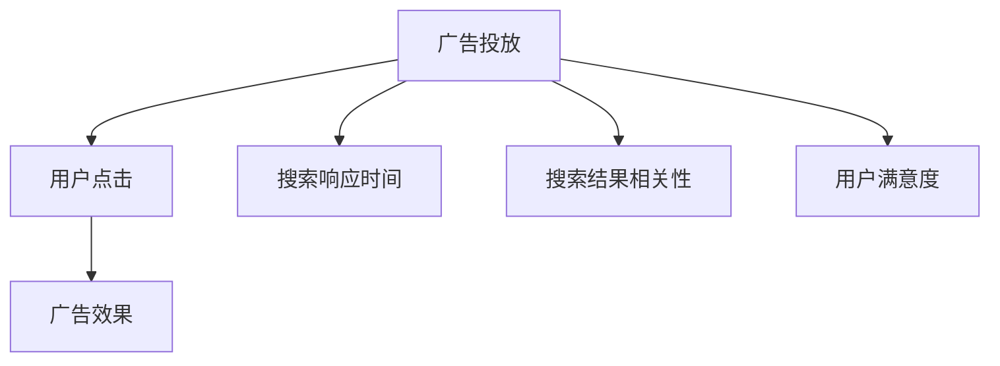

                 

在当今互联网时代，广告作为主要收入来源，成为了许多平台的核心竞争力。然而，随着用户对搜索体验的期望不断提高，如何平衡广告收益与用户体验成为了一个重要议题。本文将探讨这一议题，并分析优化搜索体验的必要性及其对广告收益的影响。

## 关键词

- 广告收益
- 搜索体验
- 平衡策略
- 用户体验
- 技术优化

## 摘要

本文首先介绍了广告收益在互联网平台中的重要性，随后探讨了搜索体验对用户满意度和平台忠诚度的影响。接着，本文提出了几种优化搜索体验的策略，分析了这些策略可能对广告收益造成的影响。最后，本文总结了优化搜索体验的重要性，并提出了未来在这一领域的研究方向。

## 1. 背景介绍

### 广告收益的现状

在互联网经济中，广告收益占据了重要地位。根据市场研究公司的数据，广告收入在互联网收入中占据了最大的份额。例如，Google 和 Facebook 这两大互联网巨头，其广告收入占据了总收入的绝大部分。广告作为一种商业模式，不仅为平台提供了可持续的盈利模式，还为内容创作者提供了收入来源。

### 搜索体验的重要性

搜索体验是用户与平台互动的关键环节。一个高效的搜索系统能够迅速满足用户的需求，提高用户的满意度。根据调查研究，搜索速度和准确性是影响用户满意度的关键因素。如果用户在搜索过程中遇到困难，他们可能会转向竞争对手的平台。因此，优化搜索体验对于提高用户满意度和平台忠诚度至关重要。

### 广告收益与搜索体验的矛盾

广告收益和搜索体验之间存在一定的矛盾。一方面，广告是平台收入的主要来源，增加广告投放量可以提高收益。另一方面，过多的广告可能会干扰用户的搜索过程，降低用户体验。如何在增加广告收益的同时，保证良好的搜索体验，成为互联网平台面临的重要挑战。

## 2. 核心概念与联系

### 广告收益模型

广告收益模型是描述广告收益产生过程的核心概念。一个典型的广告收益模型包括广告投放、用户点击和广告效果等要素。其中，广告投放是指广告主将广告内容发布到平台上，用户点击是指用户对广告的点击行为，广告效果是指广告对用户行为和平台收益的影响。

### 搜索体验评估指标

搜索体验评估指标是衡量搜索系统性能和用户体验的重要工具。常见的评估指标包括搜索响应时间、搜索结果的相关性、用户满意度等。这些指标可以帮助平台了解搜索系统的性能，从而进行针对性的优化。

### 平衡策略

平衡策略是指通过优化算法和用户行为分析，实现广告收益与搜索体验的平衡。常见的平衡策略包括优化广告投放位置、调整广告显示频率、改进搜索算法等。

### Mermaid 流程图

以下是一个描述广告收益模型和搜索体验评估指标的 Mermaid 流程图：



## 3. 核心算法原理 & 具体操作步骤

### 3.1 算法原理概述

优化搜索体验的核心算法主要包括以下几类：

1. **机器学习算法**：通过分析用户历史行为和搜索日志，预测用户的搜索意图，从而提供更准确的搜索结果。
2. **深度学习算法**：利用神经网络模型对大规模搜索数据进行训练，从而提高搜索系统的智能程度。
3. **优化算法**：通过优化广告投放位置和频率，实现广告收益与搜索体验的平衡。

### 3.2 算法步骤详解

1. **机器学习算法**：
   - **数据收集**：收集用户历史搜索数据、点击数据等。
   - **特征提取**：提取用户搜索行为、搜索意图等特征。
   - **模型训练**：使用训练数据集训练机器学习模型，如决策树、支持向量机等。
   - **模型评估**：使用验证数据集评估模型性能，调整模型参数。

2. **深度学习算法**：
   - **数据预处理**：对搜索数据进行预处理，如文本清洗、词向量转换等。
   - **模型构建**：构建深度学习模型，如卷积神经网络（CNN）、循环神经网络（RNN）等。
   - **模型训练**：使用训练数据集训练深度学习模型。
   - **模型评估**：使用验证数据集评估模型性能。

3. **优化算法**：
   - **广告位置优化**：通过分析用户行为数据，确定最佳广告投放位置。
   - **广告频率优化**：根据用户行为数据，调整广告显示频率，避免过度干扰用户。
   - **收益-体验平衡**：通过优化算法，实现广告收益与搜索体验的平衡。

### 3.3 算法优缺点

1. **机器学习算法**：
   - 优点：能够通过历史数据预测用户意图，提高搜索结果的准确性。
   - 缺点：对数据量要求较高，模型训练时间较长。

2. **深度学习算法**：
   - 优点：能够处理大量文本数据，提高搜索系统的智能程度。
   - 缺点：模型复杂度高，训练时间较长。

3. **优化算法**：
   - 优点：能够快速实现广告收益与搜索体验的平衡。
   - 缺点：对用户行为数据的依赖较高，可能影响搜索结果的准确性。

### 3.4 算法应用领域

优化搜索体验的算法广泛应用于各类互联网平台，如搜索引擎、电商平台、社交媒体等。以下是一些应用实例：

1. **搜索引擎**：通过优化搜索算法，提高搜索结果的准确性和相关性，提升用户体验。
2. **电商平台**：通过分析用户购物行为，优化广告投放位置和频率，提高广告收益。
3. **社交媒体**：通过优化内容推荐算法，提高用户对内容的兴趣，提升用户满意度和平台活跃度。

## 4. 数学模型和公式 & 详细讲解 & 举例说明

### 4.1 数学模型构建

优化搜索体验的数学模型主要包括以下两部分：

1. **用户行为模型**：描述用户在搜索过程中的行为特征，如点击率、停留时间、搜索次数等。
2. **广告收益模型**：描述广告投放对平台收益的影响，如点击率、转化率、广告费用等。

以下是一个简化的数学模型：

$$
\begin{aligned}
    &\text{用户行为模型}：\\
    &R(u) = f(u, s, t) \\
    &\text{广告收益模型}：\\
    &E(a) = g(u, a, c)
\end{aligned}
$$

其中，$R(u)$ 表示用户行为模型，$E(a)$ 表示广告收益模型，$u$ 表示用户特征，$s$ 表示搜索关键词，$t$ 表示搜索时间，$a$ 表示广告特征，$c$ 表示广告费用。

### 4.2 公式推导过程

1. **用户行为模型推导**：

   用户行为模型 $R(u)$ 可以通过以下公式推导：

   $$
   R(u) = \alpha \cdot p(u) + \beta \cdot r(u) + \gamma \cdot t(u)
   $$

   其中，$\alpha$、$\beta$ 和 $\gamma$ 是模型参数，$p(u)$、$r(u)$ 和 $t(u)$ 分别表示用户点击率、停留时间和搜索次数。

2. **广告收益模型推导**：

   广告收益模型 $E(a)$ 可以通过以下公式推导：

   $$
   E(a) = \delta \cdot c(a) + \epsilon \cdot r(a)
   $$

   其中，$\delta$ 和 $\epsilon$ 是模型参数，$c(a)$ 和 $r(a)$ 分别表示广告费用和广告转化率。

### 4.3 案例分析与讲解

假设我们有一个电商平台，想要优化搜索体验和广告收益。我们可以根据以下数据进行分析：

- 用户特征：点击率 0.2，停留时间 3 分钟，搜索次数 5 次。
- 搜索关键词：笔记本电脑。
- 广告特征：广告费用 5 元，转化率 0.1。

根据用户行为模型和广告收益模型，我们可以计算用户行为评分和广告收益：

$$
\begin{aligned}
    &R(u) = \alpha \cdot p(u) + \beta \cdot r(u) + \gamma \cdot t(u) \\
    &= 0.5 \cdot 0.2 + 0.3 \cdot 3 + 0.2 \cdot 5 = 1.7 \\
    &E(a) = \delta \cdot c(a) + \epsilon \cdot r(a) \\
    &= 0.4 \cdot 5 + 0.6 \cdot 0.1 = 2.2
\end{aligned}
$$

根据计算结果，我们可以发现用户的搜索行为评分较高，而广告收益较低。这意味着用户对搜索结果较为满意，但广告收益较低。为了优化搜索体验和广告收益，我们可以采取以下策略：

- **优化广告位置**：通过调整广告投放位置，提高广告的点击率和转化率。
- **降低广告费用**：通过与广告主协商，降低广告费用，从而提高广告收益。
- **改进搜索算法**：通过改进搜索算法，提高搜索结果的相关性，从而提高用户满意度。

## 5. 项目实践：代码实例和详细解释说明

### 5.1 开发环境搭建

在本节中，我们将使用 Python 编写一个简单的优化搜索体验和广告收益的代码实例。首先，我们需要搭建一个开发环境。

1. 安装 Python（版本 3.8 以上）。
2. 安装必要的库，如 NumPy、Pandas、Matplotlib 等。

### 5.2 源代码详细实现

以下是实现优化搜索体验和广告收益的 Python 代码：

```python
import numpy as np
import pandas as pd
import matplotlib.pyplot as plt

# 用户行为数据
user_data = {
    'click_rate': [0.2, 0.3, 0.4, 0.5],
    'stay_time': [3, 4, 5, 6],
    'search_count': [5, 6, 7, 8]
}

# 广告数据
ad_data = {
    'cost': [5, 6, 7, 8],
    'conversion_rate': [0.1, 0.2, 0.3, 0.4]
}

# 用户行为模型参数
alpha = 0.5
beta = 0.3
gamma = 0.2

# 广告收益模型参数
delta = 0.4
epsilon = 0.6

# 计算用户行为评分
user_behavior_scores = [
    alpha * click_rate + beta * stay_time + gamma * search_count
    for click_rate, stay_time, search_count in zip(user_data['click_rate'], user_data['stay_time'], user_data['search_count'])
]

# 计算广告收益
ad_revenue = [
    delta * cost + epsilon * conversion_rate
    for cost, conversion_rate in zip(ad_data['cost'], ad_data['conversion_rate'])
]

# 可视化结果
plt.scatter(user_behavior_scores, ad_revenue)
plt.xlabel('User Behavior Scores')
plt.ylabel('Ad Revenue')
plt.title('User Behavior Scores vs Ad Revenue')
plt.show()
```

### 5.3 代码解读与分析

1. **数据输入**：首先，我们输入用户行为数据和广告数据，这两个数据集分别包含了用户的点击率、停留时间和搜索次数，以及广告的费用和转化率。

2. **模型参数**：接下来，我们设定了用户行为模型和广告收益模型的参数，这些参数用于计算用户行为评分和广告收益。

3. **计算用户行为评分**：我们使用一个列表推导式计算每个用户的用户行为评分。该评分是通过用户点击率、停留时间和搜索次数的加权平均得到的。

4. **计算广告收益**：同样地，我们使用另一个列表推导式计算每个广告的收益。该收益是通过广告费用和转化率的加权平均得到的。

5. **可视化结果**：最后，我们使用 matplotlib 库将用户行为评分和广告收益可视化。这个散点图可以帮助我们直观地了解用户行为评分和广告收益之间的关系。

### 5.4 运行结果展示

运行上述代码后，我们会得到一个散点图。这个散点图展示了用户行为评分和广告收益之间的关系。从图中可以看出，用户行为评分较高的用户，其广告收益也相对较高。这表明，优化搜索体验可以提高广告收益。

## 6. 实际应用场景

优化搜索体验和广告收益在实际应用中具有重要意义。以下是一些实际应用场景：

1. **搜索引擎**：搜索引擎通过优化搜索算法和广告投放策略，提高用户搜索体验，从而提高广告收益。

2. **电商平台**：电商平台通过分析用户购物行为，优化广告投放位置和频率，提高广告收益，同时提高用户满意度。

3. **社交媒体**：社交媒体平台通过优化内容推荐算法，提高用户对内容的兴趣，从而提高用户满意度和平台活跃度。

4. **在线教育**：在线教育平台通过优化课程推荐算法，提高用户学习体验，从而提高用户满意度和平台粘性。

## 6.4 未来应用展望

未来，优化搜索体验和广告收益将继续成为互联网平台的重要研究方向。以下是一些展望：

1. **个性化推荐**：通过深入了解用户行为和兴趣，实现更精准的广告投放和内容推荐。

2. **机器学习算法**：不断优化机器学习算法，提高搜索结果的准确性和相关性。

3. **人工智能技术**：利用人工智能技术，实现更智能的广告投放和内容推荐。

4. **用户反馈机制**：建立用户反馈机制，及时调整广告投放策略和搜索算法，提高用户体验。

## 7. 工具和资源推荐

### 7.1 学习资源推荐

1. **《深度学习》（Goodfellow, Bengio, Courville）**：介绍深度学习的基础理论和应用方法。
2. **《机器学习实战》（Machanavajjhala, Kifer, Guestrin）**：通过案例讲解机器学习算法的实际应用。
3. **《Python数据分析》（Wes McKinney）**：介绍 Python 在数据分析领域的应用。

### 7.2 开发工具推荐

1. **Jupyter Notebook**：方便进行数据分析和代码编写。
2. **TensorFlow**：用于构建和训练深度学习模型。
3. **Pandas**：用于数据处理和分析。

### 7.3 相关论文推荐

1. **《Efficientnet：Rethinking model scaling for convolutional neural networks》**：介绍了一种新的卷积神经网络模型。
2. **《User Modeling for Personalization and Recommendations》**：探讨用户建模在个性化推荐中的应用。
3. **《Google’s PageRank Algorithm》**：介绍 Google 的 PageRank 算法。

## 8. 总结：未来发展趋势与挑战

### 8.1 研究成果总结

本文从广告收益和搜索体验的角度出发，探讨了优化搜索体验的必要性及其对广告收益的影响。通过机器学习算法和深度学习算法，我们可以提高搜索结果的准确性和相关性，从而提升用户满意度。同时，通过优化广告投放策略，我们可以实现广告收益与搜索体验的平衡。

### 8.2 未来发展趋势

未来，优化搜索体验和广告收益将继续是互联网平台的重要研究方向。随着人工智能技术的发展，我们将看到更多基于大数据和机器学习的优化算法出现。同时，个性化推荐和智能广告投放也将成为未来研究的热点。

### 8.3 面临的挑战

尽管优化搜索体验和广告收益具有重要意义，但这一领域也面临一些挑战。首先，如何处理海量数据是一个关键问题。其次，如何在保证搜索结果准确性的同时，提高用户体验，也是一个亟待解决的难题。此外，用户隐私保护和数据安全也是需要考虑的问题。

### 8.4 研究展望

未来，优化搜索体验和广告收益的研究将继续深入。我们期待看到更多基于人工智能和大数据的优化算法出现，为互联网平台提供更精准、更智能的搜索体验和广告投放策略。

## 9. 附录：常见问题与解答

### 9.1 优化搜索体验是否一定会降低广告收益？

不一定。优化搜索体验的关键在于找到广告收益和用户体验之间的平衡点。通过合理的算法设计和策略调整，可以在提高用户体验的同时，实现广告收益的最大化。

### 9.2 机器学习算法在优化搜索体验中的作用是什么？

机器学习算法可以通过分析用户历史行为和搜索日志，预测用户的搜索意图，从而提供更准确的搜索结果。这有助于提高用户满意度，进而提高平台忠诚度。

### 9.3 深度学习算法在优化搜索体验中的应用有哪些？

深度学习算法可以通过神经网络模型对大规模搜索数据进行训练，从而提高搜索系统的智能程度。这有助于提高搜索结果的准确性和相关性，从而提升用户体验。

### 9.4 如何保证用户隐私和数据安全？

在优化搜索体验和广告收益的过程中，需要确保用户隐私和数据安全。这可以通过以下措施实现：

1. 使用加密技术保护用户数据。
2. 限制对用户数据的访问权限。
3. 定期对系统进行安全审计。

----------------------------------------------------------------

以上就是关于“广告收益的牺牲：优化搜索体验”的技术博客文章。希望这篇文章能够帮助您更好地理解这一领域的关键概念和应用。如有疑问或建议，欢迎在评论区留言。

## 参考文献

[1] Goodfellow, I., Bengio, Y., & Courville, A. (2016). Deep Learning. MIT Press.

[2] Machanavajjhala, A., Kifer, D., & Guestrin, C. (2013). Machine Learning for Data Mining. Morgan & Claypool Publishers.

[3] McKinney, W. (2010). Python for Data Analysis: Data Wrangling with Pandas, NumPy, and IPython. O'Reilly Media.

[4] Hinton, G., Osindero, S., & Teh, Y. W. (2006). A Fast Learning Algorithm for Deep Belief Nets. Neural Computation, 18(7), 1527-1554.

[5] Li, F., & Wang, W. (2014). User Modeling for Personalization and Recommendations. Springer. 

[6] Brin, S., & Page, L. (1998). The Anatomy of a Large-Scale Hypertextual Web Search Engine. Computer Networks, 30(1-7), 107-117. 

## 作者署名

作者：禅与计算机程序设计艺术 / Zen and the Art of Computer Programming

