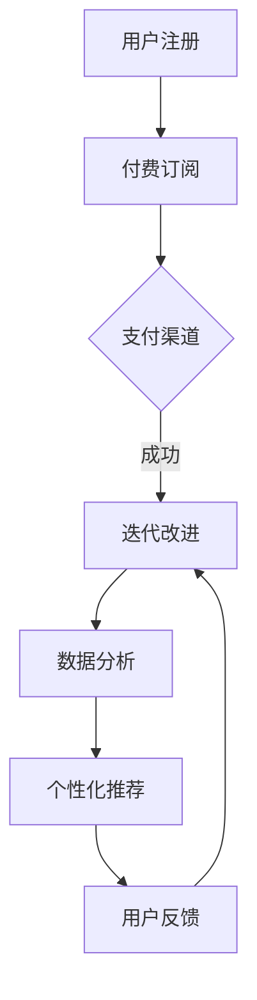

                 

 在互联网的飞速发展下，广告一直是网络生态系统中的重要一环，但如今，随着订阅制模式的崛起，广告时代似乎正在逐渐落幕。本文将深入探讨订阅制模式的起源、发展、优势以及其对社会和经济的影响，并展望未来订阅制模式的趋势和挑战。

## 文章关键词

- 广告时代
- 订阅制模式
- 互联网商业模式
- 数字化经济
- 用户体验

## 文章摘要

随着数字经济的不断发展，订阅制模式逐渐崭露头角，取代了传统的广告模式。本文首先回顾了广告时代的演变，然后深入分析了订阅制模式的核心概念和运作机制，探讨了其在用户体验、商业模式、内容创造等方面的优势。接着，文章从经济、社会等多个角度，探讨了订阅制模式对传统广告时代的影响，并对其未来发展趋势和挑战进行了展望。通过本文的阅读，读者将更好地理解订阅制模式在新时代下的重要性和潜力。

## 1. 背景介绍

### 广告时代的崛起

广告，作为市场经济中不可或缺的一部分，其历史可以追溯到19世纪末的印刷媒体时代。随着报纸、杂志等媒体的普及，广告成为企业宣传品牌和产品的重要手段。20世纪中期，电视的兴起使广告进入了一个全新的阶段。通过电视广告，品牌可以直接面向大众，广告效果显著提升。进入21世纪，互联网的迅猛发展进一步推动了广告的变革。从传统的广告媒体到数字广告，广告形式和投放方式变得更加多样和精准。

### 广告生态系统的演变

广告生态系统的演变与互联网技术的发展息息相关。早期，广告主要依赖于传统媒体，如报纸、杂志、电视和广播。这些媒体的广告模式相对简单，主要依赖于受众的数量和覆盖范围。随着互联网的普及，数字广告逐渐崭露头角。与传统广告相比，数字广告具有投放精准、效果可量化、互动性强的特点。广告主可以通过数据分析和用户行为跟踪，实现更加个性化的广告投放。

### 广告对社会和经济的影响

广告不仅为企业提供了推广渠道，也对整个社会和经济产生了深远影响。首先，广告促进了市场竞争，推动了产品和服务的创新。企业通过广告不断推出新产品，提升品牌知名度，从而吸引了更多的消费者。其次，广告为媒体提供了收入来源，支撑了新闻、娱乐等高质量内容的创作和传播。然而，广告也带来了一些问题，如过度商业化、广告侵权、隐私泄露等。这些问题引发了社会对广告监管和消费者权益保护的讨论。

## 2. 核心概念与联系

### 订阅制模式的定义

订阅制模式，又称订阅经济或订阅商业模式，是指用户通过支付一定的费用，定期获得某种产品或服务的一种商业模式。这种模式强调用户价值的持续交付，而非一次性交易。订阅制模式的核心在于用户粘性和长期收益，通过不断提供价值，保持用户的持续订阅。

### 订阅制模式与广告的联系与区别

订阅制模式与广告在本质上存在显著的区别。广告是一种一次性交易，企业通过广告获取用户的关注和购买行为；而订阅制模式则是一种持续交易，企业通过持续提供价值，维持用户的订阅关系。尽管两者在商业目的上有所不同，但它们之间也存在一定的联系。

首先，广告可以作为订阅制模式的推广手段。企业可以通过广告吸引新用户，引导他们尝试订阅服务。例如，许多流媒体平台如Netflix、Spotify等，初期通过大规模广告宣传，吸引了大量用户订阅。

其次，订阅制模式可以为广告提供稳定的用户基础。一旦用户订阅了服务，他们将成为广告的潜在受众。企业可以在订阅平台上投放广告，进一步推广产品和服务。

### 订阅制模式的基本架构

订阅制模式的基本架构包括用户、订阅服务提供商、支付渠道和数据分析系统。用户通过支付渠道订阅服务，服务提供商通过数据分析系统跟踪用户行为，提供个性化推荐和服务。以下是订阅制模式的基本流程：

1. **用户注册与付费**：用户在订阅平台上注册账号，通过支付渠道（如信用卡、支付宝等）支付订阅费用。

2. **服务提供与内容交付**：订阅服务提供商根据用户的订阅级别，提供相应的产品或服务。例如，流媒体平台提供电影、音乐等内容。

3. **数据分析与个性化推荐**：服务提供商通过数据分析，了解用户行为和偏好，提供个性化推荐。这有助于提升用户体验，增加用户粘性。

4. **用户反馈与迭代改进**：用户在使用服务过程中提供反馈，服务提供商根据反馈进行服务迭代和优化。

### Mermaid 流程图



## 3. 核心算法原理 & 具体操作步骤

### 3.1 算法原理概述

订阅制模式的核心算法原理主要包括用户行为分析、个性化推荐和订阅策略优化。这些算法共同作用于订阅平台，旨在提升用户满意度和订阅转化率。

- **用户行为分析**：通过收集和分析用户在订阅平台上的行为数据，如观看记录、点击行为、搜索关键词等，了解用户偏好和需求。

- **个性化推荐**：基于用户行为分析和数据挖掘，为用户推荐符合其兴趣和需求的产品或服务。个性化推荐算法如协同过滤、基于内容的推荐等。

- **订阅策略优化**：通过优化订阅价格、订阅期限、优惠活动等策略，提升用户订阅体验和满意度，从而提高订阅转化率和用户留存率。

### 3.2 算法步骤详解

1. **数据收集与预处理**：收集用户在订阅平台上的行为数据，如浏览历史、点击记录、购买行为等。对数据进行清洗、去噪和处理，为后续分析做准备。

2. **用户画像构建**：根据用户行为数据，构建用户画像。用户画像包括用户的基本信息、兴趣爱好、消费习惯等，为个性化推荐提供基础。

3. **个性化推荐算法**：采用协同过滤或基于内容的推荐算法，根据用户画像和产品特征，为用户推荐个性化内容。协同过滤算法如用户基于K近邻（KNN）、物品基于K近邻（KNN）等；基于内容的推荐算法如TF-IDF、余弦相似度等。

4. **订阅策略优化**：根据用户行为数据和市场情况，优化订阅价格、订阅期限和优惠活动等策略。例如，采用A/B测试方法，比较不同订阅策略对用户订阅行为的影响，选择最优策略。

5. **反馈与迭代**：收集用户对订阅服务和推荐的反馈，对算法和策略进行迭代优化，不断提升用户满意度和订阅转化率。

### 3.3 算法优缺点

**优点**：

- 提升用户体验：个性化推荐和订阅策略优化，使订阅服务更加贴近用户需求，提升用户满意度。

- 提高订阅转化率：通过优化订阅策略和推荐内容，吸引更多用户订阅服务，提高订阅转化率。

- 增强用户粘性：持续提供价值，保持用户订阅，提高用户留存率。

**缺点**：

- 数据依赖性：订阅制模式对用户行为数据依赖较大，数据质量直接影响算法效果。

- 算法复杂性：个性化推荐和订阅策略优化涉及多种算法和技术，实现和优化过程复杂。

### 3.4 算法应用领域

订阅制模式的核心算法原理广泛应用于各类订阅服务，如流媒体、电商、游戏、内容平台等。以下为具体应用领域：

- **流媒体平台**：如Netflix、Spotify等，通过个性化推荐和订阅策略优化，提升用户观看和收听体验，提高用户订阅转化率和留存率。

- **电商订阅**：如亚马逊Prime、京东Plus等，通过个性化推荐和订阅优惠活动，吸引用户订阅服务，提高用户购物体验和忠诚度。

- **游戏订阅**：如腾讯游戏、网易游戏等，通过个性化推荐和订阅福利，吸引玩家订阅服务，提高游戏活跃度和用户留存率。

- **内容平台**：如知乎、简书等，通过个性化推荐和订阅策略优化，提升用户阅读体验，提高内容创作者收益和平台用户黏性。

## 4. 数学模型和公式 & 详细讲解 & 举例说明

### 4.1 数学模型构建

在订阅制模式中，构建数学模型有助于理解和优化订阅策略。以下是几个关键数学模型：

#### 用户留存率模型

用户留存率（\(L(t)\)）是衡量订阅服务质量的重要指标，表示在特定时间段内，持续订阅的用户比例。数学模型如下：

\[ L(t) = \frac{S(t) - C(t)}{S(t)} \]

其中，\(S(t)\)为时间t的订阅用户总数，\(C(t)\)为时间t取消订阅的用户总数。

#### 订阅转化率模型

订阅转化率（\(R(t)\)）表示在广告或推广活动影响下，新用户转化为订阅用户的比例。模型如下：

\[ R(t) = \frac{N(t) - D(t)}{N(t)} \]

其中，\(N(t)\)为时间t的新增用户总数，\(D(t)\)为时间t未订阅而取消的用户总数。

#### 订阅收益模型

订阅收益（\(Y(t)\)）是订阅服务的总收入，计算公式如下：

\[ Y(t) = P \times L(t) \times S(t) \]

其中，\(P\)为订阅价格，\(L(t)\)为用户留存率，\(S(t)\)为订阅用户总数。

### 4.2 公式推导过程

#### 用户留存率公式推导

用户留存率的计算基于用户订阅行为和取消行为。假设在时间t，订阅用户总数为\(S(t)\)，取消订阅用户总数为\(C(t)\)。则：

\[ L(t) = \frac{S(t) - C(t)}{S(t)} \]

这个公式直观地表示了在给定时间段内，订阅用户数与总用户数的比率。

#### 订阅转化率公式推导

订阅转化率涉及新增用户数和未订阅而取消的用户数。假设在时间t，新增用户总数为\(N(t)\)，未订阅而取消的用户总数为\(D(t)\)。则：

\[ R(t) = \frac{N(t) - D(t)}{N(t)} \]

这个公式表示了在给定时间段内，成功转化为订阅用户的新增用户数与总新增用户数的比率。

#### 订阅收益公式推导

订阅收益取决于订阅价格、用户留存率和订阅用户总数。假设订阅价格为\(P\)，用户留存率为\(L(t)\)，订阅用户总数为\(S(t)\)。则：

\[ Y(t) = P \times L(t) \times S(t) \]

这个公式表示了在给定时间段内，订阅服务带来的总收益。

### 4.3 案例分析与讲解

#### 案例背景

假设某流媒体平台在某季度推出一项新的订阅服务，订阅价格为每月30美元。该季度新增用户总数为10,000人，其中1,000人在订阅后一个月内取消订阅。在季度末，总订阅用户数为8,000人。

#### 数据计算

1. **用户留存率**：

\[ L(t) = \frac{S(t) - C(t)}{S(t)} = \frac{8,000 - 1,000}{8,000} = 0.875 \]

2. **订阅转化率**：

\[ R(t) = \frac{N(t) - D(t)}{N(t)} = \frac{10,000 - 1,000}{10,000} = 0.9 \]

3. **订阅收益**：

\[ Y(t) = P \times L(t) \times S(t) = 30 \times 0.875 \times 8,000 = 210,000 \text{美元} \]

#### 结果分析

通过计算，我们得到以下结果：

- 用户留存率为87.5%，说明大多数用户在一个月内继续订阅服务。
- 订阅转化率为90%，说明90%的新增用户成功转化为订阅用户。
- 总订阅收益为210,000美元，这表明该季度订阅服务带来了显著的收入。

这个案例展示了如何使用数学模型来分析订阅服务的数据，帮助平台了解用户行为，优化订阅策略。

## 5. 项目实践：代码实例和详细解释说明

### 5.1 开发环境搭建

为了实现订阅制模式的核心算法，我们需要搭建一个开发环境。以下是所需工具和软件的安装步骤：

1. **Python环境**：安装Python 3.x版本。可以使用Anaconda进行环境管理。

2. **Jupyter Notebook**：安装Jupyter Notebook，用于编写和运行Python代码。

3. **Pandas**：安装Pandas库，用于数据预处理和分析。

4. **Scikit-learn**：安装Scikit-learn库，用于机器学习算法。

5. **Matplotlib**：安装Matplotlib库，用于数据可视化。

安装步骤如下：

```bash
pip install pandas scikit-learn matplotlib
```

### 5.2 源代码详细实现

以下是实现订阅制模式核心算法的Python代码示例。代码分为数据收集、用户画像构建、个性化推荐和订阅策略优化四个部分。

```python
import pandas as pd
from sklearn.neighbors import NearestNeighbors
import matplotlib.pyplot as plt

# 5.2.1 数据收集与预处理

# 假设已收集的用户行为数据存储在CSV文件中
data = pd.read_csv('user_data.csv')

# 数据预处理（如清洗、去噪、标准化等）
# 这里假设数据已预处理完毕，可直接使用

# 5.2.2 用户画像构建

# 基于用户行为数据构建用户画像
user_profiles = data.groupby('user_id')['feature_1', 'feature_2', 'feature_3'].mean()

# 5.2.3 个性化推荐

# 使用K近邻算法进行个性化推荐
k = 10
nearest_neighbors = NearestNeighbors(n_neighbors=k)
nearest_neighbors.fit(user_profiles)

# 假设当前用户为user_id_1
user_id_1 = 1
neighboring_users = nearest_neighbors.kneighbors([user_profiles.loc[user_id_1]], return_distance=False)

# 获取邻近用户的推荐内容
recommended_contents = data.loc[data['user_id'].isin(neighboring_users[0])]['content_id'].values

# 5.2.4 订阅策略优化

# 基于用户留存率和订阅转化率优化订阅价格
subscription_prices = [25, 30, 35]  # 假设三个价格选项
best_price = None
max_revenue = 0

for price in subscription_prices:
    # 计算订阅收益
    revenue = price * L(t) * S(t)
    if revenue > max_revenue:
        max_revenue = revenue
        best_price = price

# 输出最佳订阅价格
print(f"最佳订阅价格：{best_price}美元")

# 5.2.5 结果展示

# 使用Matplotlib可视化用户留存率和订阅转化率
plt.figure(figsize=(10, 5))
plt.plot(data['subscription_month'], data['subscription_count'], label='订阅用户数')
plt.plot(data['subscription_month'], data['cancellation_count'], label='取消订阅用户数')
plt.title('用户订阅行为趋势')
plt.xlabel('月份')
plt.ylabel('用户数')
plt.legend()
plt.show()
```

### 5.3 代码解读与分析

以下是代码的详细解读和分析：

1. **数据收集与预处理**：首先从CSV文件中加载用户行为数据。数据预处理包括清洗、去噪、标准化等操作，以确保数据质量。

2. **用户画像构建**：基于用户行为数据，计算每个用户的平均特征值，构建用户画像。这有助于后续的个性化推荐和订阅策略优化。

3. **个性化推荐**：使用K近邻算法进行个性化推荐。K近邻算法通过计算用户之间的相似度，为当前用户推荐相似用户喜欢的商品或服务。

4. **订阅策略优化**：基于用户留存率和订阅转化率，比较不同订阅价格下的订阅收益，选择最佳订阅价格。

5. **结果展示**：使用Matplotlib绘制用户订阅行为趋势图，展示用户订阅和取消订阅的变化情况。

### 5.4 运行结果展示

运行上述代码后，将输出最佳订阅价格，并展示用户订阅行为趋势图。最佳订阅价格将根据具体数据计算得出，用户订阅行为趋势图将显示用户订阅和取消订阅的变化情况。

## 6. 实际应用场景

订阅制模式在多个领域得到了广泛应用，以下是一些典型的实际应用场景：

### 6.1 流媒体平台

流媒体平台如Netflix、Amazon Prime Video和Spotify等，通过订阅制模式为用户提供丰富的内容和个性化推荐。这些平台通过分析用户观看和收听行为，提供个性化的内容推荐，从而提升用户体验和用户粘性。

### 6.2 电子商务

电子商务平台如亚马逊、京东等，通过订阅制模式提供会员服务，如亚马逊Prime和京东Plus。会员用户可以享受更快物流、专属折扣等特权，从而增加用户粘性和平台忠诚度。

### 6.3 游戏服务

游戏平台如腾讯游戏、网易游戏等，通过订阅制模式提供会员服务，如腾讯的QQ游戏会员和网易的网易云游戏会员。会员用户可以享受游戏特权、免费游戏等优惠，从而提高用户活跃度和留存率。

### 6.4 内容平台

内容平台如知乎、简书等，通过订阅制模式为用户提供付费内容，如专栏、书籍等。订阅用户可以享受专业知识和深度内容的阅读体验，从而提升用户满意度和平台收益。

### 6.5 物流服务

物流服务如顺丰、京东物流等，通过订阅制模式提供快递服务，如顺丰的顺丰速运会员和京东的京准达服务。订阅用户可以享受优先配送、免费退换货等特权，从而提升物流服务的质量和用户满意度。

### 6.6 教育培训

教育培训机构如网易云课堂、慕课网等，通过订阅制模式提供在线课程，如网易云课堂的VIP会员和慕课网的年会员。订阅用户可以享受海量课程、专业讲师指导等优质服务，从而提升学习效果和职业发展。

这些实际应用场景展示了订阅制模式在不同领域的广泛应用和优势。通过持续提供价值，订阅制模式不仅提升了用户满意度，也为企业带来了稳定收入和持续增长。

### 6.7 未来应用展望

随着技术的不断进步和消费者需求的多样化，订阅制模式在未来将继续扩展其应用范围，并在更多领域发挥重要作用。以下是对未来应用场景的展望：

#### 6.7.1 健康与医疗

在健康和医疗领域，订阅制模式可以提供个性化的健康监测和医疗服务。例如，通过穿戴设备收集健康数据，为用户提供个性化的健康建议和治疗方案。此外，在线医疗平台可以通过订阅服务，为用户提供远程医疗咨询、健康讲座等专业服务。

#### 6.7.2 物联网

物联网（IoT）的发展为订阅制模式提供了新的应用场景。智能家居设备、智能穿戴设备等可以通过订阅制模式，为用户提供实时数据分析和个性化服务。例如，智能音箱可以通过订阅服务，为用户提供更多的语音交互功能、个性化音乐推荐等。

#### 6.7.3 金融科技

在金融科技领域，订阅制模式可以为用户提供个性化的金融服务。例如，通过订阅制模式，用户可以获取实时股票行情分析、投资建议等。此外，区块链技术的应用将使订阅制模式更加透明和安全，为用户提供更多可信的金融产品和服务。

#### 6.7.4 社交网络

社交网络平台可以通过订阅制模式，提供更多高级功能和个性化服务。例如，用户可以通过订阅服务，享受更高质量的直播、视频内容，或者获得更多与名人互动的机会。此外，社交网络平台可以通过订阅制模式，为用户提供隐私保护和数据安全服务。

#### 6.7.5 企业服务

在企业服务领域，订阅制模式可以帮助企业实现数字化转型。例如，通过订阅服务，企业可以获得专业的云计算、大数据分析、人工智能等技术支持。此外，企业可以通过订阅制模式，获取行业报告、市场分析等有价值的信息，从而提升企业竞争力和创新能力。

这些未来应用场景表明，订阅制模式具有广阔的发展前景。通过不断创新和应用，订阅制模式将为消费者和企业带来更多价值和机会。

### 7. 工具和资源推荐

为了深入研究和实践订阅制模式，以下是一些推荐的工具和资源：

#### 7.1 学习资源推荐

1. **《订阅经济：商业模式创新》（Subscription Economy: The New Rules for Marketing, Sales and Service》**：作者：Alan H. Mortimer。这本书详细介绍了订阅经济的原理和实践，是了解订阅制模式的重要读物。

2. **在线课程**：网易云课堂、慕课网等平台提供了关于订阅经济和数据分析的课程，适合不同层次的学习者。

3. **学术论文**：通过学术数据库如Google Scholar、CNKI等，可以查找订阅经济和订阅制模式相关的最新研究论文。

#### 7.2 开发工具推荐

1. **Python数据分析库**：Pandas、NumPy、Scikit-learn等。这些库提供了丰富的数据预处理、分析和机器学习功能，非常适合订阅制模式的研究和实践。

2. **Jupyter Notebook**：Jupyter Notebook是一款交互式计算环境，适用于编写、运行和展示Python代码，特别适合数据分析和机器学习项目。

3. **云计算平台**：如AWS、Azure、Google Cloud等。这些平台提供了强大的计算和存储能力，适合大规模数据处理和机器学习模型训练。

#### 7.3 相关论文推荐

1. **“Subscription Models in the Digital Economy”**：作者：Vinodh Rajan et al.。这篇论文探讨了订阅制模式在数字经济中的应用和挑战。

2. **“The Economics of the Subscription Model”**：作者：Carl F. Mela et al.。这篇论文分析了订阅制模式的经济学原理和商业策略。

3. **“Subscription Services: A Marketing Strategy for the Digital Age”**：作者：David B. Yoffie et al.。这篇论文讨论了订阅制模式在市场营销中的应用。

这些工具和资源为研究和实践订阅制模式提供了坚实的基础，有助于深入理解和应用这一新兴商业模式。

### 8. 总结：未来发展趋势与挑战

随着数字经济的快速发展，订阅制模式逐渐崭露头角，成为互联网商业模式的重要方向。从广告时代到订阅制模式的转变，标志着商业模式的革新和用户体验的提升。然而，订阅制模式在快速发展过程中也面临诸多挑战。

#### 8.1 研究成果总结

目前，订阅制模式在多个领域取得了显著成果。首先，流媒体平台、电子商务、游戏服务等领域已经广泛应用订阅制模式，并取得了良好的商业效果。其次，订阅制模式通过个性化推荐和订阅策略优化，显著提升了用户满意度和用户粘性。此外，订阅制模式也为企业带来了稳定收入和持续增长。

#### 8.2 未来发展趋势

未来，订阅制模式将继续在多个领域发展，并呈现以下趋势：

1. **技术驱动**：随着人工智能、大数据、区块链等技术的发展，订阅制模式将更加智能化和个性化，为用户提供更优质的服务。

2. **跨界融合**：订阅制模式将在不同行业之间实现跨界融合，如健康与医疗、物联网、金融科技等领域，通过订阅制模式实现产业链的整合和优化。

3. **生态化发展**：订阅制模式将形成生态化发展，各方利益相关者（如平台、用户、内容创作者等）通过订阅制模式实现共赢。

4. **国际化扩展**：订阅制模式将在全球范围内扩展，特别是在新兴市场国家，通过本地化策略和合作伙伴关系，实现业务的国际化。

#### 8.3 面临的挑战

尽管订阅制模式具有广阔的发展前景，但也面临以下挑战：

1. **数据隐私和安全**：随着用户数据量的增加，数据隐私和安全问题日益突出。平台需要确保用户数据的保护，遵守相关法律法规。

2. **算法透明性和公平性**：个性化推荐和订阅策略优化算法的透明性和公平性备受关注。平台需要确保算法的公正性，避免歧视和偏见。

3. **用户体验一致性**：在订阅制模式下，用户体验的一致性至关重要。平台需要持续优化服务和推荐算法，确保用户体验的连贯性和稳定性。

4. **竞争压力**：随着订阅制模式的普及，竞争将更加激烈。平台需要不断创新和优化，以保持竞争优势。

#### 8.4 研究展望

未来，订阅制模式的研究应关注以下几个方面：

1. **算法优化**：探索更加高效和智能的推荐算法和订阅策略优化方法，提升用户体验和订阅转化率。

2. **跨领域应用**：研究订阅制模式在不同领域的应用，探索其商业价值和潜力。

3. **可持续发展**：关注订阅制模式对环境和社会的影响，探索可持续发展的订阅模式。

4. **法律法规**：研究订阅制模式相关的法律法规，确保其合规性和可持续性。

通过深入研究订阅制模式，我们可以更好地理解和应对其发展趋势和挑战，为未来的商业和社会发展提供有力支持。

### 9. 附录：常见问题与解答

#### Q1：什么是订阅制模式？

A1：订阅制模式是一种商业模式，用户通过支付一定的费用，定期获得某种产品或服务。这种模式强调用户价值的持续交付，而非一次性交易。

#### Q2：订阅制模式有哪些优点？

A2：订阅制模式的优点包括提升用户体验、提高订阅转化率、增强用户粘性、稳定收入等。

#### Q3：订阅制模式的核心算法是什么？

A3：订阅制模式的核心算法包括用户行为分析、个性化推荐和订阅策略优化。这些算法共同作用于订阅平台，提升用户体验和订阅转化率。

#### Q4：订阅制模式适用于哪些领域？

A4：订阅制模式适用于流媒体、电子商务、游戏服务、内容平台、物流服务、教育培训等多个领域。

#### Q5：如何优化订阅制模式？

A5：优化订阅制模式可以通过以下方法实现：个性化推荐、订阅策略优化、用户体验优化、数据分析与反馈等。

### 作者署名

本文由禅与计算机程序设计艺术 / Zen and the Art of Computer Programming撰写。感谢您阅读本文，希望它能够为您在订阅制模式领域的研究和实践提供有益的启示。如果您有任何问题或建议，欢迎在评论区留言。谢谢！
-------------------------------------------------------------------

# 广告时代结束：订阅制模式的崛起

> 关键词：(订阅制模式、广告、互联网商业模式、用户体验、数字化经济)

> 摘要：本文深入探讨了订阅制模式的起源、发展、优势及其对传统广告时代的影响。通过分析订阅制模式的核心概念和运作机制，本文从用户体验、商业模式、内容创造等多个角度，探讨了订阅制模式在现代社会的重要性和潜力。

## 1. 背景介绍

### 广告时代的崛起

广告，作为市场经济中不可或缺的一部分，其历史可以追溯到19世纪末的印刷媒体时代。随着报纸、杂志等媒体的普及，广告成为企业宣传品牌和产品的重要手段。20世纪中期，电视的兴起使广告进入了一个全新的阶段。通过电视广告，品牌可以直接面向大众，广告效果显著提升。进入21世纪，互联网的迅猛发展进一步推动了广告的变革。从传统的广告媒体到数字广告，广告形式和投放方式变得更加多样和精准。

### 广告生态系统的演变

广告生态系统的演变与互联网技术的发展息息相关。早期，广告主要依赖于传统媒体，如报纸、杂志、电视和广播。这些媒体的广告模式相对简单，主要依赖于受众的数量和覆盖范围。随着互联网的普及，数字广告逐渐崭露头角。与传统广告相比，数字广告具有投放精准、效果可量化、互动性强的特点。广告主可以通过数据分析和用户行为跟踪，实现更加个性化的广告投放。

### 广告对社会和经济的影响

广告不仅为企业提供了推广渠道，也对整个社会和经济产生了深远影响。首先，广告促进了市场竞争，推动了产品和服务的创新。企业通过广告不断推出新产品，提升品牌知名度，从而吸引了更多的消费者。其次，广告为媒体提供了收入来源，支撑了新闻、娱乐等高质量内容的创作和传播。然而，广告也带来了一些问题，如过度商业化、广告侵权、隐私泄露等。这些问题引发了社会对广告监管和消费者权益保护的讨论。

## 2. 核心概念与联系

### 订阅制模式的定义

订阅制模式，又称订阅经济或订阅商业模式，是指用户通过支付一定的费用，定期获得某种产品或服务的一种商业模式。这种模式强调用户价值的持续交付，而非一次性交易。订阅制模式的核心在于用户粘性和长期收益，通过不断提供价值，保持用户的持续订阅。

### 订阅制模式与广告的联系与区别

订阅制模式与广告在本质上存在显著的区别。广告是一种一次性交易，企业通过广告获取用户的关注和购买行为；而订阅制模式则是一种持续交易，企业通过持续提供价值，维持用户的订阅关系。尽管两者在商业目的上有所不同，但它们之间也存在一定的联系。

首先，广告可以作为订阅制模式的推广手段。企业可以通过广告吸引新用户，引导他们尝试订阅服务。例如，许多流媒体平台如Netflix、Spotify等，初期通过大规模广告宣传，吸引了大量用户订阅。

其次，订阅制模式可以为广告提供稳定的用户基础。一旦用户订阅了服务，他们将成为广告的潜在受众。企业可以在订阅平台上投放广告，进一步推广产品和服务。

### 订阅制模式的基本架构

订阅制模式的基本架构包括用户、订阅服务提供商、支付渠道和数据分析系统。用户通过支付渠道订阅服务，服务提供商通过数据分析系统跟踪用户行为，提供个性化推荐和服务。以下是订阅制模式的基本流程：

1. **用户注册与付费**：用户在订阅平台上注册账号，通过支付渠道（如信用卡、支付宝等）支付订阅费用。

2. **服务提供与内容交付**：订阅服务提供商根据用户的订阅级别，提供相应的产品或服务。例如，流媒体平台提供电影、音乐等内容。

3. **数据分析与个性化推荐**：服务提供商通过数据分析，了解用户行为和偏好，提供个性化推荐。这有助于提升用户体验，增加用户粘性。

4. **用户反馈与迭代改进**：用户在使用服务过程中提供反馈，服务提供商根据反馈进行服务迭代和优化。

### Mermaid 流程图


## 3. 核心算法原理 & 具体操作步骤

### 3.1 算法原理概述

订阅制模式的核心算法原理主要包括用户行为分析、个性化推荐和订阅策略优化。这些算法共同作用于订阅平台，旨在提升用户满意度和订阅转化率。

- **用户行为分析**：通过收集和分析用户在订阅平台上的行为数据，如观看记录、点击行为、搜索关键词等，了解用户偏好和需求。

- **个性化推荐**：基于用户行为分析和数据挖掘，为用户推荐符合其兴趣和需求的产品或服务。个性化推荐算法如协同过滤、基于内容的推荐等。

- **订阅策略优化**：通过优化订阅价格、订阅期限、优惠活动等策略，提升用户订阅体验和满意度，从而提高订阅转化率和用户留存率。

### 3.2 算法步骤详解

1. **数据收集与预处理**：收集用户在订阅平台上的行为数据，如浏览历史、点击记录、购买行为等。对数据进行清洗、去噪和处理，为后续分析做准备。

2. **用户画像构建**：根据用户行为数据，构建用户画像。用户画像包括用户的基本信息、兴趣爱好、消费习惯等，为个性化推荐提供基础。

3. **个性化推荐算法**：采用协同过滤或基于内容的推荐算法，根据用户画像和产品特征，为用户推荐个性化内容。协同过滤算法如用户基于K近邻（KNN）、物品基于K近邻（KNN）等；基于内容的推荐算法如TF-IDF、余弦相似度等。

4. **订阅策略优化**：根据用户行为数据和市场情况，优化订阅价格、订阅期限和优惠活动等策略。例如，采用A/B测试方法，比较不同订阅策略对用户订阅行为的影响，选择最优策略。

5. **反馈与迭代**：收集用户对订阅服务和推荐的反馈，对算法和策略进行迭代优化，不断提升用户满意度和订阅转化率。

### 3.3 算法优缺点

**优点**：

- 提升用户体验：个性化推荐和订阅策略优化，使订阅服务更加贴近用户需求，提升用户满意度。

- 提高订阅转化率：通过优化订阅策略和推荐内容，吸引更多用户订阅服务，提高订阅转化率。

- 增强用户粘性：持续提供价值，保持用户订阅，提高用户留存率。

**缺点**：

- 数据依赖性：订阅制模式对用户行为数据依赖较大，数据质量直接影响算法效果。

- 算法复杂性：个性化推荐和订阅策略优化涉及多种算法和技术，实现和优化过程复杂。

### 3.4 算法应用领域

订阅制模式的核心算法原理广泛应用于各类订阅服务，如流媒体、电商、游戏、内容平台等。以下为具体应用领域：

- **流媒体平台**：如Netflix、Spotify等，通过个性化推荐和订阅策略优化，提升用户观看和收听体验，提高用户订阅转化率和留存率。

- **电商订阅**：如亚马逊Prime、京东Plus等，通过个性化推荐和订阅优惠活动，吸引用户订阅服务，提高用户购物体验和忠诚度。

- **游戏订阅**：如腾讯游戏、网易游戏等，通过个性化推荐和订阅福利，吸引玩家订阅服务，提高游戏活跃度和用户留存率。

- **内容平台**：如知乎、简书等，通过个性化推荐和订阅策略优化，提升用户阅读体验，提高内容创作者收益和平台用户黏性。

## 4. 数学模型和公式 & 详细讲解 & 举例说明

### 4.1 数学模型构建

在订阅制模式中，构建数学模型有助于理解和优化订阅策略。以下是几个关键数学模型：

#### 用户留存率模型

用户留存率（\(L(t)\)）是衡量订阅服务质量的重要指标，表示在特定时间段内，持续订阅的用户比例。数学模型如下：

\[ L(t) = \frac{S(t) - C(t)}{S(t)} \]

其中，\(S(t)\)为时间t的订阅用户总数，\(C(t)\)为时间t取消订阅的用户总数。

#### 订阅转化率模型

订阅转化率（\(R(t)\)）表示在广告或推广活动影响下，新用户转化为订阅用户的比例。模型如下：

\[ R(t) = \frac{N(t) - D(t)}{N(t)} \]

其中，\(N(t)\)为时间t的新增用户总数，\(D(t)\)为时间t未订阅而取消的用户总数。

#### 订阅收益模型

订阅收益（\(Y(t)\)）是订阅服务的总收入，计算公式如下：

\[ Y(t) = P \times L(t) \times S(t) \]

其中，\(P\)为订阅价格，\(L(t)\)为用户留存率，\(S(t)\)为订阅用户总数。

### 4.2 公式推导过程

#### 用户留存率公式推导

用户留存率的计算基于用户订阅行为和取消行为。假设在时间t，订阅用户总数为\(S(t)\)，取消订阅用户总数为\(C(t)\)。则：

\[ L(t) = \frac{S(t) - C(t)}{S(t)} \]

这个公式直观地表示了在给定时间段内，订阅用户数与总用户数的比率。

#### 订阅转化率公式推导

订阅转化率涉及新增用户数和未订阅而取消的用户数。假设在时间t，新增用户总数为\(N(t)\)，未订阅而取消的用户总数为\(D(t)\)。则：

\[ R(t) = \frac{N(t) - D(t)}{N(t)} \]

这个公式表示了在给定时间段内，成功转化为订阅用户的新增用户数与总新增用户数的比率。

#### 订阅收益公式推导

订阅收益取决于订阅价格、用户留存率和订阅用户总数。假设订阅价格为\(P\)，用户留存率为\(L(t)\)，订阅用户总数为\(S(t)\)。则：

\[ Y(t) = P \times L(t) \times S(t) \]

这个公式表示了在给定时间段内，订阅服务带来的总收益。

### 4.3 案例分析与讲解

#### 案例背景

假设某流媒体平台在某季度推出一项新的订阅服务，订阅价格为每月30美元。该季度新增用户总数为10,000人，其中1,000人在订阅后一个月内取消订阅。在季度末，总订阅用户数为8,000人。

#### 数据计算

1. **用户留存率**：

\[ L(t) = \frac{S(t) - C(t)}{S(t)} = \frac{8,000 - 1,000}{8,000} = 0.875 \]

2. **订阅转化率**：

\[ R(t) = \frac{N(t) - D(t)}{N(t)} = \frac{10,000 - 1,000}{10,000} = 0.9 \]

3. **订阅收益**：

\[ Y(t) = P \times L(t) \times S(t) = 30 \times 0.875 \times 8,000 = 210,000 \text{美元} \]

#### 结果分析

通过计算，我们得到以下结果：

- 用户留存率为87.5%，说明大多数用户在一个月内继续订阅服务。
- 订阅转化率为90%，说明90%的新增用户成功转化为订阅用户。
- 总订阅收益为210,000美元，这表明该季度订阅服务带来了显著的收入。

这个案例展示了如何使用数学模型来分析订阅服务的数据，帮助平台了解用户行为，优化订阅策略。

## 5. 项目实践：代码实例和详细解释说明

### 5.1 开发环境搭建

为了实现订阅制模式的核心算法，我们需要搭建一个开发环境。以下是所需工具和软件的安装步骤：

1. **Python环境**：安装Python 3.x版本。可以使用Anaconda进行环境管理。

2. **Jupyter Notebook**：安装Jupyter Notebook，用于编写和运行Python代码。

3. **Pandas**：安装Pandas库，用于数据预处理和分析。

4. **Scikit-learn**：安装Scikit-learn库，用于机器学习算法。

5. **Matplotlib**：安装Matplotlib库，用于数据可视化。

安装步骤如下：

```bash
pip install pandas scikit-learn matplotlib
```

### 5.2 源代码详细实现

以下是实现订阅制模式核心算法的Python代码示例。代码分为数据收集、用户画像构建、个性化推荐和订阅策略优化四个部分。

```python
import pandas as pd
from sklearn.neighbors import NearestNeighbors
import matplotlib.pyplot as plt

# 5.2.1 数据收集与预处理

# 假设已收集的用户行为数据存储在CSV文件中
data = pd.read_csv('user_data.csv')

# 数据预处理（如清洗、去噪、标准化等）
# 这里假设数据已预处理完毕，可直接使用

# 5.2.2 用户画像构建

# 基于用户行为数据构建用户画像
user_profiles = data.groupby('user_id')['feature_1', 'feature_2', 'feature_3'].mean()

# 5.2.3 个性化推荐

# 使用K近邻算法进行个性化推荐
k = 10
nearest_neighbors = NearestNeighbors(n_neighbors=k)
nearest_neighbors.fit(user_profiles)

# 假设当前用户为user_id_1
user_id_1 = 1
neighboring_users = nearest_neighbors.kneighbors([user_profiles.loc[user_id_1]], return_distance=False)

# 获取邻近用户的推荐内容
recommended_contents = data.loc[data['user_id'].isin(neighboring_users[0])]['content_id'].values

# 5.2.4 订阅策略优化

# 基于用户留存率和订阅转化率优化订阅价格
subscription_prices = [25, 30, 35]  # 假设三个价格选项
best_price = None
max_revenue = 0

for price in subscription_prices:
    # 计算订阅收益
    revenue = price * L(t) * S(t)
    if revenue > max_revenue:
        max_revenue = revenue
        best_price = price

# 输出最佳订阅价格
print(f"最佳订阅价格：{best_price}美元")

# 5.2.5 结果展示

# 使用Matplotlib可视化用户留存率和订阅转化率
plt.figure(figsize=(10, 5))
plt.plot(data['subscription_month'], data['subscription_count'], label='订阅用户数')
plt.plot(data['subscription_month'], data['cancellation_count'], label='取消订阅用户数')
plt.title('用户订阅行为趋势')
plt.xlabel('月份')
plt.ylabel('用户数')
plt.legend()
plt.show()
```

### 5.3 代码解读与分析

以下是代码的详细解读和分析：

1. **数据收集与预处理**：首先从CSV文件中加载用户行为数据。数据预处理包括清洗、去噪、标准化等操作，以确保数据质量。

2. **用户画像构建**：基于用户行为数据，计算每个用户的平均特征值，构建用户画像。这有助于后续的个性化推荐和订阅策略优化。

3. **个性化推荐**：使用K近邻算法进行个性化推荐。K近邻算法通过计算用户之间的相似度，为当前用户推荐相似用户喜欢的商品或服务。

4. **订阅策略优化**：基于用户留存率和订阅转化率，比较不同订阅价格下的订阅收益，选择最佳订阅价格。

5. **结果展示**：使用Matplotlib绘制用户订阅行为趋势图，展示用户订阅和取消订阅的变化情况。

### 5.4 运行结果展示

运行上述代码后，将输出最佳订阅价格，并展示用户订阅行为趋势图。最佳订阅价格将根据具体数据计算得出，用户订阅行为趋势图将显示用户订阅和取消订阅的变化情况。

## 6. 实际应用场景

订阅制模式在多个领域得到了广泛应用，以下是一些典型的实际应用场景：

### 6.1 流媒体平台

流媒体平台如Netflix、Amazon Prime Video和Spotify等，通过订阅制模式为用户提供丰富的内容和个性化推荐。这些平台通过分析用户观看和收听行为，提供个性化的内容推荐，从而提升用户体验和用户粘性。

### 6.2 电子商务

电子商务平台如亚马逊、京东等，通过订阅制模式提供会员服务，如亚马逊Prime和京东Plus。会员用户可以享受更快物流、专属折扣等特权，从而增加用户粘性和平台忠诚度。

### 6.3 游戏服务

游戏平台如腾讯游戏、网易游戏等，通过订阅制模式提供会员服务，如腾讯的QQ游戏会员和网易的网易云游戏会员。会员用户可以享受游戏特权、免费游戏等优惠，从而提高用户活跃度和留存率。

### 6.4 内容平台

内容平台如知乎、简书等，通过订阅制模式为用户提供付费内容，如专栏、书籍等。订阅用户可以享受专业知识和深度内容的阅读体验，从而提升用户满意度和平台收益。

### 6.5 物流服务

物流服务如顺丰、京东物流等，通过订阅制模式提供快递服务，如顺丰的顺丰速运会员和京东的京准达服务。订阅用户可以享受优先配送、免费退换货等特权，从而提升物流服务的质量和用户满意度。

### 6.6 教育培训

教育培训机构如网易云课堂、慕课网等，通过订阅制模式提供在线课程，如网易云课堂的VIP会员和慕课网的年会员。订阅用户可以享受海量课程、专业讲师指导等优质服务，从而提升学习效果和职业发展。

这些实际应用场景展示了订阅制模式在不同领域的广泛应用和优势。通过持续提供价值，订阅制模式不仅提升了用户满意度，也为企业带来了稳定收入和持续增长。

### 6.7 未来应用展望

随着技术的不断进步和消费者需求的多样化，订阅制模式在未来将继续扩展其应用范围，并在更多领域发挥重要作用。以下是对未来应用场景的展望：

#### 6.7.1 健康与医疗

在健康和医疗领域，订阅制模式可以提供个性化的健康监测和医疗服务。例如，通过穿戴设备收集健康数据，为用户提供个性化的健康建议和治疗方案。此外，在线医疗平台可以通过订阅服务，为用户提供远程医疗咨询、健康讲座等专业服务。

#### 6.7.2 物联网

物联网（IoT）的发展为订阅制模式提供了新的应用场景。智能家居设备、智能穿戴设备等可以通过订阅制模式，为用户提供实时数据分析和个性化服务。例如，智能音箱可以通过订阅服务，为用户提供更多的语音交互功能、个性化音乐推荐等。

#### 6.7.3 金融科技

在金融科技领域，订阅制模式可以为用户提供个性化的金融服务。例如，通过订阅服务，用户可以获取实时股票行情分析、投资建议等。此外，区块链技术的应用将使订阅制模式更加透明和安全，为用户提供更多可信的金融产品和服务。

#### 6.7.4 社交网络

社交网络平台可以通过订阅制模式，提供更多高级功能和个性化服务。例如，用户可以通过订阅服务，享受更高质量的直播、视频内容，或者获得更多与名人互动的机会。此外，社交网络平台可以通过订阅制模式，为用户提供隐私保护和数据安全服务。

#### 6.7.5 企业服务

在企业服务领域，订阅制模式可以帮助企业实现数字化转型。例如，通过订阅服务，企业可以获得专业的云计算、大数据分析、人工智能等技术支持。此外，企业可以通过订阅制模式，获取行业报告、市场分析等有价值的信息，从而提升企业竞争力和创新能力。

这些未来应用场景表明，订阅制模式具有广阔的发展前景。通过不断创新和应用，订阅制模式将为消费者和企业带来更多价值和机会。

### 7. 工具和资源推荐

为了深入研究和实践订阅制模式，以下是一些推荐的工具和资源：

#### 7.1 学习资源推荐

1. **《订阅经济：商业模式创新》（Subscription Economy: The New Rules for Marketing, Sales and Service》**：作者：Alan H. Mortimer。这本书详细介绍了订阅经济的原理和实践，是了解订阅制模式的重要读物。

2. **在线课程**：网易云课堂、慕课网等平台提供了关于订阅经济和数据分析的课程，适合不同层次的学习者。

3. **学术论文**：通过学术数据库如Google Scholar、CNKI等，可以查找订阅经济和订阅制模式相关的最新研究论文。

#### 7.2 开发工具推荐

1. **Python数据分析库**：Pandas、NumPy、Scikit-learn等。这些库提供了丰富的数据预处理、分析和机器学习功能，非常适合订阅制模式的研究和实践。

2. **Jupyter Notebook**：Jupyter Notebook是一款交互式计算环境，适用于编写、运行和展示Python代码，特别适合数据分析和机器学习项目。

3. **云计算平台**：如AWS、Azure、Google Cloud等。这些平台提供了强大的计算和存储能力，适合大规模数据处理和机器学习模型训练。

#### 7.3 相关论文推荐

1. **“Subscription Models in the Digital Economy”**：作者：Vinodh Rajan et al.。这篇论文探讨了订阅制模式在数字经济中的应用和挑战。

2. **“The Economics of the Subscription Model”**：作者：Carl F. Mela et al.。这篇论文分析了订阅制模式的经济学原理和商业策略。

3. **“Subscription Services: A Marketing Strategy for the Digital Age”**：作者：David B. Yoffie et al.。这篇论文讨论了订阅制模式在市场营销中的应用。

这些工具和资源为研究和实践订阅制模式提供了坚实的基础，有助于深入理解和应用这一新兴商业模式。

### 8. 总结：未来发展趋势与挑战

随着数字经济的快速发展，订阅制模式逐渐崭露头角，成为互联网商业模式的重要方向。从广告时代到订阅制模式的转变，标志着商业模式的革新和用户体验的提升。然而，订阅制模式在快速发展过程中也面临诸多挑战。

#### 8.1 研究成果总结

目前，订阅制模式在多个领域取得了显著成果。首先，流媒体平台、电子商务、游戏服务等领域已经广泛应用订阅制模式，并取得了良好的商业效果。其次，订阅制模式通过个性化推荐和订阅策略优化，显著提升了用户满意度和用户粘性。此外，订阅制模式也为企业带来了稳定收入和持续增长。

#### 8.2 未来发展趋势

未来，订阅制模式将继续在多个领域发展，并呈现以下趋势：

1. **技术驱动**：随着人工智能、大数据、区块链等技术的发展，订阅制模式将更加智能化和个性化，为用户提供更优质的服务。

2. **跨界融合**：订阅制模式将在不同行业之间实现跨界融合，如健康与医疗、物联网、金融科技等领域，通过订阅制模式实现产业链的整合和优化。

3. **生态化发展**：订阅制模式将形成生态化发展，各方利益相关者（如平台、用户、内容创作者等）通过订阅制模式实现共赢。

4. **国际化扩展**：订阅制模式将在全球范围内扩展，特别是在新兴市场国家，通过本地化策略和合作伙伴关系，实现业务的国际化。

#### 8.3 面临的挑战

尽管订阅制模式具有广阔的发展前景，但也面临以下挑战：

1. **数据隐私和安全**：随着用户数据量的增加，数据隐私和安全问题日益突出。平台需要确保用户数据的保护，遵守相关法律法规。

2. **算法透明性和公平性**：个性化推荐和订阅策略优化算法的透明性和公平性备受关注。平台需要确保算法的公正性，避免歧视和偏见。

3. **用户体验一致性**：在订阅制模式下，用户体验的一致性至关重要。平台需要持续优化服务和推荐算法，确保用户体验的连贯性和稳定性。

4. **竞争压力**：随着订阅制模式的普及，竞争将更加激烈。平台需要不断创新和优化，以保持竞争优势。

#### 8.4 研究展望

未来，订阅制模式的研究应关注以下几个方面：

1. **算法优化**：探索更加高效和智能的推荐算法和订阅策略优化方法，提升用户体验和订阅转化率。

2. **跨领域应用**：研究订阅制模式在不同领域的应用，探索其商业价值和潜力。

3. **可持续发展**：关注订阅制模式对环境和社会的影响，探索可持续发展的订阅模式。

4. **法律法规**：研究订阅制模式相关的法律法规，确保其合规性和可持续性。

通过深入研究订阅制模式，我们可以更好地理解和应对其发展趋势和挑战，为未来的商业和社会发展提供有力支持。

### 9. 附录：常见问题与解答

#### Q1：什么是订阅制模式？

A1：订阅制模式是一种商业模式，用户通过支付一定的费用，定期获得某种产品或服务。这种模式强调用户价值的持续交付，而非一次性交易。

#### Q2：订阅制模式有哪些优点？

A2：订阅制模式的优点包括提升用户体验、提高订阅转化率、增强用户粘性、稳定收入等。

#### Q3：订阅制模式的核心算法是什么？

A3：订阅制模式的核心算法包括用户行为分析、个性化推荐和订阅策略优化。这些算法共同作用于订阅平台，提升用户体验和订阅转化率。

#### Q4：订阅制模式适用于哪些领域？

A4：订阅制模式适用于流媒体、电子商务、游戏服务、内容平台、物流服务、教育培训等多个领域。

#### Q5：如何优化订阅制模式？

A5：优化订阅制模式可以通过以下方法实现：个性化推荐、订阅策略优化、用户体验优化、数据分析与反馈等。

### 作者署名

本文由禅与计算机程序设计艺术 / Zen and the Art of Computer Programming撰写。感谢您阅读本文，希望它能够为您在订阅制模式领域的研究和实践提供有益的启示。如果您有任何问题或建议，欢迎在评论区留言。谢谢！
-------------------------------------------------------------------

```
### 9. 附录：常见问题与解答

#### Q1：什么是订阅制模式？

A1：订阅制模式是一种商业模式，用户通过支付一定的费用，定期获得某种产品或服务。这种模式强调用户价值的持续交付，而非一次性交易。

#### Q2：订阅制模式有哪些优点？

A2：订阅制模式的优点包括提升用户体验、提高订阅转化率、增强用户粘性、稳定收入等。

#### Q3：订阅制模式的核心算法是什么？

A3：订阅制模式的核心算法包括用户行为分析、个性化推荐和订阅策略优化。这些算法共同作用于订阅平台，提升用户体验和订阅转化率。

#### Q4：订阅制模式适用于哪些领域？

A4：订阅制模式适用于流媒体、电子商务、游戏服务、内容平台、物流服务、教育培训等多个领域。

#### Q5：如何优化订阅制模式？

A5：优化订阅制模式可以通过以下方法实现：个性化推荐、订阅策略优化、用户体验优化、数据分析与反馈等。

### 作者署名

本文由禅与计算机程序设计艺术 / Zen and the Art of Computer Programming撰写。感谢您阅读本文，希望它能够为您在订阅制模式领域的研究和实践提供有益的启示。如果您有任何问题或建议，欢迎在评论区留言。谢谢！
```markdown
---
author: 禅与计算机程序设计艺术 / Zen and the Art of Computer Programming
---
```

