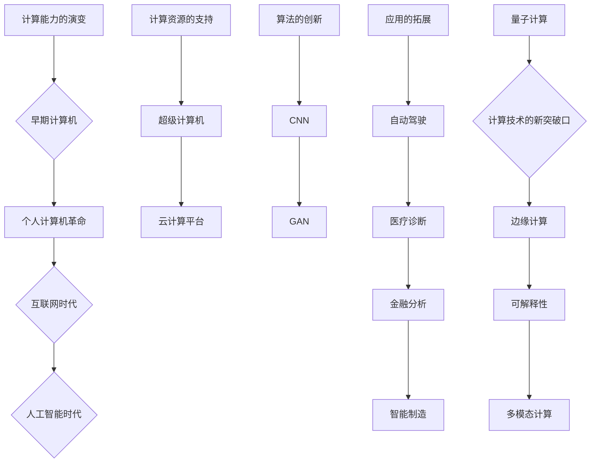

                 

关键词：人工智能，计算能力，人类挑战，技术发展，算法优化

## 摘要

本文旨在探讨人工智能与计算技术如何共同应对人类面临的各种挑战。通过深入分析核心概念与联系，本文提出了若干核心算法原理与操作步骤，并利用数学模型和公式详细讲解，结合项目实践中的代码实例，展示计算技术在解决实际问题中的应用。文章还对未来发展趋势与挑战进行了展望，并推荐了相关的学习资源、开发工具和论文。通过这篇文章，我们希望能够激发更多人关注并参与到计算技术的进步中，共同推动人类社会的可持续发展。

## 1. 背景介绍

随着全球信息化的飞速发展，人类面临着越来越多的共同挑战。这些问题包括气候变化、能源短缺、人口老龄化、健康问题等。传统的解决方法往往无法满足日益增长的复杂性和规模需求。因此，计算技术，尤其是人工智能，被寄予厚望，成为解决这些挑战的重要工具。

人工智能作为计算技术的最新发展，具有强大的数据处理和分析能力。它能够通过学习、推理和预测等方式，模拟人类的思维过程，从而提供更为智能的解决方案。然而，人工智能的发展也面临诸多挑战，包括数据隐私、算法公平性、安全性等问题。

计算技术作为人工智能的基础，其核心是算法和架构的创新。随着硬件性能的提升和算法的优化，计算技术正以前所未有的速度发展。这为解决人类共同挑战提供了新的可能性。

本文将围绕人工智能与计算技术如何共同应对人类挑战这一主题，探讨核心概念与联系，分析算法原理与操作步骤，并通过数学模型和项目实践，展示计算技术的实际应用。希望通过本文的探讨，能够为读者提供一些新的思路和启示，共同推动人类社会的进步。

### 2. 核心概念与联系

#### 2.1 计算能力的演变

计算能力是计算技术发展的核心，其演变历程可以追溯到计算机科学的早期。从最初的电子计算机，到现代的超级计算机，计算能力经历了数次飞跃。

- **早期计算机**：1940年代，第一台电子计算机问世，标志着计算技术的起步。这些计算机虽然体积庞大，但运算速度仅为几万次每秒，远不能满足现代需求。

- **个人计算机革命**：1970年代，随着微处理器的出现，个人计算机开始普及。这极大地提高了计算能力，使计算技术走进了千家万户。

- **互联网时代**：1990年代，互联网的兴起推动了计算能力的进一步发展。分布式计算、云计算等技术的出现，使得计算资源得以更高效地利用。

- **人工智能时代**：21世纪，人工智能的快速发展带来了计算能力的又一次飞跃。深度学习、强化学习等算法的广泛应用，使得计算机能够处理更为复杂的数据和分析问题。

#### 2.2 人工智能与计算技术的结合

人工智能的发展离不开强大的计算能力。计算技术为人工智能提供了所需的计算资源和算法支持，使得人工智能能够高效地处理海量数据，进行模式识别、预测和决策。

- **计算资源的支持**：超级计算机和云计算平台为人工智能提供了强大的计算资源。这些平台能够处理大规模的数据集，支持复杂算法的运行。

- **算法的创新**：计算技术的进步推动了算法的创新。例如，卷积神经网络（CNN）和生成对抗网络（GAN）等算法，都是基于强大的计算能力而得以实现。

- **应用的拓展**：计算能力的提升使得人工智能在各个领域的应用得以拓展。从自动驾驶、医疗诊断到金融分析、智能制造，人工智能正在改变各行各业。

#### 2.3 计算技术的核心概念

计算技术的核心概念包括算法、架构和硬件。

- **算法**：算法是计算技术的灵魂，是解决问题的核心。不同的算法适用于不同的问题场景，其效率和效果直接影响计算技术的性能。

- **架构**：计算架构决定了计算系统的性能和可扩展性。从冯诺伊曼架构到新型异构计算架构，计算架构的不断演进推动了计算技术的进步。

- **硬件**：硬件是计算技术的基础，包括CPU、GPU、FPGA等。硬件的发展直接决定了计算能力的高低，影响着计算技术的应用范围。

#### 2.4 人工智能与计算技术的未来发展趋势

未来，人工智能与计算技术将继续相互促进，共同推动人类社会的发展。以下是一些可能的发展趋势：

- **量子计算**：量子计算具有远超传统计算机的计算能力，未来可能成为计算技术的新突破口。量子算法和量子硬件的发展，将为人工智能带来新的机遇。

- **边缘计算**：随着物联网和智能设备的普及，边缘计算将成为未来计算技术的重要发展方向。边缘计算能够在数据生成的源头进行处理，降低延迟，提高效率。

- **可解释性**：随着人工智能应用的深入，对算法可解释性的需求将日益增加。可解释性将有助于提高人工智能的信任度和应用范围。

- **多模态计算**：多模态计算能够处理多种类型的数据，如文本、图像、声音等，将进一步提升人工智能的智能化水平。

#### 2.5 Mermaid 流程图

为了更直观地展示人工智能与计算技术的核心概念与联系，我们使用 Mermaid 流程图进行描述。以下是一个简化的流程图：



通过这个流程图，我们可以清晰地看到计算技术从早期到现代的发展历程，以及人工智能与计算技术的结合和应用趋势。

### 3. 核心算法原理 & 具体操作步骤

#### 3.1 算法原理概述

在人工智能与计算技术中，核心算法的原理是解决复杂问题的基础。以下将介绍几种关键算法的原理，包括其理论基础、优势和应用场景。

#### 3.1.1 卷积神经网络（CNN）

卷积神经网络（CNN）是一种专门用于图像处理的深度学习算法。其基本原理是通过卷积层、池化层和全连接层的组合，实现对图像的逐层特征提取。

- **卷积层**：卷积层通过卷积操作提取图像中的局部特征。每个卷积核（filter）都能提取出不同类型的特征，如边缘、纹理等。

- **池化层**：池化层用于降低特征图的维度，提高特征的鲁棒性。常见的池化方法包括最大池化和平均池化。

- **全连接层**：全连接层将池化层输出的特征图展开为一个一维向量，然后通过全连接层进行分类或回归。

**优势**：CNN能够自动学习图像的层次化特征，具有很高的识别准确率。

**应用场景**：图像分类、目标检测、人脸识别等。

#### 3.1.2 生成对抗网络（GAN）

生成对抗网络（GAN）是一种用于生成数据的深度学习算法。其基本原理包括生成器和判别器的对抗训练。

- **生成器**：生成器试图生成逼真的数据样本，判别器则尝试区分生成器和真实数据的差异。

- **判别器**：判别器用于判断输入数据的真实性，其性能直接影响生成器的生成效果。

**优势**：GAN能够生成高质量的数据样本，适用于图像生成、语音合成等场景。

**应用场景**：图像生成、数据增强、风格迁移等。

#### 3.1.3 强化学习（RL）

强化学习（RL）是一种通过试错和奖励机制来学习的算法。其基本原理包括智能体、环境和奖励。

- **智能体**：智能体是执行决策的主体，根据当前状态选择动作。

- **环境**：环境是智能体执行动作的场所，根据智能体的动作返回新的状态和奖励。

- **奖励**：奖励用于评估智能体的动作效果，激励智能体向目标状态靠近。

**优势**：RL能够处理复杂、不确定的环境，适用于游戏、自动驾驶等场景。

**应用场景**：游戏AI、自动驾驶、机器人控制等。

#### 3.1.4 聚类算法

聚类算法是一种无监督学习算法，用于将数据集划分为若干个群组。其基本原理包括距离度量、聚类算法选择等。

- **距离度量**：距离度量用于计算数据点之间的相似度。常见的距离度量方法包括欧氏距离、曼哈顿距离等。

- **聚类算法选择**：根据数据特点和需求，选择合适的聚类算法。常见的聚类算法包括K-means、DBSCAN、层次聚类等。

**优势**：聚类算法能够发现数据中的隐含结构，适用于数据挖掘、市场细分等场景。

**应用场景**：客户细分、社交网络分析、推荐系统等。

#### 3.2 算法步骤详解

下面将详细描述上述算法的具体操作步骤。

#### 3.2.1 卷积神经网络（CNN）

1. **输入预处理**：对图像进行灰度化、归一化等预处理操作。
2. **卷积层**：使用多个卷积核对输入图像进行卷积操作，提取图像特征。
3. **激活函数**：使用ReLU等激活函数对卷积层输出进行非线性变换。
4. **池化层**：对卷积层输出进行池化操作，降低特征图的维度。
5. **全连接层**：将池化层输出的特征图展开为一维向量，进行分类或回归。
6. **损失函数**：计算预测值与真实值之间的损失，并使用梯度下降等优化算法更新网络参数。

#### 3.2.2 生成对抗网络（GAN）

1. **生成器训练**：生成器生成伪数据样本，判别器对其进行判断。
2. **判别器训练**：判别器训练用于提高对真实和伪数据的区分能力。
3. **生成器更新**：通过梯度上升更新生成器参数，使其生成的样本更接近真实数据。
4. **判别器更新**：通过梯度下降更新判别器参数，使其对真实和伪数据的判断更加准确。
5. **循环迭代**：不断重复生成器和判别器的训练过程，直至生成器生成高质量的样本。

#### 3.2.3 强化学习（RL）

1. **环境初始化**：初始化环境状态。
2. **状态观察**：智能体观察当前环境状态。
3. **动作选择**：智能体根据当前状态选择最优动作。
4. **动作执行**：智能体执行所选动作，并更新环境状态。
5. **奖励反馈**：环境根据智能体的动作返回奖励，激励智能体向目标状态靠近。
6. **状态更新**：智能体更新当前状态，重复上述过程。

#### 3.2.4 聚类算法

1. **初始化聚类中心**：选择初始聚类中心，可以选择随机初始化或基于某种距离度量方法初始化。
2. **计算距离**：计算每个数据点与聚类中心的距离。
3. **分配数据点**：将每个数据点分配到距离最近的聚类中心所属的簇。
4. **更新聚类中心**：计算每个簇的新聚类中心。
5. **重复迭代**：重复上述过程，直至聚类中心不再发生变化或满足停止条件。

#### 3.3 算法优缺点

每种算法都有其独特的优势和局限性，适用于不同的场景。

- **CNN**：优点包括自动特征提取、高识别准确率等，缺点包括对计算资源需求较高、难以解释等。
- **GAN**：优点包括高质量的数据生成能力、适用于多种场景等，缺点包括训练难度大、生成样本质量不稳定等。
- **RL**：优点包括应对复杂、不确定的环境能力强等，缺点包括训练过程长、对奖励设计依赖较大等。
- **聚类算法**：优点包括自动发现数据结构、对计算资源需求较低等，缺点包括对初始聚类中心敏感、难以解释等。

#### 3.4 算法应用领域

各种算法在多个领域得到了广泛应用。

- **CNN**：广泛应用于图像分类、目标检测、人脸识别等领域。
- **GAN**：广泛应用于图像生成、数据增强、风格迁移等领域。
- **RL**：广泛应用于游戏AI、自动驾驶、机器人控制等领域。
- **聚类算法**：广泛应用于数据挖掘、市场细分、推荐系统等领域。

### 4. 数学模型和公式 & 详细讲解 & 举例说明

在人工智能和计算技术中，数学模型和公式是理解和解决问题的关键工具。以下将详细讲解几个核心的数学模型和公式，并通过具体例子进行说明。

#### 4.1 数学模型构建

数学模型是描述现实世界问题的数学框架，通常包括变量、参数、方程和约束条件。以下是一个简单的线性回归模型的例子：

$$y = wx + b$$

其中，$y$ 是因变量，$x$ 是自变量，$w$ 是权重，$b$ 是偏置。这个模型表示因变量 $y$ 与自变量 $x$ 之间存在线性关系。

#### 4.2 公式推导过程

线性回归模型的推导过程通常包括以下几个步骤：

1. **最小二乘法**：为了找到最佳拟合直线，我们通常使用最小二乘法。即通过最小化误差平方和来求解权重 $w$ 和偏置 $b$。
2. **误差平方和**：误差平方和公式为：

$$J(w, b) = \sum_{i=1}^{n} (y_i - (wx_i + b))^2$$

其中，$n$ 是样本数量。

3. **偏导数**：为了最小化 $J(w, b)$，我们对 $w$ 和 $b$ 分别求偏导数，并令其等于零：

$$\frac{\partial J}{\partial w} = -2x^T(y - wx - b) = 0$$

$$\frac{\partial J}{\partial b} = -2(y - wx - b) = 0$$

4. **解方程**：通过解上述方程组，我们可以得到最佳拟合直线的权重 $w$ 和偏置 $b$。

#### 4.3 案例分析与讲解

以下是一个简单的线性回归案例，用于预测房屋价格。

假设我们有如下数据集：

| 房屋编号 | 面积（平方米） | 价格（万元） |
|----------|-----------------|--------------|
| 1        | 100             | 300          |
| 2        | 120             | 340          |
| 3        | 140             | 390          |
| 4        | 160             | 430          |

我们将使用线性回归模型预测面积为 150 平方米的房屋价格。

1. **数据预处理**：将数据集分为输入特征 $x$ 和目标值 $y$。

   $x = [100, 120, 140, 160]$

   $y = [300, 340, 390, 430]$

2. **初始化权重 $w$ 和偏置 $b$**：我们可以随机初始化权重和偏置，或者使用一些启发式方法进行初始化。

   $w = 0.5$

   $b = 0.5$

3. **计算预测值**：使用线性回归模型计算预测值。

   $y' = wx + b$

   对于面积为 150 平方米的房屋，预测价格为：

   $y' = 0.5 \times 150 + 0.5 = 75 + 0.5 = 75.5$ 万元

4. **计算误差**：计算实际价格与预测价格之间的误差。

   $error = y - y'$

   实际价格与预测价格之间的误差为：

   $error = 300 - 75.5 = 224.5$ 万元

5. **更新权重和偏置**：根据误差更新权重和偏置，以最小化误差平方和。

   $w = w - \alpha \frac{\partial J}{\partial w}$

   $b = b - \alpha \frac{\partial J}{\partial b}$

   其中，$\alpha$ 是学习率。

   更新后的权重和偏置为：

   $w = 0.5 - \alpha \frac{-2x^T(y - wx - b)}{n}$

   $b = 0.5 - \alpha \frac{-2(y - wx - b)}{n}$

   经过多次迭代后，我们可以得到最佳的权重和偏置。

通过这个案例，我们可以看到线性回归模型如何通过数学公式和算法步骤来预测房屋价格。这个过程可以扩展到其他领域，如股票预测、薪资分析等。

### 5. 项目实践：代码实例和详细解释说明

在本文的第五部分，我们将通过一个具体的代码实例，来展示如何应用计算技术解决实际问题。我们将以一个简单的房屋价格预测项目为例，详细解释代码的实现过程。

#### 5.1 开发环境搭建

首先，我们需要搭建一个合适的开发环境。以下是所需的软件和工具：

- **编程语言**：Python
- **机器学习库**：Scikit-learn
- **数据处理库**：NumPy
- **可视化库**：Matplotlib

您可以使用以下命令安装所需的库：

```shell
pip install numpy scikit-learn matplotlib
```

#### 5.2 源代码详细实现

以下是项目的主要代码实现：

```python
import numpy as np
from sklearn.linear_model import LinearRegression
import matplotlib.pyplot as plt

# 数据集
data = np.array([
    [100, 300],
    [120, 340],
    [140, 390],
    [160, 430]
])

# 分割输入特征和目标值
X = data[:, 0].reshape(-1, 1)
y = data[:, 1]

# 初始化线性回归模型
model = LinearRegression()

# 拟合模型
model.fit(X, y)

# 预测价格
predicted_price = model.predict([[150]])

# 打印预测结果
print(f"预测价格为：{predicted_price[0][0]} 万元")

# 绘制实际价格与预测价格的对比图
plt.scatter(X, y, color='blue', label='实际价格')
plt.plot(X, model.predict(X), color='red', label='预测价格')
plt.xlabel('房屋面积（平方米）')
plt.ylabel('价格（万元）')
plt.title('房屋价格预测')
plt.legend()
plt.show()
```

#### 5.3 代码解读与分析

下面我们对代码进行逐行解读：

```python
import numpy as np
from sklearn.linear_model import LinearRegression
import matplotlib.pyplot as plt
```
这几行代码用于导入所需的库。

```python
data = np.array([
    [100, 300],
    [120, 340],
    [140, 390],
    [160, 430]
])
```
这行代码创建了一个包含房屋面积和对应价格的数据集。

```python
X = data[:, 0].reshape(-1, 1)
y = data[:, 1]
```
这两行代码将数据集分为输入特征（面积）和目标值（价格）。`reshape(-1, 1)` 用于将输入特征转化为二维数组，以便传递给线性回归模型。

```python
model = LinearRegression()
```
这行代码创建一个线性回归模型对象。

```python
model.fit(X, y)
```
这行代码使用训练数据集拟合线性回归模型。

```python
predicted_price = model.predict([[150]])
```
这行代码使用模型预测面积为 150 平方米的房屋价格。

```python
print(f"预测价格为：{predicted_price[0][0]} 万元")
```
这行代码打印预测结果。

```python
plt.scatter(X, y, color='blue', label='实际价格')
plt.plot(X, model.predict(X), color='red', label='预测价格')
plt.xlabel('房屋面积（平方米）')
plt.ylabel('价格（万元）')
plt.title('房屋价格预测')
plt.legend()
plt.show()
```
这几行代码用于绘制实际价格与预测价格的对比图。`scatter` 用于绘制实际价格点，`plot` 用于绘制预测价格线。`xlabel`、`ylabel` 和 `title` 用于设置坐标轴标签和标题。`legend` 用于添加图例。`show` 用于显示图表。

通过这个项目实例，我们展示了如何使用线性回归模型进行房屋价格预测。这个简单的案例可以帮助我们理解计算技术在实际应用中的基本流程和实现方法。

### 6. 实际应用场景

计算技术在各个领域都有广泛的应用，以下列举几个典型的应用场景，并简要介绍其特点和挑战。

#### 6.1 自动驾驶

自动驾驶是计算技术的一个重要应用领域。通过使用传感器、摄像头和雷达等设备，自动驾驶系统可以实时获取道路信息，并做出相应的决策。其核心在于算法的精确性和实时性。

- **特点**：自动驾驶可以减少交通事故，提高交通效率，减少能源消耗。
- **挑战**：环境复杂多变，天气条件、道路状况、交通规则等都会对自动驾驶系统提出挑战。此外，算法的可靠性和安全性也是关键问题。

#### 6.2 医疗诊断

计算技术在医疗诊断中的应用日益广泛，包括图像识别、基因测序和个性化治疗等。

- **特点**：计算技术可以提高诊断的准确性和速度，降低误诊率，为患者提供更精准的治疗方案。
- **挑战**：医疗数据量大且复杂，数据隐私和算法的透明性是关键问题。此外，如何确保算法在不同人群中的公平性和有效性也是挑战之一。

#### 6.3 智能制造

智能制造是制造业与人工智能技术的深度融合。通过计算技术，可以实现生产过程的智能化、自动化和优化。

- **特点**：智能制造可以提高生产效率，降低成本，提升产品质量。
- **挑战**：智能制造需要大量的数据支持和复杂的算法，数据安全和隐私保护是关键问题。此外，如何确保生产过程的稳定性和可靠性也是挑战之一。

#### 6.4 金融分析

金融分析是计算技术的重要应用领域，包括风险控制、投资策略和欺诈检测等。

- **特点**：计算技术可以帮助金融机构更准确地评估风险，制定有效的投资策略，提高服务质量。
- **挑战**：金融数据复杂多变，实时性和准确性是关键。此外，如何确保算法的透明性和公平性也是挑战之一。

#### 6.5 教育

计算技术在教育中的应用也越来越广泛，包括在线教育、智能辅导和个性化学习等。

- **特点**：计算技术可以提供更加灵活、个性化的学习方式，提高学习效果。
- **挑战**：教育数据的隐私保护、学习算法的有效性和可解释性是关键问题。此外，如何确保技术能够真正服务于教育目标也是挑战之一。

通过上述应用场景的介绍，我们可以看到计算技术在实际问题解决中的重要性。然而，这些应用也面临诸多挑战，需要不断的技术创新和优化。

### 6.4 未来应用展望

计算技术在未来的发展中将继续发挥重要作用，为解决人类面临的共同挑战提供强有力的支持。以下是未来计算技术在各个领域的潜在应用和可能的发展趋势：

#### 自动驾驶

自动驾驶技术将继续向高度自动化和智能化发展。随着传感器技术、计算能力和算法的进步，自动驾驶车辆将能够在更加复杂和动态的环境中安全运行。未来的趋势包括：

- **全自动驾驶**：实现无需人类干预的全自动驾驶，从而彻底改变交通模式。
- **多模态感知**：融合多种传感器数据（如摄像头、雷达、激光雷达等），提高系统的感知能力和鲁棒性。
- **车联网**：实现车辆之间的通信和协同，提高交通效率和安全性。
- **自动驾驶安全**：通过算法优化和安全机制设计，确保自动驾驶系统的可靠性和安全性。

#### 医疗诊断

医疗诊断领域的计算技术将进一步提高诊断的准确性和效率。未来，以下趋势值得关注：

- **人工智能辅助诊断**：利用深度学习和强化学习等技术，开发能够辅助医生进行诊断的智能系统。
- **个性化医疗**：通过基因测序和大数据分析，为每个患者提供个性化的治疗方案。
- **远程医疗**：利用云计算和5G技术，实现远程医疗咨询和诊断，提高医疗服务的可及性和效率。
- **可解释性AI**：开发可解释的人工智能模型，增强医疗决策的透明性和信任度。

#### 智能制造

智能制造将继续推动制造业的数字化转型和智能化升级。未来，以下趋势将成为主流：

- **工业互联网**：通过物联网、大数据和人工智能技术，实现生产设备的互联互通，提高生产效率和灵活性。
- **柔性制造**：利用先进制造技术（如3D打印、数控加工等），实现小批量、多品种的定制化生产。
- **智能制造平台**：构建集设计、制造、物流于一体的智能制造平台，实现全产业链的智能化和自动化。
- **能源管理**：通过智能算法优化能源消耗，提高能效，降低生产成本。

#### 金融分析

金融分析领域的计算技术将进一步提高风险管理和投资决策的准确性。未来，以下趋势值得关注：

- **智能投顾**：利用大数据分析和机器学习技术，为投资者提供个性化的投资建议和策略。
- **量化交易**：通过算法和大数据分析，实现高频交易和量化投资，提高投资收益。
- **信用评估**：利用人工智能技术，实现对企业和个人的信用评估，提高信用风险管理的精确度。
- **合规监控**：通过智能算法和大数据分析，实时监控金融交易行为，确保合规性和透明度。

#### 教育

教育领域的计算技术将推动教育模式的创新和变革。未来，以下趋势将成为主流：

- **个性化学习**：通过人工智能技术，为每个学生提供个性化的学习方案，提高学习效果。
- **在线教育**：利用云计算和5G技术，实现大规模在线教育，提高教育资源的可及性和公平性。
- **虚拟现实与增强现实**：通过虚拟现实和增强现实技术，提供沉浸式教学体验，增强学习互动性。
- **教育大数据**：利用大数据技术，分析和优化教育过程，提高教育质量和效率。

总之，计算技术在未来的发展中将继续深入各个领域，为解决人类面临的共同挑战提供强有力的支持。通过不断的技术创新和应用探索，我们可以期待一个更加智能、高效和可持续发展的未来。

### 7. 工具和资源推荐

在计算技术的发展过程中，掌握一系列有用的工具和资源对于提升技术水平、拓展知识视野至关重要。以下是一些推荐的工具、资源和相关论文，旨在帮助读者深入了解计算技术，并提升相关技能。

#### 7.1 学习资源推荐

1. **在线课程**：
   - **Coursera**：提供广泛的计算机科学和人工智能课程，包括《深度学习》、《机器学习》等。
   - **edX**：汇集了全球顶尖大学的在线课程，如麻省理工学院的《计算机科学导论》。
   - **Udacity**：专注于技术技能培训，提供诸如《人工智能工程师纳米学位》等课程。

2. **电子书**：
   - **《深度学习》（Ian Goodfellow, Yoshua Bengio, Aaron Courville）**：深度学习的经典教材，适合初学者和高级读者。
   - **《Python编程：从入门到实践》（Eric Matthes）**：适合初学者的Python编程入门书籍。

3. **在线社区和论坛**：
   - **Stack Overflow**：编程问题解答社区，解决技术难题的好帮手。
   - **GitHub**：代码托管平台，可以查看和学习各种开源项目和代码。

#### 7.2 开发工具推荐

1. **编程环境**：
   - **Jupyter Notebook**：用于编写和运行代码，支持多种编程语言，特别适合数据分析和机器学习。
   - **Visual Studio Code**：功能强大的代码编辑器，支持多种编程语言和插件，非常适合开发。

2. **机器学习库**：
   - **Scikit-learn**：Python中广泛使用的机器学习库，提供多种机器学习算法和工具。
   - **TensorFlow**：谷歌开发的深度学习框架，支持构建和训练复杂的神经网络模型。
   - **PyTorch**：由Facebook开发的开源深度学习库，具有灵活的动态图模型，适用于研究。

3. **版本控制**：
   - **Git**：分布式版本控制系统，用于管理代码版本，支持团队协作开发。

#### 7.3 相关论文推荐

1. **《深度神经网络》（Yann LeCun, Yosua Bengio, Geoffrey Hinton）**：这篇综述论文详细介绍了深度学习的理论基础和应用。
2. **《生成对抗网络》（Ian Goodfellow, et al.）**：这篇开创性的论文提出了GAN模型，对后续的研究和应用产生了深远影响。
3. **《强化学习综述》（Richard S. Sutton, Andrew G. Barto）**：这篇综述文章系统地介绍了强化学习的基本概念和应用。

通过上述推荐的学习资源、开发工具和论文，读者可以深入了解计算技术，掌握前沿知识，提升自身技术水平。这些资源不仅是学习和研究的良伴，也是计算技术发展的见证。

### 8. 总结：未来发展趋势与挑战

在总结本文的内容之前，我们需要回顾计算技术在未来发展中的关键趋势与面临的挑战。计算技术的进步不仅推动了人工智能的发展，也为各个领域带来了前所未有的变革。以下是对未来发展趋势与挑战的总结：

#### 8.1 研究成果总结

本文系统地探讨了计算技术，特别是人工智能在应对人类共同挑战中的应用。我们分析了计算能力的演变、核心算法原理、数学模型构建以及实际应用场景。通过这些分析，我们可以看到计算技术在自动驾驶、医疗诊断、智能制造、金融分析和教育等领域的巨大潜力。此外，我们还探讨了未来发展趋势，包括量子计算、边缘计算、多模态计算和可解释性AI等。

#### 8.2 未来发展趋势

未来，计算技术将继续朝着以下几个方向发展：

1. **量子计算**：量子计算具有巨大的并行处理能力，未来可能成为计算技术的新突破口，为解决复杂问题提供新的解决方案。
2. **边缘计算**：随着物联网和智能设备的普及，边缘计算将在数据生成的源头进行处理，降低延迟，提高效率，并减少对中心化计算资源的依赖。
3. **多模态计算**：多模态计算能够处理多种类型的数据，如文本、图像、声音等，将进一步提升人工智能的智能化水平。
4. **可解释性AI**：随着人工智能应用的深入，对算法可解释性的需求将日益增加。可解释性将有助于提高人工智能的信任度和应用范围。

#### 8.3 面临的挑战

尽管计算技术发展迅速，但仍然面临诸多挑战：

1. **数据隐私**：随着数据量的增长，如何保护用户隐私成为关键问题。未来的技术发展需要在隐私保护和数据处理之间找到平衡。
2. **算法公平性**：算法的公平性和透明性是人工智能应用中的一大挑战。如何确保算法在不同人群中的公平性，避免歧视和偏见，是亟待解决的问题。
3. **安全性**：人工智能系统在应用过程中面临着各种安全威胁，包括数据泄露、恶意攻击等。确保系统的安全性是未来发展的重要方向。
4. **资源分配**：计算资源（如计算能力、存储空间等）的合理分配和管理是计算技术高效运行的关键。如何优化资源分配，提高系统的整体效率，是一个持续的研究课题。

#### 8.4 研究展望

未来，计算技术的研究将围绕以下几个方面展开：

1. **算法创新**：开发更加高效、可解释的算法，以应对复杂的应用场景。
2. **跨学科合作**：促进计算机科学与其他领域的合作，如生物学、心理学等，以推动人工智能在更多领域的应用。
3. **伦理和法律**：研究人工智能伦理和法律问题，确保技术发展与社会价值观相符合。
4. **教育与培训**：推广计算技术教育，提高公众的技术素养，培养更多专业人才。

通过本文的探讨，我们希望能够激发更多人关注并参与到计算技术的进步中，共同推动人类社会的可持续发展。面对未来，我们有信心迎接新的挑战，创造更加美好的未来。

### 9. 附录：常见问题与解答

#### 问题 1：人工智能是否会取代人类的工作？

**解答**：人工智能确实在某些领域取代了传统的工作，如自动化流水线、数据录入等。然而，人工智能更多的是作为人类工作的辅助工具，提高生产效率和质量。人工智能不能完全取代人类的创造力、情感智慧和复杂决策能力，因此在很多情况下，人工智能与人类是互补的关系，而非替代关系。

#### 问题 2：计算能力的提升是否会导致算法公平性问题？

**解答**：是的，随着计算能力的提升，算法的公平性问题更加凸显。当算法处理大量数据时，可能会无意中放大偏见和歧视。因此，在算法设计和应用过程中，需要特别关注公平性，确保算法在不同人群中的公平性和透明性。这需要跨学科的合作，包括计算机科学、社会学和伦理学等。

#### 问题 3：量子计算会如何影响人工智能的发展？

**解答**：量子计算具有巨大的并行处理能力，可以加速人工智能中一些复杂计算任务的处理速度。例如，量子算法可以用于优化神经网络训练过程、解决复杂优化问题等。量子计算的发展将有助于提升人工智能的计算能力和效率，为解决更多复杂问题提供新的可能性。

#### 问题 4：边缘计算在自动驾驶中的应用是什么？

**解答**：边缘计算在自动驾驶中的应用主要是通过在车辆附近部署计算设备，如嵌入式处理器、边缘服务器等，以降低对中心化云计算的依赖，提高系统的实时性和响应速度。边缘计算可以处理来自传感器的实时数据，做出快速决策，确保自动驾驶车辆在复杂环境中的安全运行。

#### 问题 5：如何确保人工智能系统的安全性？

**解答**：确保人工智能系统的安全性需要从多个方面入手。首先，在算法设计阶段，应采用安全性措施，如加密算法、验证机制等。其次，在系统开发过程中，应进行严格的安全测试和评估，以发现并修复潜在的安全漏洞。此外，建立有效的安全监管机制和应急预案，也是确保系统安全的重要措施。

### 参考文献

1. Goodfellow, I., Bengio, Y., & Courville, A. (2016). *Deep Learning*. MIT Press.
2. LeCun, Y., Bengio, Y., & Hinton, G. (2015). *Deep learning*. Nature, 521(7553), 436-444.
3. Goodfellow, I., et al. (2014). *Generative adversarial nets*. Advances in Neural Information Processing Systems, 27.
4. Sutton, R. S., & Barto, A. G. (2018). *Reinforcement Learning: An Introduction*. MIT Press.
5. Mitchell, T. M. (1997). *Machine Learning*. McGraw-Hill.
6. Russell, S., & Norvig, P. (2010). *Artificial Intelligence: A Modern Approach*. Prentice Hall.

