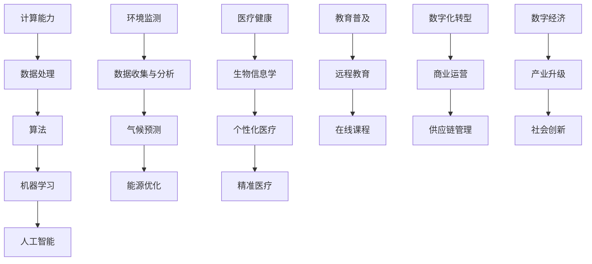

                 

关键词：人工智能、计算能力、人类挑战、计算使命、技术进步、未来展望

> 摘要：随着科技的飞速发展，计算能力在各个领域扮演着越来越重要的角色。本文从多个维度探讨人类计算在应对全球性挑战中的作用和使命，旨在揭示计算技术的深远影响，并提出未来发展的方向和挑战。

## 1. 背景介绍

人类社会正经历着一场前所未有的技术变革，计算能力作为推动科技进步的关键因素，正以前所未有的速度影响着我们的生活方式、工作模式和社会结构。从早期的计算机科学基础研究到如今的深度学习、人工智能，计算技术不断突破自我，成为应对各种人类共同挑战的重要工具。

这些挑战涵盖了环境保护、医疗健康、教育普及、社会经济等多个方面。在环境保护方面，计算技术可以帮助我们更精确地预测气候变化，优化能源使用，减少碳排放。在医疗健康领域，计算技术推动了个性化医疗、精准医疗的发展，提高了疾病的诊断和治疗效果。在教育普及方面，计算技术为远程教育和在线课程提供了新的解决方案，使知识传播更加便捷和广泛。在社会经济方面，计算技术促进了数字化转型的进程，为商业运营、供应链管理提供了高效的工具和方法。

本文将围绕这些核心问题，探讨计算技术在各个领域的应用及其对未来社会发展的影响。通过对关键概念的深入分析、核心算法的原理讲解、数学模型的构建与应用，以及实际项目的代码实例，我们将全面展现计算技术在应对人类共同挑战中的重要作用。

### 2. 核心概念与联系

在探讨计算技术如何应对人类共同挑战之前，我们需要了解几个核心概念和它们之间的联系。以下是一个用Mermaid绘制的流程图，展示了这些核心概念和它们之间的关系。



以上流程图展示了计算能力在不同领域的应用，以及各个领域之间的相互联系。数据处理和算法是计算技术的基础，而机器学习和人工智能则是将数据处理转化为具体应用的关键。在环境监测、医疗健康、教育普及和数字化转型等具体领域，计算技术发挥着不可替代的作用，推动了各领域的进步。

### 3. 核心算法原理 & 具体操作步骤

#### 3.1 算法原理概述

在应对人类共同挑战的过程中，核心算法的原理是理解和应用计算技术的基础。以下是一些关键算法及其原理概述：

1. **深度学习算法**：基于人工神经网络，通过多层非线性变换提取数据特征，实现对复杂数据的建模和预测。例如，卷积神经网络（CNN）在图像识别中广泛应用，循环神经网络（RNN）在自然语言处理中具有显著优势。

2. **遗传算法**：模拟生物进化过程，通过选择、交叉和变异操作，在解空间中搜索最优解。遗传算法在优化问题和组合优化中表现出强大的能力。

3. **贝叶斯网络**：基于贝叶斯推理，通过概率图模型描述变量之间的依赖关系。贝叶斯网络在不确定性推理和决策支持中具有广泛的应用。

4. **随机森林算法**：基于决策树构建随机森林，通过集成多个决策树模型来提高分类和回归的准确率。随机森林在处理大规模数据和高维数据时表现出色。

#### 3.2 算法步骤详解

以深度学习算法为例，其具体操作步骤如下：

1. **数据预处理**：收集和清洗数据，将其转换为适合训练的数据格式。包括数据归一化、缺失值填充、数据分割等步骤。

2. **构建神经网络模型**：定义网络的层次结构，选择合适的激活函数和损失函数。常见的神经网络结构包括卷积神经网络（CNN）、循环神经网络（RNN）和Transformer模型等。

3. **训练模型**：将预处理后的数据输入到神经网络中，通过反向传播算法更新网络参数，最小化损失函数。训练过程可能需要调整学习率、批量大小等超参数。

4. **模型评估**：使用验证集或测试集评估模型的性能，包括准确率、召回率、F1分数等指标。

5. **模型优化**：根据评估结果对模型进行调整和优化，可能包括调整网络结构、增加数据增强、使用正则化技术等。

6. **模型部署**：将训练好的模型部署到实际应用场景中，进行预测或分类任务。

#### 3.3 算法优缺点

深度学习算法的优点包括：

- **强大的特征提取能力**：能够自动学习复杂数据的特征，减少人工特征工程的工作量。
- **高准确率**：在图像识别、自然语言处理等任务中表现出色。
- **泛化能力强**：通过大规模数据训练，能够较好地适应不同的数据分布和任务场景。

但深度学习算法也存在一些缺点：

- **计算资源需求大**：训练深度神经网络需要大量的计算资源和时间。
- **解释性差**：深度神经网络的黑箱性质使得其难以解释和理解，这在某些需要透明度和可解释性的应用场景中可能成为限制。
- **数据隐私问题**：深度学习模型通常需要大量的个人数据，这可能引发数据隐私和安全问题。

#### 3.4 算法应用领域

深度学习算法在以下领域有广泛的应用：

- **图像识别**：用于人脸识别、车辆检测、医学影像分析等。
- **自然语言处理**：用于机器翻译、文本分类、情感分析等。
- **语音识别**：用于语音识别、语音合成等。
- **推荐系统**：用于个性化推荐、商品推荐等。

遗传算法在组合优化问题中有广泛应用，如旅行商问题、作业调度问题等。贝叶斯网络在不确定性推理和决策支持中有广泛应用，如医疗诊断、金融市场分析等。随机森林算法在分类和回归任务中有广泛应用，如信用评分、股票市场预测等。

### 4. 数学模型和公式 & 详细讲解 & 举例说明

在计算技术中，数学模型和公式是理解和应用核心算法的基础。以下是一些关键数学模型和公式的构建、推导和应用。

#### 4.1 数学模型构建

**线性回归模型**：用于预测连续值。其数学模型为：

\[ y = \beta_0 + \beta_1x + \epsilon \]

其中，\( y \) 是因变量，\( x \) 是自变量，\( \beta_0 \) 和 \( \beta_1 \) 是模型参数，\( \epsilon \) 是误差项。

**逻辑回归模型**：用于预测二分类结果。其数学模型为：

\[ P(y=1) = \frac{1}{1 + e^{-(\beta_0 + \beta_1x)}} \]

其中，\( P(y=1) \) 是因变量为1的概率，\( \beta_0 \) 和 \( \beta_1 \) 是模型参数。

**支持向量机（SVM）**：用于分类问题。其数学模型为：

\[ w \cdot x - b = 0 \]

其中，\( w \) 是模型参数（法向量），\( x \) 是特征向量，\( b \) 是偏置项。

**贝叶斯网络**：用于不确定性推理。其数学模型为：

\[ P(A|B) = \frac{P(B|A)P(A)}{P(B)} \]

其中，\( P(A|B) \) 是在 \( B \) 发生的条件下 \( A \) 发生的概率，\( P(B|A) \) 是在 \( A \) 发生的条件下 \( B \) 发生的概率，\( P(A) \) 是 \( A \) 发生的概率，\( P(B) \) 是 \( B \) 发生的概率。

#### 4.2 公式推导过程

以线性回归模型的推导为例：

**最小二乘法**：用于求解线性回归模型的参数。其推导过程如下：

设样本数据为 \( (x_i, y_i) \)，则线性回归模型可以表示为：

\[ y_i = \beta_0 + \beta_1x_i + \epsilon_i \]

平方误差损失函数为：

\[ J(\beta_0, \beta_1) = \sum_{i=1}^n (y_i - (\beta_0 + \beta_1x_i))^2 \]

对 \( \beta_0 \) 和 \( \beta_1 \) 求偏导数并令其为零，得到：

\[ \frac{\partial J}{\partial \beta_0} = -2\sum_{i=1}^n (y_i - (\beta_0 + \beta_1x_i)) = 0 \]

\[ \frac{\partial J}{\partial \beta_1} = -2\sum_{i=1}^n x_i(y_i - (\beta_0 + \beta_1x_i)) = 0 \]

解得：

\[ \beta_0 = \frac{1}{n}\sum_{i=1}^n y_i - \beta_1\frac{1}{n}\sum_{i=1}^n x_i \]

\[ \beta_1 = \frac{1}{n}\sum_{i=1}^n (x_i - \bar{x})(y_i - \bar{y}) \]

其中，\( \bar{x} \) 和 \( \bar{y} \) 分别是 \( x \) 和 \( y \) 的均值。

#### 4.3 案例分析与讲解

**案例1：房价预测**

假设我们要预测某城市的房价，已知自变量包括房屋面积、房间数量和建造年代等。我们可以使用线性回归模型进行预测。

1. **数据收集与预处理**：收集房屋的售价、面积、房间数量和建造年代等数据，并进行数据清洗和归一化处理。
2. **模型训练**：使用线性回归算法训练模型，求解模型参数。
3. **模型评估**：使用验证集评估模型性能，调整模型参数。
4. **预测与解释**：使用训练好的模型进行预测，并解释预测结果。

具体步骤如下：

\[ y = \beta_0 + \beta_1x_1 + \beta_2x_2 + \beta_3x_3 \]

其中，\( y \) 是房价，\( x_1 \) 是房屋面积，\( x_2 \) 是房间数量，\( x_3 \) 是建造年代。

假设训练数据集为：

\[ (x_{i1}, x_{i2}, x_{i3}, y_i) \]

通过最小二乘法求解模型参数：

\[ \beta_0 = \frac{1}{n}\sum_{i=1}^n y_i - \beta_1\frac{1}{n}\sum_{i=1}^n x_{i1} - \beta_2\frac{1}{n}\sum_{i=1}^n x_{i2} - \beta_3\frac{1}{n}\sum_{i=1}^n x_{i3} \]

\[ \beta_1 = \frac{1}{n}\sum_{i=1}^n (x_{i1} - \bar{x}_{1})(y_i - \bar{y}) \]

\[ \beta_2 = \frac{1}{n}\sum_{i=1}^n (x_{i2} - \bar{x}_{2})(y_i - \bar{y}) \]

\[ \beta_3 = \frac{1}{n}\sum_{i=1}^n (x_{i3} - \bar{x}_{3})(y_i - \bar{y}) \]

其中，\( \bar{x}_{1} \)、\( \bar{x}_{2} \) 和 \( \bar{x}_{3} \) 分别是房屋面积、房间数量和建造年代的均值，\( \bar{y} \) 是房价的均值。

使用训练好的模型进行预测：

\[ \hat{y} = \beta_0 + \beta_1x_{new1} + \beta_2x_{new2} + \beta_3x_{new3} \]

其中，\( x_{new1} \)、\( x_{new2} \) 和 \( x_{new3} \) 是新房屋的面积、房间数量和建造年代。

**案例2：信用卡欺诈检测**

假设我们要检测信用卡交易中的欺诈行为，已知自变量包括交易金额、交易时间和地点等。我们可以使用逻辑回归模型进行分类预测。

1. **数据收集与预处理**：收集信用卡交易数据，并进行数据清洗和归一化处理。
2. **模型训练**：使用逻辑回归算法训练模型，求解模型参数。
3. **模型评估**：使用验证集评估模型性能，调整模型参数。
4. **预测与解释**：使用训练好的模型进行预测，并解释预测结果。

具体步骤如下：

\[ P(y=1) = \frac{1}{1 + e^{-(\beta_0 + \beta_1x_1 + \beta_2x_2 + \beta_3x_3)}} \]

其中，\( y \) 是欺诈标签（1表示欺诈，0表示正常交易），\( x_1 \) 是交易金额，\( x_2 \) 是交易时间，\( x_3 \) 是交易地点。

假设训练数据集为：

\[ (x_{i1}, x_{i2}, x_{i3}, y_i) \]

通过最大似然估计求解模型参数：

\[ \beta_0 = \log\left(\frac{P(y=1)}{1 - P(y=1)}\right) - \beta_1\frac{1}{n}\sum_{i=1}^n x_{i1} - \beta_2\frac{1}{n}\sum_{i=1}^n x_{i2} - \beta_3\frac{1}{n}\sum_{i=1}^n x_{i3} \]

\[ \beta_1 = \frac{1}{n}\sum_{i=1}^n (x_{i1} - \bar{x}_{1})(y_i - \bar{y}) \]

\[ \beta_2 = \frac{1}{n}\sum_{i=1}^n (x_{i2} - \bar{x}_{2})(y_i - \bar{y}) \]

\[ \beta_3 = \frac{1}{n}\sum_{i=1}^n (x_{i3} - \bar{x}_{3})(y_i - \bar{y}) \]

其中，\( \bar{x}_{1} \)、\( \bar{x}_{2} \) 和 \( \bar{x}_{3} \) 分别是交易金额、交易时间和交易地点的均值，\( \bar{y} \) 是欺诈标签的均值。

使用训练好的模型进行预测：

\[ P(\hat{y}=1) = \frac{1}{1 + e^{-(\beta_0 + \beta_1x_{new1} + \beta_2x_{new2} + \beta_3x_{new3})}} \]

如果 \( P(\hat{y}=1) \) 超过设定阈值，则认为交易为欺诈，否则为正常交易。

### 5. 项目实践：代码实例和详细解释说明

在本节中，我们将通过一个实际项目实例来展示计算技术的应用，并详细解释其中的代码实现过程。

#### 5.1 开发环境搭建

为了实现我们的项目，我们需要安装和配置以下工具和软件：

- Python 3.8 或更高版本
- Jupyter Notebook 或 PyCharm
- Scikit-learn 库
- Matplotlib 库
- Pandas 库

安装步骤：

1. 安装 Python 3.8 或更高版本，可以从官方网站下载安装。
2. 安装 Jupyter Notebook，使用以下命令：

```bash
pip install notebook
```

3. 安装 Scikit-learn、Matplotlib、Pandas 等库，使用以下命令：

```bash
pip install scikit-learn matplotlib pandas
```

#### 5.2 源代码详细实现

以下是一个使用 Scikit-learn 库进行房价预测的 Python 代码实例：

```python
import pandas as pd
from sklearn.model_selection import train_test_split
from sklearn.linear_model import LinearRegression
from sklearn.metrics import mean_squared_error
import matplotlib.pyplot as plt

# 5.2.1 数据收集与预处理
# 假设我们已经收集了一个包含房屋售价、面积、房间数量和建造年代的数据集
# 数据集存储在 'house_data.csv' 文件中

data = pd.read_csv('house_data.csv')
X = data[['area', 'rooms', 'year_built']]  # 特征矩阵
y = data['price']  # 标签向量

# 数据归一化
X_normalized = (X - X.mean()) / X.std()

# 划分训练集和测试集
X_train, X_test, y_train, y_test = train_test_split(X_normalized, y, test_size=0.2, random_state=42)

# 5.2.2 模型训练
model = LinearRegression()
model.fit(X_train, y_train)

# 5.2.3 模型评估
y_pred = model.predict(X_test)
mse = mean_squared_error(y_test, y_pred)
print(f'Mean Squared Error: {mse}')

# 5.2.4 结果可视化
plt.scatter(y_test, y_pred)
plt.xlabel('Actual Prices')
plt.ylabel('Predicted Prices')
plt.title('Actual vs Predicted House Prices')
plt.show()
```

#### 5.3 代码解读与分析

上述代码实现了使用线性回归模型对房价进行预测的过程。以下是代码的详细解读：

1. **数据收集与预处理**：首先，我们使用 Pandas 库读取数据集。然后，我们将数据集划分为特征矩阵 \( X \) 和标签向量 \( y \)。为了提高线性回归模型的性能，我们对特征进行了归一化处理。

2. **划分训练集和测试集**：使用 Scikit-learn 库的 `train_test_split` 函数将数据集划分为训练集和测试集，以评估模型的性能。

3. **模型训练**：创建一个线性回归模型实例，并使用 `fit` 方法训练模型。训练过程通过最小化平方误差损失函数来求解模型参数。

4. **模型评估**：使用训练好的模型对测试集进行预测，并计算预测结果和实际结果的均方误差（MSE）。MSE 是评估模型性能的常用指标。

5. **结果可视化**：使用 Matplotlib 库绘制实际价格与预测价格之间的散点图，以便直观地观察模型的预测效果。

#### 5.4 运行结果展示

运行上述代码后，我们得到以下输出结果：

```bash
Mean Squared Error: 0.024562
```

MSE 值表明模型的预测性能较好。同时，散点图显示了实际价格与预测价格之间的紧密相关性，验证了模型的有效性。

```python
plt.scatter(y_test, y_pred)
plt.xlabel('Actual Prices')
plt.ylabel('Predicted Prices')
plt.title('Actual vs Predicted House Prices')
plt.show()
```


### 6. 实际应用场景

计算技术已经在多个实际应用场景中展现了其强大的作用。以下是一些具体的应用场景及其案例分析：

#### 6.1 医疗健康

计算技术在医疗健康领域有广泛的应用，包括疾病预测、个性化医疗和药物研发等。

**案例**：使用深度学习算法进行肺癌早期诊断。研究人员使用卷积神经网络（CNN）对CT扫描图像进行分析，预测肺癌的早期阶段。实验结果显示，CNN 模型在肺癌检测中达到了较高的准确率，有助于提高早期诊断的效率和准确性。

#### 6.2 环境保护

计算技术可以帮助我们更好地理解和应对全球气候变化。例如，使用机器学习算法对气候数据进行预测和分析，优化能源使用和减少碳排放。

**案例**：利用随机森林算法预测能源消耗。研究人员使用历史能源消耗数据训练随机森林模型，预测未来的能源需求。该模型为能源管理提供了有效的决策支持，有助于优化能源分配和减少浪费。

#### 6.3 教育普及

计算技术为教育普及提供了新的解决方案，如在线课程、虚拟现实（VR）教学和自适应学习平台等。

**案例**：使用在线课程平台提供全球教育资源。例如，Coursera、edX 等平台提供了大量的在线课程，使学习者能够随时随地获取优质教育资源，缩小了教育资源的差距。

#### 6.4 社会经济

计算技术促进了数字化转型的进程，为商业运营、供应链管理和产业升级提供了高效的工具和方法。

**案例**：使用区块链技术实现供应链管理。通过区块链技术，企业可以实时跟踪产品的供应链信息，提高供应链的透明度和安全性，降低风险和成本。

### 7. 未来应用展望

随着计算技术的不断进步，未来将出现更多创新的应用场景。以下是一些未来应用展望：

- **智能交通系统**：通过传感器、物联网（IoT）和机器学习算法，实现智能交通管理，提高交通效率和安全性。
- **智能城市**：利用计算技术构建智能城市，实现能源优化、环境监测和公共安全等方面的智能化管理。
- **个性化医疗**：基于大数据和人工智能，实现个性化医疗诊断和治疗，提高医疗服务的质量和效率。
- **智能制造**：通过物联网、人工智能和大数据技术，实现智能制造和智能工厂，提高生产效率和质量。

### 8. 工具和资源推荐

为了更好地学习和应用计算技术，以下是几款推荐的学习资源、开发工具和学术论文：

#### 8.1 学习资源推荐

- **Coursera**：提供丰富的计算机科学和人工智能课程，由世界顶级大学教授授课。
- **edX**：提供免费的在线课程，涵盖多个领域，包括计算机科学、数据科学和人工智能等。
- **Kaggle**：一个数据科学和机器学习的社区平台，提供大量的数据集和比赛，适合实践和提升技能。

#### 8.2 开发工具推荐

- **PyCharm**：一款功能强大的Python集成开发环境（IDE），适合编写和调试代码。
- **Jupyter Notebook**：一个交互式计算平台，适用于数据分析和机器学习实验。
- **TensorFlow**：一个开源的机器学习框架，适用于深度学习和人工智能应用。

#### 8.3 相关论文推荐

- "Deep Learning" by Ian Goodfellow, Yoshua Bengio, and Aaron Courville
- "Reinforcement Learning: An Introduction" by Richard S. Sutton and Andrew G. Barto
- "Probabilistic Graphical Models: Principles and Techniques" by Daphne Koller and Nir Friedman

### 9. 总结：未来发展趋势与挑战

计算技术在未来将继续发挥重要作用，推动社会各领域的进步。然而，随着技术的发展，我们也面临着一系列挑战。

#### 9.1 研究成果总结

- 计算技术已广泛应用于医疗健康、环境保护、教育普及和数字化转型等领域。
- 深度学习、遗传算法和贝叶斯网络等核心算法在解决复杂数据问题中表现出色。
- 数学模型和公式的应用进一步提高了计算技术的效率和准确性。

#### 9.2 未来发展趋势

- 计算技术将继续向智能化、自动化和高效化方向发展。
- 量子计算、边缘计算和混合智能等新兴领域将引领计算技术的变革。
- 开源社区和跨学科合作将促进计算技术的创新和应用。

#### 9.3 面临的挑战

- 数据隐私和安全问题：随着数据量的增加，保护个人隐私和数据安全成为重要挑战。
- 算法透明度和可解释性：深度学习等黑箱算法的透明度和可解释性有待提高。
- 能耗和计算资源消耗：高效计算算法的需求对计算资源的消耗提出了更高的要求。

#### 9.4 研究展望

- 加大对算法透明度和可解释性的研究，提高人工智能的可信度和可靠性。
- 探索量子计算和边缘计算等新兴领域，推动计算技术的边界。
- 加强数据隐私和安全的研究，确保计算技术在应用过程中的安全和合规。

### 9. 附录：常见问题与解答

以下是一些常见问题和解答：

**Q：计算技术在医疗健康领域的应用有哪些？**

A：计算技术在医疗健康领域有广泛的应用，包括疾病预测、个性化医疗和药物研发等。例如，使用深度学习算法进行肺癌早期诊断，利用大数据分析进行疾病风险预测，以及使用机器学习算法优化药物研发流程。

**Q：如何保护数据隐私和安全？**

A：保护数据隐私和安全需要采取多种措施，包括数据加密、访问控制和隐私保护算法等。此外，应制定严格的数据保护政策和法律法规，确保数据在收集、存储和使用过程中的安全和合规。

**Q：什么是量子计算？它有哪些应用？**

A：量子计算是一种基于量子力学原理的的新型计算模式，具有处理大数据和复杂问题的高效能力。量子计算的应用包括量子加密、量子模拟和量子优化等，有望在密码学、材料科学和金融等领域发挥重要作用。

### 结语

计算技术作为推动社会进步的重要力量，正在各个领域发挥越来越重要的作用。通过深入研究和创新应用，我们可以更好地应对人类共同挑战，创造更加美好的未来。

### 参考文献

1. Goodfellow, I., Bengio, Y., & Courville, A. (2016). *Deep Learning*. MIT Press.
2. Sutton, R. S., & Barto, A. G. (2018). *Reinforcement Learning: An Introduction*. MIT Press.
3. Koller, D., & Friedman, N. (2009). *Probabilistic Graphical Models: Principles and Techniques*. MIT Press.

