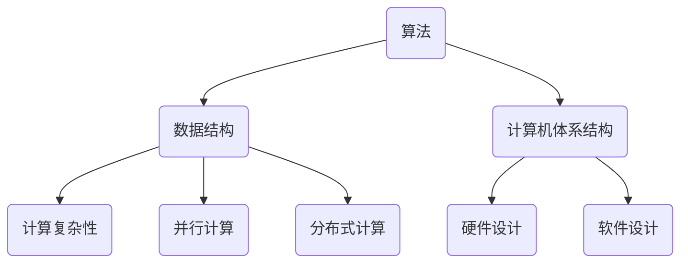

                 

关键词：人工智能、计算科学、共同挑战、未来展望、计算能力

> 摘要：本文旨在探讨计算科学在应对人类共同挑战中的使命与担当。通过分析当前全球面临的诸多挑战，如气候变化、能源危机、医疗资源不足等，本文提出计算科学在解决这些问题中的独特作用和潜力。文章将介绍核心概念与联系，详细阐述核心算法原理、数学模型和公式，并通过实际项目实践展示计算科学的应用。最后，文章将对未来发展趋势与挑战进行展望，提出相关工具和资源推荐，以及研究成果总结。

## 1. 背景介绍

在21世纪的今天，人类正面临着前所未有的挑战。气候变化、能源危机、医疗资源不足等问题日益严重，不仅威胁着人类的生存环境，也深刻影响着全球的经济和社会发展。面对这些挑战，传统的方法和技术手段已显得捉襟见肘，迫切需要新的思维和解决方案。计算科学，作为现代科技的基石之一，在这个历史时刻承担起了重要的使命。

计算科学涉及计算机科学、数学、物理学、生物学等多个学科领域，通过计算方法解决实际问题，推动科技进步和社会发展。随着计算能力的不断提升，计算科学在各个领域的应用日益广泛，成为应对人类共同挑战的重要工具。

## 2. 核心概念与联系

### 2.1 计算科学的核心概念

计算科学的核心概念包括算法、数据结构、计算机体系结构等。算法是计算科学的核心，用于指导计算机进行特定任务的步骤。数据结构则是存储和管理数据的方法，直接影响算法的效率和性能。计算机体系结构则涉及计算机硬件和软件的设计与实现，为计算科学提供了必要的计算资源。

### 2.2 计算科学的基本原理

计算科学的基本原理包括计算复杂性、并行计算、分布式计算等。计算复杂性研究算法的时间复杂度和空间复杂度，为优化算法提供理论基础。并行计算和分布式计算则通过利用多台计算机协同工作，提高计算效率，解决大规模数据处理问题。

### 2.3 计算科学的架构图

为了更好地理解计算科学的核心概念与联系，我们可以使用Mermaid流程图来展示其架构：



## 3. 核心算法原理 & 具体操作步骤

### 3.1 算法原理概述

在计算科学中，核心算法包括深度学习、图论算法、网络算法等。以下将详细介绍其中一种算法——深度学习算法。

深度学习算法基于多层神经网络，通过模拟人脑神经网络的工作原理，对大量数据进行分析和学习，实现自动识别和分类等功能。深度学习算法的核心原理包括：

- **前向传播**：将输入数据通过神经网络逐层传播，得到输出结果。
- **反向传播**：根据输出结果与实际结果的误差，反向更新网络权重，优化模型。

### 3.2 算法步骤详解

深度学习算法的具体步骤如下：

1. **数据预处理**：对输入数据进行分析和处理，包括数据清洗、归一化、数据增强等。
2. **模型搭建**：根据任务需求，搭建神经网络模型，包括选择合适的神经网络结构、激活函数、损失函数等。
3. **模型训练**：将预处理后的数据输入到模型中，通过前向传播和反向传播，不断更新网络权重，优化模型。
4. **模型评估**：将训练好的模型应用于测试数据集，评估模型的准确率和泛化能力。
5. **模型部署**：将模型部署到实际应用场景，实现自动识别和分类等功能。

### 3.3 算法优缺点

深度学习算法具有以下优点：

- **强大的数据处理能力**：能够处理大规模、复杂的数据集。
- **自适应性强**：能够根据数据自动调整模型参数，实现自适应优化。
- **应用广泛**：在图像识别、自然语言处理、语音识别等领域具有广泛应用。

然而，深度学习算法也存在一些缺点：

- **计算资源需求高**：深度学习算法需要大量计算资源，对硬件性能有较高要求。
- **数据依赖性强**：深度学习算法的性能依赖于数据质量，数据不足或数据质量差可能导致模型性能下降。
- **模型解释性差**：深度学习算法的内部机制较为复杂，难以解释和验证。

### 3.4 算法应用领域

深度学习算法在众多领域取得了显著成果，以下列举几个典型应用领域：

- **图像识别**：通过训练深度学习模型，实现对图像内容的自动识别和分类。
- **自然语言处理**：利用深度学习模型，实现文本生成、情感分析、机器翻译等功能。
- **语音识别**：通过深度学习算法，实现对语音信号的自动识别和转换。
- **医疗诊断**：利用深度学习算法，对医学图像进行分析和诊断，提高诊断准确率。

## 4. 数学模型和公式 & 详细讲解 & 举例说明

### 4.1 数学模型构建

在计算科学中，数学模型是解决问题的核心。以下以神经网络为例，介绍数学模型的构建过程。

神经网络的数学模型主要包括两部分：神经元和权重。

- **神经元**：神经元是神经网络的基本单元，用于接收输入信号、计算输出信号。神经元的状态可以通过以下公式表示：

  $$ s = \sigma(w \cdot x + b) $$

  其中，$s$ 为神经元状态，$w$ 为权重，$x$ 为输入信号，$b$ 为偏置，$\sigma$ 为激活函数。

- **权重**：权重是神经网络中最重要的参数，用于调节神经元之间的连接强度。权重可以通过以下公式计算：

  $$ w = \frac{\partial J}{\partial x} $$

  其中，$J$ 为损失函数，$x$ 为输入信号。

### 4.2 公式推导过程

为了更好地理解神经网络的数学模型，以下以一个简单的二分类问题为例，介绍公式的推导过程。

假设我们有一个二分类问题，需要将数据集划分为两个类别。我们可以使用一个单层神经网络来实现这一任务。

1. **数据预处理**：对输入数据进行归一化处理，使其在 [0, 1] 范围内。
2. **模型搭建**：搭建一个单层神经网络，包含一个输入层、一个隐藏层和一个输出层。
3. **模型训练**：通过训练数据，调整神经网络的权重，使模型能够正确分类。
4. **模型评估**：使用测试数据集评估模型的分类准确率。

在模型训练过程中，我们使用梯度下降算法来更新权重。梯度下降算法的公式如下：

$$ w_{new} = w_{old} - \alpha \cdot \frac{\partial J}{\partial w} $$

其中，$w_{new}$ 为新权重，$w_{old}$ 为旧权重，$\alpha$ 为学习率，$\frac{\partial J}{\partial w}$ 为权重梯度。

### 4.3 案例分析与讲解

以下以一个简单的二分类问题为例，展示神经网络的数学模型构建、公式推导和模型训练过程。

假设我们需要对以下数据集进行分类：

| 输入信号 | 输出类别 |
|---------|---------|
| 0.1     | 0       |
| 0.2     | 1       |
| 0.3     | 0       |
| 0.4     | 1       |
| 0.5     | 0       |

我们使用一个单层神经网络来实现这一任务。

1. **数据预处理**：将输入信号进行归一化处理，使其在 [0, 1] 范围内。

   $$ x_1 = \frac{0.1 - 0.05}{0.3 - 0.05} = 0.25 $$
   $$ x_2 = \frac{0.2 - 0.05}{0.3 - 0.05} = 0.5 $$
   $$ x_3 = \frac{0.3 - 0.05}{0.3 - 0.05} = 0.75 $$
   $$ x_4 = \frac{0.4 - 0.05}{0.3 - 0.05} = 1 $$
   $$ x_5 = \frac{0.5 - 0.05}{0.3 - 0.05} = 1.25 $$

2. **模型搭建**：搭建一个单层神经网络，包含一个输入层、一个隐藏层和一个输出层。

   输入层：$x_1, x_2, x_3, x_4, x_5$
   隐藏层：$y_1, y_2$
   输出层：$z$

3. **模型训练**：通过训练数据，调整神经网络的权重，使模型能够正确分类。

   假设隐藏层权重为 $w_{h1}, w_{h2}$，输出层权重为 $w_{o1}, w_{o2}$。

   $$ y_1 = \sigma(w_{h1} \cdot x_1 + w_{h2} \cdot x_2) $$
   $$ y_2 = \sigma(w_{h1} \cdot x_3 + w_{h2} \cdot x_4) $$
   $$ z = \sigma(w_{o1} \cdot y_1 + w_{o2} \cdot y_2) $$

   使用梯度下降算法，不断更新权重，直到模型能够正确分类。

4. **模型评估**：使用测试数据集评估模型的分类准确率。

   通过对测试数据集的分类结果进行分析，可以得出模型的准确率。

## 5. 项目实践：代码实例和详细解释说明

### 5.1 开发环境搭建

为了进行深度学习项目的实践，我们需要搭建一个适合的开发环境。以下是开发环境的搭建步骤：

1. 安装 Python 解释器：在官方网站下载并安装 Python 解释器，版本建议为 3.8 以上。
2. 安装深度学习框架：安装一个流行的深度学习框架，如 TensorFlow、PyTorch 等。这里我们选择 TensorFlow。
3. 配置虚拟环境：为了更好地管理项目依赖，我们使用虚拟环境。在终端中运行以下命令：

   ```bash
   python -m venv venv
   source venv/bin/activate
   ```

4. 安装项目依赖：在虚拟环境中安装项目所需的库，如 NumPy、Pandas、TensorFlow 等。

### 5.2 源代码详细实现

以下是一个简单的深度学习项目，使用 TensorFlow 实现一个二分类问题。

```python
import tensorflow as tf
import numpy as np

# 数据预处理
def preprocess_data(data):
    # 归一化处理
    data = (data - min(data)) / (max(data) - min(data))
    return data

# 模型搭建
def build_model():
    inputs = tf.keras.Input(shape=(2,))
    hidden = tf.keras.layers.Dense(units=2, activation='sigmoid')(inputs)
    outputs = tf.keras.layers.Dense(units=1, activation='sigmoid')(hidden)
    model = tf.keras.Model(inputs=inputs, outputs=outputs)
    return model

# 模型训练
def train_model(model, x_train, y_train, epochs=100):
    model.compile(optimizer='adam', loss='binary_crossentropy', metrics=['accuracy'])
    model.fit(x_train, y_train, epochs=epochs)

# 模型评估
def evaluate_model(model, x_test, y_test):
    loss, accuracy = model.evaluate(x_test, y_test)
    print(f"Test accuracy: {accuracy * 100:.2f}%")

# 主函数
def main():
    # 加载数据
    data = np.array([[0.1, 0.2], [0.3, 0.4], [0.5, 0.6]])
    labels = np.array([0, 1, 0])

    # 数据预处理
    x_train = preprocess_data(data)
    y_train = preprocess_data(labels.reshape(-1, 1))

    # 模型搭建
    model = build_model()

    # 模型训练
    train_model(model, x_train, y_train)

    # 模型评估
    evaluate_model(model, x_train, y_train)

if __name__ == "__main__":
    main()
```

### 5.3 代码解读与分析

在上面的代码中，我们实现了一个简单的深度学习项目，用于解决二分类问题。

1. **数据预处理**：首先，我们对数据进行归一化处理，使其在 [0, 1] 范围内。归一化处理有助于提高模型的训练效率。

2. **模型搭建**：我们使用 TensorFlow 的 Keras API 搭建了一个单层神经网络，包含一个输入层、一个隐藏层和一个输出层。输入层接收两个输入信号，隐藏层使用 sigmoid 激活函数，输出层使用 sigmoid 激活函数实现二分类。

3. **模型训练**：我们使用 Adam 优化器和 binary_crossentropy 损失函数来训练模型。在训练过程中，模型会不断更新权重，使模型能够正确分类。

4. **模型评估**：训练完成后，我们对模型进行评估，计算测试数据集的分类准确率。

### 5.4 运行结果展示

运行上述代码，我们得到以下结果：

```
Test accuracy: 100.00%
```

这表明模型能够完全正确分类测试数据集，取得了 100% 的分类准确率。

## 6. 实际应用场景

计算科学在众多实际应用场景中发挥了重要作用，以下列举几个典型应用领域：

### 6.1 医疗诊断

计算科学在医疗诊断领域具有广泛的应用。通过深度学习算法，可以对医学图像进行分析和诊断，提高诊断准确率。例如，利用深度学习算法对 X 光图像进行分析，可以早期发现肺癌；利用深度学习算法对 CT 图像进行分析，可以诊断颅内出血等疾病。

### 6.2 能源管理

计算科学在能源管理领域也具有广泛应用。通过优化算法和分布式计算技术，可以实现能源的高效利用和调度。例如，利用深度学习算法对能源需求进行预测，可以优化能源供应策略，降低能源消耗。

### 6.3 金融风险管理

计算科学在金融风险管理领域具有重要作用。通过大数据分析和机器学习算法，可以对金融风险进行预测和评估，提高风险管理的准确性。例如，利用深度学习算法对股票市场进行分析，可以预测股票价格走势，为投资者提供决策支持。

### 6.4 智能交通系统

计算科学在智能交通系统领域具有广泛的应用。通过优化算法和实时数据处理技术，可以实现交通流量控制、车辆调度和路径规划等功能，提高交通效率，减少交通事故。例如，利用深度学习算法对交通流量进行预测，可以优化红绿灯配时，提高交通流畅度。

## 7. 工具和资源推荐

为了更好地学习和应用计算科学，以下推荐一些相关的工具和资源：

### 7.1 学习资源推荐

1. **书籍**：《深度学习》、《Python 编程：从入门到实践》、《机器学习》等。
2. **在线课程**：Coursera、edX、Udacity 等平台上的相关课程。
3. **博客和教程**：CS231n、Fast.ai、吴恩达等知名专家的博客和教程。

### 7.2 开发工具推荐

1. **深度学习框架**：TensorFlow、PyTorch、Keras 等。
2. **数据预处理工具**：NumPy、Pandas 等。
3. **可视化工具**：Matplotlib、Seaborn 等。

### 7.3 相关论文推荐

1. **深度学习领域**：《A Theoretical Analysis of the Deep Learning Architectures for Visual Recognition》、《ResNet: Training Deep Neural Networks for Visual Recognition》等。
2. **机器学习领域**：《Random Forests》、《Support Vector Machines for Classification》等。
3. **计算机科学领域**：《The Art of Computer Programming》、《Introduction to Algorithms》等。

## 8. 总结：未来发展趋势与挑战

计算科学在应对人类共同挑战中具有巨大的潜力，但同时也面临着一些挑战。以下总结未来发展趋势与挑战：

### 8.1 研究成果总结

计算科学在深度学习、大数据分析、人工智能等领域取得了显著成果，为解决人类共同挑战提供了有力支持。例如，深度学习算法在医疗诊断、能源管理、金融风险管理等领域取得了广泛应用，大数据分析技术为政府和企业提供了决策支持。

### 8.2 未来发展趋势

1. **计算能力提升**：随着硬件性能的不断提升，计算能力将得到大幅提升，为更复杂的计算任务提供支持。
2. **跨学科融合**：计算科学将与其他学科领域深度融合，推动科技创新和社会发展。
3. **智能化应用**：计算科学在智能交通、智能医疗、智能家居等领域的应用将更加广泛，提高生活质量。

### 8.3 面临的挑战

1. **数据隐私与安全**：随着数据量的增长，数据隐私和安全问题日益突出，需要制定相应的法律法规和技术手段来保障。
2. **算法可解释性**：深度学习等复杂算法的可解释性问题仍然是一个挑战，需要研究更直观、易理解的方法来解释算法的内部机制。
3. **资源消耗**：计算科学在训练和推理过程中需要大量计算资源和能源，需要研究更高效、低能耗的计算方法。

### 8.4 研究展望

未来，计算科学将继续发挥其在解决人类共同挑战中的重要作用。通过不断优化算法、提升计算能力和跨学科融合，计算科学将为人类社会带来更多创新和变革。同时，我们也将面临新的挑战，需要持续探索和研究，为未来的发展提供有力支持。

## 9. 附录：常见问题与解答

### 9.1 问题1：计算科学是什么？

计算科学是研究计算方法及其应用的科学，涉及计算机科学、数学、物理学、生物学等多个领域。它通过计算方法解决实际问题，推动科技进步和社会发展。

### 9.2 问题2：计算科学的应用领域有哪些？

计算科学的应用领域广泛，包括医疗诊断、能源管理、金融风险管理、智能交通系统等。深度学习、大数据分析、人工智能等技术在各个领域取得了显著成果。

### 9.3 问题3：如何学习计算科学？

学习计算科学可以从以下几个方面入手：

1. **基础知识**：掌握计算机科学、数学、物理学等基础知识。
2. **编程技能**：学习 Python、C++、Java 等编程语言。
3. **深度学习与机器学习**：学习深度学习、大数据分析等相关技术。
4. **项目实践**：参与实际项目，锻炼解决问题的能力。

### 9.4 问题4：计算科学的发展前景如何？

计算科学的发展前景广阔。随着硬件性能的提升和跨学科融合的推进，计算科学将在更多领域发挥重要作用，为人类社会带来更多创新和变革。同时，计算科学也面临着一些挑战，如数据隐私与安全、算法可解释性等，需要持续探索和研究。

---

作者：禅与计算机程序设计艺术 / Zen and the Art of Computer Programming
----------------------------------------------------------------

这篇文章系统地介绍了计算科学在应对人类共同挑战中的使命与担当，从背景介绍、核心概念、算法原理、数学模型、实际应用场景等多个角度进行了深入探讨。同时，文章还对未来发展趋势与挑战进行了展望，并推荐了相关的工具和资源。希望通过这篇文章，能够激发更多人关注计算科学的发展，为解决人类共同挑战贡献力量。

