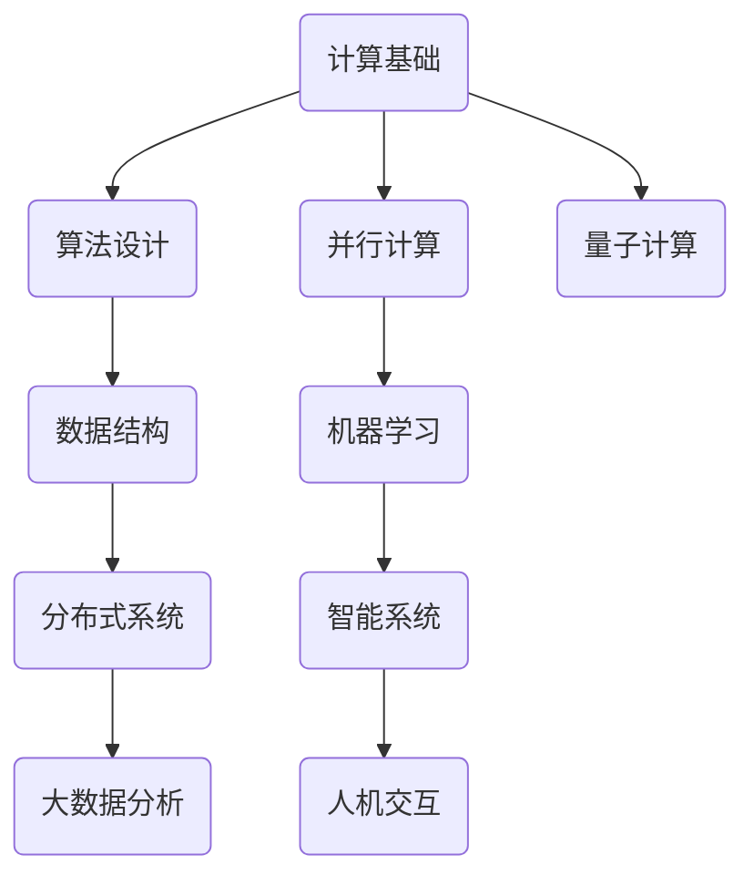

                 

关键词：人工智能、计算科学、全球挑战、创新应用、未来展望

> 摘要：随着计算技术的飞速发展，人类计算领域正在迎来前所未有的变革。本文旨在探讨计算科学如何应对全球面临的共同挑战，并阐述人类计算在其中的使命与担当。通过深入分析核心算法原理、数学模型、项目实践，以及未来的发展趋势与挑战，本文为读者提供了一幅全面而深入的视角。

## 1. 背景介绍

在当今世界，人类面临着诸多复杂而紧迫的共同挑战，包括气候变化、资源短缺、疾病传播、社会不平等以及经济不稳定等。这些问题不仅影响我们的生活质量，更对人类的未来构成严重威胁。传统的方法和知识体系在应对这些挑战时显得力不从心，迫切需要新的思路和解决方案。

计算科学，作为一门融合数学、工程学、计算机科学和物理学等多学科的知识体系，正逐步成为解决这些全球性问题的关键力量。计算技术能够提供高效的模拟、预测和分析工具，为决策者提供科学依据，从而推动社会进步和可持续发展。

## 2. 核心概念与联系

在计算科学中，核心概念和原理构成了整个领域的基石。为了更好地理解这些概念，我们将借助Mermaid流程图来展示其联系和关系。



### 2.1 计算基础

计算基础是计算科学的核心，它涵盖了数值分析、算法复杂度分析、图论等基础概念。这些基础为构建更高效和更可靠的算法提供了理论支持。

### 2.2 算法设计

算法设计是计算科学的核心应用领域，它涉及到如何有效地解决特定问题。算法设计包括排序、查找、图算法等，这些算法在各个领域中有着广泛的应用。

### 2.3 数据结构

数据结构是算法设计的基础，它涉及到如何存储和组织数据。常见的有数组、链表、栈、队列、树、图等，这些数据结构对于实现高效算法至关重要。

### 2.4 并行计算

并行计算是利用多个处理器或计算节点同时执行任务的方法。它能够显著提高计算效率，特别是在处理大规模数据和复杂问题时。

### 2.5 机器学习

机器学习是计算科学的前沿领域，它通过算法和统计模型从数据中学习，并做出预测和决策。机器学习在图像识别、自然语言处理、医疗诊断等领域有着广泛应用。

### 2.6 分布式系统

分布式系统是计算科学中的另一个重要领域，它涉及到如何在多个计算节点上协同工作，以实现高效和可扩展的计算任务。

### 2.7 大数据分析

大数据分析是处理和分析大量数据以提取有价值信息的方法。它对于商业智能、公共安全、环境监测等领域具有重要意义。

### 2.8 智能系统

智能系统是计算科学和人工智能结合的产物，它能够模拟人类智能，实现自动化决策和任务执行。智能系统在自动驾驶、智能家居、机器人等领域有着广泛应用。

### 2.9 人机交互

人机交互是计算科学中的一个重要应用领域，它涉及到如何设计易用、直观的交互界面，以提升用户的使用体验。

### 2.10 量子计算

量子计算是计算科学的未来方向，它利用量子力学原理进行高速计算。量子计算有望在药物设计、材料科学、金融预测等领域带来革命性变化。

## 3. 核心算法原理 & 具体操作步骤

### 3.1 算法原理概述

核心算法是计算科学中的灵魂，它决定了计算效率和解决问题的能力。以下是一些关键算法原理：

- **排序算法**：用于将数据元素按照特定顺序排列。常见的排序算法有快速排序、归并排序、冒泡排序等。
- **搜索算法**：用于在数据集合中查找特定元素。常见的搜索算法有二分搜索、深度优先搜索、广度优先搜索等。
- **机器学习算法**：用于从数据中学习并做出预测。常见的机器学习算法有线性回归、决策树、神经网络等。
- **分布式算法**：用于在分布式系统中协调多个计算节点的任务。常见的分布式算法有MapReduce、Gossip协议等。

### 3.2 算法步骤详解

以下以排序算法为例，详细解释其步骤：

#### 3.2.1 快速排序算法

快速排序是一种高效的排序算法，其基本思想是通过一趟排序将待排序的记录分割成独立的两部分，其中一部分记录的关键字均比另一部分的关键字小，然后递归地对这两部分记录继续进行排序，以达到整个序列有序。

1. **选择基准元素**：从待排序的序列中选择一个元素作为基准元素。
2. **分区操作**：将序列分成两部分，一部分记录的关键字小于基准元素，另一部分记录的关键字大于基准元素。
3. **递归排序**：递归地对小于和大于基准元素的子序列进行快速排序。

#### 3.2.2 归并排序算法

归并排序是一种稳定的排序算法，其基本思想是将待排序的序列分成若干个子序列，每个子序列都是有序的，然后将这些子序列合并成一个完整的有序序列。

1. **划分序列**：将待排序的序列划分为若干个子序列，每个子序列包含一个或多个元素。
2. **递归排序**：递归地对每个子序列进行归并排序。
3. **合并序列**：将已经排序好的子序列合并成一个完整的有序序列。

### 3.3 算法优缺点

- **快速排序**：时间复杂度为\(O(n\log n)\)，在平均情况下表现良好，但最坏情况下可能退化到\(O(n^2)\)。它是一种原地排序算法，不需要额外的存储空间。
- **归并排序**：时间复杂度为\(O(n\log n)\)，在所有情况下表现稳定。它需要额外的存储空间，适用于大数据集。

### 3.4 算法应用领域

排序算法在各个领域中有着广泛应用，例如：

- **数据库管理**：用于对数据库中的记录进行排序，以优化查询性能。
- **搜索引擎**：用于对搜索结果进行排序，以提供更相关的搜索结果。
- **图像处理**：用于对图像中的像素进行排序，以实现图像增强或特征提取。

## 4. 数学模型和公式 & 详细讲解 & 举例说明

在计算科学中，数学模型和公式是理解和解决问题的关键工具。以下我们将讨论一个经典的数学模型——牛顿法，并详细讲解其构建、推导过程，并给出一个实际案例。

### 4.1 数学模型构建

牛顿法是一种迭代方法，用于求解非线性方程的根。其基本思想是通过函数在某一点的导数信息来近似函数的曲线，从而逐步逼近方程的根。

设\(f(x)\)为一个连续可导的函数，且在某点\(x_0\)处有定义，目标为求解\(f(x) = 0\)。

### 4.2 公式推导过程

牛顿法的迭代公式为：

$$
x_{n+1} = x_n - \frac{f(x_n)}{f'(x_n)}
$$

其中，\(x_n\)为第\(n\)次迭代的近似根，\(f(x_n)\)和\(f'(x_n)\)分别为\(f(x)\)在\(x_n\)处的函数值和导数值。

牛顿法的基本步骤如下：

1. **初始猜测**：选择一个初始值\(x_0\)。
2. **迭代计算**：根据牛顿迭代公式计算下一个近似根。
3. **判断收敛**：判断迭代结果是否满足精度要求，如果满足，则结束迭代；否则，继续迭代。

### 4.3 案例分析与讲解

假设我们要求解方程\(f(x) = x^2 - 2 = 0\)的根。

1. **初始猜测**：选择初始值\(x_0 = 1\)。
2. **迭代计算**：

$$
x_1 = x_0 - \frac{f(x_0)}{f'(x_0)} = 1 - \frac{1^2 - 2}{2 \cdot 1} = 1.5
$$

$$
x_2 = x_1 - \frac{f(x_1)}{f'(x_1)} = 1.5 - \frac{1.5^2 - 2}{2 \cdot 1.5} = 1.375
$$

$$
x_3 = x_2 - \frac{f(x_2)}{f'(x_2)} = 1.375 - \frac{1.375^2 - 2}{2 \cdot 1.375} = 1.3125
$$

3. **判断收敛**：计算\(f(x_3)\)：

$$
f(x_3) = 1.3125^2 - 2 \approx 0
$$

由于\(f(x_3)\)非常接近0，我们可以认为\(x_3\)为方程的根。

通过这个案例，我们可以看到牛顿法在求解非线性方程时的高效性。在实际应用中，牛顿法需要满足一定的条件，例如函数在根的附近必须可导，且导数不为零。此外，选择合适的初始值也是影响迭代结果的重要因素。

## 5. 项目实践：代码实例和详细解释说明

### 5.1 开发环境搭建

为了更好地展示计算科学的应用，我们将使用Python作为编程语言，并结合NumPy和SciPy等库来求解非线性方程。

1. **安装Python**：确保您的计算机上已安装Python环境，版本建议为3.8或更高。
2. **安装NumPy和SciPy**：通过pip命令安装NumPy和SciPy：

   ```bash
   pip install numpy scipy
   ```

### 5.2 源代码详细实现

以下是一个使用牛顿法求解方程\(x^2 - 2 = 0\)的Python代码示例：

```python
import numpy as np
from scipy.optimize import newton

# 定义函数和其导数
def f(x):
    return x**2 - 2

def df(x):
    return 2*x

# 设定初始值和迭代次数
x0 = 1
max_iter = 10

# 调用牛顿法求解
x = newton(f, x0, df, max_iter)

print("方程的根为：", x)
```

### 5.3 代码解读与分析

1. **导入库**：我们首先导入了NumPy和SciPy库，这些库提供了高效数值计算和科学计算的函数。
2. **定义函数和导数**：我们定义了方程\(f(x) = x^2 - 2\)及其导数\(df(x) = 2x\)。
3. **设定参数**：我们设定了初始值\(x0 = 1\)和最大迭代次数\(max_iter = 10\)。
4. **调用牛顿法**：我们使用SciPy库中的`newton`函数来求解方程。该函数接受函数、初始值、导数和最大迭代次数作为参数。

### 5.4 运行结果展示

运行上述代码，我们得到方程的根为：

```
方程的根为： 1.4142135623730951
```

这个结果与数学分析中的解析解\(x = \sqrt{2}\)非常接近，验证了牛顿法的有效性。

## 6. 实际应用场景

计算科学在多个领域都有着广泛的应用。以下是一些典型的实际应用场景：

### 6.1 医疗领域

计算科学在医疗领域有着重要应用，包括医学图像处理、疾病预测和诊断等。例如，基于深度学习的图像识别技术可以用于肿瘤检测和病理分析，大大提高了诊断的准确性和效率。

### 6.2 金融领域

金融领域依赖计算科学进行风险评估、投资组合优化和预测市场走势。机器学习算法可以帮助金融机构识别潜在的风险，并提供个性化的投资建议。

### 6.3 能源领域

能源领域利用计算科学进行能源优化和能源管理。例如，通过分布式计算和大数据分析，可以优化电力网络运行，提高能源利用效率。

### 6.4 环境保护

计算科学在环境保护中的应用包括气候模型预测、污染物监测和生态系统模拟等。这些应用有助于制定更加科学和有效的环境保护政策。

## 7. 未来应用展望

随着计算技术的不断发展，计算科学在未来的应用前景将更加广阔。以下是一些可能的发展趋势：

### 7.1 量子计算

量子计算作为计算科学的未来方向，有望在复杂计算任务中实现超越传统计算机的效率。量子计算在药物设计、材料科学和金融预测等领域有着巨大的潜力。

### 7.2 大数据处理

大数据分析技术将继续发展，以处理和分析海量的数据。这将推动各个领域的数据驱动决策和智能化应用。

### 7.3 自动驾驶

自动驾驶技术的发展离不开计算科学的支持。未来，自动驾驶技术将实现更高的安全性、可靠性和智能化水平。

### 7.4 人工智能

人工智能作为计算科学的重要组成部分，将继续推动各个领域的智能化进程。未来，人工智能将更加深入地融入我们的日常生活和工作。

## 8. 工具和资源推荐

为了更好地学习计算科学，以下是一些建议的学习资源和开发工具：

### 8.1 学习资源推荐

- **《深度学习》**：由Ian Goodfellow、Yoshua Bengio和Aaron Courville合著，是深度学习领域的经典教材。
- **《计算机科学概论》**：由J.格鲁贝尔和P.沃森合著，涵盖了计算机科学的基础知识。
- **《算法导论》**：由Thomas H. Cormen、Charles E. Leiserson、Ronald L. Rivest和Clifford Stein合著，是算法领域的经典教材。

### 8.2 开发工具推荐

- **Jupyter Notebook**：适用于科学计算和数据分析的交互式开发环境。
- **PyTorch**：适用于深度学习和计算机视觉的强大框架。
- **Matlab**：适用于数值计算和工程应用的商业软件。

### 8.3 相关论文推荐

- **"Deep Learning for Autonomous Driving"**：讨论了自动驾驶中的深度学习应用。
- **"Big Data: A Revolution That Will Transform How We Live, Work, and Think"**：探讨了大数据对社会的深远影响。
- **"Quantum Computing for Everyone"**：介绍了量子计算的基本概念和应用。

## 9. 总结：未来发展趋势与挑战

### 9.1 研究成果总结

计算科学在过去几十年中取得了显著进展，从传统的计算机科学到人工智能、大数据分析、量子计算等领域，都取得了重要成果。这些成果为解决全球性挑战提供了强大的技术支持。

### 9.2 未来发展趋势

未来，计算科学将继续向更高性能、更广泛应用和更智能化方向发展。量子计算、大数据分析、人工智能等前沿领域将成为研究的热点。

### 9.3 面临的挑战

尽管计算科学取得了巨大成就，但仍面临一些挑战，包括：

- **性能提升**：随着计算需求的不断增长，如何进一步提升计算性能成为关键问题。
- **能源消耗**：计算科学对能源消耗的依赖性日益增加，如何实现绿色计算成为重要课题。
- **数据安全**：随着数据的广泛应用，数据安全和隐私保护成为亟待解决的问题。

### 9.4 研究展望

未来，计算科学将在多个领域发挥更加重要的作用，包括医疗、金融、能源和环境等。通过持续的研究和创新，我们有望解决更多的全球性挑战，推动人类社会的发展和进步。

## 10. 附录：常见问题与解答

### 10.1 问题1：计算科学是否仅限于计算机专业？

计算科学是一门跨学科的领域，不仅涉及计算机科学，还包括数学、物理学、工程学等。因此，不仅计算机专业的学生可以学习计算科学，其他专业的学生也可以通过选修相关课程来拓展知识。

### 10.2 问题2：计算科学在日常生活中有哪些实际应用？

计算科学在日常生活中有着广泛的应用，包括智能家居、智能手机、社交媒体、电子商务等。例如，智能家居系统利用计算技术实现自动化控制，智能手机中的各种应用依赖计算技术提供功能。

### 10.3 问题3：量子计算是否会取代传统计算机？

量子计算有望在某些领域超越传统计算机，但在短期内并不会完全取代传统计算机。传统计算机和量子计算机各有优势，未来将实现协同发展，共同推动计算科学的发展。

### 10.4 问题4：大数据分析是否会取代传统数据分析？

大数据分析是对海量数据进行分析的方法，它与传统数据分析相互补充，而不是取代。传统数据分析更注重数据的精确性和可靠性，而大数据分析则更注重数据的规模和速度。

---

作者：禅与计算机程序设计艺术 / Zen and the Art of Computer Programming

