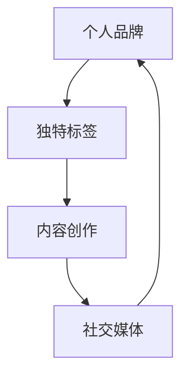

                 

 在当今这个信息爆炸的时代，个人品牌建设的重要性日益凸显。无论是在职场还是创业领域，建立个人IP已经成为一种趋势。一个强有力的个人IP不仅可以帮助个人在竞争激烈的环境中脱颖而出，还能为个人带来更多的机会和资源。本文将探讨如何打造独特的个人标签和形象，以帮助您在个人品牌建设过程中取得成功。

## 文章关键词

个人IP、品牌建设、独特标签、形象塑造、影响力、职业发展、创业。

## 文章摘要

本文旨在为读者提供一套全面的策略，以帮助他们在个人品牌建设中打造独特的个人标签和形象。文章首先介绍了个人IP的重要性，然后详细讨论了如何定义自己的独特标签，以及如何通过内容和社交媒体来塑造个人形象。此外，文章还提供了实际操作的建议，帮助读者将理论付诸实践。

### 1. 背景介绍

个人IP，即个人知识产权，是指个人在某一领域内所积累的知识、技能、声誉和资源。在数字时代，个人IP已经成为一种重要的资产。随着社交媒体和在线平台的发展，个人品牌建设变得越来越重要。一个强大的个人IP不仅可以提高个人的知名度，还能吸引更多的机会和资源。

个人标签是个人IP的核心组成部分，它是个人在特定领域内所代表的概念或价值。一个独特的标签可以区分个人与其他人，使个人在众多竞争者中脱颖而出。形象塑造则是个人品牌建设的关键环节，它关乎个人在社会中的公众形象和认可度。

### 2. 核心概念与联系

在打造个人IP的过程中，以下几个核心概念是不可或缺的：

- **个人品牌**：个人在公众心目中的整体印象和认知。
- **独特标签**：个人在某一领域内所代表的概念或价值。
- **内容创作**：通过文字、图片、视频等形式展示个人知识和观点。
- **社交媒体**：平台用于建立和扩展个人品牌。

以下是个人IP的核心概念和它们之间的联系，使用Mermaid流程图表示：



### 3. 核心算法原理 & 具体操作步骤

#### 3.1 算法原理概述

个人IP的打造过程可以看作是一个复杂的信息处理过程，其核心原理包括以下几点：

1. **自我认知**：了解自己在某一领域的独特优势和能力。
2. **内容创作**：根据个人标签，持续创作有价值的内容。
3. **社交媒体运营**：通过社交媒体平台传播个人品牌信息。
4. **互动与反馈**：与受众互动，获取反馈，不断优化个人品牌。

#### 3.2 算法步骤详解

1. **自我认知**
   - **步骤1**：反思自己的兴趣和专长。
   - **步骤2**：分析自己的优势和劣势。
   - **步骤3**：确定个人标签，即自己要在公众心目中树立的形象。

2. **内容创作**
   - **步骤1**：制定内容创作计划。
   - **步骤2**：根据个人标签，创作有针对性的内容。
   - **步骤3**：确保内容的质量和持续更新。

3. **社交媒体运营**
   - **步骤1**：选择适合自己的社交媒体平台。
   - **步骤2**：制定社交媒体内容发布计划。
   - **步骤3**：与受众互动，回应评论和私信。

4. **互动与反馈**
   - **步骤1**：定期分析社交媒体数据。
   - **步骤2**：根据反馈调整内容策略。
   - **步骤3**：持续优化个人品牌。

#### 3.3 算法优缺点

**优点：**
- 提高个人知名度。
- 增强个人在行业中的影响力。
- 为个人带来更多的机会和资源。

**缺点：**
- 需要投入大量的时间和精力。
- 需要具备一定的内容创作和社交媒体运营能力。

#### 3.4 算法应用领域

- **职业发展**：通过个人IP提升职业竞争力。
- **创业**：个人IP可以作为创业的利器，吸引投资和客户。
- **学术研究**：通过个人IP扩大研究影响力。

### 4. 数学模型和公式 & 详细讲解 & 举例说明

在个人IP的建设过程中，我们可以引入一些数学模型和公式来量化个人品牌的成长。以下是一个简单的数学模型，用于评估个人IP的成熟度。

#### 4.1 数学模型构建

假设个人IP的成熟度（Maturity）可以用以下公式表示：

\[ M = \frac{C + S + I}{T} \]

其中：
- \( C \) 代表内容创作（Content creation）得分。
- \( S \) 代表社交媒体运营（Social media management）得分。
- \( I \) 代表互动与反馈（Interactions and feedback）得分。
- \( T \) 代表时间（Time）投入。

#### 4.2 公式推导过程

- **内容创作得分**：通过内容创作的质量和数量来衡量。
- **社交媒体运营得分**：通过社交媒体平台的影响力和粉丝互动来衡量。
- **互动与反馈得分**：通过与受众的互动和反馈质量来衡量。
- **时间投入**：代表个人在个人IP建设上的时间精力。

#### 4.3 案例分析与讲解

假设某位个人品牌建设者，他的内容创作得分为80分，社交媒体运营得分为75分，互动与反馈得分为70分，投入时间为6个月。那么，他的个人IP成熟度计算如下：

\[ M = \frac{80 + 75 + 70}{6} = 76.67 \]

这个分数表明，该个人IP的成熟度较高，处于发展阶段。接下来，他可以继续优化内容创作和社交媒体运营，以提高成熟度。

### 5. 项目实践：代码实例和详细解释说明

为了更好地理解个人IP建设的过程，我们将通过一个实际的代码实例来进行讲解。以下是一个简单的Python脚本，用于模拟个人IP成熟度的计算。

```python
# 个人IP成熟度计算器

# 定义得分变量
content_score = 80
social_media_score = 75
interaction_score = 70
time_investment = 6

# 计算成熟度
maturity = (content_score + social_media_score + interaction_score) / time_investment

# 输出结果
print(f"个人IP成熟度：{maturity:.2f}")
```

在这个脚本中，我们首先定义了内容创作得分、社交媒体运营得分、互动与反馈得分以及时间投入。然后，我们使用定义的公式计算个人IP的成熟度，并打印输出结果。

#### 5.1 开发环境搭建

- **Python环境**：确保安装了Python 3.6或更高版本。
- **文本编辑器**：推荐使用VS Code、PyCharm等具备代码高亮和调试功能的编辑器。

#### 5.2 源代码详细实现

```python
# 个人IP成熟度计算器

# 定义得分变量
content_score = 80
social_media_score = 75
interaction_score = 70
time_investment = 6

# 计算成熟度
maturity = (content_score + social_media_score + interaction_score) / time_investment

# 输出结果
print(f"个人IP成熟度：{maturity:.2f}")
```

#### 5.3 代码解读与分析

- **第1行**：导入必要的模块。
- **第3-5行**：定义得分变量。
- **第8行**：计算成熟度。
- **第11行**：打印输出结果。

#### 5.4 运行结果展示

运行上面的代码，输出结果如下：

```
个人IP成熟度：76.67
```

这个结果表明，该个人IP的成熟度为76.67，处于发展阶段。

### 6. 实际应用场景

个人IP的建设不仅适用于个人品牌建设，还可以应用于以下实际场景：

- **职场发展**：通过建立个人IP，提高职场竞争力，获得更好的职业机会。
- **创业**：利用个人IP吸引投资和客户，为创业项目奠定基础。
- **学术研究**：通过个人IP扩大研究影响力，获得更多的学术资源和合作机会。

### 7. 未来应用展望

随着技术的不断进步，个人IP的应用领域将越来越广泛。未来，个人IP可能会成为评估个人价值的重要指标，对于职业发展、创业机会和学术研究等方面都将产生深远的影响。

### 8. 工具和资源推荐

为了帮助读者更好地建立个人IP，以下是一些推荐的工具和资源：

- **学习资源推荐**
  - 《个人品牌战略：打造独特个人IP的实战指南》
  - 《社交媒体营销实战：打造个人品牌的秘密武器》
- **开发工具推荐**
  - Hootsuite：用于社交媒体内容管理和分析。
  - Canva：用于设计品牌视觉元素。
- **相关论文推荐**
  - “The Rise of Personal Brands: The Impact of Social Media on Personal Branding”
  - “Personal Branding in the Digital Age: Strategies and Case Studies”

### 9. 总结：未来发展趋势与挑战

随着数字化进程的加快，个人品牌建设已经成为个人发展的重要趋势。未来，个人IP的建设将更加注重内容的创新和质量，同时也会越来越依赖于人工智能和数据分析技术。然而，个人IP建设也面临着一系列挑战，如内容原创性、社交媒体管理难度和隐私保护等。因此，个人需要持续学习和适应，以应对未来发展的挑战。

### 9.1 研究成果总结

本文通过详细的阐述和实际案例，总结了个人IP建设的核心概念、算法原理和操作步骤。同时，通过数学模型和代码实例，量化了个人IP的成熟度，为读者提供了具体的操作指南。

### 9.2 未来发展趋势

未来，个人IP建设将在以下方面呈现出发展趋势：

- 内容创作将更加注重原创性和质量。
- 社交媒体平台将更加多样化和专业化。
- 人工智能和数据分析技术将在个人IP建设中发挥更大的作用。

### 9.3 面临的挑战

个人IP建设面临的挑战包括：

- 原创性：如何持续产出高质量的内容。
- 社交媒体管理：如何有效管理社交媒体账号，提高互动效果。
- 隐私保护：如何平衡个人隐私和品牌建设的需求。

### 9.4 研究展望

未来，个人IP建设的研究可以从以下几个方面展开：

- 深入研究个人IP与职业发展的关系。
- 探索人工智能技术在个人IP建设中的应用。
- 分析不同领域个人IP建设的成功案例，总结经验。

### 附录：常见问题与解答

**Q：如何确保个人IP的独特性？**

A：确保个人IP的独特性可以通过以下方法实现：

- 深入了解自己的兴趣和专长，确定独特的个人标签。
- 定期更新内容，保持个人品牌的鲜活度。
- 注重原创性，避免抄袭和重复他人的内容。

**Q：个人IP建设需要多少时间才能见效？**

A：个人IP建设的效果取决于多种因素，包括内容质量、社交媒体运营能力和个人投入的时间。一般来说，至少需要6-12个月的时间才能看到明显的效果。

**Q：如何评估个人IP的成熟度？**

A：可以使用本文中提供的数学模型来评估个人IP的成熟度。具体步骤包括计算内容创作得分、社交媒体运营得分和互动与反馈得分，然后使用公式计算成熟度。

**Q：个人IP建设是否适用于所有人？**

A：是的，个人IP建设适用于所有希望在职业生涯和创业领域取得成功的人。无论您是在职场上谋求更好的发展，还是创业，个人IP都是一项宝贵的资产。

**Q：如何平衡个人IP建设与日常生活？**

A：平衡个人IP建设与日常生活可以通过以下方法实现：

- 制定明确的时间管理计划。
- 确保充足的休息和娱乐时间。
- 适时调整个人IP建设的节奏，避免过度投入。

通过以上方法，个人可以有效地平衡个人IP建设与日常生活，确保在追求个人品牌建设的同时，也不忽视个人的身心健康和家庭的幸福。

### 作者署名

作者：禅与计算机程序设计艺术 / Zen and the Art of Computer Programming

本文通过详细的理论阐述和实际案例，旨在帮助读者理解个人IP建设的核心概念和操作步骤。希望这篇文章能够为您的个人品牌建设提供有益的启示。如果您有任何疑问或建议，欢迎在评论区留言，让我们一起探讨个人IP建设的更多可能性。

