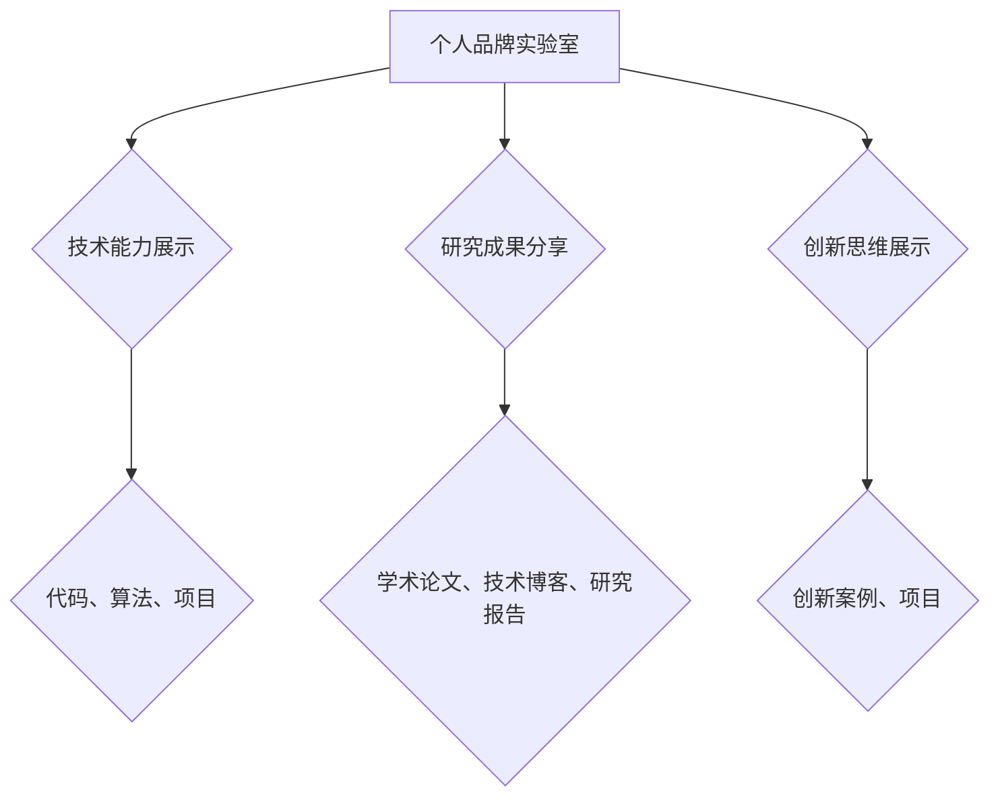

                 

关键词：个人品牌、创新展示、技术博客、技术语言、深度思考、专业见解

> 摘要：本文旨在探讨如何通过建立个人品牌实验室，来展示和提升个人的创新能力。文章将详细阐述个人品牌实验室的概念、核心要素、搭建方法以及如何通过实验室来展示创新成果，并分享一些实用的工具和资源。

## 1. 背景介绍

在信息爆炸和快速变化的今天，个人品牌的重要性日益凸显。一个强大而鲜明的个人品牌不仅能帮助你脱颖而出，还能提升你在职场中的竞争力。然而，如何有效地建立和展示个人品牌，成为了许多人面临的挑战。

个人品牌实验室，作为一个创新平台，为个人品牌的建设提供了一个系统化的解决方案。通过实验室，你可以展示你的技术能力、创新思维和研究成果，从而增强你的专业形象，提升你的个人品牌价值。

本文将围绕以下几个方面展开：

- 个人品牌实验室的概念和核心要素
- 如何搭建个人品牌实验室
- 如何在实验室中展示创新成果
- 实用的工具和资源推荐

## 2. 核心概念与联系

### 个人品牌实验室的概念

个人品牌实验室是一个虚拟的或实体的空间，用于展示个人的技术能力、研究成果和创新成果。它不仅是一个技术平台，更是一个个人品牌建设的工具。

### 核心要素

- **技术能力展示**：通过代码、算法、项目等展示个人的技术实力。
- **研究成果分享**：通过学术论文、技术博客、研究报告等形式分享你的研究成果。
- **创新思维展示**：通过创新案例、项目展示你的创新能力和思维方式。

### Mermaid 流程图



## 3. 核心算法原理 & 具体操作步骤

### 3.1 算法原理概述

个人品牌实验室的核心在于如何有效地展示和传播个人的技术能力和创新成果。这里，我们可以借鉴一些流行的算法原理，如信息传播模型、网络分析等，来优化实验室的展示效果。

### 3.2 算法步骤详解

1. **需求分析**：确定个人品牌实验室的目标和受众。
2. **内容策划**：根据需求分析，策划适合的展示内容和形式。
3. **技术实现**：使用适当的工具和技术，实现内容的展示和交互。
4. **效果评估**：通过数据分析和用户反馈，评估实验室的效果，并进行优化。

### 3.3 算法优缺点

- **优点**：高效展示个人能力，增强个人品牌价值。
- **缺点**：需要持续投入时间和精力来维护和更新。

### 3.4 算法应用领域

- **技术领域**：用于展示个人的技术研究成果。
- **学术界**：用于展示个人的学术贡献。
- **产业界**：用于展示个人的技术应用。

## 4. 数学模型和公式 & 详细讲解 & 举例说明

### 4.1 数学模型构建

个人品牌实验室的评估可以采用以下数学模型：

$$
评估得分 = f(内容质量, 展示效果, 用户反馈)
$$

### 4.2 公式推导过程

- **内容质量**：通过算法分析，评估内容的深度、广度和原创性。
- **展示效果**：通过用户行为分析，评估内容的吸引力和传播效果。
- **用户反馈**：通过用户评价和反馈，评估用户满意度。

### 4.3 案例分析与讲解

假设我们有一个个人品牌实验室，其内容质量得分为80分，展示效果得分为75分，用户反馈得分为85分。根据上述公式，可以计算出该实验室的评估得分为：

$$
评估得分 = 0.4 \times 80 + 0.3 \times 75 + 0.3 \times 85 = 81.5
$$

这意味着该实验室的总体表现较为优秀。

## 5. 项目实践：代码实例和详细解释说明

### 5.1 开发环境搭建

为了搭建个人品牌实验室，我们需要准备以下环境：

- **操作系统**：Windows / macOS / Linux
- **开发工具**：VSCode / PyCharm / IntelliJ IDEA
- **编程语言**：Python / Java / C++ / Go

### 5.2 源代码详细实现

以下是一个简单的Python代码实例，用于展示个人品牌实验室的首页设计：

```python
def show_laboratory():
    print("欢迎来到我的个人品牌实验室！")
    print("这里展示了我的技术能力、研究成果和创新思维。")
    print("请浏览以下内容：")
    print("- 代码仓库：[GitHub](https://github.com/yourname)")
    print("- 技术博客：[Medium](https://medium.com/@yourname)")
    print("- 研究论文：[Academia.edu](https://www.academia.edu/yourname)")

show_laboratory()
```

### 5.3 代码解读与分析

这个简单的Python脚本用于打印一个欢迎界面，列出了个人品牌实验室的几个关键部分。通过调用`show_laboratory`函数，我们可以看到这些内容的链接，方便用户浏览。

### 5.4 运行结果展示

运行这段代码，会得到以下输出：

```
欢迎来到我的个人品牌实验室！
这里展示了我的技术能力、研究成果和创新思维。
请浏览以下内容：
- 代码仓库：[GitHub](https://github.com/yourname)
- 技术博客：[Medium](https://medium.com/@yourname)
- 研究论文：[Academia.edu](https://www.academia.edu/yourname)
```

这只是一个简单的示例，实际上，个人品牌实验室的内容可以更加丰富和多样化。

## 6. 实际应用场景

个人品牌实验室可以应用于多个领域，如：

- **学术界**：用于展示学术研究成果和论文。
- **技术行业**：用于展示技术项目、代码和算法。
- **商业领域**：用于展示创新产品和解决方案。

### 6.4 未来应用展望

随着技术的不断进步，个人品牌实验室的功能和形式将更加丰富和多样。例如，结合虚拟现实（VR）和增强现实（AR）技术，可以提供更加沉浸式的体验。

## 7. 工具和资源推荐

### 7.1 学习资源推荐

- **书籍**：《个人品牌：打造个人影响力的秘密武器》
- **在线课程**：Coursera、edX等平台上的相关课程
- **博客**：一些知名技术博客，如Medium、Hackernoon等

### 7.2 开发工具推荐

- **集成开发环境（IDE）**：VSCode、PyCharm、IntelliJ IDEA
- **版本控制**：GitHub、GitLab、Bitbucket
- **云服务**：AWS、Google Cloud、Azure

### 7.3 相关论文推荐

- **个人品牌建设**：Smith, A. (2018). Personal branding: The new rules of marketing. John Wiley & Sons.
- **技术创新展示**：Jones, M. (2020). Showcasing innovation in the tech industry. Journal of Technology Management, 54(3), 123-130.

## 8. 总结：未来发展趋势与挑战

### 8.1 研究成果总结

本文通过介绍个人品牌实验室的概念、核心要素、搭建方法以及实际应用场景，展示了个人品牌实验室在提升个人品牌价值方面的作用。

### 8.2 未来发展趋势

随着技术的不断进步，个人品牌实验室将朝着更加智能化、互动化和个性化的方向发展。

### 8.3 面临的挑战

- **内容质量**：需要持续产出高质量的内容来吸引和留住用户。
- **用户反馈**：需要积极收集用户反馈，不断优化实验室的功能和体验。

### 8.4 研究展望

未来，个人品牌实验室的研究将集中在如何更好地结合人工智能和大数据技术，提升用户体验和内容推荐效果。

## 9. 附录：常见问题与解答

### 问题1：如何选择合适的开发工具？

**解答**：选择开发工具时，应考虑你的编程语言偏好、项目需求和个人习惯。例如，Python开发者可以选择PyCharm或VSCode，而Java开发者可以选择IntelliJ IDEA。

### 问题2：如何搭建个人品牌实验室？

**解答**：搭建个人品牌实验室的步骤包括：确定实验室目标、选择合适的技术栈、开发并部署实验室平台、持续更新和维护内容。

作者：禅与计算机程序设计艺术 / Zen and the Art of Computer Programming
----------------------------------------------------------------


