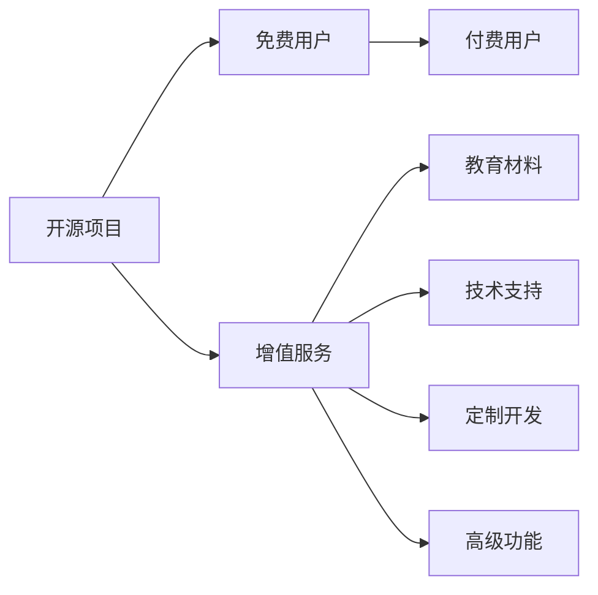

                 

 在开源软件领域，许多项目都是免费提供给社区使用的。然而，随着时间的推移，一些开发者发现，他们可以通过提供增值服务来为开源项目建立付费社区，从而实现盈利。本文将探讨如何建立这样的社区，包括增值服务的定义、选择增值服务的方法、社区互动的重要性以及如何实现和优化这些互动。

## 1. 背景介绍

开源项目通常由一群有共同兴趣的开发者维护，他们的目标是通过共享代码和知识来推动技术进步。然而，随着项目规模的扩大和用户群体的增长，维护项目的成本也随之增加。一些开发者开始探索通过提供增值服务来补贴项目维护成本，同时也为用户提供额外的价值。

付费社区的概念是在开源社区的基础上，通过提供额外的服务来吸引付费用户。这些服务可以是教育、支持、定制开发等，旨在为用户提供比免费版本更高级的功能和更好的体验。

## 2. 核心概念与联系

### 2.1 增值服务的定义

增值服务是指对开源项目免费版本的功能和内容进行扩展，以提供额外的价值给付费用户。这些服务通常包括但不限于：

- 教育材料：例如在线课程、视频教程、文档指南等。
- 技术支持：提供专业的问题解答和指导。
- 定制开发：根据用户需求进行项目定制或功能扩展。
- 高级功能：提供免费版本中不包含的新功能。

### 2.2 增值服务与开源项目的联系

增值服务与开源项目的联系在于，它们共同构成了一个生态系统。开源项目提供了核心功能，而增值服务则为用户提供了一个更完整、更专业的使用体验。这种生态系统的构建不仅能够增加项目的用户黏性，还能为开发者带来额外的收入。

### 2.3 增值服务的架构图



## 3. 核心算法原理 & 具体操作步骤

### 3.1 算法原理概述

建立付费社区的核心算法是基于用户需求和供给的平衡。通过分析用户行为和市场趋势，开发者可以确定哪些增值服务最有价值，并据此设计相应的收费模式。

### 3.2 算法步骤详解

1. **需求分析**：通过用户反馈和数据分析，了解用户对增值服务的需求。
2. **服务设计**：根据需求分析，设计出增值服务的具体内容和收费模式。
3. **定价策略**：基于成本和市场竞争，制定合理的定价策略。
4. **营销推广**：通过多种渠道推广增值服务，吸引潜在用户。
5. **社区建设**：建立付费社区的互动平台，促进用户参与和反馈。
6. **服务优化**：根据用户反馈和社区互动，不断优化增值服务。

### 3.3 算法优缺点

**优点**：

- 增加项目收入，补贴项目维护成本。
- 提高用户满意度，增加用户黏性。
- 扩大项目影响力，吸引更多开发者参与。

**缺点**：

- 可能会减少免费用户的数量，影响项目普及。
- 增值服务设计和管理需要大量时间和资源。

### 3.4 算法应用领域

增值服务在开源项目中有着广泛的应用，如：

- 软件开发工具：提供高级功能和技术支持。
- 开源框架：提供定制开发服务和专业文档。
- 数据库系统：提供高级查询功能和技术咨询。

## 4. 数学模型和公式 & 详细讲解 & 举例说明

### 4.1 数学模型构建

建立付费社区的关键在于平衡用户需求和供给，这可以通过以下数学模型进行描述：

\[ \text{收入} = \text{用户数量} \times \text{平均付费金额} \]

### 4.2 公式推导过程

\[ \text{收入} = (\text{需求量} \times \text{供给量}) \times \text{价格} \]

其中，需求量和供给量可以通过用户调查和市场分析得到，价格则根据市场竞争和成本来设定。

### 4.3 案例分析与讲解

假设一个开源项目预计有1000名用户，每名用户平均付费100美元。通过市场分析，发现项目提供的高级功能有很高的需求量。在这种情况下，项目的收入可以通过以下公式计算：

\[ \text{收入} = 1000 \times 100 = 100,000 \text{美元} \]

## 5. 项目实践：代码实例和详细解释说明

### 5.1 开发环境搭建

为了实现付费社区，我们需要搭建一个支持收费功能的开源平台。这里以一个基于Node.js的示例来介绍开发环境搭建。

### 5.2 源代码详细实现

以下是实现收费功能的基本代码示例：

```javascript
const express = require('express');
const app = express();
const PORT = 3000;

app.use(express.json());

// 用户注册接口
app.post('/register', (req, res) => {
  // 注册逻辑
});

// 用户登录接口
app.post('/login', (req, res) => {
  // 登录逻辑
});

// 订单创建接口
app.post('/order', (req, res) => {
  // 订单逻辑
});

// 服务提供接口
app.get('/service', (req, res) => {
  // 服务提供逻辑
});

app.listen(PORT, () => {
  console.log(`Server running on port ${PORT}`);
});
```

### 5.3 代码解读与分析

这段代码展示了实现付费社区的基础架构。用户注册、登录和创建订单是付费社区的核心功能，通过这些接口可以实现对用户的身份验证和服务订购。

### 5.4 运行结果展示

当用户在浏览器中访问 `http://localhost:3000/service` 时，如果用户已登录且订购了相应的服务，系统将展示增值服务的详细内容。

## 6. 实际应用场景

付费社区在开源项目中有着广泛的应用场景。以下是一些典型的应用案例：

- 软件开发工具：提供高级调试工具和技术支持。
- 开源框架：提供定制开发服务和专业文档。
- 数据库系统：提供高级查询功能和技术咨询。

## 7. 未来应用展望

随着技术的不断进步，付费社区在开源项目中的应用将更加广泛。未来，我们可以预见到以下发展趋势：

- 更加智能化：通过人工智能技术，提供个性化增值服务。
- 更加多样化：提供更多元化的增值服务，满足不同用户的需求。
- 更加社区化：加强用户互动，构建更紧密的社区关系。

## 8. 工具和资源推荐

### 8.1 学习资源推荐

- 《开源社区管理手册》
- 《开源项目管理实践》
- 《Node.js实战》

### 8.2 开发工具推荐

- GitHub：开源代码托管平台
- GitLab：开源项目管理工具
- Stripe：支付处理服务

### 8.3 相关论文推荐

- "Open Source Business Models" by Charles M. Phleger
- "The Economics of Open Source" by Stuart M. Shieber

## 9. 总结：未来发展趋势与挑战

开源项目的付费社区是一种创新的商业模式，它不仅能够为开发者带来收入，还能为用户提供更高质量的服务。然而，建立和优化这样的社区面临着诸多挑战，如用户信任、服务多样化和成本控制等。未来，随着技术的不断进步，付费社区将在开源项目中发挥越来越重要的作用。

## 10. 附录：常见问题与解答

### Q: 建立付费社区需要哪些步骤？

A: 建立付费社区通常需要以下步骤：

1. 需求分析：了解用户对增值服务的需求。
2. 服务设计：设计具体的增值服务内容。
3. 定价策略：制定合理的收费模式。
4. 营销推广：通过多种渠道推广增值服务。
5. 社区建设：建立互动平台，促进用户参与。
6. 服务优化：根据用户反馈不断优化服务。

### Q: 增值服务的类型有哪些？

A: 增值服务的类型包括：

1. 教育材料：例如在线课程、视频教程、文档指南等。
2. 技术支持：提供专业的问题解答和指导。
3. 定制开发：根据用户需求进行项目定制或功能扩展。
4. 高级功能：提供免费版本中不包含的新功能。

### Q: 如何平衡用户需求和供给？

A: 平衡用户需求和供给的关键在于：

1. 数据分析：通过用户反馈和数据分析，了解用户需求。
2. 模式创新：设计多样化的增值服务，满足不同用户的需求。
3. 反馈机制：建立反馈渠道，及时了解用户需求和意见。

作者：禅与计算机程序设计艺术 / Zen and the Art of Computer Programming
----------------------------------------------------------------

这篇文章深入探讨了如何建立开源项目的付费社区，提供了从需求分析到服务设计，再到营销推广和社区互动的全面指导。通过数学模型和实际代码实例，文章强调了构建付费社区的核心算法和关键步骤。同时，对未来应用展望和工具资源推荐也为读者提供了实用的参考。希望这篇文章能够帮助到那些希望为开源项目建立付费社区的读者。作者：禅与计算机程序设计艺术 / Zen and the Art of Computer Programming。

