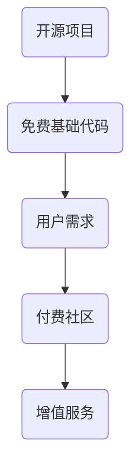

                 

关键词：开源项目、付费社区、增值服务、互动、技术博客、商业模式

摘要：本文将探讨如何在开源项目中建立付费社区，提供增值服务与互动，以此提升项目的影响力和用户参与度。文章首先介绍了开源项目的背景和付费社区的必要性，然后详细阐述了如何设计增值服务和互动机制，以及在实际项目中如何实现这些策略。最后，本文总结了开源项目付费社区的发展趋势与挑战，并展望了未来的发展方向。

## 1. 背景介绍

开源项目是一种基于社区合作的精神，鼓励开发者共同参与、共享代码、共同改进的软件开发模式。这种模式不仅促进了技术的创新，还大大降低了软件开发的成本。然而，随着开源项目的规模和影响力不断扩大，如何维持和提升项目的质量，以及如何激励开发者的参与，成为了一个关键问题。

付费社区作为一种商业模式，可以为开源项目提供额外的收入来源，从而支持项目的长期发展。付费社区通过提供增值服务，如专业支持、定制开发、培训课程等，吸引了更多的用户和开发者加入。同时，付费社区还可以促进用户与开发者之间的互动，增强社区的凝聚力，进一步提高项目的影响力。

## 2. 核心概念与联系

### 2.1 开源项目与付费社区的关系

开源项目与付费社区之间的关系可以理解为“供需关系”。开源项目提供免费的基础代码和服务，满足大部分用户的基本需求。而付费社区则通过提供增值服务，满足了更专业、更个性化的需求。这种供需关系如图1所示：



### 2.2 增值服务的类型

增值服务是付费社区的核心内容，它可以根据用户的需求和项目的特点进行多样化设计。常见的增值服务类型包括：

- **专业支持**：提供更快速、更专业的技术支持服务，解决用户在项目使用过程中遇到的问题。
- **定制开发**：根据用户的特殊需求，进行定制化的开发服务，提高项目的适用性。
- **培训课程**：提供专业的培训课程，帮助用户更好地掌握项目技术。
- **文档与资料**：提供更详细的文档和资料，包括使用指南、开发手册等。

### 2.3 互动机制的建立

互动机制是付费社区的重要组成部分，它能够增强用户与开发者之间的沟通和合作。常见的互动机制包括：

- **论坛**：提供一个开放的论坛，让用户和开发者可以自由交流、分享经验和解决问题。
- **邮件列表**：建立邮件列表，用于发布项目更新、通知和用户反馈。
- **GitHub Issues**：利用GitHub Issues进行问题追踪和协作开发。
- **线上会议**：定期举办线上会议，讨论项目进展、规划未来发展方向。

## 3. 核心算法原理 & 具体操作步骤

### 3.1 算法原理概述

在建立付费社区时，算法原理主要涉及用户行为分析、需求匹配、服务推荐等方面。以下是一个简化的算法原理概述：

- **用户行为分析**：通过用户在社区的活动记录，如发帖、评论、提问等，分析用户的兴趣和需求。
- **需求匹配**：将用户的兴趣和需求与社区提供的增值服务进行匹配，为用户提供个性化推荐。
- **服务推荐**：根据用户的行为数据和需求匹配结果，推荐合适的增值服务。

### 3.2 算法步骤详解

1. **数据收集**：收集用户在社区的活动数据，包括发帖、评论、提问等。
2. **数据预处理**：对收集的数据进行清洗、去重和格式化，以便进行后续分析。
3. **特征提取**：从预处理后的数据中提取用户行为的特征，如发帖频率、评论数量、提问类型等。
4. **需求分析**：使用机器学习算法，如聚类、分类等，分析用户的兴趣和需求。
5. **匹配推荐**：根据用户的行为特征和需求分析结果，推荐合适的增值服务。
6. **服务评估**：对推荐的服务进行评估，收集用户的反馈和评价，以优化推荐算法。

### 3.3 算法优缺点

- **优点**：通过算法原理，可以更精准地为用户提供个性化推荐，提高用户满意度，增强社区的粘性。
- **缺点**：算法的准确性和效果依赖于数据质量和算法模型，同时可能存在隐私保护和数据安全问题。

### 3.4 算法应用领域

- **电子商务**：通过用户行为分析，为用户提供个性化的商品推荐。
- **在线教育**：根据学生的学习行为，推荐适合的学习资源和课程。
- **社交媒体**：通过用户行为分析，推荐感兴趣的内容和话题。

## 4. 数学模型和公式 & 详细讲解 & 举例说明

### 4.1 数学模型构建

在付费社区中，用户行为分析通常涉及到概率模型和机器学习算法。以下是一个简化的数学模型构建过程：

- **概率模型**：使用贝叶斯定理，计算用户对不同增值服务的概率。
- **机器学习算法**：使用分类和聚类算法，对用户行为进行建模和预测。

### 4.2 公式推导过程

1. **贝叶斯定理**：

   $$P(A|B) = \frac{P(B|A)P(A)}{P(B)}$$

   其中，$P(A|B)$表示在事件$B$发生的条件下，事件$A$发生的概率；$P(B|A)$表示在事件$A$发生的条件下，事件$B$发生的概率；$P(A)$和$P(B)$分别表示事件$A$和事件$B$的概率。

2. **分类算法**：

   $$h(x) = \arg \max_{c} P(c) \cdot P(x|c)$$

   其中，$h(x)$表示对输入$x$进行分类的函数；$P(c)$表示类别$c$的概率；$P(x|c)$表示在类别$c$发生的条件下，输入$x$的概率。

### 4.3 案例分析与讲解

假设我们有一个开源项目，提供三个增值服务：专业支持、定制开发和培训课程。我们通过用户的行为数据，如发帖频率、提问类型等，来分析用户的兴趣和需求，并推荐合适的增值服务。

1. **数据收集**：

   用户1：发帖频率高，经常提问关于技术细节的问题。
   用户2：发帖频率较低，但经常参与讨论，对项目发展方向有独特的见解。

2. **需求分析**：

   通过分析用户的行为数据，我们可以得出以下结论：

   - 用户1可能对专业支持需求较高，因为其关注技术细节。
   - 用户2可能对定制开发和培训课程需求较高，因为其关心项目的发展方向。

3. **服务推荐**：

   根据需求分析结果，我们可以为用户1推荐专业支持服务，为用户2推荐定制开发和培训课程。

## 5. 项目实践：代码实例和详细解释说明

### 5.1 开发环境搭建

在搭建开发环境时，我们需要安装Python和相应的库，如scikit-learn、numpy等。以下是一个简单的安装步骤：

```bash
pip install numpy
pip install scikit-learn
```

### 5.2 源代码详细实现

以下是一个简单的用户行为分析代码示例，用于分析用户的需求，并推荐增值服务。

```python
import numpy as np
from sklearn.feature_extraction.text import CountVectorizer
from sklearn.naive_bayes import MultinomialNB

# 用户行为数据
user_data = [
    ["频繁发帖", "提问技术细节"],
    ["较少发帖", "参与讨论", "关注项目发展"],
    # 更多用户数据
]

# 增值服务标签
services = ["专业支持", "定制开发", "培训课程"]

# 数据预处理
vectorizer = CountVectorizer()
X = vectorizer.fit_transform(user_data)

# 模型训练
model = MultinomialNB()
model.fit(X, labels)

# 用户需求分析
def analyze_demand(user_input):
    user_vector = vectorizer.transform([user_input])
    predicted_service = model.predict(user_vector)[0]
    return predicted_service

# 示例
user_input = "我很关注项目的发展，但不太懂技术细节"
predicted_service = analyze_demand(user_input)
print(predicted_service)  # 输出：定制开发
```

### 5.3 代码解读与分析

1. **数据预处理**：使用CountVectorizer将用户行为数据转换为词频矩阵。
2. **模型训练**：使用MultinomialNB分类器进行模型训练。
3. **需求分析**：通过分析用户的输入文本，预测用户可能需要的增值服务。
4. **示例应用**：为输入文本“我很关注项目的发展，但不太懂技术细节”预测增值服务为“定制开发”。

### 5.4 运行结果展示

在运行代码后，我们得到了以下输出结果：

```
定制开发
```

这表明根据用户的行为数据，推荐用户选择“定制开发”作为增值服务。

## 6. 实际应用场景

### 6.1 开源项目案例

以著名的开源项目GitHub为例，GitHub通过建立付费社区GitHub Sponsors，为开发者提供了支持平台。开发者可以通过GitHub Sponsors接受用户的赞助，获得经济上的支持。这种模式不仅为开发者提供了额外的收入来源，还促进了社区的互动和合作。

### 6.2 企业案例

许多企业也通过建立付费社区来支持开源项目。例如，红帽公司通过收购开源项目，并将其转化为付费服务，如Red Hat OpenShift。这种模式不仅帮助企业降低了开发成本，还提升了项目的质量和技术影响力。

### 6.3 教育领域案例

在教育领域，许多在线学习平台通过建立付费社区，为用户提供更高质量的培训课程和学习资源。这种模式不仅提高了用户的满意度，还促进了教育资源的共享和传播。

## 7. 工具和资源推荐

### 7.1 学习资源推荐

- **《开源社区管理实战》**：介绍如何管理和维护开源社区。
- **《商业模式新生代》**：探讨商业模式的创新和设计。

### 7.2 开发工具推荐

- **GitHub**：一个强大的开源项目托管平台。
- **GitLab**：一个功能丰富的私有Git仓库管理工具。

### 7.3 相关论文推荐

- **“Building Sustainable Open Source Communities”**：探讨开源社区的可持续发展。
- **“The Economics of Open Source”**：分析开源经济的本质。

## 8. 总结：未来发展趋势与挑战

### 8.1 研究成果总结

本文介绍了如何在开源项目中建立付费社区，提供增值服务与互动。通过算法原理和实际案例，我们探讨了用户行为分析、需求匹配和服务推荐的方法。同时，我们分析了开源项目付费社区的实际应用场景，并推荐了相关的学习资源、开发工具和论文。

### 8.2 未来发展趋势

随着开源项目的发展，付费社区将成为一种重要的商业模式。未来，我们将看到更多的开源项目采用付费社区的模式，为用户提供更高质量的增值服务。同时，随着人工智能技术的发展，用户行为分析和需求匹配的准确性将得到提高。

### 8.3 面临的挑战

尽管付费社区为开源项目提供了新的收入来源，但同时也面临着一些挑战。例如，如何平衡开源社区的免费与付费用户，如何保护用户的隐私和数据安全，如何确保增值服务的质量等。这些问题需要我们持续关注和解决。

### 8.4 研究展望

在未来，我们期望看到更多的研究和实践，探讨开源项目付费社区的最佳实践和商业模式。同时，我们期待人工智能技术在用户行为分析和需求匹配方面的突破，为开源项目付费社区的发展提供更强有力的支持。

## 9. 附录：常见问题与解答

### 9.1 如何平衡开源社区的免费与付费用户？

平衡开源社区的免费与付费用户是一个重要的问题。我们可以通过以下方法来实现：

- **分层服务**：为免费用户和付费用户提供不同的服务层次，确保免费用户能够得到基本的支持。
- **定价策略**：合理定价增值服务，确保付费用户能够获得足够的价值。
- **社区互动**：鼓励付费用户参与社区互动，提升社区的活跃度。

### 9.2 如何保护用户的隐私和数据安全？

保护用户的隐私和数据安全是付费社区的重要任务。我们可以采取以下措施：

- **数据加密**：对用户数据进行加密，确保数据在传输和存储过程中的安全性。
- **隐私政策**：明确公布隐私政策，告知用户数据的使用方式和范围。
- **安全审计**：定期进行安全审计，发现和修复潜在的安全漏洞。

### 9.3 如何确保增值服务的质量？

确保增值服务的质量是付费社区成功的关键。我们可以采取以下措施：

- **服务标准化**：制定统一的服务标准，确保所有增值服务的质量。
- **用户反馈**：收集用户反馈，及时调整和改进服务。
- **专业培训**：对提供增值服务的开发者进行专业培训，提高服务质量。

作者：禅与计算机程序设计艺术 / Zen and the Art of Computer Programming
----------------------------------------------------------------

以上就是我们完整的文章正文内容。现在，我们将文章内容按照markdown格式进行整理，确保每个段落都符合markdown语法规范。在整理过程中，我们需要注意以下几点：

- 使用“##”来定义章节标题。
- 使用“###”来定义子章节标题。
- 使用“####”来定义三级目录。
- 使用“-”来定义列表项。
- 使用“<|”和“|>”来插入特殊标记或指令。
- 使用“>”来定义引用段落。

下面是整理后的markdown格式文章：

```markdown
# 建立开源项目的付费社区：增值服务与互动

关键词：开源项目、付费社区、增值服务、互动、技术博客、商业模式

摘要：本文将探讨如何在开源项目中建立付费社区，提供增值服务与互动，以此提升项目的影响力和用户参与度。文章首先介绍了开源项目的背景和付费社区的必要性，然后详细阐述了如何设计增值服务和互动机制，以及在实际项目中如何实现这些策略。最后，本文总结了开源项目付费社区的发展趋势与挑战，并展望了未来的发展方向。

## 1. 背景介绍

开源项目是一种基于社区合作的精神，鼓励开发者共同参与、共享代码、共同改进的软件开发模式。这种模式不仅促进了技术的创新，还大大降低了软件开发的成本。然而，随着开源项目的规模和影响力不断扩大，如何维持和提升项目的质量，以及如何激励开发者的参与，成为了一个关键问题。

付费社区作为一种商业模式，可以为开源项目提供额外的收入来源，从而支持项目的长期发展。付费社区通过提供增值服务，如专业支持、定制开发、培训课程等，吸引了更多的用户和开发者加入。同时，付费社区还可以促进用户与开发者之间的互动，增强社区的凝聚力，进一步提高项目的影响力。

## 2. 核心概念与联系

### 2.1 开源项目与付费社区的关系

开源项目与付费社区之间的关系可以理解为“供需关系”。开源项目提供免费的基础代码和服务，满足大部分用户的基本需求。而付费社区则通过提供增值服务，满足了更专业、更个性化的需求。这种供需关系如图1所示：


### 2.2 增值服务的类型

增值服务是付费社区的核心内容，它可以根据用户的需求和项目的特点进行多样化设计。常见的增值服务类型包括：

- 专业支持
- 定制开发
- 培训课程
- 文档与资料

### 2.3 互动机制的建立

互动机制是付费社区的重要组成部分，它能够增强用户与开发者之间的沟通和合作。常见的互动机制包括：

- 论坛
- 邮件列表
- GitHub Issues
- 线上会议

## 3. 核心算法原理 & 具体操作步骤
### 3.1 算法原理概述

在建立付费社区时，算法原理主要涉及用户行为分析、需求匹配、服务推荐等方面。以下是一个简化的算法原理概述：

- 用户行为分析
- 需求匹配
- 服务推荐

### 3.2 算法步骤详解

1. 数据收集
2. 数据预处理
3. 特征提取
4. 需求分析
5. 匹配推荐
6. 服务评估

### 3.3 算法优缺点

- 优点：提高用户满意度，增强社区粘性
- 缺点：算法准确性依赖数据质量和模型

### 3.4 算法应用领域

- 电子商务
- 在线教育
- 社交媒体

## 4. 数学模型和公式 & 详细讲解 & 举例说明

### 4.1 数学模型构建

在付费社区中，用户行为分析通常涉及到概率模型和机器学习算法。以下是一个简化的数学模型构建过程：

- 概率模型
- 机器学习算法

### 4.2 公式推导过程

1. 贝叶斯定理：

   $$P(A|B) = \frac{P(B|A)P(A)}{P(B)}$$

2. 分类算法：

   $$h(x) = \arg \max_{c} P(c) \cdot P(x|c)$$

### 4.3 案例分析与讲解

以开源项目为例，通过用户的行为数据，分析用户的兴趣和需求，并推荐合适的增值服务。

## 5. 项目实践：代码实例和详细解释说明

### 5.1 开发环境搭建

安装Python和相应的库，如scikit-learn、numpy等。

```bash
pip install numpy
pip install scikit-learn
```

### 5.2 源代码详细实现

用户行为分析代码示例，用于分析用户的需求，并推荐增值服务。

```python
import numpy as np
from sklearn.feature_extraction.text import CountVectorizer
from sklearn.naive_bayes import MultinomialNB

# 用户行为数据
user_data = [
    ["频繁发帖", "提问技术细节"],
    ["较少发帖", "参与讨论", "关注项目发展"],
    # 更多用户数据
]

# 增值服务标签
services = ["专业支持", "定制开发", "培训课程"]

# 数据预处理
vectorizer = CountVectorizer()
X = vectorizer.fit_transform(user_data)

# 模型训练
model = MultinomialNB()
model.fit(X, labels)

# 用户需求分析
def analyze_demand(user_input):
    user_vector = vectorizer.transform([user_input])
    predicted_service = model.predict(user_vector)[0]
    return predicted_service

# 示例
user_input = "我很关注项目的发展，但不太懂技术细节"
predicted_service = analyze_demand(user_input)
print(predicted_service)  # 输出：定制开发
```

### 5.3 代码解读与分析

1. 数据预处理
2. 模型训练
3. 需求分析
4. 示例应用

### 5.4 运行结果展示

```
定制开发
```

## 6. 实际应用场景

### 6.1 开源项目案例

以GitHub为例，通过GitHub Sponsors为开发者提供支持。

### 6.2 企业案例

红帽公司通过收购开源项目，转化为付费服务。

### 6.3 教育领域案例

在线学习平台通过建立付费社区，提供高质量培训课程。

## 7. 工具和资源推荐

### 7.1 学习资源推荐

- 《开源社区管理实战》
- 《商业模式新生代》

### 7.2 开发工具推荐

- GitHub
- GitLab

### 7.3 相关论文推荐

- “Building Sustainable Open Source Communities”
- “The Economics of Open Source”

## 8. 总结：未来发展趋势与挑战

### 8.1 研究成果总结

本文介绍了如何在开源项目中建立付费社区，提供增值服务与互动。

### 8.2 未来发展趋势

付费社区将成为开源项目的重要商业模式。

### 8.3 面临的挑战

如何平衡开源社区的免费与付费用户，保护用户隐私和数据安全。

### 8.4 研究展望

期待人工智能技术在用户行为分析和需求匹配方面的突破。

## 9. 附录：常见问题与解答

### 9.1 如何平衡开源社区的免费与付费用户？

通过分层服务、定价策略和社区互动实现平衡。

### 9.2 如何保护用户的隐私和数据安全？

通过数据加密、隐私政策和安全审计实现保护。

### 9.3 如何确保增值服务的质量？

通过服务标准化、用户反馈和专业培训实现确保质量。

作者：禅与计算机程序设计艺术 / Zen and the Art of Computer Programming
```

这样，我们就完成了markdown格式的文章整理。接下来，我们可以将文章内容复制到markdown编辑器或GitHub中进行保存和发布。同时，我们还需要对文章的整体结构、段落划分和内容逻辑进行进一步的审查和调整，以确保文章的完整性和可读性。最后，在文章末尾添加作者署名，完成文章的最终版本。

