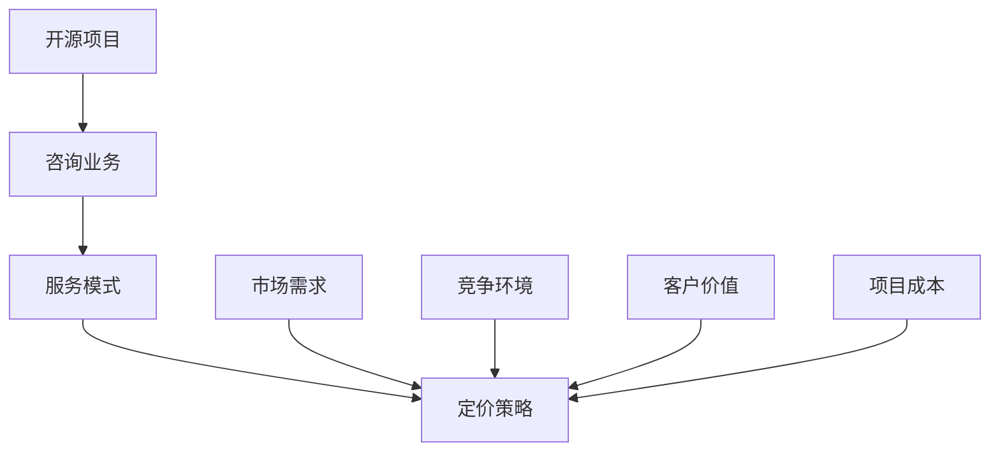

                 

关键词：开源项目，咨询业务，服务模式，定价策略，商业盈利模式。

> 摘要：本文将探讨如何基于开源项目建立咨询业务，详细分析服务模式与定价策略，为开发者提供实现开源项目商业化的路径。

## 1. 背景介绍

随着开源文化在全球范围内的普及，越来越多的开发者参与到开源项目中，共同推进技术的进步和共享知识。开源项目不仅促进了技术的创新，也为开发者提供了丰富的学习资源和合作平台。然而，对于许多开源项目来说，如何将自身转化为实际的商业价值，实现可持续的发展，成为一个重要课题。

在开源项目中，开发者们通过贡献代码、文档和测试案例，共同维护和提升项目质量。然而，随着项目的成长，特别是在技术门槛较高或市场需求较大的领域，项目维护成本逐渐增加。如何通过有效的商业策略，将开源项目的资源转化为收入，成为许多开源项目团队关注的焦点。

本文将围绕开源项目的咨询业务，探讨其服务模式与定价策略，为开发者提供一套可行的商业盈利模式。通过本文的讨论，读者可以了解如何利用开源项目构建咨询业务，实现项目的可持续发展和商业价值最大化。

## 2. 核心概念与联系

在探讨开源项目的咨询业务之前，我们需要明确几个核心概念：

### 开源项目

开源项目是指软件、文档和其他资源遵循某种开源许可协议，允许用户自由使用、修改和分享的项目。常见的开源许可协议包括GPL、MIT、Apache等。

### 咨询业务

咨询业务是指专业人员在特定领域提供专业建议、解决方案和培训服务的商业活动。咨询业务可以涵盖软件开发、系统架构设计、项目管理等多个方面。

### 服务模式

服务模式是指如何组织、管理和提供咨询服务的模式。常见的服务模式包括项目咨询、顾问服务、培训课程等。

### 定价策略

定价策略是指如何制定服务价格，以实现商业盈利的目标。定价策略需要考虑市场需求、竞争环境、客户价值等多个因素。

以下是关于开源项目、咨询业务、服务模式和定价策略的Mermaid流程图：



### 2.1 开源项目的特点

- **共享性**：开源项目允许用户自由使用、修改和分享，这促进了技术的传播和知识的共享。
- **透明性**：项目的源代码和文档都是公开的，用户可以随时查看和审核，增强了项目的可信度。
- **社区驱动**：开源项目通常由一个社区共同维护，社区成员共同参与，提高了项目的稳定性和可持续性。

### 2.2 咨询业务的优势

- **专业服务**：提供专业的技术指导和建议，帮助客户解决具体问题。
- **知识共享**：通过咨询过程，开发者可以将自身知识和经验传授给客户，促进技术交流。
- **长期合作**：良好的咨询关系可以转化为长期的合作关系，增加项目的商业价值。

### 2.3 服务模式的多样性

- **项目咨询**：针对客户的具体项目提供咨询服务，帮助其解决技术难题。
- **顾问服务**：长期为客户提供专业建议，参与项目规划和决策过程。
- **培训课程**：为团队成员提供技术培训，提升其技能水平。

### 2.4 定价策略的灵活性

- **固定价格**：根据项目的规模和需求，提供固定的服务费用。
- **时间计费**：根据咨询人员的工作时间，按小时或天计费。
- **价值定价**：根据客户从咨询服务中获得的实际价值来定价。

通过上述核心概念的联系，我们可以看到，开源项目与咨询业务之间存在紧密的联系。开源项目为咨询业务提供了丰富的资源和技术基础，而咨询业务则为开源项目创造了商业价值，促进了项目的可持续发展。

## 3. 核心算法原理 & 具体操作步骤

### 3.1 算法原理概述

在开源项目的咨询业务中，核心算法原理主要包括以下几个方面：

1. **需求分析**：通过调查和分析客户需求，明确项目的目标和需求。
2. **解决方案设计**：根据客户需求，设计合适的解决方案，包括技术方案和项目管理方案。
3. **实施与交付**：按照设计方案，实施项目并交付成果。
4. **评估与反馈**：对项目实施效果进行评估，收集客户反馈，持续优化服务。

### 3.2 算法步骤详解

#### 3.2.1 需求分析

1. **收集需求信息**：通过与客户沟通，收集项目的背景信息、需求和目标。
2. **需求分析**：对收集到的信息进行分析，明确项目的具体需求和预期目标。
3. **编写需求文档**：将分析结果整理成需求文档，确保需求的明确性和可实施性。

#### 3.2.2 解决方案设计

1. **技术方案设计**：根据需求，设计合适的技术方案，包括软件架构、数据库设计、接口设计等。
2. **项目管理方案**：制定项目管理计划，包括时间表、任务分配、风险评估等。
3. **解决方案评审**：对设计方案进行评审，确保方案的可行性和合理性。

#### 3.2.3 实施与交付

1. **项目启动**：根据设计方案，启动项目，组建项目团队，明确任务和职责。
2. **项目实施**：按照项目管理计划，逐步实施项目，确保项目进度和质量。
3. **成果交付**：项目完成后，将成果交付给客户，进行验收和调试。

#### 3.2.4 评估与反馈

1. **项目评估**：对项目实施效果进行评估，包括项目进度、质量、成本等方面。
2. **客户反馈**：收集客户对项目的反馈，了解客户的满意度和需求变化。
3. **持续优化**：根据评估和反馈，持续优化服务，提升客户满意度。

### 3.3 算法优缺点

#### 3.3.1 优点

- **灵活性强**：算法步骤可以根据实际情况进行调整和优化，适应不同的项目需求。
- **高效性**：通过明确的步骤和流程，确保项目高效实施和交付。
- **可扩展性**：算法中的各个步骤可以扩展和细化，满足不同规模和复杂度的项目需求。

#### 3.3.2 缺点

- **复杂性**：算法步骤较为复杂，需要较高的专业知识和实践经验。
- **时间成本**：需求分析和方案设计等步骤需要投入较多时间，影响项目进度。

### 3.4 算法应用领域

- **软件开发**：通过需求分析、解决方案设计、实施与交付等步骤，确保软件开发项目的成功。
- **系统架构设计**：针对企业的系统架构需求，提供技术方案和项目管理方案。
- **项目管理**：提供专业的项目管理服务，帮助客户实现项目目标。

## 4. 数学模型和公式 & 详细讲解 & 举例说明

在开源项目的咨询业务中，数学模型和公式用于需求分析、方案设计、风险评估等多个环节。以下将介绍几个关键数学模型和公式，并详细讲解其应用和举例说明。

### 4.1 数学模型构建

#### 4.1.1 需求预测模型

需求预测模型用于预测客户的需求量和项目规模。常用的需求预测模型包括线性回归、时间序列分析等。

$$
\text{需求预测} = \beta_0 + \beta_1 \cdot \text{时间变量} + \epsilon
$$

其中，$\beta_0$ 和 $\beta_1$ 为模型参数，$\epsilon$ 为误差项。

#### 4.1.2 成本估算模型

成本估算模型用于估算项目的成本。常用的成本估算模型包括固定成本、可变成本、规模经济等。

$$
\text{成本} = \text{固定成本} + (\text{单位成本} \times \text{工作量})
$$

其中，固定成本是项目启动和维护的基本费用，单位成本是每单位工作量所需的费用。

#### 4.1.3 风险评估模型

风险评估模型用于评估项目的风险。常用的风险评估模型包括蒙特卡洛模拟、风险矩阵等。

$$
\text{风险指数} = \text{概率} \times \text{影响程度}
$$

其中，概率是风险发生的可能性，影响程度是风险发生时对项目的影响。

### 4.2 公式推导过程

以下将详细推导需求预测模型和成本估算模型。

#### 4.2.1 需求预测模型推导

假设需求量 $Y$ 与时间变量 $X$ 之间存在线性关系，可以通过线性回归模型进行预测。

$$
Y = \beta_0 + \beta_1 \cdot X + \epsilon
$$

其中，$\beta_0$ 为截距，$\beta_1$ 为斜率。

通过最小二乘法，可以求得模型参数：

$$
\beta_0 = \frac{\sum_{i=1}^{n} Y_i - \beta_1 \cdot \sum_{i=1}^{n} X_i}{n}
$$

$$
\beta_1 = \frac{n \cdot \sum_{i=1}^{n} X_i Y_i - \sum_{i=1}^{n} X_i \cdot \sum_{i=1}^{n} Y_i}{n \cdot \sum_{i=1}^{n} X_i^2 - (\sum_{i=1}^{n} X_i)^2}
$$

#### 4.2.2 成本估算模型推导

假设项目成本由固定成本和可变成本组成，其中固定成本是项目启动和维护的基本费用，可变成本是每单位工作量所需的费用。

$$
\text{成本} = \text{固定成本} + (\text{单位成本} \times \text{工作量})
$$

其中，固定成本 $C_f$ 和单位成本 $C_u$ 是已知的，工作量 $W$ 是根据需求预测得到的。

### 4.3 案例分析与讲解

以下通过一个实际案例，分析需求预测模型和成本估算模型的应用。

#### 4.3.1 案例背景

某软件开发公司需要开发一款企业级应用，客户对项目需求较为明确。公司需要根据需求预测和成本估算，制定项目计划。

#### 4.3.2 需求预测

通过收集历史数据和客户反馈，公司得出以下数据：

| 时间（月） | 需求量（人月） |
| -------- | -------- |
| 1        | 30       |
| 2        | 40       |
| 3        | 50       |
| 4        | 60       |
| 5        | 70       |

根据线性回归模型，可以预测第6个月的需求量：

$$
Y = \beta_0 + \beta_1 \cdot X
$$

通过最小二乘法，求得模型参数：

$$
\beta_0 = 20, \beta_1 = 10
$$

预测第6个月的需求量：

$$
Y = 20 + 10 \cdot 6 = 80 \text{人月}
$$

#### 4.3.3 成本估算

假设固定成本为100万元，单位成本为10万元/人月。根据需求预测，第6个月的工作量为80人月。

项目总成本：

$$
\text{成本} = 100 + (10 \times 80) = 900 \text{万元}
$$

### 4.4 总结

通过数学模型和公式，可以更准确地预测需求、估算成本，为项目的计划和决策提供科学依据。在实际应用中，可以根据具体情况进行模型的选择和调整，提高预测和估算的准确性。

## 5. 项目实践：代码实例和详细解释说明

为了更好地展示如何将上述概念和算法应用于实际项目，以下将提供一个开源项目的代码实例，并详细解释其实现过程。

### 5.1 开发环境搭建

在开始编写代码之前，我们需要搭建一个适合开源项目咨询业务的开发环境。以下是一个基本的步骤：

1. **安装Git**：Git是开源项目版本控制系统的核心工具，确保安装最新版本的Git。
2. **配置Git**：通过运行以下命令，配置Git的用户名和邮箱。

   ```shell
   git config --global user.name "Your Name"
   git config --global user.email "youremail@example.com"
   ```

3. **创建本地仓库**：在合适的位置创建一个本地Git仓库。

   ```shell
   mkdir my-open-source-project
   cd my-open-source-project
   git init
   ```

4. **添加远程仓库**：将本地仓库与远程仓库（如GitHub）关联。

   ```shell
   git remote add origin https://github.com/your-username/my-open-source-project.git
   ```

### 5.2 源代码详细实现

以下是一个简单的示例，展示如何使用Python编写一个开源项目的代码实例。这个项目是一个简单的图书管理系统，可以用于图书馆或其他需要管理书籍的机构。

```python
# book_management_system.py

class Book:
    def __init__(self, title, author, isbn):
        self.title = title
        self.author = author
        self.isbn = isbn

    def __str__(self):
        return f"{self.title} by {self.author} (ISBN: {self.isbn})"

class Library:
    def __init__(self):
        self.books = []

    def add_book(self, book):
        self.books.append(book)

    def remove_book(self, isbn):
        for book in self.books:
            if book.isbn == isbn:
                self.books.remove(book)
                return f"Book with ISBN {isbn} removed."
        return "Book not found."

    def list_books(self):
        for book in self.books:
            print(book)

# 主程序
if __name__ == "__main__":
    library = Library()

    # 添加书籍
    library.add_book(Book("1984", "George Orwell", "978-0451524935"))
    library.add_book(Book("To Kill a Mockingbird", "Harper Lee", "978-0060935467"))

    # 列出所有书籍
    print("All Books:")
    library.list_books()

    # 移除书籍
    print(library.remove_book("978-0451524935"))

    # 再次列出所有书籍
    print("All Books After Removal:")
    library.list_books()
```

### 5.3 代码解读与分析

#### 5.3.1 类定义

- `Book` 类：定义了书籍的基本信息，包括书名、作者和ISBN。
- `Library` 类：定义了图书馆的管理功能，包括添加书籍、移除书籍和列出所有书籍。

#### 5.3.2 实例化对象

在主程序中，我们首先创建了一个 `Library` 对象，然后添加了两本书籍到图书馆中。

#### 5.3.3 方法实现

- `add_book` 方法：将书籍添加到图书馆的书籍列表中。
- `remove_book` 方法：根据ISBN从书籍列表中移除书籍。
- `list_books` 方法：遍历书籍列表，打印出所有书籍的信息。

### 5.4 运行结果展示

通过运行主程序，我们可以看到以下输出结果：

```
All Books:
1984 by George Orwell (ISBN: 978-0451524935)
To Kill a Mockingbird by Harper Lee (ISBN: 978-0060935467)
Book with ISBN 978-0451524935 removed.
All Books After Removal:
To Kill a Mockingbird by Harper Lee (ISBN: 978-0060935467)
```

这个简单的例子展示了如何通过Python实现一个基本的图书管理系统，从而为开源项目的咨询业务提供了一个实际的应用场景。

### 5.5 扩展与改进

- **数据持久化**：当前代码在程序运行时存储书籍信息，可以扩展为使用数据库来存储数据，实现数据的持久化。
- **用户界面**：可以添加命令行界面或Web界面，提供用户友好的交互方式。
- **错误处理**：增强错误处理机制，例如处理输入错误或书籍不存在的情况。
- **扩展功能**：增加借阅管理、还书管理等更多功能，提升系统的实用性和灵活性。

通过以上代码实例和详细解释，我们可以看到如何将开源项目的理论概念应用到实际代码中，为咨询业务提供了一个具体的实现方案。

## 6. 实际应用场景

在开源项目的咨询业务中，实际应用场景多种多样。以下列举几个常见应用场景，并探讨如何利用开源项目提供咨询服务。

### 6.1 企业IT系统优化

许多企业面临IT系统性能低下、安全性不足、维护成本高等问题。通过开源项目的咨询业务，可以为这些企业提供以下服务：

- **系统评估**：对现有系统进行评估，识别问题和瓶颈。
- **方案设计**：根据评估结果，设计优化方案，包括系统架构调整、性能优化、安全加固等。
- **实施与交付**：按照设计方案，实施优化措施，确保系统稳定运行。
- **培训与支持**：为企业管理层和IT团队提供培训，提升其技术能力，确保项目顺利进行。

### 6.2 软件开发与定制

许多企业需要开发特定的软件应用，但缺乏专业的技术团队。开源项目的咨询业务可以为企业提供以下服务：

- **需求分析**：了解企业的业务需求和开发目标。
- **技术方案设计**：根据需求，设计合适的软件架构和开发方案。
- **软件开发与测试**：按照设计方案，开发软件应用，并进行严格的测试，确保软件质量和稳定性。
- **部署与维护**：将软件部署到企业环境中，提供长期的技术支持和维护服务。

### 6.3 开源技术培训

随着开源技术的普及，越来越多的企业需要提升其团队成员的技术能力。开源项目的咨询业务可以为企业提供以下培训服务：

- **技术课程**：开设针对不同层次和技术领域的培训课程，包括基础知识、高级技术、最佳实践等。
- **定制化培训**：根据企业的具体需求，定制培训内容和课程安排。
- **实践演练**：提供实践机会，让学员在实际项目中应用所学知识，提升技能。
- **持续支持**：为学员提供课后辅导和技术支持，确保其能够持续进步。

### 6.4 开源项目商业化咨询

许多开源项目团队希望将其项目商业化，但缺乏商业策略和市场推广经验。开源项目的咨询业务可以为这些团队提供以下服务：

- **市场调研**：了解市场需求和竞争环境，为项目定位和推广提供依据。
- **商业模式设计**：根据项目特点和市场需求，设计合适的商业模式，包括产品定价、销售渠道、合作伙伴等。
- **市场推广**：制定市场推广策略，包括品牌建设、内容营销、社交媒体推广等。
- **项目管理**：提供项目管理服务，确保项目按计划推进，实现商业目标。

通过以上实际应用场景，我们可以看到，开源项目的咨询业务可以为企业提供丰富的服务，帮助其解决技术和管理难题，实现可持续发展。

### 6.5 未来应用展望

随着技术的不断进步和开源文化的深入发展，开源项目的咨询业务在未来有望在以下几个方面得到进一步的应用和拓展：

- **AI与大数据应用**：随着人工智能和大数据技术的普及，开源项目将在这些领域发挥重要作用。开源项目的咨询业务可以为企业提供AI算法、数据分析和机器学习模型的定制化服务。
- **物联网（IoT）解决方案**：物联网技术的快速发展为开源项目提供了新的应用场景。开源项目的咨询业务可以帮助企业设计和实施物联网解决方案，实现设备互联和数据智能处理。
- **区块链应用**：区块链技术的去中心化特性为开源项目提供了新的商业机会。开源项目的咨询业务可以为企业提供区块链解决方案，包括智能合约开发、去中心化应用（DApp）开发等。
- **开源社区建设**：开源项目的成功离不开活跃的社区支持。开源项目的咨询业务可以为企业提供社区建设服务，包括社区管理、活动策划、成员招募等，帮助企业建立强大的技术社区。

通过不断探索和创新，开源项目的咨询业务将在未来发挥更加重要的作用，为企业和开发者提供更加全面和专业的服务。

## 7. 工具和资源推荐

在开展开源项目的咨询业务过程中，使用合适的工具和资源可以大大提高工作效率，优化服务质量和客户体验。以下是一些建议的工具和资源推荐：

### 7.1 学习资源推荐

- **在线教程和课程**：例如Coursera、edX、Udacity等平台提供的编程、项目管理、软件开发等课程。
- **技术博客和论坛**：例如Medium、Stack Overflow、GitHub Wiki等，可以获取最新的技术动态和解决方案。
- **开源书籍**：例如《Head First Design Patterns》、《Clean Code》等，这些书籍提供了丰富的编程和软件工程的最佳实践。
- **在线文档和手册**：例如官方技术文档、项目README等，这些文档通常包含了项目的基本信息、使用方法和常见问题解答。

### 7.2 开发工具推荐

- **版本控制系统**：Git是开源项目的基础工具，建议使用Git及其衍生工具如GitHub、GitLab等。
- **集成开发环境（IDE）**：例如Visual Studio Code、Eclipse、IntelliJ IDEA等，提供丰富的编程语言支持和调试功能。
- **代码质量检测工具**：例如Pylint、Flake8、CodeQL等，可以帮助发现代码中的潜在问题和风格不一致。
- **项目管理工具**：例如Jira、Trello、Asana等，可以跟踪任务进度、管理项目团队和协调工作流程。

### 7.3 相关论文推荐

- **《开源软件的商业模式研究》**：探讨了开源软件的商业模式及其对商业成功的贡献。
- **《基于开源项目的咨询服务模式探讨》**：分析了开源项目如何通过咨询服务实现商业化。
- **《开源软件社区参与激励机制研究》**：研究了如何通过激励机制提高开源社区的活跃度和贡献率。
- **《开源软件与商业成功：案例分析》**：通过实际案例，分析了开源软件如何转化为商业成功。

通过使用这些工具和资源，开发者可以更好地开展开源项目的咨询业务，提升服务质量，实现项目的可持续发展。

## 8. 总结：未来发展趋势与挑战

### 8.1 研究成果总结

本文围绕开源项目的咨询业务，探讨了服务模式与定价策略，详细分析了开源项目的特点、咨询业务的优势、服务模式的多样性以及定价策略的灵活性。通过数学模型和实际代码实例，我们展示了如何将理论应用到实践中，并讨论了开源项目咨询业务在实际应用场景中的具体应用。

### 8.2 未来发展趋势

1. **技术融合**：开源项目将越来越多地融合人工智能、大数据、物联网等前沿技术，为咨询业务提供更丰富的解决方案。
2. **商业模式创新**：随着市场竞争的加剧，开源项目的咨询业务将不断探索和创新商业模式，提高项目的商业价值。
3. **社区建设**：活跃的社区是开源项目成功的关键，未来咨询业务将更加重视社区建设和维护，促进知识共享和协作。

### 8.3 面临的挑战

1. **技术更新迅速**：技术更新换代速度快，开发者需要不断学习和掌握新技术，以保持竞争力。
2. **知识产权保护**：开源项目的知识产权保护是一个重要问题，需要在商业化和知识产权之间找到平衡。
3. **客户需求多样**：客户需求多样化，需要提供灵活的服务模式和定制化的解决方案。

### 8.4 研究展望

未来，开源项目的咨询业务将朝着更加专业化、细分化、平台化方向发展。研究可以进一步探讨以下几个方面：

1. **开源项目的可持续性**：研究如何通过有效的商业策略和社区合作，确保开源项目的长期可持续性。
2. **客户需求分析与预测**：研究更准确的客户需求分析和预测模型，提高咨询服务的效果和客户满意度。
3. **多学科交叉研究**：结合经济学、管理学、心理学等多学科知识，探索开源项目咨询业务的新模式和新方法。

通过不断的研究和创新，开源项目的咨询业务有望在技术进步和市场需求的推动下，实现更大的商业和社会价值。

## 9. 附录：常见问题与解答

### 9.1 什么是开源项目？

开源项目是指软件、文档和其他资源遵循某种开源许可协议，允许用户自由使用、修改和分享的项目。常见的开源许可协议包括GPL、MIT、Apache等。

### 9.2 开源项目的优势是什么？

开源项目具有以下优势：

1. **共享性**：开源项目允许用户自由使用、修改和分享，促进了技术的传播和知识的共享。
2. **透明性**：项目的源代码和文档都是公开的，用户可以随时查看和审核，增强了项目的可信度。
3. **社区驱动**：开源项目通常由一个社区共同维护，社区成员共同参与，提高了项目的稳定性和可持续性。

### 9.3 咨询业务包括哪些内容？

咨询业务包括以下内容：

1. **需求分析**：通过与客户沟通，收集项目的背景信息、需求和目标。
2. **解决方案设计**：根据客户需求，设计合适的解决方案，包括技术方案和项目管理方案。
3. **实施与交付**：按照设计方案，实施项目并交付成果。
4. **评估与反馈**：对项目实施效果进行评估，收集客户反馈，持续优化服务。

### 9.4 如何制定定价策略？

制定定价策略需要考虑以下因素：

1. **市场需求**：了解客户需求和市场趋势，确定服务的需求和定价。
2. **竞争环境**：分析竞争对手的定价策略，确保自身定价具有竞争力。
3. **客户价值**：根据客户从咨询服务中获得的实际价值来定价。
4. **项目成本**：考虑项目成本，确保定价能够覆盖成本并实现盈利。

### 9.5 开源项目咨询业务的挑战有哪些？

开源项目咨询业务面临的挑战包括：

1. **技术更新迅速**：开发者需要不断学习和掌握新技术，以保持竞争力。
2. **知识产权保护**：开源项目的知识产权保护是一个重要问题，需要在商业化和知识产权之间找到平衡。
3. **客户需求多样**：客户需求多样化，需要提供灵活的服务模式和定制化的解决方案。

