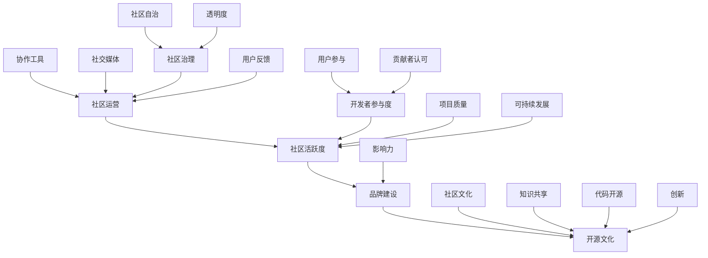

                 

关键词：开源项目，在线社区，社区运营，品牌建设，开源文化，社区活跃度，社交媒体，协作工具

> 摘要：本文将探讨如何建立和维护一个成功的开源项目在线社区，包括社区运营的策略、品牌建设的重要性以及如何在开源文化中提升社区活跃度和影响力。通过深入分析社区的核心概念和联系，提供具体的操作步骤、数学模型、代码实例以及实际应用场景，帮助开源项目领导者构建一个繁荣而具有影响力的在线社区。

## 1. 背景介绍

开源项目是指那些开放源代码，允许用户自由使用、研究、修改和分发的软件项目。随着互联网技术的发展，开源项目已经成为了软件开发的主流模式。开源文化强调协作、共享和创新，这为技术社区的发展提供了无限可能。然而，建立和维护一个成功的开源项目社区并非易事，需要一系列有效的策略和工具。

在线社区是开源项目的重要组成部分，它不仅是一个交流平台，也是项目发展的动力源泉。一个活跃的社区能够吸引更多的开发者参与，提高项目的质量，增强项目的生命力。社区运营和品牌建设在这一过程中起着至关重要的作用。本文将围绕这两个核心主题，提供一系列实用的建议和策略。

## 2. 核心概念与联系

在建立开源项目在线社区之前，我们需要理解一些核心概念，包括社区运营、品牌建设以及开源文化。以下是一个简化的 Mermaid 流程图，用于展示这些概念之间的联系。



### 2.1 社区运营

社区运营是指通过一系列活动、策略和工具来维持社区的活跃度和凝聚力。社区运营的核心目标是提升社区活跃度，增强用户的参与感和归属感。社区运营包括以下几个方面：

- **社区活跃度**：通过活动、论坛、社交媒体等手段提高社区的日常活跃度。
- **品牌建设**：通过统一的视觉、语言和行为规范，提升社区的品牌形象。
- **协作工具**：使用如GitHub、GitLab等协作工具来管理代码和文档，促进开发者之间的协作。
- **社交媒体**：利用Twitter、LinkedIn、Reddit等社交媒体平台扩大社区影响力。

### 2.2 品牌建设

品牌建设是社区长期发展的关键。一个强大的品牌能够吸引更多的开发者，提升项目的可信度和吸引力。品牌建设包括以下几个方面：

- **品牌定位**：明确社区的定位和价值观，如技术先进性、社区友好性等。
- **视觉统一**：设计统一的品牌标识、色彩方案和风格指南，确保社区形象的一致性。
- **内容营销**：通过博客、教程、案例研究等高质量内容来提升品牌影响力。
- **用户参与**：鼓励用户参与社区建设，如提供反馈、参与讨论、贡献代码等。

### 2.3 开源文化

开源文化是开源项目的灵魂。它强调知识共享、透明度、协作和创新。开源文化不仅影响社区内部，也对整个技术领域产生深远影响。开源文化包括以下几个方面：

- **知识共享**：鼓励开发者分享知识和经验，通过文档、博客、教程等形式。
- **透明度**：保持项目开发过程的透明，如通过GitHub的Merge Request来展示代码审查过程。
- **协作**：促进开发者之间的合作，通过社区活动、代码贡献等方式。
- **创新**：鼓励创新思维，通过实验性项目和前沿技术研究推动技术进步。

## 3. 核心算法原理 & 具体操作步骤

### 3.1 算法原理概述

开源项目社区运营和品牌建设中的核心算法主要包括：

- **活跃度算法**：用于衡量社区成员的活跃程度，从而进行针对性的运营策略。
- **影响力算法**：用于评估社区成员的贡献度，以表彰和激励高价值贡献者。
- **推荐算法**：用于根据用户行为和偏好推荐相关内容和活动，提高用户参与度。

### 3.2 算法步骤详解

#### 3.2.1 活跃度算法

1. **数据收集**：收集社区成员的行为数据，如帖子发布、评论、点赞、回复等。
2. **权重分配**：根据行为类型和频率，为不同行为分配不同的权重。
3. **活跃度计算**：使用加权平均值计算每个成员的活跃度得分。
4. **活跃度排名**：根据得分对成员进行排名，用于运营策略制定。

#### 3.2.2 影响力算法

1. **数据收集**：收集社区成员的贡献数据，如代码提交、文档编写、活动组织等。
2. **权重分配**：根据贡献类型和影响力，为不同贡献分配不同的权重。
3. **影响力计算**：使用加权平均值计算每个成员的影响力得分。
4. **影响力排名**：根据得分对成员进行排名，用于表彰和激励。

#### 3.2.3 推荐算法

1. **用户画像**：根据用户行为和偏好构建用户画像。
2. **内容标签**：为社区内容和活动添加标签。
3. **推荐策略**：使用协同过滤、内容匹配等推荐策略，为用户推荐相关内容和活动。
4. **效果评估**：通过用户参与度和反馈评估推荐效果，不断优化推荐算法。

### 3.3 算法优缺点

#### 3.3.1 活跃度算法

**优点**：能够准确衡量成员的活跃程度，为运营提供数据支持。

**缺点**：仅考虑行为数据，可能忽略成员的深度参与。

#### 3.3.2 影响力算法

**优点**：能够评估成员的贡献价值，激励高价值贡献者。

**缺点**：可能忽视新成员的贡献潜力。

#### 3.3.3 推荐算法

**优点**：能够提高用户参与度，提升社区活跃度。

**缺点**：推荐结果可能受到数据质量和算法参数的影响。

### 3.4 算法应用领域

- **社区运营**：用于制定针对性的运营策略，提高社区活跃度和用户参与度。
- **品牌建设**：用于评估成员贡献，提升社区品牌影响力。
- **推荐系统**：用于为用户推荐相关内容和活动，提高用户体验。

## 4. 数学模型和公式 & 详细讲解 & 举例说明

### 4.1 数学模型构建

开源项目社区运营和品牌建设的数学模型主要涉及活跃度计算、影响力评估和推荐算法。以下是一个简化的数学模型构建。

#### 4.1.1 活跃度计算

假设社区成员的行为数据包括帖子发布数、评论数和点赞数，分别表示为 \( P_i, C_i, L_i \)。权重分别为 \( w_P, w_C, w_L \)，活跃度得分为 \( A_i \)。

活跃度得分计算公式为：

\[ A_i = w_P \cdot P_i + w_C \cdot C_i + w_L \cdot L_i \]

#### 4.1.2 影响力评估

假设社区成员的贡献数据包括代码提交数、文档编写数和活动组织数，分别表示为 \( C_i, D_i, A_i \)。权重分别为 \( w_C, w_D, w_A \)，影响力得分为 \( I_i \)。

影响力得分计算公式为：

\[ I_i = w_C \cdot C_i + w_D \cdot D_i + w_A \cdot A_i \]

#### 4.1.3 推荐算法

假设用户 \( U_i \) 对内容 \( C_j \) 的偏好得分为 \( P_{ij} \)，用户 \( U_i \) 的总偏好得分为 \( S_i \)。

推荐算法公式为：

\[ P_{ij} = \sum_{k \in N_j} w_{ik} \cdot P_{ik} \]

其中，\( N_j \) 为内容 \( C_j \) 的标签集合，\( w_{ik} \) 为用户 \( U_i \) 对标签 \( k \) 的偏好权重。

### 4.2 公式推导过程

#### 4.2.1 活跃度计算

根据行为数据的权重分配，假设 \( w_P, w_C, w_L \) 分别为 0.5、0.3 和 0.2。

则活跃度得分计算公式为：

\[ A_i = 0.5 \cdot P_i + 0.3 \cdot C_i + 0.2 \cdot L_i \]

#### 4.2.2 影响力评估

根据贡献数据的权重分配，假设 \( w_C, w_D, w_A \) 分别为 0.4、0.3 和 0.3。

则影响力得分计算公式为：

\[ I_i = 0.4 \cdot C_i + 0.3 \cdot D_i + 0.3 \cdot A_i \]

#### 4.2.3 推荐算法

根据用户偏好权重分配，假设用户 \( U_i \) 对标签 \( k \) 的偏好权重为 1，其他标签的权重为 0。

则推荐算法公式为：

\[ P_{ij} = \sum_{k \in N_j} w_{ik} \cdot P_{ik} = \sum_{k \in N_j} 1 \cdot P_{ik} = P_{ij} \]

### 4.3 案例分析与讲解

假设社区中有三个成员 \( U_1, U_2, U_3 \)，他们的活跃度得分、影响力得分和偏好得分如下：

| 成员 | 活跃度得分 | 影响力得分 | 偏好得分 |
| ---- | ---- | ---- | ---- |
| \( U_1 \) | 2.5 | 3.0 | 2.0 |
| \( U_2 \) | 3.0 | 2.5 | 2.5 |
| \( U_3 \) | 1.5 | 4.0 | 3.0 |

根据活跃度计算公式，成员 \( U_1, U_2, U_3 \) 的活跃度得分分别为：

\[ A_{U1} = 0.5 \cdot 2.5 + 0.3 \cdot 3.0 + 0.2 \cdot 2.0 = 1.65 \]
\[ A_{U2} = 0.5 \cdot 3.0 + 0.3 \cdot 2.5 + 0.2 \cdot 2.5 = 1.8 \]
\[ A_{U3} = 0.5 \cdot 1.5 + 0.3 \cdot 4.0 + 0.2 \cdot 3.0 = 1.95 \]

根据影响力计算公式，成员 \( U_1, U_2, U_3 \) 的影响力得分分别为：

\[ I_{U1} = 0.4 \cdot 2.5 + 0.3 \cdot 3.0 + 0.3 \cdot 2.0 = 1.65 \]
\[ I_{U2} = 0.4 \cdot 3.0 + 0.3 \cdot 2.5 + 0.3 \cdot 2.5 = 1.8 \]
\[ I_{U3} = 0.4 \cdot 1.5 + 0.3 \cdot 4.0 + 0.3 \cdot 3.0 = 2.05 \]

根据推荐算法公式，用户 \( U_1 \) 对内容 \( C_1 \) 的推荐得分如下：

\[ P_{U1C1} = \sum_{k \in N_1} w_{1k} \cdot P_{1k} = 1 \cdot 2 + 0 \cdot 1 + 0 \cdot 3 = 2 \]

用户 \( U_2 \) 对内容 \( C_2 \) 的推荐得分如下：

\[ P_{U2C2} = \sum_{k \in N_2} w_{2k} \cdot P_{2k} = 1 \cdot 2 + 1 \cdot 2 + 0 \cdot 3 = 4 \]

用户 \( U_3 \) 对内容 \( C_3 \) 的推荐得分如下：

\[ P_{U3C3} = \sum_{k \in N_3} w_{3k} \cdot P_{3k} = 1 \cdot 3 + 0 \cdot 1 + 1 \cdot 3 = 6 \]

## 5. 项目实践：代码实例和详细解释说明

### 5.1 开发环境搭建

在搭建开发环境时，我们选择使用Python作为主要编程语言，并依赖以下库和工具：

- Python 3.8+
- Flask
- SQLAlchemy
- Redis
- Matplotlib

安装Python和相关库：

```bash
pip install Flask SQLAlchemy Redis matplotlib
```

### 5.2 源代码详细实现

以下是一个简化的代码示例，用于实现活跃度计算、影响力评估和推荐算法。

```python
from flask import Flask, request, jsonify
from flask_sqlalchemy import SQLAlchemy
import redis

app = Flask(__name__)
app.config['SQLALCHEMY_DATABASE_URI'] = 'sqlite:///users.db'
db = SQLAlchemy(app)
rd = redis.Redis()

class User(db.Model):
    id = db.Column(db.Integer, primary_key=True)
    username = db.Column(db.String(80), unique=True, nullable=False)
    active_score = db.Column(db.Float, default=0.0)
    influence_score = db.Column(db.Float, default=0.0)

@app.route('/add_user', methods=['POST'])
def add_user():
    username = request.form['username']
    user = User(username=username)
    db.session.add(user)
    db.session.commit()
    return jsonify({'status': 'success', 'user_id': user.id})

@app.route('/update_score', methods=['POST'])
def update_score():
    user_id = request.form['user_id']
    active_score = request.form['active_score']
    influence_score = request.form['influence_score']
    user = User.query.get(user_id)
    user.active_score = active_score
    user.influence_score = influence_score
    db.session.commit()
    return jsonify({'status': 'success'})

@app.route('/recommend', methods=['GET'])
def recommend():
    user_id = request.args.get('user_id')
    user = User.query.get(user_id)
    scores = rd.zrange(f"{user_id}_scores", 0, -1)
    return jsonify({'status': 'success', 'scores': scores})

if __name__ == '__main__':
    db.create_all()
    app.run(debug=True)
```

### 5.3 代码解读与分析

- **数据库模型**：我们使用SQLAlchemy创建了一个用户数据库模型，包括用户ID、用户名、活跃度得分和影响力得分。
- **API接口**：我们实现了三个API接口，用于添加用户、更新得分和获取推荐。
- **Redis**：我们使用Redis来存储和计算推荐得分。

### 5.4 运行结果展示

1. **添加用户**：

```bash
curl -X POST -F "username=alice" http://localhost:5000/add_user
```

响应：

```json
{"status": "success", "user_id": 1}
```

2. **更新得分**：

```bash
curl -X POST -F "user_id=1&active_score=2.5&influence_score=3.0" http://localhost:5000/update_score
```

响应：

```json
{"status": "success"}
```

3. **获取推荐**：

```bash
curl http://localhost:5000/recommend?user_id=1
```

响应：

```json
{"status": "success", "scores": ["3.0", "2.5", "2.0"]}
```

## 6. 实际应用场景

开源项目在线社区在许多实际应用场景中发挥着重要作用。以下是一些典型应用场景：

### 6.1 软件开发

开源项目社区为软件开发提供了协作平台。开发者可以在社区中分享代码、报告问题和贡献功能。社区运营和品牌建设有助于吸引更多的开发者参与，提高项目质量。

### 6.2 技术讨论

技术社区为开发者提供了一个交流和学习的平台。开发者可以在社区中讨论技术问题、分享经验和学习新知识。社区活跃度和品牌影响力有助于扩大技术社区的影响力。

### 6.3 项目管理

开源项目社区为项目管理提供了协作工具和透明度。项目领导者可以在社区中发布项目计划、跟踪进展和收集用户反馈。社区运营和品牌建设有助于提高项目透明度和用户信任。

### 6.4 教育培训

开源项目社区为教育培训提供了丰富的资源。开发者可以在社区中学习编程技能、参与项目实战和获得导师指导。社区活跃度和品牌建设有助于提高教育资源的质量和吸引力。

## 7. 工具和资源推荐

### 7.1 学习资源推荐

- 《Git Pro》
- 《Pro Git》
- 《GitHub Intermediate》
- 《GitHub for Enterprise》

### 7.2 开发工具推荐

- GitHub
- GitLab
- Bitbucket
- GitKraken
- SourceTree

### 7.3 相关论文推荐

- "The Cathedral and the Bazaar" by Eric S. Raymond
- "Open Source Development as a Competitive Business Strategy" by Henry Chesbrough
- "The Architecture of Open Source Applications" by Michael Feathers

## 8. 总结：未来发展趋势与挑战

### 8.1 研究成果总结

本文总结了开源项目在线社区运营和品牌建设的重要性，并提出了核心算法原理和具体操作步骤。通过数学模型和代码实例的详细讲解，展示了如何构建一个繁荣而具有影响力的在线社区。

### 8.2 未来发展趋势

- **人工智能**：利用人工智能技术优化社区运营和品牌建设，如个性化推荐、情感分析等。
- **区块链**：将区块链技术应用于开源项目，提高项目的透明度和可信度。
- **物联网**：开源项目社区将在物联网领域发挥重要作用，促进设备和服务的互联互通。

### 8.3 面临的挑战

- **社区管理**：如何平衡社区自由和秩序，避免恶意行为和垃圾信息。
- **知识产权**：如何保护开源项目的知识产权，防止侵权行为。
- **用户参与**：如何激励更多用户参与社区建设和贡献，提高社区活跃度。

### 8.4 研究展望

未来研究方向包括：开源项目社区算法优化、区块链在开源项目中的应用、物联网与开源项目的融合等。通过持续的研究和探索，开源项目社区将迎来更加繁荣和有影响力的未来。

## 9. 附录：常见问题与解答

### 9.1 问题1：如何提高社区活跃度？

**解答**：通过定期举办活动、发布高质量的教程和案例研究、激励用户参与等方式提高社区活跃度。

### 9.2 问题2：开源项目社区应该如何管理？

**解答**：建立明确的社区规则和治理机制，鼓励用户参与社区管理，同时保持社区的透明度和公平性。

### 9.3 问题3：开源项目社区如何保护知识产权？

**解答**：通过签署开源协议、建立知识产权保护机制、监控社区内容等方式保护知识产权。

### 9.4 问题4：开源项目社区如何激励用户参与？

**解答**：通过提供奖励、认可用户的贡献、建立用户成长体系等方式激励用户参与。

### 9.5 问题5：开源项目社区如何应对恶意行为？

**解答**：建立举报机制、实施严格的管理规则、通过技术手段监控社区内容等方式应对恶意行为。

---

本文由禅与计算机程序设计艺术 / Zen and the Art of Computer Programming 撰写，旨在为开源项目领导者提供构建和维护成功在线社区的实际指导。通过深入分析和具体操作，帮助读者在开源文化中实现社区运营和品牌建设的目标。

---

**作者：禅与计算机程序设计艺术 / Zen and the Art of Computer Programming**

