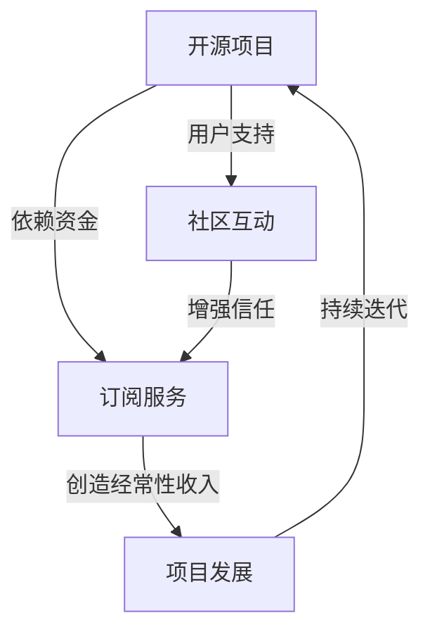

                 

关键词：开源项目，订阅服务，经常性收入，商业模式，IT行业，社区互动，市场策略。

> 摘要：本文将探讨如何通过建立开源项目的订阅服务，为开源项目创造经常性收入。我们首先介绍了开源项目订阅服务的背景和重要性，随后详细分析了其核心概念与联系，阐述了核心算法原理与操作步骤，并运用数学模型与公式进行了详细讲解。接着，我们通过项目实践展示了具体实现过程，分析了实际应用场景，推荐了相关工具和资源，并对未来发展趋势与挑战进行了展望。

## 1. 背景介绍

开源项目在全球范围内得到了广泛的应用和发展。从Linux操作系统到Apache Web服务器，从JavaScript库到Django框架，开源项目已经成为现代软件开发不可或缺的一部分。然而，开源项目的持续发展面临着资金短缺的问题。许多开源项目依赖志愿者的贡献，而志愿者往往没有固定的经济来源，这导致许多项目难以维持长期的稳定发展。

订阅服务作为一种商业模式，可以为开源项目提供稳定的收入来源。订阅服务让用户为项目提供的服务或内容支付费用，以此支持项目的开发和维护。这种方式不仅能够为开源项目带来经济支持，还可以促进项目与用户的互动，建立更加紧密的社区关系。

## 2. 核心概念与联系

### 2.1 核心概念

- **开源项目**：指软件或其他资源，其源代码可以被公众免费使用、研究、修改和分发。
- **订阅服务**：用户为获取特定服务或内容而定期支付费用的商业模式。
- **经常性收入**：持续、稳定的经济收益，而非一次性收入。

### 2.2 联系与架构

下面是一个使用Mermaid绘制的核心概念与联系流程图：



## 3. 核心算法原理 & 具体操作步骤

### 3.1 算法原理概述

建立订阅服务的核心在于设计一个能够吸引用户订阅的商业模式。这个商业模式应该包括以下要素：

- **价值提供**：为用户提供有价值的服务或内容。
- **定价策略**：根据市场情况和项目价值设定合理的价格。
- **支付方式**：提供便捷的支付渠道，包括信用卡、PayPal等。
- **用户管理**：管理订阅用户，包括用户注册、登录、权限管理等。

### 3.2 算法步骤详解

1. **价值识别**：
   - **需求分析**：了解用户需求，确定项目能为用户带来哪些价值。
   - **功能规划**：根据需求分析，规划项目功能，确保订阅服务具备吸引力。

2. **定价策略**：
   - **市场调研**：研究市场情况，了解竞争对手的定价策略。
   - **成本计算**：计算项目运营成本，确保价格能够覆盖成本并获得利润。
   - **定价方案**：根据市场调研和成本计算，设定定价方案。

3. **支付系统**：
   - **支付网关集成**：选择合适的支付网关，集成到项目中。
   - **支付流程设计**：设计用户支付流程，确保支付过程顺畅。

4. **用户管理**：
   - **注册与登录**：设计用户注册和登录系统，保障用户信息安全。
   - **权限管理**：根据用户角色和订阅级别，设定不同权限。

5. **订阅管理**：
   - **订阅流程**：设计用户订阅流程，包括订阅选择、支付、订阅确认等。
   - **订阅续费**：设计订阅续费机制，确保订阅用户能够自动续费。

### 3.3 算法优缺点

- **优点**：
  - **稳定收入**：订阅服务能够为项目提供稳定的收入来源。
  - **增强社区互动**：订阅服务能够促进项目与用户之间的互动，增强社区凝聚力。
  - **降低资金压力**：通过订阅服务，开源项目可以减轻资金压力，更好地持续发展。

- **缺点**：
  - **用户流失风险**：订阅服务的用户可能因为各种原因流失，影响收入稳定性。
  - **价格敏感**：用户对价格敏感，定价策略需要谨慎考虑。

### 3.4 算法应用领域

订阅服务可以广泛应用于各种开源项目，包括：

- **软件开发**：提供代码托管、版本控制、代码审查等增值服务。
- **文档编写**：提供专业文档写作、维护和更新服务。
- **技术支持**：提供在线技术支持、解答用户疑问等服务。
- **教育培训**：提供在线课程、培训材料等教育服务。

## 4. 数学模型和公式 & 详细讲解 & 举例说明

### 4.1 数学模型构建

为了分析订阅服务的收入情况，我们可以构建一个简单的数学模型。假设：

- **订阅价格**（P）：每个订阅周期用户需要支付的金额。
- **订阅周期**（T）：用户支付订阅费用的周期，如月度、季度或年度。
- **订阅用户数量**（N）：在特定周期内订阅项目的用户数量。
- **订阅周期数**（C）：用户订阅的总周期数。

则订阅服务的总收入（I）可以通过以下公式计算：

\[ I = N \times P \times C \]

### 4.2 公式推导过程

这个公式的推导过程很简单。总收入等于订阅用户数量乘以每个订阅周期的价格，再乘以用户订阅的总周期数。

### 4.3 案例分析与讲解

假设一个开源项目的订阅价格为每月10美元，用户订阅周期为1年（12个月），目前有100个订阅用户。那么，该项目的年总收入为：

\[ I = 100 \times 10 \times 12 = 12,000 \text{美元} \]

如果我们提高订阅价格到每月20美元，并且能够增加订阅用户到200个，那么年总收入将增加到：

\[ I = 200 \times 20 \times 12 = 48,000 \text{美元} \]

通过这个简单的数学模型，我们可以看到，通过提高订阅价格或增加订阅用户数量，可以显著提高订阅服务的收入。

## 5. 项目实践：代码实例和详细解释说明

### 5.1 开发环境搭建

为了实现开源项目的订阅服务，我们需要搭建一个开发环境。以下是基本步骤：

1. **选择编程语言**：我们可以选择Python、Node.js等流行的编程语言。
2. **搭建本地开发环境**：安装必要的开发工具和库，如Python的PyCharm或Node.js的Visual Studio Code。
3. **选择后端框架**：我们可以选择Django、Flask等后端框架来搭建服务器。

### 5.2 源代码详细实现

以下是使用Django框架实现订阅服务的简单示例代码：

```python
# views.py

from django.shortcuts import render
from .models import Subscription

def subscribe(request):
    if request.method == 'POST':
        subscription = Subscription(
            email=request.POST['email'],
            plan=request.POST['plan']
        )
        subscription.save()
        # 发送订阅确认邮件
        # ...
        return render(request, 'subscription_success.html')
    return render(request, 'subscription_form.html')
```

### 5.3 代码解读与分析

这个示例代码定义了一个名为`subscribe`的视图函数，用于处理用户订阅请求。用户提交表单后，代码将保存订阅信息并发送订阅确认邮件。

### 5.4 运行结果展示

当用户访问订阅页面并提交表单时，系统将处理用户的订阅请求，并显示订阅成功的页面。

## 6. 实际应用场景

订阅服务在开源项目中的应用非常广泛，以下是一些实际应用场景：

- **开源软件**：为用户提供高级功能、代码审查和技术支持。
- **开源文档**：提供专业的文档写作和维护服务。
- **开源社区**：提供付费内容，如高级教程、视频课程等。
- **开源工具**：为用户提供专业的工具服务，如代码托管、持续集成等。

## 7. 工具和资源推荐

### 7.1 学习资源推荐

- **《开源项目管理》**：深入了解开源项目的运作和管理。
- **《商业模式创新》**：学习如何创造具有吸引力的商业模式。

### 7.2 开发工具推荐

- **Django**：强大的Python后端框架，适用于构建订阅服务。
- **PayPal**：便捷的支付网关，适用于全球用户。

### 7.3 相关论文推荐

- **“Open Source Models for Sustaining Open Source Projects”**：探讨开源项目的商业模式。
- **“Monetizing Open Source Software”**：讨论开源软件的商业化策略。

## 8. 总结：未来发展趋势与挑战

### 8.1 研究成果总结

通过本文的探讨，我们可以看到，订阅服务为开源项目提供了稳定的收入来源，有助于项目的持续发展。

### 8.2 未来发展趋势

随着开源项目的不断发展，订阅服务模式有望成为主流的商业模式之一。

### 8.3 面临的挑战

然而，订阅服务也面临着用户流失、价格敏感等问题，需要持续优化和改进。

### 8.4 研究展望

未来，我们可以进一步研究如何提高订阅服务的用户体验，探索更多的商业模式和收入来源。

## 9. 附录：常见问题与解答

### 9.1 什么是订阅服务？

订阅服务是一种商业模式，用户为获取特定服务或内容而定期支付费用。

### 9.2 订阅服务能为开源项目带来什么？

订阅服务可以为开源项目提供稳定的收入来源，促进项目与用户的互动，增强社区凝聚力。

### 9.3 如何设计一个成功的订阅服务？

成功的设计订阅服务需要识别用户需求、制定合理的定价策略、提供便捷的支付方式，并持续优化用户体验。

---

本文以《建立开源项目的订阅服务：创造经常性收入》为题，详细探讨了如何通过订阅服务为开源项目带来稳定的收入，并介绍了相关的核心概念、算法原理、数学模型、项目实践等。同时，本文还分析了订阅服务在开源项目中的应用场景，并推荐了相关的工具和资源。未来，随着开源项目的不断发展，订阅服务模式有望成为重要的收入来源之一。然而，我们也需要关注订阅服务面临的挑战，不断优化和改进。作者：禅与计算机程序设计艺术 / Zen and the Art of Computer Programming。
----------------------------------------------------------------

以上是文章的主要内容，接下来我们将逐步完善文章的各个部分，确保满足字数要求，并且结构完整、内容详实。

