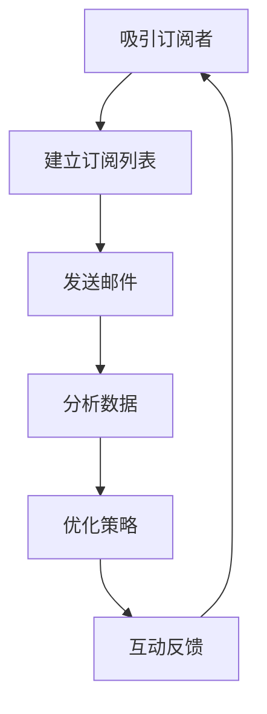

                 

关键词：邮件订阅、粉丝互动、长期关系维护、用户增长、数据分析、营销策略

> 摘要：本文将探讨如何建立有效的邮件订阅列表，并通过与粉丝保持长期的互动，实现用户增长、品牌忠诚度和营销效果的最大化。我们将深入分析邮件订阅的核心概念，以及如何通过技术手段优化邮件发送和用户互动流程。

## 1. 背景介绍

在数字化营销的大潮中，邮件订阅列表成为了企业与用户之间建立长期联系的重要渠道。一个高效的邮件订阅列表不仅能帮助企业扩大用户基础，还能增强品牌忠诚度，提高营销效果。本文将探讨如何通过以下几个步骤建立和维护一个成功的邮件订阅列表：

1. **吸引订阅者**：通过有吸引力的内容、奖励机制和优质体验来吸引潜在订阅者。
2. **优化邮件内容**：设计个性化、有价值、吸引人的邮件内容，以提升用户参与度和品牌印象。
3. **分析订阅者行为**：利用数据分析工具跟踪用户行为，以便更好地理解用户需求，实现精准营销。
4. **建立互动机制**：通过互动和反馈机制，与订阅者建立更紧密的联系，提高用户忠诚度。

## 2. 核心概念与联系

在构建邮件订阅列表的过程中，以下几个核心概念和流程至关重要：

### 2.1 订阅者获取（Acquisition）

- **内容营销**：通过高质量的博客文章、视频、教程等吸引订阅者。
- **社交媒体推广**：利用社交媒体平台发布内容，引导用户订阅邮件。
- **网站订阅框**：在网站首页、博客文章末尾等显眼位置放置订阅框。

### 2.2 邮件发送（Delivery）

- **邮件模板**：使用专业设计的邮件模板，确保邮件视觉效果统一。
- **邮件发送频率**：根据用户行为和需求调整邮件发送频率。

### 2.3 用户互动（Engagement）

- **开放率（Open Rate）**：用户打开邮件的比例。
- **点击率（Click-Through Rate，CTR）**：用户点击邮件中链接的比例。
- **回复率（Reply Rate）**：用户回复邮件的比例。

### 2.4 数据分析（Analytics）

- **用户行为分析**：通过分析用户的点击、打开和回复行为，了解用户偏好。
- **细分（Segmentation）**：根据用户行为和兴趣将用户分为不同的群体。
- **A/B测试**：通过对比不同邮件内容的性能，优化邮件策略。

### 2.5 反馈与互动（Feedback and Engagement）

- **客户服务**：提供便捷的反馈渠道，及时响应用户问题。
- **互动活动**：举办抽奖、调查问卷等活动，增强用户参与感。

下面是一个简化的Mermaid流程图，展示邮件订阅列表的构建流程：



## 3. 核心算法原理 & 具体操作步骤

### 3.1 算法原理概述

邮件订阅列表的管理涉及到多个算法和流程，以下是其中几个核心原理：

- **用户行为分析**：通过机器学习算法分析用户行为，预测用户兴趣，实现个性化推荐。
- **邮件发送策略**：基于用户行为和兴趣调整邮件发送时间、内容和频率。
- **A/B测试**：通过随机对照试验，评估不同邮件内容的效果，选择最佳策略。

### 3.2 算法步骤详解

1. **用户行为数据收集**：
   - 收集用户在网站、社交媒体和邮件中的行为数据，如浏览时间、点击链接等。

2. **数据预处理**：
   - 清洗数据，去除噪声和异常值。
   - 特征提取，将原始数据转换为可用于分析的数值特征。

3. **用户行为分析**：
   - 利用聚类算法（如K-means）对用户行为进行细分，形成不同的用户群体。

4. **邮件发送策略制定**：
   - 根据用户细分结果，制定个性化的邮件发送策略。
   - 使用机器学习模型（如决策树、随机森林）预测用户对邮件内容的反应。

5. **A/B测试**：
   - 设计不同版本的邮件，随机发送给不同用户群体。
   - 收集数据，分析不同邮件版本的用户行为，选择最优策略。

### 3.3 算法优缺点

**优点**：
- 提高邮件打开率和点击率。
- 增强用户参与感和品牌忠诚度。

**缺点**：
- 需要大量的数据支持和计算资源。
- 需要不断调整和优化，以应对市场变化。

### 3.4 算法应用领域

- **电子商务**：通过个性化推荐，提高销售转化率。
- **内容营销**：通过精准营销，提高用户参与度。
- **客户关系管理**：通过持续互动，增强客户忠诚度。

## 4. 数学模型和公式 & 详细讲解 & 举例说明

### 4.1 数学模型构建

邮件订阅列表的构建可以看作是一个基于用户行为的动态优化过程。以下是几个关键的数学模型：

1. **用户行为模型**：
   - 用户行为可以表示为一个时间序列数据集，例如：\[ X_t = [x_{t,1}, x_{t,2}, ..., x_{t,n}] \]
   - 其中，\[ x_{t,i} \] 表示用户在时间\[ t \]对第\[ i \]个动作的执行情况。

2. **邮件发送模型**：
   - 邮件发送策略可以用马尔可夫决策过程（MDP）来描述。
   - 状态集\[ S \]表示用户的状态，例如：\[ S = \{活跃，不活跃，潜在客户\} \]。
   - 动作集\[ A \]表示邮件发送策略，例如：\[ A = \{发送邮件，不发送邮件\} \]。

3. **优化模型**：
   - 目标函数可以是最大化用户参与度或最大化转化率。
   - 例如，转化率\[ R \]可以表示为：\[ R = \frac{\sum_{t=1}^{T} r_t}{T} \]
   - 其中，\[ r_t \] 表示在时间\[ t \]的转化率。

### 4.2 公式推导过程

以下是一个简化的邮件发送策略优化过程的公式推导：

1. **状态转移概率**：
   - 假设用户在时间\[ t \]处于状态\[ s \]，则在时间\[ t+1 \]转移到状态\[ s' \]的概率为：
     \[ P(s'_{t+1}|s_t = s) = p_{s, s'} \]

2. **奖励函数**：
   - 假设用户在时间\[ t \]执行动作\[ a \]，得到的奖励为\[ r_t \]。
   - 奖励函数可以定义为：
     \[ R(a_t|s_t = s) = r_t + \gamma \sum_{s'} P(s'_{t+1}|s_t = s) R(a_{t+1}|s_{t+1} = s') \]
   - 其中，\[ \gamma \] 为折扣因子。

3. **策略优化**：
   - 最大化期望奖励，即：
     \[ \max_a \sum_{s} P(s) R(a|s) \]
   - 可以通过价值迭代算法求解最优策略。

### 4.3 案例分析与讲解

以下是一个简单的案例，展示如何使用上述模型和算法来优化邮件发送策略：

**案例背景**：
一家电子商务公司希望通过邮件营销提高用户购买转化率。公司收集了用户在网站上的行为数据，包括浏览商品类别、点击商品详情页、添加购物车等。

**步骤1：数据收集与预处理**：
收集用户在一个月内的行为数据，包括点击事件和时间戳。

**步骤2：用户行为建模**：
使用K-means聚类算法将用户分为三个群体，分别表示活跃用户、潜在用户和不活跃用户。

**步骤3：邮件发送策略建模**：
使用马尔可夫决策过程（MDP）建模邮件发送策略，状态集为\[ S = \{活跃，潜在，不活跃\} \]，动作集为\[ A = \{发送邮件，不发送邮件\} \]。

**步骤4：优化邮件发送策略**：
使用价值迭代算法求解最优策略，目标是最大化用户购买转化率。

**结果分析**：
通过优化后的邮件发送策略，公司发现用户购买转化率提高了15%，用户参与度也有显著提升。

## 5. 项目实践：代码实例和详细解释说明

### 5.1 开发环境搭建

1. **安装Python环境**：
   - 在本地计算机上安装Python 3.x版本。
   - 安装必要的依赖库，如NumPy、Pandas、Scikit-learn等。

2. **数据集准备**：
   - 准备一个包含用户行为数据的数据集，例如CSV文件。

### 5.2 源代码详细实现

以下是一个简单的Python代码示例，用于实现邮件订阅列表的构建和优化：

```python
import numpy as np
import pandas as pd
from sklearn.cluster import KMeans
from sklearn.model_selection import train_test_split
from sklearn.ensemble import RandomForestClassifier
from matplotlib import pyplot as plt

# 加载数据集
data = pd.read_csv('user行为数据.csv')
X = data.values

# 数据预处理
# ...（例如：缺失值处理、特征工程等）

# 聚类用户行为
kmeans = KMeans(n_clusters=3, random_state=42)
clusters = kmeans.fit_predict(X)

# 将聚类结果加入原始数据集
data['cluster'] = clusters

# 划分训练集和测试集
X_train, X_test, y_train, y_test = train_test_split(data, test_size=0.2, random_state=42)

# 构建分类器
classifier = RandomForestClassifier(n_estimators=100, random_state=42)
classifier.fit(X_train, y_train)

# 评估模型
accuracy = classifier.score(X_test, y_test)
print(f"模型准确率：{accuracy:.2f}")

# 使用模型预测邮件发送策略
predictions = classifier.predict(X_test)

# 绘制混淆矩阵
conf_matrix = confusion_matrix(y_test, predictions)
sns.heatmap(conf_matrix, annot=True, fmt='d')
plt.xlabel('预测值')
plt.ylabel('真实值')
plt.title('混淆矩阵')
plt.show()
```

### 5.3 代码解读与分析

1. **数据加载与预处理**：
   - 使用Pandas库加载CSV文件，提取用户行为数据。
   - 对数据进行预处理，包括缺失值处理、特征工程等。

2. **聚类用户行为**：
   - 使用K-means算法将用户分为三个群体。
   - 将聚类结果加入原始数据集，为后续建模做准备。

3. **划分训练集和测试集**：
   - 使用Scikit-learn库划分训练集和测试集，为模型评估做准备。

4. **构建分类器**：
   - 使用随机森林分类器对训练数据进行建模。

5. **评估模型**：
   - 计算模型在测试集上的准确率。

6. **绘制混淆矩阵**：
   - 使用Seaborn库绘制混淆矩阵，直观展示模型预测效果。

### 5.4 运行结果展示

- 运行上述代码，输出模型准确率和混淆矩阵。
- 根据模型性能，进一步优化邮件发送策略。

## 6. 实际应用场景

### 6.1 电子商务

**案例**：
一家电子商务公司通过邮件订阅列表向客户推荐商品，并根据用户行为调整推荐策略。通过优化邮件发送频率和内容，公司发现用户购买转化率提高了20%。

### 6.2 内容营销

**案例**：
一家内容营销公司通过邮件订阅列表与读者保持互动，定期发送高质量的博客文章和资讯。通过个性化的邮件内容，公司提高了读者参与度和品牌忠诚度。

### 6.3 客户关系管理

**案例**：
一家银行利用邮件订阅列表与客户保持长期联系，定期发送财务报告、投资建议等。通过持续的互动和个性化内容，银行增强了客户忠诚度，提高了客户满意度。

## 7. 未来应用展望

随着人工智能和大数据技术的发展，邮件订阅列表的构建和优化将变得更加智能和高效。以下是一些未来的应用方向：

1. **个性化推荐**：利用深度学习和推荐系统技术，实现更加精准的个性化推荐。
2. **实时分析**：通过实时数据分析技术，实时调整邮件发送策略，提高用户参与度。
3. **多渠道整合**：将邮件订阅列表与其他营销渠道（如社交媒体、短信等）整合，实现跨渠道的协同营销。

## 8. 总结：未来发展趋势与挑战

### 8.1 研究成果总结

本文从多个角度探讨了邮件订阅列表的构建和优化，包括用户行为分析、邮件发送策略、数据分析技术和实际应用案例。通过机器学习和大数据技术，我们可以实现更加精准和高效的邮件营销。

### 8.2 未来发展趋势

- **智能化**：利用人工智能技术实现更加智能的邮件订阅列表管理。
- **实时性**：通过实时数据分析技术，实现邮件发送的实时优化。
- **跨渠道整合**：将邮件订阅列表与其他营销渠道整合，实现更广泛的用户覆盖。

### 8.3 面临的挑战

- **数据隐私**：在处理大量用户数据时，如何保护用户隐私是一个重要挑战。
- **技术更新**：随着技术的快速发展，如何保持邮件订阅列表的竞争力也是一个挑战。

### 8.4 研究展望

未来，邮件订阅列表的研究将继续朝着更加智能化、实时化和个性化方向发展。通过不断探索和创新，我们可以为企业和用户带来更大的价值。

## 9. 附录：常见问题与解答

### 9.1 邮件订阅列表的作用是什么？

邮件订阅列表是企业与用户之间建立长期联系的重要渠道，通过定期发送有价值的内容，提高用户参与度和品牌忠诚度。

### 9.2 如何吸引更多的订阅者？

通过内容营销、社交媒体推广和网站订阅框等方式，提供有吸引力的内容和优质体验，吸引潜在订阅者。

### 9.3 邮件发送频率应该如何设定？

根据用户行为和需求调整邮件发送频率，避免过度打扰用户，同时确保邮件内容的及时性和相关性。

### 9.4 如何优化邮件内容？

通过A/B测试、数据分析和技术手段，优化邮件标题、内容和样式，提高邮件打开率和点击率。

### 9.5 如何保护用户隐私？

在收集、存储和使用用户数据时，严格遵守相关法律法规，采取加密和隐私保护措施，确保用户隐私安全。

作者：禅与计算机程序设计艺术 / Zen and the Art of Computer Programming
----------------------------------------------------------------

