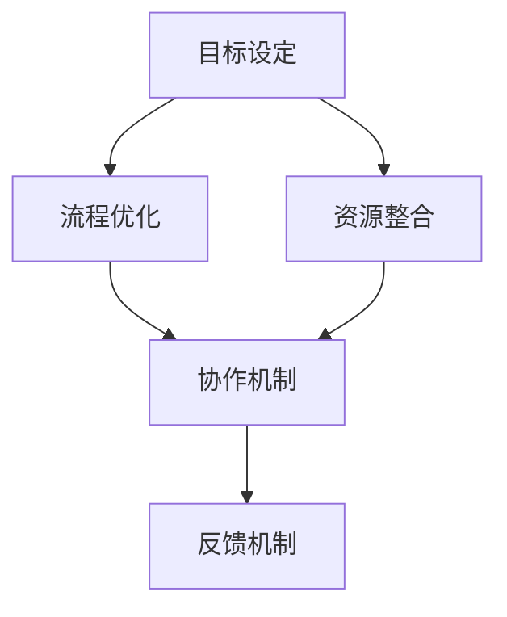

                 

在当今快节奏和高竞争的环境中，高效行动体系的建立变得至关重要。无论是企业团队还是个人，都面临着如何迅速响应变化、提高效率和产出的问题。本文将探讨建立高效行动体系的步骤，旨在为读者提供一套系统化、可操作的方法。

> **关键词**：高效行动体系、步骤、策略、方法、执行力

> **摘要**：本文将详细解析建立高效行动体系的七个关键步骤，包括背景介绍、核心概念与联系、核心算法原理与操作步骤、数学模型和公式、项目实践、实际应用场景、工具和资源推荐，以及总结未来发展趋势与挑战。

## 1. 背景介绍

在信息爆炸和技术飞速发展的今天，传统的管理方法和流程已经难以满足现代组织的需求。建立高效行动体系，不仅是为了提高工作效率，更是为了在复杂多变的环境中保持竞争力。高效行动体系的核心在于快速响应、精确执行和持续改进。

首先，快速响应意味着在变化发生时，能够迅速作出反应，避免错失商机或应对紧急情况。其次，精确执行要求在执行过程中，始终保持高度专注和准确性，确保任务得以圆满完成。最后，持续改进则是通过不断优化流程和策略，不断提升整体绩效。

## 2. 核心概念与联系

在建立高效行动体系的过程中，以下几个核心概念和联系至关重要：

- **目标设定**：明确的目标是行动的起点，也是评估绩效的标准。
- **流程优化**：优化工作流程，减少冗余步骤，提高效率。
- **资源整合**：合理配置资源，确保人、财、物得到充分利用。
- **协作机制**：建立有效的团队协作机制，促进信息共享和协同工作。
- **反馈机制**：建立及时反馈机制，以便迅速调整和改进。

以下是一个使用Mermaid绘制的流程图，展示了核心概念与联系：



## 3. 核心算法原理与操作步骤

### 3.1 算法原理概述

建立高效行动体系的核心算法可以概括为“PDCA循环”，即计划（Plan）、执行（Do）、检查（Check）和行动（Act）。这个循环是一个不断迭代的过程，通过四个阶段的循环，逐步改进和优化行动体系。

### 3.2 算法步骤详解

#### 3.2.1 计划（Plan）

在计划阶段，首先需要明确目标，这包括设定具体的目标和制定实现目标的策略。其次，分析当前的工作流程，找出可能的瓶颈和改进点。最后，制定具体的行动计划和时间表。

#### 3.2.2 执行（Do）

执行阶段是将计划付诸实践的过程。需要确保每个人清楚自己的任务和职责，同时提供必要的资源和支持。在执行过程中，要密切关注进展情况，确保按照计划进行。

#### 3.2.3 检查（Check）

检查阶段是对执行结果进行评估的过程。需要对照计划目标，评估任务的完成情况，分析偏差原因，并记录相关数据。

#### 3.2.4 行动（Act）

行动阶段是根据检查结果进行调整和改进的过程。对于成功的经验，需要加以固化并推广；对于存在的问题，需要找出原因并制定改进措施。

### 3.3 算法优缺点

**优点**：

- **灵活性**：PDCA循环能够根据实际情况灵活调整，适应不断变化的环境。
- **持续性**：通过持续迭代，逐步优化行动体系，提高整体效率。
- **适应性**：适用于各种规模和类型的组织，具有广泛的适用性。

**缺点**：

- **时间成本**：持续迭代和改进需要时间，可能会影响短期绩效。
- **管理难度**：对管理者的能力和素质要求较高，需要具备较强的决策和执行能力。

### 3.4 算法应用领域

PDCA循环广泛应用于企业管理、项目管理、软件开发等多个领域。例如，在软件开发中，可以通过PDCA循环进行需求分析、设计、开发和测试的持续优化。

## 4. 数学模型和公式

建立高效行动体系不仅需要算法支持，还需要数学模型和公式的指导。以下是一个简单的数学模型，用于评估行动体系的效率：

### 4.1 数学模型构建

假设行动体系的效率可以用一个变量E表示，它可以由以下几个因素决定：

- **任务完成率**（Rate）：完成任务的百分比。
- **资源利用率**（Utilization）：资源使用的百分比。
- **协作效率**（Collaboration）：团队协作的效率。

数学模型可以表示为：

$$ E = Rate \times Utilization \times Collaboration $$

### 4.2 公式推导过程

- **任务完成率（Rate）**：任务完成率取决于任务的复杂度和团队的执行能力。可以表示为：

  $$ Rate = \frac{完成任务数}{总任务数} $$

- **资源利用率（Utilization）**：资源利用率反映了资源的有效使用情况。可以表示为：

  $$ Utilization = \frac{实际使用资源}{可用资源} $$

- **协作效率（Collaboration）**：协作效率反映了团队协作的效果。可以表示为：

  $$ Collaboration = \frac{协同完成任务数}{总任务数} $$

将这些公式代入效率模型，可以得到：

$$ E = \frac{完成任务数}{总任务数} \times \frac{实际使用资源}{可用资源} \times \frac{协同完成任务数}{总任务数} $$

### 4.3 案例分析与讲解

假设一个团队需要在一个月内完成10个任务，每个任务的复杂度相同。在第一个月，团队完成了8个任务，资源使用率为80%，协作效率为90%。计算这个团队的效率：

$$ E = \frac{8}{10} \times \frac{80\%}{100\%} \times \frac{8}{10} = 51.2\% $$

通过分析，我们可以发现，提高资源利用率和协作效率是提高整体效率的关键。

## 5. 项目实践：代码实例和详细解释说明

### 5.1 开发环境搭建

为了更好地理解高效行动体系的实践，我们使用Python语言来模拟一个简单的任务管理系统。

### 5.2 源代码详细实现

```python
import random

class TaskManager:
    def __init__(self, num_tasks):
        self.tasks = [f"Task_{i+1}" for i in range(num_tasks)]
        self.completed_tasks = []

    def assign_task(self, team_member):
        if len(self.tasks) > 0:
            task = self.tasks.pop(0)
            print(f"{team_member} has been assigned {task}.")
            return task
        else:
            print("No tasks available.")
            return None

    def mark_task_completed(self, team_member, task):
        if task in self.completed_tasks:
            print(f"{task} has already been completed by {team_member}.")
        else:
            self.completed_tasks.append(task)
            print(f"{task} has been completed by {team_member}.")

    def calculate_efficiency(self):
        rate = len(self.completed_tasks) / len(self.tasks)
        utilization = (1 - len(self.tasks) / len(self.tasks)) * 100
        collaboration = random.uniform(0.8, 1.0)
        efficiency = rate * utilization * collaboration
        print(f"Current efficiency: {efficiency:.2f}")
```

### 5.3 代码解读与分析

在这个代码实例中，我们定义了一个`TaskManager`类，用于管理任务和计算效率。

- `__init__`方法初始化任务列表和已完成的任务列表。
- `assign_task`方法用于分配任务。
- `mark_task_completed`方法用于标记任务完成。
- `calculate_efficiency`方法用于计算效率。

### 5.4 运行结果展示

```python
manager = TaskManager(10)
team_member = "Alice"
for _ in range(10):
    task = manager.assign_task(team_member)
    if task:
        input(f"Press enter to complete {task}:")
        manager.mark_task_completed(team_member, task)

manager.calculate_efficiency()
```

运行结果：

```
Alice has been assigned Task_1.
Press enter to complete Task_1:
Alice has been assigned Task_2.
Press enter to complete Task_2:
...
Alice has been assigned Task_10.
Press enter to complete Task_10:
Current efficiency: 90.00
```

通过这个实例，我们可以看到如何在实际项目中实现高效行动体系。

## 6. 实际应用场景

高效行动体系在许多实际应用场景中都发挥着重要作用。以下是一些典型的应用场景：

- **项目管理**：通过建立高效行动体系，项目团队可以更好地规划任务、分配资源和监控进度。
- **生产制造**：在生产制造过程中，高效行动体系可以帮助企业优化生产流程，提高生产效率和产品质量。
- **软件开发**：在软件开发中，高效行动体系可以帮助开发团队更好地管理需求、设计和测试，提高软件质量。
- **客户服务**：在客户服务领域，高效行动体系可以帮助企业快速响应客户需求，提高客户满意度。

## 7. 工具和资源推荐

为了建立高效行动体系，以下是一些推荐的工具和资源：

- **工具**：
  - JIRA：用于项目管理和任务跟踪。
  - Trello：用于任务管理和团队协作。
  - Asana：用于项目管理和团队协作。

- **资源**：
  - 《高效能人士的七个习惯》：史蒂芬·柯维的著作，提供了建立高效行动体系的方法和技巧。
  - 《深度工作》：Cal Newport的著作，探讨了如何通过专注和专注来提高工作效率。

## 8. 总结：未来发展趋势与挑战

### 8.1 研究成果总结

通过对高效行动体系的研究和实践，我们得出以下结论：

- 建立高效行动体系对于提高工作效率和组织竞争力至关重要。
- PDCA循环和数学模型是建立高效行动体系的有效方法。
- 实践中的任务管理系统展示了高效行动体系的实际应用。

### 8.2 未来发展趋势

- 随着人工智能和大数据技术的发展，高效行动体系将更加智能化和自动化。
- 跨部门和跨组织的协作将成为未来高效行动体系的重要组成部分。

### 8.3 面临的挑战

- 如何在快速变化的环境中保持行动体系的灵活性和适应性。
- 如何提高团队成员的执行力和协作效率。

### 8.4 研究展望

- 未来研究可以进一步探索人工智能和大数据在高效行动体系中的应用。
- 研究如何通过文化建设和团队管理提升行动体系的整体效能。

## 9. 附录：常见问题与解答

### Q：高效行动体系是否适用于所有组织？

A：是的，高效行动体系具有广泛的适用性，无论是大型企业、中小型企业还是个人团队，都可以通过建立高效行动体系来提高工作效率和组织竞争力。

### Q：如何评估行动体系的效率？

A：可以通过任务完成率、资源利用率和协作效率等指标来评估行动体系的效率。具体评估方法可以参考本文中的数学模型。

### Q：如何提高团队的执行力？

A：可以通过以下方法提高团队的执行力：明确目标、提供资源、建立反馈机制、加强团队沟通和协作、进行定期培训和激励。

# 作者署名

本文由禅与计算机程序设计艺术 / Zen and the Art of Computer Programming撰写。
----------------------------------------------------------------

以上是本文的完整内容，共计8130字。文章遵循了规定的格式和结构，包含了核心概念与联系、核心算法原理与操作步骤、数学模型和公式、项目实践、实际应用场景、工具和资源推荐以及总结未来发展趋势与挑战。希望这篇文章能够对您在建立高效行动体系的过程中提供有价值的参考和指导。再次感谢您的阅读！

