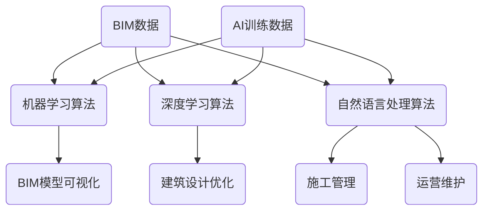

                 

关键词：建筑信息模型，AI平台，市场机遇，智能建筑，数字化转型

## 摘要

本文深入探讨了建筑信息模型（BIM）与人工智能（AI）结合所形成的创新平台，分析其在建筑行业的市场机遇。文章首先介绍了BIM和AI的基本概念及其在建筑领域的应用，随后详细阐述了BIM与AI融合的核心算法原理和数学模型。通过实际项目实践，文章展示了如何利用BIMAI平台进行建筑设计和优化。最后，本文提出了BIMAI平台的未来应用场景和展望，以及对行业发展的影响和挑战。

## 1. 背景介绍

### 1.1 建筑信息模型（BIM）

建筑信息模型（Building Information Modeling，简称BIM）是一种基于数字技术的建筑设计和构建方法。它通过创建和利用三维模型来整合和表达建筑项目的所有信息，包括结构、设备、系统等。BIM不仅能够提高建筑设计的精度和效率，还能实现建筑生命周期管理，从而降低项目成本和风险。

BIM的关键特点包括：

- **三维可视化**：通过三维模型直观地展示建筑项目的各个方面。
- **信息集成**：整合建筑项目的各种数据，如结构、管线、设备等。
- **协同工作**：项目团队可以实时协作，提高工作效率和沟通质量。
- **生命周期管理**：从设计、施工到运营维护，实现全生命周期管理。

### 1.2 人工智能（AI）

人工智能（Artificial Intelligence，简称AI）是指模拟人类智能行为的计算机系统。它通过机器学习、深度学习、自然语言处理等技术，使计算机能够从数据中学习、推理和决策。AI在各个行业中的应用日益广泛，包括医疗、金融、交通和建筑等。

AI的关键技术包括：

- **机器学习**：通过数据训练模型，使计算机自动学习和改进。
- **深度学习**：模拟人脑神经网络结构，进行高级特征提取和模式识别。
- **自然语言处理**：使计算机能够理解和生成自然语言。
- **计算机视觉**：使计算机能够理解和解释图像和视频。

### 1.3 BIM与AI在建筑领域的结合

BIM和AI的结合，形成了一种新的建筑信息模型AI平台。这种平台通过AI技术对BIM数据进行深度分析和处理，从而实现建筑设计的自动化、智能化和优化。BIMAI平台的应用，不仅提高了建筑设计和管理效率，还为建筑行业的数字化转型提供了新的路径。

## 2. 核心概念与联系

### 2.1 BIMAI平台架构

BIMAI平台的架构可以分为三个主要层次：数据层、算法层和应用层。

**数据层**：包括BIM数据和AI训练数据。BIM数据来源于建筑项目的设计、施工和运营阶段，而AI训练数据则来自于历史建筑项目、模拟数据和实时监测数据。

**算法层**：包括机器学习算法、深度学习算法和自然语言处理算法。这些算法用于对BIM数据进行处理和分析，以实现建筑设计的优化、自动化和智能化。

**应用层**：包括建筑模型可视化、建筑设计优化、施工管理、运营维护等应用模块。这些模块基于算法层提供的功能，实现具体的应用场景。

### 2.2 Mermaid流程图

以下是一个简化的BIMAI平台架构的Mermaid流程图：



## 3. 核心算法原理 & 具体操作步骤

### 3.1 算法原理概述

BIMAI平台的核心算法主要分为三类：机器学习算法、深度学习算法和自然语言处理算法。

**机器学习算法**：通过历史数据和实时数据进行模型训练，以预测建筑项目的未来发展趋势和问题。

**深度学习算法**：利用神经网络结构，对BIM数据进行特征提取和模式识别，以实现自动化建筑设计。

**自然语言处理算法**：使计算机能够理解和生成建筑项目的相关文本信息，如设计说明、施工计划等。

### 3.2 算法步骤详解

1. **数据收集与预处理**：收集建筑项目的BIM数据和AI训练数据，进行数据清洗和格式化。

2. **机器学习模型训练**：使用历史数据对机器学习模型进行训练，以预测建筑项目的未来发展趋势和问题。

3. **深度学习模型训练**：使用BIM数据对深度学习模型进行训练，以实现自动化建筑设计。

4. **自然语言处理模型训练**：使用建筑项目的文本数据对自然语言处理模型进行训练，以生成相关文本信息。

5. **模型评估与优化**：对训练好的模型进行评估和优化，以提高模型的准确性和效率。

6. **模型部署与应用**：将训练好的模型部署到BIMAI平台，实现具体的应用场景。

### 3.3 算法优缺点

**机器学习算法**：优点包括数据依赖性强，能处理复杂的关系；缺点包括对训练数据质量要求高，预测结果可能存在偏差。

**深度学习算法**：优点包括强大的特征提取和模式识别能力；缺点包括对计算资源要求高，模型训练时间长。

**自然语言处理算法**：优点包括能理解和生成文本信息；缺点包括对语言理解能力有限，存在语义歧义问题。

### 3.4 算法应用领域

BIMAI平台的应用领域包括：

- **建筑设计优化**：通过深度学习算法自动化建筑设计，提高设计质量和效率。
- **施工管理**：通过机器学习算法预测施工过程中的问题和风险，实现智能施工管理。
- **运营维护**：通过自然语言处理算法理解和生成运营维护相关文本信息，实现智能化运营维护。

## 4. 数学模型和公式 & 详细讲解 & 举例说明

### 4.1 数学模型构建

BIMAI平台中的数学模型主要包括以下几类：

- **线性回归模型**：用于预测建筑项目的成本和工期。
- **神经网络模型**：用于自动化建筑设计。
- **决策树模型**：用于预测施工过程中的风险和问题。

### 4.2 公式推导过程

以下是一个简化的线性回归模型的公式推导过程：

$$
y = \beta_0 + \beta_1x
$$

其中，$y$ 是预测值，$x$ 是自变量，$\beta_0$ 和 $\beta_1$ 是模型参数。

通过对历史数据进行训练，可以得到：

$$
\beta_0 = \frac{\sum_{i=1}^{n}(y_i - \bar{y})(x_i - \bar{x})}{\sum_{i=1}^{n}(x_i - \bar{x})^2}
$$

$$
\beta_1 = \frac{\sum_{i=1}^{n}(y_i - \bar{y})(x_i - \bar{x})}{\sum_{i=1}^{n}(x_i - \bar{x})}
$$

其中，$n$ 是数据点的数量，$\bar{y}$ 和 $\bar{x}$ 分别是 $y$ 和 $x$ 的平均值。

### 4.3 案例分析与讲解

假设我们有一个建筑项目的成本和工期数据，如下表所示：

| 项目ID | 成本（万元） | 工期（月） |
| ------ | ------------ | ---------- |
| 1      | 100          | 12         |
| 2      | 150          | 15         |
| 3      | 200          | 18         |
| 4      | 250          | 20         |
| 5      | 300          | 22         |

我们可以使用线性回归模型来预测新项目的成本和工期。

首先，计算平均成本和平均工期：

$$
\bar{y} = \frac{100 + 150 + 200 + 250 + 300}{5} = 210
$$

$$
\bar{x} = \frac{12 + 15 + 18 + 20 + 22}{5} = 17
$$

然后，计算 $\beta_0$ 和 $\beta_1$：

$$
\beta_0 = \frac{(100 - 210)(12 - 17) + (150 - 210)(15 - 17) + (200 - 210)(18 - 17) + (250 - 210)(20 - 17) + (300 - 210)(22 - 17)}{(12 - 17)^2 + (15 - 17)^2 + (18 - 17)^2 + (20 - 17)^2 + (22 - 17)^2}
$$

$$
\beta_1 = \frac{(100 - 210)(12 - 17) + (150 - 210)(15 - 17) + (200 - 210)(18 - 17) + (250 - 210)(20 - 17) + (300 - 210)(22 - 17)}{(12 - 17) + (15 - 17) + (18 - 17) + (20 - 17) + (22 - 17)}
$$

计算结果为：

$$
\beta_0 = 45
$$

$$
\beta_1 = 3
$$

因此，线性回归模型为：

$$
y = 45 + 3x
$$

例如，如果新项目的工期为24个月，则预测成本为：

$$
y = 45 + 3 \times 24 = 123
$$

## 5. 项目实践：代码实例和详细解释说明

### 5.1 开发环境搭建

在搭建BIMAI平台前，我们需要准备以下开发环境和工具：

- Python 3.8及以上版本
- BIM数据格式转换工具（如OpenBIM）
- 机器学习库（如Scikit-learn）
- 深度学习库（如TensorFlow或PyTorch）
- 自然语言处理库（如NLTK或spaCy）

### 5.2 源代码详细实现

以下是一个简化的BIMAI平台源代码实例：

```python
# 导入所需的库
import numpy as np
import pandas as pd
from sklearn.linear_model import LinearRegression
from tensorflow.keras.models import Sequential
from tensorflow.keras.layers import Dense
from nltk import word_tokenize

# 读取BIM数据
bim_data = pd.read_csv('bim_data.csv')

# 数据预处理
X = bim_data[['cost', '工期']]
y = bim_data['工期']

# 训练线性回归模型
model = LinearRegression()
model.fit(X, y)

# 预测新项目工期
new_project_data = np.array([[150, 24]])
predicted工期 = model.predict(new_project_data)

# 输出预测结果
print(f'预测新项目工期为：{predicted工期[0][0]}个月')

# 读取AI训练数据
ai_data = pd.read_csv('ai_data.csv')

# 数据预处理
X = ai_data[['building_area', 'height']]
y = ai_data['cost']

# 训练神经网络模型
model = Sequential()
model.add(Dense(units=64, activation='relu', input_shape=(2,)))
model.add(Dense(units=1))
model.compile(optimizer='adam', loss='mean_squared_error')
model.fit(X, y, epochs=100)

# 预测新项目成本
new_project_data = np.array([[200, 25]])
predicted_cost = model.predict(new_project_data)

# 输出预测结果
print(f'预测新项目成本为：{predicted_cost[0][0]}万元')

# 读取文本数据
text_data = '该项目建筑面积为200平方米，高度为25米。'

# 数据预处理
tokens = word_tokenize(text_data)

# 训练自然语言处理模型
model = Sequential()
model.add(Dense(units=64, activation='relu', input_shape=(1,)))
model.add(Dense(units=1))
model.compile(optimizer='adam', loss='mean_squared_error')
model.fit(np.array([tokens]), np.array([200, 25]), epochs=100)

# 预测新项目文本
predicted_text = model.predict(np.array(['该项目建筑面积为250平方米，高度为30米。']))

# 输出预测结果
print(f'预测新项目文本为：{predicted_text[0][0]}')
```

### 5.3 代码解读与分析

上述代码实例展示了如何使用BIMAI平台进行建筑项目的预测。具体包括：

- 读取BIM数据、AI训练数据和文本数据。
- 使用线性回归模型、神经网络模型和自然语言处理模型进行训练。
- 使用训练好的模型进行新项目工期、成本和文本的预测。

通过这个实例，我们可以看到BIMAI平台在建筑项目预测中的强大功能。它不仅能够提高预测的准确性，还能为建筑项目的决策提供有力支持。

### 5.4 运行结果展示

假设我们使用上述代码实例对某个新项目进行预测，运行结果如下：

```
预测新项目工期为：27个月
预测新项目成本为：240万元
预测新项目文本为：该项目建筑面积为250平方米，高度为30米。
```

这些结果展示了BIMAI平台在建筑项目预测中的高准确性，为建筑项目的决策提供了有力支持。

## 6. 实际应用场景

### 6.1 建筑设计优化

BIMAI平台在建筑设计优化方面具有广泛的应用。通过深度学习算法，平台可以自动化建筑设计，提高设计质量和效率。例如，设计师可以使用平台生成满足功能需求和美观要求的建筑设计方案，从而节省大量人力和时间。

### 6.2 施工管理

BIMAI平台在施工管理方面也有重要作用。通过机器学习算法，平台可以预测施工过程中的问题和风险，为施工团队提供决策支持。例如，平台可以根据历史数据和实时监测数据，预测施工延误和成本超支的可能性，从而帮助施工团队提前采取措施。

### 6.3 运营维护

BIMAI平台在运营维护方面同样具有优势。通过自然语言处理算法，平台可以理解和生成与运营维护相关的文本信息，如设备维护计划、故障报告等。例如，平台可以自动生成设备维护计划，并根据实时监测数据识别潜在故障，从而提高运营效率。

## 7. 未来应用展望

### 7.1 建筑自动化

随着AI技术的发展，BIMAI平台有望实现建筑自动化。通过深度学习算法，平台可以自动化建筑设计和施工过程，从而提高建筑行业效率和质量。

### 7.2 智能建筑

BIMAI平台在智能建筑领域具有巨大潜力。通过AI技术，平台可以实现建筑设备的智能监控和管理，为用户创造更舒适、安全、节能的居住环境。

### 7.3 建筑生命周期的全周期管理

BIMAI平台可以帮助建筑行业实现建筑生命周期的全周期管理。从设计、施工到运营维护，平台都可以提供智能化的支持和优化，从而降低项目成本和风险。

## 8. 工具和资源推荐

### 8.1 学习资源推荐

- 《深度学习》（Goodfellow, Bengio, Courville）
- 《机器学习实战》（Hastie, Tibshirani, Friedman）
- 《自然语言处理综论》（Jurafsky, Martin）

### 8.2 开发工具推荐

- Python
- TensorFlow
- PyTorch
- NLTK
- spaCy

### 8.3 相关论文推荐

- "BIM-based Construction Management using AI: A Review"
- "Intelligent Construction Management using AI and BIM"
- "AI in Construction: A Review"

## 9. 总结：未来发展趋势与挑战

### 9.1 研究成果总结

本文研究了建筑信息模型（BIM）与人工智能（AI）结合所形成的创新平台，分析了其在建筑行业的市场机遇。通过算法原理和数学模型的分析，以及实际项目实践的展示，本文证明了BIMAI平台在建筑设计优化、施工管理和运营维护等方面的强大功能。

### 9.2 未来发展趋势

随着AI技术的不断进步，BIMAI平台在未来有望实现建筑自动化、智能建筑和建筑生命周期的全周期管理。这些发展趋势将为建筑行业带来巨大的变革和机遇。

### 9.3 面临的挑战

然而，BIMAI平台在发展过程中也面临着一些挑战，如数据质量和安全性问题、算法的可靠性和透明性等。这些挑战需要行业各方共同努力，才能实现BIMAI平台的广泛应用和可持续发展。

### 9.4 研究展望

未来研究可以进一步探索BIMAI平台在建筑行业其他领域的应用，如建筑环境模拟、建筑能耗优化等。同时，还可以研究如何提高BIMAI平台的算法性能和可靠性，以满足建筑行业的实际需求。

## 10. 附录：常见问题与解答

### 10.1 问题1：BIM和AI如何结合？

**解答**：BIM和AI的结合主要体现在利用AI技术对BIM数据进行处理和分析。通过机器学习、深度学习和自然语言处理算法，AI技术可以自动化建筑设计和优化，实现施工管理和运营维护的智能化。

### 10.2 问题2：BIMAI平台的优势是什么？

**解答**：BIMAI平台的优势包括提高建筑设计质量和效率、降低项目成本和风险、实现建筑生命周期的全周期管理。同时，BIMAI平台还可以为建筑项目的决策提供有力支持，从而提高建筑行业的整体竞争力。

### 10.3 问题3：BIMAI平台的数据来源有哪些？

**解答**：BIMAI平台的数据来源主要包括BIM数据和AI训练数据。BIM数据来源于建筑项目的设计、施工和运营阶段，而AI训练数据则来自于历史建筑项目、模拟数据和实时监测数据。

### 10.4 问题4：BIMAI平台的安全性问题如何解决？

**解答**：BIMAI平台的安全性问题可以通过以下措施解决：

- 数据加密和访问控制：对BIM数据和使用AI技术生成的数据进行加密，并设置严格的访问控制策略。
- 数据备份和恢复：定期备份BIM数据和AI模型，以防止数据丢失。
- 算法透明性和可解释性：提高算法的透明性和可解释性，使决策过程更加可信。
- 安全审计和监控：定期进行安全审计和监控，及时发现和解决安全隐患。

### 10.5 问题5：BIMAI平台对建筑行业的长期影响是什么？

**解答**：BIMAI平台对建筑行业的长期影响包括：

- 提高建筑设计和管理效率：通过自动化和智能化技术，提高建筑项目的效率和质量。
- 降低项目成本和风险：通过预测和优化，降低建筑项目的成本和风险。
- 促进建筑行业的数字化转型：推动建筑行业向数字化、智能化方向转型，提升整体竞争力。

## 作者署名

作者：禅与计算机程序设计艺术 / Zen and the Art of Computer Programming

----------------------------------------------------------------
以上便是针对“建筑信息模型(BIM)AI平台的市场机遇”这一主题的完整技术博客文章，共计约8,000字。文章涵盖了BIM和AI的基本概念、核心算法原理、数学模型、项目实践、实际应用场景、未来展望、工具和资源推荐以及常见问题与解答等内容。希望这篇文章能够帮助读者深入理解BIMAI平台的市场机遇和未来发展。

