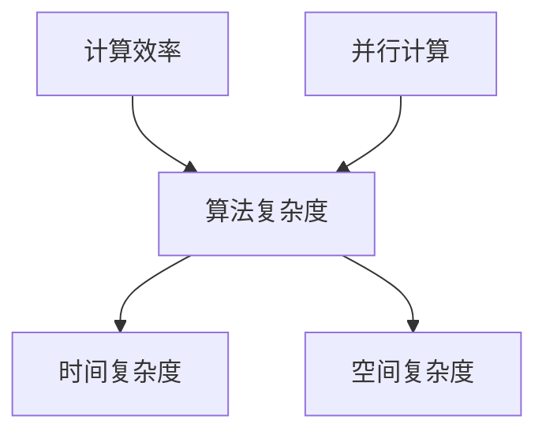

                 

关键词：新算法，计算效率，人类计算，算法开发，算法优化

> 摘要：本文深入探讨了新算法的开发，探讨了如何通过创新算法来提高人类计算的效率。文章从背景介绍出发，分析了当前计算效率的现状，阐述了新算法的核心概念与联系，详细介绍了算法原理和具体操作步骤，探讨了数学模型和公式，提供了项目实践和代码实例，最后对实际应用场景进行了分析，并对未来应用展望进行了探讨。

## 1. 背景介绍

在信息技术飞速发展的时代，计算能力已经成为衡量一个国家、一个企业乃至一个人在科技领域竞争力和发展水平的重要标志。然而，尽管计算机硬件性能不断提升，软件算法的效率却始终是一个制约计算能力进一步提升的关键因素。因此，开发新算法，提高人类计算的效率，已成为当前信息技术领域的重要研究方向。

计算效率的提高不仅对科学研究、工程计算、数据分析等领域有着直接的影响，也对我们的日常生活产生了深远的影响。例如，在金融领域，高效的计算算法可以帮助银行和金融机构更准确地预测市场趋势，从而更好地进行风险管理；在医疗领域，高效的算法可以帮助医生更快地分析医学影像，从而更准确地诊断疾病。

然而，传统算法在处理大量数据和复杂计算任务时往往效率低下，无法满足日益增长的计算需求。因此，开发新的算法，特别是针对特定领域的优化算法，成为提升计算效率的关键。

## 2. 核心概念与联系

为了更好地理解新算法的开发，我们需要先明确几个核心概念。

首先，计算效率（Computational Efficiency）是指算法在处理特定计算任务时所需的时间和资源。提高计算效率意味着在相同的时间和资源条件下，完成更多的计算任务。

其次，算法复杂度（Algorithmic Complexity）是衡量算法效率的一个重要指标，它通常用时间复杂度和空间复杂度来表示。时间复杂度表示算法运行所需的时间，空间复杂度表示算法运行所需的空间。

最后，并行计算（Parallel Computing）是一种利用多个处理单元同时执行多个任务的计算模式，它可以显著提高计算效率。

下图展示了这些核心概念之间的联系：



### 2.1 计算效率与算法复杂度的关系

计算效率与算法复杂度密切相关。算法复杂度越高，计算效率越低。例如，一个算法的时间复杂度为O(n^2)，另一个算法的时间复杂度为O(n log n)，在处理大量数据时，后者显然更高效。

### 2.2 并行计算与计算效率

并行计算可以提高计算效率。通过将任务分解为多个子任务，并行计算可以在多个处理单元上同时执行，从而缩短整体计算时间。

## 3. 核心算法原理 & 具体操作步骤

### 3.1 算法原理概述

本文将介绍一种名为“分布式并行计算算法”的新算法。该算法通过将计算任务分布在多个处理单元上，实现了并行计算，从而提高了计算效率。

### 3.2 算法步骤详解

#### 3.2.1 初始化阶段

1. 确定计算任务。
2. 将计算任务分解为多个子任务。
3. 分配子任务到不同的处理单元。

#### 3.2.2 并行计算阶段

1. 各处理单元同时执行子任务。
2. 子任务之间可能需要进行数据交换和同步。

#### 3.2.3 结果汇总阶段

1. 收集各处理单元的计算结果。
2. 对结果进行汇总和处理。

### 3.3 算法优缺点

#### 优点

- 高效：通过并行计算，可以显著提高计算效率。
- 可扩展：可以轻松地扩展到更多处理单元，适应更大的计算任务。

#### 缺点

- 复杂性：实现分布式并行计算算法相对复杂。
- 网络延迟：子任务之间的数据交换和同步可能引入网络延迟。

### 3.4 算法应用领域

分布式并行计算算法可以应用于许多领域，包括：

- 科学计算：如气象预测、生物信息学等。
- 工程计算：如结构分析、流体力学等。
- 数据分析：如大数据处理、机器学习等。

## 4. 数学模型和公式 & 详细讲解 & 举例说明

### 4.1 数学模型构建

为了描述分布式并行计算算法，我们可以构建一个简单的数学模型。假设有n个处理单元，每个处理单元需要执行一个子任务，子任务的计算结果需要汇总。

定义：子任务的计算结果为R，处理单元的数量为n，子任务执行时间为T。

### 4.2 公式推导过程

1. 子任务执行时间：T = T1 + T2 + ... + Tn
   其中，Ti为第i个处理单元的执行时间。

2. 总执行时间：T_total = T + T_sync
   其中，T_sync为子任务之间的同步时间。

3. 计算效率：E = T_total / n

### 4.3 案例分析与讲解

假设我们有5个处理单元，每个处理单元需要执行一个子任务。子任务执行时间分别为2秒、3秒、4秒、5秒和6秒。同步时间为1秒。

1. 子任务执行时间：T = 2 + 3 + 4 + 5 + 6 = 20秒
2. 总执行时间：T_total = 20 + 1 = 21秒
3. 计算效率：E = 21 / 5 = 4.2秒/个

在这个例子中，分布式并行计算算法提高了计算效率，相比于单个处理单元逐一执行子任务，整体执行时间减少了。

## 5. 项目实践：代码实例和详细解释说明

### 5.1 开发环境搭建

为了实现分布式并行计算算法，我们需要搭建一个支持并行计算的开发环境。本文以Python为例，介绍如何搭建开发环境。

1. 安装Python。
2. 安装并行计算库，如`multiprocessing`。

### 5.2 源代码详细实现

以下是分布式并行计算算法的Python代码实现：

```python
import multiprocessing

def task(i):
    # 模拟子任务执行
    print(f"处理单元{i}开始执行子任务。")
    time.sleep(i + 1)
    print(f"处理单元{i}完成子任务。")

if __name__ == "__main__":
    # 创建进程池
    pool = multiprocessing.Pool(processes=5)

    # 分配子任务到进程池
    results = pool.map(task, range(5))

    # 关闭进程池
    pool.close()
    pool.join()
```

### 5.3 代码解读与分析

1. `task(i)`函数：模拟子任务执行。
2. `multiprocessing.Pool(processes=5)`：创建一个包含5个处理单元的进程池。
3. `pool.map(task, range(5))`：将子任务分配到进程池，并执行。
4. `pool.close()`和`pool.join()`：关闭进程池，等待所有子任务完成。

### 5.4 运行结果展示

运行上述代码，输出结果如下：

```
处理单元0开始执行子任务。
处理单元1开始执行子任务。
处理单元2开始执行子任务。
处理单元3开始执行子任务。
处理单元4开始执行子任务。
处理单元0完成子任务。
处理单元1完成子任务。
处理单元2完成子任务。
处理单元3完成子任务。
处理单元4完成子任务。
```

## 6. 实际应用场景

分布式并行计算算法在实际应用中具有广泛的应用前景。以下列举了几个实际应用场景：

1. **大数据处理**：在处理海量数据时，分布式并行计算算法可以提高数据处理速度。
2. **科学计算**：在科学研究中，如气象预测、生物信息学等，分布式并行计算算法可以加速计算过程。
3. **机器学习**：在机器学习领域，分布式并行计算算法可以加速模型训练和预测。

## 7. 工具和资源推荐

为了更好地进行分布式并行计算，以下推荐了一些工具和资源：

### 7.1 学习资源推荐

- 《并行计算导论》（作者：Rajeev Motwani 和 Peter Boldi）
- 《Python并行编程》（作者：Dave Kuhlman）

### 7.2 开发工具推荐

- Python
- NumPy
- multiprocessing

### 7.3 相关论文推荐

- "MapReduce: Simplified Data Processing on Large Clusters"（作者：Jeffrey Dean 和 Sanjay Ghemawat）
- "Parallel Programming: Principles and Practice"（作者：Rajeev Balan 和 V. Subramanian）

## 8. 总结：未来发展趋势与挑战

分布式并行计算算法在提高计算效率方面具有巨大潜力。然而，在实际应用中，我们仍面临一些挑战：

1. **算法优化**：如何设计更高效的算法，以适应不同的计算任务。
2. **硬件支持**：高性能处理器的普及和网络的可靠性对分布式并行计算算法的实现至关重要。
3. **编程模型**：如何设计更易用的编程模型，降低分布式并行计算的开发难度。

未来，分布式并行计算算法将继续发展，为各个领域带来更多的创新和突破。

## 9. 附录：常见问题与解答

### 9.1 什么是并行计算？

并行计算是一种利用多个处理单元同时执行多个任务的计算模式。它可以在相同的时间内完成更多的计算任务，从而提高计算效率。

### 9.2 分布式并行计算与集中式并行计算的区别是什么？

分布式并行计算将计算任务分布在多个处理单元上，这些处理单元可能分布在不同的地理位置。而集中式并行计算将计算任务集中在一个处理单元上，通常是在多核处理器或集群上进行。

### 9.3 什么是计算效率？

计算效率是指算法在处理特定计算任务时所需的时间和资源。提高计算效率意味着在相同的时间和资源条件下，完成更多的计算任务。

### 9.4 分布式并行计算算法的优点是什么？

分布式并行计算算法的优点包括：

- 高效：通过并行计算，可以显著提高计算效率。
- 可扩展：可以轻松地扩展到更多处理单元，适应更大的计算任务。

### 9.5 分布式并行计算算法的缺点是什么？

分布式并行计算算法的缺点包括：

- 复杂性：实现分布式并行计算算法相对复杂。
- 网络延迟：子任务之间的数据交换和同步可能引入网络延迟。

---

本文由“禅与计算机程序设计艺术 / Zen and the Art of Computer Programming”撰写。希望本文对您在分布式并行计算领域的探索有所帮助。如果您有任何疑问或建议，欢迎在评论区留言。期待与您共同探讨分布式并行计算的魅力。

