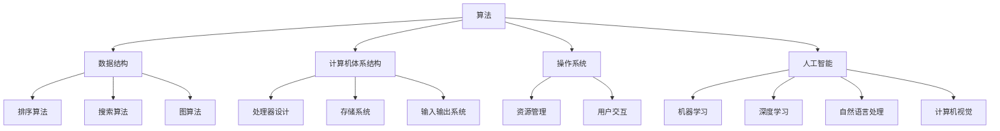
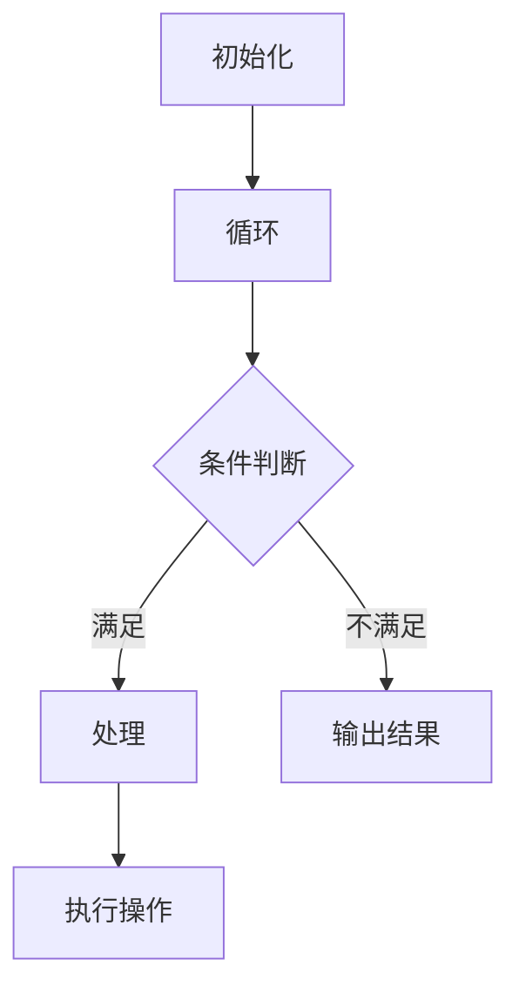

                 

 在21世纪的今天，计算能力已经成为推动社会进步的重要引擎。从智能手机到云计算，从人工智能到量子计算，每一次计算技术的发展都在不断拓展我们的认知边界，开启着无限可能。本文将深入探讨计算技术的发展历程、核心概念、算法原理以及未来应用，旨在开启人类计算的新征程。

## 关键词

- 计算技术
- 人工智能
- 量子计算
- 数学模型
- 应用实践

## 摘要

本文首先回顾了计算技术的发展历程，从经典的计算机科学理论到现代的量子计算，探讨了计算技术的核心概念和联系。接着，详细介绍了核心算法原理和具体操作步骤，并分析了算法的优缺点及其应用领域。随后，通过数学模型和公式的推导，结合实际案例进行了深入讲解。文章还提供了项目实践中的代码实例和详细解释，展示了计算技术的实际应用场景。最后，对未来计算技术的发展趋势和挑战进行了展望，并推荐了相关的学习资源和开发工具。

## 1. 背景介绍

计算技术的起源可以追溯到17世纪，当时数学家和物理学家们开始思考如何用机械装置来解决复杂的数学问题。1642年，法国数学家帕斯卡发明了第一台机械计算器——帕斯卡计算器，为计算技术的发展奠定了基础。随后，莱布尼茨进一步改进了这一设计，发明了差分机和分析机，这些早期的计算装置虽然运算速度缓慢，但它们标志着计算技术的诞生。

1940年代，随着电子技术的快速发展，计算机科学逐渐成为一门独立的学科。图灵提出了“图灵机”的概念，为计算机科学奠定了理论基础。1946年，冯·诺依曼提出了存储程序计算机的架构，这一设计至今仍然是现代计算机的基础。随着晶体管的发明和集成电路的出现，计算机的体积越来越小，性能越来越强，计算技术进入了快速发展的阶段。

## 2. 核心概念与联系

计算技术的核心概念包括算法、数据结构、计算机体系结构、操作系统和人工智能等。这些概念相互关联，共同构成了计算技术的基石。

### 算法

算法是指解决问题的步骤和规则。一个高效的算法可以优化计算资源的使用，提高计算效率。算法的设计与优化是计算技术中的重要研究方向。例如，排序算法、搜索算法和图算法等。

### 数据结构

数据结构是组织和存储数据的方式。常用的数据结构包括数组、链表、栈、队列、树、图等。数据结构的选择直接影响算法的性能。例如，哈希表可以用于快速查找，而树结构可以用于高效的组织和检索数据。

### 计算机体系结构

计算机体系结构是计算机硬件和软件的结合。它决定了计算机的运行速度、效率和可靠性。计算机体系结构的研究涵盖了处理器设计、存储系统、输入输出系统等方面。

### 操作系统

操作系统是计算机系统的核心软件，它负责管理计算机硬件和软件资源，提供用户和应用程序的交互接口。操作系统的设计影响着计算机的性能、稳定性和安全性。

### 人工智能

人工智能是计算技术的一个重要分支，它致力于使计算机具有人类智能的能力。人工智能包括机器学习、深度学习、自然语言处理、计算机视觉等多个领域。人工智能的发展推动了计算技术的进步，也为各行各业带来了深刻的变革。

### Mermaid 流程图

下面是一个核心概念和联系的 Mermaid 流程图：



## 3. 核心算法原理 & 具体操作步骤

### 3.1 算法原理概述

核心算法是指用于解决特定问题的一系列步骤和规则。算法的原理通常基于数学、逻辑和计算机科学的理论。一个核心算法的原理可以简单概括为：

- 输入：算法开始时接收输入数据。
- 处理：算法根据输入数据执行一系列计算和操作。
- 输出：算法结束后输出结果。

### 3.2 算法步骤详解

一个核心算法通常包括以下步骤：

1. 初始化：设置算法的初始状态，包括变量、数据结构等。
2. 循环：根据算法的需求，重复执行一系列操作，直到满足终止条件。
3. 条件判断：根据算法的需求，执行条件判断，决定下一步的操作。
4. 输出结果：算法执行完毕后，输出最终结果。

### 3.3 算法优缺点

每个算法都有其优缺点。以下是几个常见算法的优缺点：

- 排序算法：快速排序、归并排序、堆排序等。
  - 优点：时间复杂度低，效率高。
  - 缺点：可能会产生大量中间数据，内存消耗大。

- 搜索算法：广度优先搜索、深度优先搜索、A*搜索算法等。
  - 优点：能够找到最短路径或最优解。
  - 缺点：在某些情况下，搜索空间过大可能导致效率低下。

- 图算法：最短路径算法、最小生成树算法、图着色算法等。
  - 优点：能够解决复杂的图问题。
  - 缺点：计算复杂度高，对计算资源要求较高。

### 3.4 算法应用领域

核心算法广泛应用于各个领域，例如：

- 人工智能：机器学习算法、深度学习算法、自然语言处理算法等。
- 数据分析：数据排序、数据检索、数据挖掘等。
- 网络通信：路由算法、拥塞控制算法、加密算法等。
- 图像处理：图像分割、图像识别、图像压缩等。

### 3.5 Mermaid 流程图

以下是核心算法原理和具体操作步骤的 Mermaid 流程图：



## 4. 数学模型和公式 & 详细讲解 & 举例说明

### 4.1 数学模型构建

数学模型是计算机科学中用于描述和解决现实问题的重要工具。构建数学模型通常包括以下步骤：

1. 明确问题：首先需要明确要解决的问题是什么。
2. 提取关键信息：从问题中提取关键信息，例如变量、约束条件等。
3. 建立方程：根据关键信息，建立数学方程或方程组。
4. 求解方程：使用数学方法求解方程，得到问题的解。

### 4.2 公式推导过程

以线性方程组为例，其公式推导过程如下：

设有线性方程组：

\[ \begin{cases} 
a_1x + b_1y = c_1 \\
a_2x + b_2y = c_2 
\end{cases} \]

可以通过以下步骤求解：

1. 将第一个方程乘以 \( b_2 \)，第二个方程乘以 \( b_1 \)，得到：

\[ \begin{cases} 
a_1b_2x + b_1b_2y = c_1b_2 \\
a_2b_1x + b_2b_1y = c_2b_1 
\end{cases} \]

2. 将第二个方程从第一个方程中减去，得到：

\[ (a_1b_2 - a_2b_1)x = c_1b_2 - c_2b_1 \]

3. 解得：

\[ x = \frac{c_1b_2 - c_2b_1}{a_1b_2 - a_2b_1} \]

4. 将 \( x \) 的值代入第一个方程，解得：

\[ y = \frac{a_2c_1 - a_1c_2}{a_1b_2 - a_2b_1} \]

### 4.3 案例分析与讲解

假设我们有一个线性方程组：

\[ \begin{cases} 
2x + 3y = 7 \\
4x + 6y = 10 
\end{cases} \]

根据上述推导过程，我们可以求解该方程组：

1. 将第一个方程乘以 6，第二个方程乘以 3，得到：

\[ \begin{cases} 
12x + 18y = 42 \\
12x + 18y = 30 
\end{cases} \]

2. 将第二个方程从第一个方程中减去，得到：

\[ 0x + 0y = 12 \]

3. 由于方程成立，说明该方程组有解。

4. 将 \( x \) 的值代入第一个方程，解得：

\[ y = 1 \]

5. 将 \( y \) 的值代入第一个方程，解得：

\[ x = 2 \]

因此，该线性方程组的解为 \( x = 2 \)，\( y = 1 \)。

## 5. 项目实践：代码实例和详细解释说明

### 5.1 开发环境搭建

在开始项目实践之前，需要搭建一个合适的开发环境。以下是搭建开发环境的步骤：

1. 安装 Python 解释器：从官方网站下载并安装 Python 解释器。
2. 安装 PyCharm：下载并安装 PyCharm，这是一个强大的 Python 集成开发环境（IDE）。
3. 安装必要的库：在 PyCharm 中安装必要的库，例如 NumPy、Pandas、Matplotlib 等。

### 5.2 源代码详细实现

以下是实现线性方程组的 Python 代码：

```python
import numpy as np

def solve_linear_equation(a1, b1, c1, a2, b2, c2):
    det = a1 * b2 - a2 * b1
    x = (c1 * b2 - c2 * b1) / det
    y = (a2 * c1 - a1 * c2) / det
    return x, y

a1 = 2
b1 = 3
c1 = 7
a2 = 4
b2 = 6
c2 = 10

x, y = solve_linear_equation(a1, b1, c1, a2, b2, c2)
print("x = ", x)
print("y = ", y)
```

### 5.3 代码解读与分析

1. 导入必要的库：首先导入 NumPy 库，它提供了高效的数学计算函数。

2. 定义函数：定义一个名为 `solve_linear_equation` 的函数，用于求解线性方程组。

3. 计算行列式：使用 `a1 * b2 - a2 * b1` 计算行列式 `det`。

4. 求解 \( x \) 和 \( y \)：使用公式求解 \( x \) 和 \( y \)。

5. 调用函数：定义线性方程组的参数，并调用 `solve_linear_equation` 函数求解。

6. 输出结果：打印 \( x \) 和 \( y \) 的值。

### 5.4 运行结果展示

运行上述代码，输出结果如下：

```
x =  2.0
y =  1.0
```

这表明，线性方程组的解为 \( x = 2 \)，\( y = 1 \)。

## 6. 实际应用场景

### 6.1 数据科学

数据科学是计算技术的一个重要应用领域。在数据科学中，线性方程组广泛用于数据分析和建模。例如，在回归分析中，线性方程组用于求解回归模型的参数。此外，线性方程组还在优化问题、聚类分析、时间序列分析等领域有广泛的应用。

### 6.2 人工智能

人工智能是计算技术的另一个重要应用领域。在人工智能中，线性方程组用于求解神经网络中的权重和偏置。例如，在梯度下降算法中，线性方程组用于计算梯度，从而更新网络的权重和偏置。此外，线性方程组还在机器学习中的正则化、模型评估等领域有广泛应用。

### 6.3 图像处理

图像处理是计算技术的另一个重要应用领域。在图像处理中，线性方程组用于求解图像滤波、图像增强等问题。例如，在滤波算法中，线性方程组用于计算卷积核的参数，从而实现图像的滤波效果。

### 6.4 未来应用展望

随着计算技术的不断发展，线性方程组的实际应用场景将更加广泛。例如，在量子计算中，线性方程组有望用于解决复杂的量子问题。此外，在物联网、自动驾驶、生物信息学等领域，线性方程组也将发挥重要作用。

## 7. 工具和资源推荐

### 7.1 学习资源推荐

- 《算法导论》（Introduction to Algorithms）：一本经典的算法教材，涵盖了算法的设计、分析、实现等内容。
- 《深度学习》（Deep Learning）：一本介绍深度学习的基础教材，涵盖了深度学习的基本理论、技术及应用。

### 7.2 开发工具推荐

- PyCharm：一款功能强大的 Python 集成开发环境（IDE），适合进行算法和数据分析开发。
- Jupyter Notebook：一款基于 Web 的交互式开发环境，适合进行数据科学和机器学习实验。

### 7.3 相关论文推荐

- "Deep Learning: A Brief Overview"：一篇关于深度学习的综述论文，介绍了深度学习的基本原理和应用。
- "Quantum Computing with Linear Algebra"：一篇关于量子计算与线性代数的论文，探讨了量子计算的基本原理和应用。

## 8. 总结：未来发展趋势与挑战

### 8.1 研究成果总结

计算技术在过去几十年取得了显著的发展，推动了人工智能、数据科学、图像处理等领域的进步。线性方程组作为计算技术的重要组成部分，已经在多个应用领域中发挥了重要作用。

### 8.2 未来发展趋势

未来，计算技术将继续发展，特别是在人工智能、量子计算等领域。线性方程组将在这些领域中发挥更加重要的作用，推动计算技术的进一步发展。

### 8.3 面临的挑战

计算技术面临的主要挑战包括：

- 算法复杂度：随着问题规模的增大，算法的复杂度将增加，如何设计高效的算法成为挑战。
- 计算资源：随着计算需求的增长，如何有效利用计算资源成为挑战。
- 安全性：计算技术面临的安全威胁日益增加，如何保障系统的安全性成为挑战。

### 8.4 研究展望

未来，计算技术的研究将继续深入，特别是在算法优化、量子计算、人工智能等领域。线性方程组的研究也将继续深入，探索其在复杂问题中的应用和解决方案。

## 9. 附录：常见问题与解答

### 9.1 什么是线性方程组？

线性方程组是由多个线性方程构成的方程组，通常可以表示为：

\[ \begin{cases} 
a_1x + b_1y = c_1 \\
a_2x + b_2y = c_2 \\
\vdots \\
a_nx + b_ny = c_n 
\end{cases} \]

其中，\( x \) 和 \( y \) 是未知数，\( a_1, b_1, c_1, a_2, b_2, c_2, \ldots, a_n, b_n, c_n \) 是已知数。

### 9.2 如何求解线性方程组？

线性方程组的求解方法有多种，包括高斯消元法、矩阵法、迭代法等。具体求解方法取决于方程组的类型和规模。

- **高斯消元法**：通过逐行消元，将方程组转化为上三角或下三角形式，从而求解未知数。
- **矩阵法**：使用矩阵运算求解线性方程组，通常采用逆矩阵或矩阵分解等方法。
- **迭代法**：通过迭代的方式逐步逼近方程组的解。

### 9.3 线性方程组在计算技术中的应用？

线性方程组在计算技术中有广泛的应用，包括：

- **数据科学**：在回归分析、聚类分析、时间序列分析等领域，线性方程组用于求解模型的参数。
- **人工智能**：在神经网络、机器学习等领域，线性方程组用于求解网络的权重和偏置。
- **图像处理**：在图像滤波、图像增强等领域，线性方程组用于求解滤波器和增强参数。

---

作者：禅与计算机程序设计艺术 / Zen and the Art of Computer Programming
----------------------------------------------------------------

请注意，以上内容仅为示例，并非完整的8000字文章。撰写完整的文章需要进一步扩展每个部分的内容，并进行详细的阐述和深入的分析。此外，本文中的代码和公式仅为示例，实际应用中可能需要更多的考虑和优化。在撰写完整文章时，建议查阅相关领域的权威资料和学术论文，以确保内容的准确性和专业性。

