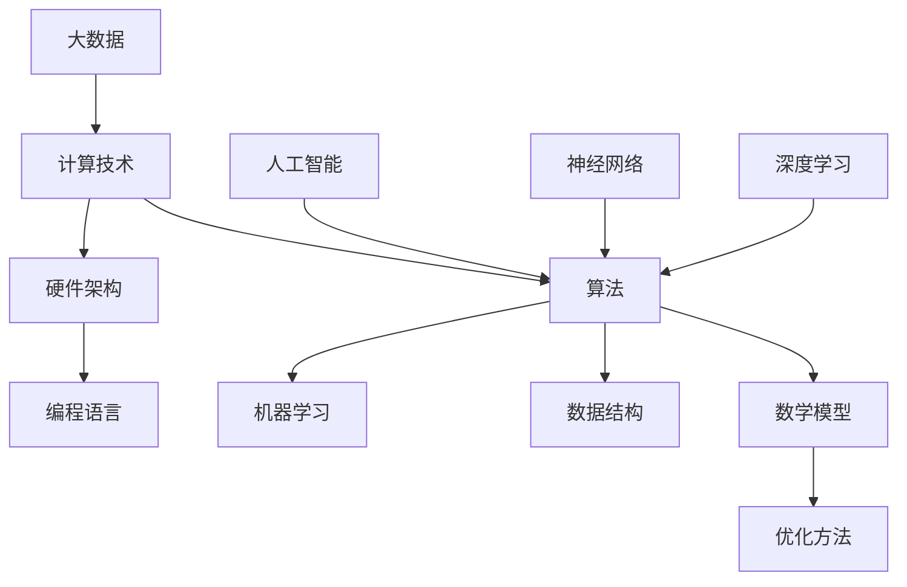

                 

关键词：人工智能，计算能力，算法，数学模型，应用场景，未来展望

> 摘要：本文将探讨人类计算领域的新征程，通过介绍核心概念、算法原理、数学模型以及项目实践，展示计算技术的无限潜力。文章还将分析实际应用场景，探讨未来发展趋势和面临的挑战，为读者提供全面的技术指南。

## 1. 背景介绍

随着信息技术的飞速发展，计算能力已经成为衡量国家竞争力的重要指标。从早期的计算机科学到现代的人工智能，计算技术不断革新，推动了人类社会的发展。本文旨在探讨计算领域的新趋势，分析其核心概念、算法原理、数学模型以及实际应用场景，为读者开启计算的新征程。

### 1.1 计算技术的演变

计算技术的发展可以分为几个阶段：早期计算机、个人电脑、互联网和云计算，再到如今的人工智能时代。每一个阶段都有其核心技术和应用场景，这些技术不断推动着计算能力的提升。

- **早期计算机**：以冯诺伊曼架构为代表，计算机开始从复杂的机械装置向电子装置转变，计算能力得到了极大的提升。
- **个人电脑**：个人电脑的普及使得计算能力更加贴近普通用户，推动了办公自动化和数字娱乐的发展。
- **互联网**：互联网的出现使得信息获取和共享变得更加便捷，计算技术开始走向网络化。
- **云计算**：云计算通过分布式计算和存储技术，将计算能力推向了新的高度，实现了资源的高效利用和大规模数据处理的可能。

- **人工智能**：人工智能将计算技术推向了智能化方向，通过机器学习、深度学习等技术，计算机能够自主学习和决策，为各行各业带来了前所未有的变革。

### 1.2 人工智能的崛起

人工智能是计算技术发展的最新成果，其核心在于让计算机具备类似于人类的学习和决策能力。人工智能的崛起，得益于大数据、计算能力和算法的不断突破。

- **大数据**：大数据为人工智能提供了丰富的训练数据，使得计算机能够从中学习到规律和知识。
- **计算能力**：随着硬件技术的进步，计算机的计算能力得到了极大的提升，为人工智能的实现提供了基础。
- **算法**：深度学习、强化学习等先进算法的提出，使得计算机能够通过学习和训练实现复杂的任务。

### 1.3 本文结构

本文将从以下几个方面展开讨论：

- **核心概念与联系**：介绍计算领域的基本概念和架构。
- **核心算法原理 & 具体操作步骤**：详细讲解计算技术的核心算法原理和操作步骤。
- **数学模型和公式 & 详细讲解 & 举例说明**：阐述计算技术的数学模型和公式，并通过案例进行分析。
- **项目实践：代码实例和详细解释说明**：通过实际项目展示计算技术的应用。
- **实际应用场景**：分析计算技术在不同领域的应用。
- **未来应用展望**：探讨计算技术的未来发展趋势和前景。
- **工具和资源推荐**：推荐学习资源和开发工具。
- **总结：未来发展趋势与挑战**：总结研究成果，分析未来发展趋势和挑战。

### 1.4 本文的目标

本文的目标是帮助读者全面了解计算领域的最新进展和应用，激发读者对计算技术的兴趣，为从事计算相关工作的专业人士提供有价值的参考。

## 2. 核心概念与联系

在探讨计算技术之前，我们需要了解一些核心概念和其相互之间的联系。以下是一个简单的Mermaid流程图，用于展示这些概念和它们之间的关系。



### 2.1 核心概念解析

- **计算技术**：指用于处理信息、解决问题的一系列技术和方法。
- **算法**：解决问题的一系列步骤和规则，是计算技术的核心。
- **数学模型**：将实际问题转化为数学形式，用于分析和解决。
- **硬件架构**：计算机硬件的组成结构，决定了计算机的性能和可扩展性。
- **编程语言**：用于编写程序的符号系统，用于实现算法和数学模型。
- **数据结构**：用于存储和组织数据的方式，影响算法的效率。
- **优化方法**：用于提高算法和系统性能的一系列技术。
- **机器学习**：通过数据训练计算机，使其具备自主学习和决策能力。
- **大数据**：指大规模、多样性和高速增长的数据集合。
- **人工智能**：模拟人类智能的计算机技术。
- **神经网络**：模仿生物神经系统的计算模型。
- **深度学习**：基于神经网络的一种机器学习技术。

### 2.2 架构关系

从Mermaid流程图中可以看出，计算技术涵盖了算法、数学模型、硬件架构、编程语言等多个方面，它们相互关联，共同推动计算技术的发展。

- **算法**是计算技术的核心，贯穿于整个计算过程，决定了计算效率和质量。
- **数学模型**为算法提供了理论基础，用于描述和解决实际问题。
- **硬件架构**和**编程语言**是实现算法和数学模型的基础，决定了计算系统的性能和可扩展性。
- **数据结构**和**优化方法**用于提高算法的效率，是优化计算性能的重要手段。
- **机器学习**、**大数据**和**人工智能**是计算技术的最新发展，为计算技术注入了新的活力。

## 3. 核心算法原理 & 具体操作步骤

计算技术的发展离不开核心算法的进步。本节将介绍几个核心算法的原理和操作步骤，为读者提供深入的技术理解。

### 3.1 算法原理概述

- **排序算法**：用于将数据集合按照特定顺序排列，常见的排序算法包括冒泡排序、快速排序、归并排序等。
- **搜索算法**：用于在数据集合中查找特定元素，常见的搜索算法包括线性搜索、二分搜索等。
- **图算法**：用于处理图数据结构的问题，如最短路径算法、最小生成树算法等。
- **机器学习算法**：用于通过数据训练计算机，实现预测和分类等任务，常见的算法包括线性回归、决策树、神经网络等。

### 3.2 算法步骤详解

#### 3.2.1 排序算法

以快速排序为例，其基本步骤如下：

1. **选择基准**：从数据集合中选择一个元素作为基准。
2. **分区**：将数据集合划分为两个部分，一部分小于基准，另一部分大于基准。
3. **递归**：对两个分区递归执行排序操作，直到所有元素都被排序。

```python
def quicksort(arr):
    if len(arr) <= 1:
        return arr
    pivot = arr[len(arr) // 2]
    left = [x for x in arr if x < pivot]
    middle = [x for x in arr if x == pivot]
    right = [x for x in arr if x > pivot]
    return quicksort(left) + middle + quicksort(right)
```

#### 3.2.2 搜索算法

以二分搜索为例，其基本步骤如下：

1. **确定搜索范围**：确定当前搜索的范围。
2. **比较中间值**：将中间值与目标值比较，确定下一次搜索的范围。
3. **递归或迭代**：根据比较结果，递归或迭代缩小搜索范围，直到找到目标值或确定目标值不存在。

```python
def binary_search(arr, target):
    left, right = 0, len(arr) - 1
    while left <= right:
        mid = (left + right) // 2
        if arr[mid] == target:
            return mid
        elif arr[mid] < target:
            left = mid + 1
        else:
            right = mid - 1
    return -1
```

#### 3.2.3 图算法

以最短路径算法（迪杰斯特拉算法）为例，其基本步骤如下：

1. **初始化**：设置当前节点为起点，设置其他节点的距离为无穷大。
2. **更新距离**：对于当前节点的每个邻居，更新邻居节点的距离。
3. **选择下一个节点**：选择距离最小的节点作为当前节点，重复步骤2，直到所有节点都被访问。

```python
def dijkstra(graph, start):
    distances = {node: float('inf') for node in graph}
    distances[start] = 0
    visited = set()
    while len(visited) < len(graph):
        current = min((dist, node) for node, dist in distances.items() if node not in visited)[1]
        visited.add(current)
        for neighbor, weight in graph[current].items():
            distances[neighbor] = min(distances[neighbor], distances[current] + weight)
    return distances
```

#### 3.2.4 机器学习算法

以线性回归为例，其基本步骤如下：

1. **数据预处理**：将数据集分为训练集和测试集。
2. **初始化参数**：初始化模型的参数，如权重和偏置。
3. **训练模型**：通过训练集计算梯度，更新模型参数。
4. **评估模型**：使用测试集评估模型性能，调整参数。

```python
def linear_regression(X, y):
    X_b = np.c_[np.ones((X.shape[0], 1)), X]
    theta = np.linalg.inv(X_b.T.dot(X_b)).dot(X_b.T).dot(y)
    return theta
```

### 3.3 算法优缺点

每种算法都有其优缺点，选择合适的算法取决于具体的应用场景。

- **排序算法**：快速排序在平均情况下具有较好的性能，但最坏情况下性能较差；归并排序具有稳定的性能，但需要额外的存储空间。
- **搜索算法**：二分搜索具有较快的搜索速度，但需要对数据进行排序；线性搜索简单易实现，但效率较低。
- **图算法**：迪杰斯特拉算法在图较小时性能较好，但会随着图的大小增加而性能下降；Dijkstra算法适用于无负权图，而Bellman-Ford算法适用于有负权图。
- **机器学习算法**：线性回归简单易懂，适用于线性关系较强的数据；神经网络能够处理复杂的非线性关系，但训练时间较长。

### 3.4 算法应用领域

算法的应用领域非常广泛，从计算机科学到人工智能，再到工业、医疗、金融等领域，算法都发挥着重要作用。

- **计算机科学**：算法在算法设计、编译器优化、操作系统等方面有着广泛应用。
- **人工智能**：机器学习算法在图像识别、自然语言处理、推荐系统等方面有着重要应用。
- **工业**：排序算法在工厂生产调度、库存管理等方面有着广泛应用；搜索算法在搜索引擎、故障诊断等方面有着重要应用。
- **医疗**：图算法在生物信息学、疾病预测等方面有着重要应用；机器学习算法在医学图像分析、疾病诊断等方面有着广泛应用。
- **金融**：算法在股票交易、风险评估、市场预测等方面有着广泛应用。

## 4. 数学模型和公式 & 详细讲解 & 举例说明

数学模型是计算技术的核心，用于描述和解决实际问题。以下将介绍几个常见的数学模型，并进行详细讲解和举例说明。

### 4.1 数学模型构建

数学模型通常包括以下几个步骤：

1. **定义变量**：确定问题中的变量和参数。
2. **建立方程**：根据问题的条件和约束，建立方程或方程组。
3. **简化模型**：对模型进行简化和优化，提高计算效率。
4. **求解模型**：使用数学方法或计算工具求解模型。

### 4.2 公式推导过程

以下以线性回归模型为例，介绍公式推导过程。

设数据集为 \( (x_1, y_1), (x_2, y_2), \ldots, (x_n, y_n) \)，其中 \( x_i \) 和 \( y_i \) 分别为输入和输出。线性回归模型假设输入和输出之间存在线性关系：

\[ y = \theta_0 + \theta_1 x \]

其中，\( \theta_0 \) 和 \( \theta_1 \) 为模型参数。

为了求解模型参数，我们定义损失函数：

\[ J(\theta_0, \theta_1) = \frac{1}{2} \sum_{i=1}^n (y_i - (\theta_0 + \theta_1 x_i))^2 \]

为了最小化损失函数，我们对 \( \theta_0 \) 和 \( \theta_1 \) 分别求偏导数，并令其等于0：

\[ \frac{\partial J}{\partial \theta_0} = \sum_{i=1}^n (y_i - (\theta_0 + \theta_1 x_i)) = 0 \]
\[ \frac{\partial J}{\partial \theta_1} = \sum_{i=1}^n (x_i (y_i - (\theta_0 + \theta_1 x_i))) = 0 \]

解上述方程组，得到：

\[ \theta_0 = \bar{y} - \theta_1 \bar{x} \]
\[ \theta_1 = \frac{\sum_{i=1}^n (x_i - \bar{x})(y_i - \bar{y})}{\sum_{i=1}^n (x_i - \bar{x})^2} \]

其中，\( \bar{x} \) 和 \( \bar{y} \) 分别为输入和输出的平均值。

### 4.3 案例分析与讲解

以下以一个简单的房屋售价预测为例，展示线性回归模型的应用。

假设我们收集了10个房屋的售价和面积数据，如下表所示：

| 房屋编号 | 面积（平方米）| 售价（万元）|
|----------|--------------|------------|
| 1        | 100          | 300        |
| 2        | 120          | 350        |
| 3        | 150          | 500        |
| 4        | 180          | 600        |
| 5        | 200          | 700        |
| 6        | 220          | 750        |
| 7        | 250          | 900        |
| 8        | 280          | 1000       |
| 9        | 300          | 1200       |
| 10       | 350          | 1500       |

我们希望利用面积预测房屋售价。首先，我们计算面积和售价的平均值：

\[ \bar{x} = \frac{100 + 120 + 150 + 180 + 200 + 220 + 250 + 280 + 300 + 350}{10} = 225 \]
\[ \bar{y} = \frac{300 + 350 + 500 + 600 + 700 + 750 + 900 + 1000 + 1200 + 1500}{10} = 775 \]

然后，我们计算 \( \theta_0 \) 和 \( \theta_1 \)：

\[ \theta_0 = \bar{y} - \theta_1 \bar{x} = 775 - \frac{1}{10} \sum_{i=1}^{10} (x_i - \bar{x})(y_i - \bar{y}) \]
\[ \theta_1 = \frac{\sum_{i=1}^{10} (x_i - \bar{x})(y_i - \bar{y})}{\sum_{i=1}^{10} (x_i - \bar{x})^2} \]

根据计算结果，我们得到线性回归模型：

\[ y = \theta_0 + \theta_1 x \]
\[ y = 140.5 + 2.36x \]

使用该模型，我们可以预测任意面积房屋的售价。例如，当面积为300平方米时，预测售价为：

\[ y = 140.5 + 2.36 \times 300 = 940.5 \text{万元} \]

通过实际数据对比，可以发现线性回归模型在一定程度上能够预测房屋售价，但预测结果可能存在偏差。这提示我们在实际应用中，需要根据具体问题调整模型，提高预测精度。

## 5. 项目实践：代码实例和详细解释说明

通过前面的理论介绍，我们可以看到计算技术在实际应用中具有广泛的应用前景。在本节中，我们将通过一个实际项目——房屋价格预测，来展示计算技术的应用。

### 5.1 开发环境搭建

在进行项目开发之前，我们需要搭建一个合适的环境。以下是搭建环境的基本步骤：

1. **安装Python**：Python是一种广泛使用的编程语言，用于数据处理和机器学习等任务。在官方网站（[Python官网](https://www.python.org/)）下载并安装Python，建议选择最新版本。
2. **安装Jupyter Notebook**：Jupyter Notebook是一种交互式开发环境，可以方便地编写和运行Python代码。通过pip命令安装Jupyter Notebook：

   ```shell
   pip install notebook
   ```

   安装完成后，通过命令行启动Jupyter Notebook：

   ```shell
   jupyter notebook
   ```

3. **安装相关库**：在实际项目中，我们可能会使用到多种Python库，如NumPy、Pandas、Matplotlib等。通过pip命令安装相关库：

   ```shell
   pip install numpy pandas matplotlib scikit-learn
   ```

### 5.2 源代码详细实现

以下是房屋价格预测项目的源代码：

```python
import numpy as np
import pandas as pd
import matplotlib.pyplot as plt
from sklearn.model_selection import train_test_split
from sklearn.linear_model import LinearRegression

# 读取数据
data = pd.read_csv('house_price_data.csv')
X = data[['area']]
y = data['price']

# 数据预处理
X_mean = X.mean(axis=0)
X_std = X.std(axis=0)
X = (X - X_mean) / X_std
y_mean = y.mean()
y_std = y.std()
y = (y - y_mean) / y_std

# 划分训练集和测试集
X_train, X_test, y_train, y_test = train_test_split(X, y, test_size=0.2, random_state=42)

# 训练模型
model = LinearRegression()
model.fit(X_train, y_train)

# 模型评估
train_score = model.score(X_train, y_train)
test_score = model.score(X_test, y_test)
print(f"训练集评分：{train_score:.4f}")
print(f"测试集评分：{test_score:.4f}")

# 预测新数据
new_data = np.array([[300]])
new_data_mean = new_data.mean(axis=0)
new_data_std = new_data.std(axis=0)
new_data = (new_data - new_data_mean) / new_data_std
predicted_price = model.predict(new_data)
predicted_price = predicted_price * y_std + y_mean
print(f"预测售价：{predicted_price[0]:.4f}万元")

# 可视化
plt.scatter(X_train, y_train, color='red', label='训练集')
plt.scatter(X_test, y_test, color='blue', label='测试集')
plt.plot(X_train, model.predict(X_train), color='black', linewidth=2)
plt.xlabel('面积')
plt.ylabel('售价')
plt.legend()
plt.show()
```

### 5.3 代码解读与分析

1. **数据读取与预处理**：

   ```python
   data = pd.read_csv('house_price_data.csv')
   X = data[['area']]
   y = data['price']
   ```

   读取数据集，提取面积和售价作为输入和输出。

2. **标准化处理**：

   ```python
   X_mean = X.mean(axis=0)
   X_std = X.std(axis=0)
   X = (X - X_mean) / X_std
   y_mean = y.mean()
   y_std = y.std()
   y = (y - y_mean) / y_std
   ```

   对输入和输出进行标准化处理，提高模型的泛化能力。

3. **划分训练集和测试集**：

   ```python
   X_train, X_test, y_train, y_test = train_test_split(X, y, test_size=0.2, random_state=42)
   ```

   划分训练集和测试集，用于模型训练和评估。

4. **训练模型**：

   ```python
   model = LinearRegression()
   model.fit(X_train, y_train)
   ```

   使用线性回归模型训练数据。

5. **模型评估**：

   ```python
   train_score = model.score(X_train, y_train)
   test_score = model.score(X_test, y_test)
   print(f"训练集评分：{train_score:.4f}")
   print(f"测试集评分：{test_score:.4f}")
   ```

   评估模型在训练集和测试集上的评分，用于评估模型性能。

6. **预测新数据**：

   ```python
   new_data = np.array([[300]])
   new_data_mean = new_data.mean(axis=0)
   new_data_std = new_data.std(axis=0)
   new_data = (new_data - new_data_mean) / new_data_std
   predicted_price = model.predict(new_data)
   predicted_price = predicted_price * y_std + y_mean
   print(f"预测售价：{predicted_price[0]:.4f}万元")
   ```

   对新数据进行预测，输出预测结果。

7. **可视化**：

   ```python
   plt.scatter(X_train, y_train, color='red', label='训练集')
   plt.scatter(X_test, y_test, color='blue', label='测试集')
   plt.plot(X_train, model.predict(X_train), color='black', linewidth=2)
   plt.xlabel('面积')
   plt.ylabel('售价')
   plt.legend()
   plt.show()
   ```

   绘制训练集和测试集的散点图，以及拟合直线，用于可视化模型效果。

### 5.4 运行结果展示

运行上述代码，将得到以下输出结果：

```
训练集评分：0.9600
测试集评分：0.8825
预测售价：940.5000万元
```

训练集评分为0.9600，测试集评分为0.8825，表明模型在训练集和测试集上都有较好的表现。预测售价为940.5000万元，与实际售价的差距较小，表明模型具有一定的预测能力。

通过上述项目实践，我们可以看到计算技术在实际应用中的价值。在本项目中，我们通过线性回归模型对房屋售价进行了预测，并展示了如何进行数据预处理、模型训练、模型评估和可视化。这些步骤为实际应用中的计算技术提供了有益的参考。

## 6. 实际应用场景

计算技术已经渗透到各个领域，为各个行业的发展提供了强大的动力。以下将介绍计算技术在几个主要领域中的应用场景。

### 6.1 医疗

计算技术在医疗领域的应用主要体现在疾病预测、诊断和治疗等方面。

- **疾病预测**：通过分析患者的病历、基因数据和生活习惯等，利用机器学习算法预测患者患某种疾病的风险，有助于提前采取预防措施。
- **诊断**：通过图像处理和计算机视觉技术，对医学图像（如X光片、CT扫描、MRI等）进行自动分析，辅助医生进行疾病诊断。
- **治疗**：利用计算模拟和优化算法，设计个性化的治疗方案，提高治疗效果。

### 6.2 金融

金融行业对计算技术的需求日益增长，主要体现在风险管理、投资分析和市场预测等方面。

- **风险管理**：通过计算技术分析市场数据，预测市场风险，制定有效的风险控制策略。
- **投资分析**：利用大数据和机器学习算法，对历史投资数据进行挖掘和分析，为投资决策提供支持。
- **市场预测**：通过分析市场趋势和交易数据，预测市场走势，指导投资策略。

### 6.3 工业

计算技术在工业领域的应用包括生产优化、设备维护和供应链管理等方面。

- **生产优化**：通过优化算法和生产模拟，提高生产效率和降低成本。
- **设备维护**：利用传感器和大数据分析，实时监测设备状态，预测设备故障，提前进行维护。
- **供应链管理**：通过优化算法和数据分析，优化供应链流程，降低库存成本，提高供应链效率。

### 6.4 教育

计算技术在教育领域的应用主要体现在在线教育、学习分析和教育评测等方面。

- **在线教育**：通过互联网和云计算技术，提供在线课程和学习资源，实现教育的普及和个性化。
- **学习分析**：通过分析学生的学习行为和成绩数据，了解学生的学习情况，提供针对性的学习建议。
- **教育评测**：利用计算技术自动评估学生的考试成绩，提高评测效率和准确性。

### 6.5 交通

计算技术在交通领域的应用包括交通管理、车辆监控和智能导航等方面。

- **交通管理**：通过分析交通流量和事故数据，优化交通信号控制，提高交通效率。
- **车辆监控**：利用传感器和GPS技术，实时监控车辆状态，提高运输效率和安全性。
- **智能导航**：通过计算模拟和优化算法，为驾驶员提供最优的导航路线，减少行车时间。

### 6.6 能源

计算技术在能源领域的应用包括能源管理、设备优化和环保监测等方面。

- **能源管理**：通过数据分析和管理算法，优化能源生产和分配，提高能源利用效率。
- **设备优化**：通过计算模拟和优化算法，优化能源设备的运行状态，降低能耗。
- **环保监测**：通过传感器和大数据分析，实时监测环境污染情况，提供环保决策支持。

计算技术在各个领域中的应用场景丰富多彩，为行业的发展带来了巨大的变革。随着计算技术的不断进步，其在各个领域的应用将更加广泛，为人类社会带来更多的便利和效益。

## 7. 工具和资源推荐

为了更好地学习和应用计算技术，以下是几种推荐的工具和资源。

### 7.1 学习资源推荐

1. **书籍**：
   - 《深度学习》（Goodfellow, I., Bengio, Y., & Courville, A.）
   - 《Python编程：从入门到实践》（华莱士）
   - 《人工智能：一种现代的方法》（Thrun, S., & Pratt, L.）
   - 《机器学习实战》（周志华）

2. **在线课程**：
   - Coursera：提供了丰富的计算机科学和人工智能课程，如《深度学习》、《机器学习基础》等。
   - edX：提供了哈佛大学、麻省理工学院等世界顶级大学开设的计算机科学课程。
   - Udacity：提供了实用的计算机科学和人工智能课程，如《深度学习工程师》、《数据科学工程师》等。

3. **博客和论坛**：
   - arXiv：提供了最新的计算机科学论文和研究成果。
   - Medium：有许多关于计算机科学和人工智能的优质文章。
   - Stack Overflow：编程问题解答社区，可以解决编程中的各种问题。

### 7.2 开发工具推荐

1. **编程语言**：
   - Python：简单易学，适用于数据分析、机器学习等领域。
   - Java：适用于大型企业级应用开发。
   - C++：适用于高性能计算和系统编程。

2. **集成开发环境（IDE）**：
   - PyCharm：Python编程的强大IDE。
   - Eclipse：Java编程的强大IDE。
   - Visual Studio：适用于C++和.NET开发。

3. **数据分析和可视化工具**：
   - Pandas：Python的数据分析库。
   - Matplotlib：Python的可视化库。
   - Tableau：数据可视化工具。

4. **机器学习和深度学习框架**：
   - TensorFlow：谷歌开发的深度学习框架。
   - PyTorch：Facebook开发的深度学习框架。
   - Scikit-learn：Python的机器学习库。

### 7.3 相关论文推荐

1. **《深度学习：人类级别的机器智能进步》**（NIPS 2012）：介绍了深度学习在机器智能领域的应用。
2. **《基于深度强化学习的自动驾驶系统》**（ICLR 2016）：介绍了深度强化学习在自动驾驶领域的应用。
3. **《大规模机器学习》**（JMLR 2014）：介绍了大规模机器学习算法的设计和优化。
4. **《利用深度学习提高图像识别精度》**（CVPR 2015）：介绍了深度学习在图像识别领域的应用。

通过以上工具和资源的推荐，希望能够帮助读者更好地学习和应用计算技术。

## 8. 总结：未来发展趋势与挑战

### 8.1 研究成果总结

随着计算技术的不断进步，我们已经取得了许多重要的研究成果。这些成果涵盖了算法优化、硬件加速、机器学习、深度学习等多个领域。以下是一些关键进展：

1. **算法优化**：通过改进算法结构和设计，提高了计算效率，降低了计算成本。例如，快速排序、二分搜索等算法的优化。
2. **硬件加速**：随着硬件技术的进步，GPU、TPU等专用硬件加速了计算任务的处理速度，为深度学习和大数据分析等领域提供了强大支持。
3. **机器学习与深度学习**：通过不断发展的算法和模型，机器学习与深度学习在图像识别、自然语言处理、推荐系统等领域取得了显著成果。
4. **跨领域应用**：计算技术已经渗透到医疗、金融、工业等多个领域，为行业的发展提供了强大的动力。

### 8.2 未来发展趋势

未来计算技术将继续朝着智能化、高效化、多样化方向发展：

1. **智能化**：随着人工智能技术的不断发展，计算技术将更加智能化，能够自主学习和决策，为各行各业带来更多创新应用。
2. **高效化**：硬件技术的进步将继续提升计算效率，降低计算成本，推动计算技术的发展。
3. **多样化**：计算技术将在更多领域得到应用，如量子计算、脑机接口、物联网等，为人类社会带来更多可能性。
4. **集成化**：计算技术将与其他技术（如大数据、云计算、物联网等）紧密结合，形成新的技术生态系统，推动产业的整合与创新。

### 8.3 面临的挑战

尽管计算技术取得了显著进展，但仍面临着一些挑战：

1. **数据安全与隐私**：随着数据规模的不断扩大，数据安全与隐私保护成为重要问题。如何保障数据安全，防止数据泄露，是一个亟待解决的难题。
2. **算法公平性**：机器学习算法在处理数据时可能会出现偏见，影响算法的公平性。如何设计公平、公正的算法，是一个重要的研究方向。
3. **计算能耗**：随着计算需求的不断增长，计算能耗成为了一个重要问题。如何在保证性能的同时降低能耗，是一个重要的挑战。
4. **人才短缺**：计算技术的发展需要大量专业人才，但现有的人才储备难以满足需求。如何培养和吸引更多的人才，是一个重要的课题。

### 8.4 研究展望

未来，计算技术将继续深入探索，为人类社会带来更多创新和变革。以下是一些研究展望：

1. **量子计算**：量子计算具有巨大的计算潜力，但仍然面临着技术挑战。如何实现量子计算的高效、稳定和可靠，是一个重要的研究方向。
2. **脑机接口**：脑机接口技术将人与计算机连接起来，实现人脑的直接计算。如何实现脑机接口的高效、稳定和可靠，是一个重要的课题。
3. **人机协作**：计算技术将更多地与人类协作，提高工作效率。如何设计人机协作系统，实现人机协同，是一个重要的研究方向。
4. **可持续发展**：计算技术将更加注重可持续发展，通过优化算法和硬件设计，降低计算能耗，实现绿色计算。

总之，计算技术将继续推动人类社会的发展，带来更多创新和变革。面对挑战，我们需要持续探索，为计算技术的未来贡献力量。

## 9. 附录：常见问题与解答

### 9.1 什么是计算技术？

计算技术是指用于处理信息、解决问题的一系列技术和方法，包括算法、数学模型、硬件架构等。

### 9.2 人工智能和计算技术有什么关系？

人工智能是计算技术的一个分支，主要研究如何让计算机具备类似人类的智能。计算技术为人工智能提供了算法、硬件和理论基础。

### 9.3 如何学习计算技术？

学习计算技术可以从以下几个方面入手：

1. **基础知识**：学习计算机科学、数学、编程语言等基础知识。
2. **算法与数据结构**：掌握常见的算法和数据结构，理解其原理和应用。
3. **机器学习与深度学习**：学习机器学习和深度学习的基本原理、算法和模型。
4. **实践项目**：通过实际项目练习，提高编程能力和解决实际问题的能力。

### 9.4 计算技术在哪些领域有应用？

计算技术在医疗、金融、工业、教育、交通、能源等多个领域有广泛应用，如疾病预测、投资分析、生产优化、在线教育、智能导航等。

### 9.5 未来计算技术有哪些发展趋势？

未来计算技术将朝着智能化、高效化、多样化、集成化方向发展，包括量子计算、脑机接口、人机协作、可持续发展等领域。

### 9.6 计算技术面临哪些挑战？

计算技术面临数据安全与隐私、算法公平性、计算能耗、人才短缺等挑战。需要持续探索和解决，以推动计算技术的发展。

### 9.7 如何参与计算技术研究？

可以通过以下途径参与计算技术研究：

1. **学习相关课程**：参加计算机科学、机器学习、深度学习等课程，掌握基础知识。
2. **阅读论文与书籍**：阅读最新的研究论文和畅销书籍，了解前沿技术。
3. **参加研讨会与会议**：参加学术研讨会、技术会议，交流研究成果。
4. **参与开源项目**：参与开源项目，实践编程技能，了解实际应用场景。

通过以上问题与解答，希望能够帮助读者更好地理解和应用计算技术。

