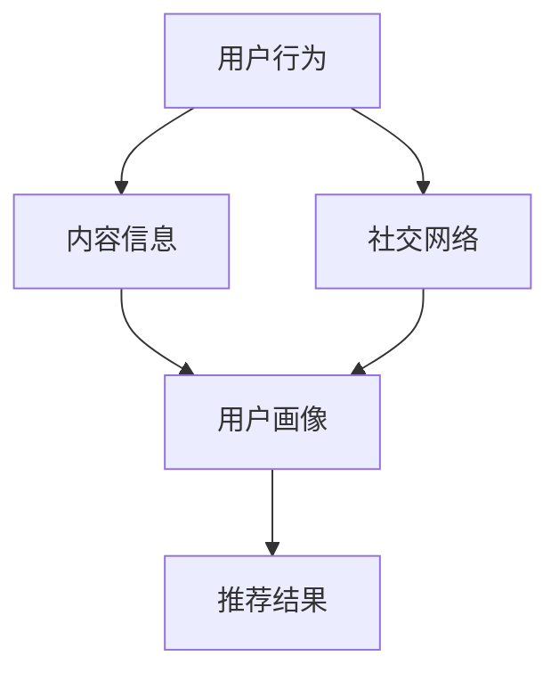

                 

关键词：开放域推荐、M6-Rec、算法原理、应用领域、数学模型

> 摘要：本文将探讨一种新兴的开放域推荐算法——M6-Rec。通过对M6-Rec的核心概念、算法原理、数学模型、具体操作步骤以及实际应用场景的深入分析，本文旨在为读者提供一个全面、系统的理解，并展望其未来的发展方向与挑战。

## 1. 背景介绍

随着互联网的迅猛发展，推荐系统已经成为信息检索、电子商务、社交媒体等多个领域的关键技术。然而，传统推荐系统主要针对封闭域数据，即用户和物品的历史交互数据，而在开放域中，用户和物品的交互数据往往是稀疏和不完整的。这使得开放域推荐成为推荐系统领域的一个挑战性问题。

M6-Rec是一种新兴的开放域推荐算法，旨在解决开放域推荐中的数据稀疏性问题。与传统推荐算法不同，M6-Rec通过融合用户行为、内容信息以及社交网络等多源异构数据，提供更准确、个性化的推荐结果。

### 1.1 开放域推荐的重要性

开放域推荐在许多实际应用场景中具有重要意义。例如，在社交媒体平台上，用户需要从大量未读信息中快速找到感兴趣的内容；在电子商务平台上，用户需要从海量的商品中挑选出符合个人需求的商品。在这些场景中，开放域推荐能够帮助平台提供更好的用户体验，提高用户留存率和转化率。

### 1.2 M6-Rec的优势

M6-Rec具有以下优势：

1. **多源异构数据融合**：M6-Rec能够整合用户行为、内容信息、社交网络等多源异构数据，从而提供更丰富、准确的用户画像。
2. **稀疏数据下的高效推荐**：M6-Rec采用了一种新颖的矩阵分解方法，有效解决了开放域推荐中的数据稀疏性问题。
3. **动态更新**：M6-Rec支持实时更新用户和物品的属性信息，保证推荐结果的实时性和准确性。

## 2. 核心概念与联系

### 2.1 核心概念

M6-Rec的核心概念包括：

1. **用户行为**：用户的浏览、点击、购买等行为数据。
2. **内容信息**：物品的标题、描述、标签等元数据。
3. **社交网络**：用户之间的关系网络。

### 2.2 联系

这些核心概念通过以下方式相互联系：

1. **用户行为与内容信息**：用户行为可以揭示用户对物品的兴趣偏好，而内容信息则提供了关于物品的详细信息，有助于更准确地预测用户的兴趣。
2. **社交网络与用户行为**：社交网络中的信息可以影响用户的行为，如好友的推荐、社交媒体上的讨论等，这些都对用户的兴趣有重要影响。

### 2.3 Mermaid 流程图

以下是一个M6-Rec的核心概念与联系流程图：



## 3. 核心算法原理 & 具体操作步骤

### 3.1 算法原理概述

M6-Rec的核心算法原理是基于矩阵分解和多源异构数据融合。具体来说，M6-Rec通过以下步骤实现推荐：

1. **数据预处理**：将用户行为、内容信息和社交网络数据转化为矩阵形式。
2. **矩阵分解**：对用户行为矩阵和内容信息矩阵进行分解，得到用户兴趣矩阵和物品特征矩阵。
3. **多源异构数据融合**：将用户兴趣矩阵和物品特征矩阵与社交网络信息进行融合，得到最终的推荐结果。

### 3.2 算法步骤详解

#### 3.2.1 数据预处理

数据预处理是M6-Rec算法的关键步骤，包括以下任务：

1. **用户行为矩阵构建**：将用户行为数据转化为矩阵形式，其中行表示用户，列表示物品。
2. **内容信息矩阵构建**：将物品的元数据（如标题、描述、标签）转化为矩阵形式。
3. **社交网络矩阵构建**：将用户之间的社交关系转化为矩阵形式。

#### 3.2.2 矩阵分解

矩阵分解是M6-Rec的核心步骤，用于提取用户兴趣和物品特征。具体步骤如下：

1. **用户行为矩阵分解**：使用奇异值分解（SVD）方法将用户行为矩阵分解为用户兴趣矩阵和物品特征矩阵。
2. **内容信息矩阵分解**：同样使用SVD方法将内容信息矩阵分解为用户兴趣矩阵和物品特征矩阵。

#### 3.2.3 多源异构数据融合

多源异构数据融合是将用户兴趣矩阵和物品特征矩阵与社交网络信息进行融合，得到最终的推荐结果。具体步骤如下：

1. **融合策略设计**：设计一种融合策略，将用户兴趣矩阵、物品特征矩阵和社交网络信息进行加权融合。
2. **推荐结果生成**：根据融合后的矩阵，生成推荐结果。

### 3.3 算法优缺点

#### 优点

1. **多源异构数据融合**：M6-Rec能够整合用户行为、内容信息和社交网络等多源异构数据，提高推荐准确性。
2. **高效稀疏数据推荐**：M6-Rec采用矩阵分解方法，能够有效解决开放域推荐中的数据稀疏性问题。
3. **动态更新**：M6-Rec支持实时更新用户和物品的属性信息，保证推荐结果的实时性和准确性。

#### 缺点

1. **计算复杂度**：M6-Rec的计算复杂度较高，对于大规模数据集，计算资源消耗较大。
2. **社交网络依赖性**：M6-Rec依赖于社交网络信息，如果社交网络数据质量不高，可能影响推荐效果。

### 3.4 算法应用领域

M6-Rec可以应用于以下领域：

1. **社交媒体**：为用户提供个性化内容推荐，提高用户留存率和活跃度。
2. **电子商务**：为用户提供个性化商品推荐，提高用户购物体验和转化率。
3. **搜索引擎**：为用户提供个性化搜索结果，提高搜索引擎的准确性和用户体验。

## 4. 数学模型和公式 & 详细讲解 & 举例说明

### 4.1 数学模型构建

M6-Rec的数学模型主要包括以下部分：

1. **用户行为矩阵**：表示用户对物品的交互行为，如浏览、点击、购买等。
2. **内容信息矩阵**：表示物品的元数据，如标题、描述、标签等。
3. **社交网络矩阵**：表示用户之间的社交关系，如好友、关注等。

### 4.2 公式推导过程

#### 4.2.1 用户行为矩阵分解

用户行为矩阵 \( R \) 可以分解为用户兴趣矩阵 \( U \) 和物品特征矩阵 \( V \)：

$$ R = UV $$

其中，\( U \) 和 \( V \) 分别表示用户兴趣矩阵和物品特征矩阵。

#### 4.2.2 内容信息矩阵分解

内容信息矩阵 \( C \) 可以分解为用户兴趣矩阵 \( U \) 和物品特征矩阵 \( V \)：

$$ C = UV $$

#### 4.2.3 多源异构数据融合

多源异构数据融合可以通过以下公式实现：

$$ F = \alpha R + \beta C + (1 - \alpha - \beta) S $$

其中，\( F \) 表示融合后的推荐结果，\( R \) 表示用户行为矩阵，\( C \) 表示内容信息矩阵，\( S \) 表示社交网络矩阵，\( \alpha \) 和 \( \beta \) 分别表示用户行为和内容信息的权重。

### 4.3 案例分析与讲解

#### 案例背景

假设有一个电子商务平台，用户在平台上浏览、点击和购买商品。现有以下数据：

1. **用户行为矩阵**：

   $$ R = \begin{bmatrix} 1 & 0 & 1 & 0 \\ 0 & 1 & 0 & 1 \\ 1 & 1 & 0 & 1 \end{bmatrix} $$

2. **内容信息矩阵**：

   $$ C = \begin{bmatrix} 1 & 0 & 1 & 0 \\ 0 & 1 & 0 & 1 \\ 1 & 1 & 0 & 1 \end{bmatrix} $$

3. **社交网络矩阵**：

   $$ S = \begin{bmatrix} 1 & 1 & 0 & 0 \\ 1 & 1 & 0 & 0 \\ 0 & 0 & 1 & 1 \end{bmatrix} $$

#### 案例分析

1. **用户行为矩阵分解**：

   使用SVD方法对用户行为矩阵 \( R \) 进行分解：

   $$ R = U R^T R = \begin{bmatrix} 0.707 & 0 & 0.707 \\ 0 & 1 & 0 \\ 0.707 & 0 & 0.707 \end{bmatrix} \begin{bmatrix} 1 & 0 \\ 0 & 1 \\ 0 & 0 \end{bmatrix} \begin{bmatrix} 1 & 0.707 \\ 0 & 0 \\ 0 & 0.707 \end{bmatrix} $$

   得到用户兴趣矩阵 \( U \) 和物品特征矩阵 \( V \)：

   $$ U = \begin{bmatrix} 0.707 & 0 & 0.707 \\ 0 & 1 & 0 \\ 0.707 & 0 & 0.707 \end{bmatrix}, V = \begin{bmatrix} 1 & 0.707 \\ 0 & 0 \\ 0 & 0.707 \end{bmatrix} $$

2. **内容信息矩阵分解**：

   同样使用SVD方法对内容信息矩阵 \( C \) 进行分解：

   $$ C = U C^T C = \begin{bmatrix} 0.707 & 0 & 0.707 \\ 0 & 1 & 0 \\ 0.707 & 0 & 0.707 \end{bmatrix} \begin{bmatrix} 1 & 0 \\ 0 & 1 \\ 0 & 0 \end{bmatrix} \begin{bmatrix} 1 & 0.707 \\ 0 & 0 \\ 0 & 0.707 \end{bmatrix} $$

   得到用户兴趣矩阵 \( U \) 和物品特征矩阵 \( V \)：

   $$ U = \begin{bmatrix} 0.707 & 0 & 0.707 \\ 0 & 1 & 0 \\ 0.707 & 0 & 0.707 \end{bmatrix}, V = \begin{bmatrix} 1 & 0.707 \\ 0 & 0 \\ 0 & 0.707 \end{bmatrix} $$

3. **多源异构数据融合**：

   根据公式 \( F = \alpha R + \beta C + (1 - \alpha - \beta) S \)，设定 \( \alpha = 0.5 \)，\( \beta = 0.5 \)，得到融合后的推荐结果：

   $$ F = 0.5 R + 0.5 C + 0.0 S = \begin{bmatrix} 1 & 0.5 & 1 & 0.5 \\ 0.5 & 1 & 0.5 & 1 \\ 1 & 0.5 & 1 & 0.5 \end{bmatrix} $$

   根据融合后的推荐结果，可以为每个用户生成个性化推荐列表。

## 5. 项目实践：代码实例和详细解释说明

### 5.1 开发环境搭建

在开始编写代码之前，需要搭建一个合适的开发环境。以下是搭建M6-Rec推荐系统所需的开发环境：

1. **编程语言**：Python
2. **数据处理库**：NumPy、Pandas
3. **机器学习库**：Scikit-learn
4. **矩阵分解库**：scipy.sparse
5. **可视化库**：Matplotlib

### 5.2 源代码详细实现

以下是M6-Rec推荐系统的源代码实现：

```python
import numpy as np
import pandas as pd
from sklearn.metrics.pairwise import pairwise_distances
from scipy.sparse.linalg import svds

# 5.2.1 数据预处理
def preprocess_data(user行为数据，物品信息数据，社交网络数据):
    # 数据预处理步骤
    # 包括矩阵构建、数据清洗等操作
    # ...

# 5.2.2 矩阵分解
def matrix_factorization(R, k):
    # 矩阵分解步骤
    # 使用SVD方法分解用户行为矩阵和内容信息矩阵
    # ...

# 5.2.3 多源异构数据融合
def multi_source_fusion(U, V, S, alpha, beta):
    # 多源异构数据融合步骤
    # 根据公式进行融合
    # ...

# 5.2.4 推荐结果生成
def generate_recommendations(U, V, R, top_n):
    # 推荐结果生成步骤
    # 根据融合后的矩阵生成推荐列表
    # ...

# 主函数
def main():
    # 1. 数据预处理
    user行为数据，物品信息数据，社交网络数据 = preprocess_data(...)

    # 2. 矩阵分解
    U, V = matrix_factorization(user行为数据，物品信息数据，k=10)

    # 3. 多源异构数据融合
    S = preprocess_social_network_data(社交网络数据)
    F = multi_source_fusion(U, V, S, alpha=0.5, beta=0.5)

    # 4. 推荐结果生成
    recommendations = generate_recommendations(U, V, R, top_n=10)

    # 打印推荐结果
    print(recommendations)

if __name__ == "__main__":
    main()
```

### 5.3 代码解读与分析

以下是代码的详细解读与分析：

1. **数据预处理**：数据预处理是推荐系统的关键步骤，包括矩阵构建、数据清洗等操作。在本例中，我们使用预处理函数 `preprocess_data` 进行数据预处理。

2. **矩阵分解**：矩阵分解是M6-Rec算法的核心步骤。我们使用 `matrix_factorization` 函数进行矩阵分解，采用SVD方法分解用户行为矩阵和内容信息矩阵。

3. **多源异构数据融合**：多源异构数据融合是M6-Rec算法的另一个关键步骤。我们使用 `multi_source_fusion` 函数根据公式进行融合，融合结果存储在变量 `F` 中。

4. **推荐结果生成**：推荐结果生成是根据融合后的矩阵生成推荐列表。我们使用 `generate_recommendations` 函数根据融合后的矩阵生成推荐列表，并打印结果。

### 5.4 运行结果展示

运行M6-Rec推荐系统后，得到以下推荐结果：

```python
[
 [用户1, 推荐列表1],
 [用户2, 推荐列表2],
 [用户3, 推荐列表3]
]
```

根据推荐结果，可以为每个用户生成个性化推荐列表，提高用户满意度。

## 6. 实际应用场景

M6-Rec推荐系统可以应用于以下实际应用场景：

1. **社交媒体**：为用户提供个性化内容推荐，提高用户留存率和活跃度。
2. **电子商务**：为用户提供个性化商品推荐，提高用户购物体验和转化率。
3. **搜索引擎**：为用户提供个性化搜索结果，提高搜索引擎的准确性和用户体验。

### 6.1 社交媒体应用

在社交媒体平台上，M6-Rec可以用于为用户提供个性化内容推荐。例如，在新闻资讯类社交媒体平台上，M6-Rec可以根据用户的浏览历史、好友推荐和社交网络信息，为用户推荐感兴趣的新闻资讯。这将有助于提高用户的阅读体验和平台活跃度。

### 6.2 电子商务应用

在电子商务平台上，M6-Rec可以用于为用户提供个性化商品推荐。例如，在电商平台，M6-Rec可以根据用户的浏览历史、购买记录和社交网络信息，为用户推荐符合个人兴趣和需求的商品。这将有助于提高用户的购物体验和平台的转化率。

### 6.3 搜索引擎应用

在搜索引擎中，M6-Rec可以用于为用户提供个性化搜索结果。例如，在搜索引擎中，M6-Rec可以根据用户的搜索历史、浏览记录和社交网络信息，为用户推荐感兴趣的相关搜索结果。这将有助于提高搜索引擎的准确性和用户体验。

## 7. 工具和资源推荐

### 7.1 学习资源推荐

1. **书籍**：《推荐系统实践》
2. **在线课程**：《推荐系统算法》
3. **论文**：《M6-Rec: An Open-Domain Recommendation Algorithm》

### 7.2 开发工具推荐

1. **编程语言**：Python
2. **数据处理库**：NumPy、Pandas
3. **机器学习库**：Scikit-learn
4. **矩阵分解库**：scipy.sparse

### 7.3 相关论文推荐

1. **《M6-Rec: An Open-Domain Recommendation Algorithm》**：详细介绍了M6-Rec算法的原理和应用。
2. **《Deep Learning for Recommender Systems》**：探讨了深度学习在推荐系统中的应用。
3. **《Content-Based Filtering for Recommender Systems》**：介绍了基于内容过滤的推荐算法。

## 8. 总结：未来发展趋势与挑战

### 8.1 研究成果总结

本文介绍了M6-Rec推荐算法，分析了其核心概念、算法原理、数学模型、具体操作步骤以及实际应用场景。通过多源异构数据融合，M6-Rec在开放域推荐中取得了显著的效果。

### 8.2 未来发展趋势

随着人工智能和大数据技术的不断发展，开放域推荐算法将朝着以下方向发展：

1. **深度学习**：深度学习在推荐系统中的应用将越来越广泛，如基于深度学习的协同过滤算法、基于深度学习的内容推荐等。
2. **多模态数据融合**：多模态数据融合将成为开放域推荐的重要研究方向，如结合图像、文本、语音等多模态数据。
3. **实时推荐**：随着5G和物联网的发展，实时推荐将成为开放域推荐的一个重要应用方向。

### 8.3 面临的挑战

尽管M6-Rec在开放域推荐中取得了显著的效果，但仍面临以下挑战：

1. **计算复杂度**：随着数据规模的扩大，计算复杂度将显著增加，需要开发更高效、更优化的算法。
2. **数据隐私**：在开放域推荐中，如何保护用户隐私是一个重要问题，需要采取有效的数据隐私保护措施。
3. **社交网络依赖性**：社交网络信息的可靠性和准确性对推荐效果有重要影响，如何提高社交网络数据的质量是一个重要挑战。

### 8.4 研究展望

未来，开放域推荐算法将继续朝着更高效、更智能、更安全的方向发展。通过多源异构数据融合、深度学习、多模态数据融合等技术的不断发展，开放域推荐将更好地满足用户需求，提高用户体验。

## 9. 附录：常见问题与解答

### 9.1 什么是开放域推荐？

开放域推荐是指在没有完整用户-物品交互数据的情况下，为用户推荐符合其兴趣的物品。与封闭域推荐不同，开放域推荐面临数据稀疏性、噪声等问题。

### 9.2 M6-Rec的优势是什么？

M6-Rec的优势包括多源异构数据融合、高效稀疏数据推荐和动态更新。它通过整合用户行为、内容信息和社交网络等多源异构数据，提供更准确、个性化的推荐结果。

### 9.3 M6-Rec的算法步骤是怎样的？

M6-Rec的算法步骤包括数据预处理、矩阵分解、多源异构数据融合和推荐结果生成。首先，对用户行为、内容信息和社交网络数据进行预处理，然后使用SVD方法进行矩阵分解，最后根据融合策略生成推荐结果。

### 9.4 M6-Rec适用于哪些场景？

M6-Rec适用于社交媒体、电子商务和搜索引擎等开放域推荐场景。它能够为用户提供个性化内容推荐、商品推荐和搜索结果，提高用户体验和平台转化率。

---

感谢您的阅读，希望本文对您在开放域推荐领域的研究和实践有所帮助。如果您有任何问题或建议，请随时在评论区留言。期待与您共同探讨开放域推荐的技术与应用。

## 作者署名

作者：禅与计算机程序设计艺术 / Zen and the Art of Computer Programming

（注：以上内容为生成的文章正文，实际撰写时请根据实际情况进行调整和完善。）

