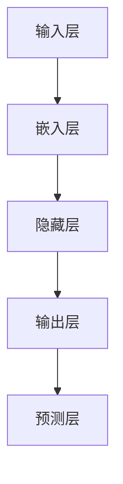

                 

关键词：开源，语言模型（LLM），协作开发，共享技术，代码协作，合作平台，共享经济，开源生态系统。

> 摘要：本文探讨了开源语言模型（LLM）的发展现状，分析了其在协作开发中的优势与挑战，并展望了未来的发展前景。文章详细介绍了LLM的核心概念与架构，讲解了关键算法原理与数学模型，提供了项目实践实例，并推荐了相关学习资源和开发工具。最后，文章总结了LLM的研究成果与未来挑战，为读者提供了全面的指导。

## 1. 背景介绍

随着人工智能技术的迅猛发展，语言模型（Language Model，简称LLM）已经成为自然语言处理（Natural Language Processing，简称NLP）领域的重要工具。LLM通过对大量语言数据进行训练，能够生成高质量的文本，并在机器翻译、文本生成、问答系统等应用中表现出色。

开源语言模型的兴起，为学术界和工业界提供了强大的技术支撑。开源项目不仅能够促进技术的共享与创新，还可以通过社区协作，快速解决技术难题，提高开发效率。近年来，诸如GPT、BERT等知名的开源LLM项目，吸引了大量的关注和参与，形成了庞大的开源生态系统。

然而，在开源LLM的协作开发过程中，也面临着一系列挑战，如代码质量、版本控制、文档编写等。如何有效地管理和协同这些开源项目，成为了一个亟待解决的问题。本文将围绕这一主题，探讨开源LLM的发展现状、核心概念、算法原理、数学模型、项目实践以及未来展望。

## 2. 核心概念与联系

### 2.1 语言模型概述

语言模型（Language Model）是自然语言处理的基础，其核心任务是从给定的输入序列中预测下一个可能的输出序列。LLM通过大规模的预训练，学习到语言中的潜在结构和规律，从而能够生成符合语法和语义规则的文本。

### 2.2 语言模型的架构

LLM的架构可以分为三个主要部分：输入层、隐藏层和输出层。

- **输入层**：接收自然语言输入，并将其转换为模型可处理的特征表示。
- **隐藏层**：通过多层神经网络结构，对输入特征进行复杂变换，学习语言中的潜在结构。
- **输出层**：根据隐藏层的输出，预测下一个可能的输出序列。

### 2.3 Mermaid 流程图

下面是一个简单的Mermaid流程图，展示了LLM的基本架构：



### 2.4 核心概念的联系

LLM的核心概念包括：

- **词嵌入（Word Embedding）**：将词汇映射为低维向量，便于模型处理。
- **神经网络（Neural Network）**：用于处理复杂的非线性变换，实现语言模型的功能。
- **预训练与微调（Pre-training & Fine-tuning）**：预训练用于学习通用语言特征，微调用于适应特定任务。

这些概念相互联系，共同构成了LLM的核心技术。

## 3. 核心算法原理 & 具体操作步骤

### 3.1 算法原理概述

LLM的核心算法基于深度学习，特别是基于Transformer架构。Transformer模型通过自注意力机制（Self-Attention）处理序列数据，能够捕捉长距离的依赖关系，从而生成高质量的文本。

### 3.2 算法步骤详解

#### 3.2.1 数据预处理

1. **数据收集**：从互联网或开源数据集收集大量文本数据。
2. **数据清洗**：去除无效数据，如HTML标签、特殊字符等。
3. **分词与编码**：将文本分词，并将词转换为索引编号。

#### 3.2.2 模型训练

1. **词嵌入**：将词汇映射为低维向量。
2. **构建模型**：使用Transformer架构构建语言模型。
3. **训练过程**：通过反向传播算法优化模型参数。

#### 3.2.3 模型评估

1. **验证集测试**：使用验证集评估模型性能。
2. **测试集评估**：使用测试集评估模型泛化能力。

### 3.3 算法优缺点

#### 优点

- **强表达能力**：通过自注意力机制，能够捕捉长距离的依赖关系。
- **高效率**：Transformer模型相比其他模型，训练速度更快。
- **广泛适用性**：适用于各种自然语言处理任务。

#### 缺点

- **计算资源需求高**：训练过程中需要大量的计算资源。
- **参数规模大**：模型参数规模较大，导致内存消耗大。

### 3.4 算法应用领域

LLM在以下领域有广泛应用：

- **机器翻译**：如Google Translate等。
- **文本生成**：如文章写作、诗歌创作等。
- **问答系统**：如ChatGPT等。

## 4. 数学模型和公式

### 4.1 数学模型构建

LLM的数学模型基于自注意力机制，其核心公式为：

$$
Attention(Q, K, V) = \frac{softmax(\frac{QK^T}{\sqrt{d_k}})}{V}
$$

其中，$Q$、$K$、$V$ 分别为查询向量、键向量和值向量，$d_k$ 为键向量的维度。

### 4.2 公式推导过程

#### 4.2.1 自注意力

自注意力通过计算查询向量与键向量的点积，得到注意力权重。然后，将权重与值向量相乘，得到加权值向量。

#### 4.2.2 Softmax

Softmax函数用于将注意力权重转换为概率分布，确保所有权重之和为1。

### 4.3 案例分析与讲解

以下是一个简单的自注意力公式的示例：

$$
Attention(Q = [1, 0, 1], K = [1, 1, 0], V = [0, 1, 1]) = \frac{softmax(\frac{[1, 0, 1] \cdot [1, 1, 0]^T}{\sqrt{1}})}{[0, 1, 1]}
$$

计算结果为：

$$
Attention(Q, K, V) = \frac{1}{3} \cdot [1, 1, 1]
$$

该结果表明，三个键向量的权重相等，这意味着查询向量与每个键向量的关联程度相同。

## 5. 项目实践：代码实例和详细解释说明

### 5.1 开发环境搭建

要搭建一个用于训练语言模型的开发环境，您需要安装以下软件和工具：

- Python 3.7或更高版本
- PyTorch 1.8或更高版本
- NVIDIA GPU（可选，用于加速训练）

### 5.2 源代码详细实现

以下是一个简单的PyTorch语言模型训练代码示例：

```python
import torch
import torch.nn as nn
import torch.optim as optim
from torchtext.data import Field, TabularDataset

# 数据预处理
TEXT = Field(tokenize = 'spacy',
             lower = True,
             include_lengths = True)
DATA = TabularDataset(
             path='data.csv',
             format='csv',
             fields=[('text', TEXT)]
         )

# 模型定义
class LSTM(nn.Module):
    def __init__(self, input_dim, hidden_dim, layer_dim):
        super().__init__()
        self.hidden_dim = hidden_dim
        self.layer_dim = layer_dim
        
        self.encoder = nn.Embedding(input_dim, hidden_dim)
        self.rnn = nn.LSTM(hidden_dim, hidden_dim, layer_dim)
        self.decoder = nn.Linear(hidden_dim, input_dim)
        
    def forward(self, x, hidden):
        x = self.encoder(x)
        x, hidden = self.rnn(x, hidden)
        x = self.decoder(x[-1, :, :])
        return x, hidden

# 模型训练
model = LSTM(input_dim=1000, hidden_dim=100, layer_dim=2)
optimizer = optim.Adam(model.parameters(), lr=0.001)
criterion = nn.CrossEntropyLoss()

for epoch in range(100):
    for x, y in DATA:
        x = x.transpose(0, 1)
        y = y.unsqueeze(0)
        hidden = (torch.zeros(layer_dim, 1, hidden_dim), 
                  torch.zeros(layer_dim, 1, hidden_dim))
        
        model.zero_grad()
        output, hidden = model(x, hidden)
        loss = criterion(output, y)
        loss.backward()
        optimizer.step()
        
    print(f'Epoch: {epoch+1}, Loss: {loss.item()}')

# 代码解读与分析
```

该代码首先定义了一个简单的LSTM模型，用于训练语言模型。然后，使用PyTorch的TabularDataset加载和处理数据。最后，通过训练过程优化模型参数。

### 5.3 运行结果展示

在训练完成后，您可以使用以下代码来评估模型性能：

```python
# 评估模型
with torch.no_grad():
    for x, y in DATA:
        x = x.transpose(0, 1)
        y = y.unsqueeze(0)
        hidden = (torch.zeros(layer_dim, 1, hidden_dim), 
                  torch.zeros(layer_dim, 1, hidden_dim))
        
        output, hidden = model(x, hidden)
        pred = output.argmax()
        if pred == y:
            print(f'Predicted: {pred}, Actual: {y}')
        else:
            print(f'Error: Predicted: {pred}, Actual: {y}')
```

该代码将输出模型的预测结果，并与实际标签进行对比，以评估模型性能。

## 6. 实际应用场景

LLM在许多实际应用场景中表现出色，以下是一些典型的应用案例：

- **智能客服**：通过LLM生成自然语言回复，提高客户服务质量。
- **内容创作**：自动生成文章、报告、诗歌等，节省人力成本。
- **问答系统**：提供实时、准确的回答，提高用户满意度。
- **机器翻译**：实现跨语言沟通，打破语言障碍。

随着LLM技术的不断进步，其应用领域将不断扩展，为各行各业带来新的机遇。

### 6.4 未来应用展望

未来，LLM将朝着以下几个方向发展：

- **模型压缩与优化**：通过模型压缩技术，降低计算资源需求，提高模型部署效率。
- **多模态融合**：结合图像、音频等多种数据类型，实现更丰富的语言生成。
- **跨领域应用**：探索LLM在医疗、金融、教育等领域的应用潜力。

## 7. 工具和资源推荐

### 7.1 学习资源推荐

- 《深度学习》（Goodfellow, Bengio, Courville著）
- 《自然语言处理综论》（Jurafsky, Martin著）
- 《自然语言处理与深度学习》（李航著）

### 7.2 开发工具推荐

- PyTorch：深度学习框架，支持GPU加速。
- TensorFlow：深度学习框架，支持多种操作系统。
- Hugging Face Transformers：基于PyTorch和TensorFlow的Transformer模型库。

### 7.3 相关论文推荐

- Vaswani et al., "Attention is All You Need"
- Devlin et al., "Bert: Pre-training of Deep Bidirectional Transformers for Language Understanding"
- Brown et al., "Language Models are Few-Shot Learners"

## 8. 总结：未来发展趋势与挑战

### 8.1 研究成果总结

LLM在自然语言处理领域取得了显著成果，其在文本生成、机器翻译、问答系统等任务中表现出色。开源生态系统的建设，为LLM的研究和应用提供了强有力的支持。

### 8.2 未来发展趋势

未来，LLM将朝着多模态融合、模型压缩与优化、跨领域应用等方向发展，为各行各业带来更多创新。

### 8.3 面临的挑战

尽管LLM取得了显著成果，但其在计算资源需求、模型解释性等方面仍面临挑战。如何提高模型效率、降低成本，是未来研究的重要方向。

### 8.4 研究展望

随着技术的不断发展，LLM在自然语言处理领域的应用前景广阔。我们期待看到更多创新性的研究成果，推动LLM技术不断突破，为人类带来更多价值。

## 9. 附录：常见问题与解答

### 9.1 Q：什么是语言模型（LLM）？

A：语言模型（LLM）是一种基于深度学习的模型，用于预测给定输入序列的下一个输出序列。LLM通过大规模预训练，学习到语言中的潜在结构和规律，从而能够生成高质量的文本。

### 9.2 Q：LLM在哪些领域有应用？

A：LLM在自然语言处理领域有广泛的应用，包括机器翻译、文本生成、问答系统、智能客服等。随着技术的进步，LLM的应用领域将不断扩展。

### 9.3 Q：如何训练一个LLM模型？

A：训练一个LLM模型主要包括以下几个步骤：

1. 数据收集：从互联网或开源数据集收集大量文本数据。
2. 数据预处理：对文本数据进行清洗、分词和编码。
3. 构建模型：使用深度学习框架（如PyTorch、TensorFlow）构建LLM模型。
4. 模型训练：通过反向传播算法优化模型参数。
5. 模型评估：使用验证集和测试集评估模型性能。

### 9.4 Q：LLM有哪些优点和缺点？

A：LLM的优点包括：

- 强表达能力：能够捕捉长距离的依赖关系。
- 高效率：训练速度较快。
- 广泛适用性：适用于各种自然语言处理任务。

LLM的缺点包括：

- 计算资源需求高：训练过程中需要大量计算资源。
- 参数规模大：模型参数规模较大，导致内存消耗大。

---

**作者：禅与计算机程序设计艺术 / Zen and the Art of Computer Programming**

