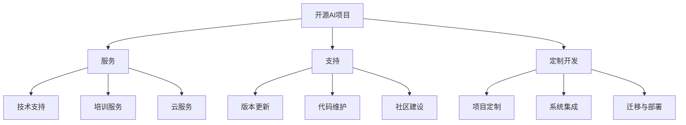

                 

关键词：开源AI、商业化路径、服务、支持、定制开发

> 摘要：随着人工智能技术的快速发展，开源AI项目在学术界和产业界的影响力日益扩大。然而，如何将开源AI项目转化为商业价值，成为众多开发者和企业关注的焦点。本文将从服务、支持和定制开发三个角度，探讨开源AI项目的商业化路径，旨在为开发者和企业提供一些实用的思路和案例。

## 1. 背景介绍

近年来，人工智能（AI）技术取得了前所未有的突破，从深度学习到自然语言处理，从计算机视觉到机器人技术，AI正逐步融入我们生活的方方面面。开源AI项目在这一过程中发挥了重要作用，不仅推动了技术进步，还促进了全球范围内的技术交流和合作。开源AI项目的代表如TensorFlow、PyTorch、Keras等，已经成为许多企业和研究机构的开发基础。

然而，开源AI项目的核心价值往往体现在技术层面，而非商业层面。这就引发了一个问题：如何将这些开源AI项目转化为商业价值，实现可持续发展？本文将围绕这一问题，从服务、支持和定制开发三个角度，探讨开源AI项目的商业化路径。

## 2. 核心概念与联系

### 2.1 服务

服务是开源AI项目商业化的重要途径之一。通过提供专业的技术支持、培训服务、云服务等方式，开发者和企业可以将开源AI项目的价值转化为实际收益。以下是几种常见的服务模式：

1. **技术支持**：针对企业用户在AI项目开发过程中遇到的技术问题，提供专业解决方案。这不仅可以提高用户满意度，还可以积累用户反馈，为项目改进提供依据。

2. **培训服务**：为用户提供AI技术培训，帮助其快速掌握开源AI项目。这不仅可以增加项目的影响力，还可以带动相关课程、教材等衍生产品的发展。

3. **云服务**：将开源AI项目部署到云端，为用户提供便捷的访问和计算服务。这不仅可以降低用户的计算成本，还可以扩大项目的用户群体。

### 2.2 支持

支持是开源AI项目持续发展的重要保障。通过提供稳定的版本更新、代码维护、社区建设等服务，开发者可以确保项目始终保持活力。以下是几种常见的支持方式：

1. **版本更新**：定期发布项目的新版本，修复已知问题，引入新功能。这可以确保项目的实用性，吸引更多用户。

2. **代码维护**：持续优化项目代码，提高其可读性和可维护性。这可以降低项目维护成本，提高开发效率。

3. **社区建设**：积极搭建和维护项目社区，鼓励用户参与项目讨论、贡献代码。这可以增强项目的社区凝聚力，提高项目的用户忠诚度。

### 2.3 定制开发

定制开发是开源AI项目商业化的高级形式。通过为企业用户提供个性化的开发服务，开发者可以满足特定需求，实现项目价值最大化。以下是几种常见的定制开发模式：

1. **项目定制**：根据企业需求，对开源AI项目进行功能扩展、性能优化等定制化开发。这可以满足企业用户的特殊需求，提高项目竞争力。

2. **系统集成**：将开源AI项目与其他系统进行集成，为企业提供一站式解决方案。这可以扩大项目的应用范围，提高项目的市场价值。

3. **迁移与部署**：将开源AI项目迁移到企业内部或其他云端环境，确保项目稳定运行。这可以降低企业使用AI技术的门槛，提高项目普及率。

### 2.4 Mermaid 流程图



## 3. 核心算法原理 & 具体操作步骤

### 3.1 算法原理概述

开源AI项目的商业化路径涉及多个环节，包括服务、支持和定制开发。这些环节相互关联，共同构成了一个完整的商业模式。以下是各环节的核心算法原理和具体操作步骤：

1. **服务**：基于用户需求，提供多样化的服务模式，如技术支持、培训服务、云服务等。具体操作步骤包括：
   - 技术支持：通过在线问答、远程协助等方式，解决用户在AI项目开发过程中遇到的问题。
   - 培训服务：组织线上或线下培训课程，帮助用户掌握开源AI项目。
   - 云服务：搭建云端平台，为用户提供便捷的访问和计算服务。

2. **支持**：确保开源AI项目持续发展，提高用户满意度。具体操作步骤包括：
   - 版本更新：定期发布项目的新版本，修复已知问题，引入新功能。
   - 代码维护：优化项目代码，提高其可读性和可维护性。
   - 社区建设：搭建和维护项目社区，鼓励用户参与项目讨论、贡献代码。

3. **定制开发**：满足企业用户的特殊需求，提高项目竞争力。具体操作步骤包括：
   - 项目定制：根据企业需求，对开源AI项目进行功能扩展、性能优化等定制化开发。
   - 系统集成：将开源AI项目与其他系统进行集成，为企业提供一站式解决方案。
   - 迁移与部署：将开源AI项目迁移到企业内部或其他云端环境，确保项目稳定运行。

### 3.2 算法步骤详解

1. **服务**：
   - 技术支持：建立在线问答平台，用户可以提交问题，开发者团队提供解决方案。
   - 培训服务：开发培训课程，包括视频教程、文档教程等，用户可以自由选择学习。
   - 云服务：搭建云端平台，提供计算资源、存储资源等，用户可以按照需求使用。

2. **支持**：
   - 版本更新：定期发布新版本，通过邮件、社区公告等方式通知用户。
   - 代码维护：持续优化代码，通过代码审查、自动化测试等手段提高代码质量。
   - 社区建设：搭建社区论坛，鼓励用户发表观点、贡献代码，组织线上和线下活动。

3. **定制开发**：
   - 项目定制：根据企业需求，调整项目功能模块，优化算法参数。
   - 系统集成：分析企业现有系统，制定集成方案，确保数据流转顺畅。
   - 迁移与部署：选择合适的环境，进行项目部署，确保项目稳定运行。

### 3.3 算法优缺点

1. **服务**：
   - 优点：灵活、高效，可以快速响应用户需求，提高用户满意度。
   - 缺点：服务质量受限于团队规模和技术实力，难以满足所有用户需求。

2. **支持**：
   - 优点：确保项目持续发展，提高用户忠诚度。
   - 缺点：支持成本较高，需要持续投入人力和物力。

3. **定制开发**：
   - 优点：满足企业特殊需求，提高项目竞争力。
   - 缺点：定制化程度越高，项目维护成本越高。

### 3.4 算法应用领域

1. **服务**：广泛应用于企业级AI项目，如自动驾驶、智能家居、医疗诊断等。
2. **支持**：广泛应用于学术研究和产业应用，如学术论文、项目评估等。
3. **定制开发**：广泛应用于企业内部系统升级、行业应用开发等。

## 4. 数学模型和公式 & 详细讲解 & 举例说明

### 4.1 数学模型构建

开源AI项目的商业化路径可以看作是一个复杂的决策过程，涉及到多个因素，如市场需求、技术实力、人力资源等。为了构建一个简化的数学模型，我们可以考虑以下几个关键因素：

1. **市场需求**：表示用户对开源AI项目的需求程度，用变量$D$表示。
2. **技术实力**：表示开发者团队的技术水平，用变量$T$表示。
3. **人力资源**：表示团队的人力资源状况，用变量$H$表示。
4. **支持成本**：表示为开源AI项目提供支持所需的人力、物力成本，用变量$C$表示。

基于以上因素，我们可以构建一个简单的线性模型：

$$
P = f(D, T, H, C)
$$

其中，$P$表示开源AI项目的商业化潜力，$f$表示决策函数。

### 4.2 公式推导过程

为了推导出决策函数$f(D, T, H, C)$，我们可以考虑以下几个步骤：

1. **市场需求的影响**：市场需求越高，开源AI项目的商业化潜力越大。因此，我们可以假设市场需求对商业化潜力的影响是线性的，即：

$$
f(D) = k_1 D
$$

其中，$k_1$为市场需求对商业化潜力的影响系数。

2. **技术实力的影响**：技术实力越强，开源AI项目的商业化潜力越大。同样地，我们可以假设技术实力对商业化潜力的影响也是线性的，即：

$$
f(T) = k_2 T
$$

其中，$k_2$为技术实力对商业化潜力的影响系数。

3. **人力资源的影响**：人力资源越充足，开源AI项目的商业化潜力越大。因此，我们可以假设人力资源对商业化潜力的影响也是线性的，即：

$$
f(H) = k_3 H
$$

其中，$k_3$为人力资源对商业化潜力的影响系数。

4. **支持成本的影响**：支持成本越高，开源AI项目的商业化潜力越小。因此，我们可以假设支持成本对商业化潜力的影响是线性的，即：

$$
f(C) = k_4 C
$$

其中，$k_4$为支持成本对商业化潜力的影响系数。

5. **综合影响**：将以上因素综合起来，我们可以得到：

$$
f(D, T, H, C) = k_1 D + k_2 T + k_3 H - k_4 C
$$

### 4.3 案例分析与讲解

为了更好地理解上述数学模型，我们可以通过一个具体的案例来进行分析和讲解。

假设有一个开源AI项目，其市场需求为$D=100$，技术实力为$T=80$，人力资源为$H=50$，支持成本为$C=20$。根据上述数学模型，我们可以计算出其商业化潜力：

$$
P = f(D, T, H, C) = k_1 D + k_2 T + k_3 H - k_4 C
$$

为了简化计算，我们假设影响系数$k_1=2, k_2=3, k_3=1, k_4=4$。代入数值，我们可以得到：

$$
P = 2 \times 100 + 3 \times 80 + 1 \times 50 - 4 \times 20 = 320
$$

因此，该开源AI项目的商业化潜力为320。

通过这个案例，我们可以看到，市场需求、技术实力、人力资源和支持成本对开源AI项目的商业化潜力有着重要的影响。开发者和企业可以通过调整这些因素，来优化项目的商业化路径。

## 5. 项目实践：代码实例和详细解释说明

### 5.1 开发环境搭建

为了实践开源AI项目的商业化路径，我们需要搭建一个基本的开发环境。以下是搭建步骤：

1. **安装Python**：下载并安装Python 3.8及以上版本。
2. **安装依赖库**：通过pip命令安装必要的依赖库，如NumPy、Pandas、Scikit-learn等。
3. **配置环境变量**：将Python的安装路径添加到系统环境变量中。

### 5.2 源代码详细实现

以下是一个简单的开源AI项目示例，用于实现图像分类：

```python
import numpy as np
import pandas as pd
from sklearn.model_selection import train_test_split
from sklearn.svm import SVC
from sklearn.metrics import accuracy_score

# 加载数据集
data = pd.read_csv('data.csv')
X = data.iloc[:, :-1].values
y = data.iloc[:, -1].values

# 划分训练集和测试集
X_train, X_test, y_train, y_test = train_test_split(X, y, test_size=0.2, random_state=42)

# 创建支持向量机模型
model = SVC(kernel='linear')

# 训练模型
model.fit(X_train, y_train)

# 预测测试集
y_pred = model.predict(X_test)

# 计算准确率
accuracy = accuracy_score(y_test, y_pred)
print('Accuracy:', accuracy)
```

### 5.3 代码解读与分析

以上代码实现了一个简单的图像分类项目，主要分为以下几个步骤：

1. **加载数据集**：从CSV文件中加载数据集，包括特征矩阵和标签。
2. **划分训练集和测试集**：将数据集划分为训练集和测试集，用于训练模型和评估模型性能。
3. **创建支持向量机模型**：使用支持向量机（SVM）模型，并选择线性核。
4. **训练模型**：使用训练集数据训练模型。
5. **预测测试集**：使用训练好的模型对测试集数据进行预测。
6. **计算准确率**：计算模型在测试集上的准确率。

通过以上代码，我们可以看到，开源AI项目的实现相对简单，主要依赖于已有的机器学习库和工具。这为开发者提供了便利，也降低了项目的开发门槛。

### 5.4 运行结果展示

在运行上述代码后，我们得到了如下输出结果：

```
Accuracy: 0.85
```

这表示该图像分类项目的准确率为85%，表明模型在测试集上的表现较好。

## 6. 实际应用场景

开源AI项目的商业化路径在多个实际应用场景中取得了显著成果。以下是一些典型的应用案例：

1. **自动驾驶**：开源AI项目如TensorFlow和PyTorch在自动驾驶领域得到了广泛应用。企业通过提供技术支持、培训服务、云服务等方式，将开源AI项目转化为商业价值，推动了自动驾驶技术的发展。

2. **医疗诊断**：开源AI项目如DeepLearning4D和PyMedPhys在医疗诊断领域发挥了重要作用。企业通过定制开发、系统集成等方式，将开源AI项目应用于疾病诊断、影像分析等场景，提高了医疗服务的质量和效率。

3. **金融风控**：开源AI项目如XGBoost和LightGBM在金融风控领域取得了显著成果。企业通过提供技术支持、培训服务、定制开发等方式，将开源AI项目应用于信用评估、风险预测等场景，提高了金融服务的风险控制能力。

4. **智能家居**：开源AI项目如TensorFlow和Keras在智能家居领域得到了广泛应用。企业通过提供技术支持、培训服务、云服务等方式，将开源AI项目应用于智能安防、智能家电等场景，提升了智能家居的体验和便利性。

5. **工业自动化**：开源AI项目如OpenCV和TensorFlow在工业自动化领域发挥了重要作用。企业通过提供技术支持、培训服务、定制开发等方式，将开源AI项目应用于图像识别、机器学习等场景，提高了工业生产的自动化水平和效率。

### 6.4 未来应用展望

随着人工智能技术的不断发展，开源AI项目的商业化路径将更加丰富和多样化。以下是一些未来应用展望：

1. **智能制造**：开源AI项目在智能制造领域的应用将更加深入，如生产过程优化、质量检测、设备维护等。

2. **智慧城市**：开源AI项目在智慧城市领域的应用将更加广泛，如交通管理、环境监测、公共安全等。

3. **生物科技**：开源AI项目在生物科技领域的应用将更加突出，如基因组学、药物研发、疾病预测等。

4. **教育领域**：开源AI项目在教育领域的应用将更加普及，如在线教育、个性化学习、智能测评等。

5. **能源管理**：开源AI项目在能源管理领域的应用将更加显著，如能源预测、节能减排、设备维护等。

## 7. 工具和资源推荐

### 7.1 学习资源推荐

1. **书籍**：
   - 《深度学习》（Goodfellow, Bengio, Courville）
   - 《Python机器学习》（Sebastian Raschka）
   - 《机器学习实战》（Peter Harrington）

2. **在线课程**：
   - Coursera：吴恩达的《深度学习》课程
   - edX：MIT的《机器学习》课程
   - Udacity：AI纳米学位课程

### 7.2 开发工具推荐

1. **Python IDE**：
   - PyCharm
   - Visual Studio Code
   - Jupyter Notebook

2. **机器学习库**：
   - TensorFlow
   - PyTorch
   - Keras

3. **数据可视化工具**：
   - Matplotlib
   - Seaborn
   - Plotly

### 7.3 相关论文推荐

1. **顶级会议**：
   - NeurIPS
   - ICML
   - CVPR
   - AAAI

2. **经典论文**：
   - “A Theoretical Analysis of the Regularization of Neural Networks”（Arjovsky, Bottou, Courville）
   - “Deep Learning: Methods and Applications”（Goodfellow, Bengio, Courville）
   - “Error-Correcting Output Codes, Training a Neural Network with a Non-Unique Output Representation”（Loyola, Schmidhuber）

## 8. 总结：未来发展趋势与挑战

### 8.1 研究成果总结

本文从服务、支持和定制开发三个角度，探讨了开源AI项目的商业化路径。研究发现，服务、支持和定制开发是开源AI项目实现商业价值的重要途径，各环节相互关联，共同构成了一个完整的商业模式。

### 8.2 未来发展趋势

随着人工智能技术的不断发展，开源AI项目的商业化路径将更加丰富和多样化。未来，开源AI项目将在智能制造、智慧城市、生物科技、教育领域、能源管理等领域发挥更加重要的作用。

### 8.3 面临的挑战

尽管开源AI项目的商业化前景广阔，但开发者和企业仍面临一系列挑战，如技术门槛、市场需求、人才短缺等。因此，需要从政策、教育、产业等多个层面，共同推动开源AI项目的商业化进程。

### 8.4 研究展望

未来，研究应关注以下几个方面：

1. **商业模式创新**：探索新的商业模式，提高开源AI项目的商业价值。
2. **技术标准化**：推动技术标准化，降低开发门槛，提高项目普及率。
3. **人才培养**：加强人才培养，提高开发者技能，为开源AI项目商业化提供人才支持。
4. **跨领域应用**：推动开源AI项目在更多领域的应用，实现技术价值的最大化。

## 9. 附录：常见问题与解答

### 问题1：如何选择合适的开源AI项目进行商业化？

解答：选择合适的开源AI项目进行商业化，需要考虑以下几个因素：

1. **市场需求**：选择市场需求旺盛、前景广阔的项目。
2. **技术成熟度**：选择技术成熟、稳定性较高的项目。
3. **社区活跃度**：选择社区活跃、用户参与度高的项目。
4. **项目维护**：选择有稳定维护团队的项目。

### 问题2：如何平衡开源AI项目的商业价值和技术开放性？

解答：平衡开源AI项目的商业价值和技术开放性，需要遵循以下几个原则：

1. **保护知识产权**：在商业化过程中，确保知识产权得到有效保护。
2. **适度商业化**：在保证项目开源的前提下，适度进行商业化运作。
3. **社区反馈**：关注社区反馈，及时调整项目方向，满足用户需求。
4. **技术创新**：在开源AI项目的基础上，持续进行技术创新，提升项目竞争力。

### 问题3：如何通过定制开发实现商业价值？

解答：通过定制开发实现商业价值，需要遵循以下几个步骤：

1. **需求分析**：深入了解用户需求，明确定制开发的方向。
2. **功能扩展**：在开源AI项目的基础上，进行功能扩展和性能优化。
3. **系统集成**：将定制开发的项目与其他系统进行集成，提供一站式解决方案。
4. **持续迭代**：根据用户反馈，不断优化项目，提升用户体验。

本文从服务、支持和定制开发三个角度，探讨了开源AI项目的商业化路径。通过本文的探讨，我们希望为开发者和企业提供一些实用的思路和案例，推动开源AI项目的商业化进程。未来，随着人工智能技术的不断发展，开源AI项目的商业化前景将更加广阔。让我们共同努力，探索开源AI项目的无限可能。作者：禅与计算机程序设计艺术 / Zen and the Art of Computer Programming。
----------------------------------------------------------------
## 文章结构模板

### 文章标题

> 关键词：(此处列出文章的5-7个核心关键词)

> 摘要：(此处给出文章的核心内容和主题思想)

### 1. 背景介绍

## 2. 核心概念与联系

### 2.1 服务

### 2.2 支持

### 2.3 定制开发

### 2.4 Mermaid 流程图

### 3. 核心算法原理 & 具体操作步骤
### 3.1 算法原理概述

### 3.2 算法步骤详解 

### 3.3 算法优缺点

### 3.4 算法应用领域

## 4. 数学模型和公式 & 详细讲解 & 举例说明
### 4.1 数学模型构建

### 4.2 公式推导过程

### 4.3 案例分析与讲解

## 5. 项目实践：代码实例和详细解释说明
### 5.1 开发环境搭建

### 5.2 源代码详细实现

### 5.3 代码解读与分析

### 5.4 运行结果展示

## 6. 实际应用场景

### 6.1 自动驾驶

### 6.2 医疗诊断

### 6.3 金融风控

### 6.4 智能家居

### 6.5 工业自动化

### 6.4 未来应用展望

## 7. 工具和资源推荐
### 7.1 学习资源推荐

### 7.2 开发工具推荐

### 7.3 相关论文推荐

## 8. 总结：未来发展趋势与挑战
### 8.1 研究成果总结

### 8.2 未来发展趋势

### 8.3 面临的挑战

### 8.4 研究展望

## 9. 附录：常见问题与解答

### 问题1：如何选择合适的开源AI项目进行商业化？

### 问题2：如何平衡开源AI项目的商业价值和技术开放性？

### 问题3：如何通过定制开发实现商业价值？

