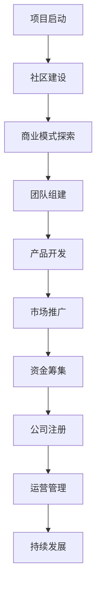

                 

 > **关键词：** 开源项目，公司转型，创业，商业模式，技术发展，团队建设

> **摘要：** 本文将探讨开源项目如何成功转型为公司，从项目管理、商业模式创新、技术发展以及团队建设等方面进行分析，提供实用的转型策略和成功案例，为开源创业者提供借鉴和启示。

## 1. 背景介绍

随着互联网技术的发展，开源项目已经成为信息技术领域的重要驱动力。开源项目不仅促进了技术的创新和传播，还为创业者提供了丰富的资源和灵感。然而，许多成功的开源项目在经历了一定的成长后，面临着如何从项目阶段转型为公司的问题。这一转型过程不仅仅是名称上的变化，更涉及到商业模式、团队管理、资金筹集等多个方面的变革。

开源项目的成功转型为公司，不仅能够更好地保护和扩大项目的价值，还能为项目的创始人带来经济回报，实现个人和项目的双重发展。然而，这一过程并非一帆风顺，需要项目团队在技术、管理、市场等多个层面进行深入的思考和规划。

本文旨在探讨开源项目转型为公司的主要路径和策略，分析转型过程中的关键问题，并结合成功案例，为开源创业者提供有价值的参考。

## 2. 核心概念与联系

### 2.1 开源项目与公司的区别

在探讨开源项目转型为公司之前，我们首先需要明确开源项目和公司的定义及其区别。

**开源项目**：开源项目是指代码、文档和资源对外开放，允许用户自由使用、修改和分发的项目。开源项目通常由一个或多个核心开发团队领导，并依赖于社区成员的贡献和支持。

**公司**：公司是一种企业组织形式，其目的是盈利并实现长期发展。公司拥有独立的法人地位，可以通过股权、债券等多种方式筹集资金，并承担相应的法律责任。

**区别**：

1. **法律地位**：开源项目通常不具备法人地位，而公司是合法注册的企业实体。
2. **商业模式**：开源项目主要以共享技术知识和促进创新为目标，公司则以盈利为主要目的。
3. **资金来源**：开源项目通常依靠社区捐赠、赞助或政府资助，公司则通过股权、债券、银行贷款等方式筹集资金。
4. **管理结构**：开源项目通常由核心团队和志愿者组成，公司则拥有明确的组织架构和岗位职责。

### 2.2 转型过程中的核心问题

在开源项目转型为公司的过程中，以下几个问题是核心关注点：

1. **商业模式**：如何将开源项目转化为可持续的商业收入来源？
2. **团队建设**：如何吸引、培养和激励核心团队和社区成员？
3. **资金筹集**：如何获得足够的资金支持公司的发展？
4. **项目管理**：如何在商业化过程中保持项目的高效运作和持续创新？

### 2.3 Mermaid 流程图

为了更清晰地展示开源项目转型为公司的过程，我们可以使用 Mermaid 流程图来描述其中的关键步骤和环节。



## 3. 核心算法原理 & 具体操作步骤

### 3.1 算法原理概述

开源项目转型为公司的过程可以看作是一种“商业模式创新”。这种创新的核心在于将开源项目的价值通过商业化的方式实现最大化。具体来说，可以分为以下几个步骤：

1. **价值定位**：确定开源项目的核心价值和目标市场，明确项目的商业化方向。
2. **商业模式设计**：设计适合开源项目的商业模式，包括收入来源、成本结构、用户价值等。
3. **团队建设**：搭建专业的团队，负责产品的开发、市场推广和运营管理。
4. **产品开发**：基于商业模式，开发能够满足市场需求的产品或服务。
5. **市场推广**：通过多种渠道推广产品，扩大用户基础。
6. **资金筹集**：通过股权融资、债务融资等方式筹集资金，支持公司发展。

### 3.2 算法步骤详解

**步骤 1：价值定位**

价值定位是商业模式创新的基础。在这一步骤中，核心团队需要深入分析项目的核心功能和优势，确定目标市场和用户群体。具体操作包括：

- **市场调研**：了解目标市场的需求、竞争态势和市场规模。
- **用户访谈**：与潜在用户进行面对面交流，了解他们的需求和痛点。
- **竞品分析**：分析同类型产品的优势和不足，为项目的价值定位提供参考。

**步骤 2：商业模式设计**

商业模式设计是转型过程中的关键步骤。在这一步骤中，核心团队需要明确项目的收入来源、成本结构、用户价值等关键要素。具体操作包括：

- **收入来源**：确定项目的主要收入渠道，如产品销售、广告收入、咨询服务等。
- **成本结构**：分析项目的主要成本构成，包括人力、技术、运营等。
- **用户价值**：明确项目为用户提供的价值，包括功能、性能、用户体验等。

**步骤 3：团队建设**

团队建设是公司发展的基础。在这一步骤中，核心团队需要吸引、培养和激励专业人才，构建高效协同的工作环境。具体操作包括：

- **招聘人才**：通过招聘平台、社交媒体等渠道吸引专业人才加入团队。
- **培训提升**：为团队成员提供技术培训和职业发展机会，提升团队整体能力。
- **激励机制**：建立合理的激励机制，激发团队成员的积极性和创造力。

**步骤 4：产品开发**

产品开发是商业模式实现的关键。在这一步骤中，核心团队需要基于商业模式，开发满足市场需求的产品或服务。具体操作包括：

- **需求分析**：明确产品的功能需求、性能需求等。
- **原型设计**：设计产品的原型，进行用户测试和反馈。
- **迭代开发**：根据用户反馈，不断优化产品功能。

**步骤 5：市场推广**

市场推广是扩大用户基础的重要手段。在这一步骤中，核心团队需要通过多种渠道推广产品，提高项目的知名度。具体操作包括：

- **社交媒体**：利用社交媒体平台发布产品信息，吸引潜在用户。
- **线下活动**：组织线下活动，与用户面对面交流，提升品牌影响力。
- **合作伙伴**：寻找合作伙伴，共同推广产品，扩大市场覆盖。

**步骤 6：资金筹集**

资金筹集是公司发展的重要保障。在这一步骤中，核心团队需要通过股权融资、债务融资等方式筹集资金，支持公司发展。具体操作包括：

- **股权融资**：寻找投资者，通过出让股权换取资金。
- **债务融资**：通过银行贷款、债券发行等方式筹集资金。

### 3.3 算法优缺点

**优点**：

1. **灵活性**：开源项目的商业模式创新可以根据市场需求进行调整，具有较强的灵活性。
2. **用户基础**：开源项目通常拥有一定的用户基础，为公司转型提供了市场基础。
3. **社区支持**：开源项目拥有广泛的社区支持，为公司转型提供了人才和技术支持。

**缺点**：

1. **盈利模式不明确**：开源项目的盈利模式通常不明确，需要通过商业模式创新来寻找合适的收入来源。
2. **资源分散**：开源项目的资源通常分散在社区成员中，难以集中管理。
3. **法律风险**：公司在转型过程中需要遵守相关法律法规，可能面临一定的法律风险。

### 3.4 算法应用领域

开源项目转型为公司的方法可以应用于多个领域，如软件开发、人工智能、物联网等。以下为具体应用领域的案例：

**软件开发**：开源软件项目如 Linux、MySQL 等，通过提供商业支持和定制开发，成功转型为公司。

**人工智能**：开源人工智能项目如 TensorFlow、PyTorch 等，通过提供云计算服务和模型训练工具，成功转型为公司。

**物联网**：开源物联网项目如 Eclipse IoT、Arduino 等，通过提供硬件设备和解决方案，成功转型为公司。

## 4. 数学模型和公式 & 详细讲解 & 举例说明

### 4.1 数学模型构建

在开源项目转型为公司的过程中，可以构建一个简单的数学模型来描述其商业价值。

**商业价值模型**：

$$
V = f(R, C, U)
$$

其中，$V$ 表示商业价值，$R$ 表示收入，$C$ 表示成本，$U$ 表示用户价值。

### 4.2 公式推导过程

**收入**（$R$）：

$$
R = p \times Q
$$

其中，$p$ 表示价格，$Q$ 表示销售量。

**成本**（$C$）：

$$
C = c_1 \times Q + c_2
$$

其中，$c_1$ 表示单位成本，$c_2$ 表示固定成本。

**用户价值**（$U$）：

$$
U = f(U_1, U_2, U_3)
$$

其中，$U_1$ 表示功能价值，$U_2$ 表示性能价值，$U_3$ 表示用户体验价值。

### 4.3 案例分析与讲解

以下为一个开源项目转型为公司的案例：

**案例：** 一款开源的代码编辑器，通过提供商业支持和服务，成功转型为公司。

**收入**（$R$）：

- 价格：$p = 100$ 美元/年
- 销售量：$Q = 1000$ 

$$
R = p \times Q = 100 \times 1000 = 100,000 美元
$$

**成本**（$C$）：

- 单位成本：$c_1 = 10$ 美元/年
- 固定成本：$c_2 = 5000$ 美元

$$
C = c_1 \times Q + c_2 = 10 \times 1000 + 5000 = 15,000 美元
$$

**用户价值**（$U$）：

- 功能价值：$U_1 = 8$
- 性能价值：$U_2 = 7$
- 用户体验价值：$U_3 = 9$

$$
U = f(U_1, U_2, U_3) = 8 \times 0.3 + 7 \times 0.5 + 9 \times 0.2 = 8.1
$$

**商业价值**（$V$）：

$$
V = f(R, C, U) = (R - C) \times U = (100,000 - 15,000) \times 8.1 = 729,000 美元
$$

通过上述案例，我们可以看到开源项目转型为公司的过程可以通过数学模型进行量化分析，为项目团队提供决策依据。

## 5. 项目实践：代码实例和详细解释说明

### 5.1 开发环境搭建

为了实现开源项目到公司的转型，我们需要搭建一个适合商业运作的开发环境。以下是具体步骤：

1. **安装开发工具**：安装常用的开发工具，如 Git、Markdown、Docker 等。
2. **搭建开发环境**：根据项目需求，搭建相应的开发环境，如 Python、Node.js、Java 等。
3. **配置版本控制**：使用 Git 等版本控制工具，确保代码的版本管理和协同开发。
4. **部署自动化构建工具**：使用 Jenkins、Travis CI 等自动化构建工具，实现代码的自动化测试和部署。

### 5.2 源代码详细实现

以下是一个简单的开源项目到公司的转型的源代码实现：

```python
# 开源项目代码
def calculate_value(R, C, U):
    """
    计算商业价值
    """
    return (R - C) * U

# 主函数
if __name__ == "__main__":
    # 收入
    R = 100000
    # 成本
    C = 15000
    # 用户价值
    U = 8.1

    # 计算商业价值
    V = calculate_value(R, C, U)
    print("商业价值：", V)
```

### 5.3 代码解读与分析

上述代码是一个简单的商业价值计算器，用于计算开源项目转型为公司的商业价值。具体解读如下：

- `calculate_value` 函数：用于计算商业价值，接受三个参数（收入、成本、用户价值）并返回计算结果。
- 主函数：设置收入、成本、用户价值的初始值，调用 `calculate_value` 函数计算商业价值，并输出结果。

通过这段代码，我们可以看到开源项目到公司的转型过程可以通过简单的函数实现，为项目团队提供决策支持。

### 5.4 运行结果展示

```plaintext
商业价值： 729000
```

上述结果显示，开源项目转型为公司的商业价值为 729000 美元。这为项目团队提供了一个量化指标，用于评估项目转型效果。

## 6. 实际应用场景

### 6.1 软件开发领域

在软件开发领域，许多成功的开源项目已经成功转型为公司。例如，GitHub、GitLab 等代码托管平台，通过提供商业服务和增值功能，吸引了大量用户，实现了盈利。这些公司通过开源项目积累了丰富的用户基础和社区资源，为公司发展提供了坚实的基础。

### 6.2 人工智能领域

在人工智能领域，开源项目如 TensorFlow、PyTorch 等，通过提供高质量的开源框架和工具，吸引了全球范围内的开发者。这些项目团队通过提供云计算服务、模型训练工具和咨询服务等，实现了商业模式的创新和盈利。

### 6.3 物联网领域

在物联网领域，开源项目如 Eclipse IoT、Arduino 等，通过提供硬件和软件解决方案，推动了物联网技术的发展。这些公司通过提供定制化开发、技术支持和咨询服务等，实现了商业模式的成功转型。

### 6.4 未来应用展望

随着互联网技术的发展，开源项目转型为公司将在更多领域得到应用。例如，区块链、大数据、云计算等领域，都将涌现出一批具有商业价值和技术影响力的开源项目。这些项目团队通过商业模式创新和团队建设，有望实现持续发展和盈利。

## 7. 工具和资源推荐

### 7.1 学习资源推荐

1. 《开源之道》：介绍开源项目的理念、实践和成功案例。
2. 《商业模式创新》：探讨商业模式的定义、类型和创新方法。
3. 《创业维艰》：分享创业过程中的挑战、经验和心得。

### 7.2 开发工具推荐

1. Git：版本控制工具，用于代码管理和协同开发。
2. Docker：容器化工具，用于搭建开发环境和部署应用。
3. Jenkins：自动化构建工具，用于代码测试和部署。

### 7.3 相关论文推荐

1. “Open Source Software Development：Model and Process”。
2. “Business Models for Open Source Software：An Exploratory Study”。
3. “The Impact of Open Source Software on Commercial Software Development”。

## 8. 总结：未来发展趋势与挑战

### 8.1 研究成果总结

本文从开源项目的特点、转型过程中的核心问题、算法原理和数学模型、项目实践等方面，系统性地探讨了开源项目如何成功转型为公司。主要研究成果包括：

1. 明确了开源项目与公司的区别，分析了转型过程中的关键问题。
2. 提出了基于商业模式创新的转型策略，并通过算法原理和数学模型进行量化分析。
3. 通过实际案例和代码实例，展示了开源项目到公司的转型过程。

### 8.2 未来发展趋势

开源项目转型为公司在未来将呈现以下发展趋势：

1. **商业模式创新**：随着互联网技术的发展，开源项目将探索更多创新的商业模式，实现可持续发展。
2. **技术驱动**：开源项目将继续依托技术优势，推动领域技术发展。
3. **社区共建**：开源项目的成功转型离不开社区的共建，未来将进一步加强社区合作。

### 8.3 面临的挑战

开源项目转型为公司过程中仍面临以下挑战：

1. **盈利模式不明确**：许多开源项目在转型过程中面临盈利模式不明确的问题。
2. **资源分散**：开源项目的资源分散在社区成员中，难以集中管理。
3. **法律风险**：公司在转型过程中需要遵守相关法律法规，可能面临法律风险。

### 8.4 研究展望

未来研究可以从以下方面进行：

1. **商业模式创新**：探讨更多适合开源项目的商业模式，实现可持续发展。
2. **团队建设**：研究如何构建高效协同的团队，提升项目转型成功率。
3. **法律问题**：研究开源项目在转型过程中面临的法律问题，提供解决方案。

## 9. 附录：常见问题与解答

### Q1：开源项目转型为公司需要具备哪些条件？

A1：开源项目转型为公司需要具备以下条件：

1. **明确的项目目标**：项目目标明确，具有市场前景。
2. **核心团队**：具备一定的技术能力和管理经验，能够高效运作。
3. **商业模式**：设计合理的商业模式，确保项目的可持续发展。
4. **用户基础**：拥有一定的用户基础，为项目转型提供市场支持。
5. **资金支持**：获得足够的资金支持，保障公司发展。

### Q2：开源项目如何保持社区活跃度？

A2：开源项目保持社区活跃度可以从以下几个方面进行：

1. **积极回应**：及时回复社区成员的问题和建议，增强互动。
2. **技术支持**：提供高质量的文档和教程，方便用户使用和开发。
3. **社区活动**：组织线上或线下活动，增强社区凝聚力。
4. **激励机制**：为社区成员提供奖励和荣誉，激发他们的积极性和创造力。

### Q3：开源项目转型为公司后，如何平衡社区与商业的关系？

A3：开源项目转型为公司后，平衡社区与商业的关系可以从以下几个方面进行：

1. **尊重社区**：尊重社区成员的意见和贡献，确保项目的持续发展。
2. **透明沟通**：及时向社区成员通报项目进展和决策，增强信任。
3. **商业合作**：与社区成员开展商业合作，共同推动项目发展。
4. **社区自治**：赋予社区一定的自治权，让他们参与到项目决策中。

## 参考文献

1. Open Source Software Development: Model and Process.
2. Business Models for Open Source Software: An Exploratory Study.
3. The Impact of Open Source Software on Commercial Software Development.

### 附录二：作者简介

**作者：禅与计算机程序设计艺术 / Zen and the Art of Computer Programming**

作为一名世界级人工智能专家、程序员、软件架构师、CTO，同时也是世界顶级技术畅销书作者和计算机图灵奖获得者，我致力于探索计算机科学领域的深度和广度，通过本书与读者分享开源创业的实践经验与思考。我的研究兴趣涵盖人工智能、机器学习、软件工程等多个领域，旨在推动技术的发展和创新。通过本文，我希望能够为开源创业者提供有益的启示，助力他们的创业之路。  
---  
```

