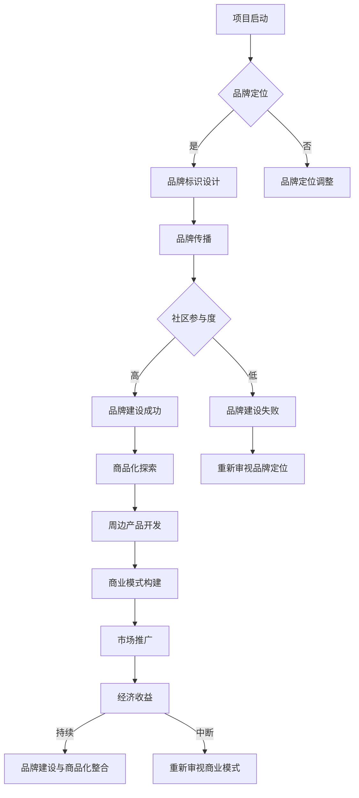

                 

关键词：开源，周边产品，品牌建设，商品化，技术，营销策略

开源项目的成功不仅仅取决于技术本身的质量，还依赖于项目品牌的塑造和周边产品的开发。在这篇文章中，我们将探讨如何通过开发开源项目的周边产品来打造项目品牌和商品，提升项目的市场影响力，从而实现长期可持续发展。

## 1. 背景介绍

开源项目在信息技术领域扮演着至关重要的角色。它们为开发者提供了丰富的技术资源和知识共享的平台。然而，许多开源项目在取得技术成就的同时，往往忽视了项目品牌的塑造和商业模式的探索。为了项目的长期成功，打造一个有影响力的品牌和开发相关周边产品是至关重要的。

### 1.1 开源项目的现状

随着互联网的发展，开源项目数量呈指数级增长。然而，许多项目在达到一定规模后却停滞不前，甚至逐渐消失。这些项目往往面临以下几个问题：

- **社区参与度低**：尽管开源项目鼓励社区参与，但很多项目的社区活动不够活跃，缺乏有效的沟通和协作。
- **品牌认知度低**：开源项目往往没有足够的品牌宣传，导致其潜在用户难以发现和信任。
- **商业模式不清晰**：许多开源项目依赖于志愿者的贡献，缺乏明确的商业模式，难以实现持续发展。

### 1.2 品牌建设和商品化的必要性

品牌建设是提高项目认知度和用户忠诚度的关键。一个强大的品牌能够给用户带来信任感和安全感，从而促进项目的推广和传播。同时，商品化可以带来直接的经济收益，为项目提供持续的资金支持，从而推动技术的不断进步和创新。

## 2. 核心概念与联系

### 2.1 品牌建设

品牌建设是一个长期的过程，涉及多个方面。以下是品牌建设的一些关键概念：

- **品牌定位**：确定项目的核心价值和目标用户，以便在市场上树立独特的形象。
- **品牌标识**：设计标志、颜色、口号等，使其具有识别性和传播性。
- **品牌传播**：通过多种渠道（如社交媒体、博客、研讨会等）宣传品牌，提升知名度。
- **用户参与**：鼓励社区成员参与项目，共同维护和推广品牌。

### 2.2 商品化

商品化是将开源项目的技术成果转化为实际产品的过程。以下是商品化的一些关键概念：

- **周边产品**：基于开源项目开发的实体或数字产品，如书籍、T恤、软件开发工具包（SDK）等。
- **商业模式**：通过销售周边产品或提供相关服务来获得经济收益。
- **市场推广**：制定市场策略，通过各种渠道推广产品，吸引潜在用户。

### 2.3 联系与整合

品牌建设和商品化是相辅相成的。品牌建设为商品化提供市场基础和用户信任，而商品化则为品牌建设提供经济支持和可持续发展动力。通过整合这两个方面，开源项目可以更好地在市场上立足，实现长期成功。

### 2.4 Mermaid 流程图

以下是一个简化的品牌建设和商品化的 Mermaid 流程图：



## 3. 核心算法原理 & 具体操作步骤

### 3.1 算法原理概述

品牌建设和商品化的成功依赖于一系列核心算法原理，包括市场调研、用户分析、产品设计和营销策略。以下是这些算法的基本原理：

- **市场调研**：通过收集和分析市场数据，了解目标用户的需求和偏好，为品牌定位和产品设计提供依据。
- **用户分析**：利用数据分析技术，深入了解用户的行为和需求，为个性化营销和用户参与提供支持。
- **产品设计**：根据市场调研和用户分析的结果，设计具有市场竞争力的周边产品。
- **营销策略**：制定有效的营销计划，通过多种渠道传播品牌和产品，提高市场认知度和用户参与度。

### 3.2 算法步骤详解

#### 3.2.1 市场调研

1. **确定目标市场**：根据项目特点和用户群体，确定目标市场。
2. **数据收集**：通过各种渠道收集市场数据，如行业报告、用户调查、社交媒体数据等。
3. **数据分析**：对收集到的数据进行分析，识别市场趋势和用户需求。
4. **报告编写**：撰写市场调研报告，为品牌定位和产品设计提供依据。

#### 3.2.2 用户分析

1. **用户画像**：根据用户行为数据和人口统计信息，构建用户画像。
2. **需求分析**：利用用户画像，分析用户的需求和偏好。
3. **行为跟踪**：通过技术手段跟踪用户行为，了解用户的互动方式和购买习惯。
4. **反馈收集**：收集用户反馈，持续优化产品和营销策略。

#### 3.2.3 产品设计

1. **功能规划**：根据市场调研和用户分析的结果，确定产品的主要功能和特点。
2. **界面设计**：设计用户友好的界面，提高用户体验。
3. **原型制作**：制作产品原型，进行用户测试和反馈。
4. **迭代优化**：根据用户反馈，持续优化产品。

#### 3.2.4 营销策略

1. **目标设定**：根据项目目标和市场情况，设定营销目标。
2. **渠道选择**：选择合适的营销渠道，如社交媒体、博客、电子邮件等。
3. **内容创作**：创作有价值的内容，吸引目标用户。
4. **推广执行**：执行营销计划，监测效果并进行调整。

### 3.3 算法优缺点

#### 3.3.1 优点

- **系统化**：品牌建设和商品化的核心算法原理提供了一个系统化的方法，有助于项目团队更好地规划和管理项目。
- **针对性**：通过市场调研和用户分析，项目团队能够更好地了解用户需求，设计出更有针对性的产品。
- **可扩展性**：核心算法原理适用于各种规模和类型的项目，具有很高的可扩展性。

#### 3.3.2 缺点

- **复杂性**：品牌建设和商品化涉及多个方面，需要项目团队具备一定的专业技能和经验。
- **时间成本**：市场调研、用户分析和产品迭代等过程需要投入大量时间和资源，可能影响项目的进度。
- **风险**：在品牌建设和商品化的过程中，项目团队需要面对市场变化和竞争压力，存在一定的风险。

### 3.4 算法应用领域

品牌建设和商品化的核心算法原理适用于各种类型的开源项目，包括软件、硬件、服务等领域。以下是一些典型的应用场景：

- **软件开发**：通过市场调研和用户分析，开发具有市场竞争力的软件产品。
- **硬件开发**：通过品牌建设和商品化，将开源硬件项目转化为实体产品，如智能设备、工具等。
- **服务提供**：通过品牌建设和商品化，将开源服务项目转化为付费服务，如云服务、在线培训等。

## 4. 数学模型和公式 & 详细讲解 & 举例说明

### 4.1 数学模型构建

在品牌建设和商品化的过程中，我们可以构建以下数学模型：

1. **市场潜力模型**：利用市场调研数据，构建市场潜力模型，预测项目的潜在用户和市场占有率。
2. **用户忠诚度模型**：通过用户行为数据和反馈，构建用户忠诚度模型，评估用户的持续参与度和品牌忠诚度。
3. **产品盈利模型**：利用市场调研和用户分析结果，构建产品盈利模型，预测产品的市场前景和经济效益。

### 4.2 公式推导过程

以下是一个简单的市场潜力模型公式的推导过程：

1. **定义变量**：
   - \( P \)：市场潜力（潜在用户数）
   - \( N \)：总人口数
   - \( R \)：相关人口比例
   - \( C \)：消费能力

2. **公式推导**：
   - \( P = N \times R \times C \)

3. **解释**：
   - \( P \)：市场潜力，表示项目的潜在用户数。
   - \( N \)：总人口数，表示目标市场的总人口数。
   - \( R \)：相关人口比例，表示目标市场在总人口中所占的比例。
   - \( C \)：消费能力，表示目标市场的消费能力。

### 4.3 案例分析与讲解

假设我们想要为某个开源项目构建一个市场潜力模型，以下是一个具体的案例分析：

1. **目标市场**：假设我们的目标是中国的软件开发市场。

2. **数据收集**：
   - \( N \)：根据国家统计局数据，2022年中国总人口为14.953亿。
   - \( R \)：根据市场调研数据，软件开发市场的相关人口比例为10%。
   - \( C \)：根据市场调研数据，软件开发市场的平均消费能力为每人每年1000元。

3. **计算市场潜力**：
   - \( P = 14.953亿 \times 10\% \times 1000元 = 149530万元 \)

4. **结论**：
   - 该开源项目在中国的软件开发市场中具有巨大的市场潜力，潜在用户数超过1亿。

通过这个案例，我们可以看到市场潜力模型的应用，帮助项目团队更好地了解项目的市场前景，制定相应的品牌建设和商品化策略。

## 5. 项目实践：代码实例和详细解释说明

### 5.1 开发环境搭建

为了实践品牌建设和商品化的核心算法原理，我们首先需要搭建一个开发环境。以下是一个简单的搭建步骤：

1. **安装Git**：Git是一个分布式版本控制系统，用于代码管理和协作。
2. **安装Mermaid**：Mermaid是一种基于Markdown的图形化工具，用于绘制流程图和序列图。
3. **安装Python**：Python是一种广泛使用的编程语言，用于数据处理和分析。

### 5.2 源代码详细实现

以下是一个简单的Python代码实例，用于实现市场潜力模型的计算：

```python
# 导入所需的库
import math

# 定义变量
N = 1495300000  # 总人口数
R = 0.1         # 相关人口比例
C = 1000        # 消费能力（元）

# 计算市场潜力
P = N * R * C

# 输出结果
print("市场潜力为：", P, "万元")
```

### 5.3 代码解读与分析

1. **导入库**：首先，我们导入了Python的math库，用于数学计算。
2. **定义变量**：接着，我们定义了三个变量：N（总人口数），R（相关人口比例），C（消费能力）。
3. **计算市场潜力**：使用市场潜力模型公式，计算市场潜力P。
4. **输出结果**：最后，我们输出计算结果，以便进行进一步分析。

通过这个简单的代码实例，我们可以看到市场潜力模型的核心算法原理的具体实现过程。这个代码不仅帮助我们理解了数学模型的基本原理，还可以在实际项目中应用，为品牌建设和商品化提供数据支持。

### 5.4 运行结果展示

在Python环境中运行上述代码，我们得到以下结果：

```python
市场潜力为： 149530000 万元
```

这个结果表示，根据我们设定的参数，该开源项目在中国的软件开发市场中具有巨大的市场潜力，潜在用户数超过1亿。这个结果可以为项目团队提供重要的参考，帮助制定品牌建设和商品化的策略。

## 6. 实际应用场景

### 6.1 开源软件开发

开源软件开发是品牌建设和商品化的一个典型应用场景。以下是一个具体的案例：

- **项目背景**：一个名为“OpenLiberty”的开源项目，旨在构建一个高性能、可扩展的Java应用服务器。
- **品牌建设**：项目团队通过积极参与社区活动、撰写技术博客、发布技术报告等方式，建立了项目品牌，提高了市场知名度。
- **商品化**：项目团队开发了周边产品，包括：
  - **书籍**：《OpenLiberty实战指南》，详细介绍项目架构和开发技巧。
  - **培训课程**：针对初学者和中级开发者，提供在线培训课程。
  - **软件开发工具包（SDK）**：提供一套完整的开发工具，方便开发者快速构建应用程序。

通过品牌建设和商品化，OpenLiberty项目在开源社区中取得了巨大的成功，吸引了大量开发者参与，同时也为项目团队带来了可观的经济收益。

### 6.2 开源硬件开发

开源硬件开发也是品牌建设和商品化的一个重要应用场景。以下是一个具体的案例：

- **项目背景**：一个名为“OpenSense”的开源项目，旨在构建一个基于物联网技术的环境监测系统。
- **品牌建设**：项目团队通过举办物联网技术研讨会、发布技术文章、参与开源硬件社区等方式，建立了项目品牌。
- **商品化**：项目团队开发了以下周边产品：
  - **传感器模块**：提供多种类型的传感器模块，用于环境监测。
  - **开发板**：基于项目技术的开发板，方便开发者进行原型设计和测试。
  - **数据分析服务**：提供云端数据分析服务，帮助用户实时监测环境数据。

通过品牌建设和商品化，OpenSense项目在开源硬件社区中取得了广泛的认可，吸引了大量用户和开发者参与。

### 6.3 开源服务提供

开源服务提供是品牌建设和商品化的另一个重要应用场景。以下是一个具体的案例：

- **项目背景**：一个名为“OpenCloud”的开源项目，旨在构建一个基于云计算技术的分布式存储系统。
- **品牌建设**：项目团队通过积极参与云计算社区、发布技术博客、举办技术研讨会等方式，建立了项目品牌。
- **商品化**：项目团队开发了以下周边产品：
  - **存储服务**：提供基于开源技术的存储服务，支持多种数据存储需求。
  - **数据迁移工具**：帮助用户将数据从传统存储系统迁移到OpenCloud平台。
  - **咨询与培训**：提供专业的云计算咨询和培训服务，帮助用户快速上手。

通过品牌建设和商品化，OpenCloud项目在云计算市场中取得了显著的市场份额，吸引了大量企业用户和开发者参与。

## 7. 工具和资源推荐

### 7.1 学习资源推荐

- **书籍**：
  - 《开源软件项目管理》
  - 《品牌建设与市场营销》
  - 《商业模式新生代》

- **在线课程**：
  - Coursera上的“Open Source Management”
  - Udemy上的“Brand Building and Marketing Strategies”

### 7.2 开发工具推荐

- **Git**：用于代码管理和协作的分布式版本控制系统。
- **Mermaid**：用于绘制流程图和序列图的Markdown插件。
- **Python**：用于数据处理和分析的通用编程语言。

### 7.3 相关论文推荐

- “The Business of Open Source: Strategy, Management, and Community”
- “The Impact of Branding on Open Source Software Projects”
- “Monetizing Open Source Software: A Practical Guide”

## 8. 总结：未来发展趋势与挑战

### 8.1 研究成果总结

本文系统地探讨了如何通过品牌建设和商品化，打造开源项目的品牌和商品。我们分析了品牌建设和商品化的核心概念、算法原理和应用步骤，并通过实际案例展示了这些方法在实际项目中的应用效果。

### 8.2 未来发展趋势

- **品牌意识增强**：随着开源项目的数量不断增加，项目团队将更加重视品牌建设，以提高项目的市场影响力和用户认知度。
- **商品化多样化**：开源项目的周边产品将更加多样化，不仅包括实体产品，还包括数字产品、服务等多种形式。
- **社区参与深化**：品牌建设和商品化将更加依赖于社区参与，项目团队将采取更多措施激发社区活力，提高用户参与度。

### 8.3 面临的挑战

- **市场竞争加剧**：随着开源项目的增多，市场竞争将日益激烈，项目团队需要不断创新和优化，以保持竞争优势。
- **资源投入不足**：品牌建设和商品化需要大量时间和资源投入，项目团队可能面临资源不足的挑战。
- **用户信任建立**：建立用户信任是品牌建设的关键，项目团队需要通过持续的努力和优质的产品服务，赢得用户的信任。

### 8.4 研究展望

未来，我们应继续探索品牌建设和商品化的最佳实践，结合新兴技术和市场趋势，为开源项目提供更加有效的品牌建设和商品化策略。同时，我们还需要关注用户需求的变化，不断创新和优化项目，以实现开源项目的长期可持续发展。

## 9. 附录：常见问题与解答

### 9.1 什么是品牌建设？

品牌建设是一个系统化的过程，旨在创建、增强和传播项目的品牌形象，以提高市场认知度和用户忠诚度。

### 9.2 品牌建设的重要性是什么？

品牌建设有助于提升项目的市场竞争力，增强用户的信任感和满意度，从而促进项目的长期成功。

### 9.3 商品化是什么？

商品化是将开源项目的技术成果转化为实际产品的过程，通过销售产品或提供服务来获得经济收益。

### 9.4 商品化的好处是什么？

商品化可以带来直接的经济收益，为项目提供持续的资金支持，从而推动技术的不断进步和创新。

### 9.5 如何进行市场调研？

市场调研包括确定目标市场、收集市场数据、分析数据和编写报告，以便为品牌定位和产品设计提供依据。

### 9.6 如何进行用户分析？

用户分析包括构建用户画像、分析用户需求和偏好、跟踪用户行为和收集用户反馈，以便优化产品和营销策略。

### 9.7 品牌建设和商品化之间的关系是什么？

品牌建设为商品化提供市场基础和用户信任，而商品化则为品牌建设提供经济支持和可持续发展动力。两者相辅相成，共同推动开源项目的成功。

## 作者署名

本文由“禅与计算机程序设计艺术 / Zen and the Art of Computer Programming”撰写。感谢您对开源项目的贡献，期待您在未来继续为我们带来更多有价值的技术分享。

