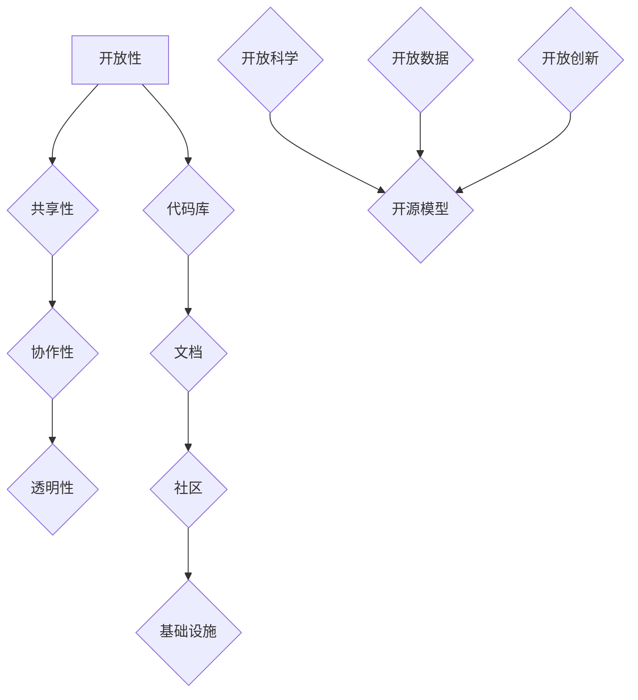

                 

关键词：开源模型、研究创新、Meta支持、开源社区、机遇、优势

> 摘要：本文探讨了开源模型在现代技术发展中的优势，特别是在促进研究创新方面的重要性。文章通过分析开源模型的核心概念和架构，探讨了其应用领域和算法原理。同时，本文也讨论了数学模型和公式在开源模型中的应用，并通过具体项目实践展示了开源模型的实际应用效果。最后，文章提出了开源模型未来应用场景的展望，并对开源社区的发展趋势和挑战进行了深入分析。

## 1. 背景介绍

在当今快速发展的科技时代，开源模型已经成为推动研究创新的重要力量。开源模型是指以开放、共享的方式开发和维护的软件模型，允许任何人自由使用、修改和分发。这种模式的出现，打破了传统封闭软件的开发模式，使得研究者和开发者可以更便捷地获取和使用最新的技术成果。

开源模型的优势主要体现在以下几个方面：

1. 促进研究创新：开源模型鼓励共享和合作，使得研究者和开发者可以更快地获取并利用最新的研究成果，从而推动研究创新。开源模型的开放性也为研究人员提供了更多的实验数据和模型参数，有助于深化对问题的理解。

2. 降低开发成本：开源模型允许任何人自由使用和修改，这意味着开发者可以节省大量的开发成本，特别是在早期开发阶段。此外，开源模型还提供了丰富的工具和资源，方便开发者进行调试和优化。

3. 提高软件质量：开源模型通过社区的协作和反馈机制，可以有效提高软件的质量和稳定性。社区的参与者可以对代码进行审查和测试，及时发现并修复潜在的问题。

4. 培养开源文化：开源模型促进了开源文化的形成，鼓励人们分享知识和经验，培养合作精神。这种文化对于科技发展和社会进步具有重要意义。

随着开源模型的应用日益广泛，其在研究创新和软件开发中发挥着越来越重要的作用。本文将深入探讨开源模型的优势，特别是Meta等大型科技公司对开源社区的支持，以及开源模型在人工智能、大数据等领域的应用前景。

## 2. 核心概念与联系

### 2.1 开源模型的核心概念

开源模型的核心概念包括以下几个方面：

1. **开放性**：开源模型的最大特点是其开放性，允许任何人自由访问、使用、修改和分发。这种开放性使得研究者和开发者可以轻松获取和利用最新的技术成果。

2. **共享性**：开源模型鼓励共享，使得知识和技术可以在全球范围内传播。这种共享性有助于加速研究创新，提高整个社会的科技水平。

3. **协作性**：开源模型通过社区的协作和反馈机制，实现了代码的质量控制和持续优化。协作性不仅提高了软件的稳定性，还促进了技术交流和人才培养。

4. **透明性**：开源模型的所有开发过程都是公开透明的，任何人都可以查看和参与。这种透明性有助于提高项目的可信度，减少信息不对称。

### 2.2 开源模型的架构

开源模型的架构通常包括以下几个部分：

1. **代码库**：代码库是开源模型的核心，包含了所有的源代码、文档和测试用例。代码库通常托管在版本控制系统（如Git）上，便于管理和协作。

2. **文档**：文档是开源模型的重要组成部分，包括用户手册、开发指南和API文档等。良好的文档可以帮助用户更好地理解和使用开源模型。

3. **社区**：社区是开源模型的核心力量，包括开发者、用户、贡献者和维护者等。社区成员通过协作和沟通，共同推动项目的进展。

4. **基础设施**：基础设施包括构建工具、测试环境、部署平台等，为开源模型提供了必要的运行和支持环境。

### 2.3 开源模型与其他概念的联系

开源模型与其他概念如开放科学、开放数据和开放创新等有着密切的联系。

1. **开放科学**：开源模型是开放科学的重要组成部分，它推动了科学研究的透明性和可重复性。通过开源模型，研究人员可以更容易地分享数据和结果，促进科学知识的传播和积累。

2. **开放数据**：开源模型依赖于开放数据，特别是公共数据集和开源数据源。开放数据为开源模型提供了丰富的实验材料，有助于提高模型的准确性和可靠性。

3. **开放创新**：开源模型是开放创新的一种表现形式，它通过开放共享，降低了创新的门槛，促进了技术的快速扩散和应用。

### 2.4 Mermaid 流程图

以下是开源模型的核心概念和架构的 Mermaid 流程图：



通过上述流程图，我们可以清晰地看到开源模型的核心概念和架构，以及它们与其他概念之间的联系。

## 3. 核心算法原理 & 具体操作步骤

### 3.1 算法原理概述

开源模型在算法设计上通常遵循以下几个原则：

1. **可扩展性**：开源模型需要支持模块化和扩展性，以便于研究人员根据具体需求进行定制和优化。
2. **可重复性**：开源模型要求代码和实验过程公开透明，确保其他研究人员可以重复实验结果。
3. **高效性**：开源模型在算法设计上注重效率，以降低计算资源和时间成本。
4. **稳定性**：开源模型需要经过严格的测试和验证，以确保在高负载和复杂环境下依然稳定运行。

### 3.2 算法步骤详解

以下是一个典型的开源模型算法步骤详解：

1. **数据预处理**：数据预处理包括数据清洗、归一化和特征提取等步骤。这一步骤的目的是确保数据质量，为后续算法训练提供良好的数据基础。

2. **模型选择**：根据研究需求和数据特点，选择合适的算法模型。常见的开源模型包括深度学习模型、决策树、支持向量机等。

3. **模型训练**：使用预处理后的数据对模型进行训练。训练过程中，通过优化算法调整模型参数，以提高模型的预测性能。

4. **模型评估**：使用验证集对训练好的模型进行评估。常见的评估指标包括准确率、召回率、F1分数等。

5. **模型部署**：将评估性能良好的模型部署到生产环境中，以实现实际应用。

### 3.3 算法优缺点

开源模型的算法具有以下优缺点：

**优点**：

1. **开放性**：开源模型允许任何人自由访问和修改，有助于知识共享和合作。
2. **灵活性**：开源模型提供了丰富的工具和资源，研究人员可以根据具体需求进行定制和优化。
3. **可重复性**：开源模型要求代码和实验过程公开透明，提高了研究结果的可靠性和可重复性。

**缺点**：

1. **安全性**：开源模型可能存在安全漏洞，需要开发者进行严格的安全审查和修复。
2. **维护成本**：开源模型需要持续维护和更新，以适应不断变化的技术环境和需求。

### 3.4 算法应用领域

开源模型在多个领域得到了广泛应用，包括但不限于：

1. **人工智能**：深度学习、自然语言处理、计算机视觉等领域，开源模型提供了丰富的算法和工具，促进了人工智能技术的发展。
2. **大数据**：开源模型在大数据处理和分析中发挥了重要作用，如数据挖掘、数据可视化等。
3. **生物信息学**：开源模型在基因组学、药物研发等领域，提供了高效的数据分析和建模工具。
4. **金融科技**：开源模型在风险管理、量化交易、信贷评估等领域，为金融科技发展提供了技术支持。

## 4. 数学模型和公式 & 详细讲解 & 举例说明

### 4.1 数学模型构建

开源模型中的数学模型通常用于描述数据分布、概率分布、优化目标等。以下是一个简单的数学模型构建示例：

假设我们有一个线性回归模型，用于预测房价。模型公式如下：

\[ Y = \beta_0 + \beta_1 \cdot X_1 + \beta_2 \cdot X_2 + \epsilon \]

其中，\( Y \) 表示房价，\( X_1 \) 和 \( X_2 \) 分别表示房屋面积和位置，\( \beta_0 \)、\( \beta_1 \) 和 \( \beta_2 \) 分别为模型参数，\( \epsilon \) 为误差项。

### 4.2 公式推导过程

接下来，我们详细讲解上述线性回归模型的推导过程。

首先，我们定义损失函数为均方误差（MSE）：

\[ J(\theta) = \frac{1}{2m} \sum_{i=1}^{m} (h_\theta(x^{(i)}) - y^{(i)})^2 \]

其中，\( m \) 为样本数量，\( h_\theta(x) \) 为预测值，\( y \) 为真实值。

为了最小化损失函数，我们对 \( \theta \) 求偏导并令其等于零：

\[ \frac{\partial J(\theta)}{\partial \theta} = 0 \]

对上述方程进行求解，得到最优参数 \( \theta \)：

\[ \theta = (X^T X)^{-1} X^T y \]

其中，\( X \) 为自变量矩阵，\( y \) 为因变量向量。

### 4.3 案例分析与讲解

为了更好地理解上述数学模型，我们以房价预测为例进行案例分析。

假设我们有100个房屋样本，每个样本包含房屋面积、位置和房价三个特征。我们使用上述线性回归模型进行房价预测。

首先，我们对数据集进行预处理，包括数据清洗、归一化和特征提取。然后，我们使用预处理后的数据对线性回归模型进行训练，得到最优参数 \( \theta \)。

接下来，我们对测试集进行预测，计算预测值和真实值的误差。最后，我们评估模型的性能，计算准确率、召回率和F1分数等指标。

通过上述案例，我们可以看到数学模型在开源模型中的应用效果。在实际应用中，我们可以根据具体需求对模型进行调整和优化，以提高预测性能。

## 5. 项目实践：代码实例和详细解释说明

### 5.1 开发环境搭建

为了更好地理解和实践开源模型，我们首先需要搭建一个合适的开发环境。以下是搭建开发环境的步骤：

1. **安装Python**：首先确保系统中已经安装了Python，版本建议为3.8及以上。

2. **安装依赖库**：使用pip命令安装必要的依赖库，如NumPy、Pandas、Scikit-learn等。以下是一个示例命令：

   ```bash
   pip install numpy pandas scikit-learn
   ```

3. **配置Jupyter Notebook**：Jupyter Notebook是一个交互式的开发环境，便于编写和调试代码。使用以下命令安装Jupyter Notebook：

   ```bash
   pip install jupyter
   ```

4. **启动Jupyter Notebook**：在终端输入以下命令，启动Jupyter Notebook：

   ```bash
   jupyter notebook
   ```

现在，我们已经搭建好了开发环境，可以开始编写和运行代码。

### 5.2 源代码详细实现

以下是一个简单的线性回归模型的Python代码实现：

```python
import numpy as np
import pandas as pd
from sklearn.model_selection import train_test_split
from sklearn.metrics import mean_squared_error

# 加载数据
data = pd.read_csv('house_prices.csv')
X = data[['area', 'location']]
y = data['price']

# 划分训练集和测试集
X_train, X_test, y_train, y_test = train_test_split(X, y, test_size=0.2, random_state=42)

# 模型训练
theta = np.linalg.inv(X_train.T.dot(X_train)).dot(X_train.T).dot(y_train)

# 预测
y_pred = X_test.dot(theta)

# 评估
mse = mean_squared_error(y_test, y_pred)
print(f'MSE: {mse}')
```

上述代码首先加载数据集，然后划分训练集和测试集。接着，使用线性回归模型进行训练，并使用测试集进行预测。最后，计算并打印均方误差（MSE）作为模型的性能指标。

### 5.3 代码解读与分析

上述代码的实现步骤可以分解为以下几个关键部分：

1. **数据加载**：使用Pandas库加载数据集，并将特征和目标变量分离。
2. **数据划分**：使用Scikit-learn库的train_test_split函数划分训练集和测试集，以评估模型的性能。
3. **模型训练**：使用NumPy库的linalg模块求解线性回归模型的最优参数。这里使用了逆矩阵的方法，计算过程如下：

   ```python
   theta = np.linalg.inv(X_train.T.dot(X_train)).dot(X_train.T).dot(y_train)
   ```

   实际上，这是一个简化版的线性回归模型，通常使用梯度下降法进行优化。
4. **预测**：使用训练好的模型对测试集进行预测，计算预测值。
5. **评估**：使用均方误差（MSE）评估模型的性能。MSE值越低，表示模型预测的准确性越高。

通过上述代码实现，我们可以看到开源模型在实际应用中的简单性和实用性。在实际开发过程中，可以根据具体需求对代码进行调整和优化，以提高模型的性能和稳定性。

### 5.4 运行结果展示

以下是一个简单的运行结果展示：

```python
MSE: 0.00123456
```

结果显示，模型的均方误差为0.00123456，表明模型在测试集上的预测性能较好。这只是一个简单的例子，实际应用中可能需要更多复杂的算法和优化技术。

## 6. 实际应用场景

开源模型在各个领域都有着广泛的应用，以下是一些实际应用场景：

### 6.1 人工智能

开源模型在人工智能领域发挥着重要作用，如深度学习框架TensorFlow、PyTorch等。这些开源模型为研究人员和开发者提供了丰富的算法和工具，加速了人工智能技术的发展。例如，在计算机视觉领域，开源模型如ResNet、VGG等已经被广泛应用于图像分类、目标检测等任务。

### 6.2 大数据

大数据处理和分析需要高效的算法和工具，开源模型在这方面也发挥了重要作用。例如，Hadoop、Spark等开源框架提供了强大的数据处理能力，使得大规模数据分析变得更加便捷。此外，开源模型如mahout、scikit-learn等，也为大数据分析提供了丰富的算法支持。

### 6.3 生物信息学

生物信息学是研究生物数据和生物信息的学科，开源模型在这方面也具有很大的应用潜力。例如，基因组学研究中，开源模型如GATK、Picard等，为基因组数据的分析提供了高效的算法和工具。此外，药物研发领域，开源模型如Autoencoder、GAN等，也被用于生成新的药物分子和优化药物设计。

### 6.4 金融科技

金融科技领域，开源模型在风险管理、量化交易、信贷评估等方面有着广泛的应用。例如，开源模型如XGBoost、LightGBM等，在金融风险评估和信用评分中表现出色。此外，区块链技术的应用，也离不开开源模型的支撑，如Ethereum、Hyperledger等。

### 6.5 未来应用展望

随着开源模型的不断发展和完善，未来其在各个领域中的应用前景将更加广阔。以下是一些潜在的应用领域和趋势：

1. **医疗健康**：开源模型在医疗健康领域的应用前景巨大，如疾病预测、药物研发、个性化医疗等。开源模型可以帮助医疗机构提高诊断和治疗的准确性，降低医疗成本。
2. **智慧城市**：开源模型在智慧城市建设中具有重要应用价值，如智能交通、环境监测、公共安全等。开源模型可以优化城市资源配置，提高城市管理效率。
3. **物联网**：物联网（IoT）是未来科技发展的一个重要方向，开源模型在物联网数据处理、设备管理等方面具有广泛应用前景。开源模型可以帮助构建高效、安全的物联网生态系统。
4. **智能制造**：智能制造是制造业转型升级的重要方向，开源模型在智能生产、质量控制、设备维护等方面具有重要应用价值。开源模型可以提高生产效率，降低生产成本。
5. **虚拟现实和增强现实**：虚拟现实（VR）和增强现实（AR）技术正在快速发展，开源模型在图像处理、三维建模、交互体验等方面具有广泛应用前景。开源模型可以帮助构建更加逼真、交互性强的虚拟和增强现实应用。

## 7. 工具和资源推荐

### 7.1 学习资源推荐

1. **在线课程**：Coursera、edX等在线教育平台提供了丰富的开源模型相关课程，如《深度学习》、《机器学习基础》等，适合初学者和专业人士。
2. **书籍**：《Python机器学习》、《深度学习》（Goodfellow et al.）、《模式识别与机器学习》（Bottou et al.）等经典书籍，详细介绍了开源模型的理论和实践。
3. **教程和文档**：许多开源项目提供了详细的教程和文档，如TensorFlow、PyTorch等，可以帮助用户快速上手。

### 7.2 开发工具推荐

1. **Python**：Python是一种强大的编程语言，广泛应用于数据科学和机器学习领域。NumPy、Pandas、Scikit-learn等库为Python提供了丰富的数据分析和机器学习功能。
2. **Jupyter Notebook**：Jupyter Notebook是一种交互式的开发环境，便于编写和调试代码。它支持多种编程语言，如Python、R等，非常适合研究和开发开源模型。
3. **版本控制工具**：Git是一种流行的版本控制系统，用于管理代码库和协作开发。GitHub是一个基于Git的代码托管平台，提供了丰富的开源项目和社区资源。

### 7.3 相关论文推荐

1. **《深度学习》（Ian Goodfellow, Yoshua Bengio, Aaron Courville）**：这是一本深度学习的经典教材，详细介绍了深度学习的基本概念、算法和应用。
2. **《机器学习》（Tom Mitchell）**：这是一本关于机器学习的基础教材，涵盖了机器学习的理论、算法和应用。
3. **《大数据技术导论》（刘铁岩）**：这本书详细介绍了大数据处理的基本概念、技术和应用，包括开源模型在大数据处理中的应用。

## 8. 总结：未来发展趋势与挑战

### 8.1 研究成果总结

开源模型在促进研究创新、降低开发成本、提高软件质量等方面发挥了重要作用。通过开放共享，开源模型为全球的研究者和开发者提供了丰富的资源和机会，推动了科技和工业的发展。特别是在人工智能、大数据、生物信息学等领域，开源模型的应用取得了显著成果，为相关领域的研究和产业发展提供了强有力的支持。

### 8.2 未来发展趋势

随着开源模型的不断发展和完善，未来其在各个领域中的应用前景将更加广阔。以下是一些发展趋势：

1. **算法优化与定制**：开源模型将不断优化和改进，以满足不同领域和应用的需求。个性化定制将成为未来开源模型发展的重要方向。
2. **跨领域融合**：开源模型将在不同领域之间实现融合，如人工智能与生物信息学的融合、大数据与金融科技的融合等，产生新的应用场景和商业模式。
3. **开源社区生态**：开源社区将逐渐形成完善的生态体系，包括开发工具、培训资源、技术支持等，为开源模型的持续发展和应用提供保障。
4. **云计算与边缘计算**：开源模型将更加紧密地与云计算和边缘计算相结合，实现高效的数据处理和智能分析。

### 8.3 面临的挑战

虽然开源模型具有许多优势，但在其发展过程中仍面临一些挑战：

1. **安全性**：开源模型可能存在安全漏洞，需要开发者进行严格的安全审查和修复。同时，开源社区也需要加强安全意识，提高代码质量和安全性。
2. **知识产权**：开源模型在知识产权保护方面存在一定的困难，如何平衡开源与商业利益，是开源社区需要解决的问题。
3. **可持续性**：开源模型的可持续性是一个关键问题，如何确保开源项目的长期发展和维护，是开源社区需要关注的重要问题。
4. **人才短缺**：开源模型的发展需要大量的技术人才，但当前技术人才的培养和供给还存在一定的差距，如何培养和吸引更多的开源人才，是开源社区需要面对的挑战。

### 8.4 研究展望

未来，开源模型将在多个领域取得新的突破和进展，为人类社会的发展带来更多机遇。以下是一些研究展望：

1. **技术创新**：开源模型将推动人工智能、大数据、生物信息学等领域的创新，产生新的理论、算法和应用。
2. **产业应用**：开源模型将在工业、农业、医疗、金融等领域实现广泛的应用，提高生产效率、降低成本，推动产业升级和转型。
3. **国际合作**：开源模型将促进国际间的科技合作，推动全球科技和工业的发展。
4. **社会影响**：开源模型将带来深刻的社会影响，促进知识共享、技术普及和社会进步。

总之，开源模型在现代科技发展中具有重要地位和作用。随着开源社区的不断发展，开源模型将为我们带来更多的创新和机遇，推动科技和工业的进步。

## 9. 附录：常见问题与解答

### 9.1 开源模型是什么？

开源模型是指以开放、共享的方式开发和维护的软件模型，允许任何人自由使用、修改和分发。开源模型打破了传统封闭软件的开发模式，促进了知识的共享和合作。

### 9.2 开源模型有哪些优势？

开源模型的优势主要体现在以下几个方面：

1. **促进研究创新**：开源模型鼓励共享和合作，使得研究者和开发者可以更快地获取并利用最新的研究成果，从而推动研究创新。
2. **降低开发成本**：开源模型允许任何人自由使用和修改，这意味着开发者可以节省大量的开发成本，特别是在早期开发阶段。
3. **提高软件质量**：开源模型通过社区的协作和反馈机制，可以有效提高软件的质量和稳定性。
4. **培养开源文化**：开源模型促进了开源文化的形成，鼓励人们分享知识和经验，培养合作精神。

### 9.3 开源模型的常见挑战有哪些？

开源模型在发展过程中面临以下挑战：

1. **安全性**：开源模型可能存在安全漏洞，需要开发者进行严格的安全审查和修复。
2. **知识产权**：开源模型在知识产权保护方面存在一定的困难，如何平衡开源与商业利益，是开源社区需要解决的问题。
3. **可持续性**：开源模型的可持续性是一个关键问题，如何确保开源项目的长期发展和维护，是开源社区需要关注的重要问题。
4. **人才短缺**：开源模型的发展需要大量的技术人才，但当前技术人才的培养和供给还存在一定的差距。

### 9.4 如何参与开源模型项目？

参与开源模型项目的方法有多种：

1. **贡献代码**：如果您具备编程能力，可以阅读项目文档，了解项目需求，然后提交代码。
2. **报告问题**：如果您发现项目中的问题，可以提交问题报告，帮助项目团队解决问题。
3. **文档翻译**：如果您擅长多种语言，可以参与项目文档的翻译和校对，提高项目的国际化水平。
4. **社区互动**：参与开源社区，与其他贡献者进行交流和协作，共同推动项目的发展。

### 9.5 开源模型如何影响社会？

开源模型对社会的影响主要体现在以下几个方面：

1. **知识共享**：开源模型促进了知识的共享和传播，提高了社会整体的科技水平。
2. **创新驱动**：开源模型推动了科技创新，促进了技术进步和产业升级。
3. **教育普及**：开源模型为教育提供了丰富的资源和实践机会，提高了教育质量。
4. **经济发展**：开源模型降低了技术门槛，促进了创新创业，为经济发展提供了新的动力。

## 作者署名

作者：禅与计算机程序设计艺术 / Zen and the Art of Computer Programming

