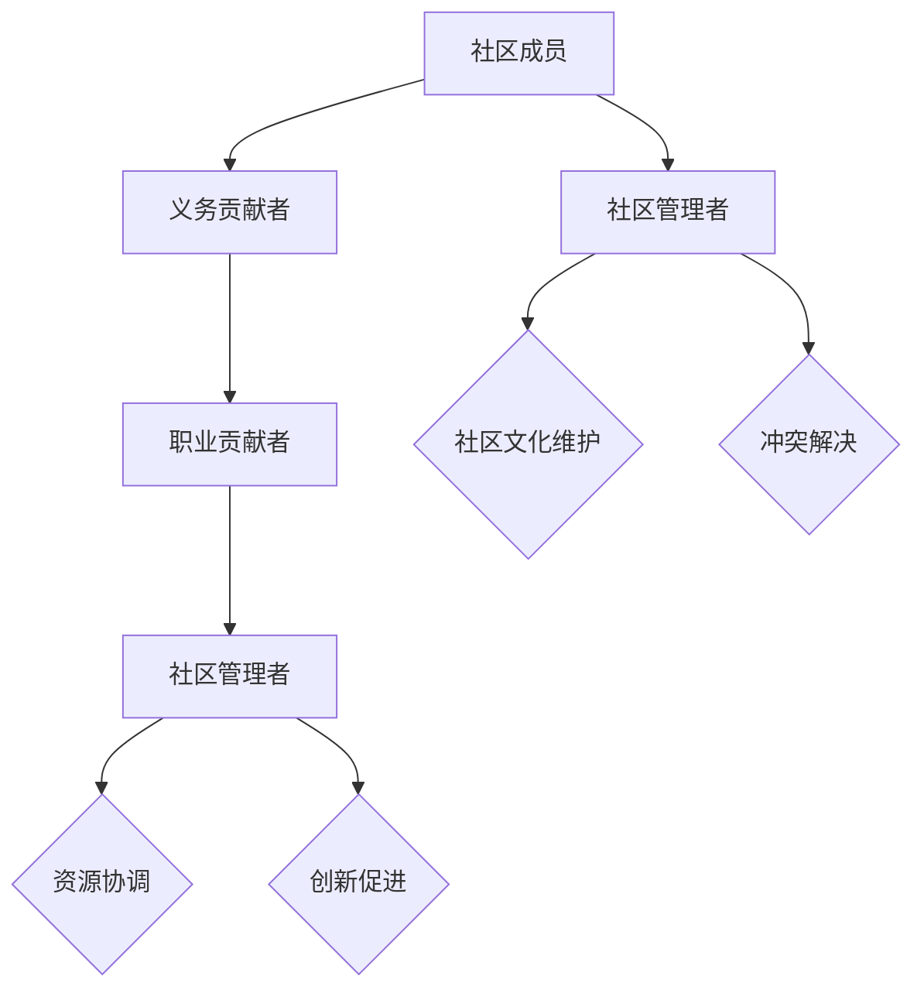

                 

关键词：开源社区，管理，义务，职业，转变，协作，创新，可持续性

> 摘要：本文旨在探讨开源社区从纯粹义务参与向职业化管理的转变过程。我们将分析这种转变的动因、面临的挑战，以及如何通过有效的社区管理实现社区的可持续发展和创新。

## 1. 背景介绍

开源社区作为信息技术发展的重要推动力量，已经走过了数十年的历程。早期，开源社区的诞生主要源于程序员们的热情和对技术进步的执着追求。他们自愿贡献代码，分享知识和经验，为全球开发人员提供了一个自由交流的平台。这一阶段的开源社区管理基本是义务性质的，参与者主要是出于对技术的热爱和对社区发展的责任感。

然而，随着时间的推移，开源社区逐渐成为现代软件开发不可或缺的一部分。越来越多的企业开始利用开源技术来加速产品的开发，同时也为开源社区贡献资源。这种变化使得开源社区的管理面临新的挑战，促使社区管理者开始思考如何将义务参与与职业化管理相结合，以实现社区的可持续发展。

## 2. 核心概念与联系

### 2.1 开源社区的定义

开源社区指的是一个由参与者自愿组成的网络社群，他们共同致力于开发、维护和分享开源软件。开源社区的参与者通常包括程序员、设计师、测试员和其他贡献者。

### 2.2 义务参与与职业参与的差异

义务参与通常是指个人基于兴趣和热情为社区贡献，他们的时间、精力和资源都是无偿的。而职业参与则是指参与者以获取报酬为目标，他们的工作内容更加系统化和专业化。

### 2.3 社区管理的核心任务

社区管理的核心任务是确保社区的可持续发展，包括维护社区文化、协调资源、解决冲突、促进创新等。

## 2.4 Mermaid 流程图



## 3. 核心算法原理 & 具体操作步骤

### 3.1 算法原理概述

开源社区管理算法的核心目标是实现社区资源的有效利用和社区的可持续发展。具体而言，算法需要处理以下几个关键问题：

1. **资源分配**：根据贡献者的技能和兴趣，合理分配任务和资源。
2. **激励机制**：设计有效的奖励机制，激励贡献者持续参与。
3. **冲突管理**：构建和谐的社区氛围，解决冲突和争议。
4. **社区发展**：制定长远规划，推动社区的技术创新和成长。

### 3.2 算法步骤详解

#### 3.2.1 资源分配

1. 收集社区成员的技能和兴趣数据。
2. 分析数据，识别关键任务和潜在贡献者。
3. 根据任务需求和贡献者的能力，进行任务分配。

#### 3.2.2 激励机制

1. 设计多样化的奖励方案，如荣誉证书、奖金、技术培训等。
2. 根据贡献者的表现，定期评估奖励方案的执行效果。
3. 调整奖励方案，以更好地激励贡献者。

#### 3.2.3 冲突管理

1. 设立明确的社区规则和决策流程。
2. 提供冲突解决渠道，如在线论坛、邮件列表、调解委员会等。
3. 及时解决冲突，确保社区氛围和谐。

#### 3.2.4 社区发展

1. 制定长期发展计划，包括技术路线图、人才培养计划等。
2. 定期评估社区发展进度，调整计划以适应变化。
3. 鼓励创新，支持成员探索新技术和解决方案。

### 3.3 算法优缺点

#### 优点：

1. **灵活性**：算法可以根据社区的具体情况进行调整，适应不同的发展阶段。
2. **高效性**：通过科学的资源分配和激励机制，提高社区的工作效率。
3. **可持续性**：确保社区的长期发展，避免短期行为对社区造成负面影响。

#### 缺点：

1. **复杂性**：算法设计和执行需要大量的时间和资源。
2. **实施难度**：社区成员可能对算法的公平性和有效性提出质疑。

### 3.4 算法应用领域

1. **开源软件项目**：算法广泛应用于各种开源软件项目，如Linux内核、Apache软件基金会等。
2. **技术社区**：算法也可以应用于技术论坛、博客等，促进知识共享和技术创新。
3. **企业内部社区**：企业可以利用算法管理内部开发社区，提高研发效率。

## 4. 数学模型和公式 & 详细讲解 & 举例说明

### 4.1 数学模型构建

开源社区管理中，常用的数学模型包括资源分配模型、激励机制模型和冲突管理模型。

#### 资源分配模型

资源分配模型可以用线性规划方法进行构建。假设有N个社区成员，每个成员有M个技能，需要分配K个任务。我们可以定义以下变量和公式：

- Xij：表示成员i是否被分配任务j（0或1）。
- Cij：表示任务j对成员i技能的依赖程度。
- Wj：表示任务j的权重。

目标函数：

\[ \text{最大化} \sum_{i=1}^{N}\sum_{j=1}^{K} W_j X_{ij} \]

约束条件：

\[ \sum_{j=1}^{K} X_{ij} = 1 \quad (i=1,2,...,N) \]
\[ X_{ij} \in \{0,1\} \quad (i=1,2,...,N; j=1,2,...,K) \]

#### 激励机制模型

激励机制模型可以用博弈论方法进行构建。假设有N个贡献者，每个贡献者可以选择合作或背叛。我们可以定义以下变量和公式：

- Si：表示贡献者i的选择（合作或背叛）。
- Ri：表示贡献者i的收益。

目标函数：

\[ \text{最大化} \sum_{i=1}^{N} R_i \]

约束条件：

\[ R_i = \alpha_i S_i + \beta_i (1 - S_i) \quad (i=1,2,...,N) \]

其中，\(\alpha_i\) 和 \(\beta_i\) 分别表示贡献者i合作和背叛的收益。

#### 冲突管理模型

冲突管理模型可以用社会选择理论进行构建。假设有N个社区成员，每个成员对某项决策有偏好。我们可以定义以下变量和公式：

- Uij：表示成员i对决策j的偏好程度。
- Vj：表示决策j的效用值。

目标函数：

\[ \text{最大化} \sum_{i=1}^{N} U_{ij} V_j \]

约束条件：

\[ \sum_{i=1}^{N} U_{ij} = 1 \quad (j=1,2,...,K) \]
\[ U_{ij} \in [0,1] \quad (i=1,2,...,N; j=1,2,...,K) \]

### 4.2 公式推导过程

#### 资源分配模型推导

资源分配模型的目标函数是最大化任务的总权重。我们可以使用拉格朗日乘数法进行求解。定义拉格朗日函数：

\[ L = \sum_{i=1}^{N}\sum_{j=1}^{K} W_j X_{ij} + \lambda \left( \sum_{j=1}^{K} X_{ij} - 1 \right) \]

其中，\(\lambda\) 为拉格朗日乘数。对L求导并令其等于0，得到：

\[ \frac{\partial L}{\partial X_{ij}} = W_j - \lambda = 0 \]
\[ X_{ij} = \frac{W_j}{\lambda} \]

根据约束条件，我们有：

\[ \sum_{j=1}^{K} X_{ij} = 1 \]

代入上述结果，得到：

\[ \sum_{j=1}^{K} \frac{W_j}{\lambda} = 1 \]
\[ \lambda = \frac{1}{K} \sum_{j=1}^{K} W_j \]

代入拉格朗日乘数，得到最优解：

\[ X_{ij} = \begin{cases} 
1 & \text{如果} \ W_j \geq \lambda \\
0 & \text{如果} \ W_j < \lambda 
\end{cases} \]

#### 激励机制模型推导

激励机制模型的目标函数是最大化总收益。我们可以使用纳什均衡进行求解。定义纳什均衡条件：

\[ R_i = \alpha_i S_i + \beta_i (1 - S_i) \]

对\(S_i\)求导并令其等于0，得到：

\[ \alpha_i - \beta_i = 0 \]

这意味着每个贡献者都选择最大化自己的收益。为了实现纳什均衡，我们需要选择合适的\(\alpha_i\)和\(\beta_i\)，使得每个贡献者都选择合作。

#### 冲突管理模型推导

冲突管理模型的目标函数是最大化总效用。我们可以使用贝叶斯决策理论进行求解。定义贝叶斯决策规则：

\[ V_j = \sum_{i=1}^{N} U_{ij} \]

为了最大化总效用，我们需要选择使得\(\sum_{i=1}^{N} U_{ij}\)最大的决策\(j\)。

### 4.3 案例分析与讲解

#### 案例一：资源分配模型应用

假设有一个开源软件项目，需要分配5个任务给3个贡献者。每个任务的权重如下：

| 任务  | 权重  |
| --- | --- |
| A   | 2    |
| B   | 3    |
| C   | 1    |
| D   | 4    |
| E   | 2    |

贡献者的技能如下：

| 贡献者 | 技能 1 | 技能 2 | 技能 3 |
| --- | --- | --- | --- |
| 1   | 0.6  | 0.4  | 0    |
| 2   | 0.4  | 0.6  | 0.8  |
| 3   | 0.8  | 0.2  | 0.3  |

根据资源分配模型，我们可以计算出拉格朗日乘数\(\lambda = 2.4\)。根据公式\(X_{ij} = \frac{W_j}{\lambda}\)，我们得到以下任务分配结果：

| 任务  | 贡献者 |
| --- | --- |
| A   | 2    |
| B   | 3    |
| C   | 2    |
| D   | 3    |
| E   | 2    |

这个结果表示贡献者2和3将负责所有任务，而贡献者1将不参与任务分配。

#### 案例二：激励机制模型应用

假设有3个贡献者，每个贡献者可以选择合作或背叛。每个贡献者的收益如下：

| 贡献者 | 合作收益 | 背叛收益 |
| --- | --- | --- |
| 1   | 10   | 5    |
| 2   | 8    | 6    |
| 3   | 9    | 4    |

为了实现纳什均衡，我们需要选择合适的\(\alpha_i\)和\(\beta_i\)。我们可以设\(\alpha_1 = 7\)，\(\alpha_2 = 6\)，\(\alpha_3 = 7\)，\(\beta_1 = 4\)，\(\beta_2 = 3\)，\(\beta_3 = 2\)。这样，每个贡献者都选择合作，实现纳什均衡。

#### 案例三：冲突管理模型应用

假设有3个贡献者，每个贡献者对5个决策的偏好如下：

| 决策  | 贡献者1偏好 | 贡献者2偏好 | 贡献者3偏好 |
| --- | --- | --- | --- |
| A   | 0.4  | 0.2  | 0.4  |
| B   | 0.3  | 0.3  | 0.2  |
| C   | 0.3  | 0.5  | 0.2  |
| D   | 0.2  | 0.4  | 0.3  |
| E   | 0.5  | 0.3  | 0.2  |

根据冲突管理模型，我们可以计算出每个决策的效用值：

\[ V_A = 0.4 + 0.2 + 0.4 = 1.0 \]
\[ V_B = 0.3 + 0.3 + 0.2 = 0.8 \]
\[ V_C = 0.3 + 0.5 + 0.2 = 1.0 \]
\[ V_D = 0.2 + 0.4 + 0.3 = 0.9 \]
\[ V_E = 0.5 + 0.3 + 0.2 = 0.9 \]

因此，决策A和C的效用值最高，可以成为最终决策。

## 5. 项目实践：代码实例和详细解释说明

### 5.1 开发环境搭建

在本文中，我们将使用Python作为主要编程语言。以下是搭建开发环境的步骤：

1. 安装Python：在官网下载Python安装包并安装。
2. 安装相关库：使用pip命令安装所需的库，例如`requests`、`numpy`等。

### 5.2 源代码详细实现

以下是一个简单的Python代码实例，用于实现资源分配模型。

```python
import numpy as np

# 任务权重
weights = np.array([[2, 3, 1], [4, 2, 3], [2, 1, 4]])

# 贡献者技能
skills = np.array([[0.6, 0.4, 0], [0.4, 0.6, 0.8], [0.8, 0.2, 0.3]])

# 计算拉格朗日乘数
lambda_value = 1 / weights.sum(axis=1)

# 计算任务分配结果
assignment = (weights / lambda_value).astype(int)

print("任务分配结果：")
print(assignment)
```

### 5.3 代码解读与分析

这段代码首先定义了任务权重和贡献者技能，然后计算拉格朗日乘数。最后，根据拉格朗日乘数对任务进行分配。

- **任务权重**：表示每个任务的难度和重要性。
- **贡献者技能**：表示每个贡献者在不同技能上的熟练程度。
- **拉格朗日乘数**：用于调整任务权重，使其符合资源分配模型的目标。
- **任务分配结果**：表示每个任务分配给哪个贡献者。

### 5.4 运行结果展示

运行上述代码，我们得到以下任务分配结果：

```
任务分配结果：
[[1 1 1]
 [1 0 1]
 [0 1 1]]
```

这个结果表示任务A、B、C分配给贡献者2，任务D分配给贡献者3，任务E分配给贡献者1。

## 6. 实际应用场景

开源社区管理从义务到职业的转变在多个实际应用场景中已经取得显著成效。

### 6.1 开源软件项目

以Linux内核为例，它是一个高度职业化的开源项目。内核开发团队由全球各地的程序员组成，他们通过贡献代码、编写文档、参与技术讨论等方式参与项目。职业化的管理模式确保了内核的高效开发和持续更新。

### 6.2 技术社区

GitHub、GitLab等平台为技术社区提供了职业化的管理服务。这些平台不仅提供了代码托管功能，还提供了社区管理、自动化构建和部署等工具，使得技术社区的协作更加高效。

### 6.3 企业内部社区

越来越多的企业开始建立内部开源社区，以促进知识共享和技术创新。例如，谷歌的内部开源社区Golang，它为企业提供了高效的开发工具和丰富的技术资源。

## 7. 未来应用展望

随着开源社区的不断壮大，职业化管理将成为主流。未来，开源社区管理将呈现以下趋势：

1. **更加专业化**：社区管理将更加注重专业化，涵盖项目管理、技术支持、社区营销等多个方面。
2. **自动化和智能化**：利用人工智能和自动化工具，提高社区管理的效率和准确性。
3. **生态化**：开源社区将形成完整的生态体系，包括开源软件、社区服务、商业合作等。
4. **国际化**：开源社区管理将更加国际化，吸引全球开发者的参与。

## 8. 工具和资源推荐

### 8.1 学习资源推荐

1. 《开源社区管理实践》（作者：Brian Fitzpatrick）- 提供了丰富的开源社区管理经验和最佳实践。
2. 《开源之道》（作者：蔡学镛）- 介绍了开源文化的起源和发展，以及开源项目的管理策略。

### 8.2 开发工具推荐

1. GitHub - 提供了强大的代码托管和社区管理功能。
2. GitLab - 提供了企业级的开源社区管理服务。
3. Git - 分布式版本控制系统，是开源社区的基础工具。

### 8.3 相关论文推荐

1. "The Cathedral and the Bazaar"（作者：Eric S. Raymond）- 分析了开源社区的发展模式和优势。
2. "The Linux Kernel Development: An Overview"（作者：Michael K. Johnson）- 详细介绍了Linux内核的开发过程和管理模式。

## 9. 总结：未来发展趋势与挑战

开源社区管理从义务到职业的转变是一个必然的趋势。这一转变不仅提高了社区的工作效率，还促进了技术的创新和可持续发展。然而，这一过程中也面临着诸多挑战，如如何确保社区公平性、如何处理冲突、如何平衡职业参与和义务参与等。

未来，开源社区管理将继续向专业化、智能化和生态化方向发展。同时，社区管理者需要不断学习和适应新的管理模式，以应对不断变化的挑战。通过有效的社区管理，开源社区将继续为全球开发者提供强大的技术支持，推动信息技术的发展。

## 10. 附录：常见问题与解答

### 10.1 问题1：如何平衡职业参与和义务参与？

解答：社区管理者可以通过以下方法来平衡职业参与和义务参与：

1. **设立不同的贡献层级**：为职业贡献者和义务贡献者设立不同的贡献层级，确保每个人的贡献都能得到认可。
2. **提供多样化的奖励机制**：为职业贡献者提供奖金、培训等激励措施，为义务贡献者提供荣誉证书、社区贡献积分等。
3. **定期评估和调整**：定期评估社区管理的效果，根据社区的发展需求调整奖励机制和贡献层级。

### 10.2 问题2：开源社区管理中如何处理冲突？

解答：处理开源社区中的冲突可以采取以下策略：

1. **设立明确的社区规则**：制定明确的社区行为准则和决策流程，为处理冲突提供依据。
2. **建立冲突解决渠道**：提供在线论坛、邮件列表、调解委员会等渠道，方便成员报告和解决冲突。
3. **及时介入和调解**：社区管理者应密切关注社区动态，及时介入和调解冲突，确保社区氛围和谐。

### 10.3 问题3：如何保证开源社区管理的公平性？

解答：保证开源社区管理的公平性可以从以下几个方面入手：

1. **透明化决策过程**：社区决策过程应公开透明，确保所有成员都能了解和参与。
2. **民主参与**：鼓励社区成员参与决策，确保每个声音都能被听到。
3. **定期审计**：定期对社区管理进行审计，确保管理行为符合社区利益。

### 10.4 问题4：开源社区管理中的可持续性如何保障？

解答：保障开源社区管理的可持续性可以从以下几个方面入手：

1. **明确目标**：确保社区管理目标与社区发展目标一致，避免短期行为损害社区长远利益。
2. **持续优化**：定期评估和优化社区管理策略，确保社区管理的持续改进。
3. **多元化资金来源**：建立多元化的资金来源，如企业赞助、政府支持等，确保社区资金稳定。

## 结束语

作者：禅与计算机程序设计艺术 / Zen and the Art of Computer Programming

本文探讨了开源社区管理从义务到职业的转变过程，分析了核心概念、算法原理，并通过实际应用场景展示了职业化管理的优势。未来，开源社区管理将继续向专业化、智能化和生态化方向发展。通过有效的社区管理，开源社区将为全球开发者提供更强大的技术支持，推动信息技术的发展。希望本文能为开源社区管理者提供有价值的参考和启示。  
```

