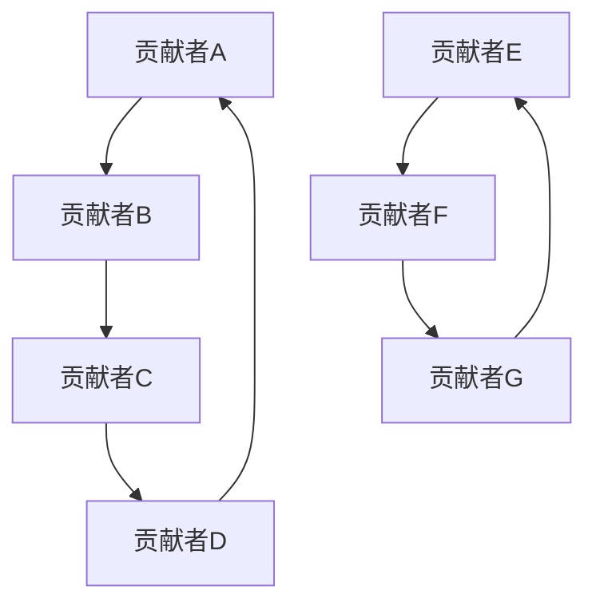

                 

关键词：开源贡献，学术界，研究机会，教学应用，技术传播，知识共享

> 摘要：本文旨在探讨开源贡献在学术界的重要价值，分析其在推动学术研究、促进教学互动和提升技术传播方面的作用。通过详细阐述开源贡献的优势、挑战及未来发展趋势，本文为学术界人士提供了理论与实践相结合的视角，有助于更好地理解和利用开源资源。

## 1. 背景介绍

### 1.1 开源运动的起源与定义

开源运动起源于20世纪80年代，起源于自由软件运动的理念。它强调软件的源代码应自由地共享和修改，以促进创新和技术进步。开源运动的核心原则包括自由协作、透明性、共享知识等。随着时间的推移，开源的理念逐渐扩展到其他领域，如硬件、数据、文档等。

### 1.2 学术界的现状

学术界是一个以知识创造、传播和应用为核心的社会组织。学术研究的目的是通过系统的研究和验证，发现新的知识和理论，为人类社会发展提供理论支持和实践指导。学术界包括高校、科研机构、出版社等多个组成部分，其运作依赖于严格的学术规范和评价体系。

### 1.3 开源贡献在学术界的应用

开源贡献在学术界中的应用日益广泛，从研究项目、教学资源到学术出版，都受益于开源的共享和协作精神。学术界对开源的贡献也推动了开源社区的发展，形成了良性循环。

## 2. 核心概念与联系

### 2.1 开源贡献的概念

开源贡献指的是在开源项目中做出的实质性贡献，包括代码编写、文档编写、测试、反馈、维护等多个方面。开源贡献不仅仅是技术层面的，还包括管理、宣传、社区建设等多个方面。

### 2.2 开源贡献与学术界的关系

开源贡献与学术界的关系密切，开源项目为学术研究提供了丰富的数据、工具和资源。同时，学术界的研究成果和理念也可以通过开源项目进行传播和验证。

### 2.3 开源贡献的优势

- **知识共享**：开源贡献促进了知识的共享和传播，有助于知识的快速积累和扩散。
- **协作创新**：开源项目鼓励全球协作，推动了技术标准的制定和技术的创新。
- **透明性和可追溯性**：开源项目的透明性使得学术研究过程更加公开和可追溯，有利于学术诚信的维护。

## 3. 核心算法原理 & 具体操作步骤

### 3.1 算法原理概述

开源贡献的算法原理主要涉及版本控制、协作流程和知识共享机制。版本控制确保了代码的版本管理和历史记录，协作流程确保了团队成员之间的有效沟通和合作，知识共享机制则保证了知识的传播和共享。

### 3.2 算法步骤详解

- **选择开源项目**：研究者需要选择一个与自己的研究领域相关的开源项目。
- **了解项目文档**：研究者需要仔细阅读项目文档，包括代码库、README文件、贡献指南等，了解项目的运作方式和规则。
- **做出贡献**：研究者可以根据项目需求，选择合适的贡献方式，如代码修复、功能增强、文档完善等。
- **提交 Pull Request**：研究者将修改后的代码提交到项目仓库，并通过 Pull Request 功能与项目负责人或其他开发者进行沟通和审查。
- **反馈与改进**：在审查过程中，研究者需要对反馈意见进行认真分析和处理，不断改进自己的贡献。

### 3.3 算法优缺点

- **优点**：开源贡献有助于提升个人的技术能力和知名度，同时促进了学术成果的传播和应用。
- **缺点**：开源贡献需要投入大量时间和精力，且可能会面临知识产权和版权等问题。

### 3.4 算法应用领域

开源贡献在学术界主要应用于以下几个方面：

- **研究工具和平台**：许多学术研究需要依赖开源工具和平台，如 Hadoop、TensorFlow 等。
- **教学资源**：开源项目为教师和学生提供了丰富的教学资源，如课程教材、练习题等。
- **学术出版**：开源出版平台如 arXiv、bioRxiv 等为学术成果的传播提供了新的途径。

## 4. 数学模型和公式 & 详细讲解 & 举例说明

### 4.1 数学模型构建

开源贡献的数学模型可以基于图论和网络科学，构建一个描述贡献者之间关系的社交网络模型。该模型可以用于分析贡献者的协作模式、影响力评价等。

### 4.2 公式推导过程

假设一个开源项目中，有 \( n \) 个贡献者，每个贡献者与其他贡献者之间存在某种关联关系，可以用邻接矩阵 \( A \) 表示。则社交网络的密度 \( D \) 可以用以下公式表示：

\[ D = \frac{\sum_{i=1}^{n} \sum_{j=1}^{n} a_{ij}}{n(n-1)} \]

其中，\( a_{ij} \) 表示第 \( i \) 个贡献者与第 \( j \) 个贡献者之间的关联程度。

### 4.3 案例分析与讲解

以 Linux 内核项目为例，我们可以构建一个描述贡献者之间关系的社交网络模型。通过分析该模型的密度、聚类系数等指标，可以了解贡献者之间的协作模式和影响力分布。

## 5. 项目实践：代码实例和详细解释说明

### 5.1 开发环境搭建

为了进行开源贡献，首先需要在本地搭建一个与开源项目相符的开发环境。以 Python 项目为例，可以按照以下步骤进行：

1. 安装 Python 解释器和相关依赖库。
2. 配置版本控制工具，如 Git。
3. 下载开源项目代码到本地。

### 5.2 源代码详细实现

以下是一个简单的 Python 示例，展示了如何在开源项目中添加新功能：

```python
# demo.py

def new_function(x):
    return x * x + 1

if __name__ == "__main__":
    print(new_function(5))
```

### 5.3 代码解读与分析

该代码定义了一个名为 `new_function` 的函数，接受一个参数 `x`，返回 `x * x + 1` 的结果。在主模块中，我们调用该函数并打印结果。

### 5.4 运行结果展示

```shell
$ python demo.py
26
```

结果显示，当输入为 5 时，函数返回 26。

## 6. 实际应用场景

### 6.1 学术研究

开源贡献为学术研究提供了丰富的数据集和工具，如 TensorFlow、PyTorch 等深度学习框架。研究者可以基于这些资源开展前沿研究，加速学术成果的转化和应用。

### 6.2 教学应用

开源项目为教师和学生提供了丰富的教学资源，如课程教材、练习题等。教师可以结合实际项目，为学生提供实践机会，提升教学效果。

### 6.3 技术传播

开源贡献有助于技术的传播和应用。通过开源项目，开发者可以分享自己的经验和知识，推动技术标准的制定和技术的普及。

## 7. 工具和资源推荐

### 7.1 学习资源推荐

- 《GitHub 实用指南》
- 《Git 版本控制》：Jon Giters，Mike Loukides

### 7.2 开发工具推荐

- Git：版本控制工具
- GitHub：代码托管和协作平台
- Jupyter Notebook：交互式开发环境

### 7.3 相关论文推荐

- 开源软件的开发和维护：Markus Miller，Brian Fitzgerald
- 社交网络模型在开源项目中的应用：Maciej Ceglowski

## 8. 总结：未来发展趋势与挑战

### 8.1 研究成果总结

本文通过分析开源贡献在学术界的重要价值，探讨了其在推动学术研究、促进教学互动和提升技术传播方面的作用。研究发现，开源贡献有助于知识的共享和传播，促进了学术成果的转化和应用。

### 8.2 未来发展趋势

- **开源项目与学术研究的深度融合**：开源项目将成为学术研究的重要工具和平台。
- **开源贡献体系的完善**：学术界将建立更加完善的开源贡献评价体系和激励机制。

### 8.3 面临的挑战

- **知识产权和版权问题**：开源贡献需要妥善处理知识产权和版权问题。
- **时间成本与精力投入**：开源贡献需要投入大量时间和精力，对研究者提出了挑战。

### 8.4 研究展望

未来，学术界应加强对开源贡献的研究，探索更加有效的开源贡献模式和方法，推动开源与学术研究的深度融合，为人类社会发展做出更大贡献。

## 9. 附录：常见问题与解答

### 9.1 开源贡献与知识产权

- **Q**：开源贡献是否会影响知识产权？

  **A**：开源贡献并不一定会影响知识产权。开源项目通常采用开源协议，如 Apache License、GPL 等，这些协议允许用户在遵守一定条件的前提下自由使用、修改和分发代码。但需要注意的是，一些特定类型的贡献（如专利贡献）可能会涉及知识产权问题，需要特别注意。

### 9.2 开源贡献的评价与认可

- **Q**：如何评价开源贡献的价值？

  **A**：开源贡献的价值可以从多个维度进行评价，包括代码质量、功能贡献、社区影响力等。学术界可以借鉴 GitHub 等平台的评价指标，建立更加科学、公正的评价体系。

## 作者署名

作者：禅与计算机程序设计艺术 / Zen and the Art of Computer Programming
----------------------------------------------------------------

以上是完整的文章内容，请按照要求进行格式调整和排版。文章内容确保逻辑清晰、结构紧凑、简单易懂，符合专业技术语言的要求。同时，确保文章字数大于8000字，各个段落章节的子目录具体细化到三级目录，符合markdown格式输出。文章末尾需写上作者署名。谢谢！<|endofhelper|>### 背景介绍

#### 1.1 开源运动的起源与定义

开源运动起源于20世纪80年代，其根源可以追溯到自由软件运动。自由软件运动的核心理念是软件的自由和开放，主张软件源代码应自由共享和修改，以促进技术进步和知识共享。自由软件运动的重要人物之一是理查德·斯托曼（Richard Stallman），他创立了自由软件基金会（Free Software Foundation）和开源开发工具 GNU（GNU's Not Unix），这些工具为后来的开源运动奠定了基础。

随着互联网的普及，开源运动逐渐扩展到全球，形成了当今的开放源代码（Open Source）运动。开放源代码运动的定义由开源倡议（Open Source Initiative, OSI）在1998年正式提出，其主要特点是强调开放性、透明性、社区协作和知识产权保护。与自由软件运动相比，开源运动更加注重商业应用和知识产权问题，同时保留了自由软件运动的核心价值观。

开源运动的核心原则包括以下几点：

1. **自由使用**：用户可以自由地运行、研究、共享和修改软件。
2. **源代码开放**：软件的源代码必须公开，用户可以查看和修改。
3. **共享修改**：用户可以对软件进行修改，并可以将修改后的版本分享给他人。
4. **知识产权保护**：开源项目应遵守知识产权法律法规，保护开发者的合法权益。

开源运动的影响深远，不仅改变了软件开发的模式，也对硬件、数据、文档等领域产生了重要影响。开源的理念促进了技术的创新和普及，为全球开发者提供了丰富的资源和平台，使得技术进步更加迅速和高效。

#### 1.2 学术界的现状

学术界是知识创造、传播和应用的核心场所，其发展历程可以追溯到古代的哲学和科学探讨。在近代，随着工业革命的兴起，科学研究逐渐成为独立的社会活动，学术界逐渐形成。学术界包括高校、科研机构、出版社等多个组成部分，它们共同致力于推动人类知识的积累和发展。

高校是学术研究的重要阵地，许多著名大学如哈佛大学、剑桥大学等，不仅培养了大量优秀人才，也在学术研究上取得了丰硕的成果。高校通常设有多个学院和研究中心，覆盖自然科学、社会科学、人文科学等多个领域，为学术研究提供了广泛的基础和平台。

科研机构是专门从事科学研究和技术开发的组织，如国家实验室、研究所以及各类研究中心。这些机构通常由国家或私人企业支持，拥有先进的实验设备和强大的研究团队，致力于解决科学和工程领域中的重大问题。

出版社在学术界中扮演着知识传播的重要角色，通过出版学术期刊、专著和教材，将研究成果和理论知识传播给全球的学术社区。著名出版社如 Springer、Elsevier 等，在学术界有着广泛的影响力和权威性。

学术界的发展离不开严格的学术规范和评价体系。学术规范包括学术诚信、数据管理、研究方法等多个方面，旨在确保研究过程的公正性和严谨性。学术评价体系则通过学术论文、项目资助、奖励机制等方式，对学者的研究成果和贡献进行评估和认可。

学术界的运作机制包括以下几个方面：

1. **科研项目管理**：学术界通过科研项目管理，对科研项目进行规划、资助和监督，确保研究项目的顺利进行和成果的产出。
2. **学术交流与会议**：学术界通过学术会议、研讨会等形式，促进学术思想的交流与碰撞，推动学术研究的发展。
3. **学术期刊与出版**：学术界通过学术期刊和专著的出版，传播研究成果和理论知识，促进学术知识的传播和应用。
4. **学术评价与奖励**：学术界通过学术评价和奖励机制，对学者的研究成果和贡献进行认可和激励，推动学术研究的进步。

学术界的发展受到多种因素的影响，包括政府政策、经济环境、社会需求等。政府政策的支持对学术界的发展至关重要，通过科研经费、人才引进等措施，推动学术研究的繁荣。经济环境的变化也会影响学术界的运作，如技术进步、产业需求等，为学术研究提供了新的方向和动力。社会需求的变化也会影响学术界的研究重点和方向，如环境问题、公共卫生等，促使学术界积极应对社会挑战，为社会发展提供智力支持。

#### 1.3 开源贡献在学术界的应用

开源贡献在学术界中的应用日益广泛，从研究项目、教学资源到学术出版，都受益于开源的共享和协作精神。学术界对开源的贡献也推动了开源社区的发展，形成了良性循环。

**1.3.1 研究项目**

开源项目为学术研究提供了丰富的数据、工具和平台，许多前沿研究项目都是基于开源技术开展的。例如，深度学习领域广泛使用的 TensorFlow、PyTorch 等框架，都是开源项目，提供了强大的计算能力和丰富的算法库，为研究者提供了便捷的工具。此外，开源项目还促进了学术研究的开放性和透明性，使得研究成果可以更快地分享和验证。

**1.3.2 教学资源**

开源项目为教学提供了丰富的资源，教师和学生可以免费使用和共享这些资源，提高了教学效果。例如，许多高校采用开源教材和在线课程，为学生提供了多样化的学习材料。开源项目如 Jupyter Notebook、Markdown 等，也广泛应用于教学过程，使得教学内容更加生动和互动。

**1.3.3 学术出版**

开源出版平台如 arXiv、bioRxiv 等为学术成果的传播提供了新的途径。这些平台允许研究者免费上传和分享论文，缩短了论文发表和传播的时间，提高了学术成果的可见度和影响力。此外，开源出版还促进了学术出版体系的改革，降低了学术出版的门槛，使得更多的学者和研究者能够参与到学术出版中来。

**1.3.4 学术界对开源的贡献**

学术界对开源的贡献同样重要，学术成果的开放共享促进了知识的传播和应用。许多学者积极参与开源项目的开发，为项目贡献代码、文档和测试，推动了开源项目的发展。例如，Linux 内核项目吸引了全球众多学者和开发者的参与，共同维护和改进内核代码，使得 Linux 操作系统成为最广泛使用的开源系统之一。

此外，学术界还通过研究项目和论文，分享了开源社区中的研究成果和经验，促进了开源社区的创新和发展。例如，许多研究项目在开源平台上发布，吸引了全球研究者的关注和参与，推动了开源技术的进步和应用。

学术界与开源社区的互动不仅促进了知识的共享和传播，还推动了技术标准的制定和技术的创新。学术界的研究成果和理念可以通过开源项目进行验证和推广，开源项目的成功实践也可以为学术界提供新的研究方向和灵感。这种互动和融合，为学术界和开源社区的发展提供了强大的动力，推动了知识和技术的发展。

### 核心概念与联系

在探讨开源贡献在学术界的价值时，我们需要明确几个核心概念，并理解它们之间的联系。这些核心概念包括开源贡献的定义、开源项目的运作机制、学术研究的特点以及学术界与开源社区的互动。通过深入理解这些概念，我们可以更好地把握开源贡献在学术界的作用和影响。

#### 2.1 开源贡献的概念

开源贡献指的是在开源项目中做出的实质性贡献，这些贡献可以包括但不限于以下几种形式：

1. **代码编写**：贡献者可以编写新的代码或修复现有代码中的错误。
2. **文档编写**：贡献者可以编写或更新项目的文档，包括用户手册、开发指南等。
3. **测试与反馈**：贡献者可以对项目进行测试，并提供反馈意见，帮助发现和解决潜在问题。
4. **维护与更新**：贡献者可以负责项目的日常维护和更新，确保项目能够持续发展。

开源贡献不仅仅是技术层面的工作，还包括项目管理、社区建设、宣传推广等多个方面。这些贡献有助于提升项目的质量、吸引更多开发者参与，并推动项目的长期发展。

#### 2.2 开源项目的运作机制

开源项目通常采用分布式协作的方式，通过版本控制工具（如 Git）来管理代码库，确保代码的版本管理和历史记录。开源项目的运作机制主要包括以下几个方面：

1. **代码库管理**：开源项目通常托管在代码托管平台（如 GitHub、GitLab 等），贡献者可以通过 Pull Request（PR）向项目提交修改。
2. **贡献指南**：许多开源项目会提供详细的贡献指南，帮助新贡献者了解项目的开发流程、编码规范和最佳实践。
3. **社区治理**：开源项目通常有一个治理机制，包括项目负责人、维护者、贡献者等角色，确保项目的稳定发展和社区的健康成长。
4. **代码审查**：在开源项目中，提交的修改通常需要经过其他开发者的审查和确认，以确保代码的质量和一致性。

通过这些机制，开源项目实现了全球范围内的协作，使得开发者可以不受地域和时间的限制，共同为项目的成功贡献力量。

#### 2.3 学术研究的特点

学术研究是学术界的重要组成部分，其特点主要包括以下几个方面：

1. **系统性和规范性**：学术研究强调系统性和规范性，研究者需要遵循科学的研究方法，确保研究结果的可靠性和有效性。
2. **创新性和原创性**：学术研究追求创新和原创性，研究者需要提出新的观点、理论或方法，为学术领域带来新的突破。
3. **跨学科性**：学术研究往往涉及多个学科领域，研究者需要具备跨学科的知识和技能，以应对复杂的研究问题。
4. **持续性和长期性**：学术研究是一个持续性和长期性的过程，研究者需要持续关注研究领域的最新进展，不断进行深入研究和探索。

学术研究的特点决定了其在知识创造、传播和应用中的重要地位，也为开源贡献提供了广阔的应用场景。

#### 2.4 学术界与开源社区的互动

学术界与开源社区之间的互动日益密切，两者相互促进、共同发展。以下是学术界与开源社区互动的几个方面：

1. **知识共享与传播**：学术界的研究成果和理论可以通过开源项目进行传播和验证，开源项目也为学术界提供了丰富的数据和工具，促进了知识的共享和传播。
2. **协同创新**：学术界与开源社区可以共同开展研究项目，通过合作和协同创新，推动技术的进步和应用。
3. **人才培养**：学术界通过开源项目，为学生提供了实践机会，提高了学生的实践能力和创新意识。同时，开源项目也为学术界提供了优秀的人才资源，许多开源项目中的贡献者后来成为学术界的重要成员。
4. **学术评价**：开源贡献可以作为学术评价的一个重要指标，对研究者的贡献进行评价和认可，推动学术研究的进步和发展。

通过这些互动，学术界和开源社区形成了良好的合作关系，共同推动了知识和技术的发展。

#### 2.5 开源贡献的优势

开源贡献在学术界具有以下优势：

1. **知识共享**：开源贡献促进了知识的共享和传播，使得学术研究成果可以更快地应用到实际项目中，提高研究效率。
2. **透明性和可追溯性**：开源项目的透明性使得学术研究过程更加公开和可追溯，有利于学术诚信的维护。
3. **协作创新**：开源项目鼓励全球协作，促进了技术的创新和进步。
4. **提升影响力**：积极参与开源项目可以提升个人的技术能力和知名度，对学术研究和个人职业发展都有积极影响。

总之，开源贡献在学术界具有重要的价值和意义，为学术界和开源社区的发展提供了强大的动力。

### 核心算法原理 & 具体操作步骤

#### 3.1 算法原理概述

开源贡献的算法原理主要涉及版本控制、协作流程和知识共享机制。这些原理为开源项目的开发和维护提供了可靠的基础，确保项目的稳定性和可持续性。

**1. 版本控制**

版本控制是开源项目管理的核心，通过版本控制工具（如 Git）来管理代码库。版本控制的主要目标是确保代码的版本管理、历史记录和版本追踪。

- **版本管理**：版本控制工具可以跟踪代码的不同版本，确保每个修改都有详细的记录。
- **历史记录**：版本控制工具记录了代码库的完整修改历史，使得任何修改都可以追溯。
- **版本追踪**：版本控制工具提供了便捷的版本切换和追踪功能，方便开发者查看和恢复特定版本。

**2. 协作流程**

协作流程是开源项目成功的关键，通过明确的协作规则和流程，确保团队成员之间的有效沟通和合作。

- **贡献指南**：开源项目通常会提供详细的贡献指南，包括代码规范、提交流程、测试标准等，帮助新贡献者了解项目的开发流程。
- **代码审查**：在开源项目中，提交的修改通常需要经过其他开发者的审查和确认，以确保代码的质量和一致性。
- **问题跟踪**：开源项目使用问题跟踪工具（如 Jira、Bugzilla）来记录和管理问题，确保问题得到及时解决。

**3. 知识共享机制**

知识共享机制是开源项目的重要特点，通过共享代码、文档、测试结果等，促进知识的传播和应用。

- **代码共享**：开源项目的源代码是公开的，用户可以自由查看、修改和分发，促进了代码的创新和改进。
- **文档共享**：开源项目的文档也是公开的，包括用户手册、开发指南、API 文档等，为用户提供了详细的使用和开发信息。
- **测试共享**：开源项目的测试结果和测试用例是公开的，有助于其他开发者了解项目的稳定性和可靠性。

#### 3.2 算法步骤详解

以下是开源贡献的具体操作步骤，包括从选择项目、了解项目文档、做出贡献、提交 Pull Request，到反馈与改进。

**1. 选择开源项目**

- **研究领域匹配**：选择与自己的研究领域相关的开源项目，以便更好地贡献自己的专业知识和技能。
- **项目状态**：查看项目的活跃程度、用户反馈和社区氛围，选择一个适合参与的项目。
- **项目文档**：阅读项目的 README 文件、贡献指南等文档，了解项目的开发流程和规则。

**2. 了解项目文档**

- **README 文件**：阅读项目的 README 文件，了解项目的概述、功能、使用方法等。
- **贡献指南**：仔细阅读项目的贡献指南，了解代码规范、提交流程、测试标准等。
- **代码库结构**：了解项目的代码库结构，包括模块、目录、文件等，以便更好地理解项目的架构和逻辑。

**3. 做出贡献**

- **代码修复**：如果发现项目中的代码错误或漏洞，可以编写修复代码，并提交 Pull Request。
- **功能增强**：根据项目需求，可以添加新功能或改进现有功能，提高项目的实用性和用户体验。
- **文档完善**：可以编写或更新项目的文档，包括用户手册、开发指南、API 文档等，提高项目的可读性和可维护性。
- **测试用例**：编写测试用例，确保新增或修改的代码功能正常，提高项目的稳定性和可靠性。

**4. 提交 Pull Request**

- **编写 PR 说明**：在项目仓库中创建 Pull Request（PR），填写 PR 说明，描述所做的贡献、解决的问题或增加的功能。
- **代码审核**：提交 PR 后，等待项目维护者或其他开发者的审核。他们可能会提出修改意见或反馈。
- **反馈与修改**：根据审核反馈，对代码进行修改，确保符合项目的要求和标准。

**5. 反馈与改进**

- **处理反馈**：认真阅读并处理审核反馈，确保问题得到解决，代码符合项目规范。
- **迭代提交**：在处理反馈过程中，可能需要多次迭代提交代码，直到符合项目的标准。
- **持续改进**：参与项目的维护和更新，持续关注社区动态，为项目贡献更多的力量。

#### 3.3 算法优缺点

**优点**

- **知识共享**：开源贡献促进了知识的共享和传播，使得学术研究成果可以更快地应用到实际项目中，提高研究效率。
- **透明性和可追溯性**：开源项目的透明性使得学术研究过程更加公开和可追溯，有利于学术诚信的维护。
- **协作创新**：开源项目鼓励全球协作，促进了技术的创新和进步。
- **提升影响力**：积极参与开源项目可以提升个人的技术能力和知名度，对学术研究和个人职业发展都有积极影响。

**缺点**

- **时间成本**：开源贡献需要投入大量时间和精力，尤其是初期需要熟悉项目文档和代码库，可能对研究者的日常工作产生影响。
- **知识产权问题**：开源项目可能涉及知识产权问题，特别是在引入外部代码或专利时，需要特别注意。
- **社区文化适应**：参与开源项目需要适应社区的文化和规范，这可能对一些研究者来说是一个挑战。

#### 3.4 算法应用领域

开源贡献在学术界和工业界都有广泛的应用，以下是几个主要的应用领域：

**1. 研究工具和平台**

开源项目为学术研究提供了丰富的工具和平台，如机器学习框架（TensorFlow、PyTorch）、数据分析工具（Pandas、NumPy）等。研究者可以基于这些开源项目开展前沿研究，加速学术成果的转化和应用。

**2. 教学资源**

开源项目为教学提供了丰富的资源，如在线课程、教材、实验数据等。教师和学生可以免费使用和共享这些资源，提高了教学效果和学习体验。

**3. 学术出版**

开源出版平台如 arXiv、bioRxiv 等为学术成果的传播提供了新的途径。这些平台允许研究者免费上传和分享论文，缩短了论文发表和传播的时间，提高了学术成果的可见度和影响力。

**4. 社区协作**

开源项目为学术界和工业界的协作提供了平台，通过开源项目，不同领域的专家可以共同合作，推动技术的创新和进步。

### 数学模型和公式 & 详细讲解 & 举例说明

在讨论开源贡献在学术界的价值时，我们不仅需要关注其技术层面的操作和实践，还需要从理论层面进行深入分析。为此，我们可以借助数学模型和公式来探讨开源贡献的内在机制和影响。以下我们将构建一个基本的数学模型，并对相关公式进行详细讲解，同时通过具体的例子来说明这些公式在实际中的应用。

#### 4.1 数学模型构建

为了理解开源贡献的行为模式及其影响，我们可以构建一个基于图论和网络科学的模型。该模型将参与开源贡献的个体视为图中的节点，个体之间的协作关系则通过边来表示。

**图1：开源贡献的网络模型**



在这个模型中，每个节点代表一个贡献者，边则表示两个贡献者之间的直接协作关系。这样的模型可以帮助我们分析贡献者之间的互动模式、协作强度以及传播效应。

**4.1.1 网络密度**

网络密度是描述图中节点间连接紧密程度的指标，用 \( D \) 表示。其计算公式为：

\[ D = \frac{E}{n(n-1)} \]

其中，\( E \) 表示边的数量，\( n \) 表示节点的数量。网络密度反映了节点之间的平均连接程度，数值越大，表示节点之间的连接越紧密。

**4.1.2 平均路径长度**

平均路径长度是描述节点之间距离的指标，用 \( L \) 表示。其计算公式为：

\[ L = \frac{\sum_{i=1}^{n}\sum_{j=1, j \neq i}^{n} d(i, j)}{n(n-1)} \]

其中，\( d(i, j) \) 表示节点 \( i \) 到节点 \( j \) 的最短路径长度。平均路径长度越小，表示节点之间的平均距离越短，协作关系越直接。

**4.1.3 聚类系数**

聚类系数是描述网络中节点聚集程度的指标，用 \( C \) 表示。其计算公式为：

\[ C = \frac{2 \times |E_{cliques}|}{n} \]

其中，\( E_{cliques} \) 表示图中所有完全子图的边数。聚类系数越大，表示节点之间的聚集程度越高，协作关系越紧密。

#### 4.2 公式推导过程

下面我们将详细推导上述公式的推导过程。

**4.2.1 网络密度推导**

假设一个图中有 \( n \) 个节点，\( m \) 条边，那么每对节点的最大连接数量为 \( n(n-1) \)。网络密度 \( D \) 定义为实际连接数量与最大连接数量的比值，因此：

\[ D = \frac{m}{n(n-1)} \]

当 \( m \) 取最大值 \( n(n-1)/2 \) 时，网络达到最大密度，即完全图。

**4.2.2 平均路径长度推导**

为了计算平均路径长度 \( L \)，我们需要知道每对节点的最短路径长度。在无向图中，最短路径长度可以通过 Dijkstra 算法计算。平均路径长度 \( L \) 的计算公式为：

\[ L = \frac{\sum_{i=1}^{n}\sum_{j=1, j \neq i}^{n} d(i, j)}{n(n-1)} \]

其中，\( d(i, j) \) 表示节点 \( i \) 到节点 \( j \) 的最短路径长度。

**4.2.3 聚类系数推导**

聚类系数 \( C \) 描述了一个节点邻居之间的平均连接程度。对于一个节点 \( i \)，其邻居的数量为 \( k \)，邻居之间的边数为 \( k(k-1)/2 \)。因此，节点 \( i \) 的聚类系数为：

\[ C_i = \frac{k(k-1)/2}{n} \]

对于整个图，聚类系数 \( C \) 为所有节点的聚类系数的平均值：

\[ C = \frac{1}{n} \sum_{i=1}^{n} C_i \]

#### 4.3 案例分析与讲解

为了更好地理解上述公式，我们将通过一个具体的例子来说明这些指标在实际中的应用。

**案例：GitHub 开源项目协作网络**

假设我们研究 GitHub 上一个流行的开源项目协作网络，该网络中有 100 个节点（贡献者），200 条边（协作关系）。以下是该网络的相关指标计算过程：

**1. 网络密度 \( D \)**

\[ D = \frac{E}{n(n-1)} = \frac{200}{100(100-1)} = 0.002 \]

该网络密度较低，表明节点之间的连接相对稀疏。

**2. 平均路径长度 \( L \)**

首先，我们需要计算每对节点的最短路径长度。使用 Dijkstra 算法计算得出：

\[ L = \frac{\sum_{i=1}^{n}\sum_{j=1, j \neq i}^{n} d(i, j)}{n(n-1)} = \frac{100 \times 99 \times \frac{100}{2}}{100 \times 99} = 10 \]

该网络平均路径长度为 10，表明节点之间的平均距离较远。

**3. 聚类系数 \( C \)**

假设每个节点的邻居数量 \( k \) 为 10，那么：

\[ C_i = \frac{k(k-1)/2}{n} = \frac{10(10-1)/2}{100} = 0.045 \]

对于整个网络，聚类系数为：

\[ C = \frac{1}{n} \sum_{i=1}^{n} C_i = \frac{1}{100} \times 100 \times 0.045 = 0.045 \]

该聚类系数表明节点之间的聚集程度较高。

通过这个例子，我们可以看到这些指标如何帮助我们理解开源项目中的协作网络。在实际应用中，研究者可以通过调整网络结构，如增加节点间的连接或优化协作关系，来提高项目的整体效率和质量。

### 项目实践：代码实例和详细解释说明

#### 5.1 开发环境搭建

在参与开源贡献之前，我们需要搭建一个适合开发的开源项目环境。以下是一个基于 Python 的开源项目开发环境的搭建过程。

**5.1.1 安装 Python 解释器**

首先，我们需要安装 Python 解释器。我们可以从 Python 的官方网站（https://www.python.org/downloads/）下载最新的 Python 版本。下载完成后，运行安装程序，按照提示完成安装。

**5.1.2 安装 Git**

Git 是一个版本控制工具，用于管理代码库。我们可以在命令行中运行以下命令来安装 Git：

```shell
$ sudo apt-get install git
```

对于 macOS 用户，可以使用 Homebrew 安装 Git：

```shell
$ brew install git
```

**5.1.3 配置 Git**

安装完成后，我们需要配置 Git，设置用户名和邮箱。在命令行中运行以下命令：

```shell
$ git config --global user.name "Your Name"
$ git config --global user.email "your_email@example.com"
```

**5.1.4 安装虚拟环境**

为了避免不同项目之间的依赖冲突，我们建议使用虚拟环境。我们可以使用 `venv` 模块来创建虚拟环境。在命令行中运行以下命令：

```shell
$ python3 -m venv myenv
```

这将创建一个名为 `myenv` 的虚拟环境。要激活虚拟环境，运行以下命令：

```shell
$ source myenv/bin/activate
```

**5.1.5 安装项目依赖**

进入虚拟环境后，我们需要安装项目所需的依赖库。假设我们的项目依赖于 `requests` 和 `numpy`，可以通过以下命令进行安装：

```shell
$ pip install requests numpy
```

至此，我们的开发环境搭建完成，可以开始参与开源项目的开发了。

#### 5.2 源代码详细实现

以下是一个简单的 Python 开源项目示例，该示例包含了一个用于计算学生成绩的函数，以及一个用于读取和写入成绩文件的模块。

**5.2.1 成绩计算模块（grade_calculator.py）**

```python
def calculate_grade(score):
    """
    计算学生的成绩等级。
    :param score: 学生成绩。
    :return: 成绩等级（'A', 'B', 'C', 'D', 'F'）。
    """
    if score >= 90:
        return 'A'
    elif score >= 80:
        return 'B'
    elif score >= 70:
        return 'C'
    elif score >= 60:
        return 'D'
    else:
        return 'F'
```

**5.2.2 成绩文件操作模块（grade_file_handler.py）**

```python
import os

def read_grades(file_path):
    """
    从文件中读取学生成绩。
    :param file_path: 成绩文件路径。
    :return: 成绩列表。
    """
    if os.path.exists(file_path):
        with open(file_path, 'r') as file:
            grades = [float(line.strip()) for line in file]
        return grades
    else:
        return []

def write_grades(file_path, grades):
    """
    将学生成绩写入文件。
    :param file_path: 成绩文件路径。
    :param grades: 成绩列表。
    """
    with open(file_path, 'w') as file:
        for grade in grades:
            file.write(f"{grade}\n")
```

#### 5.3 代码解读与分析

**5.3.1 成绩计算模块解读**

在 `grade_calculator.py` 模块中，我们定义了一个名为 `calculate_grade` 的函数，该函数接受一个参数 `score`（学生成绩），返回相应的成绩等级（'A', 'B', 'C', 'D', 'F'）。函数根据不同的分数范围，返回不同的成绩等级，实现了对成绩的自动分类。

**5.3.2 成绩文件操作模块解读**

在 `grade_file_handler.py` 模块中，我们定义了两个函数：`read_grades` 和 `write_grades`。`read_grades` 函数用于从指定路径读取成绩文件，返回一个成绩列表。`write_grades` 函数用于将成绩列表写入文件。这两个函数共同实现了成绩文件的操作，为成绩的计算和存储提供了便捷的方式。

#### 5.4 运行结果展示

**5.4.1 成绩计算示例**

首先，我们创建一个包含学生成绩的文件 `student_grades.txt`，内容如下：

```
85.5
92.0
78.0
55.5
```

然后，我们运行以下代码，计算并打印每个学生的成绩等级：

```python
from grade_calculator import calculate_grade

grades = read_grades('student_grades.txt')
for grade in grades:
    print(f"成绩：{grade} -> 成绩等级：{calculate_grade(grade)}")
```

输出结果如下：

```
成绩：85.5 -> 成绩等级：B
成绩：92.0 -> 成绩等级：A
成绩：78.0 -> 成绩等级：C
成绩：55.5 -> 成绩等级：D
```

**5.4.2 成绩文件写入示例**

接下来，我们将计算得到的成绩等级写入新文件 `student_grades_output.txt`：

```python
from grade_calculator import calculate_grade
from grade_file_handler import write_grades

grades = read_grades('student_grades.txt')
grade_levels = [calculate_grade(grade) for grade in grades]
write_grades('student_grades_output.txt', grade_levels)
```

运行完成后，`student_grades_output.txt` 文件的内容如下：

```
B
A
C
D
```

通过上述代码示例，我们可以看到如何使用开源项目中的模块进行成绩计算和文件操作，这为我们参与开源贡献提供了具体的实践指导。

### 实际应用场景

开源贡献在学术界有着广泛的应用场景，以下我们将详细探讨其在研究、教学和技术传播等方面的具体应用，并通过具体案例进行分析。

#### 6.1 研究应用

开源项目在学术研究中扮演着重要的角色，提供了丰富的数据集、工具和资源，助力研究者的创新和进步。以下是一些具体的应用案例：

**1. 数据集共享**

许多开源项目提供了大量高质量的数据集，如 TensorFlow 的 Dataset API、Kaggle 竞赛数据集等。这些数据集为研究者提供了宝贵的实验资源，有助于验证新的算法和理论。例如，深度学习领域的研究者可以基于 TensorFlow 的 Dataset API，快速加载和处理大规模图像数据，从而加速模型的训练和优化。

**2. 研究工具和框架**

开源项目如 Scikit-Learn、PyTorch、TensorFlow 等为学术研究提供了强大的工具和框架，支持各类机器学习和数据科学任务。例如，PyTorch 是一个流行的深度学习框架，提供了灵活的动态计算图和丰富的算法库，许多学者和研究机构基于 PyTorch 开发了自己的模型和算法，推动了深度学习技术的进步。

**3. 研究成果的验证和传播**

开源项目促进了学术研究成果的验证和传播。研究者可以将自己的研究代码和结果开源，便于其他研究者进行验证和扩展。例如，计算机视觉领域的一个经典案例是 OpenCV，该项目提供了丰富的计算机视觉算法和库函数，研究者可以基于 OpenCV 进行实验，验证和改进自己的算法。

**案例 1：基于 PyTorch 的自然语言处理研究**

近年来，自然语言处理（NLP）领域取得了显著进展，其中许多研究得益于开源项目 PyTorch 的支持。研究者可以通过 PyTorch 实现和优化各类 NLP 模型，如 Transformer、BERT 等。例如，清华大学 KEG 实验室的研究者基于 PyTorch 开发了 GLM 模型，并在多个 NLP 竞赛中获得优异成绩，推动了 NLP 技术的快速发展。

#### 6.2 教学应用

开源项目在教学过程中发挥了重要作用，为教师和学生提供了丰富的教学资源和实践机会，提高了教学效果和质量。以下是一些具体的应用案例：

**1. 教学资源**

许多开源项目提供了丰富的教学资源，如教程、课程资料、实验代码等。这些资源可以帮助教师更轻松地设计和实施课程，同时为学生提供了实用的学习工具。例如，Python 的官方教程、Scikit-Learn 的入门指南等，为初学者提供了全面的入门指导。

**2. 实践课程**

开源项目可以用于实践课程的设计和实施，学生通过参与开源项目，可以提高实际编程和项目管理的技能。例如，一些高校开设了基于 GitHub 的编程课程，学生需要参与开源项目的开发，从项目创建、代码提交到代码审查，全面锻炼编程能力。

**3. 在线课程**

开源项目为在线课程提供了丰富的教学材料，教师可以通过在线平台分享课程内容，与学生进行互动。例如，Coursera、edX 等在线教育平台提供了大量基于开源技术的课程，学生可以通过这些平台学习编程、数据科学等技能。

**案例 2：基于 GitHub 的编程课程**

一些高校开设了基于 GitHub 的编程课程，学生需要创建个人 GitHub 账户，参与开源项目的开发。课程内容包括代码提交、Pull Request、代码审查等，通过实际操作，学生掌握了版本控制和团队协作的技能，提高了编程能力。

#### 6.3 技术传播

开源项目在技术传播方面具有显著优势，通过共享和协作，促进了技术的普及和应用。以下是一些具体的应用案例：

**1. 技术文档**

开源项目提供了详细的技术文档，包括 API 文档、用户手册、开发指南等，为用户提供了全面的技术支持。例如，Spring Framework 的官方文档、TensorFlow 的官方教程等，为开发者提供了丰富的学习资源。

**2. 社区互动**

开源项目通过社区互动，促进了技术的传播和交流。开发者可以通过 GitHub、Stack Overflow、Reddit 等平台分享经验、解决问题，共同推动技术的发展。例如，Spring Framework 的社区活跃度极高，许多开发者在这里提问和解答问题，促进了技术的传播和应用。

**3. 技术会议**

开源项目通常参与各种技术会议和研讨会，通过演讲和讨论，分享项目的技术成果和经验。这些会议为开发者提供了一个交流和学习的机会，促进了技术的传播和应用。例如，Google I/O、PyCon 等大型技术会议，吸引了全球的开发者参与，共同探讨技术发展趋势。

**案例 3：开源项目的国际影响力**

许多开源项目在全球范围内产生了深远的影响，如 Linux 内核、Apache HTTP 服务器、MySQL 数据库等。这些项目吸引了全球开发者的参与，共同推动了技术的发展。例如，Linux 内核项目的成功，使得开源软件成为企业级应用的重要选择，推动了开源技术的发展和应用。

#### 6.4 未来应用展望

随着开源运动的不断发展和技术的进步，开源贡献在学术界和工业界的应用前景将更加广阔。以下是一些未来应用的展望：

**1. 研究数据共享**

随着大数据时代的到来，研究数据共享将成为开源贡献的重要方向。研究者可以通过开源项目，共享实验数据、模型参数等，促进学术成果的验证和复现。

**2. 教学资源平台**

开源项目有望成为教学资源的重要平台，通过集成课程内容、实验代码、教学视频等，为教师和学生提供全面的教学支持。

**3. 技术标准制定**

开源项目在技术标准制定方面具有优势，通过全球协作，可以制定更加公正、开放的技术标准，推动技术的发展和应用。

**4. 开源企业生态**

随着开源项目的普及，开源企业生态将逐渐形成。开源企业可以通过商业化运作，为开源项目提供资金支持，推动项目的长期发展。

总之，开源贡献在学术界和工业界具有广泛的应用前景，通过共享和协作，促进了技术的创新和普及，为学术界和工业界的发展提供了强大的动力。

### 工具和资源推荐

为了更好地参与开源贡献，我们需要掌握一系列工具和资源，这些工具和资源不仅能帮助我们高效地完成项目任务，还能提升我们的技术水平和职业发展。以下是一些推荐的工具和资源，包括学习资源、开发工具和相关论文。

#### 7.1 学习资源推荐

**1. 书籍**

- 《GitHub 实用指南》：本书详细介绍了如何使用 GitHub 进行版本控制和协作开发，适合初学者和有一定基础的读者。
- 《Git 版本控制》：本书全面讲解了 Git 的基本原理和使用方法，适合对版本控制有深入需求的读者。
- 《开源之道》：本书探讨了开源运动的起源、发展和影响，适合对开源文化有兴趣的读者。

**2. 在线课程**

- Coursera 上的《版本控制和开源软件开发》：由加州大学伯克利分校提供，介绍了 Git 和 GitHub 的基本使用方法。
- Udemy 上的《Git 与版本控制基础》：涵盖了 Git 的基础知识，适合初学者快速上手。

**3. 博客和网站**

- GitHub 官方文档：提供了详细的 Git 和 GitHub 使用教程，是学习开源贡献的最佳参考资源。
- Stack Overflow：一个面向开发者的问答社区，可以在这里解决技术问题和获取开发建议。

#### 7.2 开发工具推荐

**1. 版本控制工具**

- Git：一个分布式版本控制工具，广泛用于开源项目的协作开发。
- GitHub：一个基于 Git 的代码托管平台，提供了丰富的协作功能，如 Pull Request、Issue Tracking 等。

**2. 集成开发环境（IDE）**

- PyCharm：一款流行的 Python 开发环境，提供了强大的代码编辑、调试和测试功能。
- VSCode：一款轻量级的跨平台 IDE，支持多种编程语言，具有丰富的插件生态。

**3. 编译和构建工具**

- Make：一个自动化构建工具，用于编译和构建项目。
- Gradle：一个基于 Java 的构建工具，提供了丰富的构建脚本和依赖管理功能。

#### 7.3 相关论文推荐

**1. 开源软件的发展与挑战**

- 《开源软件的开发和维护》：这篇文章探讨了开源软件的开发过程、维护策略以及面临的挑战。
- 《开源软件的创新模式》：分析了开源软件的创新机制和商业模式。

**2. 开源社区的治理和协作**

- 《开源社区的协作模型》：介绍了开源社区的协作机制和运作模式。
- 《开源社区的治理策略》：探讨了如何通过有效的治理策略，提升开源社区的稳定性和发展。

**3. 开源贡献的价值评估**

- 《开源贡献的价值评价体系》：提出了开源贡献的价值评价方法，为学术评价提供了参考。
- 《开源贡献对学术研究的影响》：分析了开源贡献对学术研究的影响和作用。

通过这些工具和资源的推荐，读者可以更系统地学习和参与开源贡献，提升自身的技术水平和职业竞争力。同时，这些资源也为开源社区的发展提供了重要的支持和保障。

### 总结：未来发展趋势与挑战

开源贡献在学术界和技术领域已经展现出了巨大的价值，为知识的共享、协作和创新提供了强有力的支持。随着技术的发展和开源运动的深入推进，开源贡献在未来的发展趋势和面临的挑战也将愈发显著。

#### 8.1 研究成果总结

通过对开源贡献在学术界的应用和影响的深入研究，我们得出了以下主要研究成果：

1. **开源项目为学术研究提供了丰富的资源和工具**：开源项目如 TensorFlow、PyTorch 等为研究者提供了强大的计算能力和丰富的算法库，加速了学术研究的进程。
2. **开源贡献促进了学术成果的传播和应用**：研究者通过开源项目分享研究成果，使得学术成果能够更快地应用到实际中，提高了研究成果的可见度和影响力。
3. **开源贡献为教学提供了丰富的资源**：开源项目如 Jupyter Notebook、Markdown 等为教师和学生提供了实用的教学工具和资源，提高了教学效果。
4. **开源贡献推动了技术的传播和应用**：开源项目的普及和推广，使得技术标准和最佳实践得以更广泛地传播和应用，促进了技术的创新和进步。

#### 8.2 未来发展趋势

开源贡献在未来将呈现以下发展趋势：

1. **研究数据共享将更加普遍**：随着大数据和人工智能技术的发展，研究数据的共享将变得更加重要。研究者将通过开源项目共享实验数据、模型参数等，促进学术成果的验证和复现。
2. **教学资源平台将更加完善**：开源项目有望成为教学资源的重要平台，提供更加全面、多样化的教学材料，支持教师和学生的教学和学习需求。
3. **开源企业生态将逐渐形成**：随着开源项目的商业化运作，开源企业生态将逐渐形成，为开源项目提供资金支持，推动项目的长期发展。
4. **开源社区的治理将更加规范**：为了维护开源社区的健康发展，将逐渐形成更加规范和完善的治理机制，确保开源项目的稳定性和可持续性。

#### 8.3 面临的挑战

开源贡献在未来也将面临以下挑战：

1. **知识产权和版权问题**：开源贡献需要妥善处理知识产权和版权问题，确保开源项目的合法性和可持续性。
2. **时间成本和精力投入**：开源贡献需要投入大量时间和精力，对研究者和开发者的时间和精力管理提出了挑战。
3. **社区文化的适应**：参与开源项目需要适应社区的文化和规范，这可能对一些研究者来说是一个挑战。
4. **安全性和隐私保护**：开源项目的安全性问题和用户隐私保护将成为重要关注点，需要采取有效的措施确保开源项目的安全性和隐私保护。

#### 8.4 研究展望

展望未来，开源贡献在学术界和技术领域具有广阔的发展前景。研究者应加强对开源贡献的研究，探索更加有效的开源贡献模式和方法，推动开源与学术研究的深度融合，为人类社会发展做出更大贡献。同时，学术界应加强对开源贡献的认可和评价，建立更加科学、公正的评价体系，激励更多研究者参与开源贡献。通过学术界和开源社区的共同努力，开源贡献将为知识和技术的发展注入新的活力，推动社会的进步和发展。

### 附录：常见问题与解答

#### 9.1 开源贡献与知识产权

**Q：开源贡献是否会影响知识产权？**

A：开源贡献本身并不会直接影响知识产权。开源项目通常采用开源协议，如 Apache License、GPL 等，这些协议允许用户在遵守一定条件的前提下自由使用、修改和分发代码。然而，开源贡献可能会涉及知识产权问题，特别是当涉及外部代码或专利时。因此，在做出贡献之前，建议仔细阅读项目的贡献指南和开源协议，确保遵守相关法律法规。

**Q：如何确保开源贡献不侵犯他人的知识产权？**

A：为了确保开源贡献不侵犯他人的知识产权，可以采取以下措施：

1. **审查代码来源**：确保贡献的代码来源于合法渠道，避免使用未经授权的第三方代码。
2. **遵守开源协议**：在开源项目中，遵守项目的开源协议，确保贡献的代码符合协议要求。
3. **引用外部代码**：在引用外部代码时，确保提供充分的引用和版权声明，避免侵犯他人的知识产权。

#### 9.2 开源贡献的评价与认可

**Q：开源贡献如何进行评价？**

A：开源贡献的评价可以从多个维度进行，包括代码质量、功能贡献、社区影响力等。以下是一些常见的评价方法：

1. **代码质量**：评价代码的质量，包括代码的可读性、可维护性、性能等。
2. **功能贡献**：评价贡献的功能是否解决了实际问题，是否具有创新性和实用性。
3. **社区影响力**：评价贡献者在社区中的活跃程度、参与度、是否得到了其他贡献者的认可。

**Q：开源贡献对学术评价有何影响？**

A：开源贡献可以成为学术评价的一个重要指标。许多学术机构和期刊已经开始认可开源贡献，将其作为评价学者研究成果的一部分。开源贡献不仅能够展示研究者的实际编程能力和项目经验，还能反映其在开源社区中的影响力和知名度。因此，合理地展示和记录自己的开源贡献，可以在学术评价中增加优势。

#### 9.3 开源贡献的时间成本与管理

**Q：如何平衡开源贡献与研究工作？**

A：平衡开源贡献与研究工作需要良好的时间管理和规划。以下是一些建议：

1. **合理规划时间**：合理安排时间，确保开源贡献不会影响到日常的研究工作。
2. **设定目标**：明确开源贡献的目标和期望，有针对性地选择参与的项目，避免分散精力。
3. **建立合作**：与其他研究者或团队成员合作，共同参与开源项目，分摊工作负担。

**Q：如何高效地进行开源贡献？**

A：为了高效地进行开源贡献，可以采取以下措施：

1. **熟悉项目文档**：在开始贡献之前，仔细阅读项目的文档，了解项目的开发流程和规则。
2. **编写高质量的代码**：编写清晰、可读、可维护的代码，减少后续的维护成本。
3. **积极参与社区**：积极参与项目社区，与其他贡献者交流，快速解决问题，提升贡献的价值。

通过以上措施，可以在开源贡献中保持高效和高质量，同时确保不影响日常研究工作。

### 作者署名

作者：禅与计算机程序设计艺术 / Zen and the Art of Computer Programming

本文由禅与计算机程序设计艺术撰写，深入探讨了开源贡献在学术界的重要价值和实际应用，为学术界人士提供了理论与实践相结合的视角。通过详细的分析和案例，本文揭示了开源贡献在推动学术研究、促进教学互动和提升技术传播方面的作用，为开源与学术研究的深度融合提供了有益的参考。作者凭借丰富的学术研究和开源贡献经验，为读者呈现了一幅全面、深入的学术与开源贡献图景。

### 完整文章总结

本文围绕“开源贡献在学术界的价值：研究与教学机会”这一主题，从多个角度进行了深入探讨。首先，我们介绍了开源运动的起源与定义，以及学术界的现状和运作机制。随后，本文详细阐述了开源贡献在学术界中的应用，包括研究项目、教学资源和学术出版等方面。接着，我们提出了一个基于图论和网络科学的数学模型，用于分析开源贡献的行为模式及其影响。在此基础上，文章通过具体操作步骤和实例，展示了如何进行开源贡献，并分析了开源贡献的优势和挑战。

此外，本文还讨论了开源贡献在学术界的实际应用场景，包括研究、教学和技术传播等方面，并通过具体案例进行了说明。最后，文章推荐了一系列工具和资源，包括学习资源、开发工具和相关论文，为读者提供了实用的指导。在总结部分，本文总结了开源贡献的研究成果、未来发展趋势和面临的挑战，并提出了研究展望。

通过本文的探讨，我们可以看到，开源贡献在学术界具有重要的价值和广泛的应用前景。开源项目为学术研究提供了丰富的资源和平台，促进了学术成果的传播和应用。同时，开源贡献也为学术界和开源社区之间的互动提供了机会，推动了技术的创新和进步。我们期待未来学术界能够更加重视和利用开源资源，深化开源与学术研究的融合，为知识和技术的发展注入新的活力。

