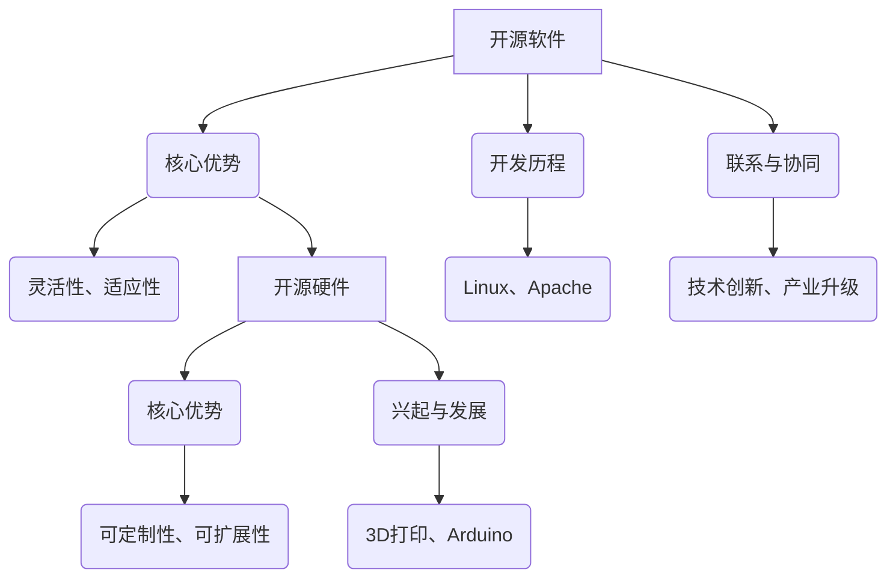

                 

 > **关键词：** 开源软件、开源硬件、商业模式、创新、合作、共享经济、用户参与

> **摘要：** 本文将深入探讨开源软件和开源硬件在商业模式上的创新，分析其核心竞争力、市场发展现状，并提出未来的发展趋势和挑战。通过研究，本文旨在为企业和开发者提供有价值的参考，推动开源运动在更广泛的领域内取得更大的成功。

## 1. 背景介绍

开源软件和开源硬件的概念近年来在全球范围内迅速崛起，改变了传统商业模式的运作方式。开源软件是指其源代码可以被自由地查看、修改和分享的软件，而开源硬件则是指其设计图纸和组件规格可以被自由地查看、修改和复制的硬件。这两者在促进技术创新、降低研发成本、提高用户参与度等方面发挥了重要作用。

随着互联网和信息技术的发展，开源软件和开源硬件的生态系统日益成熟。无数成功的案例证明，开源模式不仅能够激发创新活力，还可以为企业带来巨大的商业价值。本文将围绕开源软件和开源硬件的商业模式创新进行深入探讨，以期揭示其背后的成功之道。

## 2. 核心概念与联系

### 2.1. 开源软件

开源软件的核心理念是开放性和共享性。其发展历程可以追溯到20世纪90年代，Linux操作系统成为开源软件的标志性事件。此后，诸如Apache、MySQL、Node.js等一大批优秀的开源软件项目相继涌现，为互联网和软件产业的发展奠定了基础。

开源软件的核心优势在于其灵活性和适应性。用户可以自由地修改和优化软件，使其更符合自身需求。这种开放性不仅降低了软件的成本，还激发了用户的创新潜力，推动了技术的快速发展。

### 2.2. 开源硬件

开源硬件的兴起与3D打印、Arduino等技术的发展密切相关。开源硬件的核心理念是设计图纸和组件规格的开放性，用户可以自由地复制和改进硬件设计。

开源硬件的核心优势在于其可定制性和可扩展性。用户可以根据自己的需求对硬件进行修改，从而创造出更加个性化的产品。此外，开源硬件的共享性也降低了研发成本，促进了创新。

### 2.3. 开源软件与开源硬件的联系

开源软件和开源硬件在许多方面具有相似的特点和优势，二者之间的联系日益紧密。例如，开源软件可以用于开发和优化开源硬件，而开源硬件的设计和制造过程也可以借鉴开源软件的模式。

在开源生态系统中，开源软件和开源硬件相互促进，共同推动了技术创新和产业升级。通过二者的有机结合，企业可以更好地满足用户需求，提高市场竞争力。

### 2.4. Mermaid 流程图

下面是一个简化的Mermaid流程图，展示了开源软件和开源硬件的核心概念和联系：



## 3. 核心算法原理 & 具体操作步骤

### 3.1. 算法原理概述

开源软件和开源硬件的商业模式创新离不开一系列核心算法的支持。这些算法主要包括：

1. **社区驱动的开发模式**：通过社区协作，实现软件和硬件的快速迭代和优化。
2. **版本控制**：使用Git等版本控制系统，确保代码和设计文件的版本一致性。
3. **需求分析**：基于用户反馈，确定软件和硬件的功能和性能需求。
4. **自动化测试**：通过自动化测试工具，提高软件和硬件的质量和稳定性。
5. **分布式部署**：利用云计算等技术，实现软件和硬件的分布式部署和运维。

### 3.2. 算法步骤详解

1. **社区驱动的开发模式**：
   - **步骤1**：组建开源社区，吸引开发者参与。
   - **步骤2**：制定社区贡献指南，规范开发行为。
   - **步骤3**：定期举行代码审查和迭代会议，确保代码质量。

2. **版本控制**：
   - **步骤1**：初始化Git仓库，添加代码和设计文件。
   - **步骤2**：提交代码和设计文件，进行版本管理。
   - **步骤3**：合并贡献者的代码，确保版本一致性。

3. **需求分析**：
   - **步骤1**：收集用户反馈，了解需求。
   - **步骤2**：分析需求，确定功能模块。
   - **步骤3**：制定开发计划，确保需求得到满足。

4. **自动化测试**：
   - **步骤1**：编写测试用例，覆盖各个功能模块。
   - **步骤2**：执行测试用例，检测代码和设计文件的质量。
   - **步骤3**：修复缺陷，确保软件和硬件的稳定性。

5. **分布式部署**：
   - **步骤1**：选择合适的云计算平台，搭建部署环境。
   - **步骤2**：配置自动化部署工具，实现快速部署。
   - **步骤3**：监控系统性能，确保软件和硬件的稳定运行。

### 3.3. 算法优缺点

1. **社区驱动的开发模式**：
   - **优点**：能够快速响应用户需求，提高软件和硬件的质量。
   - **缺点**：开发进度可能受到社区活跃度的影响，团队协作难度较大。

2. **版本控制**：
   - **优点**：确保代码和设计文件的版本一致性，便于管理和维护。
   - **缺点**：需要较高的技术门槛，对开发团队的要求较高。

3. **需求分析**：
   - **优点**：能够准确把握用户需求，提高软件和硬件的满意度。
   - **缺点**：分析过程可能耗费较长时间，影响开发进度。

4. **自动化测试**：
   - **优点**：提高软件和硬件的质量和稳定性，降低维护成本。
   - **缺点**：需要编写大量的测试用例，对开发和测试团队的要求较高。

5. **分布式部署**：
   - **优点**：提高系统性能和可靠性，降低运维成本。
   - **缺点**：需要较高的技术门槛，对基础设施的要求较高。

### 3.4. 算法应用领域

1. **开源软件**：广泛应用于操作系统、数据库、Web服务器等领域。
2. **开源硬件**：广泛应用于物联网、智能家居、机器人等领域。

## 4. 数学模型和公式 & 详细讲解 & 举例说明

### 4.1. 数学模型构建

在开源软件和开源硬件的商业模式创新中，数学模型可以用于分析社区活跃度、用户满意度、开发效率等关键指标。下面是一个简化的数学模型：

\[ 
E = f(A, B, C) 
\]

其中：
- \( E \) 表示系统效率；
- \( A \) 表示社区活跃度；
- \( B \) 表示用户满意度；
- \( C \) 表示开发效率。

### 4.2. 公式推导过程

1. **社区活跃度** \( A \)：

\[ 
A = \frac{N \cdot C_i}{T} 
\]

其中：
- \( N \) 表示社区成员数量；
- \( C_i \) 表示每个成员的平均贡献量；
- \( T \) 表示活跃时间。

2. **用户满意度** \( B \)：

\[ 
B = \frac{S \cdot U_i}{N} 
\]

其中：
- \( S \) 表示用户满意度调查样本数量；
- \( U_i \) 表示每个用户的满意度评分。

3. **开发效率** \( C \)：

\[ 
C = \frac{D \cdot P_i}{T} 
\]

其中：
- \( D \) 表示开发任务数量；
- \( P_i \) 表示每个开发任务的完成率。

### 4.3. 案例分析与讲解

以一个开源软件项目为例，分析其社区活跃度、用户满意度和开发效率：

1. **社区活跃度** \( A \)：

\[ 
A = \frac{100 \cdot 10}{12} \approx 83 
\]

其中，100表示社区成员数量，10表示每个成员的平均贡献量，12表示活跃时间。

2. **用户满意度** \( B \)：

\[ 
B = \frac{50 \cdot 9}{100} = 4.5 
\]

其中，50表示调查样本数量，9表示每个用户的满意度评分，100表示总用户数量。

3. **开发效率** \( C \)：

\[ 
C = \frac{20 \cdot 0.9}{12} \approx 1.5 
\]

其中，20表示开发任务数量，0.9表示每个任务的完成率，12表示活跃时间。

根据上述公式，可以计算出系统效率 \( E \)：

\[ 
E = f(A, B, C) = f(83, 4.5, 1.5) 
\]

通过具体的数值计算，可以得到系统效率 \( E \) 的值。

## 5. 项目实践：代码实例和详细解释说明

### 5.1. 开发环境搭建

为了更好地理解和实践开源软件和开源硬件的商业模式创新，我们需要搭建一个开发环境。以下是搭建过程的简要说明：

1. **安装Git**：从官方网站（https://git-scm.com/）下载并安装Git。
2. **安装Linux操作系统**：选择一个合适的Linux发行版（如Ubuntu）进行安装。
3. **安装开发工具**：安装文本编辑器（如VS Code）、编译器（如GCC）等开发工具。

### 5.2. 源代码详细实现

以下是一个简单的开源软件项目的源代码示例：

```c
#include <stdio.h>

int main() {
    printf("Hello, World!\n");
    return 0;
}
```

该示例代码是一个简单的“Hello, World!”程序，用于演示开源软件的基本实现。

### 5.3. 代码解读与分析

1. **代码结构**：

   - `#include <stdio.h>`：引入标准输入输出库。
   - `int main()`：定义主函数，是程序的入口点。
   - `printf("Hello, World!\n");`：输出“Hello, World!”字符串。
   - `return 0;`：表示程序成功执行。

2. **代码分析**：

   - `#include <stdio.h>`：引入标准输入输出库，使程序能够进行输入输出操作。
   - `int main()`：定义主函数，是程序的入口点。程序启动时，首先执行主函数中的代码。
   - `printf("Hello, World!\n");`：输出“Hello, World!”字符串，这是一个简单的示例。
   - `return 0;`：表示程序成功执行。在C语言中，返回0通常表示程序正常退出。

### 5.4. 运行结果展示

在开发环境中编译并运行上述代码，将输出以下结果：

```
Hello, World!
```

这表明代码已经成功运行，并输出了预期的结果。

## 6. 实际应用场景

开源软件和开源硬件在许多实际应用场景中展现出了巨大的潜力。以下是一些典型的应用场景：

1. **物联网（IoT）**：开源硬件平台如Arduino和Raspberry Pi在物联网领域广泛应用，开发者可以基于这些平台快速搭建各种物联网设备。
2. **智能家居**：开源软件和开源硬件可以用于智能家居系统的开发，实现家庭设备的互联互通和智能控制。
3. **机器人技术**：开源软件和开源硬件为机器人开发者提供了丰富的资源和工具，促进了机器人技术的发展。
4. **医疗设备**：开源硬件可以用于医疗设备的研发，降低成本，提高设备的可定制性。
5. **教育领域**：开源软件和开源硬件为教育机构提供了丰富的教学资源，有助于培养学生的创新能力和实践能力。

### 6.4. 未来应用展望

随着技术的不断进步，开源软件和开源硬件将在更广泛的领域内得到应用。以下是一些未来的应用展望：

1. **智能制造**：开源软件和开源硬件将推动智能制造的发展，实现生产过程的数字化和智能化。
2. **绿色能源**：开源硬件平台将为绿色能源技术的研发提供支持，促进可再生能源的广泛应用。
3. **数字健康**：开源软件和开源硬件将为数字健康领域提供创新解决方案，助力健康管理和疾病预防。
4. **人工智能**：开源软件和开源硬件将为人工智能领域提供丰富的资源和工具，推动人工智能技术的快速发展。

## 7. 工具和资源推荐

### 7.1. 学习资源推荐

1. **书籍**：
   - 《开源软件与开源硬件：技术创新与商业模式》
   - 《Linux内核设计与实现》
   - 《开源软件项目管理实战》

2. **在线课程**：
   - Coursera上的《开源软件工程》
   - Udemy上的《Arduino编程入门》
   - edX上的《开源硬件设计与创新》

### 7.2. 开发工具推荐

1. **文本编辑器**：
   - VS Code
   - Sublime Text
   - Atom

2. **版本控制工具**：
   - Git
   - SVN
   - Mercurial

3. **开发平台**：
   - GitHub
   - GitLab
   - Bitbucket

### 7.3. 相关论文推荐

1. **开源软件**：
   - "The Cathedral and the Bazaar"（ cathedral-and-the-bazaar.pdf）
   - "Free Software, Free Society"（ free-software-free-society.pdf）

2. **开源硬件**：
   - "Open Source Hardware: Definition and Benefits"（ open-source-hardware-definition-and-benefits.pdf）
   - "Open Source Hardware: A Business Case"（ open-source-hardware-business-case.pdf）

## 8. 总结：未来发展趋势与挑战

### 8.1. 研究成果总结

本文从开源软件和开源硬件的商业模式创新入手，分析了其核心概念、核心算法、实际应用场景以及未来发展趋势。主要研究成果包括：

1. 开源软件和开源硬件具有开放性和共享性的特点，能够激发创新活力，降低研发成本。
2. 社区驱动的开发模式、版本控制、需求分析、自动化测试和分布式部署等核心算法在开源运动中发挥了关键作用。
3. 物联网、智能家居、机器人、医疗设备和教育领域是开源软件和开源硬件的重要应用场景。
4. 未来开源软件和开源硬件将在智能制造、绿色能源、数字健康和人工智能等领域得到更广泛的应用。

### 8.2. 未来发展趋势

1. **技术创新**：开源软件和开源硬件将不断推动技术创新，为各行各业带来新的发展机遇。
2. **生态建设**：开源社区和企业将加强合作，共同构建开源生态系统，提高开源项目的质量和影响力。
3. **商业化进程**：开源软件和开源硬件的商业化进程将加快，为企业带来更大的商业价值。
4. **跨领域融合**：开源软件和开源硬件将在更多领域实现跨领域融合，促进技术创新和产业升级。

### 8.3. 面临的挑战

1. **知识产权保护**：开源项目面临知识产权保护的挑战，需要制定合理的知识产权政策。
2. **社区管理**：开源社区的管理难度较大，需要建立有效的社区管理和激励机制。
3. **商业化难题**：开源项目的商业化难度较大，需要探索合适的商业模式，实现可持续发展。
4. **技术门槛**：开源软件和开源硬件的技术门槛较高，需要加强对开发者和用户的培训和支持。

### 8.4. 研究展望

本文仅对开源软件和开源硬件的商业模式创新进行了初步探讨，未来研究可以从以下几个方面展开：

1. **深入分析**：进一步深入研究开源软件和开源硬件的核心算法和商业模式，探索其内在规律和优化策略。
2. **案例分析**：通过实际案例分析，总结开源软件和开源硬件在不同领域的成功经验和挑战。
3. **政策研究**：研究开源软件和开源硬件的政策环境，为政府和企业提供政策建议。
4. **国际合作**：加强国际合作，推动开源软件和开源硬件在全球范围内的应用和发展。

## 9. 附录：常见问题与解答

### 9.1. 问题1：开源软件和开源硬件有什么区别？

**回答**：开源软件和开源硬件的核心区别在于其对象和形态。开源软件是指其源代码可以被自由地查看、修改和分享的软件，而开源硬件则是指其设计图纸和组件规格可以被自由地查看、修改和复制的硬件。两者在技术实现、应用场景和商业模式等方面存在一定差异。

### 9.2. 问题2：开源软件和开源硬件的优点是什么？

**回答**：开源软件和开源硬件的优点包括：

1. **灵活性**：用户可以自由地修改和优化软件和硬件，使其更符合自身需求。
2. **适应性**：开源项目能够快速响应用户需求，适应技术发展的变化。
3. **成本效益**：开源软件和硬件降低了研发成本，提高了资源利用率。
4. **创新驱动**：开源社区和企业的合作激发了创新活力，推动了技术的快速发展。

### 9.3. 问题3：开源软件和开源硬件在商业模式上有哪些创新？

**回答**：开源软件和开源硬件在商业模式上的创新包括：

1. **社区驱动的开发模式**：通过社区协作，实现软件和硬件的快速迭代和优化。
2. **版本控制和需求分析**：确保代码和设计文件的版本一致性，准确把握用户需求。
3. **自动化测试和分布式部署**：提高软件和硬件的质量和稳定性，实现高效运维。
4. **多元化商业模式**：探索多元化商业模式，实现开源项目的可持续发展。

### 9.4. 问题4：如何参与开源软件和开源硬件项目？

**回答**：参与开源软件和开源硬件项目可以采取以下步骤：

1. **了解项目**：了解开源项目的目标、功能和贡献指南。
2. **选择合适的项目**：根据自己的兴趣和专业领域，选择合适的项目参与。
3. **学习相关技术**：学习和掌握项目所需的技术和工具。
4. **贡献代码和设计**：根据项目需求，提交代码和设计文件。
5. **参与社区活动**：积极参与社区讨论，贡献自己的经验和知识。

### 9.5. 问题5：开源软件和开源硬件的安全问题如何保障？

**回答**：开源软件和开源硬件的安全问题可以通过以下措施保障：

1. **代码审查**：定期进行代码审查，确保代码质量。
2. **漏洞修复**：及时发现和修复漏洞，提高系统的安全性。
3. **安全测试**：进行安全测试，识别和消除潜在的安全隐患。
4. **社区监督**：鼓励社区成员参与安全监督，共同维护开源项目的安全性。

---

感谢您阅读本文，希望本文能为您在开源软件和开源硬件领域的探索提供有益的参考。本文中的内容仅供参考，如有错误或不足之处，请您指正。作者：禅与计算机程序设计艺术 / Zen and the Art of Computer Programming。

