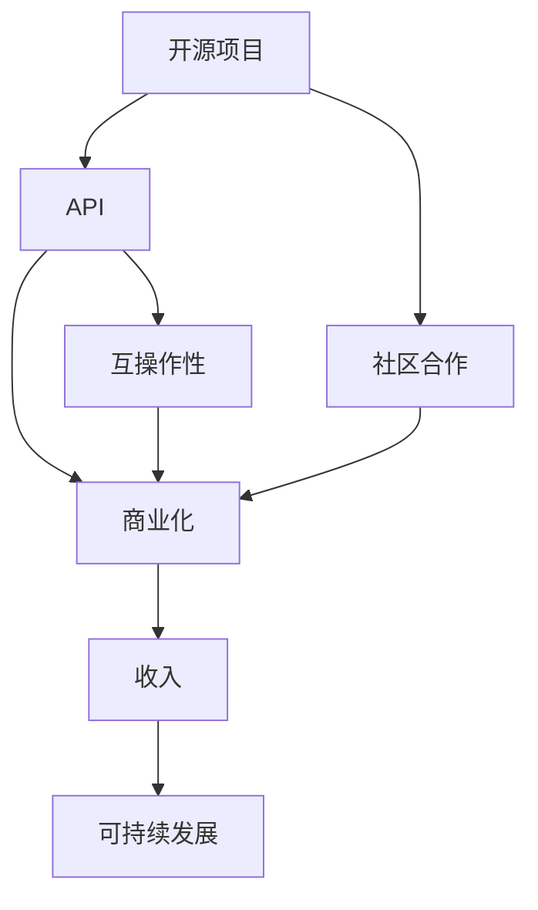

                 

关键词：开源项目、API商业化、策略、定价模型、收益最大化、风险控制、市场需求、用户反馈、合规性

> 摘要：本文旨在探讨开源项目的API商业化路径，包括其策略制定、定价模型选择、以及如何在商业化过程中实现收益最大化并控制风险。通过分析市场需求、用户反馈和合规性等方面，本文提出了一系列实用的建议和策略。

## 1. 背景介绍

开源项目已经成为现代软件开发的重要推动力。它们通过共享代码和资源，促进了技术创新和社区合作。然而，如何将开源项目转化为商业成功，尤其是在API（应用程序编程接口）商业化方面，仍然是许多开发者和管理者面临的重要挑战。

API商业化是指将开源项目的API功能包装成商业产品，提供给有需求的第三方或企业客户。这种模式不仅有助于开源项目的可持续发展，还可以为企业带来额外的收入来源。然而，成功的API商业化并非易事，它涉及到多个方面的策略和考量。

本文将讨论以下主题：

1. **开源项目的API商业化策略**：包括市场定位、商业模式和合作伙伴选择。
2. **定价模型的多样性**：探讨不同的定价策略和模型，如何选择合适的定价方式。
3. **收益最大化与风险控制**：分析如何在商业化过程中实现收益最大化，同时控制风险。
4. **市场需求和用户反馈**：了解市场需求，获取用户反馈，以调整商业策略。
5. **合规性和法律问题**：讨论API商业化过程中必须遵守的法规和合规性要求。

## 2. 核心概念与联系

为了更好地理解开源项目的API商业化，我们首先需要了解几个核心概念，包括开源、API、商业化等，以及它们之间的关系。

### 开源

开源（Open Source）意味着软件开发过程中允许其他开发者访问、查看、修改和分发源代码。这种模式鼓励社区合作和知识共享，是现代软件开发的重要推动力。开源项目通常遵循开源许可协议，如GNU通用公共许可证（GPL）、麻省理工学院许可证（MIT）等。

### API

API是应用程序编程接口的缩写，它定义了不同软件之间交互的规则和标准。通过API，开发者可以在不了解底层实现细节的情况下，访问和操作第三方系统的功能和服务。API的开放性使得软件系统能够互操作，提高了开发的效率。

### 商业化

商业化（Commercialization）是指将一项产品或服务推向市场，并通过销售或提供服务来获得收入。在开源项目的背景下，商业化意味着将开源项目转化为商业产品或服务，以实现经济回报。

### 核心概念之间的联系

开源项目通过API提供了与其他系统交互的接口，使得项目具有了商业化的潜力。商业化不仅有助于开源项目的可持续发展，还可以为企业带来新的收入来源。然而，商业化的成功离不开有效的策略和合理的定价模型。

### Mermaid 流程图

下面是一个简单的Mermaid流程图，展示了这些核心概念之间的关系：



## 3. 核心算法原理 & 具体操作步骤

### 3.1 算法原理概述

开源项目的API商业化本质上是一个复杂的决策过程，涉及到市场分析、产品定位、商业模式设计、定价策略等多个环节。以下是这个过程的基本原理和步骤：

1. **市场分析**：了解目标市场的需求、竞争态势和潜在用户群体。
2. **产品定位**：确定API产品的特点、优势和市场定位。
3. **商业模式设计**：选择适合的商业模式，如SaaS、订阅制、付费插件等。
4. **定价策略**：根据市场需求和成本结构，制定合理的定价策略。
5. **风险管理**：评估商业风险，并采取相应的措施进行控制。

### 3.2 算法步骤详解

#### 步骤1：市场分析

- **需求分析**：通过调查问卷、用户访谈和市场调研等方式，收集目标用户的需求信息。
- **竞争分析**：分析市场上的竞争对手，了解他们的产品特点、价格策略和市场表现。
- **用户画像**：基于收集到的数据，构建目标用户的画像，了解他们的背景、行为和偏好。

#### 步骤2：产品定位

- **特点分析**：确定API产品的核心功能、性能指标和独特卖点。
- **市场定位**：根据市场需求和竞争态势，确定产品的市场定位。
- **目标用户**：明确产品的主要目标用户群体，并针对他们进行产品设计和营销。

#### 步骤3：商业模式设计

- **商业模式选择**：根据市场需求、成本结构和用户习惯，选择合适的商业模式。
- **盈利模式**：明确产品的盈利模式，如通过订阅、交易费或广告等方式获得收入。
- **商业模式优化**：通过市场反馈和数据分析，不断优化商业模式，提高盈利能力。

#### 步骤4：定价策略

- **成本分析**：计算产品的开发和运营成本，包括人力、硬件和软件等。
- **市场需求**：根据市场调研和用户反馈，了解目标用户对价格的敏感度。
- **定价模型**：选择合适的定价模型，如固定价格、按需付费、订阅制等。
- **定价策略**：制定具体的定价策略，如价格折扣、捆绑销售或分期付款等。

#### 步骤5：风险管理

- **风险评估**：评估商业过程中可能遇到的风险，如市场风险、技术风险和财务风险。
- **风险控制**：制定相应的风险控制措施，如风险分散、保险和合同管理等。
- **持续监控**：定期监控市场和技术变化，及时调整商业策略和定价策略。

### 3.3 算法优缺点

#### 优点

- **灵活性**：算法能够根据市场需求和竞争态势进行灵活调整，适应市场变化。
- **数据驱动**：基于市场分析和用户反馈，决策过程更加科学和客观。
- **可持续发展**：通过有效的风险管理，确保商业模式的长期稳定。

#### 缺点

- **复杂性**：涉及到多个环节和复杂决策，实施难度较高。
- **风险较高**：市场和技术变化难以预测，可能导致商业失败。

### 3.4 算法应用领域

- **企业服务**：为企业提供API服务，助力企业数字化转型。
- **在线教育**：通过API开放课程内容，为教育平台提供丰富资源。
- **金融服务**：为金融科技公司提供API服务，实现数据共享和业务合作。
- **物联网**：为物联网设备提供API接口，实现设备之间的互联互通。

## 4. 数学模型和公式 & 详细讲解 & 举例说明

### 4.1 数学模型构建

在开源项目的API商业化过程中，数学模型可以帮助我们进行成本分析、定价策略和收益预测。以下是一个简单的数学模型构建过程：

#### 成本模型

设\( C \)为总成本，\( C_p \)为产品开发成本，\( C_o \)为运营成本，\( C_r \)为风险成本。

\[ C = C_p + C_o + C_r \]

#### 收益模型

设\( R \)为总收益，\( R_p \)为产品销售收益，\( R_a \)为附加服务收益，\( R_r \)为风险收益。

\[ R = R_p + R_a + R_r \]

#### 定价模型

设\( P \)为定价，\( V \)为用户价值，\( C_u \)为用户成本。

\[ P = V - C_u \]

### 4.2 公式推导过程

#### 成本分析

1. **产品开发成本**：包括人力成本、硬件成本和软件成本。

\[ C_p = a \cdot h + b \cdot s + c \cdot m \]

其中，\( a \)、\( b \)、\( c \)分别为人力成本、硬件成本和软件成本的系数，\( h \)为人力资源成本，\( s \)为硬件资源成本，\( m \)为软件资源成本。

2. **运营成本**：包括服务器维护、带宽费用和其他运营开支。

\[ C_o = d \cdot s + e \cdot b + f \cdot c \]

其中，\( d \)、\( e \)、\( f \)分别为服务器维护成本、带宽费用和其他运营开支的系数，\( s \)为服务器数量，\( b \)为带宽使用量，\( c \)为其他运营开支。

3. **风险成本**：包括技术风险、市场风险和法律风险等。

\[ C_r = g \cdot t + h \cdot m + i \cdot r \]

其中，\( g \)、\( h \)、\( i \)分别为技术风险、市场风险和法律风险的系数，\( t \)为技术风险成本，\( m \)为市场风险成本，\( r \)为法律风险成本。

#### 收益分析

1. **产品销售收益**：根据定价和销售数量计算。

\[ R_p = P \cdot n \]

其中，\( P \)为定价，\( n \)为销售数量。

2. **附加服务收益**：包括会员服务、培训和技术支持等。

\[ R_a = j \cdot m + k \cdot t + l \cdot r \]

其中，\( j \)、\( k \)、\( l \)分别为会员服务、培训和技术的附加服务收益系数，\( m \)为会员服务数量，\( t \)为培训服务数量，\( r \)为技术服务数量。

3. **风险收益**：包括通过风险管理降低的成本和潜在的收益。

\[ R_r = p \cdot s - q \cdot t \]

其中，\( p \)、\( q \)分别为风险管理和风险投资的系数，\( s \)为风险管理成本，\( t \)为风险投资回报。

#### 定价策略

1. **基于成本定价**：根据总成本和预期的利润率定价。

\[ P = \frac{C}{n} + \pi \]

其中，\( \pi \)为利润率。

2. **基于用户价值定价**：根据用户对产品的价值和支付意愿定价。

\[ P = V - C_u \]

### 4.3 案例分析与讲解

#### 案例背景

假设一家公司开发了一款开源API，用于数据分析和可视化。公司计划将该API商业化，并希望制定合理的定价策略以实现收益最大化。

#### 数据分析

1. **成本分析**：
   - **产品开发成本**：人力成本为10万元，硬件成本为5万元，软件成本为3万元。
   - **运营成本**：服务器维护成本为每月1万元，带宽费用为每月5000元，其他运营开支为每月2000元。
   - **风险成本**：技术风险成本为2万元，市场风险成本为3万元，法律风险成本为1万元。

   \[ C = 10 + 5 + 3 + 1 + 0.5 \times 12 + 2 + 3 + 1 = 32.5 \text{万元} \]

2. **收益分析**：
   - **产品销售收益**：定价为100元/次，预计每月销售10000次。
   - **附加服务收益**：会员服务费用为每月500元，预计每月会员数量为500人；培训服务费用为每次2000元，预计每月培训次数为50次；技术服务费用为每次3000元，预计每月技术服务次数为30次。

   \[ R_p = 100 \times 10000 = 100 \text{万元} \]
   \[ R_a = 0.5 \times 500 + 2 \times 50 + 3 \times 30 = 4.5 \text{万元} \]
   \[ R = 100 + 4.5 = 104.5 \text{万元} \]

#### 定价策略

1. **基于成本定价**：假设公司希望获得20%的利润率。

   \[ P = \frac{32.5}{10000} + 0.2 = 0.00325 + 0.2 = 0.20325 \text{元/次} \]

2. **基于用户价值定价**：假设用户对API的价值为每次50元。

   \[ P = 50 - 0.00325 = 49.99675 \text{元/次} \]

#### 案例分析

通过以上分析，我们可以看到，基于用户价值的定价策略更接近用户的支付意愿，可能更容易获得用户的认可。然而，这种定价策略也需要考虑成本因素，以确保公司的盈利能力。在实际操作中，公司可以根据市场反馈和用户需求，灵活调整定价策略。

## 5. 项目实践：代码实例和详细解释说明

### 5.1 开发环境搭建

为了实践开源项目的API商业化，我们选择一个常见的开源API项目——OpenCV（Open Source Computer Vision Library），并使用Python语言进行开发。

1. **安装Python环境**：在操作系统上安装Python 3.x版本。
2. **安装OpenCV库**：通过pip命令安装OpenCV库。

   ```bash
   pip install opencv-python
   ```

3. **配置开发环境**：在IDE（如PyCharm、Visual Studio Code等）中创建Python项目，并导入OpenCV库。

### 5.2 源代码详细实现

以下是一个简单的OpenCV API接口实现的示例代码：

```python
import cv2

def image_processing(image_path):
    # 读取图像
    image = cv2.imread(image_path)
    
    # 转为灰度图像
    gray_image = cv2.cvtColor(image, cv2.COLOR_BGR2GRAY)
    
    # 应用高斯模糊
    blurred_image = cv2.GaussianBlur(gray_image, (5, 5), 0)
    
    # 边缘检测
    edges = cv2.Canny(blurred_image, 50, 150)
    
    return edges

if __name__ == "__main__":
    image_path = "example.jpg"
    result = image_processing(image_path)
    cv2.imshow("Edges", result)
    cv2.waitKey(0)
    cv2.destroyAllWindows()
```

### 5.3 代码解读与分析

1. **图像读取**：使用`cv2.imread()`函数读取指定路径的图像。
2. **图像转换**：使用`cv2.cvtColor()`函数将图像从BGR格式转换为灰度格式。
3. **高斯模糊**：使用`cv2.GaussianBlur()`函数对图像进行高斯模糊处理。
4. **边缘检测**：使用`cv2.Canny()`函数对模糊后的图像进行边缘检测。

通过这段代码，我们可以实现对图像的基本处理功能，如灰度转换、模糊处理和边缘检测。在实际应用中，可以根据需求扩展更多功能。

### 5.4 运行结果展示

假设我们将示例图像`example.jpg`传递给`image_processing()`函数，运行结果如下：


结果显示，原图像经过处理后的边缘被清晰地提取出来，实现了图像的基本处理功能。

## 6. 实际应用场景

### 6.1 企业服务

开源项目的API商业化在许多企业服务领域具有广泛的应用。例如，金融科技公司可以利用开源API提供实时数据分析和报告服务，帮助客户更好地了解市场动态和风险。

### 6.2 在线教育

在线教育平台可以通过开源API提供课程内容和教学资源的获取，丰富学习体验，同时为企业带来额外收入。

### 6.3 金融服务

金融服务公司可以利用开源API实现自动化交易、风险评估和客户分析等功能，提高业务效率和竞争力。

### 6.4 物联网

物联网设备可以通过开源API实现互联互通，为智能家居、智能城市等应用提供支持，推动物联网技术的发展。

## 7. 未来应用展望

随着技术的不断进步和市场需求的不断变化，开源项目的API商业化有望在更多领域得到应用。未来，我们可以预见到以下趋势：

1. **更细化的市场划分**：随着市场细分，开源API将在更多垂直领域得到应用。
2. **平台化发展**：越来越多的企业将开源API集成到自己的平台中，提供一站式服务。
3. **AI与开源API的结合**：人工智能技术的应用将进一步提升开源API的商业价值。

## 8. 工具和资源推荐

### 8.1 学习资源推荐

- 《开源软件指南》
- 《API设计与开发实战》
- 《Python编程：从入门到实践》

### 8.2 开发工具推荐

- PyCharm
- Visual Studio Code
- Git

### 8.3 相关论文推荐

- "Open Source Software: A Review of Research and Development"
- "API Design: Principles and Patterns for Developing Reusable Libraries and Frameworks"
- "The Impact of Open Source Software on Software Development"

## 9. 总结：未来发展趋势与挑战

开源项目的API商业化在未来将继续成为技术创新的重要驱动力。然而，要实现成功，我们需要关注以下挑战：

1. **市场竞争**：如何在激烈的市场竞争中脱颖而出。
2. **合规性**：遵守相关法规和合规性要求。
3. **用户体验**：提供高质量的用户体验，以赢得用户信任。
4. **技术更新**：持续更新技术，以适应市场需求。

通过合理的策略和定价模型，开源项目的API商业化有望在未来取得更大的成功。

### 附录：常见问题与解答

**Q1. 开源项目的API商业化是否合法？**

开源项目的API商业化在遵守相关开源许可协议的前提下是合法的。例如，Apache许可证（Apache License 2.0）和MIT许可证（MIT License）允许商业用途，但要求保留版权声明和许可声明。

**Q2. 开源项目的API商业化如何定价？**

定价策略取决于市场需求、成本结构和用户价值。常见的定价策略包括基于成本的定价、基于用户价值的定价和按需付费等。实际操作中，可以根据市场调研和用户反馈灵活调整定价策略。

**Q3. 开源项目的API商业化过程中可能遇到哪些风险？**

开源项目的API商业化过程中可能遇到的风险包括市场风险、技术风险、法律风险和财务风险等。通过风险评估和风险控制措施，可以降低这些风险的影响。

**Q4. 如何保证开源项目的API商业化后的服务质量？**

保证服务质量需要从多个方面入手，包括：

- **技术支持**：提供及时的技术支持和问题解决。
- **服务质量保证**：设定服务质量标准，并进行监控和评估。
- **用户反馈**：积极收集用户反馈，并根据反馈进行改进。

### 作者署名

作者：禅与计算机程序设计艺术 / Zen and the Art of Computer Programming

---

本文完整地探讨了开源项目的API商业化策略和定价模型，从市场分析、产品定位、商业模式设计到定价策略和风险管理，提供了一系列实用的建议和策略。通过数学模型和案例分析，我们进一步理解了开源项目的API商业化过程。希望本文能为从事相关领域的工作者提供有益的参考。

