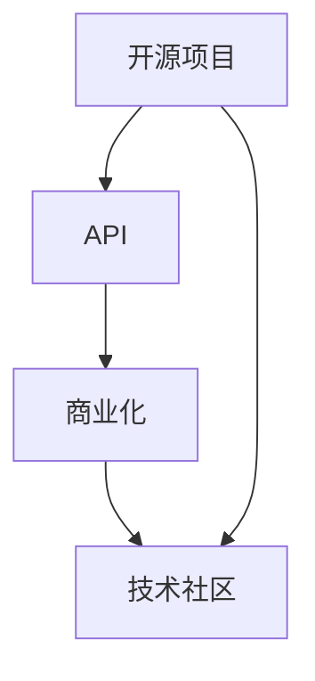

                 

关键字：开源项目、API商业化、策略、定价模型、IT行业、商业价值、技术共享、商业模式

摘要：本文将探讨开源项目的API商业化路径及其策略和定价模型。通过分析开源项目的价值、商业化挑战和成功案例，本文旨在为开发者、企业以及创业者提供有关开源项目API商业化的实用指导。

## 1. 背景介绍

开源项目在近年来迅速发展，成为软件生态系统中的重要组成部分。开源项目通过开放源代码，鼓励社区参与，提升了软件的质量和可靠性。同时，许多企业和开发者通过开源项目来构建业务、拓展市场。然而，如何将开源项目的API商业化，实现商业价值最大化，成为了许多开发者和企业面临的挑战。

开源项目的API商业化不仅仅是将开源API打包出售那么简单，它需要一套完整的策略和定价模型来支撑。正确的策略和定价模型可以帮助开发者或企业更好地把握市场动态，提高项目的竞争力，同时确保开源社区的利益不被损害。

本文将从以下几个方面展开讨论：

- 开源项目的价值评估
- 开源项目的商业化挑战
- 开源项目的成功案例分析
- 开源项目的策略和定价模型
- 开源项目的未来发展趋势

通过以上内容的探讨，旨在为开源项目的API商业化提供有价值的见解和实践指导。

## 2. 核心概念与联系

在深入探讨开源项目的API商业化之前，我们需要理解一些核心概念及其相互关系。以下是一个简化的Mermaid流程图，展示了开源项目、API、商业化以及技术社区之间的关联。



### 2.1 开源项目

开源项目是指那些源代码公开，允许用户自由查看、修改和分发的软件项目。开源项目通过吸引社区参与，促进了技术的创新和传播。开源项目可以包括各种类型的软件，如操作系统、编程语言、开发框架、工具等。

### 2.2 API

API（应用程序编程接口）是一种让不同软件系统之间相互通信的接口。开源项目的API使得其他开发者可以在不接触源代码的情况下使用项目的功能。通过API，开发者可以集成开源项目到自己的应用中，提高开发效率。

### 2.3 商业化

商业化是将产品或服务转化为商业收益的过程。对于开源项目来说，商业化意味着通过销售API服务、提供商业支持等方式，将开源项目的价值转化为经济利益。

### 2.4 技术社区

技术社区是开源项目发展的基石。社区成员通过贡献代码、提供反馈、分享经验等方式，推动了开源项目的发展。开源项目的商业化需要平衡社区利益和商业需求，确保社区成员的利益不受损害。

## 3. 核心算法原理 & 具体操作步骤

### 3.1 算法原理概述

开源项目的API商业化需要一套策略和定价模型，以确保项目的可持续发展并实现商业价值。以下是一些关键原理：

- **价值评估**：确定开源项目的市场价值，分析其潜在客户和市场规模。
- **定价策略**：根据市场状况、项目特点和目标用户群体，制定合适的定价策略。
- **风险管理**：评估并管理商业化过程中可能面临的风险，如法律风险、技术风险和市场风险。
- **市场推广**：通过多种渠道推广项目，提高项目的知名度和市场接受度。
- **持续迭代**：不断优化项目，满足用户需求，提升项目的竞争力。

### 3.2 算法步骤详解

#### 步骤 1：价值评估

首先，需要对开源项目的价值进行评估。这包括分析项目的功能、性能、社区活跃度、用户反馈等方面。通过这些分析，可以确定项目的市场潜力。

#### 步骤 2：市场研究

在价值评估的基础上，进行市场研究，了解潜在客户的需求、竞争态势以及市场价格水平。市场研究可以帮助确定项目的目标用户群体和定价策略。

#### 步骤 3：定价策略

根据市场研究的结果，制定合适的定价策略。定价策略可以包括基于功能模块的定价、基于用户规模的定价、基于使用量的定价等。合理的定价策略可以最大化项目的商业价值。

#### 步骤 4：风险管理

在商业化过程中，需要评估并管理可能面临的风险。这包括法律风险（如版权问题）、技术风险（如项目维护问题）和市场风险（如市场竞争问题）。通过制定风险管理计划，可以降低商业化过程中的不确定性。

#### 步骤 5：市场推广

通过多种渠道（如社交媒体、行业会议、合作伙伴等）推广项目，提高项目的知名度和市场接受度。有效的市场推广可以加速商业化的进程。

#### 步骤 6：持续迭代

在商业化过程中，需要持续优化项目，满足用户需求，提升项目的竞争力。通过不断迭代，可以保持项目的活力和吸引力。

### 3.3 算法优缺点

#### 优点

- **提高商业价值**：通过商业化，开源项目可以转化为经济利益，提高项目的可持续性。
- **促进社区发展**：合理的商业化策略可以激励社区成员的参与，促进项目的发展。
- **拓展市场渠道**：商业化可以帮助项目进入新的市场，提高项目的知名度。

#### 缺点

- **管理复杂性**：商业化过程中涉及多个环节，管理复杂度较高。
- **法律风险**：商业化可能涉及法律问题，如版权、许可等。
- **市场不确定性**：市场环境多变，商业化策略需要灵活调整。

### 3.4 算法应用领域

开源项目的API商业化适用于各种类型的软件项目，如云计算、大数据、人工智能等。通过合适的商业化策略和定价模型，开源项目可以在不同领域实现商业价值。

## 4. 数学模型和公式 & 详细讲解 & 举例说明

### 4.1 数学模型构建

在开源项目的API商业化过程中，可以使用以下数学模型来构建定价策略：

- **成本加成定价**：以项目开发成本为基础，加上一定比例的加成作为价格。
- **市场导向定价**：根据市场供需情况，确定项目价格。
- **价值导向定价**：根据项目对用户的实际价值，确定价格。

### 4.2 公式推导过程

#### 成本加成定价

设项目开发成本为C，加成为r，项目价格为P，则：

\[ P = C \times (1 + r) \]

其中，r 可以根据项目的市场需求、竞争态势等因素进行调整。

#### 市场导向定价

设市场需求函数为D(P)，供应函数为S(P)，则：

\[ P = \arg \min (D(P) - S(P)) \]

其中，arg 表示求解过程，min 表示最小化。

#### 价值导向定价

设项目对用户的价值为V，则：

\[ P = V \times (1 - \delta) \]

其中，\(\delta\) 表示折扣率，可以根据市场情况和用户需求进行调整。

### 4.3 案例分析与讲解

#### 案例 1：成本加成定价

假设一个开源项目的开发成本为100万元，市场需求旺盛，竞争较小，加成率设置为20%。则项目价格为：

\[ P = 100 \times (1 + 0.2) = 120 \text{万元} \]

#### 案例 2：市场导向定价

假设市场需求函数为 \( D(P) = 1000 - 5P \)，供应函数为 \( S(P) = 200 + 3P \)。则价格求解过程如下：

\[ P = \arg \min (D(P) - S(P)) \]

\[ P = \arg \min (1000 - 5P - (200 + 3P)) \]

\[ P = \arg \min (800 - 8P) \]

\[ P = 100 \text{万元} \]

#### 案例 3：价值导向定价

假设项目对用户的价值为200万元，折扣率设置为10%。则项目价格为：

\[ P = 200 \times (1 - 0.1) = 180 \text{万元} \]

## 5. 项目实践：代码实例和详细解释说明

### 5.1 开发环境搭建

为了演示开源项目的API商业化，我们选择一个实际的开源项目——一个简单的天气API。首先，我们需要搭建开发环境。

#### 步骤 1：安装Python环境

在开发计算机上安装Python环境，可以使用Miniconda或Anaconda来简化安装过程。

```bash
conda create -n weather_api python=3.8
conda activate weather_api
```

#### 步骤 2：安装依赖库

使用pip安装所需的依赖库。

```bash
pip install requests Flask
```

#### 步骤 3：获取开源项目

从GitHub或其他开源平台克隆天气API项目。

```bash
git clone https://github.com/user/weather_api.git
cd weather_api
```

### 5.2 源代码详细实现

天气API的核心功能是通过HTTP请求获取指定城市的天气信息。以下是一个简单的实现示例。

```python
from flask import Flask, request, jsonify
import requests

app = Flask(__name__)

@app.route('/weather', methods=['GET'])
def get_weather():
    city = request.args.get('city')
    url = f'http://api.weatherapi.com/v1/current.json?key=YOUR_API_KEY&q={city}'
    response = requests.get(url)
    weather_data = response.json()
    return jsonify(weather_data)

if __name__ == '__main__':
    app.run(debug=True)
```

### 5.3 代码解读与分析

上述代码中，我们定义了一个简单的Flask应用，通过HTTP GET请求获取指定城市的天气信息。具体解读如下：

- **导入模块**：导入了Flask、request和jsonify模块。
- **创建应用**：使用Flask创建了一个Web应用实例。
- **定义路由**：通过`@app.route`装饰器定义了一个名为`/weather`的路由，处理GET请求。
- **获取城市**：使用`request.args.get`方法获取请求中的城市参数。
- **请求天气API**：使用requests库向天气API发送GET请求，获取天气数据。
- **返回结果**：将获取的天气数据通过jsonify方法返回。

### 5.4 运行结果展示

启动应用后，可以通过浏览器或curl命令访问天气API。

```bash
curl http://127.0.0.1:5000/weather?city=Shanghai
```

输出结果如下：

```json
{
    "location": {
        "name": "Shanghai",
        "lat": 31.2304,
        "lon": 121.4737,
        "country": "CN",
        "region": "Shanghai",
        "localtime_epoch": 1624666400,
        "localtime": "2021-07-01 14:30"
    },
    "current": {
        "last_updated": "2021-07-01 14:30",
        "temp_c": 28.1,
        "temp_f": 82.6,
        "is_day": 1,
        "condition": {
            "text": "Sunny",
            "icon": "http://cdn.weatherapi.com/weather/64x64/day/116.png",
            "code": 1000
        },
        "wind_speed": 7.9,
        "wind_dir": "NE"
    }
}
```

该输出包含了城市的天气信息，包括温度、天气状况、风速和风向等。

## 6. 实际应用场景

开源项目的API商业化在实际应用中有着广泛的应用场景。以下是一些典型的应用案例：

- **企业级应用**：许多企业使用开源项目的API来构建其内部系统。例如，一个企业可能会使用开源的CRM系统，并通过购买API服务来获取额外的功能和数据支持。
- **开发套件**：一些开发者会利用开源项目的API来构建开发工具和平台。例如，一个开发者可能会构建一个基于开源数据库的工具，通过销售API服务来获取额外的数据分析和报告功能。
- **平台集成**：许多平台（如电商平台、社交媒体平台等）通过集成开源项目的API来提供更多的功能和服务。例如，一个电商平台可能会集成开源的支付API，以提供多样化的支付选项。

### 6.1 企业级应用

在企业级应用中，开源项目的API商业化通常采用以下方式：

- **API订阅服务**：企业可以通过订阅服务来使用开源项目的API，根据使用量或功能模块进行定价。
- **定制化开发**：企业可以购买定制化的API服务，根据自身需求调整API的功能和性能。

### 6.2 开发套件

在开发套件中，开源项目的API商业化通常采用以下方式：

- **插件或模块销售**：开发者可以开发插件或模块，并将其作为商业产品销售。
- **API许可证**：开发者可以出售API许可证，允许其他开发者集成和使用API。

### 6.3 平台集成

在平台集成中，开源项目的API商业化通常采用以下方式：

- **API合作伙伴计划**：平台可以通过合作伙伴计划，与开源项目的开发者合作，共同推广API服务。
- **广告和推广**：平台可以通过广告和推广，增加开源项目API的知名度和使用量。

## 6.4 未来应用展望

随着技术的发展和市场的需求，开源项目的API商业化在未来将会有更多的发展机会。以下是一些可能的趋势和展望：

- **AI和大数据应用**：随着AI和大数据技术的成熟，开源项目的API将在这些领域有更大的应用潜力。开发者可以通过商业化AI和大数据API，为企业和个人提供定制化的数据分析和预测服务。
- **物联网（IoT）应用**：物联网的快速发展为开源项目的API商业化带来了新的机会。开发者可以通过商业化的物联网API，为智能家居、工业物联网等领域提供创新的应用和服务。
- **区块链应用**：区块链技术的兴起为开源项目的API商业化提供了新的场景。开发者可以通过商业化的区块链API，为金融、供应链管理等领域提供去中心化的解决方案。

## 7. 工具和资源推荐

### 7.1 学习资源推荐

- **在线课程**：Coursera、edX、Udemy等平台提供了大量关于开源项目、API设计和商业化的课程。
- **技术博客**：GitHub、Stack Overflow、Medium等技术博客上有许多关于开源项目API商业化的实践和案例分析。
- **书籍**：《API Design for C#》、《APIs: A Strategy Guide》等书籍提供了深入的技术知识和商业策略。

### 7.2 开发工具推荐

- **API管理工具**：Apigee、Mashery、Stoplight等工具可以帮助开发者管理和测试API。
- **云平台**：AWS、Azure、Google Cloud等云平台提供了丰富的API服务，支持开源项目的商业化。

### 7.3 相关论文推荐

- **“Open Source Models for Business”**：分析了开源项目的商业模式和商业价值。
- **“API Pricing Strategies”**：探讨了API定价策略的理论和实践。
- **“Open Source and the Commercial Web”**：研究了开源项目在商业环境中的角色和影响。

## 8. 总结：未来发展趋势与挑战

### 8.1 研究成果总结

本文通过对开源项目的API商业化的深入探讨，总结了开源项目的价值、商业化挑战、成功案例以及策略和定价模型。研究发现，开源项目的API商业化不仅能够实现商业价值，还能够促进社区发展，推动技术创新。

### 8.2 未来发展趋势

随着技术的发展和市场的需求，开源项目的API商业化将在AI、大数据、物联网和区块链等领域有更大的发展机会。开发者和企业需要不断创新，以适应市场的变化和用户需求。

### 8.3 面临的挑战

开源项目的API商业化面临诸多挑战，如法律风险、技术风险和市场风险。开发者和企业需要制定完善的风险管理策略，确保商业化的成功。

### 8.4 研究展望

未来，开源项目的API商业化研究应关注以下几个方面：1）探索新的商业模式和定价策略；2）研究如何更好地平衡社区利益和商业需求；3）分析不同领域开源项目API商业化的成功案例，总结经验和教训。

## 9. 附录：常见问题与解答

### 9.1 开源项目API商业化是否合法？

开源项目通常基于特定的开源协议，如MIT、Apache License 2.0等。这些协议允许用户自由使用、修改和分发开源项目，但通常也要求用户保留原始版权声明。商业化开源项目API需要在遵守开源协议的前提下进行。例如，使用Apache License 2.0的开源项目可以商业化，但需要保留原始版权声明，并且对于修改后的代码，用户需要以相同的方式开源。

### 9.2 如何评估开源项目的商业价值？

评估开源项目的商业价值可以从以下几个方面入手：

- **功能与性能**：分析项目的功能是否满足市场需求，性能是否优秀。
- **社区活跃度**：评估项目社区是否活跃，是否有大量的贡献者。
- **用户反馈**：分析用户对项目的反馈，了解用户的需求和满意度。
- **市场规模**：了解项目的潜在市场和用户群体，分析市场空间。

### 9.3 开源项目API商业化的成功案例有哪些？

开源项目API商业化的成功案例包括：

- **Twilio**：一家提供通信API服务的企业，通过商业化其开源的通信API，实现了快速增长。
- **GitHub**：通过提供GitHub API服务，GitHub为企业提供了强大的协作和项目管理工具，同时实现了商业模式的创新。
- **Stripe**：提供支付API服务， Stripe为企业提供了便捷的支付解决方案，并在金融科技领域取得了显著的成功。

## 作者署名

作者：禅与计算机程序设计艺术 / Zen and the Art of Computer Programming

