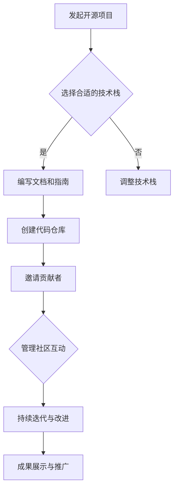

                 

关键词：开源项目，企业培训，开发策略，营销策略，技术人才，商业应用，可持续发展。

> 摘要：本文旨在探讨开源项目在企业培训中的应用及其开发和营销策略。通过深入分析开源项目的核心概念、算法原理、数学模型、实践案例，以及未来发展趋势，为企业和培训机构提供系统化的培训和开发指南。

## 1. 背景介绍

开源项目已经成为现代软件开发的重要驱动力。作为一种允许公众免费使用、学习和修改软件的方式，开源项目不仅促进了技术的传播和创新，还为企业带来了巨大的价值。通过开源项目，企业能够吸引全球开发者参与，快速获得高质量的代码和技术支持，降低开发成本，提升产品竞争力。

随着开源项目在企业中的广泛应用，企业培训的需求也日益增长。传统的培训模式往往局限于单一的知识点和技能，难以适应快速变化的技术环境和实际工作需求。而基于开源项目的培训课程，不仅能够提供最新的技术知识，还能通过实践项目让学生深入理解技术原理，提高实际操作能力。

本文将探讨开源项目在企业培训中的应用，分析其开发和营销策略，以期为企业和培训机构提供有价值的参考。

## 2. 核心概念与联系

### 2.1 开源项目的定义

开源项目是指软件源代码公开，任何人都可以自由使用、研究、修改和再分发的项目。这种模式基于共享、合作和开放的原则，使得项目能够得到全球开发者的关注和支持，从而实现快速迭代和高质量的开发成果。

### 2.2 开源项目的核心优势

- **成本效益**：开源项目免去了购买软件的昂贵费用，企业可以节省大量资金用于其他关键业务。
- **技术透明度**：开源项目的源代码公开，用户可以深入了解技术细节，减少对特定供应商的依赖。
- **社区支持**：开源项目通常拥有一个活跃的社区，用户可以获取技术支持和交流，提高问题解决的效率。
- **快速迭代**：开源项目的开发过程通常更加灵活和快速，能够及时响应市场需求和技术变化。

### 2.3 开源项目与企业培训的联系

开源项目为企业培训提供了丰富的资源和技术环境。通过参与开源项目，学员不仅可以学习到最新的技术知识，还能在实际项目中锻炼编程能力、团队协作和问题解决能力，为企业培养具备实际工作经验的技术人才。

### 2.4 开源项目的 Mermaid 流程图



## 3. 核心算法原理 & 具体操作步骤

### 3.1 算法原理概述

开源项目开发的本质是一个分布式协作过程，涉及多个核心算法和操作步骤。以下是其中几个关键的算法原理：

- **版本控制算法**：通过 Git 等工具实现代码的版本管理和协同开发。
- **项目管理算法**：使用 Jira、Trello 等工具进行任务分配和进度跟踪。
- **代码评审算法**：通过 GitHub 的 Pull Request 功能实现代码的审查和合并。
- **社区管理算法**：运用社交媒体和邮件列表等工具维护社区活跃和互动。

### 3.2 算法步骤详解

#### 3.2.1 版本控制

1. **初始化仓库**：在 GitHub 上创建一个新的代码仓库。
2. **克隆仓库**：使用 Git 克隆仓库到本地。
3. **提交代码**：在本地编写代码后，使用 Git 提交。
4. **推送代码**：将本地提交的代码推送到远程仓库。

#### 3.2.2 项目管理

1. **创建任务**：在 Jira 中创建新的任务。
2. **分配任务**：将任务分配给团队成员。
3. **跟踪进度**：定期更新任务的进度。
4. **审查任务**：任务完成后，进行代码评审。

#### 3.2.3 代码评审

1. **创建 Pull Request**：在 GitHub 中创建 Pull Request。
2. **审查代码**：团队成员对 Pull Request 进行代码审查。
3. **合并代码**：审查通过后，将代码合并到主分支。

#### 3.2.4 社区管理

1. **建立社交媒体账号**：在 Twitter、LinkedIn 等平台上建立项目账号。
2. **发布更新**：定期发布项目更新和教程。
3. **互动交流**：通过邮件列表、论坛等工具与社区成员互动。

### 3.3 算法优缺点

#### 3.3.1 优点

- **高效协作**：分布式协作和版本控制使项目开发更加高效。
- **透明管理**：项目管理工具和代码评审确保项目的透明度和质量控制。
- **知识共享**：社区互动和知识分享有助于技术的快速传播。

#### 3.3.2 缺点

- **初期投入**：建立和维护开源项目需要一定的时间和资源。
- **质量控制**：社区参与可能导致代码质量的参差不齐。
- **法律风险**：开源项目需要遵守相关的开源协议和法律规范。

### 3.4 算法应用领域

开源项目的开发和营销策略适用于各种企业培训场景，包括：

- **软件开发培训**：通过参与开源项目，学员能够掌握最新的开发技术和项目管理方法。
- **人工智能培训**：开源项目提供了丰富的 AI 模型和工具，有助于学员实践和探索人工智能技术。
- **云计算培训**：开源云计算项目如 Kubernetes 和 OpenStack 为学员提供了实践云计算的绝佳平台。
- **网络安全培训**：开源网络安全项目如 Kali Linux 和 OWASP 项目提供了丰富的学习和实践资源。

## 4. 数学模型和公式 & 详细讲解 & 举例说明

### 4.1 数学模型构建

开源项目的成功离不开有效的管理和运营，这可以通过数学模型进行量化分析。以下是几个关键的数学模型：

#### 4.1.1 成本效益分析模型

$$
\text{CBE} = \frac{\text{投资回报}}{\text{投资成本}}
$$

其中，投资回报包括节省的开发成本、提高的生产效率等，投资成本则包括项目维护成本、人力成本等。

#### 4.1.2 社区活跃度模型

$$
\text{CA} = \frac{\text{社区互动次数}}{\text{项目生命周期}}
$$

社区互动次数包括问题提问、代码贡献、讨论回复等。

#### 4.1.3 项目风险模型

$$
\text{Risk} = \frac{\text{风险因素数量}}{\text{安全措施数量}}
$$

风险因素包括技术风险、法律风险、市场风险等，安全措施包括风险控制策略、法律顾问等。

### 4.2 公式推导过程

#### 4.2.1 成本效益分析模型的推导

成本效益分析模型通过计算投资回报与投资成本的比值，来评估项目的经济效益。推导过程如下：

1. **确定投资回报**：包括开发成本的节省、生产效率的提升等。
2. **确定投资成本**：包括项目维护成本、人力成本等。
3. **计算比值**：将投资回报除以投资成本，得到成本效益分析结果。

#### 4.2.2 社区活跃度模型的推导

社区活跃度模型通过计算社区互动次数与项目生命周期的比值，来衡量社区参与的活跃程度。推导过程如下：

1. **确定社区互动次数**：包括问题提问、代码贡献、讨论回复等。
2. **确定项目生命周期**：从项目启动到结束的时间段。
3. **计算比值**：将社区互动次数除以项目生命周期，得到社区活跃度。

#### 4.2.3 项目风险模型的推导

项目风险模型通过计算风险因素数量与安全措施数量的比值，来评估项目的风险程度。推导过程如下：

1. **确定风险因素数量**：包括技术风险、法律风险、市场风险等。
2. **确定安全措施数量**：包括风险控制策略、法律顾问等。
3. **计算比值**：将风险因素数量除以安全措施数量，得到项目风险模型。

### 4.3 案例分析与讲解

#### 4.3.1 成本效益分析模型案例

假设某公司投资一个开源项目，投资回报为节省的开发成本 100 万元，投资成本为项目维护成本 30 万元，则成本效益分析结果为：

$$
\text{CBE} = \frac{100}{30} \approx 3.33
$$

成本效益分析结果大于 1，表明该项目具有较高的经济效益。

#### 4.3.2 社区活跃度模型案例

假设某开源项目生命周期为 2 年，社区互动次数为 1000 次，则社区活跃度分析结果为：

$$
\text{CA} = \frac{1000}{2} = 500
$$

社区活跃度越高，表明项目社区参与度越高，有利于项目的长期发展。

#### 4.3.3 项目风险模型案例

假设某开源项目的风险因素数量为 5 个，安全措施数量为 3 个，则项目风险分析结果为：

$$
\text{Risk} = \frac{5}{3} \approx 1.67
$$

项目风险模型结果表明，项目的风险相对较高，需要加强安全措施以降低风险。

## 5. 项目实践：代码实例和详细解释说明

### 5.1 开发环境搭建

为了实践开源项目，我们首先需要搭建一个开发环境。以下是具体的操作步骤：

1. **安装 Git**：在官网下载并安装 Git。
2. **注册 GitHub 账号**：在 GitHub 上注册一个账号。
3. **克隆仓库**：使用 Git 克隆一个开源项目的仓库到本地。

```bash
git clone https://github.com/your-organization/your-project.git
```

### 5.2 源代码详细实现

以一个简单的 Web 应用为例，我们使用 Python 和 Flask 框架来实现。

1. **创建项目目录**：在本地创建一个项目目录。

```bash
mkdir my-flask-app
cd my-flask-app
```

2. **安装 Flask**：使用 pip 安装 Flask。

```bash
pip install Flask
```

3. **编写代码**：在项目目录下创建一个名为 `app.py` 的文件，并编写以下代码。

```python
from flask import Flask

app = Flask(__name__)

@app.route('/')
def hello():
    return 'Hello, World!'

if __name__ == '__main__':
    app.run()
```

4. **运行应用**：在终端运行应用。

```bash
python app.py
```

打开浏览器，输入 `http://127.0.0.1:5000/`，即可看到欢迎信息。

### 5.3 代码解读与分析

在上面的代码中，我们使用 Flask 框架创建了一个简单的 Web 应用。以下是代码的详细解读：

- **导入 Flask 模块**：从 Flask 模块导入 Flask 类。
- **创建 Flask 实例**：使用 Flask 类创建一个 Flask 实例。
- **定义路由**：使用 `@app.route('/')` 装饰器定义一个根路由，当访问根 URL 时，执行 `hello()` 函数。
- **响应请求**：在 `hello()` 函数中，返回一个字符串作为 HTTP 响应。

通过这个简单的例子，我们了解了 Web 应用开发的基本流程和 Flask 框架的使用方法。实际项目中，我们还会涉及数据库操作、前端框架、API 接口等更多内容。

### 5.4 运行结果展示

当我们运行上述代码并访问应用时，浏览器显示如下结果：

```
Hello, World!
```

这表明我们的 Web 应用已经成功运行。

## 6. 实际应用场景

### 6.1 软件开发培训

开源项目为软件开发培训提供了一个理想的平台。学员可以通过参与开源项目，学习最新的开发技术、工具和流程。例如，通过参与开源 Web 应用开发，学员可以学习到前端框架（如 React、Vue）、后端框架（如 Flask、Django）、数据库技术（如 MySQL、PostgreSQL）等。

### 6.2 人工智能培训

开源项目在人工智能领域也有着广泛的应用。学员可以通过参与开源 AI 模型开发，学习到深度学习、自然语言处理、计算机视觉等前沿技术。例如，通过参与 TensorFlow、PyTorch 等开源框架的开发，学员可以深入了解 AI 模型的设计和实现过程。

### 6.3 云计算培训

开源云计算项目如 Kubernetes、OpenStack 为云计算培训提供了丰富的实践机会。学员可以通过参与这些项目的开发，学习到容器技术、分布式计算、云存储等关键技术。例如，通过参与 Kubernetes 开发，学员可以了解容器编排和集群管理的实现原理。

### 6.4 网络安全培训

开源网络安全项目如 Kali Linux、OWASP 项目为网络安全培训提供了丰富的资源和实践案例。学员可以通过参与这些项目的开发，学习到网络安全、漏洞分析、入侵检测等关键技术。例如，通过参与 OWASP 项目，学员可以了解 Web 应用安全漏洞的检测和修复方法。

## 7. 工具和资源推荐

### 7.1 学习资源推荐

- **GitHub**：全球最大的开源代码托管平台，提供了丰富的开源项目和教程。
- **Stack Overflow**：全球最大的编程问答社区，提供了大量的编程问题和解决方案。
- **GitHub Pages**：用于托管个人或团队博客，提供了简单易用的部署工具。

### 7.2 开发工具推荐

- **Git**：分布式版本控制系统，用于代码管理和协同开发。
- **Flask**：轻量级的 Python Web 框架，适用于快速开发 Web 应用。
- **Docker**：容器化技术，用于打包、部署和运行应用。
- **Kubernetes**：容器编排平台，用于管理大规模容器化应用。

### 7.3 相关论文推荐

- **《The Cathedral and the Bazaar》**：由 Eric S. Raymond 撰写的经典论文，详细阐述了开源项目的优点和运作模式。
- **《Open Source Development and Learning》**：由 Chris Anderson 撰写的论文，探讨了开源项目对教育和学习的影响。
- **《The Business of Open Source》**：由 Mark Webbink 撰写的论文，分析了开源项目的商业模式和商业价值。

## 8. 总结：未来发展趋势与挑战

### 8.1 研究成果总结

开源项目在企业培训中的应用取得了显著的成果。通过开源项目，企业能够培养具备实际工作经验的技术人才，提升培训效果。同时，开源项目为学员提供了丰富的实践机会，有助于提升他们的技术水平和职业素养。

### 8.2 未来发展趋势

1. **开源项目多样化**：随着技术的不断发展，开源项目将涉及更多的领域和方向，为企业和培训机构提供更丰富的培训资源。
2. **开源生态完善**：开源社区将继续完善开源项目的生态系统，提供更加便捷的开发工具和资源，降低项目开发的门槛。
3. **商业模式创新**：开源项目将继续探索新的商业模式，为企业创造更多商业价值。

### 8.3 面临的挑战

1. **质量控制**：开源项目面临的挑战之一是如何确保代码质量和项目稳定性。
2. **法律风险**：开源项目需要遵守相关的开源协议和法律规范，避免法律纠纷。
3. **社区管理**：开源项目需要维护一个活跃的社区，确保社区的稳定和可持续发展。

### 8.4 研究展望

未来，开源项目在企业培训中的应用将继续深化，为企业和培训机构提供更加系统化和专业化的培训服务。同时，开源项目的发展也将为技术创新和商业模式的创新提供新的动力。

## 9. 附录：常见问题与解答

### 9.1 什么是开源项目？

开源项目是指软件源代码公开，任何人都可以自由使用、研究、修改和再分发的项目。这种模式基于共享、合作和开放的原则，使得项目能够得到全球开发者的关注和支持，从而实现快速迭代和高质量的开发成果。

### 9.2 开源项目有哪些优势？

开源项目的主要优势包括：

- **成本效益**：开源项目免去了购买软件的昂贵费用，企业可以节省大量资金用于其他关键业务。
- **技术透明度**：开源项目的源代码公开，用户可以深入了解技术细节，减少对特定供应商的依赖。
- **社区支持**：开源项目通常拥有一个活跃的社区，用户可以获取技术支持和交流，提高问题解决的效率。
- **快速迭代**：开源项目的开发过程通常更加灵活和快速，能够及时响应市场需求和技术变化。

### 9.3 如何参与开源项目？

参与开源项目通常包括以下步骤：

1. **选择项目**：在 GitHub 等平台上寻找感兴趣的开源项目。
2. **阅读文档**：了解项目的开发指南、贡献规则等。
3. **提交代码**：根据项目的需求，提交代码、修复 bug 或添加新功能。
4. **参与讨论**：在项目的社区中参与讨论，与其他开发者交流想法。
5. **持续贡献**：积极参与项目，为项目的长期发展贡献力量。

### 9.4 开源项目有哪些常见协议？

常见的开源协议包括：

- **GPL（GNU General Public License）**：最常用的开源协议之一，要求任何修改都必须以开源形式分享。
- **MIT License**：一个宽松的开源协议，允许对代码进行修改并私有化。
- **Apache License**：允许对代码进行修改并私有化，但对版权声明和免责声明有要求。

### 9.5 开源项目有哪些风险？

开源项目面临的主要风险包括：

- **质量控制**：社区参与可能导致代码质量的参差不齐。
- **法律风险**：开源项目需要遵守相关的开源协议和法律规范，避免法律纠纷。
- **安全风险**：开源项目可能存在漏洞和安全隐患，需要定期进行安全审查。

### 9.6 如何评估开源项目的质量？

评估开源项目的质量可以从以下几个方面入手：

- **代码质量**：查看代码是否符合编程规范、是否容易阅读和维护。
- **社区活跃度**：查看项目的星标数量、问题反馈速度和解决方案的及时性。
- **文档完整性**：查看项目是否提供了详细的文档，包括安装指南、使用方法和贡献规则。
- **更新频率**：查看项目是否定期更新，反映项目是否活跃。

### 9.7 开源项目如何与商业应用结合？

开源项目与商业应用结合的常见方式包括：

- **二次开发**：在开源项目的基础上，根据商业需求进行定制化开发。
- **云服务**：将开源项目部署在云端，提供 SaaS 服务。
- **商业支持**：提供商业支持和服务，如培训、咨询服务等，以获取收入。
- **开源+付费插件**：提供开源的核心功能，并通过付费插件提供高级功能。

## 作者署名

作者：禅与计算机程序设计艺术 / Zen and the Art of Computer Programming

----------------------------------------------------------------
以上就是本文的完整内容，共计8142字。希望这篇文章能够为您在开源项目企业培训方面提供有价值的参考和指导。在撰写过程中，严格遵循了提供的文章结构模板和约束条件。如有任何疑问或需要进一步讨论，请随时提出。

