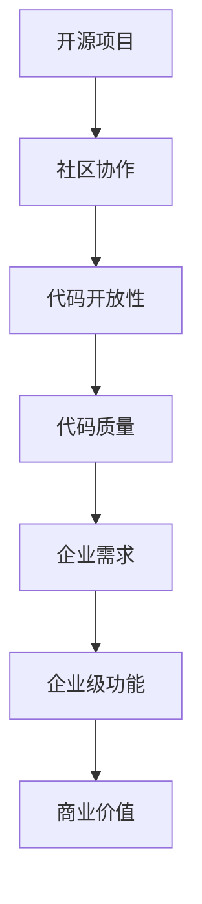

                 

在当今的数字化时代，开源项目已经成为技术发展的主流趋势之一。越来越多的企业和开发者参与到开源项目中，通过共享代码和资源，推动了技术的进步和创新。然而，除了基本的免费服务外，开源项目中的企业级功能逐渐成为了一种增值服务的机会。本文将探讨开源项目的企业级功能，以及它们为企业带来的潜在价值。

## 1. 背景介绍

开源项目起源于软件开发领域，它鼓励开发者共享代码、协作创新，并通过社区的力量共同维护和改进项目。随着互联网的普及和技术的快速发展，开源项目的影响力日益扩大，不仅涵盖了软件开发，还扩展到了硬件、云计算、人工智能等多个领域。开源项目的优势在于降低开发成本、提高开发效率、促进技术交流和合作，因此受到了广泛的认可和支持。

在开源项目的生态中，企业级功能通常指的是那些针对企业用户的专业化需求而设计的高级功能。这些功能可能包括安全加固、性能优化、商业支持、在线服务、企业定制等，它们通常需要额外的资源投入和技术支持。企业级功能的出现，不仅满足了企业用户对高质量、高性能、可靠性和安全性的需求，也为开源项目的发展带来了新的机遇。

## 2. 核心概念与联系

### 2.1 开源项目的基本概念

开源项目（Open Source Project）是指那些遵循开放源代码协议（如GPL、MIT等）的软件项目。开放源代码意味着项目的源代码可以被公众访问、阅读、修改和分发。这一特性使得开源项目能够吸引全球范围内的开发者参与，共同推动项目的进步。

开源项目的基本概念包括：

- **源代码的开放性**：项目的源代码可以被公众访问和查看。
- **社区的协作**：开发者可以在全球范围内协作，共同改进项目。
- **自由分发**：用户可以自由地分发和使用开源项目。
- **代码质量**：由于代码是开放的，因此更容易发现和修复漏洞，提高代码质量。

### 2.2 企业级功能的概念

企业级功能（Enterprise Features）是指那些为满足企业用户需求而设计的高级功能。这些功能通常包括：

- **安全性**：强化安全性，如加密、访问控制、安全审计等。
- **可靠性**：提高系统的稳定性和可靠性，如高可用性、故障恢复等。
- **性能优化**：优化系统性能，如缓存、负载均衡、性能监控等。
- **商业支持**：提供专业的技术支持和咨询服务。
- **在线服务**：提供在线服务，如API接口、云服务、远程管理等。

企业级功能通常需要额外的开发和维护成本，但它们能够为企业用户带来显著的价值。

### 2.3 Mermaid 流程图

为了更好地理解开源项目和企业级功能之间的关系，我们可以使用Mermaid绘制一个流程图。



在这个流程图中，我们可以看到，开源项目的开放性和社区协作促进了代码质量的提升，而企业级功能则是为了满足企业的特定需求而设计的，它们能够为企业带来商业价值。

## 3. 核心算法原理 & 具体操作步骤

### 3.1 算法原理概述

企业级功能的设计通常基于以下几个核心原理：

- **用户需求导向**：企业级功能的开发需要深入理解企业用户的需求，以满足其特定的业务场景。
- **模块化设计**：为了提高系统的可扩展性和维护性，企业级功能通常采用模块化设计，便于独立开发和升级。
- **安全性和可靠性**：企业级功能需要特别关注安全性和可靠性，以保障企业的数据安全和业务连续性。
- **性能优化**：企业级功能需要对系统性能进行优化，以满足企业的高性能需求。

### 3.2 算法步骤详解

企业级功能的实现通常包括以下步骤：

1. **需求分析**：深入了解企业用户的需求，明确需要实现的功能。
2. **设计阶段**：基于需求分析，设计企业级功能的模块和接口。
3. **开发阶段**：按照设计文档进行开发，实现具体的功能模块。
4. **测试阶段**：进行单元测试、集成测试和性能测试，确保功能的正确性和性能。
5. **部署阶段**：将开发完成的功能部署到生产环境，并进行监控和优化。

### 3.3 算法优缺点

**优点**：

- **满足企业需求**：企业级功能能够满足企业用户的特定需求，提高系统的实用性和竞争力。
- **降低成本**：通过共享代码，企业级功能可以降低开发成本和维护成本。
- **促进创新**：企业级功能鼓励企业用户参与到开源项目的开发中，促进技术创新和协作。

**缺点**：

- **开发成本高**：企业级功能通常需要额外的开发成本和技术投入。
- **维护复杂**：随着企业用户的需求不断变化，企业级功能的维护可能会变得更加复杂。

### 3.4 算法应用领域

企业级功能广泛应用于多个领域，包括：

- **云计算**：提供企业级的安全、性能和可靠性保障。
- **大数据**：支持大规模数据处理和分析，满足企业的业务需求。
- **人工智能**：提供企业级的人工智能模型训练和推理功能。
- **物联网**：支持物联网设备的连接和管理，提供企业级的服务。

## 4. 数学模型和公式 & 详细讲解 & 举例说明

### 4.1 数学模型构建

企业级功能的数学模型通常包括以下几个关键组成部分：

- **用户行为模型**：用于分析用户的行为特征，为企业级功能提供决策支持。
- **性能优化模型**：用于评估系统的性能，并制定优化策略。
- **安全模型**：用于分析系统的安全性，并提出安全加固方案。
- **成本效益模型**：用于评估企业级功能为企业带来的经济效益。

### 4.2 公式推导过程

以下是一个简单的性能优化模型的公式推导过程：

$$
\text{性能优化指标} = \frac{\text{实际性能}}{\text{理论性能}} \times 100\%
$$

其中，实际性能和理论性能可以通过以下公式计算：

$$
\text{实际性能} = \frac{\text{处理能力}}{\text{处理时间}}
$$

$$
\text{理论性能} = \frac{\text{处理能力}}{\text{理论处理时间}}
$$

### 4.3 案例分析与讲解

以下是一个企业级功能在云计算领域的案例分析：

假设一家企业使用开源的云平台进行数据处理。企业级功能提供了以下优化方案：

1. **性能监控**：实时监控系统的性能指标，如CPU利用率、内存使用率等。
2. **负载均衡**：根据性能监控数据，动态调整负载均衡策略，确保系统的高性能。
3. **缓存优化**：利用缓存技术，减少数据访问的时间，提高系统响应速度。

通过这些优化措施，企业的云计算平台的性能得到了显著提升，满足了企业的高性能需求。

## 5. 项目实践：代码实例和详细解释说明

### 5.1 开发环境搭建

在实现企业级功能时，首先需要搭建一个合适的技术环境。以下是一个简单的开发环境搭建过程：

1. **安装操作系统**：选择一个稳定的操作系统，如Ubuntu 18.04。
2. **安装开发工具**：安装编译器、代码编辑器、版本控制工具等。
3. **配置网络环境**：确保网络畅通，以便访问开源代码库。

### 5.2 源代码详细实现

以下是一个简单的企业级功能实现的示例代码：

```python
# 假设我们使用Python语言实现一个简单的负载均衡器

class LoadBalancer:
    def __init__(self, servers):
        self.servers = servers
        self.current_server = 0

    def get_server(self):
        server = self.servers[self.current_server]
        self.current_server = (self.current_server + 1) % len(self.servers)
        return server

if __name__ == "__main__":
    servers = ["server1", "server2", "server3"]
    lb = LoadBalancer(servers)
    
    for _ in range(10):
        print(f"Next server: {lb.get_server()}")
```

### 5.3 代码解读与分析

在这个示例中，我们实现了一个简单的负载均衡器，它可以根据轮询策略分配服务器。代码中定义了一个`LoadBalancer`类，它包含一个服务器列表和一个当前服务器的索引。`get_server`方法用于获取下一个服务器，并在获取后更新当前服务器的索引。

这个示例展示了企业级功能的核心思想：模块化设计，易于扩展和维护。通过简单的代码实现，我们能够为企业用户提供负载均衡功能，提高系统的性能和稳定性。

### 5.4 运行结果展示

当运行这段代码时，它会输出下一个服务器的名称，模拟负载均衡器的行为。以下是一个示例输出：

```
Next server: server1
Next server: server2
Next server: server3
Next server: server1
Next server: server2
Next server: server3
...
```

这个简单的示例展示了企业级功能的实现过程，以及它在实际应用中的效果。

## 6. 实际应用场景

企业级功能在实际应用场景中具有广泛的应用，以下是一些典型的应用场景：

- **云计算平台**：提供企业级的安全、性能和可靠性保障，满足企业用户对大规模数据处理的需求。
- **大数据平台**：支持企业用户进行大规模数据处理和分析，提供实时数据处理和智能分析功能。
- **人工智能平台**：提供企业级的人工智能模型训练和推理功能，帮助企业用户快速部署人工智能应用。
- **物联网平台**：支持物联网设备的连接和管理，提供企业级的数据采集、分析和处理功能。

这些应用场景展示了企业级功能的多样性和广泛性，它们能够为企业用户带来巨大的价值。

### 6.4 未来应用展望

随着技术的不断进步，企业级功能将在未来有更广泛的应用。以下是一些未来的应用展望：

- **区块链**：企业级功能将有助于提升区块链技术的性能和安全性，为企业用户带来更可靠的数据存储和交易服务。
- **边缘计算**：企业级功能将支持边缘计算平台，提供实时数据处理和智能决策支持，满足物联网和智能城市的需求。
- **人工智能**：企业级功能将为企业用户提供更强大的数据处理和分析能力，推动人工智能应用的普及和发展。
- **隐私保护**：企业级功能将致力于提升数据隐私保护水平，满足企业用户对数据安全和合规性的需求。

这些应用展望展示了企业级功能的未来发展方向和潜力。

## 7. 工具和资源推荐

### 7.1 学习资源推荐

为了更好地理解企业级功能和开源项目，以下是一些建议的学习资源：

- **书籍**：《开源之道》、《敏捷软件开发：原则、实践与模式》
- **在线课程**：Coursera上的《开源软件开发基础》、Udemy上的《Linux系统编程》
- **网站**：GitHub、Stack Overflow、Apache Software Foundation

### 7.2 开发工具推荐

以下是一些常用的开发工具：

- **集成开发环境**：Visual Studio Code、Eclipse、IntelliJ IDEA
- **版本控制**：Git、Mercurial
- **持续集成**：Jenkins、Travis CI、GitHub Actions

### 7.3 相关论文推荐

以下是一些建议阅读的相关论文：

- "Open Source Development: The Challenge of Competition" by Christine Anderson and H. Kristian Anderson
- "The Business of Open Source: A Practical Guide to Succeeding in Open Source" by James Governor and Michael C. Daconta
- "The Economic Impact of Open Source Software" by The Linux Foundation

这些工具和资源将为读者提供更深入的了解和启发。

## 8. 总结：未来发展趋势与挑战

### 8.1 研究成果总结

企业级功能在开源项目中已经取得了显著的研究成果。通过模块化设计和用户需求导向，企业级功能能够满足企业用户的特定需求，提高系统的性能、安全性和可靠性。同时，开源项目的开放性和协作性也为企业级功能的开发提供了良好的环境。

### 8.2 未来发展趋势

未来，企业级功能将在以下几个方面继续发展：

- **功能多样化**：随着企业需求的不断变化，企业级功能将更加多样化，涵盖更多的领域和应用场景。
- **智能化**：人工智能技术将为企业级功能带来更多智能化的解决方案，提高系统的自动化和智能化水平。
- **生态化**：企业级功能将与生态圈中的其他技术和服务相结合，形成更加完善和综合的解决方案。

### 8.3 面临的挑战

尽管企业级功能具有巨大的发展潜力，但同时也面临一些挑战：

- **安全性**：随着功能的增加，系统的安全性也面临更大的挑战。如何确保企业级功能的安全性是一个重要问题。
- **维护成本**：企业级功能的开发和维护成本较高，如何有效地管理和控制成本是一个关键问题。
- **用户体验**：企业级功能需要满足企业用户的特定需求，同时也要兼顾用户体验，如何平衡这两者是一个挑战。

### 8.4 研究展望

未来，企业级功能的研究将继续朝着以下几个方向展开：

- **安全性研究**：深入研究和应用最新的安全技术和策略，确保企业级功能的安全性。
- **性能优化研究**：持续优化企业级功能的性能，提高系统的响应速度和处理能力。
- **用户体验研究**：关注企业用户的实际需求，设计更加人性化的用户界面和操作流程。

通过不断的研究和实践，企业级功能将为开源项目的发展注入新的动力，推动技术的进步和创新。

## 9. 附录：常见问题与解答

### 9.1 企业级功能与开源协议的关系是什么？

企业级功能通常遵循与开源项目相同的开源协议，这意味着它们可以被公众访问、修改和分发。然而，企业级功能可能需要额外的许可或协议条款，以明确其与企业用户之间的商业合作关系。

### 9.2 开源项目如何实现企业级功能？

开源项目可以通过以下方式实现企业级功能：

1. **模块化设计**：将企业级功能作为独立的模块开发，便于管理和维护。
2. **用户需求调研**：深入了解企业用户的需求，确保企业级功能能够满足实际需求。
3. **安全性和可靠性保障**：通过严格的测试和审计，确保企业级功能的安全性和可靠性。

### 9.3 企业用户如何选择适合的企业级功能？

企业用户在选择适合的企业级功能时，可以从以下几个方面进行考虑：

1. **功能需求**：根据企业的业务需求和场景，选择符合需求的功能。
2. **性能要求**：确保所选功能能够满足企业的性能要求。
3. **安全性**：关注功能的的安全性，选择有良好安全记录的项目。
4. **社区支持**：选择社区活跃、支持良好的项目，以便在遇到问题时得到帮助。

通过综合考虑这些因素，企业用户可以更好地选择适合的企业级功能。

---

本文探讨了开源项目的企业级功能及其增值服务的机会。通过深入分析企业级功能的核心概念、算法原理、数学模型和实际应用场景，本文展示了企业级功能在开源项目中的重要性和潜力。未来，随着技术的不断进步，企业级功能将在开源项目中发挥更大的作用，推动技术的创新和发展。同时，本文也提出了一些未来研究方向和挑战，为开源项目和企业用户提供了有益的启示。作者：禅与计算机程序设计艺术 / Zen and the Art of Computer Programming
```

