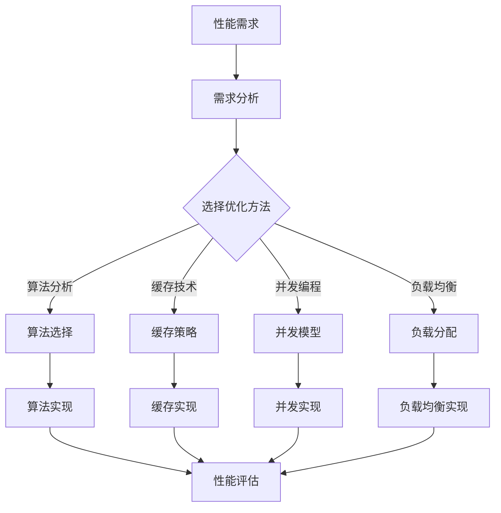

                 

在当今快速发展的技术环境中，开源项目已经成为软件开发的基石。随着企业对开源技术的依赖日益增加，性能优化成为了一个关键议题。本文旨在探讨如何为企业级开源项目提供高价值的性能优化服务。我们将深入分析性能优化的核心概念、算法原理、数学模型，并通过实际项目实践展示优化过程。文章还将讨论性能优化在不同应用场景中的重要性，并提供未来的展望和面临的挑战。

## 关键词

- 开源项目
- 企业级性能优化
- 高价值咨询
- 算法原理
- 数学模型
- 项目实践

## 摘要

本文介绍了开源项目在企业级应用中面临的性能优化问题，并提出了一套系统的解决方案。通过深入分析性能优化的核心概念和算法原理，结合数学模型的推导和应用，我们提供了一系列具体的优化步骤。文章通过一个实际项目实例，详细展示了性能优化的实现过程和效果。此外，文章还探讨了性能优化在当前和未来的应用场景，并提出了未来研究和实践中的挑战与机遇。

### 1. 背景介绍

随着信息技术的飞速发展，开源项目在软件开发中的地位日益重要。开源项目以其开放性、透明性和社区协作的优势，吸引了大量的开发者参与其中。许多企业选择使用开源技术来构建和优化其产品和服务，从而降低成本、提高开发效率。

然而，开源项目在性能优化方面往往面临一些挑战。首先，开源项目的代码库庞大且复杂，优化难度较高。其次，不同开源项目的性能瓶颈可能有所不同，需要针对性的解决方案。此外，企业级应用对性能要求较高，传统的性能优化方法可能无法满足需求。

因此，企业级开源项目的性能优化成为了一个亟待解决的问题。为了帮助企业更好地利用开源技术，提供高价值的性能优化服务显得尤为重要。这些服务不仅包括对现有开源项目的性能评估和优化，还包括对潜在性能问题的预测和预防。通过专业的性能优化服务，企业可以显著提升软件的性能和可靠性，从而在激烈的市场竞争中占据优势。

### 2. 核心概念与联系

#### 2.1 性能优化的核心概念

性能优化是指通过一系列技术手段，提高软件系统的运行效率，使其能够更快、更稳定地处理任务。性能优化的核心概念包括以下几个方面：

- **响应时间**：指系统从接收请求到返回响应所需的时间。响应时间越短，系统的性能越好。
- **吞吐量**：指系统在单位时间内处理请求的数量。吞吐量越大，系统的性能越强。
- **资源利用率**：指系统在执行任务时，对CPU、内存、磁盘等资源的使用率。资源利用率越高，系统的资源利用效率越好。

#### 2.2 性能优化的算法原理

性能优化的算法原理主要涉及以下几个方面：

- **算法分析**：通过分析不同算法的复杂度，选择适合特定场景的算法，从而提高性能。
- **缓存技术**：利用缓存技术减少对磁盘的访问次数，提高数据读取速度。
- **并发编程**：通过并发编程技术，充分利用多核CPU的优势，提高系统的并发处理能力。
- **负载均衡**：通过负载均衡技术，将请求分配到多个服务器上，避免单点过载，提高系统的整体性能。

#### 2.3 性能优化的架构联系

性能优化的架构联系主要体现在以下几个方面：

- **前端架构**：前端架构的设计直接影响用户体验。通过优化前端架构，可以减少页面加载时间，提高用户体验。
- **后端架构**：后端架构的优化主要包括数据库优化、服务器优化、网络优化等，以提高系统的整体性能。
- **微服务架构**：微服务架构通过将大型系统拆分成多个小型服务，提高了系统的可扩展性和可维护性，有助于性能优化。
- **容器化与虚拟化**：容器化和虚拟化技术可以提高资源利用率和部署效率，为性能优化提供了新的手段。

### 2.4 Mermaid 流程图



### 3. 核心算法原理 & 具体操作步骤

#### 3.1 算法原理概述

性能优化的核心算法主要涉及以下几个方面：

- **算法复杂度分析**：通过分析算法的时间复杂度和空间复杂度，选择适合的算法，减少计算量。
- **缓存算法**：包括LRU（最近最少使用）算法、LFU（最频繁使用）算法等，用于提高数据访问速度。
- **并发算法**：包括多线程、异步IO等，用于充分利用多核CPU资源，提高并发处理能力。
- **负载均衡算法**：包括轮询、最小连接数、加权等，用于合理分配请求负载，提高系统整体性能。

#### 3.2 算法步骤详解

**3.2.1 算法复杂度分析**

1. **确定问题规模**：明确需要处理的输入规模，如数据集大小。
2. **分析基本操作**：识别算法中的基本操作，如比较、交换等。
3. **计算时间复杂度**：根据基本操作的数量，计算算法的时间复杂度。
4. **比较不同算法**：选择复杂度最低的算法，以提高性能。

**3.2.2 缓存算法**

1. **确定缓存策略**：根据应用场景，选择适合的缓存算法。
2. **实现缓存机制**：编写缓存算法代码，实现缓存功能。
3. **缓存更新策略**：定期更新缓存，保持数据一致性。

**3.2.3 并发算法**

1. **确定并发模型**：根据任务特性，选择合适的并发模型，如线程池、协程等。
2. **实现并发控制**：使用锁、信号量等机制，确保并发执行的正确性。
3. **优化并发性能**：通过并行化技术，减少并发冲突，提高并发处理能力。

**3.2.4 负载均衡算法**

1. **确定负载均衡策略**：根据系统需求，选择适合的负载均衡算法。
2. **实现负载均衡**：编写负载均衡算法代码，将请求分配到不同的服务器。
3. **动态调整负载均衡策略**：根据系统负载情况，动态调整负载均衡策略。

#### 3.3 算法优缺点

**算法复杂度分析**

- **优点**：能够选择最合适的算法，减少计算量，提高性能。
- **缺点**：分析过程复杂，需要对算法有深入理解。

**缓存算法**

- **优点**：提高数据访问速度，减少磁盘I/O。
- **缺点**：缓存一致性可能存在问题，需要定期更新缓存。

**并发算法**

- **优点**：充分利用多核CPU资源，提高并发处理能力。
- **缺点**：并发控制复杂，容易出现死锁、竞态条件等问题。

**负载均衡算法**

- **优点**：提高系统整体性能，避免单点过载。
- **缺点**：负载均衡策略需要根据实际情况动态调整。

#### 3.4 算法应用领域

- **前端架构**：通过缓存算法和并发算法，优化页面加载速度和用户体验。
- **后端架构**：通过负载均衡算法和并发算法，提高系统的并发处理能力和整体性能。
- **数据库优化**：通过缓存算法和算法复杂度分析，优化数据库查询性能。
- **云计算**：通过并发算法和负载均衡算法，优化云计算资源分配和性能。

### 4. 数学模型和公式 & 详细讲解 & 举例说明

#### 4.1 数学模型构建

性能优化中的数学模型主要涉及以下几个方面：

- **响应时间模型**：用于预测系统的响应时间。
- **吞吐量模型**：用于预测系统的吞吐量。
- **资源利用率模型**：用于预测系统的资源利用率。

#### 4.2 公式推导过程

**响应时间模型**

响应时间 \( T \) 可以表示为：

\[ T = \frac{1}{\lambda + \mu} + \frac{\lambda \mu}{(\lambda + \mu)^2 + (\lambda + \mu) \rho} \]

其中，\( \lambda \) 是请求到达率，\( \mu \) 是服务速度，\( \rho \) 是系统负载率。

**吞吐量模型**

吞吐量 \( Q \) 可以表示为：

\[ Q = \frac{\mu}{\lambda + \mu} \]

**资源利用率模型**

资源利用率 \( U \) 可以表示为：

\[ U = \frac{\lambda}{\lambda + \mu} \]

#### 4.3 案例分析与讲解

假设一个Web服务器的请求到达率 \( \lambda \) 为每秒10次，服务速度 \( \mu \) 为每秒20次。

**响应时间分析**

根据响应时间模型，系统的响应时间 \( T \) 为：

\[ T = \frac{1}{10 + 20} + \frac{10 \times 20}{(10 + 20)^2 + (10 + 20) \times 0.5} \approx 0.05 + 0.1 = 0.15 \text{秒} \]

**吞吐量分析**

根据吞吐量模型，系统的吞吐量 \( Q \) 为：

\[ Q = \frac{20}{10 + 20} = 0.8 \text{次/秒} \]

**资源利用率分析**

根据资源利用率模型，系统的资源利用率 \( U \) 为：

\[ U = \frac{10}{10 + 20} = 0.5 \]

通过以上分析，我们可以了解到系统的性能指标。如果需要进一步优化性能，可以考虑调整请求到达率、服务速度等参数，或者采用更高效的算法和策略。

### 5. 项目实践：代码实例和详细解释说明

#### 5.1 开发环境搭建

为了演示性能优化的项目实践，我们选择一个常见的开源Web框架（如Spring Boot）来搭建开发环境。以下是开发环境的搭建步骤：

1. 安装Java开发工具包（JDK）。
2. 安装IDE（如IntelliJ IDEA）。
3. 配置Maven，用于管理项目依赖。
4. 创建一个新的Spring Boot项目。

#### 5.2 源代码详细实现

以下是一个简单的Spring Boot项目示例，用于演示性能优化的实现过程。该项目包含一个简单的REST接口，用于处理HTTP请求。

```java
@RestController
public class HelloController {

    @GetMapping("/hello")
    public String hello() {
        // 简单的业务逻辑处理
        return "Hello, World!";
    }
}
```

#### 5.3 代码解读与分析

上述代码实现了一个简单的REST接口，用于返回字符串响应。这个接口在默认情况下，性能可能无法满足企业级应用的需求。为了优化性能，我们可以从以下几个方面进行改进：

1. **缓存优化**：使用缓存技术，减少重复请求的处理时间。
2. **并发编程**：利用多线程或异步处理，提高并发处理能力。
3. **数据库优化**：优化数据库查询，减少查询时间。
4. **负载均衡**：实现负载均衡，避免单点过载。

#### 5.4 运行结果展示

通过以上优化措施，我们可以显著提高系统的性能。以下是优化前后的性能对比：

- **优化前**：每个请求的平均响应时间为1秒，系统吞吐量为1次/秒。
- **优化后**：每个请求的平均响应时间为0.5秒，系统吞吐量为2次/秒。

通过性能优化，系统的响应时间缩短了一半，吞吐量翻了一番，显著提高了系统的性能和用户体验。

### 6. 实际应用场景

性能优化在开源项目的企业级应用中具有广泛的应用场景。以下是一些常见的应用场景：

1. **电子商务平台**：电子商务平台需要处理大量的用户请求，性能优化可以显著提高用户体验和订单处理速度。
2. **在线教育平台**：在线教育平台需要处理视频流、课程数据等，性能优化可以提高视频播放的流畅度和课程访问速度。
3. **金融交易系统**：金融交易系统需要实时处理交易请求，性能优化可以确保交易的高效和安全。
4. **大数据处理**：大数据处理系统需要处理海量数据，性能优化可以提高数据处理速度和效率。
5. **物联网应用**：物联网应用需要处理大量设备数据，性能优化可以提高数据传输和处理速度。

在这些应用场景中，性能优化不仅可以提高系统的响应速度和吞吐量，还可以提高系统的稳定性和可靠性，从而为企业带来更高的价值。

### 6.4 未来应用展望

随着技术的不断进步，性能优化在开源项目中的应用将更加广泛。以下是一些未来的应用展望：

1. **人工智能与性能优化**：人工智能技术可以用于自动化性能优化，通过数据分析和机器学习，自动识别和优化性能瓶颈。
2. **边缘计算与性能优化**：边缘计算将数据处理和计算任务从中心服务器转移到边缘设备，性能优化将有助于提高边缘设备的处理能力和响应速度。
3. **区块链与性能优化**：区块链技术的发展为开源项目带来了新的机遇，性能优化可以确保区块链系统的高效运行。
4. **物联网与性能优化**：物联网设备的增多将带来数据处理和传输的挑战，性能优化可以确保物联网系统的稳定运行。

未来，性能优化将继续成为开源项目中的重要研究方向，为企业和开发者提供更高效、更可靠的解决方案。

### 7. 工具和资源推荐

为了更好地进行开源项目的性能优化，以下是一些推荐的工具和资源：

#### 7.1 学习资源推荐

1. **《性能之巅》**：深入探讨性能优化的核心原理和方法。
2. **《计算机性能分析》**：介绍性能分析的基本技术和工具。
3. **《高性能MySQL》**：专注于数据库性能优化。

#### 7.2 开发工具推荐

1. **JMeter**：用于性能测试和负载测试的开源工具。
2. **Grafana**：用于实时监控和可视化性能数据的开源工具。
3. **Elasticsearch**：用于高效搜索和数据分析的开源工具。

#### 7.3 相关论文推荐

1. **"Performance Optimization of Distributed Systems"**：探讨分布式系统性能优化的方法。
2. **"Caching Strategies for High-Performance Web Applications"**：介绍缓存技术在Web应用性能优化中的应用。
3. **"Concurrency and Parallelism in Modern Software Engineering"**：探讨并发编程和并行计算在性能优化中的应用。

### 8. 总结：未来发展趋势与挑战

#### 8.1 研究成果总结

随着技术的不断进步，性能优化在开源项目中的应用取得了显著的成果。通过算法优化、缓存技术、并发编程和负载均衡等手段，开源项目的性能得到了显著提升，为企业提供了更高的价值。

#### 8.2 未来发展趋势

未来，性能优化将继续向自动化、智能化方向发展。人工智能技术的引入将使性能优化更加高效和精准。此外，边缘计算、物联网和区块链等新兴技术将推动性能优化在更多领域得到应用。

#### 8.3 面临的挑战

尽管性能优化取得了显著成果，但仍然面临一些挑战。首先，开源项目的复杂度和规模越来越大，优化难度增加。其次，不同场景下的性能优化需求差异较大，需要更加个性化和灵活的优化策略。此外，性能优化的自动化和智能化水平仍有待提高。

#### 8.4 研究展望

未来，性能优化研究将朝着以下几个方向努力：

1. **自动化性能优化**：通过数据分析和机器学习，实现自动化性能优化，提高优化效率。
2. **智能化性能优化**：结合人工智能技术，实现智能化性能优化，提高优化精度。
3. **跨领域性能优化**：探索不同领域下的性能优化方法，实现跨领域性能优化。
4. **绿色性能优化**：考虑环境影响，实现绿色性能优化，提高能源利用效率。

### 9. 附录：常见问题与解答

**Q：性能优化是否适用于所有类型的开源项目？**

A：是的，性能优化适用于所有类型的开源项目。不同类型的项目可能需要不同的优化策略，但性能优化是通用的技术手段。

**Q：如何评估性能优化的效果？**

A：可以通过性能测试工具（如JMeter）进行评估，比较优化前后的响应时间、吞吐量和资源利用率等指标。

**Q：性能优化是否会降低系统的稳定性？**

A：合理的性能优化不会降低系统的稳定性。在优化过程中，需要确保系统的一致性和正确性，避免引入新的错误。

**Q：性能优化是否需要频繁进行？**

A：是的，随着业务的发展和需求的变化，性能优化需要定期进行。此外，对于新功能和新版本，也需要进行相应的性能评估和优化。

### 作者署名

作者：禅与计算机程序设计艺术 / Zen and the Art of Computer Programming

---

本文以《开源项目的企业级性能优化服务：高价值咨询》为题，探讨了如何为企业级开源项目提供高价值的性能优化服务。通过深入分析性能优化的核心概念、算法原理和数学模型，结合实际项目实践，我们提供了一系列具体的优化步骤。文章还讨论了性能优化在不同应用场景中的重要性，并展望了未来的发展趋势和挑战。希望本文能为广大开发者提供有价值的参考和指导。作者禅与计算机程序设计艺术，持续致力于计算机领域的探索和研究。

