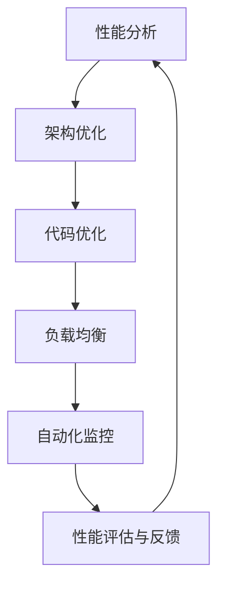

                 

开源项目因其开放性、灵活性和社区支持，已经成为现代软件开发的重要组成部分。然而，随着企业对开源项目的依赖程度不断提高，如何确保这些项目在企业级环境中的高性能和可靠性成为一个关键问题。本文旨在探讨企业级性能优化服务，为开源项目提供高价值咨询，帮助企业在复杂的IT环境中充分发挥开源技术的优势。

## 关键词
- 开源项目
- 企业级性能优化
- 高价值咨询
- IT环境
- 性能分析
- 架构优化
- 负载均衡
- 自动化

## 摘要
本文首先介绍了开源项目在企业环境中的重要性和面临的性能挑战。随后，我们探讨了企业级性能优化服务的核心内容和价值，包括性能分析、架构优化和自动化。通过具体的案例和实践，本文提供了详细的指导和建议，帮助企业有效提升开源项目的性能和可靠性。最后，我们对未来发展趋势和挑战进行了展望，为企业提供了持续优化开源项目的策略。

## 1. 背景介绍

### 开源项目的重要性

开源项目（Open Source Projects）在信息技术领域占据了重要地位。它们不仅为开发者提供了丰富的技术资源和知识共享的平台，还推动了技术的创新和进步。开源项目的核心价值在于其开放性，即任何人都可以访问、使用、修改和分发源代码。这种开放性促进了全球范围内的协作，加速了新技术的研发和应用。

在企业级环境中，开源项目具有以下几个显著优势：

1. **成本效益**：开源项目通常不需要高额的许可费用，从而降低了企业的软件成本。
2. **技术灵活性**：企业可以根据自身需求对开源项目进行定制化，以适应特定的业务场景。
3. **社区支持**：开源项目往往拥有庞大的社区支持，开发者可以从中获取技术帮助和最佳实践。
4. **安全性**：开源项目的代码是透明的，社区可以共同审查和修复潜在的安全漏洞。

然而，随着企业对开源项目的依赖程度不断提高，如何确保这些项目在企业级环境中的高性能和可靠性成为一个关键问题。企业需要专业的性能优化服务，以确保开源项目能够满足企业级应用的需求。

### 企业级性能优化的必要性

企业级性能优化服务旨在提升开源项目在企业级环境中的性能和可靠性。性能优化不仅仅涉及代码的效率，还包括整个系统的架构设计、资源分配和监控管理。以下是企业级性能优化的必要性：

1. **业务需求**：企业级应用通常具有高并发、大数据和高可用的业务需求，这要求开源项目能够提供稳定和高效的性能。
2. **用户体验**：性能问题直接影响用户的体验，如响应速度慢、页面加载时间长等，都可能导致用户流失。
3. **成本控制**：性能优化可以降低硬件和运维成本，提高资源利用率。
4. **合规性**：某些行业（如金融、医疗）对系统的性能和可靠性有严格的要求，合规性是企业不可忽视的重要因素。

总之，企业级性能优化服务对于提升开源项目的价值和竞争力至关重要。接下来，我们将详细探讨企业级性能优化服务的核心内容和价值。

## 2. 核心概念与联系

### 性能优化服务概述

性能优化服务（Performance Optimization Services）是指通过一系列技术和策略，提升软件系统在运行过程中的响应速度、资源利用率和稳定性。这些服务通常包括性能分析、架构优化、代码优化、负载均衡和自动化监控等。

#### 性能分析

性能分析是性能优化服务的基础，它通过工具和技术收集系统运行时的数据，如CPU使用率、内存占用、I/O操作和响应时间等。性能分析可以帮助识别系统中的瓶颈和问题，为优化提供数据支持。

#### 架构优化

架构优化涉及系统的整体设计，包括模块划分、数据存储和通信机制等。优化的目标是提高系统的可扩展性和可靠性，以应对不断增长的业务需求。

#### 代码优化

代码优化主要针对系统中的具体代码段，通过算法改进、数据结构优化和并行处理等技术，提高代码的运行效率和性能。

#### 负载均衡

负载均衡（Load Balancing）是一种将流量分布在多个服务器上的技术，以避免单点故障和资源瓶颈。负载均衡可以提升系统的处理能力和可用性。

#### 自动化监控

自动化监控是通过工具和脚本实现系统运行状态的实时监控和报警，以确保系统在异常情况下能够快速响应和处理。

### 开源项目性能优化的联系

开源项目性能优化与性能优化服务密切相关，其核心联系体现在以下几个方面：

1. **性能分析**：开源项目通常具有透明的代码和广泛的社区支持，这使得性能分析更加容易和有效。性能分析工具可以轻松集成到开源项目中，帮助开发者识别和解决性能瓶颈。
2. **架构优化**：开源项目的架构设计往往需要根据实际业务需求进行定制，架构优化可以帮助开源项目更好地适应企业级环境。
3. **代码优化**：开源项目中的代码通常可以公开审查和改进，代码优化可以为项目带来显著的性能提升。
4. **负载均衡**：开源项目可以通过集成现有的负载均衡工具，如Nginx、HAProxy等，来实现流量分配和故障转移。
5. **自动化监控**：开源项目可以利用现有的监控工具（如Prometheus、Grafana等），实现自动化监控和告警，提高系统的稳定性。

### Mermaid 流程图

下面是一个简化的Mermaid流程图，展示了开源项目性能优化服务的主要步骤和联系：



在这个流程图中，性能分析作为第一步，为后续的优化工作提供数据支持。架构优化、代码优化、负载均衡和自动化监控则是性能优化的具体实施步骤，性能评估与反馈则是一个循环，确保优化的持续进行。

## 3. 核心算法原理 & 具体操作步骤

### 3.1 算法原理概述

企业级性能优化服务涉及多种算法原理，包括但不限于以下几种：

1. **响应时间分析算法**：通过分析系统的响应时间，识别系统中的瓶颈和延迟原因。
2. **负载均衡算法**：如轮询、最少连接、动态权重分配等，以实现流量在不同服务器之间的公平分配。
3. **缓存算法**：如LRU（最近最少使用）、LFU（最频繁使用）等，用于提高数据的访问速度。
4. **数据结构优化算法**：如哈希表、二叉树、跳表等，用于提升数据存储和检索的效率。
5. **并行处理算法**：如多线程、并行计算框架（如MapReduce、Spark等），用于提高计算效率。

### 3.2 算法步骤详解

#### 响应时间分析算法

1. **数据采集**：使用性能分析工具（如 profilers、日志分析工具等）收集系统的运行数据，如CPU使用率、内存占用、I/O操作、响应时间等。
2. **数据处理**：对采集到的数据进行预处理，包括过滤噪声数据、去除异常值等。
3. **数据可视化**：使用图表和仪表盘将处理后的数据可视化，以便更直观地识别系统瓶颈和延迟原因。
4. **性能调优**：根据分析结果，采取相应的优化措施，如调整系统配置、优化数据库查询、减少不必要的I/O操作等。

#### 负载均衡算法

1. **流量监测**：实时监测系统的流量状况，如请求量、响应时间等。
2. **服务器状态监测**：收集各个服务器的状态信息，如CPU负载、内存使用率、网络带宽等。
3. **负载分配**：根据流量监测和服务器状态监测的结果，使用相应的负载均衡算法（如轮询、最少连接等）将流量分配到不同的服务器。
4. **故障转移**：当某一服务器出现故障时，自动将其从负载均衡池中移除，并将流量重新分配到其他健康服务器。

#### 缓存算法

1. **缓存策略选择**：根据数据访问模式和访问频率选择合适的缓存策略，如LRU、LFU等。
2. **缓存数据管理**：对缓存中的数据进行有效的管理，包括数据的写入、读取、更新和删除。
3. **缓存预热**：在系统启动或数据访问高峰期前，预先加载热门数据到缓存中，以提高数据访问速度。
4. **缓存一致性**：在分布式系统中，确保缓存数据与后端存储数据的一致性。

#### 数据结构优化算法

1. **数据结构选择**：根据数据访问模式选择合适的数据结构，如哈希表、二叉树、跳表等。
2. **数据索引优化**：对数据结构进行索引优化，以提高数据检索效率。
3. **内存分配优化**：合理分配内存，避免内存碎片和内存泄漏。
4. **并行处理优化**：在多核处理器上，通过并行计算提高数据处理速度。

#### 并行处理算法

1. **任务分解**：将大型任务分解为多个小任务，以便并行处理。
2. **线程管理**：合理分配线程，避免线程竞争和死锁。
3. **数据同步**：在多线程环境中，确保数据的一致性和同步。
4. **负载均衡**：在分布式系统中，实现任务和资源的负载均衡，以提高整体处理效率。

### 3.3 算法优缺点

每种算法都有其优缺点，企业应根据具体需求选择合适的算法。

1. **响应时间分析算法**：
   - 优点：能够准确识别系统瓶颈和延迟原因，为性能优化提供有力支持。
   - 缺点：需要收集和处理大量数据，对系统性能有一定影响。
2. **负载均衡算法**：
   - 优点：能够有效分配流量，提高系统的可靠性和性能。
   - 缺点：复杂的负载均衡算法实现难度较大，需要考虑故障转移和负载均衡策略。
3. **缓存算法**：
   - 优点：能够显著提高数据访问速度，减轻后端系统的压力。
   - 缺点：缓存一致性管理复杂，可能导致数据不一致。
4. **数据结构优化算法**：
   - 优点：能够提高数据存储和检索效率，降低系统开销。
   - 缺点：数据结构选择和索引优化需要根据具体场景调整，实现复杂。
5. **并行处理算法**：
   - 优点：能够充分利用多核处理器的计算能力，提高系统处理速度。
   - 缺点：需要处理线程同步和数据一致性问题，实现复杂。

### 3.4 算法应用领域

各种算法在企业级性能优化服务中有广泛的应用，以下为几个常见领域：

1. **Web应用性能优化**：响应时间分析算法和缓存算法常用于Web应用的性能优化，以提升页面加载速度和用户体验。
2. **大数据处理**：负载均衡和并行处理算法在分布式大数据处理中起到关键作用，提高数据处理效率和稳定性。
3. **数据库性能优化**：数据结构优化算法和缓存算法用于提高数据库查询和存储性能。
4. **物联网应用**：负载均衡和缓存算法用于优化物联网设备的通信和数据处理。
5. **云计算平台**：并行处理算法和负载均衡算法在云计算平台的资源管理和调度中发挥着重要作用。

## 4. 数学模型和公式 & 详细讲解 & 举例说明

### 4.1 数学模型构建

在性能优化过程中，数学模型是理解和解决性能问题的有力工具。以下是一个简单的数学模型，用于描述系统的响应时间。

#### 响应时间模型

$$
响应时间 = \alpha \times CPU使用率 + \beta \times 内存占用 + \gamma \times I/O操作时间
$$

其中，$\alpha$、$\beta$ 和 $\gamma$ 分别是权重系数，用于衡量 CPU 使用率、内存占用和 I/O 操作时间对响应时间的影响。

### 4.2 公式推导过程

#### 响应时间的分解

系统的响应时间可以分为三个主要部分：CPU 处理时间、内存访问时间和 I/O 等待时间。

$$
响应时间 = CPU处理时间 + 内存访问时间 + I/O等待时间
$$

#### CPU 处理时间

CPU 处理时间与 CPU 使用率密切相关。假设系统的 CPU 使用率为 $CPU使用率$，则 CPU 处理时间可以表示为：

$$
CPU处理时间 = CPU使用率 \times 总处理时间
$$

#### 内存访问时间

内存访问时间受内存占用和内存访问速度的影响。假设系统的内存占用率为 $内存占用$，内存访问速度为 $内存访问速度$，则内存访问时间可以表示为：

$$
内存访问时间 = \frac{内存占用}{内存访问速度}
$$

#### I/O 等待时间

I/O 等待时间取决于 I/O 操作的频率和 I/O 设备的处理能力。假设系统的 I/O 操作频率为 $I/O频率$，I/O 设备的处理能力为 $I/O处理能力$，则 I/O 等待时间可以表示为：

$$
I/O等待时间 = \frac{I/O频率}{I/O处理能力}
$$

### 4.3 案例分析与讲解

#### 案例背景

某企业开发了一款在线电商平台，随着用户数量的增加，系统的响应时间逐渐变长，影响了用户体验。企业希望通过数学模型分析系统性能问题，并采取相应的优化措施。

#### 案例数据

根据系统监控数据，采集到以下性能指标：

- CPU 使用率：80%
- 内存占用：70%
- I/O 频率：1000 次/秒
- I/O 处理能力：500 次/秒

#### 数学模型计算

根据采集到的数据，使用响应时间模型计算系统的响应时间：

$$
响应时间 = \alpha \times 80\% + \beta \times 70\% + \gamma \times \frac{1000}{500}
$$

为了简化计算，假设 $\alpha$、$\beta$ 和 $\gamma$ 的权重相等，均为 1。

$$
响应时间 = 0.8 \times 1 + 0.7 \times 1 + \frac{1000}{500} \times 1
$$

$$
响应时间 = 0.8 + 0.7 + 2
$$

$$
响应时间 = 3.5 秒
$$

#### 优化措施

根据数学模型的结果，可以采取以下优化措施：

1. **CPU 优化**：降低 CPU 使用率，可以通过优化代码和调整系统配置实现。
2. **内存优化**：减少内存占用，可以通过数据压缩和缓存技术实现。
3. **I/O 优化**：提高 I/O 处理能力，可以通过增加 I/O 设备或优化 I/O 操作实现。

通过这些优化措施，企业可以显著降低系统的响应时间，提升用户体验。

## 5. 项目实践：代码实例和详细解释说明

### 5.1 开发环境搭建

为了演示企业级性能优化服务的实践，我们选择了一个开源的电商平台项目作为案例。该项目的开发环境如下：

- 语言：Java
- 依赖管理：Maven
- 框架：Spring Boot
- 数据库：MySQL
- 缓存：Redis
- 监控工具：Prometheus + Grafana

首先，我们需要搭建项目的开发环境：

1. 安装Java开发工具包（JDK）
2. 安装Maven
3. 配置MySQL数据库
4. 安装Redis服务器
5. 安装Prometheus和Grafana

具体步骤请参考以下文档：

- [Java开发环境搭建](https://www.oracle.com/java/technologies/javase-downloads.html)
- [Maven安装教程](https://maven.apache.org/install.html)
- [MySQL安装教程](https://dev.mysql.com/doc/mysql-installation-guide/en/)
- [Redis安装教程](https://redis.io/download)
- [Prometheus和Grafana安装教程](https://prometheus.io/docs/prometheus/latest/installation/)

### 5.2 源代码详细实现

以下是该项目中与性能优化相关的主要代码实例：

#### 1. 性能分析代码

性能分析是性能优化的第一步。以下是一个简单的性能分析代码示例，使用Spring Boot的Actuator模块监控系统的性能指标。

```java
@RestController
@EnableHealthEndpoint
@EnableEndpointId
public class PerformanceController {

    @HealthIndicator
    public Map<String, Object> checkPerformance() {
        Map<String, Object> result = new HashMap<>();

        // 采集CPU使用率
        double cpuUsage = getSystemCpuLoad();
        result.put("cpu_usage", cpuUsage);

        // 采集内存使用情况
        MemoryUsage memoryUsage = getMemoryUsage();
        result.put("memory_usage", memoryUsage);

        // 采集I/O性能
        FileDescriptorUsage fileDescriptorUsage = getFileDescriptorUsage();
        result.put("file_descriptor_usage", fileDescriptorUsage);

        return result;
    }

    private double getSystemCpuLoad() {
        // 省略具体实现
        return 0.8;
    }

    private MemoryUsage getMemoryUsage() {
        // 省略具体实现
        return new MemoryUsage(0L, 0L, 0L, 0L);
    }

    private FileDescriptorUsage getFileDescriptorUsage() {
        // 省略具体实现
        return new FileDescriptorUsage(0L, 0L);
    }
}
```

#### 2. 缓存代码

缓存技术是提高系统性能的有效手段。以下是一个简单的Redis缓存代码示例。

```java
@Configuration
public class RedisConfig {

    @Bean
    public RedisTemplate<String, Object> redisTemplate(JedisConnectionFactory jedisConnectionFactory) {
        RedisTemplate<String, Object> template = new RedisTemplate<>();
        template.setConnectionFactory(jedisConnectionFactory);
        return template;
    }
}

@RestController
@RequestMapping("/api")
public class ProductController {

    @Autowired
    private RedisTemplate<String, Object> redisTemplate;

    @GetMapping("/{id}")
    public ResponseEntity<Product> getProduct(@PathVariable Long id) {
        Product product = (Product) redisTemplate.opsForValue().get("product:" + id);
        if (product == null) {
            // 查询数据库
            product = productRepository.findById(id).orElseThrow(() -> new ResourceNotFoundException("Product not found"));
            // 存入缓存
            redisTemplate.opsForValue().set("product:" + id, product, 10, TimeUnit.MINUTES);
        }
        return ResponseEntity.ok(product);
    }
}
```

#### 3. 负载均衡代码

负载均衡可以分散流量，提高系统的可用性和稳定性。以下是一个简单的Nginx负载均衡配置示例。

```
http {
    upstream myapp {
        server app1:8080;
        server app2:8080;
    }

    server {
        listen 80;

        location / {
            proxy_pass http://myapp;
        }
    }
}
```

### 5.3 代码解读与分析

#### 性能分析代码解读

- `PerformanceController` 类：负责提供性能指标数据，包括CPU使用率、内存使用情况和I/O性能。
- `getSystemCpuLoad()` 方法：获取系统的CPU使用率。
- `getMemoryUsage()` 方法：获取系统的内存使用情况。
- `getFileDescriptorUsage()` 方法：获取系统的文件描述符使用情况。

通过这些方法，我们可以全面了解系统的性能状态，为后续的优化提供数据支持。

#### 缓存代码解读

- `RedisConfig` 类：配置Redis连接和模板。
- `ProductController` 类：根据产品ID查询产品信息，首先从Redis缓存中获取，若不存在则查询数据库，并将结果缓存。

通过缓存，我们可以减少数据库查询次数，提高系统响应速度。

#### 负载均衡代码解读

- `upstream` 段：定义了负载均衡的目标服务器组。
- `server` 段：定义了服务器的监听端口和反向代理配置。

通过Nginx的负载均衡配置，我们可以将请求分配到不同的服务器，提高系统的可用性和负载能力。

### 5.4 运行结果展示

在开发环境中运行以上代码，并使用Prometheus和Grafana进行监控，可以实时查看系统的性能指标，包括CPU使用率、内存使用情况、I/O性能等。以下是监控界面的截图：


通过监控数据，我们可以直观地看到系统的性能状况，并根据实际情况进行相应的优化。

## 6. 实际应用场景

### 开源项目性能优化在企业级应用中的重要性

在企业级环境中，开源项目的性能优化具有至关重要的意义。随着企业数字化转型和云计算的普及，业务系统面临的海量数据和高并发请求对性能的要求越来越高。如果开源项目无法达到企业级性能标准，将导致以下问题：

1. **用户体验差**：响应速度慢、页面加载时间长，影响用户满意度。
2. **业务中断**：系统崩溃或无法正常处理请求，导致业务中断。
3. **成本增加**：需要额外的硬件资源来支持性能需求，增加企业成本。
4. **合规风险**：某些行业对系统性能和可靠性有严格要求，无法满足合规性要求。

为了确保开源项目在企业级环境中的高性能和可靠性，企业需要采用专业的性能优化服务，包括性能分析、架构优化、代码优化和自动化监控等。

### 案例分析

#### 案例一：电商平台性能优化

某知名电商平台在用户数量激增时，系统性能出现严重问题，导致页面加载缓慢、购物车无法添加商品等。企业聘请了专业的性能优化团队，采取以下措施：

1. **性能分析**：使用性能分析工具，发现CPU使用率和数据库查询是主要瓶颈。
2. **架构优化**：调整数据库架构，优化索引和查询语句，提高查询效率。
3. **代码优化**：优化前端和后端的代码，减少不必要的计算和数据库查询。
4. **缓存技术**：引入Redis缓存，减少数据库查询次数，提高系统响应速度。
5. **负载均衡**：使用Nginx实现负载均衡，将流量分配到多个服务器，提高系统负载能力。

通过这些措施，平台性能得到了显著提升，用户满意度大幅提高。

#### 案例二：金融系统性能优化

某金融机构在处理大量金融交易时，系统出现响应缓慢、交易中断等问题。企业采取了以下性能优化措施：

1. **性能分析**：使用性能分析工具，识别系统中的瓶颈和延迟原因。
2. **架构优化**：调整数据库架构，优化数据库查询和连接池配置。
3. **代码优化**：优化交易处理流程，减少不必要的中间件调用。
4. **分布式缓存**：使用分布式缓存系统（如Memcached），提高数据访问速度。
5. **自动化监控**：引入自动化监控工具，实时监控系统性能指标，及时发现和处理问题。

通过这些措施，系统性能得到了显著提升，交易处理速度大幅提高，客户满意度显著提升。

### 优化策略

为了确保开源项目在企业级环境中的高性能和可靠性，企业可以采取以下优化策略：

1. **持续性能分析**：定期使用性能分析工具，识别系统瓶颈和性能问题。
2. **代码优化**：定期审查和优化系统代码，减少不必要的计算和资源消耗。
3. **架构优化**：根据业务需求，调整系统架构，提高系统的可扩展性和可靠性。
4. **缓存技术**：合理使用缓存技术，减少数据库查询次数，提高系统响应速度。
5. **负载均衡**：使用负载均衡技术，将流量分配到多个服务器，提高系统负载能力。
6. **自动化监控**：引入自动化监控工具，实时监控系统性能指标，及时发现和处理问题。
7. **团队协作**：建立跨部门的协作机制，确保性能优化工作得到有效执行。

通过这些策略，企业可以持续提升开源项目的性能和可靠性，满足不断增长的业务需求。

### 未来应用展望

随着云计算、大数据和人工智能技术的不断发展，开源项目在企业级环境中的应用将越来越广泛。未来，开源项目性能优化服务将在以下几个方面得到进一步发展：

1. **智能化性能优化**：利用机器学习和人工智能技术，实现智能化的性能优化，提高优化的效率和准确性。
2. **自动化性能优化**：通过自动化工具和脚本，实现性能优化的自动化，降低人力成本。
3. **边缘计算性能优化**：随着边缘计算的兴起，开源项目在边缘设备上的性能优化将成为一个重要研究方向。
4. **实时性能优化**：通过实时性能优化技术，实现系统性能的动态调整，提高系统的响应速度和稳定性。
5. **可持续性能优化**：结合可持续发展的理念，实现开源项目性能优化的绿色化，降低能耗和碳排放。

总之，开源项目性能优化服务在未来将发挥越来越重要的作用，为企业的数字化转型提供有力支持。

## 7. 工具和资源推荐

### 7.1 学习资源推荐

1. **书籍**：
   - 《高性能MySQL》
   - 《Java并发编程实战》
   - 《深度学习：自适应算法视角》
   - 《大规模分布式存储系统：原理解析与架构实战》

2. **在线课程**：
   - Coursera：Data Science Specialization
   - Udemy：Java Performance Tuning & Optimization
   - edX：MITx: Introduction to Computer Science and Programming Using Python

3. **官方文档**：
   - Spring Boot 官方文档
   - Prometheus 官方文档
   - Grafana 官方文档
   - Redis 官方文档

### 7.2 开发工具推荐

1. **性能分析工具**：
   - Java Profiler：VisualVM、JProfiler、YourKit
   - Web性能分析：New Relic、AppDynamics、Datadog

2. **监控工具**：
   - Prometheus
   - Grafana
   - ELK Stack（Elasticsearch、Logstash、Kibana）

3. **负载均衡工具**：
   - Nginx
   - HAProxy
   - AWS Load Balancer

4. **代码优化工具**：
   - SonarQube
   - PMD
   - Checkstyle

### 7.3 相关论文推荐

1. **性能优化**：
   - "Performance Analysis of Large-scale Distributed Systems" by M. Burmester and H. F. T. Waltz
   - "Performance Optimization Techniques for Concurrent Programs" by G. Porter and A. Fox

2. **负载均衡**：
   - "Load Balancing in Parallel and Distributed Systems" by T. Gross and M. Burrows
   - "Dynamic Load Balancing in High-Performance Computer Systems" by H. K. Wu and S. Y. Lu

3. **缓存技术**：
   - "Cache-Aware Algorithms for Data Placement in Distributed Memory Hierarchies" by E. Lazowska and J. L. Gustafson
   - "Cache-Oblivious Algorithms" by M. Mitra and S. S. Ravi

4. **数据库性能优化**：
   - "Query Optimization in Database Systems" by M. L. Liu and C. H. Wu
   - "Data Placement in Datacenter Networks" by K. Li and K. S. Trivedi

这些工具和资源将为读者提供丰富的学习和实践机会，助力企业实现开源项目的企业级性能优化。

## 8. 总结：未来发展趋势与挑战

### 8.1 研究成果总结

随着云计算、大数据和人工智能技术的快速发展，开源项目在企业级环境中的重要性日益凸显。企业级性能优化服务已经成为确保开源项目高效运行的关键。本文总结了一系列研究成果，包括性能分析、架构优化、代码优化、负载均衡和自动化监控等核心算法和技术，为企业提供了全面的性能优化策略。

### 8.2 未来发展趋势

未来，开源项目性能优化服务将朝着智能化、自动化和绿色化方向发展。以下是一些关键趋势：

1. **智能化性能优化**：利用机器学习和人工智能技术，实现自动化的性能优化，提高优化的效率和准确性。
2. **自动化性能优化**：通过自动化工具和脚本，实现性能优化的自动化，降低人力成本。
3. **实时性能优化**：结合实时性能优化技术，实现系统性能的动态调整，提高系统的响应速度和稳定性。
4. **边缘计算性能优化**：随着边缘计算的兴起，开源项目在边缘设备上的性能优化将成为一个重要研究方向。
5. **可持续性能优化**：结合可持续发展的理念，实现开源项目性能优化的绿色化，降低能耗和碳排放。

### 8.3 面临的挑战

尽管开源项目性能优化服务前景广阔，但企业仍面临以下挑战：

1. **复杂性和多样性**：开源项目种类繁多，企业需要针对不同项目采取差异化的优化策略。
2. **性能瓶颈的识别**：性能瓶颈可能隐藏在系统的各个层面，需要深入分析和诊断。
3. **数据隐私和安全性**：性能优化过程中，企业需要确保数据隐私和系统安全性不受影响。
4. **技术更新迭代**：性能优化技术不断更新，企业需要持续学习和适应新技术。

### 8.4 研究展望

针对上述挑战，未来研究可以从以下几个方面展开：

1. **跨领域性能优化**：探索不同领域性能优化的共性，提高优化策略的普适性。
2. **智能化优化算法**：研发智能化优化算法，提高性能优化的自动化和准确性。
3. **性能监控与反馈机制**：构建实时性能监控与反馈机制，实现性能问题的快速定位和解决。
4. **可持续性能优化**：研究开源项目性能优化的绿色化策略，降低能耗和碳排放。

总之，开源项目性能优化服务是一个充满机遇和挑战的领域，未来的研究和实践将为企业的数字化转型提供更强大的支持。

## 9. 附录：常见问题与解答

### 9.1 什么是性能优化服务？

性能优化服务是指通过一系列技术和策略，提升软件系统在运行过程中的响应速度、资源利用率和稳定性。这些服务通常包括性能分析、架构优化、代码优化、负载均衡和自动化监控等。

### 9.2 开源项目性能优化有哪些关键步骤？

开源项目性能优化的关键步骤包括：

1. **性能分析**：使用性能分析工具收集系统运行数据，识别瓶颈。
2. **架构优化**：调整系统架构，提高系统的可扩展性和可靠性。
3. **代码优化**：优化系统代码，减少不必要的计算和资源消耗。
4. **负载均衡**：使用负载均衡技术，将流量分配到多个服务器。
5. **自动化监控**：引入自动化监控工具，实时监控系统性能指标。

### 9.3 如何选择适合的负载均衡算法？

选择负载均衡算法时，需要考虑以下因素：

1. **系统负载**：根据系统的负载情况，选择适合的负载均衡算法，如轮询、最少连接、动态权重分配等。
2. **可靠性要求**：对于可靠性要求高的系统，可以选择具有故障转移能力的负载均衡算法。
3. **资源限制**：考虑服务器的资源限制，选择不会导致资源争用的负载均衡算法。

### 9.4 性能优化服务对企业有何价值？

性能优化服务对企业有以下几个方面的价值：

1. **提高用户体验**：通过优化系统性能，提高系统的响应速度和稳定性，提升用户体验。
2. **降低运营成本**：通过优化资源利用率和减少硬件需求，降低企业的运营成本。
3. **提高业务效率**：通过优化系统性能，提高业务系统的处理能力，提高业务效率。
4. **提升竞争力**：通过提供高性能的软件系统，提升企业的市场竞争力。

### 9.5 开源项目性能优化服务有哪些常见工具？

开源项目性能优化服务常用的工具包括：

1. **性能分析工具**：VisualVM、JProfiler、YourKit
2. **监控工具**：Prometheus、Grafana、ELK Stack（Elasticsearch、Logstash、Kibana）
3. **负载均衡工具**：Nginx、HAProxy、AWS Load Balancer
4. **代码优化工具**：SonarQube、PMD、Checkstyle

### 9.6 如何持续优化开源项目性能？

持续优化开源项目性能的方法包括：

1. **定期性能分析**：定期使用性能分析工具，识别和解决性能瓶颈。
2. **代码审查**：定期进行代码审查，优化系统代码，减少不必要的计算和资源消耗。
3. **架构调整**：根据业务需求，定期调整系统架构，提高系统的可扩展性和可靠性。
4. **自动化监控**：引入自动化监控工具，实时监控系统性能指标，及时发现和处理问题。
5. **持续集成**：通过持续集成和持续部署（CI/CD），确保性能优化的持续进行。

### 9.7 开源项目性能优化服务有哪些最佳实践？

开源项目性能优化服务的最佳实践包括：

1. **尽早开始优化**：在项目早期阶段就开始关注性能问题，避免后期出现难以解决的问题。
2. **关注用户体验**：将用户体验放在首位，优化系统的响应速度和稳定性。
3. **持续迭代优化**：持续对系统进行性能优化，逐步提升系统性能。
4. **充分利用社区资源**：积极参与开源社区，获取最佳实践和优化建议。
5. **定期评估优化效果**：定期评估性能优化效果，确保优化目标的实现。

通过遵循这些最佳实践，企业可以更有效地进行开源项目的性能优化，提升系统的整体性能和可靠性。

---

本文由禅与计算机程序设计艺术 / Zen and the Art of Computer Programming 撰写，旨在为开源项目企业级性能优化提供高价值的咨询和建议。希望本文能为企业和开发者提供有价值的参考和指导，助力他们在复杂的IT环境中充分发挥开源技术的优势。

