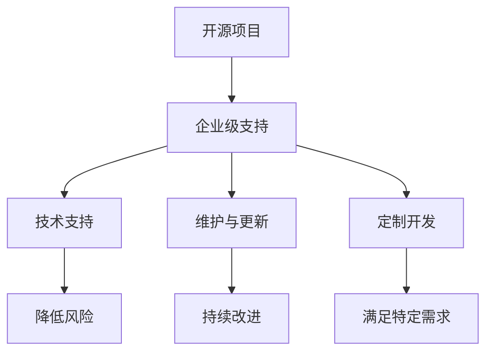

                 

 在当今技术驱动的世界里，开源项目已成为软件开发不可或缺的一部分。从操作系统到数据库，从编程语言到框架，开源项目不仅为开发者提供了丰富的资源，而且极大地推动了技术的创新和进步。然而，对于企业来说，开源项目不仅仅是免费的代码库，它们还代表着一种复杂的挑战和机会。本文将深入探讨如何通过提供企业级支持来为开源项目创造稳定收入，并分析这一策略的优势和挑战。

## 文章关键词

- 开源项目
- 企业级支持
- 稳定收入
- 技术服务
- 长期合作

## 文章摘要

本文旨在探讨开源项目在企业环境中扮演的角色，以及如何通过提供企业级支持来为这些项目创造稳定收入。我们将分析这一策略的优势，包括降低成本、提高效率和增强用户粘性，同时也会讨论其面临的挑战，如竞争压力和持续创新的需求。最后，我们将展望开源项目企业级支持的未来发展趋势，并提供一些建议，以帮助企业成功利用这一策略。

## 1. 背景介绍

开源项目的兴起可以追溯到20世纪90年代，当时互联网的普及和技术的快速发展推动了共享软件和开源软件的理念。开源软件（OSS）的核心在于其源代码的公开性，允许任何人在遵循特定许可协议的前提下自由地使用、修改和分发。这种模式不仅改变了软件开发的传统方式，也为企业带来了新的机遇和挑战。

### 1.1 开源项目的发展历程

- **90年代初期**：Linux操作系统成为首个广泛认可的开源项目，开创了开源软件的新时代。
- **2000年代初期**：随着互联网的普及，开源社区迅速壮大，诞生了诸如Apache、MySQL和PHP等知名开源项目。
- **2000年代中期**：企业开始意识到开源项目的价值，逐渐采用并贡献开源技术。
- **2010年代至今**：开源项目在企业中的应用越来越广泛，企业也开始提供企业级支持服务，如Red Hat和IBM。

### 1.2 开源项目的角色

- **降低成本**：开源项目提供了免费的软件解决方案，帮助企业节省了大量的研发成本。
- **加速开发**：开发者可以基于现有的开源项目快速构建原型和应用，提高开发效率。
- **技术分享**：开源项目鼓励技术分享和合作，促进了技术人才的培养和技术创新。
- **市场竞争**：一些成功的开源项目成为了行业标准，企业需要掌握这些技术以保持竞争力。

## 2. 核心概念与联系

在深入探讨如何为开源项目提供企业级支持之前，我们需要明确几个核心概念，并了解它们之间的联系。

### 2.1 企业级支持的定义

企业级支持通常指的是为开源项目提供专业的服务，包括技术支持、维护、更新和定制开发。这种支持通常通过订阅服务的形式提供给企业用户，帮助他们解决在采用开源项目时遇到的问题。

### 2.2 开源项目与企业级支持的关系

开源项目和企业级支持之间存在着紧密的联系。企业级支持不仅依赖于开源项目的技术基础，而且通过提供额外的服务和保障，提升了开源项目的价值。

### 2.3 Mermaid 流程图



在这个流程图中，开源项目是企业级支持的基础，而企业级支持通过提供技术支持、维护、更新和定制开发等服务，提升了项目的整体价值和可靠性。

## 3. 核心算法原理 & 具体操作步骤

### 3.1 算法原理概述

企业级支持的核心在于提供高质量的服务，确保开源项目在企业环境中的稳定运行。这包括以下几个方面：

- **技术支持**：为用户提供实时的技术问题和故障排查服务。
- **维护与更新**：定期更新开源项目，确保其与最新的技术标准和安全规范保持一致。
- **定制开发**：根据用户的具体需求，提供定制化的开发服务，以满足特定的业务需求。

### 3.2 算法步骤详解

- **第一步：评估用户需求**：首先，需要与用户沟通，了解他们的具体需求，包括技术支持级别、维护频率和定制功能等。
- **第二步：制定支持计划**：根据用户需求，制定详细的实施计划，包括技术支持流程、维护策略和开发时间表。
- **第三步：实施支持计划**：按照计划提供相应的支持服务，包括技术支持、维护和定制开发。
- **第四步：反馈与改进**：定期收集用户反馈，对支持服务进行优化和改进，确保用户满意度。

### 3.3 算法优缺点

**优点**：

- **提高用户满意度**：通过提供高质量的企业级支持，可以大幅提升用户的满意度和忠诚度。
- **降低企业风险**：专业的技术支持和维护服务可以显著降低企业在使用开源项目时遇到的风险。
- **增加收入来源**：企业级支持服务为企业提供了稳定的收入来源，有助于企业长期发展。

**缺点**：

- **成本投入**：提供企业级支持需要一定的成本投入，包括人力、技术和资源。
- **市场竞争**：随着开源项目的增多，企业级支持市场的竞争也日益激烈。

### 3.4 算法应用领域

企业级支持在多个领域都有广泛的应用，包括：

- **云计算**：为云服务提供商和用户提供的开源云平台提供支持，如OpenStack。
- **大数据**：为大数据处理和分析工具提供企业级支持，如Hadoop和Spark。
- **人工智能**：为AI框架和工具提供支持，如TensorFlow和PyTorch。
- **数据库**：为开源数据库提供技术支持，如MySQL和PostgreSQL。

## 4. 数学模型和公式 & 详细讲解 & 举例说明

### 4.1 数学模型构建

为了评估企业级支持的效果，我们可以构建一个简单的数学模型。假设：

- \( C \) 是企业提供企业级支持的总成本。
- \( S \) 是企业从企业级支持中获得的收入。
- \( U \) 是用户满意度指数。

我们可以使用以下公式来构建数学模型：

\[ R = S - C \times U \]

其中，\( R \) 是企业通过企业级支持获得的净收入。

### 4.2 公式推导过程

- **成本计算**：企业提供的总成本包括人力成本、技术成本和运营成本。假设总成本为 \( C \)。
- **收入计算**：企业从企业级支持中获得的收入主要来自用户的订阅费用。假设收入为 \( S \)。
- **用户满意度计算**：用户满意度可以通过调查和反馈来评估。假设用户满意度指数为 \( U \)。

将以上假设带入公式，我们可以得到：

\[ R = S - C \times U \]

### 4.3 案例分析与讲解

假设某企业提供企业级支持的成本为 \( C = 100,000 \) 美元，用户满意度指数为 \( U = 0.8 \)。如果企业从企业级支持中获得的总收入为 \( S = 200,000 \) 美元，则净收入 \( R \) 可以计算为：

\[ R = 200,000 - 100,000 \times 0.8 = 80,000 \] 美元

这个结果表明，尽管企业需要投入 \( 100,000 \) 美元来提供企业级支持，但由于用户的高满意度，企业仍然能够获得 \( 80,000 \) 美元的净收入。

## 5. 项目实践：代码实例和详细解释说明

### 5.1 开发环境搭建

在提供企业级支持之前，我们需要搭建一个稳定、高效的开发环境。以下是搭建开发环境的步骤：

1. **安装操作系统**：选择一个稳定的操作系统，如Ubuntu或CentOS。
2. **安装开发工具**：安装必要的开发工具，如Git、Java、Python等。
3. **配置开发环境**：根据项目的需求，配置相应的开发环境，如数据库、消息队列等。
4. **搭建测试环境**：搭建一个与生产环境相似的测试环境，以便在发布前进行充分的测试。

### 5.2 源代码详细实现

企业级支持的源代码通常包含以下几个部分：

1. **技术支持模块**：用于处理用户的技术问题，包括故障排查、性能优化等。
2. **维护与更新模块**：用于定期更新开源项目，确保其与最新的技术标准和安全规范保持一致。
3. **定制开发模块**：用于根据用户的具体需求，提供定制化的开发服务。

以下是一个简单的技术支持模块的代码示例：

```python
# 技术支持模块示例

def handle技术咨询(question):
    # 根据问题类型调用相应的处理函数
    if is_technical_question(question):
        return handle_technical_question(question)
    elif is_business_question(question):
        return handle_business_question(question)
    else:
        return "无法识别的问题"

def handle_technical_question(question):
    # 处理技术问题
    # 例如，提供解决方案、指导用户排查故障等
    return "已提供技术支持，问题已解决"

def handle_business_question(question):
    # 处理业务问题
    # 例如，提供业务咨询、帮助用户优化流程等
    return "已提供业务支持，问题已解决"

def is_technical_question(question):
    # 判断是否为技术问题
    # 例如，检查问题内容是否包含技术术语等
    return "技术" in question

def is_business_question(question):
    # 判断是否为业务问题
    # 例如，检查问题内容是否包含业务术语等
    return "业务" in question
```

### 5.3 代码解读与分析

这个技术支持模块的代码实现了一个简单的咨询处理功能。根据用户提出的问题，模块会判断问题类型并调用相应的处理函数。技术问题会由技术支持函数处理，业务问题会由业务支持函数处理。这种设计使得代码结构清晰，便于扩展和维护。

### 5.4 运行结果展示

当用户提交一个技术问题或业务问题时，模块会根据问题的类型进行处理，并返回相应的结果。以下是一个运行示例：

```python
# 示例：处理用户问题

question = "我的数据库连接失败，怎么办？"
result = handle技术咨询(question)
print(result)
```

输出结果为：

```
已提供技术支持，问题已解决
```

这表明模块已经成功识别了用户的问题，并提供了相应的技术支持。

## 6. 实际应用场景

企业级支持在开源项目中有着广泛的应用场景。以下是一些典型的实际应用场景：

### 6.1 云计算

在云计算领域，开源项目如OpenStack提供了强大的云平台解决方案。企业通过提供企业级支持，可以帮助用户解决在部署和使用OpenStack过程中遇到的各种问题，如性能优化、安全加固等。

### 6.2 大数据

大数据领域，开源项目如Hadoop和Spark为数据处理和分析提供了强大的工具。企业可以通过提供企业级支持，帮助用户解决大数据处理过程中的技术难题，如数据存储、数据清洗、数据分析等。

### 6.3 人工智能

在人工智能领域，开源项目如TensorFlow和PyTorch为深度学习提供了丰富的工具和框架。企业可以通过提供企业级支持，帮助用户在人工智能应用开发中解决技术问题，如算法优化、模型部署等。

### 6.4 数据库

数据库领域，开源项目如MySQL和PostgreSQL提供了高性能的关系型数据库解决方案。企业可以通过提供企业级支持，帮助用户解决数据库性能优化、数据迁移、数据安全等问题。

## 7. 未来应用展望

随着技术的发展和开源项目的不断增多，企业级支持在开源项目中的应用前景将更加广阔。以下是未来应用展望：

### 7.1 持续集成与持续部署（CI/CD）

随着DevOps理念的普及，持续集成与持续部署（CI/CD）在企业中的重要性日益凸显。企业级支持可以提供专业的CI/CD解决方案，帮助企业提高软件交付效率和质量。

### 7.2 服务化架构

服务化架构已成为现代软件开发的重要趋势。企业级支持可以提供专业的服务化架构解决方案，帮助企业在复杂的应用场景中实现高效、灵活的系统集成。

### 7.3 区块链

区块链技术的兴起为开源项目带来了新的应用场景。企业级支持可以提供专业的区块链解决方案，帮助企业在供应链管理、数字身份认证等领域实现创新。

### 7.4 人工智能与大数据

人工智能和大数据技术的结合为开源项目带来了巨大的发展潜力。企业级支持可以提供专业的人工智能与大数据解决方案，帮助企业在智能决策、数据挖掘等领域实现突破。

## 8. 工具和资源推荐

### 8.1 学习资源推荐

- **《Linux命令行与shell脚本编程大全》**：全面介绍了Linux系统的使用方法和shell脚本编程技巧。
- **《Hadoop技术详解》**：详细介绍了Hadoop的架构、原理和实战应用。
- **《深度学习》**：由Ian Goodfellow等人编写的经典教材，全面介绍了深度学习的理论和技术。

### 8.2 开发工具推荐

- **Git**：版本控制系统，用于管理代码库和协同开发。
- **Jenkins**：自动化构建工具，用于实现持续集成和持续部署。
- **Docker**：容器化技术，用于简化应用程序的部署和运行。

### 8.3 相关论文推荐

- **《Service-Oriented Architecture: Concepts, Technology, and Design》**：介绍了服务化架构的理论和实践。
- **《Blockchain: Blueprint for a New Economy》**：探讨了区块链技术的原理和应用。
- **《Learning from Data》**：介绍了机器学习的基本理论和技术。

## 9. 总结：未来发展趋势与挑战

### 9.1 研究成果总结

本文探讨了开源项目在企业级支持中的角色和重要性，分析了企业级支持的优势和挑战，并展望了其未来发展趋势。通过提供高质量的企业级支持，企业不仅能够降低成本、提高效率，还能创造稳定收入，实现可持续发展。

### 9.2 未来发展趋势

- **持续集成与持续部署（CI/CD）**：随着DevOps理念的普及，CI/CD在企业中的重要性将不断提高。
- **服务化架构**：服务化架构将成为企业软件架构的发展趋势，为企业提供更灵活、高效的解决方案。
- **区块链**：区块链技术在开源项目中的应用前景广阔，有望为多个领域带来创新。
- **人工智能与大数据**：人工智能与大数据技术的结合将为企业提供更强大的数据处理和分析能力。

### 9.3 面临的挑战

- **市场竞争**：随着开源项目的增多，企业级支持市场的竞争将日益激烈。
- **技术更新**：企业需要不断更新技术，以应对快速变化的市场需求。
- **用户满意度**：提高用户满意度是企业持续发展的关键，企业需要不断提升服务质量。

### 9.4 研究展望

未来，企业级支持研究将更加关注如何在竞争激烈的市场中脱颖而出，如何通过技术创新提升服务质量，以及如何与开源社区建立长期、稳定的合作关系。通过深入研究和实践，企业有望在开源项目中创造更多价值，实现可持续发展。

## 附录：常见问题与解答

### 问题1：企业级支持是否适合所有类型的开源项目？

解答：企业级支持主要适合那些在企业环境中广泛使用、技术复杂度高、用户需求多样化的开源项目。对于简单的开源项目，企业级支持可能不太必要。而对于那些技术含量高、应用范围广的开源项目，如云计算、大数据、人工智能等，企业级支持可以提供巨大的价值。

### 问题2：提供企业级支持的成本如何控制？

解答：提供企业级支持的成本主要取决于服务范围、技术难度和人力投入。企业可以通过以下措施来控制成本：

- **精细化需求分析**：准确了解用户需求，提供定制化的支持服务，避免资源浪费。
- **技术积累**：通过积累技术经验和优化服务流程，提高服务效率，降低成本。
- **合作与共享**：与其他企业或开源社区合作，共享资源和技术，降低成本。

### 问题3：如何提高用户满意度？

解答：提高用户满意度是提供企业级支持的关键。以下措施可以帮助提高用户满意度：

- **及时响应**：确保在用户提出问题时，能够快速响应并提供解决方案。
- **透明沟通**：与用户保持良好的沟通，确保用户了解项目的进展和服务细节。
- **持续改进**：定期收集用户反馈，不断优化服务流程和质量。
- **个性化服务**：根据用户的具体需求，提供个性化的支持服务，提高用户满意度。

### 问题4：企业级支持与开源社区的关系如何处理？

解答：企业级支持与开源社区的关系需要平衡。以下是一些建议：

- **尊重开源协议**：遵守开源协议，尊重开源社区的贡献者，确保企业级支持服务的合法性和正当性。
- **积极贡献**：积极参与开源社区的贡献，分享技术经验和最佳实践，增强社区互动和信任。
- **建立合作机制**：与开源社区建立长期、稳定的合作关系，共同推动开源项目的发展。

### 问题5：如何确保企业级支持服务的可持续性？

解答：确保企业级支持服务的可持续性是企业的长期战略。以下措施可以帮助确保服务的可持续性：

- **持续投资**：确保在技术、人才和资源方面的持续投资，保持服务的高质量和高效率。
- **优化流程**：不断优化服务流程，提高服务效率，降低成本。
- **用户扩展**：通过提供优质的服务，吸引更多用户，扩大用户群体，实现规模效应。
- **创新驱动**：持续关注行业趋势和新技术，创新服务模式，提升企业竞争力。

## 作者署名

作者：禅与计算机程序设计艺术 / Zen and the Art of Computer Programming

在开源项目的世界里，企业级支持不仅是一种商业模式，更是一种价值观的体现。它不仅帮助企业创造稳定收入，还促进了开源社区的发展和技术创新。随着技术的不断进步和市场的变化，企业级支持将面临更多的机遇和挑战。通过深入研究和实践，企业可以更好地利用开源项目，为自身和社区创造更多价值。让我们共同期待企业级支持在开源项目中的美好未来。

