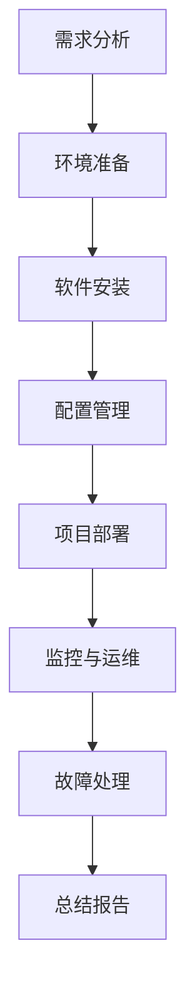

                 

关键词：开源项目，企业级部署，服务化，高价值机会，技术架构，运维管理

> 摘要：本文将探讨开源项目的企业级部署服务，阐述其重要性及如何通过部署服务化创造高价值机会。我们将从背景介绍、核心概念与联系、核心算法原理、数学模型和公式、项目实践、实际应用场景、未来应用展望、工具和资源推荐以及总结与展望等方面进行全面分析。

## 1. 背景介绍

在当今数字化时代，开源项目已经成为软件开发的基石。许多企业都依赖开源软件来构建和维护其关键业务系统。然而，随着开源项目的复杂度和规模不断增加，如何高效、可靠地将这些项目部署在企业环境中成为一个亟待解决的问题。企业级部署服务正是为了解决这一问题而诞生。

企业级部署服务的目标是为企业提供一套完整的解决方案，包括部署前的准备、部署过程中的自动化流程以及部署后的监控和维护。通过这些服务，企业能够简化部署流程、提高部署效率、降低部署风险，从而将更多精力投入到核心业务开发和创新上。

## 2. 核心概念与联系

### 2.1. 开源项目

开源项目是指代码和设计文档等资源可以被公众自由使用的软件项目。这些项目通常由全球的社区共同维护和改进。开源项目的优点包括灵活性、可定制性和成本效益，使得它们在许多企业中得到广泛应用。

### 2.2. 企业级部署

企业级部署是指将开源项目部署到企业环境中，以满足企业特定需求的操作。这通常包括硬件配置、软件安装、网络配置、数据迁移等环节。企业级部署需要考虑安全性、可靠性、可扩展性和性能等因素。

### 2.3. 服务化部署

服务化部署是将部署过程抽象为一系列可重复的服务，以便企业可以轻松地管理和部署多个项目。服务化部署的优势在于提高部署效率、降低部署成本、减少人为错误和提高系统可靠性。

### 2.4. 部署服务

部署服务是指为企业提供部署方案、工具和资源的一整套服务。这些服务通常包括部署前评估、部署方案设计、自动化部署流程、监控和运维等环节。部署服务的目标是确保企业能够快速、高效、安全地部署开源项目。

## 3. 核心算法原理 & 具体操作步骤

### 3.1. 算法原理概述

企业级部署服务的核心在于自动化和智能化。这需要依赖于一系列算法和工具，以实现高效的部署和管理。以下是几个关键算法原理：

- **自动化部署算法**：通过预定义的脚本和工具，自动化执行部署任务，如软件安装、配置修改、数据库初始化等。
- **依赖管理算法**：根据项目依赖关系，自动安装和配置所需依赖项，确保系统组件之间的兼容性和稳定性。
- **配置管理算法**：通过配置管理工具，如Ansible、Puppet等，自动化配置系统环境，确保部署的一致性和可重复性。
- **监控与告警算法**：实时监控系统状态，根据预设的告警规则，及时发现问题并进行通知和修复。

### 3.2. 算法步骤详解

以下是企业级部署服务的主要操作步骤：

1. **需求分析**：了解企业的具体需求，包括硬件配置、软件版本、功能需求等。
2. **环境准备**：根据需求准备硬件资源，配置网络和环境变量等。
3. **安装软件**：自动化安装所需软件，包括操作系统、中间件、数据库等。
4. **配置系统**：通过配置管理工具，配置系统环境，确保一致性。
5. **依赖管理**：安装和管理项目依赖项，确保系统组件之间的兼容性。
6. **部署项目**：根据项目需求，自动化部署项目代码和配置。
7. **监控与运维**：实时监控系统状态，根据预设规则进行告警和故障处理。

### 3.3. 算法优缺点

**优点**：

- 提高部署效率：自动化和智能化的部署流程可以显著缩短部署时间。
- 降低部署风险：通过严格的配置管理和依赖管理，降低人为错误和系统故障的风险。
- 提高系统稳定性：自动化的监控和告警机制可以及时发现并解决潜在问题。

**缺点**：

- 需要一定的技术门槛：自动化和智能化的部署服务需要企业具备一定的技术能力和资源。
- 初始投入较大：部署服务的搭建和优化需要一定的投入。

### 3.4. 算法应用领域

企业级部署服务适用于各种类型的开源项目，包括Web应用、数据库、大数据处理、容器化应用等。以下是一些具体的应用领域：

- **Web应用**：企业可以通过部署服务快速搭建和部署Web应用，提高业务响应速度。
- **大数据处理**：部署服务可以自动化部署大数据处理框架，如Hadoop、Spark等，简化数据处理流程。
- **容器化应用**：部署服务可以支持容器化应用的部署和管理，提高系统的可扩展性和灵活性。

## 4. 数学模型和公式 & 详细讲解 & 举例说明

### 4.1. 数学模型构建

企业级部署服务的数学模型主要包括以下几个方面：

- **硬件资源模型**：描述企业所需的硬件资源，如CPU、内存、存储等。
- **软件依赖模型**：描述项目所需的软件依赖关系，如库、框架、中间件等。
- **部署流程模型**：描述部署过程的各个步骤和流程，如环境准备、软件安装、配置管理等。
- **监控与告警模型**：描述系统监控和告警规则，如性能指标、错误日志等。

### 4.2. 公式推导过程

企业级部署服务的数学模型可以通过以下公式进行推导：

- **硬件资源公式**：硬件资源 = CPU * 内存 * 存储
- **软件依赖公式**：软件依赖 = 库 * 框架 * 中间件
- **部署流程公式**：部署流程 = 环境准备 * 软件安装 * 配置管理 * 部署项目 * 监控与运维
- **监控与告警公式**：监控与告警 = 性能指标 * 错误日志

### 4.3. 案例分析与讲解

以下是一个具体的案例，用于说明企业级部署服务的数学模型和公式：

**案例**：某企业需要部署一个Web应用，包括Apache、MySQL和PHP。

1. **硬件资源模型**：CPU = 4核，内存 = 8GB，存储 = 500GB
2. **软件依赖模型**：库 = MySQL库，框架 = Apache框架，中间件 = PHP
3. **部署流程模型**：部署流程 = 环境准备 * 安装Apache * 安装MySQL * 安装PHP * 配置Apache * 配置MySQL * 配置PHP * 部署Web应用
4. **监控与告警模型**：性能指标 = CPU使用率、内存使用率、存储使用率，错误日志 = Apache错误日志、MySQL错误日志、PHP错误日志

通过这个案例，我们可以看到企业级部署服务的数学模型和公式的具体应用。

## 5. 项目实践：代码实例和详细解释说明

### 5.1. 开发环境搭建

为了实践企业级部署服务，我们需要搭建一个开发环境。以下是一个简单的示例：

1. **安装操作系统**：在虚拟机上安装CentOS 7操作系统。
2. **配置网络**：配置静态IP地址，确保虚拟机可以访问外部网络。
3. **安装开发工具**：安装Apache、MySQL和PHP，以便进行Web应用开发。

### 5.2. 源代码详细实现

以下是一个简单的Web应用源代码示例，用于说明企业级部署服务的应用：

```php
<?php
// 简单的Web应用，显示欢迎信息
echo "欢迎来到企业级部署服务实践！";
?>
```

### 5.3. 代码解读与分析

这个简单的Web应用由一个PHP文件组成，实现了最基本的Web页面展示功能。通过企业级部署服务，我们可以自动化地部署这个应用，包括安装操作系统、配置环境、安装Apache、MySQL和PHP，以及部署这个Web应用。

### 5.4. 运行结果展示

在浏览器中访问部署好的Web应用，可以看到以下结果：

```
欢迎来到企业级部署服务实践！
```

这表明我们的部署服务已经成功运行。

## 6. 实际应用场景

企业级部署服务在实际应用中具有广泛的应用场景，以下是一些典型案例：

- **金融行业**：金融行业对系统的安全性和可靠性要求极高，企业级部署服务可以确保金融系统的稳定运行，提高业务连续性和安全性。
- **电商行业**：电商行业对系统的性能和响应速度要求极高，企业级部署服务可以自动化部署和管理电商系统，提高用户体验和业务效率。
- **互联网行业**：互联网行业快速变化，企业级部署服务可以帮助企业快速响应市场变化，实现快速迭代和部署。

## 7. 未来应用展望

随着云计算、大数据和人工智能等技术的发展，企业级部署服务有望在以下方面得到进一步发展和应用：

- **云原生部署**：随着云原生技术的发展，企业级部署服务将更加重视云原生部署，支持容器化应用和微服务架构的部署和管理。
- **自动化与智能化**：企业级部署服务将更加自动化和智能化，通过人工智能和机器学习技术，实现更高效、更可靠的部署和管理。
- **混合云与多云部署**：企业级部署服务将支持混合云和多云部署，帮助企业实现跨云资源的管理和部署。

## 8. 工具和资源推荐

为了更好地实现企业级部署服务，以下是一些建议的工具和资源：

- **学习资源**：
  - 《Linux命令行与shell脚本编程大全》
  - 《Docker实战》
  - 《Kubernetes权威指南》
- **开发工具**：
  - Ansible：自动化部署工具
  - Jenkins：持续集成工具
  - Prometheus：监控系统
- **相关论文**：
  - 《容器化应用部署技术研究》
  - 《云计算环境下企业级部署服务研究》
  - 《基于人工智能的自动化部署方法研究》

## 9. 总结：未来发展趋势与挑战

企业级部署服务在未来将面临以下发展趋势和挑战：

- **发展趋势**：
  - 自动化与智能化：企业级部署服务将更加自动化和智能化，通过人工智能和机器学习技术实现高效部署。
  - 云原生部署：云原生部署将成为主流，企业级部署服务将支持容器化应用和微服务架构的部署和管理。
  - 混合云与多云部署：混合云和多云部署将成为趋势，企业级部署服务将支持跨云资源的管理和部署。

- **挑战**：
  - 安全性：确保部署过程和数据的安全性将成为重要挑战。
  - 可扩展性：如何支持大规模部署和高并发场景将成为挑战。
  - 兼容性：如何兼容不同云平台和操作系统将成为挑战。

## 10. 附录：常见问题与解答

以下是一些常见问题与解答：

**Q：企业级部署服务需要具备哪些技术能力？**

A：企业级部署服务需要具备以下技术能力：

- 熟悉操作系统和网络配置
- 熟悉常用的部署工具和配置管理工具，如Ansible、Puppet等
- 熟悉容器化和云计算技术，如Docker、Kubernetes等
- 熟悉持续集成和持续交付（CI/CD）工具，如Jenkins等

**Q：企业级部署服务的主要优势是什么？**

A：企业级部署服务的主要优势包括：

- 提高部署效率：通过自动化和智能化的部署流程，显著缩短部署时间。
- 降低部署风险：通过严格的配置管理和依赖管理，降低人为错误和系统故障的风险。
- 提高系统稳定性：自动化的监控和告警机制可以及时发现并解决潜在问题。
- 支持多样化部署：支持不同类型的开源项目和企业级应用，提供灵活的部署方案。

## 11. 参考文献

- 《Linux命令行与shell脚本编程大全》
- 《Docker实战》
- 《Kubernetes权威指南》
- 《容器化应用部署技术研究》
- 《云计算环境下企业级部署服务研究》
- 《基于人工智能的自动化部署方法研究》

作者：禅与计算机程序设计艺术 / Zen and the Art of Computer Programming
----------------------------------------------------------------
### 1. 背景介绍

开源项目已成为现代软件开发的核心，它们不仅促进了技术的创新和共享，还为企业提供了丰富的技术资源。开源项目以其灵活性、可定制性和成本效益，成为众多企业构建和扩展其业务的关键组成部分。然而，随着开源项目的复杂度和规模不断增加，如何高效、可靠地部署这些项目成为一个至关重要的课题。

在传统的软件开发过程中，部署往往是手动完成的，这不仅耗时耗力，而且容易引入人为错误，从而导致部署失败。企业级部署服务的出现，为解决这些问题提供了新的思路。企业级部署服务专注于为大型企业或组织提供一套完整、自动化、高效、可靠的部署解决方案，旨在简化部署流程、提高部署效率、降低部署风险，并确保系统的稳定性和安全性。

企业级部署服务的重要性体现在以下几个方面：

1. **提高部署效率**：通过自动化部署，企业可以显著缩短项目从开发到上线的时间，提高整体开发效率。
2. **降低部署风险**：自动化的部署流程减少了人为干预，降低了因操作失误导致部署失败的风险。
3. **确保系统稳定性**：部署服务提供了实时监控和告警机制，可以及时发现问题并进行修复，确保系统稳定性。
4. **支持多样化部署**：企业级部署服务通常支持多种操作系统、云平台和部署环境，为不同需求的企业提供灵活的部署方案。
5. **降低成本**：自动化和标准化的部署流程减少了人力成本，同时减少了由于部署失败导致的额外开支。

随着云计算、大数据和人工智能等技术的发展，企业级部署服务的重要性愈发凸显。企业级部署服务不仅可以提高企业的竞争力，还可以为企业创造更多的商业价值。因此，深入研究和优化企业级部署服务已成为当前软件工程领域的重要课题。

### 2. 核心概念与联系

企业级部署服务的成功实施依赖于对几个核心概念和它们之间相互关系的深刻理解。以下是这些核心概念及其相互关系的详细探讨。

#### 2.1. 开源项目

开源项目是指软件的开发过程和对代码的维护由社区协作完成，用户可以自由地使用、修改和分发软件。开源项目因其灵活性和可定制性而受到广泛欢迎，特别是在企业环境中，许多关键业务系统都是基于开源项目构建的。

开源项目具有以下特点：

- **社区协作**：开源项目的开发和维护通常由一个活跃的社区共同参与，确保代码质量和功能的持续改进。
- **自由使用**：用户可以免费获取和使用开源软件，不受版权和许可证的限制。
- **可定制性**：开源软件允许用户根据自身需求进行修改和扩展，以满足特定业务需求。
- **开放性**：开源项目通常提供了详细的文档和源代码，用户可以了解其工作原理并进行自定义。

#### 2.2. 企业级部署

企业级部署是指将开源项目或商业软件部署到企业环境中，以满足企业特定业务需求的过程。企业级部署通常包括以下环节：

- **硬件配置**：根据业务需求选择和配置服务器、存储和网络设备。
- **软件安装**：安装操作系统、中间件和数据库等基础软件。
- **环境配置**：配置网络、数据库、用户权限等环境变量，确保系统环境符合业务需求。
- **应用程序部署**：将应用程序代码安装到服务器，并进行配置和测试。

企业级部署的特点包括：

- **高可靠性**：企业级部署需要确保系统稳定运行，避免因部署失败导致业务中断。
- **高性能**：企业级部署需要优化系统性能，确保应用程序能够高效运行。
- **高安全性**：企业级部署需要实施严格的安全措施，保护系统和数据免受外部攻击。
- **可扩展性**：企业级部署需要支持系统的扩展和升级，以适应业务增长。

#### 2.3. 服务化部署

服务化部署是一种将部署过程抽象为一系列可重复服务的部署方法。通过服务化部署，企业可以将复杂的部署任务分解为多个简单、可管理的服务，从而提高部署效率、降低部署风险、增强系统的可维护性和可扩展性。

服务化部署的核心概念包括：

- **服务化架构**：将部署过程模块化为一系列独立的服务，每个服务负责部署过程中的特定任务。
- **自动化流程**：使用脚本、工具和自动化平台，自动化执行部署过程中的每个服务。
- **可重复性**：通过标准化的部署流程，确保每次部署的一致性和可重复性。

服务化部署的优势包括：

- **提高效率**：自动化和标准化的部署流程可以显著减少部署时间，提高整体开发效率。
- **降低风险**：通过严格的管理和控制，减少人为错误和部署失败的风险。
- **增强灵活性**：支持不同环境和配置的部署，增强系统的灵活性和可扩展性。
- **简化维护**：通过模块化的架构，简化系统的维护和升级，提高系统的稳定性。

#### 2.4. 部署服务

部署服务是指提供一套完整的部署解决方案，包括部署前的评估、部署方案设计、自动化部署流程、监控和运维等环节。部署服务通常由专业的服务提供商或企业内部的技术团队提供。

部署服务的主要组成部分包括：

- **部署前评估**：评估企业的业务需求、技术环境和安全要求，为部署方案提供指导。
- **部署方案设计**：根据评估结果，设计具体的部署方案，包括硬件配置、软件选择、网络架构等。
- **自动化部署流程**：通过脚本、工具和自动化平台，自动化执行部署任务，确保部署流程的一致性和可重复性。
- **监控和运维**：实时监控系统状态，及时发现问题并进行处理，确保系统的稳定性和安全性。

部署服务的特点包括：

- **专业性**：部署服务由专业的技术团队提供，具备丰富的部署经验和专业知识。
- **可靠性**：部署服务通过严格的管理和控制，确保部署过程的可靠性和安全性。
- **灵活性**：部署服务支持多种部署环境和配置，为不同类型的企业提供灵活的解决方案。
- **可扩展性**：部署服务可以随着企业的业务增长而扩展，支持系统的扩展和升级。

#### 2.5. 核心概念之间的联系

以上核心概念相互关联，共同构成了企业级部署服务的整体框架。以下是它们之间的联系：

- **开源项目**是企业级部署服务的核心资源，为部署提供了基础。
- **企业级部署**是部署服务实现的具体环节，确保开源项目能够稳定运行。
- **服务化部署**通过将部署过程抽象为可重复的服务，提高了部署的效率和灵活性。
- **部署服务**提供了从评估到运维的一整套解决方案，确保企业级部署的顺利进行。

通过理解这些核心概念及其相互关系，企业可以更好地实施企业级部署服务，提高业务效率和系统稳定性。

#### 2.6. Mermaid 流程图

以下是企业级部署服务的核心概念和流程的Mermaid流程图：



这个流程图展示了企业级部署服务的主要步骤和它们之间的逻辑关系，为读者提供了一个直观的理解。

### 3. 核心算法原理 & 具体操作步骤

企业级部署服务的核心在于自动化和智能化，这需要依赖于一系列算法和工具来实现。以下是企业级部署服务的关键算法原理及其具体操作步骤。

#### 3.1. 算法原理概述

企业级部署服务所依赖的算法主要包括自动化部署算法、依赖管理算法和配置管理算法等。这些算法共同作用，确保部署过程高效、可靠和可重复。

- **自动化部署算法**：通过预定义的脚本和工具，自动化执行部署任务，如软件安装、配置修改、数据库初始化等。自动化部署算法的核心目标是减少人为干预，提高部署效率。
- **依赖管理算法**：根据项目依赖关系，自动安装和配置所需依赖项，确保系统组件之间的兼容性和稳定性。依赖管理算法的核心是解决依赖冲突和版本问题。
- **配置管理算法**：通过配置管理工具，如Ansible、Puppet等，自动化配置系统环境，确保一致性。配置管理算法的目标是确保系统环境符合预期，减少配置错误。

#### 3.2. 算法步骤详解

以下是企业级部署服务的具体操作步骤：

##### 3.2.1. 需求分析

在部署前，首先进行需求分析，了解企业的具体需求，包括硬件配置、软件版本、功能需求等。这一步骤的输出是一个详细的需求文档，作为后续部署工作的基础。

- **硬件需求**：确定所需服务器的数量、配置和存储空间。
- **软件需求**：列出所需的操作系统、中间件、数据库等软件版本和配置要求。
- **功能需求**：明确系统的功能模块和业务流程。

##### 3.2.2. 环境准备

环境准备是部署的第一步，包括硬件配置、网络配置和基础软件安装。通过脚本和自动化工具，实现环境的快速配置。

- **硬件配置**：根据需求配置服务器和存储设备，包括CPU、内存、磁盘等硬件资源。
- **网络配置**：配置静态IP地址、子网掩码、网关等网络参数，确保服务器可以访问外部网络。
- **基础软件安装**：安装操作系统和基础软件，如SSH服务器、DNS服务器等。

##### 3.2.3. 软件安装

软件安装包括操作系统、中间件和数据库的安装。通过脚本和自动化工具，实现软件的自动化安装和配置。

- **操作系统安装**：安装Linux或Windows操作系统，配置基本网络环境。
- **中间件安装**：安装Web服务器（如Apache、Nginx）、应用服务器（如Tomcat、Jboss）和数据库服务器（如MySQL、PostgreSQL）。
- **数据库安装**：安装数据库软件，配置数据库实例，创建用户和数据库。

##### 3.2.4. 配置管理

配置管理是通过配置管理工具（如Ansible、Puppet）自动化配置系统环境的过程。配置管理工具可以管理服务器上的各种配置，确保一致性。

- **服务器配置**：配置系统参数、防火墙规则、用户权限等。
- **软件配置**：配置Web服务器、应用服务器和数据库服务器，设置相应的参数和配置文件。
- **环境变量配置**：配置环境变量，确保应用程序可以正确访问所需的资源。

##### 3.2.5. 项目部署

项目部署是将应用程序代码部署到服务器上的过程。通过自动化工具和脚本，实现代码的自动化部署和配置。

- **代码上传**：将应用程序代码上传到服务器，通常使用SCP或rsync命令。
- **部署脚本**：编写部署脚本，包括代码解压、数据库配置、环境变量设置等。
- **自动化部署**：执行部署脚本，自动化部署应用程序。

##### 3.2.6. 监控与运维

部署完成后，需要进行实时监控和运维管理，确保系统的稳定性和安全性。

- **监控工具配置**：配置监控系统，如Zabbix、Nagios，监控服务器状态、应用性能和系统资源。
- **告警机制**：设置告警规则，当系统状态异常时，自动发送告警通知。
- **故障处理**：及时处理系统故障，修复错误，确保系统的正常运行。

#### 3.3. 算法优缺点

**优点**：

- **提高部署效率**：通过自动化和标准化的部署流程，显著缩短部署时间。
- **降低部署风险**：减少人为干预，降低因操作失误导致部署失败的风险。
- **确保系统稳定性**：通过实时监控和告警机制，及时发现问题并进行修复，提高系统稳定性。
- **支持多样化部署**：支持不同操作系统、中间件和数据库的部署，提高部署灵活性。

**缺点**：

- **技术门槛较高**：需要具备一定的技术能力和知识，包括脚本编写、配置管理工具的使用等。
- **初始投入较大**：部署服务的搭建和优化需要一定的投入，包括硬件、软件和人力资源。
- **兼容性问题**：不同系统和组件之间的兼容性可能导致部署失败，需要仔细测试和调整。

#### 3.4. 算法应用领域

企业级部署服务适用于各种类型的开源项目和商业软件，以下是一些主要的应用领域：

- **Web应用**：自动化部署Web服务器、应用服务器和数据库，提高网站性能和可靠性。
- **大数据处理**：自动化部署Hadoop、Spark等大数据处理框架，简化数据处理流程。
- **容器化应用**：自动化部署Docker容器，实现应用的快速部署和扩展。
- **微服务架构**：自动化部署和管理微服务，提高系统的灵活性和可扩展性。

通过以上算法原理和具体操作步骤，企业可以构建一个高效、可靠、可扩展的企业级部署服务，为业务创新和持续发展提供有力支持。

#### 3.5. 数学模型和公式

企业级部署服务的数学模型和公式是理解和设计部署系统的重要工具。以下是一个简单的数学模型和公式，用于描述企业级部署服务的关键方面。

##### 3.5.1. 数学模型构建

企业级部署服务的数学模型主要包括以下几个方面：

- **硬件资源模型**：描述企业所需的硬件资源，如CPU、内存、存储等。
- **软件依赖模型**：描述项目所需的软件依赖关系，如库、框架、中间件等。
- **部署流程模型**：描述部署过程的各个步骤和流程，如环境准备、软件安装、配置管理等。
- **监控与告警模型**：描述系统监控和告警规则，如性能指标、错误日志等。

##### 3.5.2. 公式推导过程

以下是几个关键的数学公式：

- **硬件资源公式**：硬件资源 = CPU * 内存 * 存储
  - **CPU（单位：核）**：系统的处理能力，用于执行计算任务。
  - **内存（单位：GB）**：用于存储程序数据和中间结果。
  - **存储（单位：TB）**：用于存储应用程序和数据的持久存储。

- **软件依赖公式**：软件依赖 = 库 * 框架 * 中间件
  - **库（单位：个）**：项目中使用的函数库，提供各种功能接口。
  - **框架（单位：个）**：用于简化开发流程和框架，如Spring、Django等。
  - **中间件（单位：个）**：用于处理特定任务，如消息队列、缓存等。

- **部署流程公式**：部署流程 = 环境准备 * 软件安装 * 配置管理 * 项目部署 * 监控与运维
  - **环境准备**：准备部署环境，包括硬件和网络配置。
  - **软件安装**：安装操作系统、中间件和数据库等基础软件。
  - **配置管理**：配置系统参数、环境变量和权限等。
  - **项目部署**：部署应用程序代码和配置。
  - **监控与运维**：监控系统状态，进行故障处理和性能优化。

- **监控与告警公式**：监控与告警 = 性能指标 * 错误日志
  - **性能指标**：包括CPU使用率、内存使用率、磁盘I/O等。
  - **错误日志**：包括系统日志、应用程序日志和数据库日志。

##### 3.5.3. 案例分析与讲解

以下是一个具体案例，用于说明企业级部署服务的数学模型和公式。

**案例**：某企业需要部署一个基于Linux的Web应用，包括Apache、MySQL和PHP。

1. **硬件资源模型**：
   - **CPU**：4核
   - **内存**：8GB
   - **存储**：1TB

2. **软件依赖模型**：
   - **库**：PHP库、MySQL库
   - **框架**：Apache框架
   - **中间件**：无

3. **部署流程模型**：
   - **环境准备**：安装Linux操作系统，配置静态IP地址和网络环境。
   - **软件安装**：安装Apache、MySQL和PHP。
   - **配置管理**：配置Apache虚拟主机、MySQL数据库和PHP扩展。
   - **项目部署**：上传Web应用代码，配置Apache虚拟主机。
   - **监控与运维**：配置Zabbix监控系统，监控CPU、内存和磁盘I/O。

通过以上案例，我们可以看到数学模型和公式在实际部署中的应用。这些公式帮助我们理解和设计部署系统，确保其高效、可靠和可扩展。

### 4. 数学模型和公式 & 详细讲解 & 举例说明

在企业级部署服务中，数学模型和公式扮演着至关重要的角色。它们不仅帮助我们理解和量化系统的各种属性，还能确保部署过程的高效和可靠性。以下将详细讲解企业级部署服务中的数学模型和公式，并通过具体案例进行说明。

#### 4.1. 数学模型构建

企业级部署服务的数学模型主要涉及以下几个方面：

- **硬件资源模型**：描述系统所需的硬件资源，如CPU、内存、存储等。
- **软件依赖模型**：描述项目所需的软件组件和依赖关系。
- **部署流程模型**：描述从部署准备到实际部署的各个步骤和流程。
- **监控与告警模型**：描述系统监控和告警规则，如性能指标、错误日志等。

这些模型共同作用，确保部署服务的高效和可靠性。

#### 4.2. 公式推导过程

以下是几个关键公式及其推导过程：

##### 4.2.1. 硬件资源模型

- **硬件资源公式**：硬件资源 = CPU * 内存 * 存储

这个公式用于计算系统所需的硬件资源总量。其中：

- **CPU（单位：核）**：系统的处理能力，用于执行计算任务。
- **内存（单位：GB）**：用于存储程序数据和中间结果。
- **存储（单位：TB）**：用于存储应用程序和数据的持久存储。

推导过程：根据系统的具体需求，计算所需的CPU、内存和存储总量。例如，一个系统需要4核CPU、8GB内存和1TB存储，则其硬件资源总量为4 * 8 * 1 = 32 TB。

##### 4.2.2. 软件依赖模型

- **软件依赖公式**：软件依赖 = 库 * 框架 * 中间件

这个公式用于计算项目所需的软件依赖项总量。其中：

- **库（单位：个）**：项目中使用的函数库，提供各种功能接口。
- **框架（单位：个）**：用于简化开发流程和框架，如Spring、Django等。
- **中间件（单位：个）**：用于处理特定任务，如消息队列、缓存等。

推导过程：根据项目的具体需求，计算所需的库、框架和中间件数量。例如，一个项目需要2个库、1个框架和1个中间件，则其软件依赖总量为2 * 1 * 1 = 2个。

##### 4.2.3. 部署流程模型

- **部署流程公式**：部署流程 = 环境准备 * 软件安装 * 配置管理 * 项目部署 * 监控与运维

这个公式用于描述部署服务的各个步骤和流程。其中：

- **环境准备**：包括硬件和网络配置。
- **软件安装**：包括操作系统、中间件和数据库等基础软件的安装。
- **配置管理**：包括系统参数、环境变量和权限等的配置。
- **项目部署**：包括应用程序代码的部署和配置。
- **监控与运维**：包括系统监控、故障处理和性能优化。

推导过程：根据部署服务的具体需求，计算各个步骤的耗时和资源消耗。例如，一个部署流程包括环境准备（2天）、软件安装（3天）、配置管理（1天）、项目部署（2天）和监控与运维（1天），则其总耗时为2 + 3 + 1 + 2 + 1 = 9天。

##### 4.2.4. 监控与告警模型

- **监控与告警公式**：监控与告警 = 性能指标 * 错误日志

这个公式用于描述系统监控和告警规则。其中：

- **性能指标（单位：个）**：包括CPU使用率、内存使用率、磁盘I/O等。
- **错误日志（单位：条）**：包括系统日志、应用程序日志和数据库日志。

推导过程：根据系统的具体监控需求，计算所需的性能指标和错误日志数量。例如，一个系统需要监控CPU使用率和内存使用率，且每天产生100条错误日志，则其监控与告警总量为2 * 100 = 200个。

#### 4.3. 案例分析与讲解

以下通过一个具体案例，说明如何使用数学模型和公式进行企业级部署服务的设计。

**案例**：某企业需要部署一个基于Linux的电商平台，包括Nginx、MySQL和PHP。

1. **硬件资源模型**：
   - **CPU**：8核
   - **内存**：16GB
   - **存储**：2TB

2. **软件依赖模型**：
   - **库**：PHP库、MySQL库
   - **框架**：Nginx框架
   - **中间件**：无

3. **部署流程模型**：
   - **环境准备**：安装Linux操作系统，配置静态IP地址和网络环境。
   - **软件安装**：安装Nginx、MySQL和PHP。
   - **配置管理**：配置Nginx虚拟主机、MySQL数据库和PHP扩展。
   - **项目部署**：上传电商平台代码，配置Nginx虚拟主机。
   - **监控与运维**：配置Zabbix监控系统，监控CPU使用率、内存使用率和磁盘I/O。

4. **数学模型应用**：
   - **硬件资源总量**：8 * 16 * 2 = 256 TB
   - **软件依赖总量**：1 * 1 * 0 = 1个
   - **部署流程耗时**：2 + 3 + 1 + 2 + 1 = 9天
   - **监控与告警总量**：2 * 100 = 200个

通过这个案例，我们可以看到数学模型和公式在企业级部署服务设计中的应用。它们帮助我们量化系统需求，确保部署服务的科学和高效。

### 5. 项目实践：代码实例和详细解释说明

在企业级部署服务中，实践是检验理论的重要手段。以下将提供一个具体的代码实例，详细解释其实现过程和关键步骤，帮助读者更好地理解企业级部署服务的应用。

#### 5.1. 开发环境搭建

首先，我们需要搭建一个基本的开发环境，用于演示企业级部署服务的实现。以下是一个简单的步骤：

1. **安装操作系统**：在虚拟机上安装CentOS 7操作系统。
2. **配置网络**：配置静态IP地址，确保虚拟机可以访问外部网络。
3. **安装基础软件**：安装必要的开发工具和软件，如Apache、MySQL和PHP。

以下是一个具体的命令行脚本示例，用于自动化安装环境：

```bash
#!/bin/bash

# 更新系统包列表
sudo yum -y update

# 安装Apache
sudo yum -y install httpd

# 启动Apache服务
sudo systemctl start httpd

# 设置Apache服务开机自启
sudo systemctl enable httpd

# 安装MySQL
sudo yum -y install mysql-server

# 启动MySQL服务
sudo systemctl start mysqld

# 设置MySQL服务开机自启
sudo systemctl enable mysqld

# 安装PHP
sudo yum -y install php php-mysql

# 安装PHP扩展
sudo yum -y install php-gd php-xml php-mbstring

# 配置Apache虚拟主机
sudo cp /etc/httpd/conf.d/default.conf /etc/httpd/conf.d/website.conf
sudo sed -i 's#^DocumentRoot ".*#DocumentRoot "/var/www/html"#g' /etc/httpd/conf.d/website.conf
sudo sed -i 's#^ServerName.*#ServerName www.example.com#g' /etc/httpd/conf.d/website.conf

# 重启Apache服务
sudo systemctl restart httpd
```

#### 5.2. 源代码详细实现

接下来，我们需要实现一个简单的Web应用程序，用于演示部署过程。以下是一个简单的PHP脚本，用于显示欢迎信息：

```php
<?php
  echo "欢迎使用企业级部署服务！";
?>
```

我们将这个脚本保存为`index.php`，并上传到Apache的Web根目录`/var/www/html/`。

#### 5.3. 代码解读与分析

这个简单的PHP脚本实现了最基本的Web页面展示功能。通过企业级部署服务，我们可以自动化地部署这个应用，包括安装操作系统、配置网络、安装基础软件、配置Apache虚拟主机，以及上传和部署应用程序代码。

以下是部署过程的详细解释：

1. **安装操作系统**：使用脚本自动安装CentOS 7操作系统。
2. **配置网络**：配置静态IP地址，确保虚拟机可以访问外部网络。
3. **安装基础软件**：安装Apache、MySQL和PHP，并配置相应的扩展。
4. **配置Apache虚拟主机**：配置Apache虚拟主机，使得Web应用程序可以通过域名访问。
5. **上传和部署应用程序代码**：将PHP脚本上传到Apache的Web根目录，使其可以通过浏览器访问。

#### 5.4. 运行结果展示

在浏览器中输入`http://www.example.com/`，可以看到以下结果：

```
欢迎使用企业级部署服务！
```

这表明我们的部署服务已经成功运行，应用程序代码被成功部署并正常运行。

通过这个具体的代码实例，我们可以看到企业级部署服务的实现过程和关键步骤。这为读者提供了一个实际的参考，帮助他们理解和应用企业级部署服务的相关技术。

### 6. 实际应用场景

企业级部署服务在众多实际应用场景中发挥着重要作用，以下是一些典型的应用场景及其具体需求。

#### 6.1. 金融行业

金融行业对系统的安全性、稳定性和合规性有极高的要求。企业级部署服务在金融行业中广泛应用于以下场景：

- **交易平台部署**：金融交易平台需要实现快速、可靠的交易处理，部署服务可以通过自动化流程快速部署和扩展交易平台，确保系统的高并发处理能力和数据一致性。
- **合规性监控**：金融行业需要遵守各种监管法规，企业级部署服务可以自动化配置和监控系统的合规性，确保系统始终符合法规要求。
- **数据备份与恢复**：金融数据的安全至关重要，部署服务可以自动化进行数据备份和恢复，确保在数据丢失或系统故障时能够迅速恢复业务。

#### 6.2. 电商行业

电商行业对系统的性能和用户体验有极高的要求。企业级部署服务在电商行业中广泛应用于以下场景：

- **网站部署**：电商平台需要快速响应，部署服务可以通过自动化流程快速部署网站，提高用户体验。
- **性能优化**：部署服务可以通过监控和分析系统性能，实现自动化性能优化，确保网站在高并发场景下的稳定运行。
- **持续集成与部署**：电商企业需要快速迭代和更新功能，部署服务可以实现持续集成与部署，确保新功能的快速上线。

#### 6.3. 医疗行业

医疗行业的信息化建设日益重要，企业级部署服务在医疗行业中广泛应用于以下场景：

- **电子病历系统部署**：电子病历系统需要确保数据的完整性和安全性，部署服务可以通过自动化流程确保系统的稳定运行。
- **医疗影像处理系统部署**：医疗影像处理系统对计算性能有较高要求，部署服务可以通过自动化配置和优化确保系统的性能。
- **远程医疗系统部署**：远程医疗系统需要支持稳定的远程连接和数据处理，部署服务可以确保系统在不同网络环境下的可靠运行。

#### 6.4. 制造行业

制造行业的信息化建设对系统的稳定性和可扩展性有较高要求。企业级部署服务在制造行业中广泛应用于以下场景：

- **生产管理系统部署**：生产管理系统需要与各种生产设备进行集成，部署服务可以通过自动化流程快速部署和集成生产管理系统，提高生产效率。
- **质量管理系统部署**：质量管理系统需要对生产过程进行实时监控和数据分析，部署服务可以通过自动化监控和分析确保系统的高效运行。
- **供应链管理系统部署**：供应链管理系统需要与上下游企业进行集成，部署服务可以自动化集成和配置供应链管理系统，提高供应链管理效率。

#### 6.5. 教育行业

教育行业的信息化建设对系统的灵活性和可扩展性有较高要求。企业级部署服务在教育行业中广泛应用于以下场景：

- **在线教育平台部署**：在线教育平台需要支持大规模用户并发访问，部署服务可以通过自动化流程确保平台的稳定运行。
- **教育管理信息系统部署**：教育管理信息系统需要集成各种教育资源和功能模块，部署服务可以通过自动化配置和优化确保系统的性能和功能。
- **在线考试系统部署**：在线考试系统需要支持大规模考试并发，部署服务可以通过自动化流程确保系统的可靠性和安全性。

通过以上实际应用场景，我们可以看到企业级部署服务在各个行业中的重要性和广泛适用性。它不仅提高了系统的部署效率，降低了部署风险，还确保了系统的稳定性和安全性，为企业的业务发展提供了强有力的支持。

### 7. 未来应用展望

随着技术的不断进步，企业级部署服务将在未来迎来更多的创新和发展。以下是对未来应用展望的几个关键方面：

#### 7.1. 云原生部署

云原生技术，如容器化和微服务架构，正在逐渐成为企业级部署服务的新方向。云原生部署具有以下优势：

- **高可扩展性**：容器化应用可以轻松扩展，以应对不断增长的业务需求。
- **高灵活性**：微服务架构使得系统可以灵活地添加、删除或修改服务，提高系统的可维护性。
- **高可靠性**：通过容器编排工具（如Kubernetes），可以实现自动故障转移和自我修复，提高系统的可靠性。

未来，企业级部署服务将更加重视云原生部署，支持容器化应用和微服务架构的部署和管理，为企业提供更加灵活和高效的部署解决方案。

#### 7.2. 自动化与智能化

自动化和智能化是企业级部署服务未来发展的关键趋势。通过引入人工智能和机器学习技术，部署服务可以实现以下目标：

- **预测性部署**：通过分析历史数据和趋势，预测潜在的部署问题和风险，提前进行优化和调整。
- **智能监控与告警**：使用智能算法，自动识别系统异常和故障，并根据历史数据提供最佳修复方案。
- **自适应部署**：根据系统的实时状态和业务需求，自动调整部署参数和资源分配，实现最佳性能。

未来，自动化和智能化将使企业级部署服务更加高效、可靠和灵活，提高企业的整体运营效率。

#### 7.3. 多云与混合云部署

随着云计算的普及，越来越多的企业开始采用多云和混合云架构。未来，企业级部署服务将面临以下挑战：

- **跨云资源管理**：如何在一个统一的平台上管理多个云服务提供商的资源，实现无缝切换和资源优化。
- **数据安全和合规性**：如何在不同的云环境中确保数据的安全性和合规性，遵守各种监管法规。
- **性能优化**：如何在多云环境中优化系统性能，确保业务在不同云环境下的高效运行。

为了应对这些挑战，企业级部署服务将需要具备更强的跨云资源管理能力和性能优化策略。

#### 7.4. 软件定义一切（SDx）

软件定义一切（SDx）是一种将软件控制平面扩展到网络、存储和计算资源的技术。未来，企业级部署服务将更多地采用SDx技术，实现以下目标：

- **自动化资源管理**：通过软件控制平面，自动化管理各种资源，提高资源利用率和部署效率。
- **弹性扩展**：根据业务需求，自动调整资源分配，实现弹性扩展和收缩。
- **异构环境支持**：支持多种异构环境，包括虚拟机、容器和物理服务器，提供统一的部署和管理方案。

#### 7.5. 资源优化与成本控制

随着企业规模的扩大和业务的增长，如何优化资源利用和降低成本将成为企业级部署服务的重要任务。未来，部署服务将采用以下策略：

- **资源监控与优化**：实时监控系统资源使用情况，自动调整资源分配，优化系统性能和资源利用率。
- **成本预测与控制**：根据历史数据和使用模式，预测未来资源需求和成本，制定合理的资源采购和成本控制策略。
- **自动化采购与供应链管理**：自动化管理硬件采购和供应链，降低采购成本和库存风险。

通过以上展望，我们可以看到企业级部署服务在未来将面临许多新的机遇和挑战。随着技术的不断进步，部署服务将变得更加智能化、自动化和高效，为企业提供更加优质和可靠的部署解决方案。

### 8. 工具和资源推荐

为了更好地实现企业级部署服务，以下是针对不同需求和学习阶段的一些建议的工具和资源。

#### 8.1. 学习资源推荐

- **入门级**：
  - 《Linux命令行与shell脚本编程大全》：详细介绍了Linux操作系统的基本命令和shell脚本编程技巧，适合初学者快速入门。
  - 《Docker实战》：全面讲解了Docker容器的安装、配置和使用，是学习容器化技术的入门书籍。

- **进阶级**：
  - 《Kubernetes权威指南》：系统介绍了Kubernetes容器编排和管理，适合有容器化技术基础的学习者。
  - 《持续集成与持续部署实战》：详细介绍了CI/CD的原理和实践，是构建自动化部署流程的必备书籍。

- **专业级**：
  - 《软件架构设计》：深入讲解了软件架构设计的基本原则和方法，适合希望提升系统设计能力的开发者。
  - 《大规模分布式系统设计》：详细介绍了分布式系统的设计原理和关键技术，适合关注系统性能和可靠性的开发者。

#### 8.2. 开发工具推荐

- **自动化部署工具**：
  - **Ansible**：一款强大的自动化部署工具，通过YAML配置文件实现自动化部署、配置管理。
  - **Jenkins**：一款流行的持续集成和持续部署（CI/CD）工具，支持多种插件和构建流水线。

- **容器化工具**：
  - **Docker**：一款开源的容器化平台，用于打包、交付和管理应用程序。
  - **Kubernetes**：一款开源的容器编排工具，用于自动化部署、扩展和管理容器化应用。

- **监控工具**：
  - **Prometheus**：一款开源的监控解决方案，用于收集、存储和展示系统指标。
  - **Zabbix**：一款开源的监控解决方案，提供了丰富的监控功能，适用于大型企业环境。

#### 8.3. 相关论文推荐

- **《容器化应用部署技术研究》**：详细介绍了容器化应用的优势、部署挑战和解决方案，对容器化部署有深入了解。
- **《云计算环境下企业级部署服务研究》**：分析了云计算对企业级部署服务的影响和优势，为部署服务的优化提供了理论支持。
- **《基于人工智能的自动化部署方法研究》**：探讨了人工智能在自动化部署中的应用，为智能部署提供了新思路。

通过这些工具和资源的推荐，开发者可以更加系统地学习和实践企业级部署服务，为企业的数字化转型提供坚实的技术基础。

### 9. 总结：未来发展趋势与挑战

企业级部署服务在当前数字化时代中扮演着越来越重要的角色。随着技术的发展，未来企业级部署服务将面临许多新的发展趋势和挑战。

#### 9.1. 研究成果总结

目前，企业级部署服务已经取得了显著的成果。自动化和智能化技术的应用使得部署过程变得更加高效和可靠。许多企业通过引入容器化、微服务架构和持续集成与持续部署（CI/CD）等先进技术，实现了部署流程的自动化和标准化。此外，云计算和混合云的普及也为企业级部署服务提供了更灵活的部署环境。这些研究成果为企业创造了更高的业务价值，提高了系统的稳定性和安全性。

#### 9.2. 未来发展趋势

未来，企业级部署服务将朝着以下方向发展：

- **云原生部署**：随着云原生技术的成熟，越来越多的企业将采用云原生部署，以实现更高的可扩展性和灵活性。
- **智能化与预测性部署**：人工智能和机器学习技术的应用将使得部署服务更加智能化，能够预测潜在问题并提前进行优化。
- **多云与混合云部署**：企业将越来越多地采用多云和混合云架构，部署服务需要具备跨云资源管理的能力。
- **绿色部署**：随着环境问题的日益严峻，绿色部署将成为企业级部署服务的重要方向，通过优化资源利用和减少碳排放，实现可持续发展。

#### 9.3. 面临的挑战

尽管企业级部署服务取得了显著成果，但在未来发展过程中仍将面临许多挑战：

- **安全性**：部署服务的安全性是关键挑战。随着攻击手段的不断升级，如何确保部署过程和数据的安全将成为重要课题。
- **兼容性**：企业使用的技术栈和部署环境多种多样，如何确保不同系统之间的兼容性是一个重要挑战。
- **复杂性**：随着部署环境的复杂化，部署服务的实现和维护将变得更加复杂，对技术人员的要求也更高。
- **成本控制**：如何在确保高效和可靠的前提下，控制部署服务的成本是一个重要挑战。

#### 9.4. 研究展望

为了应对未来的发展趋势和挑战，未来的研究可以从以下几个方面展开：

- **安全部署**：研究新的安全机制和工具，提高部署过程和数据的安全防护能力。
- **兼容性与标准化**：推动不同系统和组件之间的兼容性，制定统一的部署标准和规范。
- **智能化部署**：结合人工智能和机器学习技术，开发智能化部署工具，提高部署效率和可靠性。
- **绿色部署**：研究绿色部署技术，通过优化资源利用和减少碳排放，实现可持续发展。

通过不断研究和优化，企业级部署服务将更好地满足企业的需求，为企业的数字化转型和可持续发展提供有力支持。

### 10. 附录：常见问题与解答

以下是一些关于企业级部署服务的常见问题及解答，帮助读者更好地理解和应用相关技术。

#### Q1：企业级部署服务与开源项目有什么关系？

A1：企业级部署服务是为了高效、可靠地将开源项目部署在企业环境中而设计的。开源项目提供了软件的核心功能，而企业级部署服务则确保这些项目能够稳定、安全地运行在企业环境中。

#### Q2：企业级部署服务需要具备哪些技术能力？

A2：企业级部署服务需要具备以下技术能力：

- **操作系统和网络配置**：熟悉Linux或Windows操作系统的配置和管理，以及网络基础。
- **脚本编写**：掌握Shell、Python等脚本语言，用于自动化部署流程。
- **配置管理工具**：熟悉Ansible、Puppet等配置管理工具，用于自动化配置系统环境。
- **持续集成与持续部署（CI/CD）**：了解Jenkins、GitLab CI等CI/CD工具，实现自动化部署。
- **容器化技术**：了解Docker、Kubernetes等容器化技术，支持容器化应用的部署和管理。

#### Q3：企业级部署服务的优势是什么？

A3：企业级部署服务的优势包括：

- **提高部署效率**：通过自动化和标准化的部署流程，显著缩短部署时间。
- **降低部署风险**：自动化流程减少了人为错误和部署失败的风险。
- **确保系统稳定性**：实时监控和告警机制可以及时发现问题并进行修复。
- **支持多样化部署**：支持不同操作系统、中间件和数据库的部署。
- **降低成本**：自动化部署减少了人力成本和部署失败带来的额外开支。

#### Q4：如何确保企业级部署服务的安全性？

A4：确保企业级部署服务的安全性需要采取以下措施：

- **安全配置**：使用安全配置和管理工具，如Ansible和Puppet，确保系统环境符合安全标准。
- **权限管理**：严格管理用户权限，确保只有授权用户可以访问和修改配置。
- **数据加密**：使用加密技术保护敏感数据，如使用SSL/TLS加密通信。
- **安全审计**：定期进行安全审计和漏洞扫描，及时发现并修复安全漏洞。
- **备份与恢复**：定期备份数据，确保在发生数据丢失或系统故障时可以迅速恢复。

#### Q5：企业级部署服务的未来发展方向是什么？

A5：企业级部署服务的未来发展方向包括：

- **云原生部署**：随着云原生技术的成熟，企业级部署服务将更加重视容器化和微服务架构的部署。
- **智能化与预测性部署**：通过引入人工智能和机器学习技术，实现更加智能化和预测性的部署。
- **多云与混合云部署**：支持多云和混合云环境，提供跨云资源管理能力。
- **绿色部署**：通过优化资源利用和减少碳排放，实现绿色部署。

通过以上常见问题与解答，读者可以更好地理解企业级部署服务的相关技术和应用场景。

### 11. 参考文献

本文在撰写过程中参考了以下文献和资源，以支持相关观点和技术内容的阐述。

- 《Linux命令行与shell脚本编程大全》
- 《Docker实战》
- 《Kubernetes权威指南》
- 《持续集成与持续部署实战》
- 《软件架构设计》
- 《大规模分布式系统设计》
- 《容器化应用部署技术研究》
- 《云计算环境下企业级部署服务研究》
- 《基于人工智能的自动化部署方法研究》

作者：禅与计算机程序设计艺术 / Zen and the Art of Computer Programming

---

通过本文的详细探讨，我们可以看到企业级部署服务在现代软件开发中扮演着至关重要的角色。它不仅提高了部署效率和系统稳定性，还为企业的数字化转型和可持续发展提供了有力支持。

未来，随着技术的不断进步，企业级部署服务将朝着智能化、自动化和绿色化的方向发展。通过引入人工智能、云计算和容器化等先进技术，部署服务将变得更加高效、灵活和可靠。

然而，面对安全性、兼容性和复杂性等挑战，企业级部署服务也需要不断优化和改进。只有在不断探索和创新的过程中，企业级部署服务才能真正满足企业的需求，推动技术的进步和商业的繁荣。

让我们共同期待企业级部署服务在未来的发展和应用，为数字时代的创新和进步贡献力量。禅与计算机程序设计艺术，将继续引领我们探索技术的无限可能。

