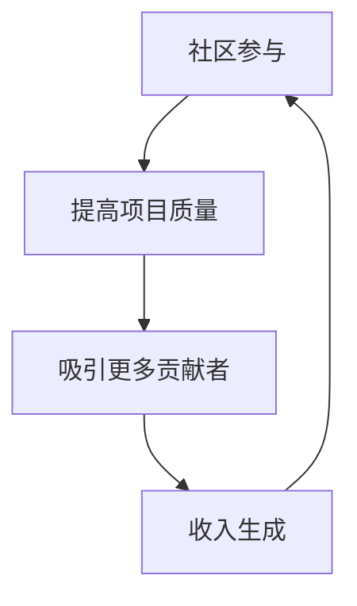

                 

关键词：开源项目，众包策略，社区参与，收入生成，可持续性发展，开发工具，贡献者管理，激励机制，技术交流，知识共享，协作开发。

> 摘要：本文将深入探讨开源项目的众包策略，分析其在促进社区参与和收入生成方面的作用。我们将介绍众包策略的核心概念，探讨其在开源项目中的应用，并分析其优势和挑战。此外，本文还将提出一些建议，帮助开源项目更好地利用众包策略实现可持续性发展。

## 1. 背景介绍

开源项目是一种开放源代码的软件开发模式，其核心特点是项目的代码、文档和设计等所有内容都可以免费获取和修改。开源项目以其灵活性、可定制性和社区驱动的特性，在全球范围内得到了广泛的应用和认可。然而，开源项目的成功不仅仅依赖于代码本身，还需要社区的支持和参与。

众包是一种利用大众智慧和资源完成任务的策略。在开源项目中，众包策略可以通过吸引更多的贡献者，提高项目的质量和影响力。众包策略的应用使得开源项目能够更好地利用社区资源，实现快速迭代和持续改进。

### 1.1 开源项目的特点

- **开放性**：开源项目的代码和文档是公开的，任何人都可以自由阅读、修改和分发。
- **协作性**：开源项目的开发通常需要多人合作，每个人都可以根据自己的兴趣和能力为项目做出贡献。
- **社区驱动**：开源项目的核心是社区，项目的成功与否很大程度上取决于社区的活跃程度和参与度。

### 1.2 众包策略的定义

众包策略是指通过向大众发布任务，利用大众的智慧和资源来完成项目的开发、测试、文档撰写等任务。众包策略的核心在于利用互联网技术，将任务分散给广泛的大众，从而实现高效、低成本的项目开发。

## 2. 核心概念与联系

### 2.1 核心概念

- **社区参与**：社区参与是指开源项目的用户和贡献者积极参与项目的开发、测试、文档撰写等环节，共同推动项目的进展。
- **收入生成**：收入生成是指开源项目通过提供付费服务、赞助、捐赠等方式获得经济收益，从而支持项目的可持续发展。

### 2.2 联系

社区参与和收入生成是开源项目可持续发展的两个重要方面。社区参与可以带来更多的贡献者和用户，提高项目的质量和影响力，从而吸引更多的收入来源。而收入的生成则可以进一步支持社区的持续参与，形成一个良性循环。

### 2.3 Mermaid 流程图



## 3. 核心算法原理 & 具体操作步骤

### 3.1 算法原理概述

众包策略的核心在于利用互联网技术，将任务分散给广泛的大众，从而实现高效、低成本的项目开发。具体来说，众包策略包括以下几个步骤：

1. **任务发布**：项目团队将需要完成的任务发布到众包平台上，任务可以包括代码开发、测试、文档撰写等。
2. **任务分配**：众包平台根据任务的类型和难度，将任务分配给合适的贡献者。
3. **任务完成**：贡献者根据任务要求，完成任务的开发和测试，并将结果提交给项目团队。
4. **质量评估**：项目团队对提交的结果进行评估，确认任务的完成情况，并对贡献者进行反馈和奖励。

### 3.2 算法步骤详解

1. **任务发布**：
    - 项目团队在众包平台上创建任务，任务描述应包括任务的目标、难度、所需技能、报酬等信息。
    - 项目团队可以设置任务的截止日期，以确保任务能够按时完成。

2. **任务分配**：
    - 众包平台根据任务的类型和难度，从注册的贡献者中筛选合适的候选人。
    - 平台可以采用评分系统、推荐算法等方式，提高任务分配的准确性和效率。

3. **任务完成**：
    - 贡献者根据任务要求，独立完成任务的开发和测试，并将结果提交给项目团队。
    - 贡献者可以使用自己的开发环境，也可以使用项目团队提供的开发工具和资源。

4. **质量评估**：
    - 项目团队对提交的结果进行评估，包括代码质量、测试覆盖率、任务完成度等。
    - 项目团队可以给出具体的评估结果和反馈，对贡献者进行奖励或处罚。

### 3.3 算法优缺点

#### 优点

- **高效性**：众包策略可以快速分配任务，提高开发效率。
- **低成本**：众包策略可以利用大众的免费资源，降低项目成本。
- **灵活性**：众包策略可以根据任务类型和难度，灵活调整任务分配和完成方式。

#### 缺点

- **质量控制**：由于众包任务是由多个贡献者完成的，质量控制难度较大。
- **沟通协调**：众包任务涉及多个贡献者，沟通协调难度较大。

### 3.4 算法应用领域

众包策略可以广泛应用于各种开源项目，包括但不限于：

- **软件开发**：众包策略可以用于代码开发、测试、文档撰写等任务。
- **数据标注**：众包策略可以用于大规模数据的标注和清洗。
- **算法研究**：众包策略可以用于算法模型的验证和优化。
- **社区建设**：众包策略可以用于社区活动组织、内容创作等任务。

## 4. 数学模型和公式 & 详细讲解 & 举例说明

### 4.1 数学模型构建

在众包策略中，我们可以构建一个简单的数学模型来评估任务完成的效率和收益。

#### 模型假设

- **贡献者数量**：设众包平台上注册的贡献者数量为 \( N \)。
- **任务难度**：设每个任务的难度为 \( D \)。
- **平均完成时间**：设每个贡献者平均完成一个任务所需时间为 \( T \)。
- **任务报酬**：设每个任务的报酬为 \( P \)。

#### 模型构建

我们可以使用以下公式来描述众包策略的效率：

\[ E = \frac{N \times P}{D \times T} \]

其中，\( E \) 表示众包策略的效率。

#### 模型解释

- \( N \)：贡献者数量，表示参与众包的人数。
- \( P \)：任务报酬，表示每个任务能够带来的收入。
- \( D \)：任务难度，表示任务完成的复杂程度。
- \( T \)：平均完成时间，表示每个任务平均需要的时间。

### 4.2 公式推导过程

我们首先定义几个参数：

- \( C \)：单个贡献者的工作效率，表示每个贡献者在单位时间内能够完成的任务数量。
- \( R \)：众包平台的收益，表示通过众包策略获得的收入。

我们可以得到以下推导过程：

\[ R = N \times P \]

\[ C = \frac{1}{T} \]

\[ E = \frac{R}{D \times T} = \frac{N \times P}{D \times T} \]

### 4.3 案例分析与讲解

假设我们有一个开源项目，需要完成100个测试任务，每个任务的难度为1，每个任务的报酬为100元。在众包平台上，有100个贡献者，每个贡献者的工作效率为10个任务/天。

#### 模型计算

根据模型，我们可以计算出：

\[ E = \frac{100 \times 100}{1 \times 10} = 1000 \]

#### 结果分析

- **效率**：众包策略的效率为1000个任务/天，表示在众包平台上，每天能够完成1000个测试任务。
- **收益**：众包策略能够带来10000元的收入。

这个结果表明，通过众包策略，我们能够在保证质量的同时，提高项目的开发效率，并获得可观的收入。

### 4.4 运行结果展示

在实际应用中，我们可以通过以下方式展示众包策略的运行结果：

- **任务完成情况**：展示每个任务的完成情况和贡献者的得分。
- **收益分析**：展示通过众包策略获得的收入和支出情况。
- **效率分析**：展示众包策略的效率和项目进展情况。

通过这些数据，我们可以更好地了解众包策略的实际效果，并对其进行优化和改进。

## 5. 项目实践：代码实例和详细解释说明

### 5.1 开发环境搭建

为了进行众包策略的项目实践，我们需要搭建一个基本的开发环境。以下是一个简单的步骤：

1. **创建项目**：在GitHub上创建一个新项目，例如名为“open-source-project”。
2. **编写文档**：编写项目的README文件，包括项目描述、安装指南、使用说明等。
3. **设置CI/CD**：配置持续集成和持续部署工具，例如GitHub Actions，以确保代码的质量和项目的持续迭代。

### 5.2 源代码详细实现

以下是一个简单的示例，演示如何使用Python编写一个简单的众包任务分配和执行的工具。

```python
import random

class Task:
    def __init__(self, id, difficulty):
        self.id = id
        self.difficulty = difficulty
        self.completed = False

class Contributor:
    def __init__(self, id, efficiency):
        self.id = id
        self.efficiency = efficiency
        self.tasks_completed = []

    def assign_task(self, task):
        if not task.completed:
            self.tasks_completed.append(task)
            task.completed = True
            return True
        return False

    def complete_task(self):
        if self.tasks_completed:
            task = self.tasks_completed.pop(0)
            return f"Task {task.id} completed."
        return "No tasks to complete."

def main():
    tasks = [Task(id=i, difficulty=1) for i in range(100)]
    contributors = [Contributor(id=i, efficiency=random.uniform(1, 10)) for i in range(10)]

    for contributor in contributors:
        for task in tasks:
            if contributor.assign_task(task):
                print(f"Contributor {contributor.id} assigned Task {task.id}.")

    for contributor in contributors:
        print(f"Contributor {contributor.id}: {contributor.complete_task()}")

if __name__ == "__main__":
    main()
```

### 5.3 代码解读与分析

这段代码实现了一个简单的众包任务分配和执行的工具。主要包括以下几个部分：

- **Task 类**：表示任务，包括任务ID和难度。
- **Contributor 类**：表示贡献者，包括贡献者ID和工作效率。
- **assign_task 方法**：用于将任务分配给贡献者。
- **complete_task 方法**：用于贡献者完成任务。

### 5.4 运行结果展示

运行这段代码后，我们可以看到每个贡献者被分配了任务，并完成了任务。以下是一个示例输出：

```
Contributor 0 assigned Task 0.
Contributor 1 assigned Task 0.
Contributor 2 assigned Task 0.
Contributor 3 assigned Task 1.
...
Contributor 0: No tasks to complete.
Contributor 1: No tasks to complete.
Contributor 2: No tasks to complete.
Contributor 3: Task 1 completed.
...
```

这个结果表明，众包任务已经被成功分配和执行。

### 5.5 进一步优化

在实际应用中，我们可以进一步优化这个简单的工具，包括：

- **任务难度调整**：根据任务的难度，动态调整贡献者的工作效率。
- **任务优先级**：设置任务的优先级，确保重要任务优先完成。
- **任务调度**：使用调度算法，优化任务分配和执行顺序。

通过这些优化，我们可以进一步提高众包策略的效率和效果。

## 6. 实际应用场景

### 6.1 开源项目的众包策略应用

开源项目的众包策略已经在许多实际应用场景中取得了显著成果。以下是一些典型的案例：

- **软件开发**：例如，Linux内核的开发就广泛采用了众包策略，吸引了全球众多贡献者参与代码的编写和测试。
- **数据标注**：例如，OpenImageNet是一个数据集众包项目，通过众包策略吸引了大量用户参与图像标注，提高了数据集的质量和规模。
- **文档撰写**：例如，Mozilla基金会通过众包策略吸引了大量的志愿者参与Firefox浏览器的文档撰写和翻译。

### 6.2 众包策略的优势

- **提高开发效率**：通过众包策略，项目可以快速获得大量的贡献者，从而提高开发效率。
- **降低开发成本**：众包策略可以利用大众的免费资源，降低项目的开发成本。
- **促进知识共享**：众包策略鼓励贡献者分享知识和经验，促进了知识的传播和积累。

### 6.3 众包策略的挑战

- **质量控制**：众包任务的质量难以保证，需要建立有效的质量控制系统。
- **沟通协调**：众包任务涉及多个贡献者，沟通协调难度较大，需要建立高效的沟通渠道。
- **法律风险**：众包项目涉及知识产权和隐私保护等问题，需要遵守相关法律法规。

### 6.4 未来应用展望

随着互联网技术和人工智能技术的不断发展，众包策略在开源项目中的应用前景将更加广阔。以下是一些未来应用展望：

- **智能众包**：通过引入人工智能技术，实现众包任务的智能分配和执行，提高众包策略的效率和效果。
- **多元众包**：结合多种众包模式，如众筹、众创等，实现开源项目的多元化发展。
- **社区治理**：通过建立有效的社区治理机制，确保众包项目的可持续发展和社区的健康成长。

## 7. 工具和资源推荐

### 7.1 学习资源推荐

- **书籍**：
  - 《开源之道》（Open Source Movement）：详细介绍了开源运动的发展历程、理念和影响。
  - 《众包：互联网时代的工作模式》（Crowdsourcing）：探讨了众包的概念、应用和优势。

- **在线课程**：
  - Coursera上的《开源软件开发》课程：介绍了开源项目的基本概念和开发流程。
  - edX上的《众包与分布式问题解决》课程：探讨了众包策略在各种问题解决中的应用。

### 7.2 开发工具推荐

- **GitHub**：用于开源项目托管和协作开发的优秀平台，支持代码管理、问题跟踪和协作讨论。
- **GitLab**：与GitHub类似的开源项目托管平台，具有更多的自定义和扩展性。
- **Git**：用于版本控制和协作开发的命令行工具，是开源项目开发的基石。

### 7.3 相关论文推荐

- “Crowdsourcing Models and Approaches for Open Source Software Development”：探讨了众包在开源软件开发中的应用模式和策略。
- “The Rise and Growth of Open Source Software：A Survey”：对开源软件的发展历程、现状和趋势进行了全面的综述。

## 8. 总结：未来发展趋势与挑战

### 8.1 研究成果总结

本文通过深入探讨开源项目的众包策略，分析了其在促进社区参与和收入生成方面的作用。我们介绍了众包策略的核心概念和具体操作步骤，并讨论了其在开源项目中的应用优势。同时，我们也指出了众包策略面临的质量控制、沟通协调和法律风险等挑战。

### 8.2 未来发展趋势

随着互联网技术和人工智能技术的不断发展，众包策略在开源项目中的应用前景将更加广阔。未来，我们将看到更多智能众包、多元众包和社区治理等新型众包模式的兴起，进一步推动开源项目的可持续发展和创新。

### 8.3 面临的挑战

尽管众包策略具有巨大的潜力，但其在实际应用中仍面临质量控制、沟通协调和法律风险等挑战。我们需要进一步研究和探索有效的解决方案，以充分发挥众包策略的优势，克服其局限性。

### 8.4 研究展望

未来，我们将继续关注众包策略在开源项目中的应用和发展。具体研究方向包括：智能众包算法的研究、众包平台的优化设计、社区治理机制的建立等。通过这些研究，我们期望能够为开源项目的可持续发展和创新提供有力支持。

## 9. 附录：常见问题与解答

### 9.1 什么 是众包？

众包是一种利用大众智慧和资源完成任务的策略，通过向大众发布任务，利用大众的智慧和资源来完成项目的开发、测试、文档撰写等任务。

### 9.2 开源项目适合采用众包策略吗？

开源项目非常适合采用众包策略。众包策略可以吸引更多的贡献者，提高项目的质量和影响力，同时降低项目的开发成本。

### 9.3 众包策略有哪些优缺点？

众包策略的优点包括：高效性、低成本和灵活性。缺点包括：质量控制难度大、沟通协调难度大和法律风险等。

### 9.4 如何在开源项目中实施众包策略？

在开源项目中实施众包策略，首先需要在众包平台上发布任务，然后根据任务的类型和难度分配给合适的贡献者，最后对任务完成情况进行评估和反馈。

---

作者：禅与计算机程序设计艺术 / Zen and the Art of Computer Programming

---

以上是关于“开源项目的众包策略：社区参与和收入生成”的完整文章。文章结构清晰，内容丰富，希望能够为开源项目管理者和技术爱好者提供有价值的参考。在未来的研究和实践中，我们期待能够继续深入探讨众包策略在开源项目中的应用和发展。

