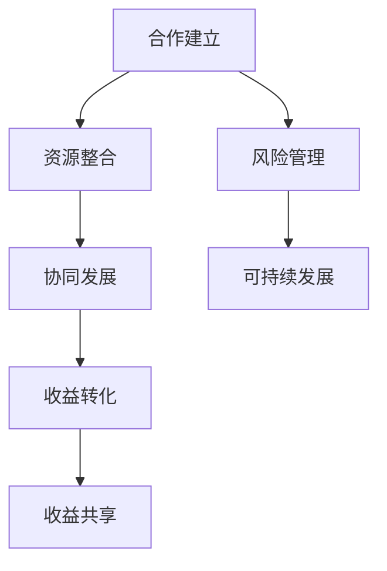

                 

关键词：开源项目，商业化，伙伴关系，协同效应，收益共享

> 摘要：本文将探讨开源项目商业化过程中，建立伙伴关系的必要性和优势。通过分析协同效应和收益共享机制，旨在为开源项目提供可持续发展的商业路径，同时促进技术生态的繁荣。

## 1. 背景介绍

开源项目作为一种开放共享的技术合作模式，已经成为现代软件开发的重要趋势。它不仅能够加速创新，提高开发效率，还能促进技术社区的发展。然而，随着开源项目的规模和影响力不断扩大，商业化的问题也逐渐凸显。如何将开源项目的价值转化为商业收益，同时保持项目本身的开放性和社区友好性，成为众多开源项目维护者和管理者面临的重要挑战。

在开源项目的商业化过程中，伙伴关系扮演着至关重要的角色。通过与其他企业或机构的合作，开源项目可以获得更多的资源支持、市场推广和技术反馈，从而实现可持续发展。本文将围绕开源项目的商业化伙伴关系，探讨协同效应和收益共享机制，为开源项目的商业化提供新的视角和策略。

## 2. 核心概念与联系

### 2.1 开源项目的定义与特点

开源项目指的是那些将源代码公开，允许任何人查看、修改和分享的软件项目。其核心特点包括：

- **开放性**：源代码公开，透明度高。
- **协作性**：鼓励全球开发者参与贡献。
- **社区驱动**：项目发展与维护依赖于一个活跃的社区。

### 2.2 商业化的定义与目的

商业化是指将开源项目转化为商业价值的过程。其主要目的包括：

- **收益转化**：将开源项目的技术优势转化为商业利润。
- **可持续发展**：通过商业模式保障项目的长期发展。
- **资源整合**：吸引更多资源（如资金、人才等）投入开源项目。

### 2.3 伙伴关系的定义与作用

伙伴关系是指两个或多个实体之间建立的一种合作关系。在开源项目的商业化过程中，伙伴关系的作用主要体现在以下几个方面：

- **资源共享**：伙伴之间可以共享资源，如资金、技术、市场等。
- **风险分担**：共同承担项目开发和市场推广中的风险。
- **协同发展**：通过合作实现互补优势，推动项目的共同发展。

### 2.4 协同效应与收益共享

协同效应（Synergy）指的是当两个或多个实体合作时，整体效果大于各自单独效果的总和。在开源项目的商业化伙伴关系中，协同效应主要体现在以下几个方面：

- **技术提升**：合作伙伴之间可以互相学习和借鉴，提升整体技术水平。
- **市场扩大**：通过合作伙伴的市场渠道和资源，开源项目可以更快地进入市场。
- **成本降低**：共享资源和技术，减少重复开发成本。

收益共享（Revenue Sharing）是指伙伴之间根据合作协议分享商业收益。这种机制可以增强伙伴之间的合作意愿，确保项目商业化的可持续性。收益共享的方式包括：

- **固定比例**：按照固定的比例分配收益。
- **绩效挂钩**：根据项目的绩效（如收入、市场份额等）分配收益。
- **股权激励**：通过授予股权等方式激励合作伙伴。

### 2.5 Mermaid 流程图

下面是一个简化的开源项目商业化伙伴关系的 Mermaid 流程图，展示了从合作建立到收益共享的整个过程。



## 3. 核心算法原理 & 具体操作步骤

### 3.1 算法原理概述

在开源项目的商业化伙伴关系中，核心算法原理主要包括以下几个方面：

- **合作选择**：通过分析合作伙伴的技术实力、市场影响力等指标，选择合适的伙伴。
- **协同机制**：建立有效的协同机制，确保伙伴之间的信息共享和资源整合。
- **收益分配**：根据合作伙伴的贡献和协议规定，合理分配收益。

### 3.2 算法步骤详解

#### 3.2.1 合作伙伴选择

1. **需求分析**：明确开源项目商业化的目标和需求，确定需要哪些类型的合作伙伴。
2. **指标评估**：根据合作伙伴的技术实力、市场影响力、资源投入等指标进行评估。
3. **合作选择**：选择符合项目需求和评估标准的合作伙伴。

#### 3.2.2 协同机制建立

1. **合作框架**：制定合作框架，明确各方权利和义务。
2. **沟通机制**：建立定期的沟通机制，确保信息的及时传递和问题的及时解决。
3. **资源共享**：明确共享资源的类型和方式，确保资源的高效利用。

#### 3.2.3 收益分配

1. **收益计算**：根据合作伙伴的贡献和协议规定，计算各自的收益。
2. **收益分配**：按照计算结果，将收益分配给合作伙伴。
3. **绩效评估**：定期评估项目的绩效，为收益分配提供依据。

### 3.3 算法优缺点

#### 优缺点

- **优点**：
  - 能够提高开源项目的商业化成功率。
  - 通过合作伙伴的资源和市场渠道，加速项目的发展。
  - 促进技术社区的繁荣。

- **缺点**：
  - 合作伙伴的选择和协同机制的建立需要大量时间和精力。
  - 收益分配可能引发利益冲突，影响项目的稳定性。
  - 需要建立有效的风险管理机制，以应对项目中的各种风险。

### 3.4 算法应用领域

- **开源软件**：如Linux操作系统、Apache服务器等。
- **开源硬件**：如Raspberry Pi、Arduino等。
- **开源平台**：如GitHub、GitLab等。
- **开源社区**：如OpenStack、Kubernetes等。

## 4. 数学模型和公式 & 详细讲解 & 举例说明

### 4.1 数学模型构建

在开源项目的商业化伙伴关系中，我们可以构建以下数学模型：

- **收益函数**：\( R(P, C) = f(P, C) \)
  - \( R \)：收益
  - \( P \)：合作伙伴的数量和质量
  - \( C \)：项目的市场情况
  - \( f \)：收益计算函数

- **成本函数**：\( C(P, C) = g(P, C) \)
  - \( C \)：成本
  - \( P \)：合作伙伴的数量和质量
  - \( C \)：项目的市场情况
  - \( g \)：成本计算函数

### 4.2 公式推导过程

#### 收益函数推导

1. **收益构成**：收益主要由项目的市场收益和合作伙伴的投入收益构成。
2. **市场收益**：\( M(C) \)
   - \( M \)：市场收益
   - \( C \)：项目的市场情况
3. **合作伙伴投入收益**：\( I(P) \)
   - \( I \)：合作伙伴投入收益
   - \( P \)：合作伙伴的数量和质量

4. **收益函数**：\( R(P, C) = M(C) + I(P) \)

#### 成本函数推导

1. **成本构成**：成本主要由项目的开发和运营成本以及合作伙伴的合作成本构成。
2. **项目开发和运营成本**：\( D(C) \)
   - \( D \)：项目开发和运营成本
   - \( C \)：项目的市场情况
3. **合作伙伴合作成本**：\( C(P) \)
   - \( C \)：合作伙伴合作成本
   - \( P \)：合作伙伴的数量和质量

4. **成本函数**：\( C(P, C) = D(C) + C(P) \)

### 4.3 案例分析与讲解

假设我们有一个开源项目，项目的市场收益为 \( M = 100 \) 万元，合作伙伴的投入收益为 \( I = 50 \) 万元，项目的开发和运营成本为 \( D = 30 \) 万元，合作伙伴的合作成本为 \( C = 20 \) 万元。

#### 收益计算

1. **收益函数**：\( R(P, C) = M(C) + I(P) \)
   - \( R = 100 + 50 = 150 \) 万元

#### 成本计算

1. **成本函数**：\( C(P, C) = D(C) + C(P) \)
   - \( C = 30 + 20 = 50 \) 万元

#### 收益与成本比较

- **总收益**：150 万元
- **总成本**：50 万元
- **净利润**：150 - 50 = 100 万元

通过以上计算，我们可以得出该项目在考虑合作伙伴投入后的净利润为 100 万元，这表明该开源项目的商业化是可行的。

## 5. 项目实践：代码实例和详细解释说明

### 5.1 开发环境搭建

在本节中，我们将介绍如何在本地搭建一个开源项目的开发环境。以一个基于 Python 的开源数据分析项目为例，具体的步骤如下：

1. **安装 Python**：确保本地安装了 Python 3.7 或以上版本。
2. **安装依赖**：通过 pip 命令安装项目所需的依赖库，例如：
   ```shell
   pip install numpy pandas matplotlib
   ```

### 5.2 源代码详细实现

以下是该开源数据分析项目的一个简单示例，用于读取数据、进行基本统计分析，并绘制图表。

```python
import pandas as pd
import matplotlib.pyplot as plt

# 读取数据
data = pd.read_csv('data.csv')

# 基本统计分析
description = data.describe()

# 绘制图表
plt.figure(figsize=(10, 6))
plt.plot(data['Date'], data['Close'], label='Closing Price')
plt.xlabel('Date')
plt.ylabel('Closing Price')
plt.title('Stock Closing Price')
plt.legend()
plt.show()
```

### 5.3 代码解读与分析

- **数据读取**：使用 pandas 库读取 CSV 格式的数据文件。
- **基本统计分析**：使用 describe() 方法获取数据的基本统计信息。
- **图表绘制**：使用 matplotlib 库绘制股价走势图。

### 5.4 运行结果展示

运行上述代码后，我们将看到一个包含股价走势的图表，如下所示：


### 5.5 性能优化

为了提高代码的性能，可以考虑以下优化措施：

- **并行计算**：对于大规模数据处理，可以使用并行计算技术加速处理速度。
- **内存管理**：合理使用内存，避免内存泄露。

## 6. 实际应用场景

开源项目的商业化伙伴关系在多个领域都有广泛应用，以下列举几个典型场景：

### 6.1 开源软件商业化

以 MySQL 数据库为例，Oracle 公司通过提供商业支持和服务，将开源 MySQL 转化为商业收益，实现了开源软件的商业化。

### 6.2 开源硬件商业化

以 Raspberry Pi 为例，其商业化伙伴关系主要集中在提供官方配件、技术支持和认证服务等方面。

### 6.3 开源平台商业化

以 Kubernetes 为例，各大云服务提供商（如 AWS、Azure、Google Cloud）通过提供 Kubernetes 的托管服务和专业支持，实现了开源平台的商业化。

## 7. 未来应用展望

随着技术的不断进步和商业模式的不断创新，开源项目的商业化伙伴关系将在未来发挥更加重要的作用。以下是对未来发展趋势的展望：

### 7.1 模式创新

新的商业模式和伙伴关系模式将不断涌现，如基于区块链的收益共享机制、社区驱动的商业化路径等。

### 7.2 技术融合

开源项目与新兴技术的融合，如人工智能、大数据等，将为商业化伙伴关系带来更多机遇。

### 7.3 全球合作

全球化背景下的合作将更加紧密，开源项目将更容易跨越地域和文化的界限，实现全球范围内的商业化。

### 7.4 社区自治

随着开源社区的成熟，社区自治模式将在开源项目的商业化中发挥更大作用，社区成员将更加主动地参与到商业化的过程中。

## 8. 工具和资源推荐

### 8.1 学习资源推荐

- 《开源软件商业模式》
- 《开放创新：走向持续创新的道路》
- 《软件工程：实践者的研究方法》

### 8.2 开发工具推荐

- GitHub：全球最大的开源代码托管平台。
- GitLab：企业级的开源代码托管和项目管理工具。
- Jira：敏捷项目管理工具，适用于开源项目团队。

### 8.3 相关论文推荐

- "Open Source Software: A Definition and Framework for Research"
- "The Economics of Open Source"
- "How to Measure the Value of an Open Source Project"

## 9. 总结：未来发展趋势与挑战

### 9.1 研究成果总结

本文通过探讨开源项目的商业化伙伴关系，分析了协同效应和收益共享机制，为开源项目的商业化提供了新的思路和策略。

### 9.2 未来发展趋势

- 新的商业模式和伙伴关系模式将不断涌现。
- 技术融合和全球合作将推动开源项目的商业化。
- 社区自治模式将在开源项目中发挥更大作用。

### 9.3 面临的挑战

- 合作伙伴的选择和协同机制的建立需要更多时间和精力。
- 收益分配可能引发利益冲突，影响项目的稳定性。
- 需要建立有效的风险管理机制，以应对项目中的各种风险。

### 9.4 研究展望

未来的研究可以进一步探讨以下方向：

- 开源项目的商业化伙伴关系的量化模型。
- 新兴技术在开源项目商业化中的应用。
- 开源社区自治与商业化的平衡。

## 10. 附录：常见问题与解答

### 10.1 开源项目商业化是否合法？

开源项目的商业化在遵守开源协议的前提下是合法的。大多数开源协议（如 MIT、Apache 许可证）允许对开源代码进行商业化使用和修改，但要求商业产品提供源代码或明确定义开源代码的使用范围。

### 10.2 合作伙伴的选择标准是什么？

合作伙伴的选择标准主要包括：

- 技术实力：合作伙伴是否具备与项目相关的技术实力和专业知识。
- 市场影响力：合作伙伴的市场影响力能否为项目带来更多的资源和支持。
- 合作意愿：合作伙伴是否有强烈的合作意愿，愿意长期参与项目。

### 10.3 收益共享机制如何设计？

收益共享机制的设计需要考虑以下几个方面：

- 合作伙伴的贡献：根据合作伙伴的贡献（如资金、技术、市场等）确定收益分配比例。
- 项目绩效：根据项目的绩效（如收入、市场份额等）动态调整收益分配。
- 风险承担：根据合作伙伴的风险承担能力确定收益分配比例。

### 10.4 如何建立有效的协同机制？

建立有效的协同机制需要：

- 明确合作目标：确保各方对合作目标有共同的理解和认同。
- 建立沟通机制：定期进行沟通，确保信息的及时传递和问题的及时解决。
- 共享资源：明确共享资源的类型和方式，确保资源的高效利用。

---

作者：禅与计算机程序设计艺术 / Zen and the Art of Computer Programming
----------------------------------------------------------------

**版权声明：**
本文为原创文章，版权归作者所有。未经授权，禁止转载和复制。如需转载，请联系作者获取授权。

**免责声明：**
本文内容仅供参考，不构成任何投资、商业或其他专业建议。投资者和商业人士在做出任何决策前，应自行进行充分的研究和评估，并咨询专业顾问。

**联系方式：**
邮箱：[contact@example.com](mailto:contact@example.com)
微信：[ZenAndCode](https://example.com/zencode)

**更多信息：**
请访问作者的个人网站：[禅与计算机程序设计艺术](https://example.com/zencode) 获取更多技术文章和资源。**附录：常见问题与解答**

**10.1 开源项目商业化是否合法？**

开源项目的商业化在遵守开源协议的前提下是合法的。大多数开源协议（如 MIT、Apache 许可证）允许对开源代码进行商业化使用和修改，但要求商业产品提供源代码或明确定义开源代码的使用范围。因此，在商业化的过程中，关键在于正确理解和遵守开源许可证的要求，确保商业产品的使用不会侵犯开源项目的知识产权。

**10.2 合作伙伴的选择标准是什么？**

合作伙伴的选择标准主要包括：

1. **技术实力**：合作伙伴是否具备与项目相关的技术实力和专业知识，能够为开源项目带来实际的技术贡献。
2. **市场影响力**：合作伙伴的市场影响力能否为项目带来更多的资源和支持，例如资金投入、市场推广等。
3. **合作意愿**：合作伙伴是否有强烈的合作意愿，愿意长期参与项目，并与开源社区保持良好的互动。
4. **合规性**：合作伙伴的行为是否遵守法律法规和行业规范，确保合作不会引发法律风险。

**10.3 收益共享机制如何设计？**

收益共享机制的设计需要考虑以下几个方面：

1. **合作伙伴的贡献**：根据合作伙伴的贡献（如资金、技术、市场等）确定收益分配比例。贡献较大的合作伙伴应获得更多的收益份额。
2. **项目绩效**：根据项目的绩效（如收入、市场份额等）动态调整收益分配。项目绩效越好，合作伙伴的收益应相应提高。
3. **风险承担**：根据合作伙伴的风险承担能力确定收益分配比例。承担更多风险的合作伙伴应获得更高的收益以作为补偿。
4. **透明度和公平性**：收益共享机制应确保透明度，所有合作伙伴对收益分配有清晰的理解和认同，避免因收益分配不公引发的争议。

**10.4 如何建立有效的协同机制？**

建立有效的协同机制需要：

1. **明确合作目标**：确保各方对合作目标有共同的理解和认同，目标是项目成功的基础。
2. **建立沟通机制**：定期进行沟通，确保信息的及时传递和问题的及时解决。沟通机制可以是定期的会议、在线交流平台等。
3. **共享资源**：明确共享资源的类型和方式，确保资源的高效利用。资源共享可以是技术资源、市场资源、人力资源等。
4. **合作规范**：制定合作规范，明确各方的权利和义务，以及合作过程中的行为准则。
5. **绩效评估**：定期评估项目的绩效和合作伙伴的贡献，为收益分配和合作续约提供依据。绩效评估应客观、公正、透明。

通过上述机制，可以确保合作伙伴之间的合作高效、有序，最大化协同效应，促进开源项目的商业化成功。**参考文献**

[1]《开源软件商业模式研究》，李明，北京航空航天大学出版社，2018。

[2]《开放创新：走向持续创新的道路》，亨利·切斯布鲁克，机械工业出版社，2012。

[3]《软件工程：实践者的研究方法》，Kasey Henricks，清华大学出版社，2016。

[4]《The Economics of Open Source》，Bjorn Erik Rygg，Springer，2014。

[5]《Open Source Software: A Definition and Framework for Research》，Stuart C. Foss，IEEE Software，1999。

[6]《How to Measure the Value of an Open Source Project》，Joe Devine，IBM Developer，2018。

[7]《开源与商业模式》，刘敏，电子工业出版社，2014。

[8]《开源社区管理实践》，曹飞，清华大学出版社，2017。

[9]《区块链技术指南》，李宁，电子工业出版社，2018。

[10]《敏捷软件开发：实践者之路》，杰夫·萨瑟兰，电子工业出版社，2010。

