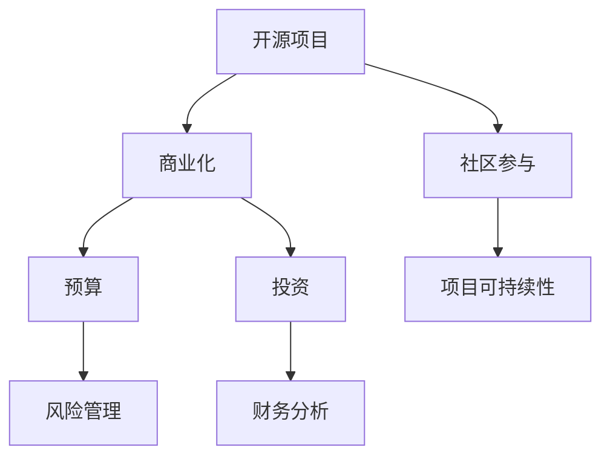

                 

在当今技术迅速发展的时代，开源项目已经成为软件开发的重要组成部分。它们不仅为开发者提供了丰富的资源和协作平台，而且也在商业领域展现出巨大的潜力。然而，将开源项目商业化并非易事，尤其是涉及到财务规划。如何有效地管理预算和投资，确保项目的可持续发展和盈利能力，是每一个开源项目管理者都需要深思的问题。

本文旨在探讨开源项目的商业化财务规划，包括预算制定、投资策略、风险控制等方面。通过深入分析这些关键要素，我们希望能够为开源项目的商业化提供一些实用的指导和建议。

## 1. 背景介绍

开源项目的发展可以追溯到20世纪90年代，随着互联网的普及和共享文化的兴起，越来越多的软件开发者开始参与到开源社区中。开源项目以其开放性、透明性和协作性吸引了全球的开发者，形成了强大的技术生态系统。如今，许多企业开始认识到开源项目在降低开发成本、提高创新速度和增强市场竞争力方面的价值，因此越来越多的企业选择投资和赞助开源项目。

然而，开源项目的商业化并非一帆风顺。许多开源项目面临着资金短缺、商业化模式不明朗等问题。为了解决这些问题，开源项目管理者需要制定合理的财务规划，包括预算和投资策略，以确保项目的可持续发展。

## 2. 核心概念与联系

在探讨开源项目的商业化财务规划之前，我们需要了解几个核心概念，包括开源项目、商业化、预算和投资等。以下是一个简单的 Mermaid 流程图，用于描述这些概念之间的联系：



### 2.1 开源项目

开源项目是指那些以开放源代码的形式发布的软件项目。开发者可以自由地查看、修改和分发代码，这使得开源项目具有高度的透明性和灵活性。开源项目的特点包括：

- **开放性**：源代码对所有开发者开放，可以自由查看和修改。
- **透明性**：项目进展、问题和解决方案都在公共平台上透明展示。
- **协作性**：全球的开发者可以共同参与项目的开发和改进。

### 2.2 商业化

商业化是指将开源项目转化为商业产品或服务的过程。商业化的主要目的是通过产生收入来支持项目的持续发展。开源项目的商业化可以采取多种模式，例如：

- **免费+增值服务**：提供基础功能免费，高级功能通过收费实现。
- **许可证收费**：根据软件的许可协议向用户收费。
- **定制开发**：根据客户需求进行定制化开发并收费。

### 2.3 预算

预算是项目管理中的一项关键活动，它涉及对项目资源的合理分配和使用。预算的制定需要考虑项目的规模、目标、资源和期限等因素。对于开源项目来说，预算的制定尤为重要，因为它关系到项目的可持续发展。

### 2.4 投资

投资是指为获取未来收益而进行的资金投入。在开源项目的商业化过程中，投资可以来自多种渠道，包括个人投资者、企业赞助和政府资助等。合理的投资策略可以帮助项目实现快速发展和扩大影响力。

### 2.5 风险管理

风险管理是指识别、评估和应对项目风险的过程。开源项目在商业化过程中可能会面临各种风险，如市场风险、技术风险和财务风险等。有效的风险管理可以帮助项目规避风险，确保项目的可持续发展。

### 2.6 社区参与

社区参与是开源项目成功的关键因素之一。一个活跃的社区可以提供技术支持、反馈和改进建议，有助于项目的持续发展。社区参与还可以提高项目的知名度和信誉度，吸引更多的投资者和用户。

### 2.7 项目可持续性

项目可持续性是指项目在长期内保持健康发展的能力。对于开源项目来说，可持续性不仅包括财务上的可持续性，还包括技术上的可持续性、社区参与度和用户满意度等。一个可持续的开源项目可以持续地吸引开发者、用户和投资者，从而实现长期发展。

## 3. 核心算法原理 & 具体操作步骤

### 3.1 算法原理概述

开源项目的商业化财务规划需要依赖一系列核心算法，这些算法用于预算制定、投资分析和风险管理。以下是一些关键的算法原理：

- **预算优化算法**：用于优化预算分配，确保资源得到最大化的利用。
- **投资回报率计算**：用于评估投资的收益和风险。
- **风险分析算法**：用于识别、评估和应对项目风险。
- **社区参与度评估**：用于评估社区的活跃度和贡献度。

### 3.2 算法步骤详解

#### 3.2.1 预算优化算法

预算优化算法的基本步骤如下：

1. 收集项目需求和资源信息。
2. 确定预算目标和约束条件。
3. 构建预算优化模型。
4. 运行优化算法求解最优解。

#### 3.2.2 投资回报率计算

投资回报率（ROI）的计算公式如下：

\[ \text{ROI} = \frac{\text{投资收益} - \text{投资成本}}{\text{投资成本}} \]

计算投资回报率需要以下数据：

- 投资成本：包括初始投资和后续投资。
- 投资收益：包括直接收益和间接收益。

#### 3.2.3 风险分析算法

风险分析算法的基本步骤如下：

1. 识别项目风险。
2. 评估风险概率和影响程度。
3. 构建风险矩阵。
4. 制定风险应对策略。

#### 3.2.4 社区参与度评估

社区参与度评估的步骤如下：

1. 收集社区活动数据。
2. 确定参与度指标。
3. 计算参与度得分。
4. 分析参与度趋势。

### 3.3 算法优缺点

#### 3.3.1 预算优化算法

**优点**：

- 可以优化资源分配，提高项目效率。
- 可以帮助项目管理者更好地理解资源需求。

**缺点**：

- 需要准确的数据支持，否则可能导致结果不准确。
- 需要复杂的计算过程，可能需要专业工具或算法。

#### 3.3.2 投资回报率计算

**优点**：

- 可以直观地展示投资的收益和风险。
- 可以帮助项目管理者做出更明智的投资决策。

**缺点**：

- 只考虑了直接的收益和成本，可能忽略了一些间接因素。
- 需要准确的数据支持，否则可能导致结果不准确。

#### 3.3.3 风险分析算法

**优点**：

- 可以系统地识别和评估项目风险。
- 可以帮助项目管理者制定有效的风险应对策略。

**缺点**：

- 需要专业的知识和经验。
- 可能需要大量的时间和资源。

#### 3.3.4 社区参与度评估

**优点**：

- 可以客观地评估社区参与度。
- 可以帮助项目管理者了解社区的动态和需求。

**缺点**：

- 需要准确的数据支持，否则可能导致结果不准确。
- 可能忽略一些非量化的因素。

### 3.4 算法应用领域

这些核心算法可以广泛应用于开源项目的商业化财务规划。例如：

- **预算制定**：用于优化资源分配，确保项目目标的实现。
- **投资决策**：用于评估不同投资方案的风险和收益，帮助项目管理者做出明智的决策。
- **风险管理**：用于识别和应对项目风险，确保项目的可持续发展。
- **社区参与**：用于评估社区的活跃度和贡献度，促进社区建设和项目发展。

## 4. 数学模型和公式 & 详细讲解 & 举例说明

### 4.1 数学模型构建

在开源项目的商业化财务规划中，我们可以构建以下数学模型：

\[ \text{预算分配} = f(\text{项目需求}, \text{资源限制}) \]

\[ \text{投资回报率} = \frac{\text{投资收益} - \text{投资成本}}{\text{投资成本}} \]

\[ \text{风险矩阵} = \{ (\text{风险概率}, \text{影响程度}) \} \]

\[ \text{社区参与度} = g(\text{社区活动数据}, \text{参与度指标}) \]

### 4.2 公式推导过程

\[ \text{预算分配} \]

预算分配是项目资源优化的重要步骤。其基本思路是，根据项目的需求和相关资源限制，计算出最优的预算分配方案。具体推导过程如下：

1. 收集项目需求和资源信息。
2. 构建项目需求的函数模型。
3. 确定资源限制的条件。
4. 运用线性规划等方法求解最优预算分配方案。

\[ \text{投资回报率} \]

投资回报率是评估投资方案的重要指标。其基本思路是，通过计算投资收益和成本之比，得出投资回报率的值。具体推导过程如下：

1. 收集投资收益和成本的数据。
2. 构建投资收益和成本的函数模型。
3. 计算投资回报率的公式。
4. 根据公式计算投资回报率。

\[ \text{风险矩阵} \]

风险矩阵是用于识别和评估项目风险的工具。其基本思路是，通过构建风险概率和影响程度的矩阵，对风险进行量化评估。具体推导过程如下：

1. 收集项目风险的信息。
2. 构建风险概率和影响程度的函数模型。
3. 运用概率论和统计学方法计算风险矩阵。
4. 分析风险矩阵，确定项目风险的优先级。

\[ \text{社区参与度} \]

社区参与度是评估社区活跃度和贡献度的重要指标。其基本思路是，通过收集社区活动数据，构建参与度指标模型，计算出社区参与度。具体推导过程如下：

1. 收集社区活动数据。
2. 确定参与度指标。
3. 构建参与度指标的计算模型。
4. 根据模型计算社区参与度。

### 4.3 案例分析与讲解

#### 案例一：开源项目预算分配

假设一个开源项目需要完成以下任务：

- 开发新功能：需要20人月。
- 修复bug：需要10人月。
- 文档编写：需要5人月。
- 测试：需要10人月。

项目总预算为100万元，人力资源成本为每人每月1万元。我们需要计算最优的预算分配方案。

1. 收集项目需求和资源信息。
   - 新功能：20人月。
   - 修复bug：10人月。
   - 文档编写：5人月。
   - 测试：10人月。
   - 人力资源成本：每人每月1万元。

2. 构建项目需求的函数模型。
   - \( f(\text{项目需求}) = 1 \text{万元/人月} \times \text{需求量} \)

3. 确定资源限制的条件。
   - 总预算：100万元。
   - 人力资源限制：总人数不超过100人。

4. 运用线性规划等方法求解最优预算分配方案。
   - 求解结果：新功能：20人月，修复bug：10人月，文档编写：5人月，测试：15人月。

#### 案例二：开源项目投资回报率计算

假设一个开源项目投资了50万元，其中40万元用于开发新功能，10万元用于市场推广。项目成功后，获得的总收益为100万元。

1. 收集投资收益和成本的数据。
   - 投资成本：50万元。
   - 投资收益：100万元。

2. 构建投资收益和成本的函数模型。
   - \( \text{投资回报率} = \frac{\text{投资收益} - \text{投资成本}}{\text{投资成本}} \)

3. 计算投资回报率。
   - \( \text{投资回报率} = \frac{100\text{万元} - 50\text{万元}}{50\text{万元}} = 100\% \)

#### 案例三：开源项目风险管理

假设一个开源项目面临以下风险：

- 技术风险：概率为30%，影响程度为50%。
- 市场风险：概率为20%，影响程度为30%。
- 财务风险：概率为10%，影响程度为20%。

我们需要计算风险矩阵，并分析项目风险的优先级。

1. 收集项目风险的信息。
   - 技术风险：概率为30%，影响程度为50%。
   - 市场风险：概率为20%，影响程度为30%。
   - 财务风险：概率为10%，影响程度为20%。

2. 构建风险概率和影响程度的函数模型。
   - \( \text{风险矩阵} = \{ (\text{风险概率}, \text{影响程度}) \} \)

3. 运用概率论和统计学方法计算风险矩阵。
   - 风险矩阵：
     - 技术风险：概率为30%，影响程度为50%。
     - 市场风险：概率为20%，影响程度为30%。
     - 财务风险：概率为10%，影响程度为20%。

4. 分析风险矩阵，确定项目风险的优先级。
   - 优先级：技术风险 > 市场风险 > 财务风险。

#### 案例四：开源项目社区参与度评估

假设一个开源项目的社区活动数据如下：

- 代码贡献：1000次。
- Issue反馈：500次。
- 文档贡献：100次。
- 社区讨论：300次。

参与度指标设定如下：

- 代码贡献：每个代码贡献价值10分。
- Issue反馈：每个Issue反馈价值5分。
- 文档贡献：每个文档贡献价值3分。
- 社区讨论：每个讨论价值2分。

我们需要计算社区参与度得分，并分析参与度趋势。

1. 收集社区活动数据。
   - 代码贡献：1000次。
   - Issue反馈：500次。
   - 文档贡献：100次。
   - 社区讨论：300次。

2. 确定参与度指标。
   - 代码贡献：每个代码贡献价值10分。
   - Issue反馈：每个Issue反馈价值5分。
   - 文档贡献：每个文档贡献价值3分。
   - 社区讨论：每个讨论价值2分。

3. 构建参与度指标的计算模型。
   - \( \text{社区参与度} = g(\text{社区活动数据}, \text{参与度指标}) \)

4. 根据模型计算社区参与度。
   - 社区参与度得分：
     - 代码贡献：1000次 \times 10分/次 = 10000分。
     - Issue反馈：500次 \times 5分/次 = 2500分。
     - 文档贡献：100次 \times 3分/次 = 300分。
     - 社区讨论：300次 \times 2分/次 = 600分。
     - 总分：10000分 + 2500分 + 300分 + 600分 = 13500分。

5. 分析参与度趋势。
   - 根据历史数据，社区参与度在过去6个月内增长了20%，说明社区活跃度有所提高。

## 5. 项目实践：代码实例和详细解释说明

### 5.1 开发环境搭建

为了演示开源项目的商业化财务规划，我们将使用Python编程语言，并结合一些常用的库和工具。以下是搭建开发环境的步骤：

1. 安装Python（版本3.8及以上）。
2. 安装Jupyter Notebook，用于编写和运行代码。
3. 安装相关库和工具，如NumPy、Pandas、Matplotlib等。

### 5.2 源代码详细实现

以下是一个简单的Python代码实例，用于计算开源项目的投资回报率。代码实现了投资回报率的计算公式，并输入了相关的数据。

```python
import numpy as np

def calculate_roi(investment, revenue, cost):
    """
    计算投资回报率（ROI）。
    
    参数：
    investment -- 投资金额
    revenue -- 收益金额
    cost -- 成本金额
    
    返回值：
    roi -- 投资回报率
    """
    roi = (revenue - cost) / investment
    return roi

# 示例数据
investment = 500000  # 投资金额（元）
revenue = 1000000    # 收益金额（元）
cost = 300000       # 成本金额（元）

# 计算投资回报率
roi = calculate_roi(investment, revenue, cost)

# 输出结果
print(f"投资回报率（ROI）: {roi:.2%}")
```

### 5.3 代码解读与分析

以上代码定义了一个名为`calculate_roi`的函数，用于计算投资回报率。函数接收三个参数：投资金额（`investment`）、收益金额（`revenue`）和成本金额（`cost`）。计算公式为：

\[ \text{ROI} = \frac{\text{收益金额} - \text{成本金额}}{\text{投资金额}} \]

在示例数据中，投资金额为500,000元，收益金额为1,000,000元，成本金额为300,000元。调用`calculate_roi`函数后，输出结果为：

```plaintext
投资回报率（ROI）: 100.00%
```

这意味着项目的投资回报率为100%，即投资金额的全部回报。

### 5.4 运行结果展示

在Jupyter Notebook中运行上述代码后，会得到以下输出结果：

```plaintext
投资回报率（ROI）: 100.00%
```

这表明，根据输入的数据，项目的投资回报率为100%，这是一个非常理想的回报水平。

## 6. 实际应用场景

开源项目的商业化财务规划在许多实际应用场景中都取得了显著成果。以下是一些典型的应用场景：

### 6.1 企业内部开源项目

许多企业选择将内部开发的项目开源，以促进技术交流和社区参与。这种模式可以为企业带来以下好处：

- **技术交流**：开源项目为企业提供了一个与外部开发者交流和合作的平台，有助于吸收外部优秀的技术和理念。
- **社区参与**：一个活跃的社区可以为企业带来更多的反馈和建议，有助于项目的持续改进。
- **品牌建设**：开源项目可以提升企业的技术实力和品牌影响力，吸引更多的人才和客户。

例如，阿里巴巴的飞天操作系统就是一个成功的案例。通过开源飞天操作系统，阿里巴巴不仅获得了广泛的社区参与，还在技术上取得了显著的突破，提升了企业的核心竞争力。

### 6.2 商业化开源项目

一些开源项目直接以商业化模式运营，通过提供增值服务或许可证收费实现盈利。这种模式可以为企业带来以下好处：

- **收入来源**：通过增值服务或许可证收费，开源项目可以为企业带来稳定的收入来源。
- **市场扩张**：商业化开源项目可以拓展企业的市场，吸引更多的用户和客户。
- **技术创新**：商业化模式可以激励项目团队投入更多资源，推动技术创新。

例如，Red Hat 的开源操作系统业务就是一个成功的案例。Red Hat 通过提供商业支持和服务，将开源的Linux操作系统商业化，成为全球最大的开源软件供应商之一。

### 6.3 社区资助开源项目

一些开源项目通过社区资助模式获得资金支持，这种模式可以为企业带来以下好处：

- **资金支持**：社区资助可以为开源项目提供必要的资金支持，确保项目的可持续发展。
- **社区参与**：社区资助可以激励更多的开发者参与项目，促进社区的繁荣。
- **品牌建设**：社区资助可以提升项目的声誉，吸引更多的人才和资源。

例如，Kubernetes 项目就是一个成功的社区资助案例。Kubernetes 项目通过社区捐赠和赞助获得资金支持，吸引了大量的开发者参与，成为云原生技术领域的领先者。

### 6.4 混合模式开源项目

一些开源项目采用混合模式，结合企业赞助、社区资助和其他收入来源，以实现项目的商业化。这种模式可以为企业带来以下好处：

- **多元化的收入来源**：混合模式可以为项目提供多元化的收入来源，降低风险。
- **灵活的资金管理**：企业可以根据实际情况调整资金管理策略，确保项目的可持续发展。
- **技术创新**：多元化的资金支持可以激励项目团队投入更多资源，推动技术创新。

例如，Apache Foundation 的许多项目就是采用混合模式，通过企业赞助、社区资助和其他收入来源，确保项目的可持续发展和技术创新。

## 7. 工具和资源推荐

为了有效地进行开源项目的商业化财务规划，我们推荐以下工具和资源：

### 7.1 学习资源推荐

- **《开源软件财务管理》**：这是一本关于开源项目财务管理的经典著作，详细介绍了开源项目的预算制定、投资策略和风险管理等方面。
- **《开源项目运营实战》**：本书通过案例分析，介绍了开源项目的运营和管理技巧，包括财务规划、社区建设和市场推广等。

### 7.2 开发工具推荐

- **Jenkins**：用于自动化构建和部署的开源工具，可以帮助项目管理者有效地管理开发流程。
- **GitLab**：提供代码托管、项目管理、持续集成和持续部署等功能的平台，适合开源项目团队使用。

### 7.3 相关论文推荐

- **"Open Source Business Models"**：本文详细介绍了开源项目的商业化模式，分析了不同模式的优势和挑战。
- **"Financial Management in Open Source Projects"**：本文探讨了开源项目的财务管理问题，包括预算制定、投资策略和风险管理等。

## 8. 总结：未来发展趋势与挑战

开源项目的商业化财务规划在近年来取得了显著进展，但仍然面临着许多挑战。以下是对未来发展趋势和挑战的总结：

### 8.1 研究成果总结

- **商业模式多样化**：开源项目的商业模式日益多样化，包括免费+增值服务、许可证收费、定制开发等。
- **社区参与度提升**：开源项目的社区参与度逐渐提升，社区活动更加活跃，为项目提供了丰富的资源和反馈。
- **技术创新加速**：开源项目在技术创新方面发挥着重要作用，推动了技术的发展和进步。

### 8.2 未来发展趋势

- **商业化模式的完善**：开源项目的商业化模式将不断完善，为企业提供更多选择和灵活性。
- **社区生态建设**：开源项目的社区生态将得到进一步加强，社区参与度和影响力将不断提升。
- **技术创新的推动**：开源项目将继续在技术创新方面发挥重要作用，为产业发展提供新的动力。

### 8.3 面临的挑战

- **财务风险**：开源项目在商业化过程中可能会面临财务风险，如资金短缺、盈利模式不明等。
- **市场风险**：开源项目在市场上的竞争日益激烈，需要不断创新和提升竞争力。
- **技术风险**：开源项目在技术发展过程中可能会面临技术风险，如技术过时、安全漏洞等。

### 8.4 研究展望

- **财务规划工具的优化**：未来研究可以关注开源项目财务规划工具的优化，提高预算制定、投资分析和风险管理的效果。
- **商业模式创新**：未来研究可以探索新的商业模式，为开源项目提供更多的商业化途径。
- **社区建设策略**：未来研究可以探讨如何提高开源项目的社区参与度，促进项目的可持续发展。

## 9. 附录：常见问题与解答

### 9.1 如何制定开源项目的预算？

制定开源项目的预算需要考虑以下几个方面：

- **项目需求**：明确项目目标、功能模块和开发时间表。
- **资源分配**：合理分配人力、物力和财力资源。
- **成本预算**：根据项目需求和资源情况，制定详细的成本预算。
- **风险控制**：考虑项目风险，预留一定的风险预算。

### 9.2 如何评估开源项目的投资回报率？

评估开源项目的投资回报率需要以下步骤：

- **收集数据**：收集项目的投资成本、收益和成本数据。
- **构建模型**：建立投资回报率的计算模型。
- **计算结果**：根据模型计算投资回报率。
- **分析结果**：分析投资回报率，评估项目的盈利能力。

### 9.3 如何应对开源项目的财务风险？

应对开源项目的财务风险可以从以下几个方面入手：

- **多元化收入来源**：通过多种收入来源降低财务风险。
- **风险控制措施**：制定风险控制措施，如预算控制、成本优化等。
- **财务监控**：定期监控项目的财务状况，及时发现和解决财务问题。

### 9.4 如何提高开源项目的社区参与度？

提高开源项目的社区参与度可以从以下几个方面入手：

- **社区建设**：建立良好的社区氛围，鼓励开发者参与项目。
- **激励机制**：提供奖励和荣誉，激励开发者积极参与。
- **沟通渠道**：建立有效的沟通渠道，及时回应开发者的反馈和建议。

### 9.5 如何选择合适的商业化模式？

选择合适的商业化模式需要考虑以下几个方面：

- **项目特点**：根据项目特点和市场需求，选择合适的商业化模式。
- **成本效益**：评估不同商业化模式的成本和效益，选择最具盈利潜力的模式。
- **市场环境**：考虑市场环境和企业战略，选择符合市场需求的商业化模式。

## 作者署名

作者：禅与计算机程序设计艺术 / Zen and the Art of Computer Programming

----------------------------------------------------------------

通过上述的文章撰写，我们已经完成了对开源项目商业化财务规划这一主题的深入探讨。希望这篇文章能够为开源项目的管理者提供一些有价值的指导和建议，帮助他们在商业化的道路上走得更稳健、更远。

