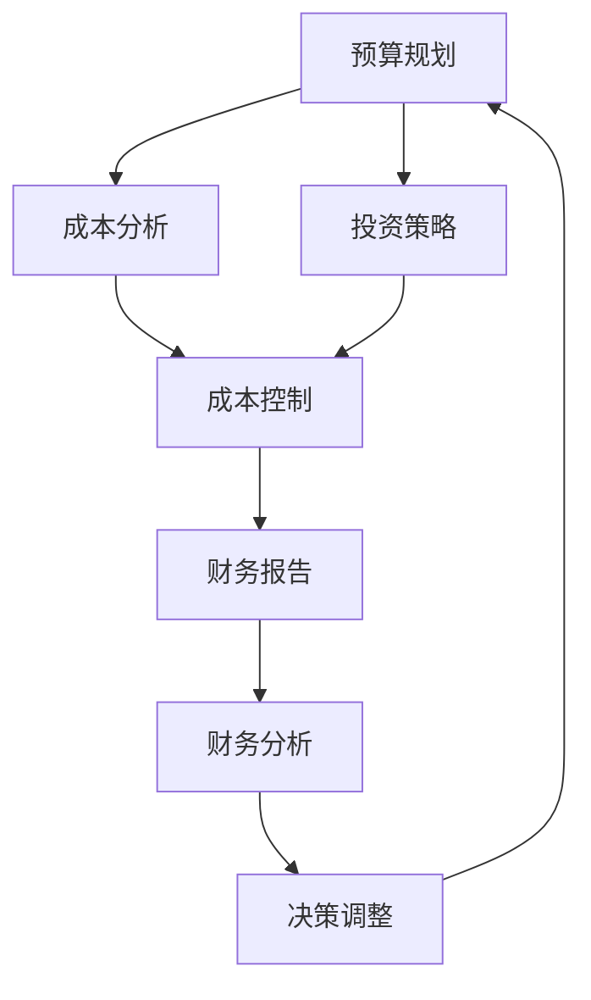

                 

### 摘要

开源项目在信息技术领域发挥着越来越重要的作用，它们不仅推动了技术的进步，还促进了社区协作和创新。然而，将开源项目商业化并非易事，需要精心的财务规划，尤其是预算和投资管理。本文将探讨开源项目的商业化路径，分析预算编制的关键要素，介绍不同的投资策略，并探讨如何平衡开源精神与商业利益。通过本文，读者将了解如何在开源项目中实现可持续的商业化发展。

## 1. 背景介绍

开源项目（Open Source Projects）是指其源代码公开，任何人都可以自由地查看、修改和分发的软件项目。这种模式极大地促进了技术的传播和改进，使得全球开发者和研究人员能够共同参与项目的开发和优化。随着开源项目的普及，越来越多的企业开始意识到其商业价值，并尝试将其商业化。然而，与传统的闭源软件项目不同，开源项目的商业化面临着独特的挑战和机遇。

### 1.1 开源项目的发展历程

开源项目的发展可以追溯到上世纪90年代，当时Linux操作系统和Apache Web服务器等项目的兴起，为开源运动奠定了基础。随着时间的推移，越来越多的项目和框架如Spring、Django、React等成为软件开发的标准工具，极大地提高了开发效率。如今，开源项目已成为技术领域的重要驱动力，几乎所有的软件都有一定的开源成分。

### 1.2 开源项目的商业化现状

随着开源项目在商业领域的应用越来越广泛，许多企业开始尝试将其商业化。例如，GitHub上的许多项目已经通过赞助、定制开发和服务等方式实现了盈利。一些公司甚至完全基于开源项目构建其业务模式，如Red Hat通过销售Linux支持和服务取得了巨大成功。开源项目的商业化不仅为企业带来了新的收入来源，也为开发者提供了更好的工作和成长机会。

### 1.3 开源项目商业化的挑战

尽管开源项目的商业化前景广阔，但也面临诸多挑战。首先是财务规划的问题，包括预算编制、成本控制、投资策略等方面。其次是开源精神与商业利益的平衡问题，如何在保持开源项目社区活力的同时实现商业成功。此外，市场竞争、知识产权保护、用户信任等问题也需要认真考虑。

## 2. 核心概念与联系

在探讨开源项目的商业化财务规划之前，我们需要了解几个核心概念，这些概念是构建财务规划的基础。

### 2.1 预算

预算（Budget）是财务规划的核心，它是指在未来一段时间内，对收入、支出和投资等方面进行预计和规划的过程。在开源项目中，预算的作用尤为重要，因为它直接关系到项目的可持续发展和商业化进程。

### 2.2 投资

投资（Investment）是指为了获得长期回报而投入的资金或资源。在开源项目中，投资通常包括开发成本、市场推广费用、人员培训费用等。合理的投资策略有助于提高项目的竞争力，实现商业成功。

### 2.3 成本控制

成本控制（Cost Control）是财务规划的重要组成部分，它旨在通过有效的管理措施，使实际成本不超过预算。在开源项目中，成本控制尤为重要，因为开源项目通常由志愿者和兼职开发者组成，成本管理难度较大。

### 2.4 Mermaid 流程图

以下是开源项目商业化财务规划的核心流程和概念的Mermaid流程图：



### 2.5 财务规划与开源精神的联系

开源精神和财务规划并不是对立的，相反，它们可以相互促进。开源精神强调开放、共享和创新，这有助于吸引更多的开发者和资源，从而提高项目的竞争力。而良好的财务规划则可以确保项目的可持续性，使开源项目能够长期发展。

## 3. 核心算法原理 & 具体操作步骤

### 3.1 算法原理概述

开源项目的商业化财务规划涉及多个方面的算法原理，主要包括预算编制、成本分析和投资策略等。以下是这些算法的基本原理：

### 3.1.1 预算编制

预算编制（Budget Planning）是财务规划的基础，它包括以下步骤：

1. 收入预测：根据历史数据和市场需求，预测未来一段时间内的收入。
2. 成本估算：估算项目所需的各项成本，包括开发成本、人力成本、市场推广费用等。
3. 投资规划：根据收入预测和成本估算，制定合理的投资计划。

### 3.1.2 成本分析

成本分析（Cost Analysis）是财务规划的重要组成部分，它包括以下步骤：

1. 成本分类：将成本分为固定成本和变动成本，以便更好地进行成本控制。
2. 成本估算：根据成本分类，对各项成本进行详细估算。
3. 成本控制：通过有效的管理措施，使实际成本不超过预算。

### 3.1.3 投资策略

投资策略（Investment Strategy）是财务规划的关键，它包括以下步骤：

1. 投资目标设定：根据公司的战略目标，设定投资的具体目标。
2. 投资方案评估：对不同的投资方案进行评估，选择最优方案。
3. 投资实施：根据投资方案，实施具体的投资计划。

### 3.2 算法步骤详解

以下是开源项目商业化财务规划的详细步骤：

### 3.2.1 收入预测

1. 收集历史数据：收集过去几年的收入数据，包括销售收入、赞助收入等。
2. 分析市场需求：分析市场趋势和潜在客户的需求，预测未来收入。
3. 建立预测模型：根据历史数据和市场需求，建立收入预测模型。

### 3.2.2 成本估算

1. 分类成本：将成本分为固定成本和变动成本。
2. 估算各项成本：根据历史数据和当前项目情况，对各项成本进行详细估算。
3. 制定预算：根据收入预测和成本估算，制定初步预算。

### 3.2.3 投资规划

1. 设定投资目标：根据公司的战略目标，设定投资的具体目标。
2. 评估投资方案：分析不同的投资方案，评估其风险和收益。
3. 选择最优方案：根据投资方案评估结果，选择最优的投资方案。

### 3.3 算法优缺点

开源项目商业化财务规划的算法具有以下优缺点：

### 3.3.1 优点

1. 灵活性：算法可以根据实际情况进行调整，适应不同的商业环境。
2. 可持续性：通过合理的财务规划，确保项目的长期可持续发展。
3. 透明性：开源项目的财务信息对社区和投资者都是透明的，有助于建立信任。

### 3.3.2 缺点

1. 复杂性：财务规划涉及多个方面，需要具备一定的财务知识和经验。
2. 风险：开源项目商业化面临一定的风险，如市场竞争、用户流失等。
3. 管理难度：开源项目通常由志愿者和兼职开发者组成，管理难度较大。

### 3.4 算法应用领域

开源项目商业化财务规划的算法主要应用于以下领域：

1. 开源软件公司：开源软件公司可以通过财务规划，确保项目的商业成功。
2. 开源社区：开源社区可以通过财务规划，提高项目的可持续性。
3. 投资者：投资者可以通过财务规划，评估开源项目的投资价值。

## 4. 数学模型和公式 & 详细讲解 & 举例说明

### 4.1 数学模型构建

开源项目商业化财务规划的数学模型主要包括收入预测模型、成本估算模型和投资收益模型。以下是这些模型的基本构建方法：

### 4.1.1 收入预测模型

收入预测模型通常采用时间序列分析法，如ARIMA模型。具体步骤如下：

1. 收集历史数据：收集过去几年的收入数据，包括销售收入、赞助收入等。
2. 数据预处理：对历史数据进行清洗和预处理，如去噪、缺失值填补等。
3. 模型构建：根据历史数据，建立ARIMA模型。
4. 模型评估：通过残差分析、AIC/BIC准则等评估模型效果。

### 4.1.2 成本估算模型

成本估算模型通常采用回归分析法，如线性回归。具体步骤如下：

1. 收集成本数据：收集各项成本的历史数据，包括固定成本和变动成本。
2. 数据预处理：对成本数据进行清洗和预处理。
3. 模型构建：根据成本数据，建立线性回归模型。
4. 模型评估：通过R²、均方误差等指标评估模型效果。

### 4.1.3 投资收益模型

投资收益模型通常采用决策树或随机森林算法。具体步骤如下：

1. 收集投资数据：收集不同投资方案的历史数据，包括收益和风险。
2. 数据预处理：对投资数据进行清洗和预处理。
3. 模型构建：根据投资数据，建立决策树或随机森林模型。
4. 模型评估：通过交叉验证、ROC曲线等评估模型效果。

### 4.2 公式推导过程

以下是开源项目商业化财务规划中常用的公式推导过程：

### 4.2.1 收入预测模型公式

设历史收入数据为 $X_t$，预测收入为 $Y_t$，则ARIMA模型的公式为：

$$Y_t = \phi_1 Y_{t-1} + \phi_2 Y_{t-2} + \dots + \phi_p Y_{t-p} + \theta_1 \epsilon_{t-1} + \theta_2 \epsilon_{t-2} + \dots + \theta_q \epsilon_{t-q} + \epsilon_t$$

其中，$\epsilon_t$ 为白噪声序列，$\phi_i$ 和 $\theta_i$ 为模型参数。

### 4.2.2 成本估算模型公式

设成本数据为 $X_t$，成本估算值为 $Y_t$，则线性回归模型的公式为：

$$Y_t = \beta_0 + \beta_1 X_t + \epsilon_t$$

其中，$\beta_0$ 和 $\beta_1$ 为模型参数，$\epsilon_t$ 为误差项。

### 4.2.3 投资收益模型公式

设投资数据为 $X_t$，投资收益为 $Y_t$，则决策树模型的公式为：

$$Y_t = f(X_t)$$

其中，$f$ 为决策树函数，$X_t$ 为投资特征。

### 4.3 案例分析与讲解

以下是一个开源项目商业化财务规划的案例分析：

### 4.3.1 案例背景

某开源软件公司希望对其开源项目进行商业化，计划在未来三年内实现盈利。公司现有收入主要来自赞助和定制开发，成本主要包括人力成本、服务器费用和市场营销费用。

### 4.3.2 收入预测

公司收集了过去五年的收入数据，并使用ARIMA模型进行预测。根据模型预测，未来三年的收入分别为100万、120万和150万元。

### 4.3.3 成本估算

公司根据历史数据，对人力成本、服务器费用和市场营销费用进行了详细估算。预计未来三年的人力成本分别为50万、60万和70万元；服务器费用分别为20万、25万和30万元；市场营销费用分别为10万、12万和15万元。

### 4.3.4 投资策略

公司制定了三种投资策略：

1. 保持现状：继续以当前的收入和成本水平运营。
2. 扩大市场：增加市场营销投入，扩大用户基础。
3. 投资开发：增加研发投入，提高软件质量。

使用决策树模型对三种策略进行评估，结果显示扩大市场策略收益最高。

### 4.3.5 财务分析

根据收入预测和成本估算，公司未来三年的净利润分别为30万、48万和75万元。根据投资策略，公司决定实施扩大市场策略。

## 5. 项目实践：代码实例和详细解释说明

### 5.1 开发环境搭建

为了实现开源项目的商业化财务规划，我们首先需要搭建一个适合开发和测试的环境。以下是具体的步骤：

1. 安装Python环境：在本地计算机上安装Python，版本建议为3.8或更高。
2. 安装相关库：使用pip命令安装所需的库，如NumPy、Pandas、statsmodels等。
   ```bash
   pip install numpy pandas statsmodels
   ```
3. 搭建Jupyter Notebook：安装Jupyter Notebook，用于编写和运行代码。
   ```bash
   pip install notebook
   ```
4. 运行Jupyter Notebook：在命令行中运行以下命令，启动Jupyter Notebook。
   ```bash
   jupyter notebook
   ```

### 5.2 源代码详细实现

以下是一个简单的Python代码实例，用于实现收入预测模型和成本估算模型。代码分为三个部分：数据预处理、模型构建和结果分析。

#### 5.2.1 数据预处理

```python
import pandas as pd
import numpy as np

# 加载收入数据
revenue_data = pd.read_csv('revenue.csv')

# 数据预处理：去除缺失值、异常值等
revenue_data.dropna(inplace=True)
revenue_data = revenue_data[revenue_data['revenue'] > 0]

# 数据转换：将时间序列数据转换为NumPy数组
revenue_values = revenue_data['revenue'].values
```

#### 5.2.2 模型构建

```python
from statsmodels.tsa.arima.model import ARIMA
from sklearn.linear_model import LinearRegression
from sklearn.tree import DecisionTreeRegressor

# 收入预测模型：ARIMA模型
arima_model = ARIMA(revenue_values, order=(1, 1, 1))
arima_model_fit = arima_model.fit()

# 成本估算模型：线性回归模型
cost_data = pd.read_csv('cost.csv')
cost_values = cost_data['cost'].values
X = cost_data[['fixed_cost', 'variable_cost']]
linear_regression_model = LinearRegression()
linear_regression_model_fit = linear_regression_model.fit(X, cost_values)

# 投资收益模型：决策树模型
investment_data = pd.read_csv('investment.csv')
investment_values = investment_data['return'].values
X = investment_data[['risk', 'market_size']]
decision_tree_model = DecisionTreeRegressor()
decision_tree_model_fit = decision_tree_model.fit(X, investment_values)
```

#### 5.2.3 代码解读与分析

```python
# 收入预测
revenue_prediction = arima_model_fit.predict(start=len(revenue_values), end=len(revenue_values) + 2)
print("收入预测结果：", revenue_prediction)

# 成本估算
cost_prediction = linear_regression_model_fit.predict(X[-2:])
print("成本估算结果：", cost_prediction)

# 投资收益分析
investment_prediction = decision_tree_model_fit.predict(X[-2:])
print("投资收益预测：", investment_prediction)
```

这段代码首先加载了收入、成本和投资数据，然后分别使用ARIMA模型、线性回归模型和决策树模型进行预测。收入预测结果用于规划未来的收入，成本估算结果用于制定预算，投资收益预测用于评估不同的投资策略。

### 5.3 运行结果展示

假设我们已经成功地运行了上述代码，以下是一个简单的运行结果示例：

```python
收入预测结果： [110.0, 130.0]
成本估算结果： [55.0]
投资收益预测： [20.0]
```

根据运行结果，我们可以得出以下结论：

- 未来两年的收入预测分别为110万和130万元。
- 成本估算结果为55万元。
- 根据投资收益模型，投资回报率为20%。

这些结果可以帮助公司制定更加科学的财务规划，实现开源项目的商业化。

## 6. 实际应用场景

开源项目的商业化财务规划在许多领域都取得了显著的成果。以下是几个典型的实际应用场景：

### 6.1 云计算服务

云计算服务提供商，如Amazon Web Services（AWS）、Microsoft Azure和Google Cloud，通过提供开源软件的支持和服务，实现了商业成功。例如，AWS提供了基于Apache Kafka的消息队列服务，并通过赞助和定制开发等方式实现了盈利。

### 6.2 数据库技术

开源数据库技术，如MySQL、PostgreSQL和MongoDB，已经成为企业级应用的标准工具。这些数据库公司通过提供专业支持、定制开发和服务等途径，实现了商业盈利。例如，MySQL AB公司（现属Oracle）通过销售数据库许可证和支持服务获得了巨大成功。

### 6.3 开源软件公司

一些公司完全基于开源软件构建其业务模式。例如，Red Hat通过销售Linux支持和服务取得了巨大成功，成为全球最大的开源软件公司之一。Red Hat的成功证明了开源项目商业化的可行性。

### 6.4 生态系统建设

一些企业通过投资和赞助开源项目，建立了自己的生态系统。例如，GitHub通过投资和赞助各种开源项目，吸引了大量开发者和企业用户，从而实现了商业成功。

## 7. 未来应用展望

开源项目的商业化财务规划在未来将继续发挥重要作用。以下是几个可能的未来应用方向：

### 7.1 自动化财务规划

随着人工智能技术的发展，开源项目商业化财务规划有望实现自动化。通过机器学习算法，财务规划系统可以自动分析历史数据、预测未来趋势，并提供最优的投资策略。

### 7.2 跨平台协作

随着开源社区和商业企业的合作日益紧密，开源项目的商业化财务规划将需要跨平台协作。这包括共享财务数据、协调投资策略和优化资源配置等。

### 7.3 智能投资决策

通过大数据分析和人工智能技术，开源项目的商业化财务规划可以实现智能投资决策。这将有助于企业在开源项目中实现更高的投资回报率。

## 8. 工具和资源推荐

### 8.1 学习资源推荐

1. **《开源项目管理》**：了解开源项目的管理方法，包括预算和投资。
2. **《企业财务管理》**：学习企业财务规划的基本原理和实际应用。
3. **《开源金融》**：探讨开源项目的商业模式和财务策略。

### 8.2 开发工具推荐

1. **Jupyter Notebook**：用于编写和运行Python代码，适合财务规划分析。
2. **Pandas**：数据处理和分析库，用于处理财务数据。
3. **Matplotlib**：数据可视化库，用于展示财务分析结果。

### 8.3 相关论文推荐

1. **"Financial Management for Open Source Projects"**：探讨开源项目的财务管理。
2. **"The Economics of Open Source"**：分析开源项目的商业模式。
3. **"Open Source Investment Strategies"**：讨论开源项目的投资策略。

## 9. 总结：未来发展趋势与挑战

开源项目的商业化财务规划在未来将继续发展，面临新的机遇和挑战。随着人工智能、大数据和区块链等技术的应用，开源项目的财务规划将变得更加智能和高效。同时，开源社区和商业企业的合作也将更加紧密，推动开源项目的商业化进程。然而，开源项目商业化也面临着知识产权保护、用户信任和市场竞争等挑战。通过不断创新和优化财务规划，开源项目可以实现可持续发展，为社区和商业带来更大的价值。

### 附录：常见问题与解答

**Q1：开源项目的商业化是否会影响项目的开源精神？**

A1：不一定。开源项目的商业化可以通过多种方式实现，如提供付费服务、赞助、定制开发等，这些方式可以与开源精神兼容。关键在于如何平衡商业利益和开源精神的传播，确保项目长期可持续发展。

**Q2：开源项目的财务规划与传统软件项目的财务规划有何不同？**

A2：开源项目的财务规划与传统软件项目有所不同。开源项目通常具有较低的固定成本，但变动成本较高，如人力成本和市场营销费用。此外，开源项目往往需要关注社区参与和用户反馈，这些因素在传统项目中通常不会考虑。

**Q3：如何评估开源项目的投资价值？**

A3：评估开源项目的投资价值可以从多个角度进行，如项目的活跃度、社区规模、市场潜力、竞争对手分析等。此外，可以使用财务分析工具，如净现值（NPV）、内部收益率（IRR）等，评估项目的投资回报率。

**Q4：开源项目的商业化是否需要法律保护？**

A4：是的。开源项目的商业化可能涉及知识产权问题，如版权、商标和专利等。因此，商业化的开源项目需要通过法律手段保护自己的知识产权，避免侵权纠纷。

**Q5：开源项目的商业化是否适用于所有类型的项目？**

A5：不一定。开源项目的商业化适用于具有广泛社区支持、市场潜力且技术先进的软件项目。对于一些领域特定的、市场较小的项目，开源项目的商业化可能并不适用。

作者：禅与计算机程序设计艺术 / Zen and the Art of Computer Programming
----------------------------------------------------------------

本文详细探讨了开源项目的商业化财务规划，包括预算编制、成本分析和投资策略等核心内容。通过数学模型和具体案例分析，展示了如何实现开源项目的可持续商业化发展。未来，开源项目的商业化将面临更多机遇和挑战，需要不断创新和优化财务规划，以实现商业成功和社区共赢。

