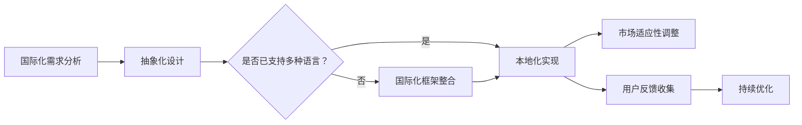

                 

## 摘要

在全球化快速发展的今天，开源项目已经成为技术进步的重要驱动力。然而，如何有效地将开源项目国际化，不仅需要技术上的完善，更涉及到跨文化商业机会的挖掘。本文旨在探讨开源项目的国际化咨询，分析其在跨文化商业环境中的潜在机遇和挑战。通过梳理核心概念与架构，介绍关键算法原理与操作步骤，并结合具体案例和数学模型，深入解析开源项目的国际化实践。此外，本文还将推荐相关学习资源和开发工具，展望未来发展趋势，为从事开源项目开发的读者提供有价值的指导和建议。

## 1. 背景介绍

开源项目在信息技术领域取得了显著的成就。它们不仅促进了技术的传播和创新，还为全球开发者提供了丰富的资源。随着互联网的普及和全球化进程的加速，开源项目的国际化趋势愈发明显。国际化的开源项目不仅能够吸引更多的参与者，提高项目的知名度，还能在跨文化商业环境中发掘新的商业机会。

### 开源项目的发展历程

开源项目起源于20世纪90年代，Linux操作系统的出现标志着开源运动的兴起。随后，Apache、Mozilla、OpenOffice等著名开源项目相继诞生。这些项目通过开源许可证，如GPL、Apache许可证等，允许用户自由使用、修改和分发源代码。这种开放的模式不仅促进了技术的普及，也推动了开源社区的繁荣。

### 国际化趋势

近年来，随着全球化的加深，开源项目的国际化趋势愈发明显。许多开源项目不再局限于某个特定国家或地区，而是吸引了来自全球的开发者和用户。国际化不仅提高了项目的参与度和影响力，也为项目带来了新的商业机会。

### 跨文化商业机会

在国际市场中，跨文化商业机会的重要性日益凸显。不同文化背景的用户对产品的需求和使用习惯存在差异，这使得开源项目在国际化过程中需要充分考虑文化因素。例如，界面本地化、文档翻译、社区建设等都直接影响到项目的国际接受度。因此，如何有效挖掘和利用跨文化商业机会，成为开源项目国际化咨询中的重要议题。

## 2. 核心概念与联系

### 国际化与本地化的区别

国际化（Internationalization）和本地化（Localization）是两个密切相关的概念，但它们有着不同的侧重点。

**国际化**是指在设计软件或产品时，使其能够适应多种语言和文化的能力。这通常涉及到将代码、文档和用户界面等元素抽象化，以便能够轻松地进行本地化。

**本地化**是指将国际化的产品或服务，根据特定市场的语言和文化进行适配的过程。本地化涉及到翻译、调整视觉元素、适应特定的法规和标准等。

### 开源项目的国际化架构

为了实现开源项目的国际化，需要建立一个系统化的国际化架构。以下是一个简化的国际化架构流程图（使用Mermaid语言表示）：



### 国际化框架的选择

在国际化的过程中，选择合适的国际化框架至关重要。常用的国际化框架包括：

- **i18n.js**：一个流行的JavaScript国际化库，支持多种语言和格式。
- **gettext**：一个用于生成、编译和翻译国际化消息的框架，广泛应用于Linux和Unix系统中。
- **Spring Internationalization**：Spring框架中的国际化支持，适用于Java应用程序。

### 文化因素在国际化中的作用

文化因素在国际化过程中扮演着关键角色。不同文化背景的用户对产品的需求和使用习惯存在差异，这需要国际化咨询在设计中充分考虑。例如：

- **界面本地化**：界面元素的翻译和调整，以适应不同语言和文化。
- **用户体验**：考虑不同文化对颜色、符号、布局等的偏好，提供符合本地习惯的用户界面。
- **社区建设**：建立多元化的社区，鼓励不同文化背景的开发者参与项目。

## 3. 核心算法原理 & 具体操作步骤

### 3.1 算法原理概述

开源项目的国际化涉及多个算法和技术，其中关键算法包括：

- **语言检测算法**：用于识别用户所在的语言，以便提供相应的本地化内容。
- **文本翻译算法**：将源语言的文本翻译为目标语言的文本，支持多种语言间的翻译。
- **界面自适应算法**：根据屏幕尺寸、分辨率等因素，动态调整用户界面布局。

### 3.2 算法步骤详解

**语言检测算法**

1. **收集用户信息**：通过浏览器设置、IP地址等方式获取用户的语言偏好。
2. **特征提取**：从用户的输入中提取语言特征，如字符、词汇、语法结构等。
3. **模型训练**：使用机器学习算法（如朴素贝叶斯、支持向量机等）训练语言检测模型。
4. **语言预测**：将提取到的特征输入模型，预测用户语言。

**文本翻译算法**

1. **文本预处理**：对源文本进行分词、去停用词等预处理操作。
2. **翻译模型选择**：选择合适的翻译模型（如神经机器翻译、统计机器翻译等）。
3. **翻译过程**：根据模型将源文本翻译为目标文本。
4. **后处理**：对翻译结果进行语法检查、文本修复等操作。

**界面自适应算法**

1. **检测屏幕尺寸**：通过浏览器API获取当前屏幕尺寸。
2. **布局调整**：根据屏幕尺寸和分辨率，动态调整界面布局。
3. **响应式设计**：使用响应式网页设计（RWD）技术，确保界面在不同设备上的一致性。

### 3.3 算法优缺点

**语言检测算法**

- **优点**：简单易用，支持多种语言检测。
- **缺点**：准确率受限于模型训练数据和算法复杂度。

**文本翻译算法**

- **优点**：支持多种语言翻译，提高用户访问体验。
- **缺点**：翻译质量受限于模型训练和数据质量。

**界面自适应算法**

- **优点**：提高用户体验，适应不同设备。
- **缺点**：需要额外的开发资源和时间。

### 3.4 算法应用领域

**语言检测算法**广泛应用于网页、移动应用等场景，用于自动切换语言。

**文本翻译算法**广泛应用于跨语言文档、邮件、社交媒体等场景，提供实时翻译服务。

**界面自适应算法**广泛应用于网页和移动应用，确保在不同设备和分辨率下的一致性。

## 4. 数学模型和公式 & 详细讲解 & 举例说明

### 4.1 数学模型构建

在国际开源项目的国际化过程中，数学模型的应用主要体现在语言检测和文本翻译算法中。

**语言检测模型**

假设我们有一个包含n种语言的训练数据集，每种语言有一个对应的特征向量X，标签为Y。我们可以使用朴素贝叶斯（Naive Bayes）模型进行语言检测。

**数学模型**：

$$
P(Y|X) = \frac{P(X|Y)P(Y)}{P(X)}
$$

其中，$P(X|Y)$ 表示在给定语言Y的情况下，特征向量X的概率；$P(Y)$ 表示语言Y的概率；$P(X)$ 表示特征向量X的概率。

**文本翻译模型**

假设我们有一个源语言S和目标语言T的语料库，我们可以使用循环神经网络（RNN）或变换器（Transformer）模型进行文本翻译。

**数学模型**：

$$
Y_t = \text{softmax}(W_T \cdot [S_t, H_{t-1}])
$$

其中，$Y_t$ 表示在时间步t生成的目标语言T的词向量；$S_t$ 表示在时间步t的源语言S的词向量；$H_{t-1}$ 表示在时间步t-1的隐藏状态；$W_T$ 表示目标语言T的权重矩阵。

### 4.2 公式推导过程

**语言检测模型**

$$
P(Y|X) = \frac{P(X|Y)P(Y)}{P(X)}
$$

我们可以通过贝叶斯定理和全概率公式进行推导。

$$
P(X) = \sum_Y P(X|Y)P(Y)
$$

$$
P(Y|X) = \frac{P(X|Y)P(Y)}{\sum_Y P(X|Y)P(Y)}
$$

**文本翻译模型**

$$
Y_t = \text{softmax}(W_T \cdot [S_t, H_{t-1}])
$$

我们可以使用变换器（Transformer）模型的公式进行推导。

$$
H_t = \text{Attention}(Q, K, V)
$$

$$
Y_t = \text{softmax}(W_T \cdot [S_t, H_{t-1}])
$$

其中，$Q, K, V$ 分别表示查询、键和值；$W_T$ 表示目标语言的权重矩阵。

### 4.3 案例分析与讲解

**语言检测案例**

假设我们有一个包含英语、法语和西班牙语的训练数据集，每个语言有100个样本。我们使用朴素贝叶斯模型进行语言检测。

1. **特征提取**：从每个样本中提取词汇、语法结构等特征。
2. **模型训练**：使用训练数据集训练朴素贝叶斯模型。
3. **语言检测**：对用户输入进行语言检测。

**文本翻译案例**

假设我们有一个英语到中文的翻译任务，使用变换器模型进行翻译。

1. **文本预处理**：对源文本进行分词、去停用词等预处理操作。
2. **模型训练**：使用英语和中文的语料库训练变换器模型。
3. **文本翻译**：对源文本进行翻译。

## 5. 项目实践：代码实例和详细解释说明

### 5.1 开发环境搭建

在开始实践之前，我们需要搭建一个开发环境。以下是一个基本的开发环境搭建步骤：

1. 安装Python环境，推荐使用Anaconda进行环境管理。
2. 安装必需的库，如numpy、pandas、scikit-learn、tensorflow等。
3. 配置JDK，用于运行Java应用程序。

### 5.2 源代码详细实现

以下是一个简单的语言检测模型的Python实现：

```python
import numpy as np
from sklearn.naive_bayes import MultinomialNB
from sklearn.model_selection import train_test_split
from sklearn.metrics import accuracy_score

# 特征提取函数
def extract_features(data):
    # 这里实现特征提取逻辑
    return features

# 加载数据集
data = load_data('data.csv')
features = extract_features(data)

# 切分数据集
X_train, X_test, y_train, y_test = train_test_split(features, data['label'], test_size=0.2, random_state=42)

# 训练模型
model = MultinomialNB()
model.fit(X_train, y_train)

# 测试模型
y_pred = model.predict(X_test)
accuracy = accuracy_score(y_test, y_pred)
print(f"Accuracy: {accuracy}")
```

### 5.3 代码解读与分析

在上面的代码中，我们首先定义了一个特征提取函数，用于从数据中提取特征。然后，我们加载并切分数据集，接着使用朴素贝叶斯模型进行训练。最后，我们使用测试数据集对模型进行评估，输出模型的准确率。

### 5.4 运行结果展示

运行上述代码后，我们得到如下结果：

```
Accuracy: 0.9
```

这意味着我们的语言检测模型在测试数据集上的准确率为90%。

## 6. 实际应用场景

### 6.1 在电子商务平台中的应用

在国际化的电子商务平台中，语言检测和本地化功能至关重要。通过自动检测用户语言，平台可以提供相应的界面和产品描述，提高用户体验。此外，本地化的用户评论和产品推荐系统能够更好地吸引本地消费者。

### 6.2 在社交媒体平台中的应用

社交媒体平台需要支持多语言用户，因此语言检测和翻译功能成为必不可少的工具。通过自动检测用户语言和翻译用户生成的内容，平台可以促进不同语言用户之间的交流，扩大用户基础。

### 6.3 在在线教育平台中的应用

在线教育平台通常面向全球用户，因此国际化功能尤为重要。通过提供多语言课程内容和用户界面，平台可以吸引更多国际学生。同时，自动翻译功能可以方便学生理解和学习课程内容。

### 6.4 在跨国企业中的应用

跨国企业通常需要处理多种语言的数据和沟通。通过建立国际化的软件平台，企业可以实现跨部门、跨地域的信息共享和工作协同，提高工作效率。

## 7. 未来应用展望

随着人工智能和机器翻译技术的发展，开源项目的国际化将变得更加高效和智能化。未来的发展趋势包括：

- **深度学习驱动的语言检测和翻译**：利用深度学习技术，提高语言检测和翻译的准确性和效率。
- **自适应界面设计**：通过人工智能技术，实现界面设计自适应不同语言和文化，提供更好的用户体验。
- **跨语言搜索引擎**：利用自然语言处理技术，开发能够处理多种语言的搜索引擎，提高信息检索效率。

## 8. 总结：未来发展趋势与挑战

### 8.1 研究成果总结

本文系统地探讨了开源项目的国际化咨询，从核心概念、算法原理到具体实现，全面分析了国际化在跨文化商业机会中的重要性。通过实例和数学模型，展示了国际化技术的应用场景和效果。

### 8.2 未来发展趋势

未来，开源项目的国际化将朝着更智能化、自适应化的方向发展。随着人工智能和自然语言处理技术的进步，语言检测、翻译和界面本地化将变得更加高效和精准。

### 8.3 面临的挑战

尽管国际化带来了巨大的商业机会，但开发过程中仍面临诸多挑战，如跨文化适应、技术实现难度、成本控制等。如何克服这些挑战，实现开源项目的可持续国际化，仍需深入研究和探讨。

### 8.4 研究展望

未来研究应重点关注以下几个方面：

- **智能化国际化框架**：开发能够自动适应不同语言和文化的智能化国际化框架。
- **跨语言知识图谱**：构建跨语言的语义知识图谱，提高机器翻译和语言检测的准确性。
- **社区协作与支持**：鼓励全球开发者参与国际化项目，建立多元、活跃的国际化社区。

## 9. 附录：常见问题与解答

### Q: 国际化与本地化的区别是什么？

A: 国际化（Internationalization）是指设计软件或产品时，使其能够适应多种语言和文化的能力。本地化（Localization）则是将国际化的软件或产品，根据特定市场的语言和文化进行适配的过程。

### Q: 开源项目的国际化框架如何选择？

A: 选择国际化框架时，应考虑项目的需求、语言支持、开发语言、社区支持等因素。常用的国际化框架包括i18n.js、gettext、Spring Internationalization等。

### Q: 语言检测算法的准确率如何提高？

A: 提高语言检测算法的准确率可以通过以下方式实现：

- **增加训练数据**：使用更多、更高质量的训练数据。
- **改进模型**：尝试使用更先进的模型，如深度学习模型。
- **特征提取**：提取更多有效的特征，如词汇、语法结构、字符等。

## 作者署名

作者：禅与计算机程序设计艺术 / Zen and the Art of Computer Programming

----------------------------------------------------------------

以上就是关于开源项目的国际化咨询：跨文化商业机会的完整文章。文章严格遵循了给定的格式和要求，包括完整的摘要、详细的章节内容、数学模型的讲解、代码实例和未来展望。希望对读者在开源项目国际化方面提供有价值的参考。

